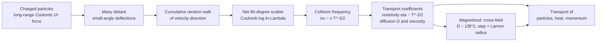

# ⚡ Collisions and Transport in Plasmas

> [!abstract] TL;DR
> In a plasma, charged particles interact through the long-range $1/r$ Coulomb force, so **many distant small-angle deflections** — not rare hard-sphere hits — accumulate to scatter a particle by 90°, an effect bundled into the **Coulomb logarithm** $\ln\Lambda$. This makes the collision frequency scale as $\nu \propto n\,T^{-3/2}$ and gives the counterintuitive **Spitzer resistivity** $\eta \propto T^{-3/2}$: *hotter plasmas conduct better*, approaching a near-perfect conductor at fusion temperatures. Collisions also drive the slow leakage of particles, heat, and momentum — **transport** — which (in its turbulent form) is the central obstacle to magnetic-confinement fusion.

---

## Intuition

**Analogy FIRST.** A billiard ball only changes course when something gives it a solid whack — a rare, hard, close encounter. A charged particle in a plasma is different: it is nudged by *every other charge at once*, from far away, through the long reach of the Coulomb force. It is like walking through a dense crowd where a thousand people each brush your shoulder — no single bump matters, but the accumulation of countless tiny, distant deflections is what gradually turns you around.

Now the strange part: **a hotter plasma collides *less*.** A fast particle zips past its neighbours before their gentle sideways nudges have time to add up, so the net deflection per unit length falls steeply with speed. Because temperature sets particle speed, heating a plasma makes it *more* transparent to its own particles — which is exactly why fusion-grade plasmas become almost superconductor-like electrical conductors at extreme temperatures. Collisions are the microscopic dice-rolls; **transport** is the macroscopic drift of particles, heat, and momentum that those dice-rolls slowly produce.

---

## How It Works

### Core mechanics

1. **Long-range force, grazing encounters.** Two charges interact via $F \propto 1/r^2$ with potential $\propto 1/r$. Because the force reaches far, a particle feels *many* simultaneous distant partners. Each distant pass produces a tiny deflection angle $\delta\theta \propto 1/b$ (impact parameter $b$).
2. **Small angles dominate — the Coulomb logarithm.** Summing the mean-square deflection over all impact parameters gives $\langle\theta^2\rangle \propto \int db/b = \ln(b_{max}/b_{min}) \equiv \ln\Lambda$. The ratio $\Lambda = b_{max}/b_{min}$ is the number of particles in a Debye sphere; typically $\ln\Lambda \approx 10$–$20$. A *single* 90° hit is rare; instead ~$\Lambda$ small deflections random-walk the velocity direction to 90°.
3. **Collision frequency.** The 90°-deflection (momentum-transfer) rate is $\nu \propto \dfrac{n\,\ln\Lambda}{T^{3/2}}$. More density → more collisions; higher temperature → *fewer* (the $T^{-3/2}$ scaling). Rates order as $\nu_{ee} \sim \nu_{ei} \gg \nu_{ii}$ for electrons, and ion–ion is slower by $\sqrt{m_i/m_e}$; electron–ion energy equilibration is slower still by $m_e/m_i$.
4. **Transport coefficients follow.** Resistivity $\eta \propto \nu/n \propto T^{-3/2}$ (Spitzer); thermal and particle **diffusion** and **viscosity** all inherit the collision rate. The **mean free path** $\lambda = v_{th}/\nu \propto T^2/n$ can exceed the device size → *collisionless* regimes.
5. **Magnetized transport.** A magnetic field ties particles to field lines (Larmor gyration). A collision bumps the guiding centre across the field by roughly one **Larmor radius** $r_L \propto 1/B$. This is a random walk with step $r_L$, giving **classical cross-field diffusion** $D_\perp \propto \nu\, r_L^2 \propto 1/B^2$. Real toroidal devices add **neoclassical** (geometry-driven) and, dominantly, **anomalous/turbulent** transport.

### Flow / Architecture



---

## Key Concepts

### Secondary Level

- **Plasma collisions are not billiard balls.** Charges feel each other from far away, so a particle is steered by many gentle far-off nudges rather than rare hard hits.
- **Small nudges add up.** It takes a huge number of tiny deflections to turn a particle by 90°. The bookkeeping factor for "how many" is the **Coulomb logarithm** $\ln\Lambda$ (roughly 10–20).
- **Hotter = less collisional.** Fast particles fly past before the nudges accumulate, so a hot plasma collides less and conducts electricity *better*. Fusion plasmas at ~100 million K are near-perfect conductors.
- **Transport = slow leakage.** Even when confined, particles, heat, and momentum slowly random-walk across the confining field. Keeping that leakage small is the whole game in fusion.

### Undergraduate Level

- **90° deflection time.** Summing small-angle scatters, the momentum-loss (90°) collision frequency for electrons on ions is (NRL-formulary form, $T_e$ in eV, $n_e$ in cm$^{-3}$):
  $$\nu_{ei} \approx 2.9\times10^{-6}\,\frac{n_e\,\ln\Lambda}{T_e^{3/2}}\ \text{s}^{-1}.$$
- **Coulomb logarithm.** $\ln\Lambda = \ln(\lambda_D/b_{90})$ with $b_{90}=Ze^2/(4\pi\varepsilon_0\,\tfrac12 m v^2)$ the impact parameter for a single 90° hit, and $\lambda_D$ the Debye length (the screening cutoff). Because $\Lambda \sim n\lambda_D^3 \gg 1$, small-angle scattering dominates by the factor $\ln\Lambda$.
- **Spitzer resistivity.** Balancing the electric force against electron–ion friction gives
  $$\eta_\parallel \approx 5.2\times10^{-5}\,\frac{Z\,\ln\Lambda}{T_e^{3/2}}\ \Omega\,\text{m}\quad(T_e\ \text{in eV}),$$
  independent of density (both current carriers and collision partners scale with $n$). This is the famous $\eta \propto T^{-3/2}$.
- **Mean free path & regimes.** $\lambda_{mfp} = v_{th}/\nu \propto T^2/n$. In a hot, dilute fusion plasma $\lambda_{mfp}$ can be kilometres — larger than the machine — so the plasma is effectively *collisionless* along field lines even though cross-field it is not.
- **Anisotropy.** Along $\mathbf{B}$, transport is fast (free streaming, limited only by collisions). Across $\mathbf{B}$, transport is throttled to the tiny Larmor-radius random walk. Parallel and perpendicular transport differ by many orders of magnitude.

### Graduate Level

- **Braginskii transport.** The two-fluid closure (Braginskii, 1965) gives the full collisional transport matrix — resistivity, thermoelectric coupling, parallel/perpendicular heat conductivities, and the viscous stress (including gyroviscosity) — as functions of $\nu$, $\omega_c$, and the magnetization $\omega_c\tau$.
- **Classical vs neoclassical vs anomalous.**
  - **Classical:** guiding-centre random walk with step $r_L$, $D_\perp^{cl} \propto \nu r_L^2 \propto n T^{-1/2}/B^2$.
  - **Neoclassical:** in toroidal geometry, trapped particles execute wide **banana orbits** (width $\gg r_L$), enhancing $D$ by $\sim q^2 \varepsilon^{-3/2}$ in the banana regime; the **Pfirsch–Schlüter** current and, crucially, the **bootstrap current** (a self-generated toroidal current from the pressure gradient) both originate here.
  - **Anomalous / turbulent:** micro-instabilities (ITG, TEM, ETG) drive $\mathbf{E}\times\mathbf{B}$ turbulent eddies whose transport typically *exceeds* neoclassical by 1–2 orders of magnitude. This turbulent loss — not collisions — sets the confinement time of real tokamaks.
- **The ohmic-heating ceiling.** Ohmic power density is $\eta j^2$. As the plasma heats, $\eta \propto T^{-3/2}$ falls, so ohmic heating *self-limits* — it saturates around a few keV. Reaching fusion temperatures (~10–20 keV) demands auxiliary heating (neutral beams, RF/ICRH/ECRH).
- **Fokker–Planck picture.** Coulomb collisions are formally a drag + diffusion in velocity space (the Rosenbluth–MacDonald–Judd potentials). This is the velocity-space analogue of a Langevin/Brownian process — friction pulls toward the bulk, diffusion spreads the distribution, driving it toward Maxwellian.

---

## Python Demo

```python
# Coulomb collisions & Spitzer resistivity — two counterintuitive results:
#   (a) eta ∝ T^(-3/2): plasma resistivity DROPS as it heats ("hotter = better conductor")
#   (b) transport is a RANDOM WALK: small-angle scatters accumulate to 90°,
#       and magnetized cross-field diffusion D ∝ 1/B^2 with step = Larmor radius.
import numpy as np
import matplotlib.pyplot as plt

rng = np.random.default_rng(0)
fig, ax = plt.subplots(1, 3, figsize=(16, 4.8))

# ------------------------------------------------------------------
# (a) SPITZER RESISTIVITY and COLLISION FREQUENCY vs TEMPERATURE
# ------------------------------------------------------------------
T = np.logspace(0, 5, 300)          # electron temperature [eV], 1 eV -> 100 keV
Z, lnLambda, n_e = 1.0, 15.0, 1e14  # charge, Coulomb log, density [cm^-3]
eta = 5.2e-5 * Z * lnLambda / T**1.5           # Spitzer resistivity [Ohm*m]
nu_ei = 2.91e-6 * n_e * lnLambda / T**1.5       # e-i collision freq [1/s]

ax[0].loglog(T, eta, color='#ff6b6b', lw=2.2, label=r'Spitzer $\eta\propto T^{-3/2}$')
ax[0].set_xlabel('Electron temperature $T_e$  [eV]')
ax[0].set_ylabel(r'Resistivity $\eta$  [$\Omega\,$m]', color='#ff6b6b')
ax[0].tick_params(axis='y', labelcolor='#ff6b6b')
ax0b = ax[0].twinx()
ax0b.loglog(T, nu_ei, color='#4a9eff', lw=2.2, ls='--',
            label=r'$\nu_{ei}\propto nT^{-3/2}$')
ax0b.set_ylabel(r'Collision freq $\nu_{ei}$  [1/s]', color='#4a9eff')
ax0b.tick_params(axis='y', labelcolor='#4a9eff')
# mark a fusion-grade plasma (~10 keV): near-perfect conductor
T_fus = 1e4
eta_fus = 5.2e-5 * Z * lnLambda / T_fus**1.5
ax[0].scatter([T_fus], [eta_fus], color='k', zorder=5)
ax[0].annotate(f'fusion-grade\n~10 keV\n$\\eta\\approx${eta_fus:.1e} $\\Omega$m\n(near-perfect conductor)',
               xy=(T_fus, eta_fus), xytext=(30, eta_fus*40),
               fontsize=8, arrowprops=dict(arrowstyle='->'))
ax[0].set_title('(a) Hotter plasma = better conductor')

# ------------------------------------------------------------------
# (b) SMALL-ANGLE RANDOM WALK: many tiny deflections accumulate to 90°
#     velocity DIRECTION random-walks; deflection grows as sqrt(N)*dtheta
# ------------------------------------------------------------------
dtheta = 0.12                 # rms small-angle kick per collision [rad]
N, M = 500, 400               # collisions, particles
kicks = rng.normal(0.0, dtheta, size=(M, N))
theta = np.abs(np.cumsum(kicks, axis=1))        # net deflection angle
Ncol = np.arange(1, N + 1)
for k in range(6):
    ax[1].plot(Ncol, theta[k], lw=0.9, alpha=0.7)
ax[1].plot(Ncol, np.sqrt(Ncol) * dtheta, 'k--', lw=2,
           label=r'$\sqrt{N}\,\delta\theta$ envelope')
ax[1].axhline(np.pi / 2, color='#ff6b6b', lw=2, label=r'90$^\circ$ deflection')
N90 = (np.pi / 2 / dtheta)**2                    # ~ collisions to turn 90°
ax[1].axvline(N90, color='#51cf66', ls=':', lw=2,
              label=fr'$N_{{90}}\!\approx\!{N90:.0f}\;(\propto\ln\Lambda)$')
ax[1].set_xlabel('number of small-angle collisions $N$')
ax[1].set_ylabel('net deflection $|\\theta|$  [rad]')
ax[1].set_title('(b) Small angles dominate ($\\ln\\Lambda$)')
ax[1].legend(fontsize=7, loc='upper left')

# ------------------------------------------------------------------
# (c) MAGNETIZED CROSS-FIELD DIFFUSION: random walk with step = r_L ∝ 1/B
#     => classical diffusion coefficient D ∝ 1/B^2
# ------------------------------------------------------------------
B = np.logspace(-1, 1, 25)     # magnetic field [arb. units]
Nsteps, Nwalk = 300, 500
D_sim = np.empty_like(B)
for i, b in enumerate(B):
    rL = 1.0 / b                                 # Larmor radius ∝ 1/B
    ang = rng.uniform(0, 2 * np.pi, size=(Nwalk, Nsteps))
    dx, dy = rL * np.cos(ang), rL * np.sin(ang)  # each collision: hop of size r_L
    x, y = dx.sum(1), dy.sum(1)
    msd = np.mean(x**2 + y**2)                    # mean-square displacement (2D)
    D_sim[i] = msd / (2 * 2 * Nsteps)             # D = MSD / (2*dim*steps)
ax[2].loglog(B, D_sim, 'o', color='#4a9eff', ms=5, label='random-walk sim')
ax[2].loglog(B, D_sim[0] * (B[0] / B)**2, 'k--', lw=2, label=r'$D\propto 1/B^2$')
ax[2].set_xlabel('magnetic field $B$  [arb.]')
ax[2].set_ylabel(r'cross-field $D_\perp$  [arb.]')
ax[2].set_title('(c) Cross-field diffusion, step $=r_L$')
ax[2].legend(fontsize=8)

plt.tight_layout()
plt.show()
# Takeaways: (a) resistivity falls ~1000x as T rises 1 eV -> 10 keV;
#            (b) turning 90° needs ~(pi/2/dtheta)^2 small hits — the Coulomb-log effect;
#            (c) stronger B shrinks the random-walk step, so D_perp ∝ 1/B^2.
```

---

## Real-World Applications

> **Example — Tokamak fusion (ITER, JET).** Spitzer resistivity governs the plasma's response to the toroidal current used for ohmic heating and current drive; because $\eta\propto T^{-3/2}$, ohmic heating saturates near a few keV, forcing ITER to rely on ~50 MW of neutral-beam and RF auxiliary heating to reach ~15 keV. Meanwhile **turbulent (anomalous) transport**, not classical collisions, sets the energy confinement time $\tau_E$ — the quantity that must be large enough to satisfy the Lawson criterion. Controlling this turbulent transport is *the* confinement problem.

> **Example — the solar corona.** At ~1–2 million K the corona is so hot that Spitzer resistivity is minuscule, giving an enormous magnetic Reynolds number and near-ideal MHD — which is exactly why magnetic energy can be stored for long times and released explosively only in thin, locally resistive current sheets (magnetic reconnection driving flares).

> **Example — magnetic-confinement diagnostics & the bootstrap current.** Neoclassical theory predicts the self-generated **bootstrap current** (a collisional, pressure-gradient-driven toroidal current). Advanced tokamak scenarios deliberately maximise the bootstrap fraction to reduce the externally driven current needed for steady-state operation.

---

## Common Pitfalls

- **Assuming hard-sphere collisions.** Plasma scattering is *not* dominated by rare close hits; **small-angle Coulomb collisions dominate**, and their cumulative effect is captured by the Coulomb logarithm $\ln\Lambda$ (~10–20). Using a neutral-gas cross-section badly underestimates the scattering.
- **Forgetting the $T^{-3/2}$ scaling.** Both $\nu\propto nT^{-3/2}$ and $\eta\propto T^{-3/2}$ mean **resistivity *decreases* as the plasma heats** — the opposite of a metal. Students often expect "hotter = more resistive."
- **The ohmic-heating paradox.** Heating drops $\eta$, which drops the ohmic power $\eta j^2$, so ohmic heating **self-limits** at a few keV. You cannot reach fusion temperatures by current alone.
- **Confusing classical, neoclassical, and anomalous transport.** Classical $D\propto 1/B^2$ is tiny; neoclassical (banana orbits, Pfirsch–Schlüter) is larger; **anomalous/turbulent transport dominates real devices** and is not a simple collisional random walk.
- **Ignoring the collisionless regime.** The mean free path $\lambda\propto T^2/n$ can exceed the machine size, so parallel dynamics are effectively **collisionless** — a fluid/collisional picture then fails and kinetic theory is required.
- **Treating parallel and perpendicular transport the same.** Transport along $\mathbf{B}$ can exceed cross-field transport by many orders of magnitude; anisotropy is the rule, not the exception.

---

## Related Concepts

- [[Magnetohydrodynamics]] — the fluid limit where finite resistivity $\eta=1/(\mu_0\sigma)$ (this Spitzer value) sets the magnetic Reynolds number and controls reconnection.
- [[Electric_Fields_and_Coulombs_Law]] — the $1/r$ Coulomb interaction whose long range makes small-angle deflections dominate.
- [[Kinetic_Theory_of_Gases]] — the neutral-gas baseline (hard-sphere mean free path, Maxwell–Boltzmann speeds) against which plasma collisions are contrasted.
- [[Classical_Statistical_Mechanics]] — the Maxwell–Boltzmann distribution that collisions relax the plasma toward, and the thermal speed $v_{th}\propto\sqrt{T}$ that drives the $T^{-3/2}$ scaling.
- [[Brownian_Motion]] — the random-walk / diffusion mathematics behind velocity-space scattering and cross-field transport (step size $r_L$).
- [[Langevin_Dynamics_and_SGLD]] — the drag-plus-diffusion (Fokker–Planck/Langevin) formalism that Coulomb collisions take in velocity space.
- [[Diffusion_in_Solids_and_Ficks_Laws]] — the same $\text{flux}=-D\nabla n$ diffusion picture in a different medium, useful for contrast.
- [[Nuclear_Reactions_Fission_Fusion]] — why we heat plasmas to ~10 keV in the first place; transport losses compete with fusion power.

_Sibling foundations (same section): Plasma_Physics_Overview, Debye_Shielding_and_Plasma_Parameters, Single_Particle_Motion_and_Drifts, Confinement_Transport_and_H_Mode, and Plasma_Turbulence_and_Nonlinear_Dynamics — collisions supply $\ln\Lambda$ (via the Debye sphere), the Larmor radius (from single-particle motion) sets the cross-field step, and turbulence is the anomalous transport that dominates real confinement._

---

## Review Questions

1. **Secondary.** In a plasma, why does a particle change direction mainly through *many small* nudges rather than a *few big* collisions? Explain in words why heating the plasma makes it a *better* electrical conductor.
2. **Undergraduate.** Starting from the momentum-transfer collision frequency $\nu_{ei}\propto n\ln\Lambda\,T^{-3/2}$, argue why the Spitzer resistivity $\eta\propto T^{-3/2}$ is *independent of density*. Given $\eta\propto T^{-3/2}$, explain quantitatively why ohmic heating saturates at a few keV and cannot reach fusion temperatures.
3. **Graduate.** A tokamak achieves the classical cross-field diffusion $D_\perp\propto 1/B^2$, yet measured heat and particle losses are 1–2 orders of magnitude larger. Name the two additional transport channels responsible, explain the physical origin of each (banana orbits / turbulent $\mathbf{E}\times\mathbf{B}$ eddies), and state which dominates confinement in modern devices and why.

---

## Sources

- Spitzer, *Physics of Fully Ionized Gases*, 2nd ed. (Interscience, 1962) — the original derivation of the $T^{-3/2}$ resistivity.
- Chen, *Introduction to Plasma Physics and Controlled Fusion*, 3rd ed. (Springer, 2016) — accessible treatment of collisions, resistivity, and diffusion.
- Braginskii, "Transport Processes in a Plasma," *Reviews of Plasma Physics* **1**, 205 (1965) — the definitive two-fluid transport coefficients.
- Helander & Sigmar, *Collisional Transport in Magnetized Plasmas* (Cambridge, 2002) — classical and neoclassical transport, banana orbits, bootstrap current.
- Huba, *NRL Plasma Formulary* (Naval Research Laboratory) — the practical collision-frequency and resistivity formulas used in the demo.

---

#plasma-physics #coulomb-collisions #spitzer-resistivity #transport #diffusion
