# ⚡ Debye Shielding and Plasma Parameters

> [!abstract] TL;DR
> A plasma neutralizes any electric field pushed into it: mobile electrons and ions swarm around a stray charge and screen its potential, which decays not as the bare Coulomb $1/r$ but as the **screened (Yukawa) form** $\phi \propto \tfrac{1}{r}e^{-r/\lambda_D}$. The screening scale is the **Debye length** $\lambda_D = \sqrt{\epsilon_0 k_B T / (n e^2)}$. Beyond a few $\lambda_D$ the plasma is **quasineutral**. Whether the gas behaves as a true plasma depends on the **plasma parameter** $N_D = n\lambda_D^3$ — the number of particles in a Debye sphere, which must be $\gg 1$ for collective (ideal) behavior. This self-screening is exactly what separates a plasma from a merely ionized gas.

## Intuition — analogy FIRST

Drop a celebrity into a crowd and a ring of onlookers instantly swarms around them. From across the street you cannot even see the star — the crowd has *screened* them out. Walk right up to the ring, though, and there they are; the shielding only works beyond a certain radius set by how thick and how mobile the crowd is.

A plasma does exactly this to any stray charge. Its mobile electrons and ions rush to surround the intruder, cloaking its electric field so that beyond a tiny distance — the **Debye length** $\lambda_D$ — the rest of the plasma feels essentially nothing. This is why a plasma stays **overall neutral** yet behaves **collectively**: the Debye length is the plasma's "personal space," the scale below which individual charges matter and above which the crowd takes over. And just as a *thicker, faster* crowd screens more tightly, a *denser, colder* plasma has a *smaller* Debye length.

---

## How It Works

### Core mechanics

1. **Insert a test charge.** Place a charge $q$ (or any potential bump) in an otherwise neutral plasma. Its bare field would be Coulomb, $\phi_{\text{bare}} = q/(4\pi\epsilon_0 r)$.
2. **The plasma responds.** Electrons (light, fast) are attracted toward a positive charge and repelled from a negative one; ions do the opposite, more slowly. A **polarization cloud of net-opposite charge** builds up around the intruder.
3. **Boltzmann response → self-consistent field.** In thermal equilibrium the local density follows the Boltzmann factor, $n_e = n_0 e^{+e\phi/k_BT}$. Feeding this into Poisson's equation and **linearizing** ($e\phi \ll k_BT$) turns $\nabla^2\phi = -\rho/\epsilon_0$ into the **screened-Poisson (Helmholtz) equation** $\nabla^2\phi = \phi/\lambda_D^2$.
4. **Exponential screening.** Its solution is the **Yukawa / Debye-Hückel potential** $\phi(r) = \dfrac{q}{4\pi\epsilon_0 r}\,e^{-r/\lambda_D}$ — the Coulomb tail is killed off over one Debye length.
5. **Quasineutrality emerges.** On scales $L \gg \lambda_D$ the field is gone and $n_e \approx n_i$: the bulk plasma is electrically neutral to a very good approximation, even though it is a soup of free charges.
6. **Collective vs. individual.** Screening is a *statistical* effect: it only works if **many particles sit inside a Debye sphere**, $N_D = n\lambda_D^3 \gg 1$. Then the plasma responds as a smooth medium (collective behavior); if $N_D \sim 1$, discrete binary collisions dominate and you have a *strongly coupled* plasma instead of an ideal one.

```mermaid
graph LR
    A["Stray charge q<br/>drops into the plasma"] --> B["Mobile electrons and ions<br/>redistribute around it"]
    B --> C["A cloud of opposite charge<br/>forms a screening layer"]
    C --> D["Potential decays as<br/>exp of minus r over lambda_D"]
    D --> E["Field vanishes beyond<br/>a few Debye lengths"]
    E --> F["Bulk plasma stays<br/>quasineutral, n_e approx n_i"]
    F --> G["Many particles per Debye sphere<br/>N_D much greater than 1"]
    G --> H["Collective behavior:<br/>this is a plasma, not a gas"]
```



---

## Key Concepts / Details

### Secondary Level

- **A plasma is a quasineutral, ionized gas that screens electric fields.** It contains free electrons and ions but is *overall* neutral.
- **Debye length $\lambda_D$** is the distance over which a charge's field is felt before the plasma cloaks it — the plasma's "personal space."
- **Screening = self-defense.** Push a charge in; the plasma surrounds it and cancels its field. Beyond $\lambda_D$, nothing.
- **Hotter → longer $\lambda_D$** (fast particles escape the screening cloud); **denser → shorter $\lambda_D$** (more particles do the screening).

### Undergraduate Level

**Derivation from Poisson–Boltzmann.** Start with Poisson's equation for a point test charge $q$ at the origin plus the plasma's own charge:
$$\nabla^2\phi = -\frac{1}{\epsilon_0}\Big[\,e\big(n_i - n_e\big) + q\,\delta(\mathbf{r})\Big].$$
Assume species are in thermal equilibrium (Boltzmann distributed) in the potential $\phi$:
$$n_e = n_0\,e^{+e\phi/k_BT_e}, \qquad n_i = n_0\,e^{-e\phi/k_BT_i}.$$
**Linearize** for weak perturbations $e\phi \ll k_BT$:
$$e(n_i - n_e) \approx -n_0 e^2\phi\left(\frac{1}{k_BT_e} + \frac{1}{k_BT_i}\right).$$
Substituting gives the **screened-Poisson equation**
$$\nabla^2\phi = \frac{\phi}{\lambda_D^2} - \frac{q}{\epsilon_0}\delta(\mathbf{r}),
\qquad \frac{1}{\lambda_D^2} = \frac{1}{\lambda_{De}^2} + \frac{1}{\lambda_{Di}^2},$$
whose spherically symmetric Green's-function solution is the **Debye (Yukawa) potential**
$$\boxed{\;\phi(r) = \frac{q}{4\pi\epsilon_0 r}\,e^{-r/\lambda_D}\;}, \qquad
\boxed{\;\lambda_D = \sqrt{\dfrac{\epsilon_0 k_B T}{n e^2}}\;}.$$

**Practical formula.** With $T$ in eV ($k_BT[\mathrm{J}] = e\,T_{\rm eV}$) and $n$ in $\mathrm{m^{-3}}$:
$$\lambda_D \approx 7430\;\sqrt{\frac{T_{\rm eV}}{n}}\ \ \text{metres}.$$

**Electron vs. ion Debye length.** If ions are treated as a fixed neutralizing background (they respond much more slowly than electrons), only electrons screen and $\lambda_D = \lambda_{De}$. If both respond, the two lengths add *in reciprocal squares* as above, making $\lambda_D$ **shorter** than either alone (whichever species is colder dominates the screening).

**The plasma parameter.** The number of particles in a Debye sphere,
$$N_D = n\cdot\frac{4}{3}\pi\lambda_D^3 \;\propto\; \frac{T^{3/2}}{\sqrt{n}},$$
must satisfy $N_D \gg 1$ for the statistical screening picture to hold. (Some texts define the plasma parameter as $\Lambda = n\lambda_D^3$ or $4\pi n\lambda_D^3$; all measure the same thing.)

**The three plasma criteria.** A medium is a plasma only if:
1. $\lambda_D \ll L$ — the Debye length is much smaller than the system size (so quasineutrality holds in the bulk).
2. $N_D \gg 1$ — many particles per Debye sphere (so collective screening beats discrete collisions).
3. $\omega_p\,\tau > 1$ — the plasma oscillation frequency exceeds the neutral-collision rate (so electromagnetic forces dominate hydrodynamic ones).

### Graduate Level

- **Coupling parameter.** Define the interparticle spacing $a = (3/4\pi n)^{1/3}$ and the ratio of Coulomb to thermal energy,
  $$\Gamma = \frac{e^2/(4\pi\epsilon_0 a)}{k_BT}\;\sim\;N_D^{-2/3}.$$
  $\Gamma \ll 1$ is a **weakly coupled (ideal)** plasma where kinetic energy dominates and Debye theory is exact; $\Gamma \gtrsim 1$ is a **strongly coupled** plasma (warm dense matter, dusty plasmas, ion crystals, white-dwarf interiors) where the mean-field Poisson–Boltzmann picture breaks down and correlations matter.
- **Screening is dynamic, not static.** For a *moving* test charge, screening comes from the **dielectric function** $\epsilon(\mathbf{k},\omega)$; a fast charge outruns the electron cloud, producing a polarization **wake** rather than a static Yukawa cloud. The static $\lambda_D$ is the $\omega\to 0$, $k\to 0$ limit of $\epsilon(\mathbf{k},\omega)$.
- **Kinetic footing.** The Boltzmann-density assumption is the equilibrium limit of the Vlasov equation; the Debye length re-emerges as the length scale in the linearized Vlasov–Poisson dispersion relation, and $\lambda_D = v_{th}/\omega_{pe}$ ties it directly to the plasma frequency.
- **Where quasineutrality breaks.** Near a material wall, quasineutrality fails inside a **sheath** a few $\lambda_D$ thick, where a strong space-charge field forms — the boundary-layer complement to bulk screening.

---

## Python Demo

```python
# Debye shielding and the plasma parameter.
# (a) bare Coulomb vs. Debye-screened (Yukawa) potential -> field collapses beyond a few lambda_D
# (b) lambda_D and N_D (particles per Debye sphere) across the n-T plane -> ideal vs. strongly coupled
import numpy as np
import matplotlib.pyplot as plt

# --- Physical constants (SI) ---
eps0 = 8.8541878128e-12   # vacuum permittivity, F/m
e    = 1.602176634e-19    # elementary charge, C
# Temperatures given in electron-volts: kT[J] = T_eV * e

def debye_length(n, T_eV):
    """Debye length [m].  n: density [m^-3], T_eV: temperature [eV]."""
    kT = T_eV * e
    return np.sqrt(eps0 * kT / (n * e**2))

def N_debye(n, T_eV):
    """Number of particles in a Debye sphere (the plasma parameter)."""
    lam = debye_length(n, T_eV)
    return n * (4.0/3.0) * np.pi * lam**3

# ============================================================
# (a) normalised bare vs. screened potential  (x = r / lambda_D)
# ============================================================
x        = np.linspace(0.1, 8.0, 400)
bare     = 1.0 / x                 # bare Coulomb  ~ 1/r
screened = np.exp(-x) / x          # Yukawa        ~ exp(-r/lambda_D)/r

# two real plasmas -> lambda_D grows with T and shrinks with n
cases = [
    ("cold dense lab    n=1e18 m^-3, T=1 eV",    1e18, 1.0,   "tab:red"),
    ("hot tenuous edge  n=1e16 m^-3, T=100 eV",  1e16, 100.0, "tab:blue"),
]

# ============================================================
# (b) lambda_D and N_D across the n-T plane
# ============================================================
n_axis = np.logspace(10, 30, 240)   # density     [m^-3]
T_axis = np.logspace(-1,  5, 240)   # temperature [eV]
N, T   = np.meshgrid(n_axis, T_axis)
lamD   = debye_length(N, T)
ND     = N_debye(N, T)

fig, ax = plt.subplots(2, 2, figsize=(13, 10))

# Panel (a): screening kills the Coulomb tail
ax[0,0].plot(x, bare,     lw=2, color="k",       label="bare Coulomb  ~ 1/r")
ax[0,0].plot(x, screened, lw=2, color="tab:red", label="Debye-screened  exp(-r/λD)/r")
ax[0,0].fill_between(x, screened, bare, color="tab:orange", alpha=0.15)
ax[0,0].axvline(1.0, ls="--", color="gray"); ax[0,0].text(1.05, 6, "r = λD", color="gray")
ax[0,0].set_ylim(0, 10); ax[0,0].set_xlabel("distance  r / λD")
ax[0,0].set_ylabel("potential (arb. units)")
ax[0,0].set_title("(a) Screening collapses the field beyond a few λD")
ax[0,0].legend(); ax[0,0].grid(alpha=0.3)

# Panel (b): same shape, real units -> lambda_D scaling with n and T
for label, n0, T0, col in cases:
    lam = debye_length(n0, T0)
    r   = np.linspace(0.05*lam, 12*lam, 400)
    phi = np.exp(-r/lam) / r
    ax[0,1].semilogx(r, phi/phi[0], color=col,
                     label=f"{label}\n   λD = {lam*1e3:.3g} mm")
ax[0,1].set_xlabel("distance  r  [m]  (log)")
ax[0,1].set_ylabel("screened potential (normalised)")
ax[0,1].set_title("(b) λD grows with T, shrinks with n")
ax[0,1].legend(fontsize=8); ax[0,1].grid(alpha=0.3, which="both")

# Panel (c): particles per Debye sphere -> collective vs. strongly coupled
pcm = ax[1,0].pcolormesh(N, T, np.log10(ND), shading="auto", cmap="viridis")
cs  = ax[1,0].contour(N, T, np.log10(ND), levels=[0], colors="red", linewidths=2)
ax[1,0].clabel(cs, fmt="N_D = 1", fontsize=9)
ax[1,0].set_xscale("log"); ax[1,0].set_yscale("log")
ax[1,0].set_xlabel("density n  [m^-3]"); ax[1,0].set_ylabel("temperature T [eV]")
ax[1,0].set_title("(c) log10 N_D : ideal plasma (>>1) vs. strongly coupled (~1)")
fig.colorbar(pcm, ax=ax[1,0], label="log10 N_D")

# Panel (d): Debye length across the n-T plane
pcm2 = ax[1,1].pcolormesh(N, T, np.log10(lamD), shading="auto", cmap="magma")
ax[1,1].set_xscale("log"); ax[1,1].set_yscale("log")
ax[1,1].set_xlabel("density n  [m^-3]"); ax[1,1].set_ylabel("temperature T [eV]")
ax[1,1].set_title("(d) log10 λD [m] across the n-T plane")
fig.colorbar(pcm2, ax=ax[1,1], label="log10 λD [m]")

plt.tight_layout()
plt.savefig("debye_shielding.png", dpi=130)
plt.show()

# --- sanity checks ---
for label, n0, T0, _ in cases:
    print(f"{label:36s}  λD = {debye_length(n0,T0):.3e} m   N_D = {N_debye(n0,T0):.3e}")
# cold dense lab   -> lambda_D ~ 7e-6 m,  N_D ~ 1.7e3   (collective)
# hot tenuous edge -> lambda_D ~ 7e-4 m,  N_D ~ 1.7e7   (strongly collective)
```

**What you see:** In panel (a) the screened potential tracks the bare Coulomb curve up close but plunges to zero past $\sim 5\lambda_D$ — the plasma has cloaked the charge. Panel (b) shows the *same* screening shape shifting outward for the hot, tenuous plasma (large $\lambda_D$) versus inward for the cold, dense one (small $\lambda_D$). Panels (c)–(d) map the $n$–$T$ plane: the red $N_D=1$ line divides the world of **ideal, collective plasmas** ($N_D \gg 1$, top-left) from **strongly coupled** matter ($N_D \sim 1$, bottom-right) — the validity boundary of standard plasma theory.

---

## Real-World Applications

- **Magnetic-confinement fusion (tokamaks / stellarators).** Core plasmas have $n\sim10^{20}\,\mathrm{m^{-3}}$, $T\sim10\,$keV, giving $\lambda_D\sim10\,\mu$m — utterly tiny next to the metre-scale device, so $\lambda_D \ll L$ is safely satisfied and the bulk is quasineutral. Debye theory sets the **sheath** thickness at the divertor and the scale of Langmuir-probe measurements.
- **Langmuir probes.** The classic plasma diagnostic works *because* the collected current is set by a sheath a few $\lambda_D$ thick around the probe tip; extracting $n$ and $T$ from the I–V curve is literally reading Debye physics.
- **Semiconductor / dusty plasmas (etching, deposition).** Wafer processing relies on the sheath (a Debye-scale space-charge layer) to accelerate ions perpendicular into the surface; dust grains charge up to a floating potential screened over $\lambda_D$.
- **Space and astrophysical plasmas.** The solar wind ($n\sim10^7\,\mathrm{m^{-3}}$, $T\sim10\,$eV) has $\lambda_D\sim10\,$m yet $N_D\sim10^{10}$ — an exquisitely ideal, collisionless plasma. Spacecraft charging and the plasmasphere are governed by the same screening.
- **Electrolytes and colloids.** The identical **Debye–Hückel** theory sets the screening length of ions in solution, controlling colloidal stability (DLVO theory) and battery double layers.

---

## Common Pitfalls

- **Forgetting the first plasma criterion ($\lambda_D \ll L$).** If the Debye length is comparable to the container, screening never completes and the "plasma" is really just a sheath everywhere — it is not quasineutral. Always compare $\lambda_D$ to the **system size**, not to nothing.
- **Treating quasineutrality as exact.** $n_e \approx n_i$ holds only on scales $\gg\lambda_D$ and only approximately; the *tiny* residual charge imbalance is precisely what drives the field. Setting $n_e = n_i$ *identically* deletes the physics (e.g. it kills plasma oscillations and sheaths).
- **Confusing electron and ion Debye lengths.** With mobile ions the total $\lambda_D$ combines both via $\lambda_D^{-2}=\lambda_{De}^{-2}+\lambda_{Di}^{-2}$, so it is **smaller** than $\lambda_{De}$ alone; the colder species dominates. Many texts quote just $\lambda_{De}$ (immobile-ion assumption) — know which you mean.
- **Ignoring $N_D$ / the coupling parameter.** A gas can be ionized yet have $N_D\sim1$ (strongly coupled): then Debye–Hückel screening and collisionless "plasma" behavior simply fail. Check $N_D \gg 1$ (equivalently $\Gamma \ll 1$) before applying ideal-plasma results.
- **Assuming screening is static.** For moving charges or high-frequency fields, screening is *dynamic* and set by $\epsilon(\mathbf{k},\omega)$; the static Yukawa cloud is only the low-frequency limit and can be replaced by a wake.
- **Temperature-unit slips.** Plasma physics quotes $T$ in **eV**: $1\,\mathrm{eV} = 11{,}600\,$K, and $k_BT[\mathrm{J}] = e\,T_{\rm eV}$. Mixing eV and kelvin (or dropping $k_B$) throws $\lambda_D$ off by orders of magnitude.

---

## Related Concepts

- [[Gauss_Law_and_Electric_Potential]] — Debye shielding is a boundary-value problem for Poisson's equation $\nabla^2\phi=-\rho/\epsilon_0$; screening turns it into the Helmholtz form.
- [[Electric_Fields_and_Coulombs_Law]] — the bare Coulomb $1/r$ field that the plasma cloaks into the exponentially screened Yukawa potential.
- [[Maxwells_Equations]] — the full electromagnetic framework whose Gauss-law constraint quasineutrality nearly satisfies in the bulk.
- [[Introduction_to_PDEs]] — the screened-Poisson / Helmholtz PDE and its Green's function are the mathematical machinery behind $\lambda_D$.
- [[Classical_Statistical_Mechanics]] — the Boltzmann factor $n\propto e^{-e\phi/k_BT}$ that supplies the plasma's density response.
- [[Kinetic_Theory_of_Gases]] — the thermal velocity distribution and temperature that let fast particles resist screening, setting $\lambda_D$.
- [[Magnetohydrodynamics]] — the fluid-scale plasma model that *assumes* quasineutrality valid only for $L\gg\lambda_D$.
- [[The_Boltzmann_Distribution_in_Learning]] — the same Boltzmann/Gibbs exponential response reappearing far from plasma physics.

---

## Review Questions

**Secondary.** In one sentence, why does a plasma stay electrically neutral overall even though it is full of free charges? What is the Debye length, in plain words?

**Undergraduate.** Starting from Poisson's equation and a Boltzmann-distributed electron density, derive the screened potential $\phi=\frac{q}{4\pi\epsilon_0 r}e^{-r/\lambda_D}$ and identify $\lambda_D$. A plasma has $n=10^{19}\,\mathrm{m^{-3}}$ and $T=5\,$eV: compute $\lambda_D$ and $N_D$, and state whether it satisfies the plasma criteria.

**Graduate.** Two systems have the same $\lambda_D$ but one has $N_D=10^8$ and the other $N_D=2$. Which is a well-described ideal plasma and which is strongly coupled, and *why* does Debye–Hückel theory fail for the latter? Then explain how the static Debye length is modified when the test charge moves through the plasma, and relate $\lambda_D$ to the plasma frequency.

---

## Sources

- Chen, F. F. *Introduction to Plasma Physics and Controlled Fusion*, 3rd ed. (Springer, 2016) — Ch. 1: Debye shielding, the plasma parameter, and the three criteria for plasma behavior.
- Bittencourt, J. A. *Fundamentals of Plasma Physics*, 3rd ed. (Springer, 2004) — Debye potential and quasineutrality.
- Nicholson, D. R. *Introduction to Plasma Theory* (Wiley, 1983) — kinetic/Vlasov derivation of screening and dynamic dielectric response.
- Bellan, P. M. *Fundamentals of Plasma Physics* (Cambridge, 2006) — Ch. 1–2: Debye shielding, coupling parameter, and validity of the fluid picture.
- [NRL Plasma Formulary](https://www.nrl.navy.mil/News-Media/Publications/nrl-plasma-formulary/) — practical formulas for $\lambda_D$, $N_D$, and plasma frequency.

---

#plasma-physics #debye-shielding #quasineutrality #plasma-parameter #screening
