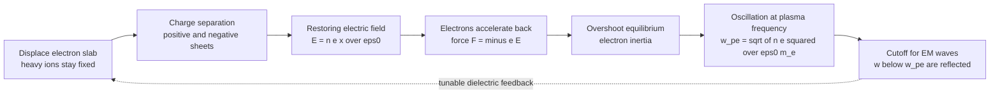

# ⚡ Plasma Oscillations and Frequency

> [!abstract] TL;DR
> Displace the light electrons of a plasma relative to the heavy ions and the charge separation creates a restoring electric field; the electrons overshoot and ring at the **electron plasma frequency** $\omega_{pe} = \sqrt{n_e e^2 / (\varepsilon_0 m_e)}$ — a natural pitch that depends **only on electron density**, not temperature or magnetic field. This is the plasma's fundamental heartbeat: it is the third defining criterion of the plasma state ($\omega_{pe} \gg$ collision rate), and it sets the **cutoff** below which electromagnetic waves cannot propagate — which is exactly why the ionosphere bounces AM radio back to Earth but lets GHz satellite signals pass straight through.

## Intuition — analogy FIRST

Imagine grabbing a thin slab of the plasma's electrons and yanking it sideways, then letting go. Because the electrons have left the heavy ions behind, a sheet of positive charge appears where they came from and a sheet of negative charge where they piled up — a tiny parallel-plate capacitor. Its electric field pulls the electrons straight back home. But the electrons have mass and therefore inertia, so — exactly like a child on a swing — they **overshoot** the equilibrium, get pulled back the other way, and oscillate back and forth at a precise, natural pitch.

That pitch is the **plasma frequency**, and its most remarkable feature is that it depends *only on how dense the electrons are* — not on how hot they are, not on any magnetic field. It is the plasma's fundamental heartbeat. And it has a dramatic consequence for waves: any electromagnetic wave slower than the heartbeat cannot keep up with the electrons' response and gets **reflected**, while any wave faster than the heartbeat slips through. That single fact is why the ionosphere reflects AM and shortwave radio around the curve of the Earth, yet is transparent to the much higher frequencies used by GPS and satellite TV.

---

## How It Works

### Core mechanics — deriving $\omega_{pe}$ from the cold fluid + Poisson

Take a **cold, unmagnetized** electron fluid on a fixed neutralizing ion background (ions too heavy to move on the electron timescale). Displace every electron by a small amount $x$ along one direction. The uncovered surface charge density is $\sigma = n_e e\, x$, so — just like a capacitor — the restoring field is

$$E = \frac{n_e e\, x}{\varepsilon_0}$$

which comes directly from Gauss's law / Poisson's equation $\nabla\cdot \mathbf{E} = \rho/\varepsilon_0$. Newton's second law on a single electron gives

$$m_e \ddot{x} = -eE = -\frac{n_e e^2}{\varepsilon_0}\,x \quad\Longrightarrow\quad \ddot{x} + \omega_{pe}^2\, x = 0,\qquad \boxed{\;\omega_{pe} = \sqrt{\dfrac{n_e e^2}{\varepsilon_0 m_e}}\;}$$

This is **simple harmonic motion** — the electron slab oscillates at $\omega_{pe}$ regardless of the amplitude of the displacement. Numerically $f_{pe} = \omega_{pe}/2\pi \approx 8980\,\sqrt{n_e\,[\text{cm}^{-3}]}\;\text{Hz} \approx 8.98\,\sqrt{n_e\,[\text{m}^{-3}]}\;\text{Hz}$.

Key facts that fall out:

1. **Density only.** $\omega_{pe}$ contains no temperature and no magnetic field. Heat the plasma or magnetize it — the *cold* oscillation frequency is unchanged.
2. **Ion plasma frequency.** Ions oscillate too, but far more slowly: $\omega_{pi} = \sqrt{n_i Z^2 e^2/(\varepsilon_0 M)} = \omega_{pe}\sqrt{Z^2 m_e/M}$. For hydrogen $\omega_{pi}\approx \omega_{pe}/43$, so the electrons carry the fast collective response.
3. **Third plasma criterion.** For an ionized gas to behave as a *plasma* (collective, not collisional), the oscillation must complete many cycles before a collision randomizes it: $\omega_{pe}\,\tau_{\text{coll}} \gg 1$. This joins the other two criteria — $\lambda_D \ll L$ and many particles per Debye sphere.
4. **Link to the Debye length.** $\lambda_D\,\omega_{pe} = \sqrt{k_B T_e/m_e} = v_{th,e}$: an electron travels roughly one Debye length in one plasma period. The Debye length is the *length* scale of shielding; the plasma frequency is its *time* scale.

### Wave cutoff — the plasma as a high-pass filter

For a transverse **electromagnetic** wave in the plasma, combining Maxwell's equations with the electron response gives the dispersion relation

$$\omega^2 = \omega_{pe}^2 + c^2 k^2 \qquad\Longleftrightarrow\qquad n_r = \frac{ck}{\omega} = \sqrt{1 - \frac{\omega_{pe}^2}{\omega^2}}$$

* If $\omega > \omega_{pe}$: $k$ is **real**, the refractive index $n_r$ is real, and the wave **propagates** (transmitted).
* If $\omega < \omega_{pe}$: $k$ is **imaginary**, the wave is **evanescent** and decays — it is totally **reflected**. The density at which $\omega_{pe} = \omega$ for a given wave is the **critical density** $n_c = \varepsilon_0 m_e \omega^2/e^2$.



---

## Key Concepts

### Secondary Level

- **Plasma oscillation** — electrons swing back and forth around the ions like a mass on a spring; the natural rate is the plasma frequency.
- **Depends on density only** — more electrons per cubic metre means a stiffer restoring field and a higher (faster) oscillation: $f_{pe}\propto\sqrt{n_e}$.
- **Radio reflection** — waves slower than the plasma "heartbeat" bounce off; faster ones pass through. This is the ionosphere reflecting AM radio.

### Undergraduate Level

- **Derivation** — cold electron fluid + linearized continuity + Poisson $\Rightarrow \ddot{x}+\omega_{pe}^2 x=0$; $\omega_{pe}=\sqrt{n_e e^2/\varepsilon_0 m_e}$.
- **Langmuir oscillation vs Langmuir wave** — the cold result is a *non-propagating* oscillation (group velocity zero, every point rings at $\omega_{pe}$ independently). Adding electron temperature makes it a *propagating* electron plasma (Langmuir) **wave**.
- **EM dispersion & cutoff** — $\omega^2=\omega_{pe}^2+c^2k^2$; refractive index $n_r=\sqrt{1-\omega_{pe}^2/\omega^2}$; critical density $n_c=\varepsilon_0 m_e\omega^2/e^2$.
- **Ion plasma frequency & cyclotron frequency** — $\omega_{pi}\ll\omega_{pe}$; the cyclotron frequency $\omega_{ce}=eB/m_e$ is a *different* frequency set by the magnetic field, not the density.

### Graduate Level

- **Bohm–Gross dispersion** — a warm electron plasma wave obeys $\omega^2=\omega_{pe}^2+3k^2 v_{th,e}^2$ (the factor 3 from 1-D adiabatic compression, $\gamma=3$). Thermal pressure gives the wave a finite group velocity and connects the fluid picture to kinetics.
- **Landau damping** — the kinetic (Vlasov) treatment reveals collisionless damping of the Langmuir wave via wave–particle resonance at $v = \omega/k$ — invisible to the cold-fluid model but essential in real plasmas.
- **Diagnostics** — because $\omega_{pe}$ is a clean function of $n_e$, cutoff and phase-shift measurements directly yield density: **interferometry**, **reflectometry**, and Langmuir-probe spectra.
- **Laser–plasma coupling** — the critical surface (where $n_e = n_c$ for the laser wavelength) is where laser light is reflected and absorption/parametric instabilities concentrate in inertial-confinement fusion.

---

## Python Demo

```python
# Plasma oscillations & the EM cutoff.
#   (a) A displaced electron slab is a simple harmonic oscillator at w_pe.
#   (b) The sqrt(n) law for w_pe, with real reference plasmas marked.
#   (c) EM dispersion w^2 = w_pe^2 + c^2 k^2 -> propagation vs cutoff.
#   (d) Refractive index -> ionospheric reflection of low frequencies.
import numpy as np
import matplotlib.pyplot as plt

# ---- Physical constants (SI) ----
e    = 1.602176634e-19    # elementary charge, C
eps0 = 8.8541878128e-12   # vacuum permittivity, F/m
me   = 9.1093837015e-31   # electron mass, kg
c    = 2.99792458e8       # speed of light, m/s

def plasma_frequency(n):
    """Electron angular plasma frequency for density n [1/m^3]."""
    return np.sqrt(n * e**2 / (eps0 * me))

# ============================================================
# (a) SLAB OSCILLATION: displaced electron slab as an SHO at w_pe
#     Equation of motion:  x'' = -(n e^2 / eps0 me) x = -w_pe^2 x
# ============================================================
n0   = 1e18                       # electron density [1/m^3]
wpe  = plasma_frequency(n0)       # rad/s
Tpe  = 2*np.pi/wpe                # plasma period [s]

dt   = Tpe/200
t    = np.arange(0, 5*Tpe, dt)
x    = np.zeros_like(t)
v    = np.zeros_like(t)
x[0] = 1.0e-3                     # initial slab displacement [m]
for i in range(len(t)-1):         # symplectic (semi-implicit) Euler
    a      = -wpe**2 * x[i]
    v[i+1] = v[i] + a*dt
    x[i+1] = x[i] + v[i+1]*dt
x_exact = x[0]*np.cos(wpe*t)      # analytic SHM solution

# ============================================================
# (b) sqrt(n) law with reference plasmas
# ============================================================
n_grid   = np.logspace(4, 22, 400)          # 1e4 .. 1e22 m^-3
fpe_grid = plasma_frequency(n_grid)/(2*np.pi)
refs = {
    "Ionosphere F-layer": 1e12,   # f_pe ~ 9 MHz  -> reflects shortwave
    "Solar wind (1 AU)":  7e6,    # f_pe ~ 24 kHz
    "Tokamak core":       1e20,   # f_pe ~ 90 GHz
}

# ============================================================
# (c) EM dispersion & (d) refractive index (ionospheric F-layer)
# ============================================================
wpe_ref = plasma_frequency(1e12)
w_prop  = np.linspace(wpe_ref, 4*wpe_ref, 300)          # w > w_pe
k_prop  = np.sqrt(w_prop**2 - wpe_ref**2)/c             # real k
w_evan  = np.linspace(0.02*wpe_ref, wpe_ref, 300)       # w < w_pe
kappa   = np.sqrt(wpe_ref**2 - w_evan**2)/c             # decay constant |k|
w_idx   = np.linspace(0.2*wpe_ref, 4*wpe_ref, 400)
nr      = np.sqrt(np.clip(1 - (wpe_ref/w_idx)**2, 0, None))

# ============================================================
# PLOTS
# ============================================================
fig, ax = plt.subplots(2, 2, figsize=(13, 9))

ax[0,0].plot(t/Tpe, x_exact*1e3, 'b-',  lw=2,   label="analytic cos(w_pe t)")
ax[0,0].plot(t/Tpe, x*1e3,       'r--', lw=1.2, label="numerical integration")
ax[0,0].set_xlabel("time  [plasma periods  t / T_pe]")
ax[0,0].set_ylabel("slab displacement  [mm]")
ax[0,0].set_title("(a) Displaced electron slab = SHO at w_pe")
ax[0,0].legend(); ax[0,0].grid(alpha=0.3)

ax[0,1].loglog(n_grid, fpe_grid, 'k-', lw=2)
for name, nn in refs.items():
    ff = plasma_frequency(nn)/(2*np.pi)
    ax[0,1].plot(nn, ff, 'o', ms=9)
    ax[0,1].annotate(name, (nn, ff), textcoords="offset points",
                     xytext=(-8, 9), fontsize=8, ha='right')
ax[0,1].set_xlabel("electron density  n_e  [1/m^3]")
ax[0,1].set_ylabel("plasma frequency  f_pe  [Hz]")
ax[0,1].set_title("(b) f_pe proportional to sqrt(n_e)")
ax[0,1].grid(alpha=0.3, which='both')

ax[1,0].plot(k_prop*c/wpe_ref, w_prop/wpe_ref, 'b-',  lw=2,
             label="propagating: real k, w > w_pe")
ax[1,0].plot(kappa*c/wpe_ref,  w_evan/wpe_ref, 'r--', lw=2,
             label="evanescent: imag k, w < w_pe")
ax[1,0].plot([0,4],[0,4], 'k:', lw=1, label="light line w = c k")
ax[1,0].axhline(1.0, color='gray', ls=':', lw=1.5)
ax[1,0].text(2.4, 1.1, "cutoff  w = w_pe", fontsize=9, color='gray')
ax[1,0].set_xlim(0,4); ax[1,0].set_ylim(0,4)
ax[1,0].set_xlabel("normalized wavenumber  c k / w_pe")
ax[1,0].set_ylabel("frequency  w / w_pe")
ax[1,0].set_title("(c) EM dispersion  w^2 = w_pe^2 + c^2 k^2")
ax[1,0].legend(fontsize=8); ax[1,0].grid(alpha=0.3)

ax[1,1].plot(w_idx/wpe_ref, nr, 'g-', lw=2)
ax[1,1].axvline(1.0, color='gray', ls=':', lw=1.5)
ax[1,1].fill_between(w_idx/wpe_ref, 0, 1, where=(w_idx < wpe_ref),
                     color='red', alpha=0.15)
ax[1,1].text(0.55, 0.55, "REFLECTED\nn imaginary", color='red',
             fontsize=9, ha='center')
ax[1,1].text(2.4, 0.35, "TRANSMITTED\nn real", color='green',
             fontsize=9, ha='center')
ax[1,1].set_xlabel("frequency  w / w_pe")
ax[1,1].set_ylabel("refractive index  n_r")
ax[1,1].set_title("(d) Ionospheric cutoff: AM reflected, satellite passes")
ax[1,1].grid(alpha=0.3)

plt.tight_layout()
plt.savefig("plasma_oscillations.png", dpi=130)
plt.show()

# ---- printed sanity check ----
print(f"n_e = {n0:.1e} /m^3  ->  f_pe = {wpe/(2*np.pi):.3e} Hz")
for name, nn in refs.items():
    print(f"{name:20s} n_e={nn:.1e} /m^3  f_pe={plasma_frequency(nn)/(2*np.pi):.3e} Hz")
```

Running it confirms the leapfrog trajectory tracks $\cos(\omega_{pe}t)$ exactly, reproduces $f_{pe}\propto\sqrt{n_e}$ ($\approx 9$ MHz for the ionosphere, $\approx 24$ kHz for the solar wind, $\approx 90$ GHz for a tokamak core), and shows the cutoff: below $\omega_{pe}$ the wavenumber turns imaginary and the wave is reflected.

---

## Real-World Applications

- **Ionospheric radio propagation.** The F-layer critical frequency ($f_{pe}\sim 3\text{–}10$ MHz) reflects HF/shortwave and AM around the curve of the Earth, enabling over-the-horizon and long-distance broadcasting — while GHz satellite/GPS signals sail straight through because they sit far above $\omega_{pe}$.
- **Plasma density diagnostics.** Because $\omega_{pe}$ maps one-to-one onto $n_e$, microwave/laser **interferometry** and **reflectometry** measure line-integrated density in tokamaks and industrial plasmas by detecting phase shifts and cutoff surfaces.
- **Inertial-confinement fusion & laser–plasma physics.** The **critical surface** ($n_e = n_c$) is where drive-laser light reflects and where parametric instabilities and absorption localize.
- **Space & astrophysical plasmas.** The solar-wind plasma frequency ($\sim$ tens of kHz) sets a low-frequency radio cutoff; spacecraft measure local $n_e$ from the plasma line, and this cutoff shields Earth from low-frequency cosmic radio noise.
- **Tunable plasma dielectrics / metamaterials.** A plasma is a dielectric whose refractive index $n_r=\sqrt{1-\omega_{pe}^2/\omega^2}$ is *tunable by density*, used for reconfigurable antennas, stealth studies, and plasma reflectors.

---

## Common Pitfalls

- **Confusing the three "plasma" frequencies.** The **electron plasma frequency** $\omega_{pe}=\sqrt{n_e e^2/\varepsilon_0 m_e}$ (density), the **ion plasma frequency** $\omega_{pi}\approx\omega_{pe}\sqrt{m_e/M}$ (much smaller, heavy ions), and the **electron cyclotron frequency** $\omega_{ce}=eB/m_e$ (set by the *magnetic field*, not density) are three distinct quantities. Unmagnetized-plasma oscillations use $\omega_{pe}$; magnetized wave modes mix $\omega_{pe}$ and $\omega_{ce}$.
- **Langmuir *oscillation* vs Langmuir *wave*.** The cold result is a *non-propagating* oscillation — every point rings at $\omega_{pe}$ with zero group velocity, carrying no energy. Only when you include electron temperature do you get a genuine *propagating* electron plasma wave with the **Bohm–Gross** dispersion $\omega^2=\omega_{pe}^2+3k^2v_{th,e}^2$. Do not call the cold oscillation a "wave."
- **Forgetting the EM cutoff is about the *transverse* wave.** The relation $\omega^2=\omega_{pe}^2+c^2k^2$ (with cutoff at $\omega_{pe}$, critical density $n_c$) is for transverse electromagnetic waves; the *longitudinal* Langmuir mode is electrostatic and behaves differently. Both share $\omega_{pe}$ but have different physics.
- **Assuming temperature or B changes $\omega_{pe}$.** The cold plasma frequency depends on **density only**. Temperature adds the thermal correction (Bohm–Gross); a magnetic field adds cyclotron effects — but the bare $\omega_{pe}$ is $\sqrt{n_e e^2/\varepsilon_0 m_e}$ every time.
- **Mis-explaining ionospheric reflection.** It is not "bouncing off a hard surface." The wave becomes *evanescent* where $\omega<\omega_{pe}$ ($n_r$ imaginary): it decays into the layer, stores and returns its energy, and re-emerges — total internal reflection driven by the rising density profile.

---

## Related Concepts

- [[Oscillations_and_SHM]] — the plasma oscillation *is* simple harmonic motion; $\ddot{x}+\omega_{pe}^2 x=0$ is the SHM equation with $\omega_{pe}$ as the natural frequency.
- [[Electromagnetic_Waves_and_Radiation]] — the transverse EM wave whose propagation is cut off below $\omega_{pe}$; the plasma acts as a high-pass filter for light.
- [[Maxwells_Equations]] — Gauss/Poisson gives the restoring field and Ampère–Faraday give the EM dispersion relation $\omega^2=\omega_{pe}^2+c^2k^2$.
- [[Wave_Motion_and_Properties]] — dispersion relations, phase vs group velocity, and cutoff/evanescence generalize the plasma case.
- [[Polarization_and_Dispersion]] — the plasma is a canonical *dispersive medium* with a frequency-dependent refractive index $n_r=\sqrt{1-\omega_{pe}^2/\omega^2}$.
- [[Frequency_Spectrum]] — the cutoff frequency partitions the spectrum into reflected (below $\omega_{pe}$) and transmitted (above) bands.
- [[Kinetic_Theory_of_Gases]] — the electron thermal speed $v_{th,e}=\sqrt{k_BT_e/m_e}$ links $\omega_{pe}$ to the Debye length ($\lambda_D\omega_{pe}=v_{th,e}$) and seeds the Bohm–Gross thermal correction.
- [[Magnetohydrodynamics]] — the low-frequency, single-fluid limit; plasma oscillations sit *above* MHD timescales and are filtered out of the MHD description.

*Sibling notes in this section (planned): Plasma_Physics_Overview, Debye_Shielding_and_Plasma_Parameters, Cold_Plasma_Waves_and_Dispersion, Landau_Damping, and Plasma_Diagnostics_and_Measurement — the Debye length is the spatial partner of the plasma frequency, cold-plasma waves generalize the cutoff, Landau damping is the kinetic fate of the warm Langmuir wave, and diagnostics exploit $\omega_{pe}(n_e)$ to measure density.*

---

## Review Questions

1. **(Secondary)** In plain language, why does a plasma have a natural oscillation frequency at all, and why does that frequency go *up* when the plasma gets denser? Use the swing/capacitor analogy.
2. **(Undergraduate)** Derive $\omega_{pe}=\sqrt{n_e e^2/\varepsilon_0 m_e}$ from a displaced cold electron slab using Gauss's law and Newton's second law. Then explain why an electromagnetic wave with $\omega<\omega_{pe}$ is reflected rather than transmitted.
3. **(Graduate)** The ionospheric F-layer has $n_e\approx10^{12}\,\text{m}^{-3}$. (a) Compute $f_{pe}$ and state which of AM broadcast (1 MHz), FM (100 MHz), and GPS (1.5 GHz) are reflected vs transmitted. (b) Contrast the cold Langmuir oscillation with the warm Bohm–Gross wave: what physically changes when you include $T_e$, and how does this open the door to Landau damping?

---

## Sources

- Chen, F. F. *Introduction to Plasma Physics and Controlled Fusion*, 3rd ed. (Springer, 2016) — Ch. 4, plasma oscillations, plasma frequency, and cold-wave dispersion.
- Bittencourt, J. A. *Fundamentals of Plasma Physics*, 3rd ed. (Springer, 2004) — collective oscillations, Debye length, and the plasma criteria.
- Stix, T. H. *Waves in Plasmas* (AIP Press, 1992) — authoritative treatment of dispersion relations, cutoffs, and resonances.
- Bellan, P. M. *Fundamentals of Plasma Physics* (Cambridge University Press, 2006) — cold vs warm plasma waves, Bohm–Gross dispersion, and kinetic bridge.
- Gurnett, D. A. & Bhattacharjee, A. *Introduction to Plasma Physics: With Space, Laboratory and Astrophysical Applications*, 2nd ed. (CUP, 2017) — ionospheric reflection and space-plasma diagnostics.

---

#plasma-physics #plasma-frequency #langmuir-oscillations #plasma-waves #cutoff
