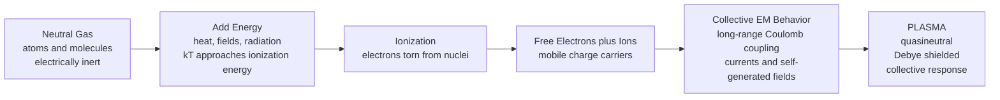

# ⚡ Plasma Physics Overview

> [!abstract] TL;DR
> **Plasma is the fourth state of matter** — a gas so energized that electrons are torn loose from their nuclei, leaving a quasineutral soup of free electrons and ions that conducts electricity and couples intimately to electric and magnetic fields. What makes it *plasma* rather than merely "hot gas" is **collective behavior**: long-range Coulomb forces let vast numbers of charged particles act in concert, screening intruding charges over a **Debye length** $\lambda_D$ and oscillating at the **plasma frequency** $\omega_{pe}$. Over **99% of the visible universe** is plasma — stars, nebulae, the solar wind, magnetospheres — and it powers terrestrial technology from neon signs and semiconductor etching to the fusion reactors chasing star-power on Earth. This note is the entry point to the whole vault.

---

## Intuition — analogy FIRST

Heat ice and it melts to water; heat water and it boils to steam. Three states, three familiar transitions. But keep pouring energy into that steam and something genuinely new happens: the atoms themselves begin to **shatter**. Electrons are ripped away from their nuclei, and the placid, electrically-neutral gas becomes a **glowing soup of charged particles** that conducts electricity, glows with its own light, and — most importantly — *dances to magnetic fields*. That soup is **plasma, the fourth state of matter**.

And it is not exotic at all. A candle flame, a lightning bolt, the shimmering aurora, a humming neon sign, and every star in the sky are all plasma. It is, in fact, the **most common state of ordinary matter in the universe** — the rare stuff is the solid, liquid, and gas we happen to live among.

Here is the one idea that separates plasma from an ordinary gas. **A gas does not care about a magnet.** Blow air past a magnet and nothing happens; the neutral molecules sail through untouched. **A plasma is the magnet's willing partner.** Its free charges feel every field, carry currents, generate fields of their own, and organize themselves into filaments, sheaths, and waves. That partnership between charged matter and electromagnetic fields is the entire subject — the thread that runs from the physics of a single gyrating electron all the way up to the magnetic confinement of a fusion reactor.

---

## How It Works

A plasma is born when energy added to a gas exceeds the **ionization energy** of its atoms — when the typical thermal energy $k_B T$ becomes comparable to the binding energy holding electrons to nuclei (13.6 eV for hydrogen). Once free charges exist, three things must all be true before the ionized gas earns the name *plasma*:

1. **Quasineutrality** — averaged over any region larger than a Debye length, the positive and negative charge densities balance: $n_e \approx Z\,n_i$. The plasma is neutral in bulk yet teeming with mobile charge underneath.
2. **Debye shielding** — any stray charge (or an inserted electrode) is screened by a rearranging cloud of opposite charge within a distance $\lambda_D = \sqrt{\varepsilon_0 k_B T_e / n_e e^2}$. The plasma actively hides electric fields from its own interior.
3. **Collective response** — because Coulomb forces are long-range, each particle feels the *combined* field of countless distant neighbors, not just its nearest collision partner. The medium behaves as a self-organizing whole, oscillating coherently at the plasma frequency $\omega_{pe} = \sqrt{n_e e^2 / \varepsilon_0 m_e}$.



The dual identity previewed here — **individual charged particles** on one hand, a **self-consistent electromagnetic fluid** on the other — is the central intellectual tension of the whole discipline, and every layer of theory is a different resolution of it.

---

## Key Concepts

### Secondary Level

- **Fourth state of matter.** Solid → liquid → gas → **plasma**. Each transition adds energy; the plasma transition ionizes atoms into free electrons and ions.
- **It conducts and glows.** Free charges make plasma an electrical conductor and let it emit light (neon signs, the aurora, a star's surface).
- **It obeys magnets.** Unlike a neutral gas, plasma is steered, confined, and shaped by magnetic fields — the basis of fusion machines and the reason the aurora tracks Earth's field lines.
- **It is everywhere.** Stars, the Sun's corona, lightning, flames, fluorescent tubes, and welding arcs are all plasmas.

### Undergraduate Level

The quantitative fingerprints of a plasma — the **key parameters** this vault develops in depth:

| Parameter | Symbol / formula | What it tells you |
|---|---|---|
| **Debye length** | $\lambda_D = \sqrt{\varepsilon_0 k_B T_e / n_e e^2}$ | screening distance; the scale below which charge separation lives |
| **Plasma frequency** | $\omega_{pe} = \sqrt{n_e e^2 / \varepsilon_0 m_e}$ | natural oscillation rate of the electron fluid |
| **Plasma parameter** | $N_D = \tfrac{4}{3}\pi n_e \lambda_D^{3} \gg 1$ | number of particles in a Debye sphere; must be large for collective shielding to be meaningful |
| **Temperature in eV** | $1\ \text{eV} \leftrightarrow 11{,}605\ \text{K}$ | plasma physicists quote $T$ as an energy; room temperature $\approx 0.025$ eV, a fusion core $\approx 10{,}000$ eV |
| **Degree of ionization** | $x = n_i / (n_i + n_n)$ | fraction ionized; set by temperature and density (Saha equation) |
| **Magnetization** | $r_L = m v_\perp / (qB)$ vs. system size | whether particles are tied to field lines (small Larmor radius) or fly freely |

**The three defining criteria** an ionized gas must satisfy to *be* a plasma:

1. $\lambda_D \ll L$ — the Debye length is far smaller than the system, so the bulk is quasineutral.
2. $N_D \gg 1$ — many particles inhabit a Debye sphere, so shielding is a statistical, collective effect rather than a two-body encounter.
3. $\omega_{pe} \gg \nu_{\text{coll}}$ — collective plasma oscillations happen faster than particles collide, so electromagnetic collective dynamics dominate over ordinary collisions.

### Graduate Level

- **Hierarchy of descriptions.** The same plasma can be modeled as (i) **single particles** drifting in given fields; (ii) a **kinetic** distribution $f(\mathbf{x},\mathbf{v},t)$ obeying the **Vlasov–Boltzmann** equation (source of collisionless phenomena like Landau damping); (iii) **two interpenetrating fluids** (electrons and ions); or (iv) a single conducting fluid in **magnetohydrodynamics (MHD)**. Choosing the right rung for a problem is the craft of the field.
- **Coupling parameter** $\Gamma = \dfrac{e^2 / 4\pi\varepsilon_0 a}{k_B T}$ with interparticle spacing $a = (3/4\pi n)^{1/3}$. Nearly all natural plasmas are **weakly coupled** ($\Gamma \ll 1$, ideal, dominated by many-body collective forces); white-dwarf interiors and some dusty/ultracold plasmas are **strongly coupled** ($\Gamma \gtrsim 1$).
- **Collisionality and magnetization** decide whether MHD, drift-kinetics, or full kinetics apply, and whether the plasma is "frozen" to field lines — the foundation of confinement and of astrophysical dynamos.
- **Non-Maxwellian and multi-temperature states** are the norm: $T_e \neq T_i$ is routine, and industrial "cold plasmas" have $10^4$ K electrons in a near-room-temperature neutral gas.

---

## Python Demo

Two figures that capture *what makes a plasma a plasma*: (a) the **ionization transition** — how a neutral gas smoothly becomes ionized as it heats (a Saha-equation curve), and (b) the **plasma regime map** — the famous log-log chart of density vs. temperature on which every plasma in nature lands, spanning ~30 orders of magnitude, overlaid with lines of constant Debye length and the strong-coupling boundary.

```python
# Plasma Physics Overview: (a) the gas -> plasma ionization transition,
# (b) the density-temperature "map of plasmas" with Debye-length and coupling lines.
import numpy as np
import matplotlib.pyplot as plt

# --- Physical constants (SI) ---
me   = 9.109e-31       # electron mass, kg
kB   = 1.381e-23       # Boltzmann constant, J/K
h    = 6.626e-34       # Planck constant, J s
e    = 1.602e-19       # elementary charge, C
eps0 = 8.854e-12       # vacuum permittivity, F/m
eV   = 1.602e-19       # 1 eV in joules
chi  = 13.6 * eV       # hydrogen ionization energy

# =====================================================================
# (a) SAHA IONIZATION: ionization fraction x vs temperature
#     Saha:  n_e n_i / n_n = S(T);  quasineutral single ionization n_e = n_i.
#     With total nuclei N: x^2/(1-x) = S(T)/N  ->  x = (-R + sqrt(R^2+4R))/2.
# =====================================================================
N = 1.0e20                             # total heavy-particle density, m^-3
T_K = np.linspace(4000, 30000, 600)    # temperature sweep, K
S = (2.0*np.pi*me*kB*T_K/h**2)**1.5 * np.exp(-chi/(kB*T_K))  # g-factor ~ 1 for H
R = S / N
x_ion = (-R + np.sqrt(R**2 + 4.0*R)) / 2.0   # ionization fraction in [0,1]

# =====================================================================
# (b) PLASMA REGIME MAP: number density n vs temperature T (log-log)
# =====================================================================
# Named plasmas: (Temperature [K], number density [m^-3], label)
plasmas = [
    (1.0e4, 1.0e5,  "Interstellar\nmedium"),
    (1.0e5, 1.0e7,  "Solar wind"),
    (1.0e3, 1.0e12, "Ionosphere"),
    (1.0e6, 1.0e14, "Solar corona"),
    (3.0e4, 1.0e16, "Neon sign /\nglow discharge"),
    (3.0e4, 1.0e23, "Lightning"),
    (1.0e8, 1.0e20, "Fusion\ntokamak"),
    (1.5e7, 1.0e31, "Sun's core"),
]

# Debye length lambda_D = sqrt(eps0 kB T / (n e^2))  ->  constant-lambda line: n = eps0 kB T /(e^2 lambda^2)
T_line = np.logspace(2.5, 8.5, 200)
def debye_line(lam):
    return eps0*kB*T_line/(e**2 * lam**2)

# Strong-coupling boundary Gamma = 1:  kB T = e^2/(4 pi eps0) * (4 pi n /3)^(1/3)
# -> n = (3/(4 pi)) * (4 pi eps0 kB T / e^2)^3
n_coupling = (3.0/(4*np.pi)) * (4*np.pi*eps0*kB*T_line/e**2)**3

# --- Plot ---
fig, (ax1, ax2) = plt.subplots(1, 2, figsize=(14, 6))

# (a) ionization curve
ax1.plot(T_K, x_ion, color="crimson", lw=2.5)
ax1.axhline(0.5, ls=":", color="gray")
ax1.set_xlabel("Temperature  T  [K]")
ax1.set_ylabel("Ionization fraction  x = n_i / (n_i + n_n)")
ax1.set_title("(a) Gas -> Plasma: hydrogen ionization vs temperature\n(Saha equation, n = 1e20 m^-3)")
ax1.set_ylim(-0.02, 1.02)
ax1.text(6000, 0.08, "neutral gas", color="dimgray")
ax1.text(21000, 0.9, "fully ionized plasma", color="crimson")
ax1.grid(alpha=0.3)

# (b) regime map
for lam, tag in [(1e-6, "1 um"), (1e-3, "1 mm"), (1.0, "1 m"), (1e3, "1 km")]:
    ax2.plot(T_line, debye_line(lam), ls="--", color="steelblue", lw=1)
    ax2.text(T_line[-1]*0.5, debye_line(lam)[-1]*1.4,
             f"$\\lambda_D$ = {tag}", color="steelblue", fontsize=8, rotation=20)

ax2.plot(T_line, n_coupling, color="darkorange", lw=2, label="strong-coupling boundary ($\\Gamma$ = 1)")
ax2.fill_between(T_line, n_coupling, 1e35, color="orange", alpha=0.10)
ax2.text(3e6, 3e32, "strongly coupled\n(non-ideal)", color="darkorange", fontsize=8)

for T, n, label in plasmas:
    ax2.scatter(T, n, s=55, color="black", zorder=5)
    ax2.annotate(label, (T, n), textcoords="offset points", xytext=(6, 6), fontsize=8)

ax2.set_xscale("log"); ax2.set_yscale("log")
ax2.set_xlim(3e2, 3e8); ax2.set_ylim(1e4, 1e34)
ax2.set_xlabel("Temperature  T  [K]")
ax2.set_ylabel("Number density  n  [m$^{-3}$]")
ax2.set_title("(b) The map of plasmas: ~30 orders of magnitude in density")
ax2.legend(loc="lower right", fontsize=8)
ax2.grid(which="both", alpha=0.2)

plt.tight_layout()
plt.savefig("plasma_overview.png", dpi=130)
plt.show()

# Sanity check printed to console
print(f"50% ionized near T = {T_K[np.argmin(np.abs(x_ion-0.5))]:.0f} K"
      f"  ({T_K[np.argmin(np.abs(x_ion-0.5))]/11605:.2f} eV)")
```

**What the plots show.** Panel (a) is the gas-to-plasma transition itself: below a threshold temperature the hydrogen is essentially neutral; over a narrow band it ionizes rapidly; above it the gas is a fully ionized plasma — the ionization fraction rises as a smooth S-curve, not a sharp phase boundary. Panel (b) is the discipline's iconic **density–temperature map**: interstellar wisps, the solar wind, the ionosphere, the corona, a neon tube, a lightning channel, a fusion tokamak, and the Sun's core all coexist on one chart spanning ~30 decades in density. The dashed lines (constant Debye length, slope 1) and the shaded strong-coupling boundary ($\Gamma = 1$, slope 3) show *why* nearly all of them are classical, weakly coupled, ideal plasmas — comfortably in the regime where the three defining criteria hold.

---

## Real-World Applications

- **Fusion energy (the marquee application).** Magnetic-confinement devices (**ITER, tokamaks, stellarators**) and inertial-confinement facilities (**NIF**) hold ~100-million-K plasmas to fuse hydrogen isotopes — literally engineering a star on Earth. Confinement, heating, and stability are pure plasma physics.
- **Astrophysics and space.** Stellar interiors and coronae, the **solar wind**, planetary **magnetospheres**, accretion disks, and the interstellar medium are all plasmas; their dynamics (dynamos, reconnection, shocks) are governed by the theory in this vault.
- **Semiconductor manufacturing.** Every advanced chip is etched and deposited by **low-temperature plasmas** — plasma etching and plasma-enhanced deposition are a multi-hundred-billion-dollar dependency of the entire electronics industry.
- **Lighting and displays.** Fluorescent tubes, neon signs, arc lamps, and (historically) plasma TVs are glow discharges — everyday cold plasmas.
- **Industry and medicine.** Plasma welding and cutting, thermal-spray coatings, surface treatment, water/air purification, and emerging **plasma medicine** (sterilization, wound healing) all exploit reactive, non-equilibrium plasmas.
- **Propulsion.** Ion and Hall-effect thrusters accelerate plasma to propel deep-space probes with extreme fuel efficiency.

---

## Common Pitfalls

- **"Plasma is just hot gas."** No — it must *also* be **quasineutral** and exhibit **collective behavior**. A faintly ionized flame with $N_D \sim 1$ and $\lambda_D \sim L$ is an ionized gas but barely a plasma. Always check the three criteria: $\lambda_D \ll L$, $N_D \gg 1$, $\omega_{pe} \gg \nu_{\text{coll}}$.
- **Forgetting the many-particles-in-a-Debye-sphere condition.** Debye shielding is a *statistical* effect. If only a handful of particles sit inside a Debye sphere ($N_D \sim 1$), the smooth screening picture — and much of plasma theory — collapses.
- **Temperature-unit confusion.** Plasma physicists quote temperature in **electron-volts**: $1\ \text{eV} \approx 11{,}605\ \text{K}$. Treating "10 eV" as 10 K (or forgetting the factor entirely) throws every estimate off by four orders of magnitude.
- **Assuming $T_e = T_i$.** Electrons and ions frequently live at very different temperatures because they exchange energy slowly. Many plasmas are two-temperature (or fully non-Maxwellian) systems.
- **"All plasmas are hot."** **Low-temperature / non-equilibrium plasmas** — the ones in fluorescent tubes and etch chambers — have hot electrons ($\sim 10^4$ K) inside a cool, near-room-temperature neutral gas. Hotness is not a defining property; collective ionized behavior is.
- **Ignoring the ionization fraction.** A gas that is 0.001% ionized can still behave as a plasma if the charged component satisfies the criteria; conversely, "ionized" alone is not enough.

---

## Roadmap of This Vault

This note is the **hub**. The six sections that follow trace plasma physics from a single particle up to reactors and galaxies:

1. **Foundations** — the defining parameters and screening physics (*Debye_Shielding_and_Plasma_Parameters*), and how one charged particle spirals and drifts through fields (*Single_Particle_Motion_and_Drifts*).
2. **Kinetic & fluid theory** — the statistical Vlasov description, Landau damping, and the collapse to a conducting fluid (*The_Two_Fluid_and_MHD_Models*, *Magnetohydrodynamics*).
3. **Waves & instabilities** — how the collective medium rings, and how those oscillations can grow and disrupt confinement.
4. **Fusion** — the quest for star-power on Earth via magnetic and inertial confinement (*Nuclear_Fusion_and_the_Lawson_Criterion*).
5. **Space & astrophysical plasmas** — the Sun, solar wind, and planetary shields (*Space_Plasma_Physics_and_the_Magnetosphere*).
6. **Reach & future** — industrial, low-temperature, and applied plasmas and where the field is going (*The_Reach_and_Future_of_Plasma_Physics*).

The unifying thread across all six: plasma's **dual nature** — particles *and* fluid — and its inseparable **coupling to electromagnetic fields**.

---

## Related Concepts

- [[States_of_Matter_and_Gas_Laws]] — the classical solid/liquid/gas states that plasma extends as the fourth; the gas laws are the neutral-gas limit plasma departs from.
- [[Kinetic_Theory_of_Gases]] — the Maxwell–Boltzmann statistical machinery that plasma kinetic theory generalizes to charged particles and self-fields.
- [[Electric_Fields_and_Coulombs_Law]] — the long-range Coulomb force that, uniquely, gives plasma its collective character.
- [[Maxwells_Equations]] — the field equations plasma is self-consistently coupled to; currents in the plasma make the fields that in turn move the plasma.
- [[Electromagnetic_Waves_and_Radiation]] — the basis for plasma waves, the plasma frequency cutoff, and radio propagation through the ionosphere.
- [[Classical_Statistical_Mechanics]] — the Boltzmann/Saha statistics behind Debye shielding, ionization equilibrium, and temperature in eV.
- [[Atomic_Structure_and_Subatomic_Particles]] — ionization energies and the electron–nucleus binding that must be overcome to make a plasma.
- [[Nuclear_Reactions_Fission_Fusion]] — the fusion reactions that plasma confinement exists to harness (and that power the stars).
- [[The_Sun]] — the archetypal natural plasma: a self-gravitating ball of it, corona to core, launching the solar wind.
- [[Stellar_Structure_and_Energy_Generation]] — stellar interiors as gravitationally confined fusion plasmas.
- [[The_Interstellar_Medium]] — the diffuse ionized gas that anchors the low-density corner of the plasma regime map.
- [[Magnetohydrodynamics|Magnetohydrodynamics (Physics)]] — the single-fluid, field-coupled description used for astrophysical and confinement plasmas.

---

## Review Questions

**Secondary.** Name the four states of matter and describe what physically changes when a gas becomes a plasma. Give three everyday or natural examples of plasma.

**Undergraduate.** State the three criteria an ionized gas must satisfy to be a plasma, and explain what each one physically guarantees. A lab plasma has $n_e = 10^{16}\ \text{m}^{-3}$ and $T_e = 2\ \text{eV}$; estimate its Debye length and comment on whether a 10 cm chamber is "much larger" than $\lambda_D$.

**Graduate.** Explain why a plasma can be described equally as a collection of single particles, a kinetic distribution obeying the Vlasov equation, or a magnetohydrodynamic fluid — and give one physical phenomenon that *requires* the kinetic description and is invisible to MHD. Under what conditions ($\Gamma$, $N_D$) does the standard weakly-coupled, ideal-plasma theory break down?

---

## Sources

- Chen, F. F. *Introduction to Plasma Physics and Controlled Fusion*, 3rd ed. (Springer, 2016) — the standard first course; Chapter 1 defines the plasma criteria, Debye shielding, and plasma frequency.
- Bittencourt, J. A. *Fundamentals of Plasma Physics*, 3rd ed. (Springer, 2004) — thorough foundations and the kinetic/fluid hierarchy.
- Bellan, P. M. *Fundamentals of Plasma Physics* (Cambridge University Press, 2006) — rigorous graduate-level treatment linking single-particle, kinetic, and MHD pictures.
- Goldston, R. J. & Rutherford, P. H. *Introduction to Plasma Physics* (IOP/CRC Press, 1995) — physically motivated introduction with strong fusion emphasis.
- Huba, J. D. *NRL Plasma Formulary* (Naval Research Laboratory) — the canonical quick-reference for plasma parameters and the density–temperature regime map.

---

#plasma-physics #fourth-state-of-matter #ionization #debye-length #plasma-regimes
