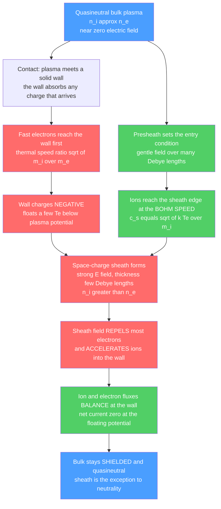

# ⚡ Plasma Sheaths and Boundary Layers

> [!abstract] TL;DR
> Wherever a plasma touches a solid surface, a thin ($\sim$ few Debye lengths) **non-neutral space-charge layer** forms — the **sheath**. Because electrons are far more mobile than ions, they hit the wall first and charge it negative; the resulting electric field repels most electrons, accelerates ions into the wall, and shields the quasineutral bulk from the surface. The wall settles at the **floating potential**, several $T_e$ below the plasma, where ion and electron fluxes balance. For a stable, monotonic sheath the ions must enter it at the **Bohm speed** $c_s=\sqrt{k T_e/m_i}$ — the **Bohm criterion** — which a quasineutral **presheath** provides. The sheath is the universal interface between plasma and matter, and the crucial *exception* to quasineutrality.

## Intuition — analogy FIRST

Whenever a plasma touches a solid wall, a tiny battle plays out in a razor-thin skin. The nimble electrons hit the wall first and stick, charging it negative — which then repels further electrons and pulls ions in. Within a hair's breadth of the surface, a self-organized voltage layer forms — the sheath — that shields the calm neutral plasma from the wall, like the tense meniscus skin on the surface of water. Every neon tube, every spacecraft, every fusion reactor's inner wall lives or dies by the physics of this invisible boundary layer.

The plasma itself hates electric fields: any imbalance is screened within one Debye length by rushing charges. But a wall is a place where charges *disappear*, so screening cannot be perfect there. The sheath is the plasma's compromise — a razor-thin region where it lets quasineutrality break so that, everywhere else, it can stay serenely neutral.

---

## How It Works



---

## Key Concepts / Details

### Secondary Level

**Why a wall goes negative.** In a plasma, electrons and ions have roughly the same temperature but wildly different masses — an electron is $\sim$1836 times lighter than a proton, so at the same temperature it moves $\sim\sqrt{1836}\approx 43$ times faster. When you first insert an uncharged wall, electrons pelt it far more often than ions. The wall accumulates negative charge until it is negative enough to turn most electrons away, so that the slow electron trickle exactly matches the ion arrival rate. That equilibrium wall voltage is the **floating potential**.

**The sheath as a shield.** The negative wall sets up an electric field, but a plasma refuses to let fields reach in. Within a few **Debye lengths** ($\lambda_D$) of the surface, the field is screened out — this thin skin is the **sheath**. Inside it the charge is *not* balanced (more ions than electrons); outside it the plasma is neutral and quiet. The whole potential drop from plasma to wall lives almost entirely inside this hair-thin layer.

**Where you meet it:** the dark space beside the cathode in a neon tube, the glow-discharge sheath in a fluorescent lamp, the layer that charges a spacecraft in orbit, and the fierce boundary at the wall of a fusion machine are all sheaths.

### Undergraduate Level

**The sheath equation (planar, cold ions, Boltzmann electrons).** Let $\phi(x)$ be the potential, zero at the sheath edge and negative toward the wall. Electrons in a repelling field follow a Boltzmann distribution:
$$n_e = n_0 \exp\!\left(\frac{e\phi}{kT_e}\right).$$
Cold ions enter the sheath edge at speed $u_0$; flux conservation $n_i u = n_0 u_0$ and energy conservation $\tfrac12 m_i u^2 = \tfrac12 m_i u_0^2 - e\phi$ give
$$n_i = \frac{n_0}{\sqrt{1 - 2e\phi/(m_i u_0^2)}}.$$
Poisson's equation closes the system:
$$\frac{d^2\phi}{dx^2} = -\frac{e}{\epsilon_0}\left(n_i - n_e\right).$$
Introduce $\eta = -e\phi/kT_e \ge 0$ and $\xi = x/\lambda_D$ with $\lambda_D^2 = \epsilon_0 kT_e/(n_0 e^2)$. If ions enter exactly at the **Bohm speed** ($u_0 = c_s = \sqrt{kT_e/m_i}$),
$$\frac{d^2\eta}{d\xi^2} = \frac{1}{\sqrt{1+2\eta}} - e^{-\eta}.$$

**The Bohm criterion.** Multiply by $d\eta/d\xi$ and integrate from the sheath edge ($\eta=0,\ \eta'=0$):
$$\tfrac12\left(\frac{d\eta}{d\xi}\right)^2 = \sqrt{1+2\eta} + e^{-\eta} - 2.$$
For a real, monotonic solution the right-hand side must be $\ge 0$ for all $\eta>0$. Expanding for small $\eta$ with a general ion Mach number $M = u_0/c_s$ shows the leading term is $\tfrac12\eta^2\,(1 - 1/M^2)$, which is non-negative **only if**
$$\boxed{\,u_0 \ge c_s = \sqrt{kT_e/m_i}\,}\qquad\text{(Bohm criterion)}.$$
Ions must arrive *supersonically* (relative to the ion-acoustic speed) or the sheath cannot form monotonically — it would oscillate and be unphysical.

**The presheath.** Nothing in the quiet bulk pushes ions to $c_s$ for free. A weak, quasineutral **presheath** — extending over many $\lambda_D$ (often the system size, set by collisions or ionization) — sustains a gentle field that accelerates ions to the Bohm speed. The presheath drops the potential by about $\tfrac12 T_e$, so the sheath-edge density is
$$n_s \approx n_0\, e^{-1/2} \approx 0.61\, n_0.$$
The ion flux reaching any surface is then the **Bohm flux**:
$$\Gamma_i = n_s c_s \approx 0.61\, n_0 \sqrt{kT_e/m_i}.$$

**Floating potential.** At a floating (electrically isolated) wall, ion and electron fluxes balance. The one-sided electron thermal flux is $\Gamma_e = \tfrac14 n_s \bar v_e\, e^{e\phi_w/kT_e}$ with $\bar v_e = \sqrt{8kT_e/\pi m_e}$. Setting $\Gamma_i = \Gamma_e$:
$$\frac{e\,\phi_w}{kT_e} = -\frac12\ln\!\left(\frac{m_i}{2\pi m_e}\right).$$
For hydrogen this is $\approx -2.8\,T_e$ (relative to the sheath edge); adding the presheath drop, the wall sits roughly $3\text{–}5\,T_e$ below the bulk plasma potential — "a few $T_e$."

### Graduate Level

**Riemann's kinetic sheath criterion.** The cold-ion Bohm criterion generalizes: for a warm ion distribution, the *marginal* form is $\langle v^{-2}\rangle^{-1} \ge kT_e/m_i$, an average over the ion velocity distribution at the sheath edge. Strictly, the fluid Bohm criterion is a *marginal* condition; kinetic treatments (Harrison–Thompson, Riemann) show real sheaths sit slightly above marginality, and the sheath-presheath matching is singular in the limit $\lambda_D/L \to 0$ (a boundary-layer problem in the formal asymptotic sense).

**Child–Langmuir (high-voltage) sheaths.** When the wall bias greatly exceeds $T_e$ (e.g. an RF electrode or a strongly biased probe), electron density in the sheath is negligible and the ion space charge alone determines the profile. The current is space-charge-limited by the **Child–Langmuir law**, $J \propto V^{3/2}/d^2$, and the sheath thickness grows as $d \sim \lambda_D (V/T_e)^{3/4}$ — from a few $\lambda_D$ to tens or hundreds.

**DC vs RF sheaths.** A DC sheath is steady. An RF-driven sheath oscillates: electrons respond nearly instantaneously while ions see only the *time-averaged* field (ions are too heavy to follow the RF). This produces a rectified DC self-bias and sets the **ion bombardment energy** and its energy distribution (the IEDF) — the central control knob in plasma etching.

**Secondary electron emission (SEE).** Energetic ions, electrons, or photons striking the wall can eject secondary electrons. These are born inside the sheath and accelerated *back into the plasma*, effectively reducing the net electron loss. As the SEE yield $\gamma \to 1$, the sheath potential collapses toward a **space-charge-limited (SCL)** or even **inverse** sheath, with a non-monotonic potential and a virtual cathode. This regime dominates hot walls, dielectric surfaces, and Hall-thruster channels, and can dramatically increase wall power loss.

**Magnetized sheaths.** With a magnetic field oblique to the wall (as at a fusion divertor plate), the structure layers into a thin **Debye sheath**, a wider **Chodura magnetic presheath** (thickness $\sim$ ion gyroradius, where the flow turns to become normal to the wall and reaches the sound speed along the field), and the collisional presheath. This layered boundary governs particle and heat deposition in tokamaks.

---

## Python Demo

```python
# Plasma sheath and the Bohm criterion, from Poisson + fluid ions + Boltzmann electrons.
# (a) Sheath potential and ion/electron density profiles (quasineutral presheath -> non-neutral sheath -> wall).
# (b) Bohm criterion: only ions entering at >= c_s give a real, monotonic sheath; plus the floating potential.
import numpy as np
import matplotlib.pyplot as plt

# --- physical constants (SI) ---
e, me, mp, eps0, kB = 1.602e-19, 9.109e-31, 1.673e-27, 8.854e-12, 1.381e-23

# --- a typical low-temperature laboratory plasma (e.g. a processing discharge) ---
Te_eV = 3.0                                   # electron temperature [eV]
n0     = 1.0e16                               # bulk / sheath-edge density [m^-3]
Te     = Te_eV * e / kB                       # Te in Kelvin
lamD   = np.sqrt(eps0 * kB * Te / (n0 * e**2))  # Debye length [m]
mi     = 39.95 * mp                            # argon ion mass

# ---------------------------------------------------------------------------
# (a) Sheath profile for Bohm entry (M = u0/c_s = 1), via the energy integral:
#     (1/2)(d eta/d xi)^2 = sqrt(1+2 eta) + exp(-eta) - 2,   eta = -e*phi/kTe
# Integrate xi(eta) = integral of d eta / sqrt(2*[...])  (cumulative trapezoid, no scipy).
# ---------------------------------------------------------------------------
eta_w_rel = 0.5 * np.log(mi / (2*np.pi*me))   # floating drop across the sheath [in Te]
eta = np.linspace(1e-4, eta_w_rel, 4000)
sag = np.sqrt(1 + 2*eta) + np.exp(-eta) - 2.0 # >= 0 by the Bohm criterion
g   = np.sqrt(2.0 * np.maximum(sag, 1e-14))   # = d eta / d xi
integrand = 1.0 / g
xi = np.concatenate([[0.0],
      np.cumsum(0.5*(integrand[1:] + integrand[:-1]) * np.diff(eta))])  # distance from edge [lamD]

d_wall = xi[-1] - xi                          # distance FROM THE WALL [lamD]: 0 at wall, max at edge
# reference potentials/densities to the bulk plasma: presheath drops ~0.5 Te to the sheath edge
eta_tot = 0.5 + eta                           # total drop from bulk [in Te]
phi_Te  = -eta_tot                            # phi/Te (negative toward the wall)
ne_bulk = np.exp(-eta_tot)                    # n_e / n0  (Boltzmann electrons)
ni_bulk = np.exp(-0.5) / np.sqrt(1 + 2*eta)   # n_i / n0  (Bohm ions, referenced to n_s)

# schematic quasineutral presheath appended beyond the sheath edge
d_ps   = d_wall[-1] + np.linspace(0, 40, 200)
eta_ps = 0.5 * (1 - np.cos(np.pi * (d_ps - d_wall[-1]) / 40))[::-1]  # 0.5 at edge -> 0 in bulk
n_ps   = np.exp(-eta_ps)

# ---------------------------------------------------------------------------
# (b) Bohm criterion: generalized Sagdeev potential for several ion Mach numbers M.
#     chi(eta,M) = M^2*(sqrt(1+2 eta/M^2) - 1) + exp(-eta) - 1  must stay >= 0.
# ---------------------------------------------------------------------------
eta_b = np.linspace(0, 3, 400)
def chi(eta_, M): return M**2*(np.sqrt(1 + 2*eta_/M**2) - 1) + np.exp(-eta_) - 1

# floating potential below the BULK plasma for several gases (presheath 0.5 Te + sheath drop)
species = ["H", "He", "Ar", "Xe"]
masses  = np.array([1.0, 4.0, 39.95, 131.3]) * mp
phi_float = 0.5 + 0.5*np.log(masses / (2*np.pi*me))    # |phi_float| / Te

# =========================== plotting ======================================
fig, ax = plt.subplots(2, 2, figsize=(13, 9))

# (A) potential profile: presheath -> sheath -> wall
ax[0,0].plot(d_ps, -eta_ps, color="#4a9eff", lw=2)                 # presheath (schematic)
ax[0,0].plot(d_wall, phi_Te, color="#ff6b6b", lw=2.5)             # sheath (computed)
ax[0,0].axvline(d_wall[-1], color="gray", ls="--", lw=1)
ax[0,0].axvline(0, color="k", lw=3)                               # the wall
ax[0,0].text(d_wall[-1]+1, -3.5, "sheath edge\n(ions at $c_s$)", fontsize=9)
ax[0,0].text(1, phi_Te[0]-0.4, "WALL", fontsize=9, weight="bold")
ax[0,0].text(d_ps[100], -0.15, "quasineutral presheath", fontsize=9, color="#4a9eff")
ax[0,0].set_xlabel(r"distance from wall  $x/\lambda_D$")
ax[0,0].set_ylabel(r"potential  $e\phi / kT_e$")
ax[0,0].set_title("(a) Sheath potential: bulk -> presheath -> sheath -> wall")
ax[0,0].invert_xaxis()

# (B) density profiles across the sheath (space charge: n_i > n_e)
ax[0,1].plot(d_wall, ni_bulk, color="#ff6b6b", lw=2.5, label=r"ions $n_i/n_0$")
ax[0,1].plot(d_wall, ne_bulk, color="#4a9eff", lw=2.5, label=r"electrons $n_e/n_0$")
ax[0,1].fill_between(d_wall, ne_bulk, ni_bulk, color="#ffd43b", alpha=0.5,
                     label="net + space charge")
ax[0,1].axvline(d_wall[-1], color="gray", ls="--", lw=1)
ax[0,1].set_xlabel(r"distance from wall  $x/\lambda_D$")
ax[0,1].set_ylabel(r"density / $n_0$")
ax[0,1].set_title("(b) Non-neutral sheath: ions outnumber electrons")
ax[0,1].legend(fontsize=9); ax[0,1].invert_xaxis()

# (C) Bohm criterion via the Sagdeev potential
for M, c in zip([0.8, 1.0, 1.5], ["#ff6b6b", "#333333", "#51cf66"]):
    y = chi(eta_b, M)
    ax[1,0].plot(eta_b, y, color=c, lw=2.5, label=f"M = {M}")
    if M < 1.0:
        ax[1,0].plot(eta_b[y < 0], y[y < 0], color=c, lw=4, alpha=0.4)
ax[1,0].axhline(0, color="gray", lw=1)
ax[1,0].set_ylim(-0.6, 1.2)
ax[1,0].set_xlabel(r"$\eta = -e\phi/kT_e$")
ax[1,0].set_ylabel(r"$\frac12(d\eta/d\xi)^2$  (Sagdeev potential)")
ax[1,0].set_title("(c) Bohm criterion: needs $M \\geq 1$ for a real sheath")
ax[1,0].text(1.4, -0.45, "M<1: goes negative\n(no monotonic sheath)",
             fontsize=8, color="#ff6b6b")
ax[1,0].legend(fontsize=9)

# (D) floating potential is a few Te below the plasma, growing with ion mass
bars = ax[1,1].bar(species, phi_float, color=["#4a9eff","#51cf66","#ff6b6b","#9775fa"])
for b, v in zip(bars, phi_float):
    ax[1,1].text(b.get_x()+b.get_width()/2, v+0.05, f"{v:.1f}", ha="center", fontsize=9)
ax[1,1].set_ylabel(r"$|e\phi_\mathrm{float}| / kT_e$  below plasma")
ax[1,1].set_title("(d) Floating potential: wall sits a few $T_e$ below plasma")

plt.tight_layout()
plt.savefig("plasma_sheath.png", dpi=120)
print(f"Debye length lamD          = {lamD*1e6:.2f} um")
print(f"Bohm speed c_s (Ar)        = {np.sqrt(kB*Te/mi):.0f} m/s")
print(f"Sheath edge density n_s/n0 = {np.exp(-0.5):.3f}")
print(f"Sheath thickness           ~ {d_wall.max():.1f} Debye lengths")
print(f"Floating potential (Ar)    = {-phi_float[2]*Te_eV:.1f} V  ({phi_float[2]:.1f} Te below plasma)")
```

**What the plot shows.** Panel (a): the potential is flat and near-zero in the bulk, drops gently by $\sim 0.5\,T_e$ across the quasineutral presheath, then plunges steeply inside the sheath (only a few $\lambda_D$ thick) to the negative wall. Panel (b): inside the sheath the ion density exceeds the electron density — the shaded net positive space charge that *is* the sheath. Panel (c): the Sagdeev potential stays non-negative only for ion Mach number $M\ge 1$; for $M=0.8$ it dips negative, meaning no real monotonic sheath exists — a direct proof of the Bohm criterion. Panel (d): the floating potential is a few $T_e$ below the plasma and grows logarithmically with ion mass, from $\sim 3.3\,T_e$ (H) to $\sim 5.3\,T_e$ (Xe).

---

## Real-World Applications

- **Langmuir probes (the workhorse diagnostic).** A biased wire drawn through a plasma reports current vs. voltage — but that entire $I$–$V$ characteristic *is* sheath physics. The exponential electron-retarding region gives $T_e$; the ion-saturation current gives the Bohm flux and hence $n_e$; the knee gives the plasma potential; the zero-current crossing is the floating potential. Every extracted plasma parameter is a sheath measurement in disguise.
- **Plasma processing of semiconductors.** In reactive-ion etching and PECVD, the sheath over the wafer accelerates ions to the surface. The sheath voltage sets the **ion bombardment energy**; the collisionless sheath's normal field sets the **directionality** that carves vertical, high-aspect-ratio features. RF bias tailoring of the sheath is how chipmakers control anisotropy and selectivity.
- **Spacecraft charging.** A satellite in a space plasma floats to the local floating potential; in eclipse or energetic-electron environments it can charge to kilovolts, and differential charging between materials drives arcing that has destroyed spacecraft. Sheath and SEE physics govern the hazard.
- **Fusion divertors and plasma-facing components.** In a tokamak, the sheath at the divertor plate throttles the plasma-to-wall heat flux (the "sheath heat transmission coefficient," $q \approx \gamma\, \Gamma_i\, kT_e$ with $\gamma\sim 7$–$8$) and controls sputtering and impurity influx. The magnetized sheath is central to the exhaust / heat-load problem — arguably the hardest engineering challenge for a reactor.
- **Hall thrusters and electric propulsion.** Sheaths on the dielectric channel walls, strongly modified by secondary electron emission, set wall losses and erosion lifetime.

---

## Common Pitfalls

1. **The sheath is the *exception* to quasineutrality — not a violation of it.** Textbooks say "plasmas are quasineutral," then a sheath has $n_i \ne n_e$. Both are true: quasineutrality holds on scales $\gg \lambda_D$; the sheath is precisely the $\sim\lambda_D$-thin region where it must break so the bulk can stay neutral. Treating the whole plasma as neutral erases the sheath entirely.
2. **Confusing presheath with sheath.** The **presheath** is quasineutral, weak-field, and *many* $\lambda_D$ wide (often system-sized); its job is to accelerate ions to $c_s$. The **sheath** is non-neutral, strong-field, and a *few* $\lambda_D$ thin. They carry different physics and different length scales — merging them is a classic error.
3. **Misstating the Bohm criterion.** It is *not* "ions must be supersonic relative to the ion thermal speed" — cold ions have no thermal speed. It is $u_0 \ge c_s = \sqrt{kT_e/m_i}$, i.e. supersonic relative to the **ion-acoustic (electron-pressure-driven) speed**. And it is a *marginal* condition: real sheaths sit at or just above it.
4. **Floating $\ne$ plasma potential.** A probe or wall left electrically isolated reads the **floating potential** (net-zero current), which is a few $T_e$ *below* the plasma potential. To measure the true plasma potential you need the knee of the $I$–$V$ curve or an emissive probe — not the floating value.
5. **Assuming sheath thickness is fixed.** For small bias the sheath is a few $\lambda_D$. For large bias it enters the space-charge-limited (Child–Langmuir) regime and thickens as $\sim\lambda_D (V/T_e)^{3/4}$ — tens to hundreds of $\lambda_D$. Using "a few Debye lengths" for a kilovolt-biased electrode is badly wrong.
6. **Ignoring secondary electron emission.** At hot or dielectric walls a high SEE yield reduces or even reverses the sheath drop (space-charge-limited / inverse sheath). Assuming a fixed $\sim 3\,T_e$ drop overestimates ion energy and underestimates wall power loss in exactly the situations (divertors, thrusters) where it matters most.
7. **Applying the fluid criterion where kinetics rule.** Warm-ion, collisionless, or oblique-B sheaths need the kinetic (Riemann) criterion and the magnetic-presheath (Chodura) layer. The simple cold-ion planar picture is a starting point, not the whole story.

---

## Related Concepts

- [[Magnetohydrodynamics]] — MHD treats the plasma as a quasineutral conducting fluid; the sheath is precisely the kinetic boundary layer where MHD's neutrality assumption fails and must be patched in as a wall boundary condition.
- [[Gauss_Law_and_Electric_Potential]] — the sheath is a nonlinear **Poisson** problem, $\nabla^2\phi = -\rho/\epsilon_0$, with the space charge $\rho = e(n_i-n_e)$ that Gauss's law demands.
- [[Electric_Fields_and_Coulombs_Law]] — the strong sheath electric field arises from unshielded ion space charge; it is the same Coulomb field, now imperfectly screened at the surface.
- [[Kinetic_Theory_of_Gases]] — the one-sided thermal flux $\tfrac14 n\bar v$ and the mass-dependent mean speed $\bar v = \sqrt{8kT/\pi m}$ are exactly what make electrons reach the wall faster and set the floating potential.
- [[Semiconductors_Intrinsic_and_Extrinsic]] — plasma sheaths over silicon wafers drive the anisotropic ion bombardment used to etch and deposit the features of every integrated circuit.

*Foundational siblings (in this vault section): the sheath builds directly on the ideas in Plasma_Physics_Overview and Debye_Shielding_and_Plasma_Parameters (the sheath thickness is set by the Debye length), underpins Plasma_Diagnostics_and_Measurement (Langmuir-probe interpretation is sheath physics), is central to Plasma_Material_Interactions_and_the_Divertor (sheath heat flux and sputtering), and governs Low_Temperature_and_Industrial_Plasmas (etching and deposition sheaths).*

---

## Review Questions

1. **Secondary:** A metal plate is dropped into a plasma with $T_e = T_i$. Explain, using the difference in electron and ion masses, why the plate charges *negative* rather than positive, and why the charging stops at a definite voltage. What is that voltage called, and roughly how many electron temperatures below the plasma does it sit?
2. **Undergraduate:** Starting from Poisson's equation with Boltzmann electrons ($n_e = n_0 e^{e\phi/kT_e}$) and cold ions entering at speed $u_0$, derive the energy integral $\tfrac12(d\eta/d\xi)^2 = \dots$ and show that a real, monotonic sheath requires $u_0 \ge \sqrt{kT_e/m_i}$. What quasineutral structure supplies this entry speed, and by roughly how much potential does it drop? Compute the Bohm flux $\Gamma_i$ for argon at $T_e = 3$ eV, $n_0 = 10^{16}\,\mathrm{m^{-3}}$.
3. **Graduate:** In a fusion divertor the magnetic field strikes the plate at a shallow angle. Describe the three-layer boundary structure (Debye sheath, Chodura magnetic presheath, collisional presheath) and the relevant length scale of each. How does the sheath set the heat-transmission coefficient $\gamma$, and how does strong secondary electron emission (approaching space-charge-limited or inverse-sheath conditions) change both the sheath potential and the wall power load? Why does this make the sheath central to the reactor exhaust problem?

---

## Sources

- Chen, F. F. — *Introduction to Plasma Physics and Controlled Fusion* (the standard derivation of the Debye sheath, Bohm criterion, and floating potential)
- Lieberman, M. A. & Lichtenberg, A. J. — *Principles of Plasma Discharges and Materials Processing* (DC/RF sheaths, Child–Langmuir, processing applications)
- Stangeby, P. C. — *The Plasma Boundary of Magnetic Fusion Devices* (magnetized sheaths, divertor heat flux, sheath transmission coefficients)
- Riemann, K.-U. — "The Bohm criterion and sheath formation," *J. Phys. D: Appl. Phys.* **24**, 493 (1991) (the definitive kinetic review of the sheath-presheath matching problem)
- Hershkowitz, N. — "Sheaths: More complicated than you think," *Phys. Plasmas* **12**, 055502 (2005) (pitfalls, presheath structure, probe diagnostics)

#plasma-physics #plasma-sheath #bohm-criterion #langmuir-probe #plasma-wall-interaction
