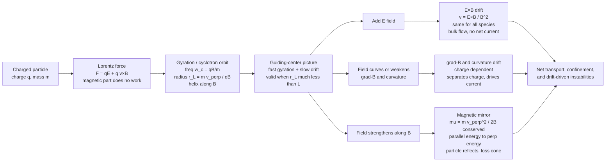

# 🧲 Single Particle Motion and Drifts

> [!abstract] TL;DR
> Every charged particle in a magnetic field executes a tight **circular gyration** around a field line — the cyclotron orbit — so a magnetic field acts as a **bottle** that ties particles to field lines. When any extra force acts (an electric field, gravity, a field that curves or weakens), the whole circle **drifts** sideways, *perpendicular* to both the force and $\vec{B}$. This "orbit theory" of the **guiding center** is the microscopic first picture of magnetic confinement: master the gyration and the drifts and you can explain how a tokamak, a magnetic mirror, and the Van Allen belts hold plasma hotter than the Sun's core in place — and why some drifts quietly drive the currents and instabilities that let it leak out.

## Intuition

**Analogy:** A charged particle in a magnetic field is like a **dog on a leash tied to a post**. It cannot run away *across* the field — the leash (the magnetic force) yanks it back — so it can only circle the post, endlessly, at a fixed radius. The particle is a **bead threaded on a magnetic field line**: free to slide *along* the wire, trapped *around* it.

Now start **dragging the post slowly**, or **tilt the ground** so the dog is pushed sideways. The dog keeps circling, but the whole circle **creeps along** in a direction you might not expect — not toward the push, but *sideways to it*. That sideways creep is a **drift**. Push the particle with an electric field and the entire orbit slides at $\vec{E}\times\vec{B}/B^2$; make the field stronger on one side and the orbit crawls along the field's ridge. And if the dog runs into ground where the leash gets shorter and shorter (a **magnetic mirror** — a region of stronger field), it is turned around and **bounces back**. These three behaviours — **gyrate, drift, bounce** — are the entire vocabulary of how a magnetic field confines a plasma.

---

## How It Works

### Core mechanics

**1. The Lorentz force is the whole story.** A particle of charge $q$ and mass $m$ obeys Newton's law with the electromagnetic force ([[Magnetism_and_Biot_Savart]]):

$$m\frac{d\vec{v}}{dt} = q\left(\vec{E} + \vec{v}\times\vec{B}\right).$$

The magnetic part $q\,\vec{v}\times\vec{B}$ is always perpendicular to the velocity, so **it does no work** — it bends the path without changing the speed. That perpendicular bend is what turns a straight line into a circle.

**2. Gyration (cyclotron motion).** In a uniform $\vec{B}$ with no other forces, the perpendicular velocity traces a **circle** at the **cyclotron (gyro) frequency** and **Larmor (gyro) radius**:

$$\omega_c = \frac{|q|B}{m}, \qquad r_L = \frac{m v_\perp}{|q|B} = \frac{v_\perp}{\omega_c}.$$

The frequency depends only on $q/m$ and $B$, **not on speed**; faster particles just trace bigger circles. **Electrons and ions gyrate in opposite senses** (opposite charge), and electrons — being ~1836× lighter — gyrate ~1836× faster and on ~43× smaller circles for the same speed. Motion *along* $\vec{B}$ is unaffected, so the full orbit is a **helix**.

**3. The guiding-center approximation.** If everything else changes slowly compared to a gyration, we split the motion into a **fast tight gyration** plus the **slow drift of its center** — the **guiding center**. Averaging over the fast circle removes the gyration and leaves clean drift equations. This is the central trick of orbit theory.

**4. The universal drift.** Any steady force $\vec{F}$ perpendicular to $\vec{B}$ makes the guiding center drift:

$$\boxed{\;\vec{v}_F = \frac{1}{q}\frac{\vec{F}\times\vec{B}}{B^2}\;}$$

Feed different forces into this one formula and every named drift falls out:

- **E×B drift** — $\vec{F}=q\vec{E}$, so $\displaystyle \vec{v}_E = \frac{\vec{E}\times\vec{B}}{B^2}$. The charge **cancels**: ions and electrons drift *together*, at the same speed and direction. It moves the whole plasma as a bulk flow and carries **no net current**.
- **Grad-B drift** — a weakening field means the particle's circle is tighter on the strong side than the weak side, so it fails to close: $\displaystyle \vec{v}_{\nabla B} = \frac{m v_\perp^2}{2qB^3}\,\vec{B}\times\nabla B$. The $q$ **survives**, so ions and electrons drift *opposite* ways — this **separates charge and drives current**.
- **Curvature drift** — following a curved field line requires centrifugal force $\vec{F}=m v_\parallel^2 \hat{R}_c/R_c$: $\displaystyle \vec{v}_R = \frac{m v_\parallel^2}{qB^2}\frac{\vec{R}_c\times\vec{B}}{R_c^2}$. Also **charge-dependent** — in a tokamak grad-B + curvature drifts push ions up and electrons down, and the resulting vertical field must be twisted away by the poloidal field or the plasma is lost.
- **Gravitational / polarization drifts** — gravity gives $\vec{v}_g=\frac{m}{q}\frac{\vec{g}\times\vec{B}}{B^2}$; a *changing* $\vec{E}$ gives the inertial **polarization drift** $\vec{v}_p=\frac{m}{qB^2}\frac{d\vec{E}_\perp}{dt}$, the plasma analogue of a dielectric response.

**5. Adiabatic invariants and the magnetic mirror.** When the field changes slowly (in space or time) over a gyro-orbit, the **magnetic moment** is an **adiabatic invariant** — nearly constant:

$$\mu = \frac{m v_\perp^2}{2B} \approx \text{const}.$$

As a particle moves into **stronger** $B$, $\mu$-conservation forces $v_\perp^2$ up; since $\tfrac12 m v^2$ is fixed (magnetic force does no work), $v_\parallel$ must fall. Where $v_\parallel\to 0$ the particle **reflects** — a **magnetic mirror**. Only particles inside the **loss cone** escape:

$$\sin^2\theta_{\text{loss}} = \frac{B_{\min}}{B_{\max}} = \frac{1}{R_m},$$

with mirror ratio $R_m$. This traps plasma in **mirror machines** and holds energetic particles in the **Van Allen belts**, where they also bounce between hemispheres and drift around Earth.

**6. Magnetization.** All of this holds only if the gyro-orbit is small compared to the scale over which the field changes: $r_L \ll L$. Then the plasma is **magnetized** and behaves like beads on wires; when $r_L \sim L$ the guiding-center picture — and $\mu$ conservation — break down.

### Flow / architecture



---

## Key Concepts

### Secondary Level

- A magnetic field makes a moving charge travel in **circles** — it is a leash that keeps particles from crossing field lines. That is why a magnetic field can act as a **bottle** for a hot, ionized gas.
- **Aurorae** happen because solar-wind particles spiral down Earth's field lines into the poles; the **Van Allen belts** are particles trapped bouncing back and forth in Earth's field.
- Change something — push with electricity, curve the field — and the circle **slowly slides sideways**. That sideways sliding is a **drift**.

### Undergraduate Level

- **Lorentz force** $m\dot{\vec{v}}=q(\vec{E}+\vec{v}\times\vec{B})$; the magnetic force does **no work**, so gyration conserves speed. See [[Rotational_Dynamics]] and [[Oscillations_and_SHM]] — gyration is uniform circular motion with angular frequency $\omega_c$.
- **Cyclotron frequency** $\omega_c=|q|B/m$ (independent of energy) and **Larmor radius** $r_L=mv_\perp/|q|B$. Electrons and ions rotate in **opposite senses**.
- **Guiding center** = orbit-averaged position; separates the fast gyration from the slow drift.
- **E×B drift** $\vec{v}_E=\vec{E}\times\vec{B}/B^2$: **charge-independent**, hence a bulk flow with **no current**. The cross product structure is exactly that of [[Vectors_and_3D_Geometry]].
- **Grad-B** and **curvature** drifts: **charge-dependent** → they separate charge and **drive currents**, central to tokamak equilibrium and the magnetospheric **ring current**.
- **Magnetic moment** $\mu=mv_\perp^2/2B$ is an **adiabatic invariant**; the **magnetic mirror** reflects particles moving into stronger field; the **loss cone** sets which particles escape.

### Graduate Level

- **Hierarchy of adiabatic invariants**: the **first** $\mu$ (gyration), the **second (longitudinal)** $J=\oint m v_\parallel\,d\ell$ (bounce motion between mirrors), the **third** $\Phi$ (drift-shell flux). Each is conserved when its motion is fast compared to the field's variation.
- **When $\mu$ breaks**: fails when $r_L/L$ is not small, when the field changes appreciably in one gyroperiod ($\omega \sim \omega_c$, e.g. **cyclotron resonance heating**), or at field nulls / sharp gradients ($\vec{B}\to 0$, reconnection regions) — where guiding-center theory is invalid and full-orbit integration is required.
- **Drift currents and MHD**: summing charge-dependent drifts over a distribution gives the **diamagnetic** and drift currents that appear in the [[Magnetohydrodynamics_and_Plasma_Flows]] force balance $\vec{J}\times\vec{B}=\nabla p$. Curvature/grad-B drifts in "bad curvature" regions seed **interchange** and **ballooning** instabilities.
- **Polarization drift** $\vec{v}_p=\frac{m}{qB^2}\dot{\vec{E}}_\perp$ carries the plasma's inertia and sets the low-frequency dielectric constant $\varepsilon_\perp = 1 + \rho c^2/B^2$.
- **Rigorous foundation**: Northrop's guiding-center expansion in $\epsilon = r_L/L$ derives the drift equations and the conservation of $\mu$ systematically; the motion admits a **non-canonical Hamiltonian / gyrokinetic** formulation used in modern turbulence codes.

---

## Python Demo

```python
# Single-particle motion in E and B fields via the BORIS PUSHER.
# The Boris algorithm splits each step into: half electric kick,
# a pure magnetic ROTATION (exactly speed-preserving), half electric kick.
# It is the standard, phase-space-preserving integrator for the Lorentz
# force  dv/dt = (q/m)(E + v x B), and it stays stable over many orbits.
import numpy as np
import matplotlib.pyplot as plt

def boris_push(x0, v0, q, m, Efunc, Bfunc, dt, nsteps):
    """Integrate the Lorentz force. Efunc(x), Bfunc(x) return 3-vectors."""
    x = np.zeros((nsteps + 1, 3))
    v = np.zeros((nsteps + 1, 3))
    x[0], v[0] = np.asarray(x0, float), np.asarray(v0, float)
    for n in range(nsteps):
        E = Efunc(x[n]); B = Bfunc(x[n]); qm = q / m
        v_minus = v[n] + qm * E * (dt / 2.0)          # half electric kick
        t = qm * B * (dt / 2.0)                        # magnetic rotation
        s = 2.0 * t / (1.0 + t.dot(t))
        v_prime = v_minus + np.cross(v_minus, t)
        v_plus  = v_minus + np.cross(v_prime, s)
        v[n + 1] = v_plus + qm * E * (dt / 2.0)        # half electric kick
        x[n + 1] = x[n] + v[n + 1] * dt                # advance position
    return x, v

B0, q, m = 1.0, 1.0, 1.0            # normalized units: omega_c = qB/m = 1
zero_E   = lambda x: np.zeros(3)
uniformB = lambda x: np.array([0.0, 0.0, B0])

# (a) PURE B  ->  gyration (cyclotron orbit)
vperp = 1.0                         # -> Larmor radius r_L = m*vperp/(qB) = 1
xg, _ = boris_push([0, 0, 0], [vperp, 0, 0], q, m, zero_E, uniformB, 0.02, 700)
print("w_c = qB/m        =", q * B0 / m)
print("r_L = m*vperp/qB  =", m * vperp / (q * B0))
print("gyroperiod 2pi/wc =", 2 * np.pi * m / (q * B0))

# (b) ADD PERPENDICULAR E  ->  E x B drift (independent of charge & mass)
Ex = 0.5
Efield = lambda x: np.array([Ex, 0.0, 0.0])
v_ExB  = np.cross([Ex, 0, 0], [0, 0, B0]) / B0**2      # theory: (0, -Ex/B0, 0)
xi, _ = boris_push([0, 0, 0], [0, 0, 0], +1.0, 1.0, Efield, uniformB, 0.02, 1500)
xe, _ = boris_push([0, 0, 0], [0, 0, 0], -1.0, 1.0, Efield, uniformB, 0.02, 1500)
T = 1500 * 0.02
print("\nE x B drift  theory vy =", v_ExB[1])
print("ion   measured vy      =", xi[-1, 1] / T)
print("elec. measured vy      =", xe[-1, 1] / T, " (same -> no net current)")

# (c) MAGNETIC MIRROR  ->  mu = m*vperp^2/(2B) adiabatic invariant
L = 12.0                            # paraxial divergence-free mirror field
def B_mirror(x):
    xx, yy, zz = x
    dBz = 2.0 * B0 * zz / L**2
    return np.array([-0.5 * xx * dBz, -0.5 * yy * dBz, B0 * (1.0 + (zz / L)**2)])

# pitch angle 45 deg (v_par = v_perp = 1) -> mirrors where B = 2*B0, i.e. z = L
xm, vm = boris_push([1.0, 0.0, 0.0], [0.0, 1.0, 1.0], 1.0, 1.0,
                    zero_E, B_mirror, 0.02, 6000)
t_axis = 0.02 * np.arange(len(xm))
mu = np.empty(len(xm))
for i in range(len(xm)):
    B = B_mirror(xm[i]); Bmag = np.linalg.norm(B)
    vpar = vm[i].dot(B / Bmag)
    mu[i] = m * (vm[i].dot(vm[i]) - vpar**2) / (2.0 * Bmag)
print("\nmagnetic moment mu: mean =", round(mu.mean(), 4),
      " spread std/mean =", round(mu.std() / mu.mean(), 4))

# PLOTS
fig, ax = plt.subplots(2, 2, figsize=(11, 9))
ax[0, 0].plot(xg[:, 0], xg[:, 1]); ax[0, 0].plot(0, 0, 'k+')
ax[0, 0].set_aspect('equal'); ax[0, 0].set_xlabel("x"); ax[0, 0].set_ylabel("y")
ax[0, 0].set_title("(a) Gyration in uniform B")

ax[0, 1].plot(xi[:, 0], xi[:, 1], lw=0.8, label="ion  q>0")
ax[0, 1].plot(xe[:, 0], xe[:, 1], lw=0.8, label="electron  q<0")
ax[0, 1].set_xlabel("x"); ax[0, 1].set_ylabel("y"); ax[0, 1].legend()
ax[0, 1].set_title("(b) E x B drift is charge-independent")

ax[1, 0].plot(t_axis, xm[:, 2]); ax[1, 0].axhline(L, ls='--', c='r')
ax[1, 0].axhline(-L, ls='--', c='r')
ax[1, 0].set_xlabel("time"); ax[1, 0].set_ylabel("z (along field)")
ax[1, 0].set_title("(c) Magnetic mirror: z bounces at stronger B")

ax[1, 1].plot(t_axis, mu); ax[1, 1].set_ylim(0, 2 * mu.mean())
ax[1, 1].set_xlabel("time"); ax[1, 1].set_ylabel("magnetic moment mu")
ax[1, 1].set_title("(d) mu = m*vperp^2/(2B) nearly conserved")

plt.tight_layout()
plt.savefig("single_particle_drifts.png", dpi=130)
plt.show()
```

Running it prints $\omega_c=1$, $r_L=1$, an $\vec{E}\times\vec{B}$ drift of $-0.5$ that is **identical for the ion and the electron** (confirming charge-independence and zero net current), a $z$-coordinate that **bounces** where the field doubles, and a magnetic moment $\mu$ that stays constant to a fraction of a percent — the adiabatic invariant in action.

---

## Real-World Applications

- **Tokamaks (ITER, JET, SPARC).** Grad-B and curvature drifts push ions and electrons *vertically apart*; the resulting charge separation would create an $\vec{E}$ that $\vec{E}\times\vec{B}$-drifts the whole plasma into the wall. The **toroidal + poloidal (twisted) field** short-circuits this, the core idea of magnetic confinement fusion.
- **Magnetic mirror machines.** Two high-field coils make a bottle that reflects particles outside the loss cone — an entire class of fusion devices, and the mechanism behind the **Van Allen radiation belts**.
- **Earth's magnetosphere.** Trapped particles gyrate, **bounce** between mirror points near the poles, and grad-B/curvature-drift *around* Earth — ions west, electrons east — forming the **ring current** that depresses the surface field during geomagnetic storms. Aurorae are particles precipitating through the loss cone. See [[The_Sun]] for the solar-wind source and [[Pulsars_Neutron_Stars_and_Magnetars]] for the same physics at $10^{12}$ Gauss.
- **Cyclotron devices.** Mass spectrometers and cyclotron accelerators exploit $\omega_c=qB/m$; electron-cyclotron resonance ($\omega=\omega_c$) heats fusion plasmas and drives ECR ion sources.
- **Hall thrusters.** Electrons are magnetized (small $r_L$) and $\vec{E}\times\vec{B}$-drift azimuthally while ions — too heavy to be magnetized — are accelerated straight out for thrust.

---

## Common Pitfalls

- **Confusing the guiding center with the full orbit.** Drift formulas describe the *orbit-averaged* center, not the instantaneous particle. Near field nulls, sharp gradients, or when $r_L\sim L$ the averaging fails and you **must** integrate the full Lorentz orbit.
- **Thinking all drifts carry current.** The **$\vec{E}\times\vec{B}$ drift is charge-independent** — ions and electrons go the same way, so it is a bulk flow with **no net current**. **Grad-B and curvature drifts are charge-dependent**, so they *do* separate charge and drive currents. Mixing these up gives wrong signs for tokamak equilibrium and the ring current.
- **Assuming $\mu$ is always conserved.** $\mu=mv_\perp^2/2B$ is only an *adiabatic* invariant — it holds when the field varies slowly over a gyro-orbit. It **breaks** at cyclotron resonance ($\omega\sim\omega_c$), at field nulls, and whenever $r_L/L$ is not small.
- **Forgetting the magnetization condition.** The whole picture assumes $r_L \ll L$ (particle magnetized). Heavy ions or weak fields can make $r_L$ comparable to the device size — then the ions are effectively *unmagnetized* even while the electrons stay tied to the field.
- **Getting the drift direction wrong.** Drifts are perpendicular to **both** the force and $\vec{B}$ (a cross product), *not* along the force. The $\vec{E}\times\vec{B}$ drift is sideways to $\vec{E}$, never parallel to it.
- **Mis-scaling $\omega_c$ and $r_L$.** The cyclotron frequency is independent of speed; the Larmor radius grows with $v_\perp$. Electrons gyrate far faster and far tighter than ions — a factor set by $q/m$, not by energy.

---

## Related Concepts

- [[Magnetism_and_Biot_Savart]] — supplies the magnetic force $q\vec{v}\times\vec{B}$ that produces all gyration.
- [[Electric_Fields_and_Coulombs_Law]] — the $\vec{E}$ field that drives the $\vec{E}\times\vec{B}$ drift.
- [[Maxwells_Equations]] — the full field framework the particle moves through and back-reacts on.
- [[Magnetohydrodynamics_and_Plasma_Flows]] — the fluid picture whose currents and pressure balance emerge from summing these single-particle drifts.
- [[Rotational_Dynamics]] — gyration is uniform circular motion; $\omega_c$ is its angular frequency.
- [[Oscillations_and_SHM]] — gyration and the mirror bounce are periodic (harmonic-like) motions.
- [[Newtons_Laws_and_Kinematics]] — the Lorentz force is just $\vec{F}=m\vec{a}$ with the EM force.
- [[Vectors_and_3D_Geometry]] — the cross products $\vec{v}\times\vec{B}$ and $\vec{E}\times\vec{B}$ set every drift direction.
- [[Runge_Kutta_and_Adaptive_Methods]] — general ODE integration; contrast with the specialized Boris pusher.
- [[Symplectic_Integrators_and_Hamiltonian_Dynamics]] — why structure-preserving schemes like Boris beat RK4 over many orbits.
- [[The_Sun]] — solar wind, the source population for magnetospheric trapping.
- [[Pulsars_Neutron_Stars_and_Magnetars]] — the same gyration and mirroring at extreme field strengths.

*Foundational siblings in this section (build order): Plasma_Physics_Overview establishes what a plasma is; Magnetic_Confinement_Concepts applies these drifts to tokamaks and mirrors; Space_Plasma_Physics_and_the_Magnetosphere develops the Van Allen / ring-current picture; Collisions_and_Transport_in_Plasmas adds scattering that fills the loss cone and causes cross-field transport; The_Two_Fluid_and_MHD_Models coarse-grains these orbits into fluid equations.*

---

## Review Questions

1. **(Secondary)** Why can a magnetic field trap charged particles but a hot neutral gas just flies apart? What is different about a charged particle's path in a magnetic field?
2. **(Undergraduate)** A proton and an electron sit in the same uniform $\vec{E}$ and $\vec{B}$ (perpendicular to each other). In which direction, and how fast, does each one's guiding center drift? Now put them in a field that weakens across the region — how does your answer change, and which case drives a current?
3. **(Undergraduate/Graduate)** A particle with pitch angle $45^\circ$ enters a magnetic mirror with ratio $R_m=4$. Using $\mu$-conservation, does it reflect or escape through the loss cone? Derive the loss-cone condition and explain physically what happens to its parallel vs perpendicular energy as it climbs into the stronger field.
4. **(Graduate)** In a tokamak, grad-B and curvature drifts push ions and electrons in opposite vertical directions. Explain the charge separation this would cause in a *purely toroidal* field, the $\vec{E}\times\vec{B}$ motion that would follow, and why adding a poloidal field (rotational transform) fixes it.
5. **(Graduate)** Under what conditions does the magnetic moment $\mu$ *cease* to be conserved? Give three distinct physical situations and, for one of them, explain what replaces the guiding-center description.

---

## Sources

- Chen, F. F. — *Introduction to Plasma Physics and Controlled Fusion* (3rd ed.), Ch. 2 "Single-Particle Motions." Springer, 2016.
- Goldston, R. J. & Rutherford, P. H. — *Introduction to Plasma Physics*, Ch. 2–3 (guiding-center drifts, adiabatic invariants). CRC Press, 1995.
- Northrop, T. G. — *The Adiabatic Motion of Charged Particles*. Interscience, 1963 (the rigorous guiding-center expansion).
- Bellan, P. M. — *Fundamentals of Plasma Physics*, Ch. 3 "Motion of a single plasma particle." Cambridge University Press, 2006.
- Birdsall, C. K. & Langdon, A. B. — *Plasma Physics via Computer Simulation* (the Boris particle pusher). CRC Press, 2004.

---

#plasma-physics #single-particle-motion #gyration #ExB-drift #magnetic-mirror
