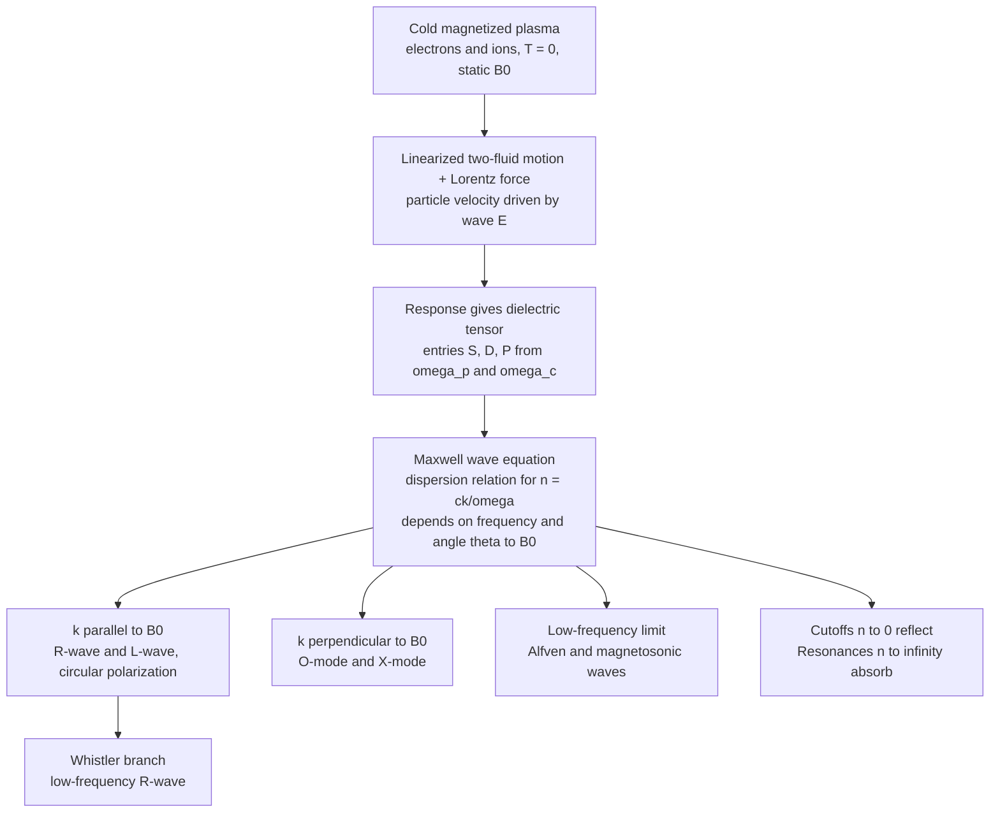

# 🌊 Cold Plasma Waves and Dispersion

> [!abstract] TL;DR
> A magnetized plasma is not a single medium but a **zoo of waves**. In the *cold* (zero-temperature, two-fluid) approximation, every wave is a solution of the linearized fluid + Maxwell equations, all packaged into a single **dielectric tensor** whose entries are built from the **plasma frequency** $\omega_p$ and **cyclotron frequency** $\omega_c$. The resulting **dispersion relation** gives the refractive index $n = ck/\omega$ as a function of frequency and the angle to the magnetic field $\mathbf{B}_0$. Along $\mathbf{B}_0$ you get the right/left circularly polarized **R-** and **L-waves** and the low-frequency **whistler**; across $\mathbf{B}_0$ the **ordinary (O)** and **extraordinary (X)** modes; at the bottom, the **Alfvén** and magnetosonic waves. Two organizing ideas rule everything: **cutoffs** ($n \to 0$, wave reflected) and **resonances** ($n \to \infty$, wave absorbed) — the machinery behind RF heating, plasma diagnostics, ionospheric radio, and the eerie descending "whistlers" of lightning.

## Intuition — analogy FIRST

A plucked guitar string carries essentially one kind of wave. A plasma threaded by a magnetic field is more like a **whole orchestra**: it supports a bewildering variety of waves, each travelling in its own way.

- Some ride the magnetic field lines like waves on a taut rope — these are the **Alfvén** waves.
- Some behave like light bent and split by a crystal into two rays — the plasma is **birefringent**, splitting a radio wave into an **ordinary** and an **extraordinary** ray.
- Some spiral with a definite **handedness** that lets them sneak through where others cannot — the **whistlers**, which carry a lightning stroke's radio energy along Earth's field lines and turn it into a slow, eerie **descending tone** you can hear on a shortwave radio.

Learning to name this zoo — which wave propagates, which is reflected, which is swallowed — is learning the *language a magnetized plasma speaks*. The "cold" approximation is the beginner's dictionary: ignore the random thermal motion of the particles and keep only their organized, field-driven sloshing. That single simplification already reproduces almost every named wave in the sky and in a fusion device.

---

## How It Works

### The logic in one line

Push the plasma with a wave field $\mathbf{E}\,e^{i(\mathbf{k}\cdot\mathbf{r}-\omega t)}$, ask how the electrons and ions respond (they gyrate around $\mathbf{B}_0$ and slosh at $\omega_p$), fold that response into Maxwell's equations, and you get an algebraic condition — the **dispersion relation** — that only certain $(\omega, \mathbf{k})$ pairs may satisfy. Those pairs *are* the waves.



### The dielectric tensor (Stix form)

With $\mathbf{B}_0$ along $\hat{z}$, the cold-plasma dielectric tensor is

$$\boldsymbol{\varepsilon} =
\begin{pmatrix} S & -iD & 0 \\ iD & S & 0 \\ 0 & 0 & P \end{pmatrix},$$

where the sums run over all species $s$ (electrons and each ion), $\omega_{ps}$ is the plasma frequency and $\omega_{cs}$ the (signed) cyclotron frequency:

$$S = 1 - \sum_s \frac{\omega_{ps}^2}{\omega^2 - \omega_{cs}^2}, \quad
D = \sum_s \frac{\omega_{cs}}{\omega}\,\frac{\omega_{ps}^2}{\omega^2 - \omega_{cs}^2}, \quad
P = 1 - \sum_s \frac{\omega_{ps}^2}{\omega^2}.$$

The combinations $R = S + D$ and $L = S - D$ are the *rotating-frame* responses (right- and left-hand). The two rules that follow from these entries are the whole game: where an entry $\to 0$ the wave is **reflected**; where a denominator $\to 0$ the wave hits a **resonance** and is absorbed or mode-converted.

---

## Key Concepts / Details

### Secondary Level

**A plasma is a dispersive medium.** Just as a glass prism bends blue light more than red because its refractive index depends on colour, a plasma's refractive index $n = ck/\omega$ depends strongly on frequency. Low-frequency radio waves see a very different plasma than high-frequency ones.

**The plasma frequency $\omega_p$ is a wall.** Electrons in a plasma naturally slosh back and forth at the plasma frequency $\omega_{pe} \approx 2\pi \times 9\sqrt{n_e\,[\text{m}^{-3}]}$ Hz. A radio wave whose frequency is *below* $\omega_{pe}$ cannot pass — it is **reflected**. This is why AM radio "skywave" bounces off the ionosphere and reaches over the horizon at night, and why a spacecraft can go silent during re-entry (a dense plasma sheath).

**Magnetic field makes it directional.** Add a magnetic field and the plasma stops treating all waves equally: a wave running *along* the field behaves differently from one running *across* it, and left- vs right-circularly-polarized waves split apart — exactly like a birefringent crystal splitting light.

**Whistlers.** A lightning flash radiates a broadband radio pulse. Part of it couples into a right-hand wave that follows Earth's magnetic field into space and back down. Because the wave's speed rises with frequency, the high notes arrive first and the low notes trail behind, producing a **descending whistle** lasting a second or more — lightning's song played on the magnetosphere.

### Undergraduate Level

**The cold two-fluid model.** Treat electrons and ions as cold fluids (pressure = 0). Linearize the momentum equation $m_s\,\partial_t \mathbf{v}_s = q_s(\mathbf{E} + \mathbf{v}_s \times \mathbf{B}_0)$, combine with continuity and Maxwell, and every wave falls out. Two frequencies dominate every formula:

$$\omega_{ps}^2 = \frac{n_s q_s^2}{\varepsilon_0 m_s} \quad(\text{plasma frequency}), \qquad \omega_{cs} = \frac{|q_s| B_0}{m_s}\quad(\text{cyclotron / gyro frequency}).$$

**Unmagnetized limit ($B_0 = 0$).** Three canonical waves:

| Wave | Dispersion | Character |
|------|-----------|-----------|
| Langmuir / electron plasma oscillation | $\omega = \omega_{pe}$ (cold) | Electrostatic, non-propagating in the cold limit ($v_g = 0$) |
| EM wave in plasma | $\omega^2 = \omega_{pe}^2 + c^2k^2$ | Transverse; **cutoff at $\omega_{pe}$**, so $n^2 = 1 - \omega_{pe}^2/\omega^2$ |
| Ion-acoustic wave | $\omega = k\,c_s,\ c_s=\sqrt{k_BT_e/m_i}$ | Sound-like; *strictly a warm effect* — listed for completeness |

**Parallel propagation ($\mathbf{k}\parallel\mathbf{B}_0$).** The dispersion relation factorizes into three independent waves:

$$n^2 = R \quad(\text{R-wave, right circular}), \qquad n^2 = L \quad(\text{L-wave, left circular}), \qquad P = 0 \quad(\text{plasma oscillation}).$$

- The **R-wave** rotates in the same sense as electrons gyrate, so it hits an **electron cyclotron resonance** at $\omega = \omega_{ce}$ (there $R \to \infty$).
- The **L-wave** rotates with the ions and resonates at $\omega = \omega_{ci}$.
- The low-frequency piece of the R-branch ($\omega_{ci} \ll \omega \ll \omega_{ce}$) is the **whistler**, with $n^2 \approx \dfrac{\omega_{pe}^2}{\omega(\omega_{ce}-\omega)}$.

**Perpendicular propagation ($\mathbf{k}\perp\mathbf{B}_0$).** Two modes:

- **Ordinary (O) mode:** $\mathbf{E}\parallel\mathbf{B}_0$, so the field never sees the magnetic force — it behaves like an unmagnetized EM wave, $n^2 = P = 1 - \omega_{pe}^2/\omega^2$, **cutoff at $\omega_{pe}$**.
- **Extraordinary (X) mode:** $\mathbf{E}\perp\mathbf{B}_0$, partly electrostatic, $n^2 = \dfrac{RL}{S} = \dfrac{S^2-D^2}{S}$, with a **resonance** at the **upper-hybrid** frequency $S = 0 \Rightarrow \omega_{uh} = \sqrt{\omega_{pe}^2 + \omega_{ce}^2}$ and a **lower-hybrid** resonance $\omega_{lh}$ between the ion and electron cyclotron frequencies.

**Cutoffs vs resonances — the master table:**

| | Cutoff | Resonance |
|---|--------|-----------|
| Refractive index | $n \to 0$ | $n \to \infty$ |
| Wavelength | $\to \infty$ | $\to 0$ |
| Physics | wave **reflected** | wave **absorbed / mode-converted** |
| Where (parallel) | $R=0$, $L=0$, $P=0$ | $R\to\infty\ (\omega_{ce})$, $L\to\infty\ (\omega_{ci})$ |
| Where (perpendicular) | $R=0,\ L=0,\ P=0$ | $S=0$ (upper/lower hybrid) |

### Graduate Level

**The general dispersion relation.** For a wave at angle $\theta$ to $\mathbf{B}_0$, the cold-plasma dispersion is a biquadratic in $n^2$:

$$A\,n^4 - B\,n^2 + C = 0,$$
$$A = S\sin^2\theta + P\cos^2\theta, \quad B = RL\sin^2\theta + PS\,(1+\cos^2\theta), \quad C = P\,R\,L.$$

Equivalently, the compact **Astrom / Stix** angular form (the parent of the **Appleton–Hartree** equation used in ionospheric physics):

$$\tan^2\theta = \frac{-P\,(n^2 - R)(n^2 - L)}{(S\,n^2 - RL)(n^2 - P)}.$$

Setting $\theta = 0$ recovers $n^2=R,\ n^2=L,\ P=0$; setting $\theta = \pi/2$ recovers $n^2 = P$ (O) and $n^2 = RL/S$ (X). **Cutoffs** are the roots of $C = PRL = 0$ (independent of angle); **resonances** ($n\to\infty$) come from $A = 0$, i.e. $\tan^2\theta = -P/S$, which sweeps continuously from the cyclotron resonances (parallel) to the hybrid resonances (perpendicular).

**The CMA diagram.** The **Clemmow–Mullaly–Allis** diagram plots the parameter plane $\left(\omega_{pe}^2/\omega^2\ \text{vs}\ \omega_{ce}/\omega\right)$ and partitions it into ~13 regions using the cutoff and resonance curves as fences. Within each region the *topology* of the wave-normal surfaces (how phase velocity varies with $\theta$) is fixed. **The CMA diagram is a map, not a formula** — it tells you which modes exist and how they connect as you cross a cutoff or resonance, but you still solve the dispersion relation for actual numbers.

**Where it connects to real machines:**
- **RF heating and current drive** launch a specific mode so that it propagates to a resonance and dumps its energy: **ECRH** at $\omega_{ce}$ (X- or O-mode from the low-field side), **ICRH** at $\omega_{ci}$ (fast wave), **LHCD** at the lower-hybrid resonance. Wave **accessibility** — will the launched wave reach the resonance without hitting an intervening cutoff? — is read directly off the CMA topology.
- **Diagnostics** read these dispersions: **interferometry** turns the O-mode phase shift ($\propto P \propto n_e$) into a density; **reflectometry** locates the cutoff layer where $n \to 0$; **ECE** (electron cyclotron emission) reads temperature off the $\omega_{ce}$ resonance.
- **Low-frequency limit → MHD.** As $\omega \to 0$ the parallel R/L branches merge into the **shear Alfvén wave** $\omega = k_\parallel v_A$ with $v_A = B_0/\sqrt{\mu_0\rho}$, and the perpendicular X-mode becomes the compressional **magnetosonic** wave — the bridge to [[Magnetohydrodynamics]].

**What cold theory omits.** Setting $T=0$ throws away all *kinetic* physics: no **Landau damping**, no **cyclotron damping**, and no **Bernstein waves** (the electrostatic modes that appear near harmonics of $\omega_{ce}$ in a warm plasma). Cold theory can predict a resonance ($n \to \infty$) but not *how* the energy is absorbed there — that requires the warm/kinetic picture (next note).

---

## Python Demo

```python
# Cold-plasma "wave zoo": (a) parallel R/L dispersion showing the whistler
# branch, electron cyclotron resonance and cutoffs; (b) perpendicular O/X
# dispersion with the plasma cutoff and upper-hybrid resonance; and (c) the
# descending whistler tone (group delay vs frequency). numpy + matplotlib.
import numpy as np
import matplotlib.pyplot as plt

# Frequencies normalized to the electron cyclotron frequency wce = 1.
# Overdense plasma: plasma frequency above the cyclotron frequency.
wce = 1.0
wpe = 1.5

# Characteristic frequencies (electron-only cold plasma)
w_uh = np.sqrt(wpe**2 + wce**2)                     # upper-hybrid resonance
w_R  = 0.5 * (wce + np.sqrt(wce**2 + 4*wpe**2))     # right-hand cutoff  R = 0
w_L  = 0.5 * (-wce + np.sqrt(wce**2 + 4*wpe**2))    # left-hand cutoff   L = 0

def stix_RL(w):
    R = 1.0 - wpe**2 / (w * (w - wce))   # right circ: resonance at w = wce
    L = 1.0 - wpe**2 / (w * (w + wce))   # left  circ
    return R, L

def stix_SP(w):
    S = 1.0 - wpe**2 / (w**2 - wce**2)
    P = 1.0 - wpe**2 / w**2
    return S, P

fig, axes = plt.subplots(1, 3, figsize=(16, 5))

# ---- (a) Parallel propagation: n^2 = R (whistler + free branch), n^2 = L ----
w = np.linspace(0.05, 3.0, 4000)
with np.errstate(divide='ignore', invalid='ignore'):
    R, L = stix_RL(w)
ax = axes[0]
ax.plot(w, R, lw=2, label=r'$n^2 = R$  (right / whistler)')
ax.plot(w, L, lw=2, label=r'$n^2 = L$  (left)')
ax.axhline(0, color='k', lw=0.8)
ax.axvline(wce,  color='red',   ls='--', lw=1.2, label=r'$\omega_{ce}$ (R resonance)')
ax.axvline(wpe,  color='green', ls=':',  lw=1.2, label=r'$\omega_{pe}$')
ax.axvline(w_R,  color='purple',ls='-.', lw=1.0, label=r'$\omega_R$ cutoff')
ax.axvline(w_L,  color='brown', ls='-.', lw=1.0, label=r'$\omega_L$ cutoff')
ax.axvspan(0.05, wce, color='cyan', alpha=0.12, label='whistler band')
ax.set_ylim(-4, 12); ax.set_xlim(0, 3)
ax.set_xlabel(r'$\omega / \omega_{ce}$'); ax.set_ylabel(r'$n^2 = (ck/\omega)^2$')
ax.set_title('Parallel to B: R-wave and L-wave')
ax.legend(fontsize=7, loc='upper right'); ax.grid(alpha=0.3)

# ---- (b) Perpendicular propagation: O-mode n^2 = P, X-mode n^2 = RL/S ----
w = np.linspace(0.05, 3.0, 4000)
with np.errstate(divide='ignore', invalid='ignore'):
    R, L = stix_RL(w)
    S, P = stix_SP(w)
    nX2 = R * L / S
ax = axes[1]
ax.plot(w, P,   lw=2, label=r'O-mode  $n^2 = P$')
ax.plot(w, nX2, lw=2, label=r'X-mode  $n^2 = RL/S$')
ax.axhline(0, color='k', lw=0.8)
ax.axvline(wpe,  color='green',  ls=':',  lw=1.2, label=r'$\omega_{pe}$ (O cutoff)')
ax.axvline(w_uh, color='red',    ls='--', lw=1.2, label=r'$\omega_{uh}$ (X resonance)')
ax.axvline(w_R,  color='purple', ls='-.', lw=1.0, label=r'$\omega_R$ cutoff')
ax.set_ylim(-4, 12); ax.set_xlim(0, 3)
ax.set_xlabel(r'$\omega / \omega_{ce}$'); ax.set_ylabel(r'$n^2 = (ck/\omega)^2$')
ax.set_title('Perpendicular to B: O-mode and X-mode')
ax.legend(fontsize=7, loc='upper right'); ax.grid(alpha=0.3)

# ---- (c) The whistler tone: group delay vs frequency (descending glide) ----
c   = 3.0e8            # m/s
fce = 20.0e3          # electron cyclotron frequency, Hz
fpe = 100.0e3         # plasma frequency, Hz  (dense plasmasphere)
Lp  = 5.0e7           # field-aligned path length, m
f   = np.linspace(0.02*fce, 0.5*fce, 500)     # audio-band whistler window
n   = fpe / np.sqrt(f * (fce - f))            # cold R-mode / whistler index
Ng  = np.gradient(f * n, f)                   # group index Ng = d(f n)/df
t   = Lp * Ng / c                             # arrival time of each frequency
axes[2].plot(t, f/1e3, lw=2, color='navy')
f_nose = fce/4.0                              # classic whistler-nose frequency
axes[2].axhline(f_nose/1e3, color='red', ls='--', lw=1,
                label=r'nose $f = \omega_{ce}/4$')
axes[2].set_xlabel('arrival time  t  [s]')
axes[2].set_ylabel('frequency  [kHz]')
axes[2].set_title('Whistler: high notes arrive first (descending tone)')
axes[2].legend(fontsize=8); axes[2].grid(alpha=0.3)

plt.tight_layout()
plt.show()

# Console sanity check of the key frequencies (in units of wce):
print(f"upper-hybrid  w_uh = {w_uh:.3f}")
print(f"R cutoff      w_R  = {w_R:.3f}")
print(f"L cutoff      w_L  = {w_L:.3f}")
print(f"plasma        w_pe = {wpe:.3f}   cyclotron w_ce = {wce:.3f}")
```

**What the plots show.** Panel (a): the R-wave has a huge $n^2$ in the whistler band below $\omega_{ce}$ and blows up ($n\to\infty$) exactly at the electron cyclotron resonance; both R and L drop through zero at their cutoffs $\omega_R,\omega_L$ (reflection). Panel (b): the O-mode is a simple parabola cutting off at $\omega_{pe}$, while the X-mode diverges at the upper-hybrid resonance $\omega_{uh}=\sqrt{\omega_{pe}^2+\omega_{ce}^2}$. Panel (c): because the whistler's group speed rises with frequency, higher frequencies arrive first — plot frequency against arrival time and you get the falling glide heard on the radio, with the characteristic "nose" near $\omega_{ce}/4$.

---

## Real-World Applications

- **Fusion RF heating and current drive.** Tokamaks and stellarators launch chosen cold-plasma modes to a resonance layer to deposit megawatts: **ECRH** (electron-cyclotron, X/O-mode at $\omega_{ce}$), **ICRH** (ion-cyclotron fast wave at $\omega_{ci}$), and **LHCD** (lower-hybrid) for current drive. Whether the wave reaches the resonance without meeting a cutoff is a direct reading of the CMA topology.
- **Plasma diagnostics.** **Interferometry** integrates the O-mode phase ($\propto P \propto n_e$) to measure line-averaged density; **reflectometry** bounces a swept-frequency wave off the moving cutoff layer to profile density; **ECE** reads local electron temperature from cyclotron emission at $\omega_{ce}$.
- **Ionospheric and HF radio.** Skywave AM/HF communication works because signals below the ionospheric $\omega_{pe}$ are reflected; **GPS** total-electron-content corrections use the $n^2 = 1 - \omega_{pe}^2/\omega^2$ dispersion.
- **Space physics.** **Whistler-mode chorus and hiss** in Earth's magnetosphere accelerate radiation-belt electrons; VLF whistlers from lightning remotely probe plasmaspheric density. (Sibling: *Space_Plasma_Physics_and_the_Magnetosphere*.)
- **Astrophysics.** A radio pulse from a **pulsar** is dispersed by the cold interstellar plasma ($\omega^2 = \omega_{pe}^2 + c^2k^2$), so low frequencies arrive later by $\Delta t \propto \text{DM}/f^2$; the **dispersion measure** yields the line-of-sight electron column. **Faraday rotation** is the R–L phase difference of these same cold-plasma modes.

---

## Common Pitfalls

1. **Cold (fluid) vs warm (kinetic) waves.** The cold model has no temperature, so it *cannot* produce Landau damping, cyclotron damping, or Bernstein waves. It predicts *where* a resonance sits ($n\to\infty$) but not *how* energy is absorbed there — that needs kinetic theory (sibling: *Warm_Plasma_and_Kinetic_Waves*).
2. **Parallel vs perpendicular is not a detail — it changes the modes entirely.** Along $\mathbf{B}_0$ you get R/L circular waves; across it you get O/X. Confusing the two gives the wrong resonances (cyclotron vs hybrid) and the wrong polarization.
3. **Cutoff vs resonance.** A **cutoff** is $n\to 0$: the wave is *reflected*, wavelength diverges. A **resonance** is $n\to\infty$: the wave is *absorbed / mode-converted*, wavelength collapses. They are opposite ends of the dispersion curve; swapping them inverts your physics (reflection vs deposition).
4. **O vs X and R vs L.** O-mode has $\mathbf{E}\parallel\mathbf{B}_0$ and ignores the magnetic force (cutoff at $\omega_{pe}$); X-mode has $\mathbf{E}\perp\mathbf{B}_0$ and carries the hybrid resonances. R (right) co-rotates with **electrons** and resonates at $\omega_{ce}$; L (left) co-rotates with **ions** at $\omega_{ci}$. Getting the handedness backwards misplaces every cyclotron feature.
5. **Whistlers descend because group velocity *increases* with frequency.** It is the *group* speed, not the phase speed, that sets arrival time; the descending glide is a group-dispersion effect, easy to mis-explain as a phase effect.
6. **The dielectric-tensor sign conventions.** The signed cyclotron frequency $\omega_{cs} = q_s B_0/m_s$ carries the charge sign; drop it and $R$ and $L$ (hence the resonances) swap. Fix a convention (e.g. Stix) and keep it.
7. **The CMA diagram is a map, not a formula.** It classifies *which* modes exist in each region of parameter space and how they connect across boundaries; you still solve the biquadratic dispersion relation for actual $n(\omega,\theta)$.
8. **Phase vs group velocity.** $v_p = \omega/k$ can exceed $c$ (e.g. an EM wave near cutoff) with no relativity violation; energy and information travel at $v_g = d\omega/dk \le c$.

---

## Related Concepts

- [[Magnetohydrodynamics]] — the $\omega \to 0$ limit of the cold parallel/perpendicular branches becomes the Alfvén and magnetosonic waves
- [[Electromagnetic_Waves_and_Radiation]] — the unmagnetized plasma wave $\omega^2=\omega_{pe}^2+c^2k^2$ is a light wave with a cutoff
- [[Maxwells_Equations]] — folding the plasma current response into Maxwell's equations produces the dielectric tensor and dispersion relation
- [[Polarization_and_Dispersion]] — R/L circular modes and O/X birefringence are the plasma analogue of optical polarization and dispersion
- [[Wave_Motion_and_Properties]] — phase vs group velocity and refractive index, applied here to a dispersive plasma
- [[Frequency_Spectrum]] — the whistler's frequency-dependent group delay is exactly a spectrum spread out in time

**Siblings in this section (prose links, same folder):** *Plasma_Oscillations_and_Frequency* (origin of $\omega_p$), *Warm_Plasma_and_Kinetic_Waves* (Landau damping, Bernstein modes), *MHD_Waves_and_Alfven_Waves* (low-frequency limit), *Plasma_Heating_and_Current_Drive* (launching modes to resonances), *Space_Plasma_Physics_and_the_Magnetosphere* (natural whistlers and chorus).

---

## Review Questions

1. **Secondary:** An FM broadcast at 100 MHz and an AM broadcast at 1 MHz both hit the nighttime ionosphere where $\omega_{pe}/2\pi \approx 5$ MHz. Which one passes through to a satellite and which is reflected back to the ground, and why?
2. **Undergraduate:** For parallel propagation, show that the R-wave has an electron cyclotron resonance at $\omega=\omega_{ce}$ and a right-hand cutoff at $\omega_R = \tfrac12\big(\omega_{ce}+\sqrt{\omega_{ce}^2+4\omega_{pe}^2}\big)$. Using the whistler approximation $n^2 \approx \omega_{pe}^2/[\omega(\omega_{ce}-\omega)]$, explain why the group velocity increases with frequency and hence why whistlers glide *downward*.
3. **Graduate:** Starting from the biquadratic $An^4 - Bn^2 + C = 0$ with $A = S\sin^2\theta + P\cos^2\theta$, $C=PRL$, argue that cutoffs are angle-independent (roots of $C=0$: $P=0,\,R=0,\,L=0$) while resonances ($A=0$) depend on $\theta$, connecting the electron/ion cyclotron resonances at $\theta=0$ to the upper/lower-hybrid resonances at $\theta=\pi/2$. Sketch where these fences sit on a CMA diagram and identify which one an ECRH beam is designed to reach.

---

## Sources

- Stix, T. H. — *Waves in Plasmas* (AIP Press, 1992) — the definitive treatment of the cold dielectric tensor and the CMA diagram.
- Chen, F. F. — *Introduction to Plasma Physics and Controlled Fusion*, 3rd ed. (Springer, 2016), Ch. 4.
- Swanson, D. G. — *Plasma Waves*, 2nd ed. (IoP, 2003).
- Gurnett, D. A. & Bhattacharjee, A. — *Introduction to Plasma Physics: With Space, Laboratory and Astrophysical Applications*, 2nd ed. (Cambridge, 2017).

#plasma-physics #plasma-waves #dispersion-relation #whistler #magnetized-plasma
