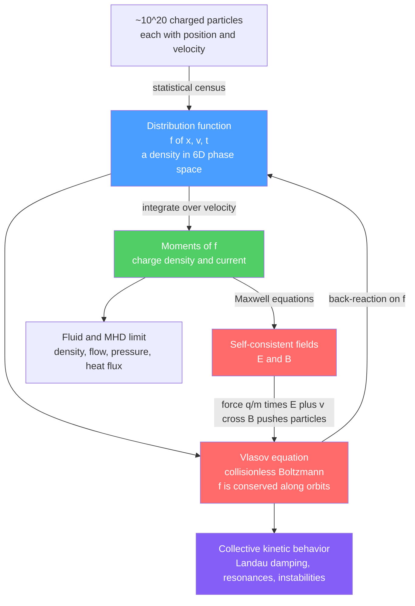

# 🌫️ Kinetic Theory and the Vlasov Equation

> [!abstract] TL;DR
> Kinetic theory describes a plasma not by tracking its $\sim 10^{20}$ particles individually, nor by collapsing them into a single fluid, but by an intermediate object: the **distribution function** $f(\mathbf{x}, \mathbf{v}, t)$, a density in six-dimensional position–velocity **phase space**. The **Vlasov equation** — the *collisionless* Boltzmann equation $\partial_t f + \mathbf{v}\cdot\nabla_{\mathbf x} f + \tfrac{q}{m}(\mathbf E + \mathbf v\times\mathbf B)\cdot\nabla_{\mathbf v} f = 0$ — says $f$ is conserved along particle orbits (phase-space incompressibility, Liouville). What makes plasmas hard is **self-consistency**: the fields $\mathbf E,\mathbf B$ are generated by the charges and currents that are themselves moments of $f$, closing a nonlinear mean-field loop (the Vlasov–Maxwell system). This velocity-space bookkeeping captures physics invisible to fluid models — collisionless **Landau damping**, wave–particle resonance, and kinetic instabilities — and is the rigorous foundation beneath both the fluid/MHD models and the wave theory of this section.

## Intuition — analogy FIRST

You cannot track all $10^{20}$ particles in a plasma any more than a demographer can follow every individual citizen. So you do what a demographer does: you keep a **census**. Instead of "who is where," you record *how many* particles have each combination of **position and velocity** — a cloud in a six-dimensional space of *where-and-how-fast*. That census cloud is the distribution function $f(\mathbf x,\mathbf v,t)$.

The Vlasov equation is the law of motion for this census cloud. It says the cloud **flows like an incompressible fluid** through phase space — never piling up, never thinning, just being sheared and stretched — pushed around by the very electric and magnetic fields the particles themselves create. It is *the plasma describing itself to itself*. And because the description keeps the full velocity axis, it captures ghostly effects that no ordinary-fluid picture can: waves that fade away **without any friction at all** (Landau damping), and beams that spontaneously grow into turbulence. Those live entirely in the *shape* of the census, not in its bulk averages.

---

## How It Works

A plasma is a smear of charged particles. Kinetic theory replaces the intractable $6N$-dimensional many-body problem with one **single-particle distribution function per species**, $f_s(\mathbf x,\mathbf v,t)$, defined so that $f_s\,d^3x\,d^3v$ is the number of particles of species $s$ in the phase-space volume $d^3x\,d^3v$. Three moves make this a closed physical theory:

1. **The census (distribution function).** $f$ is a *density in phase space*, not a probability — its integral is a particle count. Its velocity-space **moments** are the familiar fluid quantities: the $0^{\text{th}}$ moment gives number density $n$, the $1^{\text{st}}$ gives flow velocity $\mathbf u$, the $2^{\text{nd}}$ (about the mean) gives pressure/temperature, the $3^{\text{rd}}$ gives heat flux.
2. **The flow law (Vlasov equation).** Each particle moves on a Hamiltonian orbit $\dot{\mathbf x}=\mathbf v$, $\dot{\mathbf v}=\tfrac{q}{m}(\mathbf E+\mathbf v\times\mathbf B)$. Liouville's theorem then forces $f$ to be **constant along those orbits** — phase-space volume is incompressible — giving the Vlasov equation.
3. **The self-consistency loop.** The fields $\mathbf E,\mathbf B$ are not external: they are sourced by the charge density $\rho=\sum_s q_s\!\int f_s\,d^3v$ and current $\mathbf J=\sum_s q_s\!\int \mathbf v f_s\,d^3v$ via Maxwell's equations. Feed those moments back into the force term and you have the closed, nonlinear **Vlasov–Maxwell** (or, electrostatically, **Vlasov–Poisson**) system.



The red loop — Vlasov $\leftrightarrow$ fields $\leftrightarrow$ moments — is the source of nearly all plasma difficulty and nearly all plasma richness.

---

## Key Concepts / Details

### Secondary Level

**What the census records.** Imagine a huge scatter plot: one axis is position $x$, the other is velocity $v$. Drop a dot for every particle. Where the dots are dense, $f$ is large. A *cold* stationary plasma is a thin horizontal line at $v=0$; a *hot* plasma is a fat vertical blur; a *beam* is a second blob off to one side.

**Averages you already know are hidden in the census.** Count all the dots in a column above position $x$ and you get the **density** $n(x)$. Take the average velocity of that column and you get the **flow** $u(x)$. Measure how *spread out* the column is and you get the **temperature** $T(x)$ — temperature is literally the width of the velocity blur.

**Why not just use those averages?** Because two very different censuses can share the same density, flow, and temperature but behave completely differently — one might be a smooth Maxwellian, the other a smooth bulk plus a sharp beam that will violently destabilize. The *shape* carries physics the averages throw away.

### Undergraduate Level

**The distribution function and its moments.** For species $s$, define the velocity moments

$$
n_s = \int f_s\, d^3v, \qquad
n_s\mathbf u_s = \int \mathbf v\, f_s\, d^3v,
$$
$$
\mathsf P_s = m_s\!\int (\mathbf v-\mathbf u_s)(\mathbf v-\mathbf u_s)\, f_s\, d^3v, \qquad
\mathbf q_s = \tfrac{m_s}{2}\!\int (\mathbf v-\mathbf u_s)\,|\mathbf v-\mathbf u_s|^2\, f_s\, d^3v .
$$

The scalar pressure is $p_s = \tfrac13\,\mathrm{tr}\,\mathsf P_s = n_s k_B T_s$, which *defines* the kinetic temperature. Charge and current densities are $\rho=\sum_s q_s n_s$ and $\mathbf J=\sum_s q_s n_s\mathbf u_s$.

**The Maxwell–Boltzmann equilibrium.** The state of maximum entropy at temperature $T$ is the drifting Maxwellian

$$
f_{\text M}(\mathbf v) = n\left(\frac{m}{2\pi k_B T}\right)^{3/2}\exp\!\left(-\frac{m|\mathbf v-\mathbf u|^2}{2k_B T}\right).
$$

Real plasmas are frequently **non-Maxwellian**, and the departures carry the interesting physics: *drifts* (relative electron–ion flow → current-driven instabilities), *beams* (bump-on-tail), *loss cones* (magnetic-mirror confinement removes particles with small pitch angle), and *high-energy tails* (runaway electrons, fusion-relevant supra-thermal ions).

**The Vlasov equation.** In the absence of collisions,

$$
\boxed{\;\frac{\partial f_s}{\partial t} + \mathbf v\cdot\nabla_{\mathbf x} f_s + \frac{q_s}{m_s}\big(\mathbf E + \mathbf v\times\mathbf B\big)\cdot\nabla_{\mathbf v} f_s = 0\;}
$$

Read as a total derivative along orbits, this is $\dfrac{df_s}{dt}=0$: **$f$ is constant on the trajectory of any phase-space element** — the plasma analogue of an incompressible flow. The three terms are, in order, explicit time change, spatial streaming, and acceleration by the Lorentz force.

**Self-consistency: Vlasov–Poisson and Vlasov–Maxwell.** In the electrostatic limit the fields follow from Poisson's equation:

$$
\nabla\!\cdot\mathbf E = \frac{\rho}{\varepsilon_0} = \frac{1}{\varepsilon_0}\sum_s q_s\!\int f_s\, d^3v,\qquad \mathbf E = -\nabla\phi .
$$

The full electromagnetic problem couples Vlasov to all four of [[Maxwells_Equations]]. This is a **nonlinear mean-field theory**: $f$ makes the fields, the fields move $f$.

### Graduate Level

**Liouville, BBGKY, and where Vlasov comes from.** The exact $N$-body Liouville equation in $6N$ dimensions is reduced by the BBGKY hierarchy to an equation for the one-particle $f_1$ that couples to the two-particle correlation $f_2$. Splitting $f_2 = f_1 f_1 + g_{12}$ separates a smooth **mean field** (kept in Vlasov) from **correlations/collisions** (the neglected piece). Vlasov is the leading term in an expansion in the **plasma parameter** $1/(n\lambda_D^3)$: when many particles inhabit a Debye sphere, the smooth self-field dominates and discrete collisions are a small correction.

**Collisions restore the bridge to fluids.** Reinstating the correlation term gives the collisional kinetic equation

$$
\frac{\partial f}{\partial t} + \mathbf v\cdot\nabla_{\mathbf x} f + \frac{q}{m}(\mathbf E+\mathbf v\times\mathbf B)\cdot\nabla_{\mathbf v} f = \left(\frac{\partial f}{\partial t}\right)_{\!\text{coll}}.
$$

For neutral gases the right side is the **Boltzmann collision integral**; for the small-angle Coulomb scattering typical of plasmas it becomes the **Fokker–Planck / Landau collision operator** (a drift–diffusion in velocity space). Collisions drive $f$ toward a local Maxwellian and, via a Chapman–Enskog expansion, generate transport coefficients and the closed fluid equations.

**The closure problem — why kinetics is fundamental.** Take the $0^{\text{th}}$ moment of Vlasov and you get continuity, but it contains $\mathbf u$ (a $1^{\text{st}}$ moment). The momentum equation contains the pressure tensor ($2^{\text{nd}}$ moment); the pressure equation contains the heat flux ($3^{\text{rd}}$); and so on **forever**. The **moment hierarchy never closes**: every fluid equation depends on the next-higher moment. Fluid/MHD models *impose* an artificial closure (e.g. an equation of state $p\propto n^\gamma$, or $\mathbf q=0$). Kinetic theory is fundamental precisely because it *is* the closure — it retains the full velocity dependence instead of guessing it.

**Velocity-space physics fluids cannot see.** Because Vlasov keeps the $v$ axis, it predicts phenomena tied to the *derivative* $\partial f/\partial v$ at the wave phase velocity:

- **Landau damping** — collisionless decay of a wave via resonance with particles at $v\approx\omega/k$, set by the sign of $\partial f/\partial v$ there. (See sibling notes *Landau_Damping* and *Warm_Plasma_and_Kinetic_Waves*.)
- **Kinetic instabilities** — a *positive* slope $\partial f/\partial v>0$ (bump-on-tail, two-stream) feeds energy *into* waves, growing them. (See *Two_Stream_and_Kinetic_Instabilities*.)
- **Non-Maxwellian transport** — runaway electrons, neoclassical effects, and supra-thermal tails have no fluid description.

These are the reason this note anchors the section: the fluid picture (*The_Two_Fluid_and_MHD_Models*) and the wave picture both sit *on top of* the Vlasov description, and the broader context is set in *Plasma_Physics_Overview*.

---

## Python Demo

```python
# Kinetic theory in two acts:
#   (a) MAXWELLIAN & MOMENTS  — build a velocity distribution f(v), then recover the
#       fluid quantities (n, u, T) purely by integrating its 0th/1st/2nd moments;
#       overlay a drifting Maxwellian and a bump-on-tail to show non-Maxwellian shape.
#   (b) PHASE-SPACE ADVECTION — evolve f(x, v) under free streaming (v df/dx) plus a
#       self-consistent electric-field kick (df/dv) and watch it SHEAR / FILAMENT,
#       the hallmark of Vlasov dynamics (onset of phase mixing).
# numpy + matplotlib only.
import numpy as np
import matplotlib.pyplot as plt

# Work in normalized units: mass m = 1, Boltzmann k_B = 1, charge/eps0 scaled to 1.
# ----------------------------------------------------------------------------------
# (a) MAXWELLIAN & MOMENTS
# ----------------------------------------------------------------------------------
v = np.linspace(-8.0, 12.0, 4000)          # 1D velocity axis
dv = v[1] - v[0]

def maxwellian(v, n, u, T):
    """Drifting 1D Maxwell-Boltzmann: density n, flow u, temperature T (m=k_B=1)."""
    return n / np.sqrt(2*np.pi*T) * np.exp(-(v - u)**2 / (2*T))

def recover_moments(v, f):
    """Fluid quantities as velocity moments of the distribution function."""
    n = np.trapz(f, v)                       # 0th moment -> number density
    u = np.trapz(v*f, v) / n                 # 1st moment -> flow velocity
    T = np.trapz((v - u)**2 * f, v) / n      # 2nd central moment -> temperature (m=1)
    return n, u, T

# Ground truth we will try to recover:
n0, u0, T0 = 1.0, 2.0, 1.5
f_max   = maxwellian(v, n0, u0, T0)                 # drifting Maxwellian
f_bump  = f_max + maxwellian(v, 0.08, 8.0, 0.6)     # + fast beam -> bump-on-tail

for name, f in [("drifting Maxwellian", f_max), ("bump-on-tail", f_bump)]:
    n, u, T = recover_moments(v, f)
    print(f"{name:22s}:  n={n:6.4f}  u={u:6.4f}  T={T:6.4f}")
print(f"(input Maxwellian was      :  n={n0:6.4f}  u={u0:6.4f}  T={T0:6.4f})")
# The bump-on-tail shares roughly the same n but its 'u' and 'T' are inflated by the
# beam -> a single Maxwellian cannot represent it: velocity-space STRUCTURE is lost.

# ----------------------------------------------------------------------------------
# (b) PHASE-SPACE ADVECTION on a 1D x-v grid (semi-Lagrangian, operator split)
# ----------------------------------------------------------------------------------
L   = 2*np.pi                 # periodic length in x
Nx, Nv = 128, 256
x   = np.linspace(0, L, Nx, endpoint=False)
vv  = np.linspace(-6.0, 6.0, Nv)
X, V = np.meshgrid(x, vv, indexing="ij")     # f[i, j] at (x_i, v_j)
dxg  = x[1] - x[0]

vth, k = 1.0, 1.0             # thermal speed and perturbation wavenumber
amp    = 0.4                  # density-perturbation amplitude
# Initial census: warm Maxwellian in v, sinusoidal density bunching in x.
f = (1.0 + amp*np.cos(k*X)) * np.exp(-V**2/(2*vth**2)) / np.sqrt(2*np.pi*vth**2)
f0 = f.copy()

def efield_from_density(f):
    """Self-consistent E(x) via FFT Poisson solve from the density perturbation."""
    n  = np.trapz(f, vv, axis=1)             # 0th moment -> n(x)
    dn = n - n.mean()                        # charge perturbation (neutralizing bg)
    kx = 2*np.pi*np.fft.fftfreq(Nx, d=dxg)
    dnk = np.fft.fft(dn)
    Ek = np.zeros_like(dnk)
    nz = kx != 0
    Ek[nz] = -1j * dnk[nz] / kx[nz]          # E_k = -i dn_k / k  (eps0 = 1)
    return np.real(np.fft.ifft(Ek))

def stream_x(f, dt):
    """Free streaming: shift each velocity row in x by v*dt (periodic interp)."""
    out = np.empty_like(f)
    for j in range(Nv):
        out[:, j] = np.interp(x - vv[j]*dt, x, f[:, j], period=L)
    return out

def kick_v(f, E, dt):
    """Electric-field acceleration: shift each x column in v by (q/m)E*dt."""
    out = np.empty_like(f)
    for i in range(Nx):
        out[i, :] = np.interp(vv - E[i]*dt, vv, f[i, :])  # f ~ 0 at v edges
    return out

dt, nsteps = 0.25, 24         # a few Strang-split steps
for _ in range(nsteps):
    f = stream_x(f, dt/2)                     # half streaming
    f = kick_v(f, efield_from_density(f), dt) # full field kick
    f = stream_x(f, dt/2)                     # half streaming

n_init  = np.trapz(f0, vv, axis=1)
n_final = np.trapz(f,  vv, axis=1)

# ----------------------------------------------------------------------------------
# PLOTS
# ----------------------------------------------------------------------------------
fig, ax = plt.subplots(2, 2, figsize=(12, 9))

ax[0,0].plot(v, f_max,  lw=2, label="Maxwellian (n,u,T)=(1, 2, 1.5)")
ax[0,0].plot(v, f_bump, lw=2, label="bump-on-tail (non-Maxwellian)")
ax[0,0].set_xlabel("velocity v"); ax[0,0].set_ylabel("f(v)")
ax[0,0].set_title("(a) Distribution & its moments -> n, u, T")
ax[0,0].legend(); ax[0,0].set_xlim(-6, 12)

ext = [0, L, vv[0], vv[-1]]
ax[0,1].imshow(f0.T, origin="lower", aspect="auto", extent=ext, cmap="magma")
ax[0,1].set_title("(b) Initial f(x, v) in phase space")
ax[0,1].set_xlabel("position x"); ax[0,1].set_ylabel("velocity v")

ax[1,0].imshow(f.T, origin="lower", aspect="auto", extent=ext, cmap="magma")
ax[1,0].set_title(f"(b) After {nsteps} steps: SHEARING / filamentation")
ax[1,0].set_xlabel("position x"); ax[1,0].set_ylabel("velocity v")

ax[1,1].plot(x, n_init,  lw=2, label="density n(x), t=0")
ax[1,1].plot(x, n_final, lw=2, label=f"density n(x), t={nsteps*dt:.0f}")
ax[1,1].set_xlabel("position x"); ax[1,1].set_ylabel("n(x) = 0th moment")
ax[1,1].set_title("(b) 0th moment tracks bunching / Landau-type damping")
ax[1,1].legend()

plt.tight_layout()
plt.savefig("vlasov_kinetic_demo.png", dpi=110)
print("\nsaved vlasov_kinetic_demo.png")
```

**What you should see.** Part (a) prints $n,u,T$ recovered to the input values for the Maxwellian, while the bump-on-tail returns a *different* effective $u$ and an inflated $T$ — proof that the fluid moments cannot recover the beam hiding in velocity space. Part (b) shows the initially smooth phase-space blob **tilting and winding into fine filaments** as fast particles outrun slow ones (the shear from $v\,\partial_x f$), while the density moment $n(x)$ evolves and its perturbation damps — the numerical fingerprint of **phase mixing / Landau damping**.

---

## Real-World Applications

- **Magnetic-confinement fusion (tokamaks, ITER, stellarators).** Turbulent heat and particle transport that sets confinement time is governed by the **gyrokinetic** reduction of Vlasov–Maxwell (codes like GENE, GYRO, XGC). Fluid models systematically mis-predict it because the loss physics is kinetic.
- **Space and astrophysical plasmas.** The solar wind, magnetosphere, and collisionless shocks are nearly collision-free over relevant scales, so they are *literally* Vlasov systems. Landau damping and wave–particle heating shape the observed non-Maxwellian (kappa) distributions measured by spacecraft.
- **Particle-in-cell (PIC) simulation.** The dominant computational method — used from inertial-fusion laser–plasma to plasma thrusters — samples $f$ with macro-particles pushed by self-consistent fields, i.e. a Monte Carlo integration of Vlasov–Maxwell.
- **Accelerator and beam physics.** Charged-particle beams obey a Vlasov equation in phase space; space-charge instabilities and Landau damping of collective modes are designed for (or against) in synchrotrons and linacs.
- **Stellar dynamics (the gravitational twin).** Galaxies are collisionless over a Hubble time, so their stars obey the **collisionless Boltzmann equation** with gravity in place of the Lorentz force — the same mathematics, applied to $10^{11}$ stars instead of $10^{20}$ ions.

---

## Common Pitfalls

1. **Kinetic vs fluid — knowing which you need.** Fluid/MHD (moments) suffices when the plasma is close to Maxwellian and gradients are gentle relative to a mean free path / gyroradius. The moment that resonances, beams, loss cones, or $\partial f/\partial v$ effects matter — Landau damping, micro-instabilities, runaways — you **must** go kinetic. Reaching for MHD in a collisionless, resonant regime silently discards the dominant physics.
2. **Vlasov is collisionless, not collision-*free* physics.** Vlasov keeps the *self-consistent mean field* and drops the *correlation/collision* term. Boltzmann (neutral gases) and Fokker–Planck/Landau (Coulomb) add collisions back. Confusing "no collision operator" with "no collective interaction" is backwards — Vlasov is *all* collective interaction.
3. **Phase space is six-dimensional.** $f(\mathbf x,\mathbf v,t)$ lives in 3 position + 3 velocity dimensions per species. Intuition trained on real-space fluids fails; the interesting dynamics (filamentation, resonance) happen *along the velocity axes*, which fluid models integrate away.
4. **The closure problem is not a nuisance — it is the point.** The moment hierarchy never closes: continuity needs flow, momentum needs pressure, pressure needs heat flux, ad infinitum. Any fluid model is an *assumed* closure. Kinetic theory is fundamental because it does not need to guess the next moment.
5. **$f$ is a density in phase space, not a probability.** $\int f\,d^3v = n$ (a particle count / number density), not $1$. Normalizing $f$ to unity discards the density information you need for the source terms in Maxwell's equations.
6. **Velocity-space structure is where the physics hides.** Two distributions with identical $n,u,T$ can be stable or violently unstable depending on the *slope* $\partial f/\partial v$ at the wave phase speed. Smoothing or coarse-graining velocity space (as fluid closures do) can erase Landau damping and bump-on-tail growth entirely.

---

## Related Concepts

- [[Kinetic_Theory_of_Gases]] — the neutral-gas ancestor; Vlasov is its collisionless, self-consistent-field generalization, and the Boltzmann collision integral there becomes the plasma collision operator here.
- [[Classical_Statistical_Mechanics]] — phase space, ensembles, and Liouville's theorem, the statistical scaffolding the distribution function is built on.
- [[Hamiltonian_Mechanics]] — particle orbits are Hamiltonian flows; Liouville's theorem on phase-space incompressibility is exactly why $f$ is conserved along orbits.
- [[Maxwells_Equations]] — supply the self-consistent $\mathbf E,\mathbf B$ sourced by the moments of $f$, closing the Vlasov–Maxwell loop.
- [[Introduction_to_PDEs]] — the Vlasov equation is a first-order hyperbolic transport (advection) PDE solved along characteristics = particle trajectories.
- [[Magnetohydrodynamics]] — the fluid limit obtained by taking low-order moments of the kinetic equations and imposing a closure.

---

## Review Questions

1. **Secondary.** Sketch a phase-space ($x$ vs $v$) picture of (i) a cold stationary plasma, (ii) a hot stationary plasma, and (iii) a plasma with a fast beam. Explain in words how you would read off the density and the temperature from each picture.
2. **Undergraduate.** Starting from the Vlasov equation, take its $0^{\text{th}}$ velocity moment ($\int\!\cdots\,d^3v$) and show you obtain the continuity equation $\partial_t n + \nabla\!\cdot(n\mathbf u)=0$. Which higher moment appears, and why does this already hint at the closure problem?
3. **Graduate.** A plasma has a bump-on-tail distribution, $\partial f/\partial v > 0$ over some velocity range. Explain physically why this can drive a wave unstable, why a fluid (moment) model of the *same* $n,u,T$ predicts no such instability, and what feature of the Vlasov description is responsible for the difference. Contrast this with collisionless Landau damping, where $\partial f/\partial v < 0$ at the resonant velocity.

---

## Sources

- Nicholson — *Introduction to Plasma Theory* — the cleanest derivation of Vlasov from Klimontovich/BBGKY and the moment hierarchy.
- Krall & Trivelpiece — *Principles of Plasma Physics* — kinetic theory, collision operators, and Vlasov–Maxwell in depth.
- Chen — *Introduction to Plasma Physics and Controlled Fusion*, 3rd ed. — accessible bridge from fluid to kinetic descriptions.
- Bellan — *Fundamentals of Plasma Physics* — phase-space picture, Landau damping, and the closure problem.
- Boyd & Sanderson — *The Physics of Plasmas* — Fokker–Planck/Landau collision operators and transport closures.

#plasma-physics #kinetic-theory #vlasov-equation #distribution-function #phase-space
