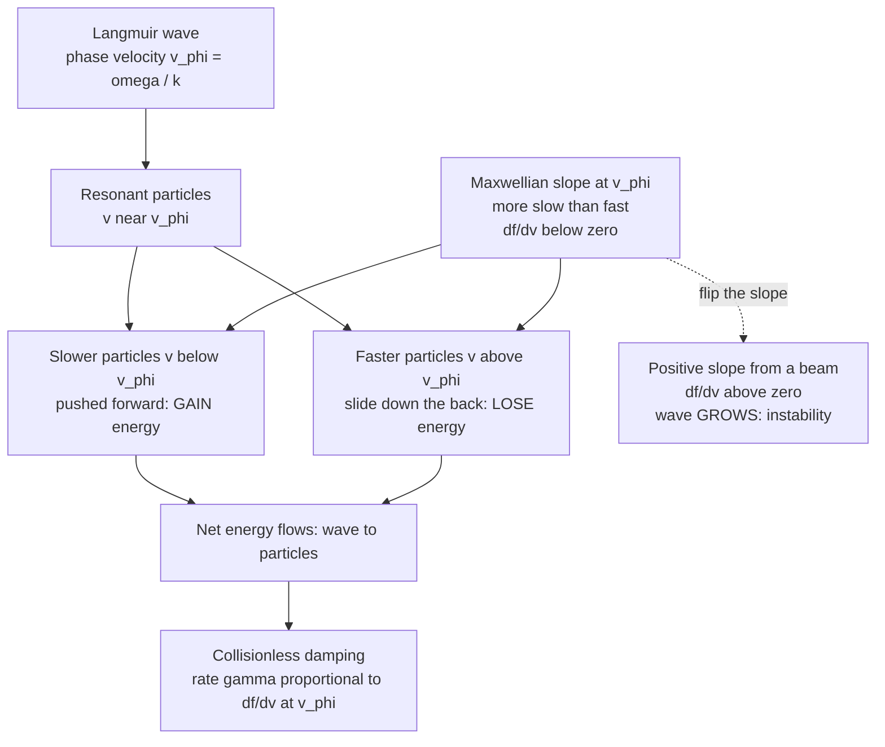

# 🌊 Landau Damping

> [!abstract] TL;DR
> Landau damping is the **collisionless** decay of a plasma wave: a Langmuir (electron plasma) wave fades away even though there is no friction, no collisions, and no dissipation of any obvious kind. Lev Landau (1946) predicted it by correctly solving the **initial-value problem** — a Laplace transform in time whose inversion requires deforming the integration path around a pole at the wave's phase velocity (the **Landau contour**). The physics is **resonant wave-particle interaction**: particles moving near the wave's phase velocity $v_\phi=\omega/k$ exchange energy with it like surfers on a wave. Because a Maxwellian has a **negative slope** $\partial f/\partial v < 0$ at $v_\phi$ (slightly more slow surfers than fast ones), the wave gives net energy to particles and damps, with rate $\gamma \propto \left.\partial f/\partial v\right|_{v_\phi}$. Flip the slope — a beam or bump-on-tail with $\partial f/\partial v>0$ — and the sign flips: the wave **grows** (inverse Landau damping, the gateway to kinetic instabilities). The effect was so counter-intuitive it was doubted until Malmberg & Wharton measured it in 1964.

## Intuition — analogy FIRST

Picture a surfer and an ocean wave. A surfer paddling **just slower** than the wave gets caught, pushed forward, and accelerated — the surfer **steals energy** from the wave. A surfer moving **just faster** than the wave slides down its back face, is slowed, and **gives energy back** to the wave. The surfer whose speed *exactly* matches the wave stays locked to it and exchanges energy most strongly of all — this is **resonance**.

Now imagine a whole beach of surfers — the electrons — moving at every possible speed. A plasma wave interacts most with the ones near its phase velocity. In a thermal (Maxwellian) plasma there are always **slightly more slow surfers** (just below the wave speed) than fast ones (just above), because the distribution slopes downward. So the wave hands out more energy than it collects — and it quietly fades. No friction. No collisions. Just the statistics of who was moving at what speed. That is Landau damping: a ghostly, collisionless loss predicted by pure mathematics before anyone believed a plasma could damp without dissipation.

---

## How It Works

The wave picks a phase velocity $v_\phi=\omega/k$. Particles moving near that speed are **resonant** and trade energy with the wave. The imbalance between slightly-slower (energy-gaining) and slightly-faster (energy-losing) particles is fixed by the **slope of the velocity distribution at $v_\phi$** — not by its value. A downward slope drains the wave; an upward slope feeds it.



---

## Key Concepts / Details

### Secondary Level

**A wave that dies without friction.** Normally, waves damp because something rubs — air resistance, viscosity, electrical resistance, collisions between particles. Landau damping is startling because it happens in a **perfectly collisionless** plasma. The energy is not lost to heat by friction; it is **handed to individual particles** that happen to be surfing near the wave's speed.

**The surfer rule.**
- Particle a little **slower** than the wave $\rightarrow$ accelerated $\rightarrow$ **takes** energy from the wave.
- Particle a little **faster** than the wave $\rightarrow$ decelerated $\rightarrow$ **gives** energy to the wave.
- A thermal plasma has more slow ones than fast ones near the wave speed $\rightarrow$ the wave loses on balance $\rightarrow$ it **damps**.

**Why it matters.** This is the canonical proof that in a plasma the *shape of the velocity distribution* — not just density and temperature — controls the physics. It is how radio waves heat fusion plasmas, and how the same trick run in reverse makes plasmas unstable.

### Undergraduate Level

**Setting.** Electron plasma (Langmuir) waves oscillate near the plasma frequency $\omega_p=\sqrt{n e^2/\varepsilon_0 m_e}$. In a warm plasma the dispersion relation is Bohm-Gross:

$$\omega^2 = \omega_p^2 + 3k^2 v_{th}^2, \qquad v_{th}=\sqrt{k_B T/m_e}, \qquad \lambda_D = v_{th}/\omega_p.$$

**The result.** Solving the linearized Vlasov-Poisson system as an **initial-value problem** gives a complex frequency $\omega = \omega_r + i\gamma$. For weak damping ($k\lambda_D \ll 1$):

$$\boxed{\;\frac{\gamma}{\omega_p} = -\sqrt{\frac{\pi}{8}}\,\frac{1}{(k\lambda_D)^3}\,\exp\!\left(-\frac{1}{2(k\lambda_D)^2}-\frac{3}{2}\right)\;}$$

The minus sign means **decay**. The damping is negligible for $k\lambda_D \ll 1$ (then $v_\phi \gg v_{th}$ sits in the empty tail of $f$) and becomes strong for $k\lambda_D \sim 0.3$–$0.5$ (then $v_\phi$ moves into the populated bulk).

**The heart of it.** For a general distribution $g(v)$ (normalized, $\int g\,dv=1$), the damping rate is proportional to the **slope at the phase velocity**:

$$\gamma = \frac{\pi}{2}\,\frac{\omega_p^{3}}{k^{2}}\,\left.\frac{\partial g}{\partial v}\right|_{v=v_\phi}.$$

For a Maxwellian, $g'(v_\phi) = -(v_\phi/v_{th}^2)\,g(v_\phi) < 0 \Rightarrow \gamma < 0 \Rightarrow$ damping. It is the **slope**, not the value, of $f$ that decides.

**The surfer energetics.** A particle at velocity $v=v_\phi+u$ sees, in the wave frame, a *stationary* sinusoidal potential — a washboard of hills and valleys. Near-resonant particles ($|u|$ small) are pushed toward $v_\phi$: slower ones speed up (gain), faster ones slow down (lose). Averaged over a distribution that has more slow than fast particles, the net energy flows from wave to particles.

### Graduate Level

**The initial-value problem and the Landau contour.** Landau's key insight was that a *normal-mode* (Fourier-in-time) treatment is ambiguous because of the singular resonant denominator $1/(\omega-kv)$. Treating it instead as an **initial-value problem** with a **Laplace transform in time** fixes the prescription. The plasma dielectric function is

$$\varepsilon(k,\omega) = 1 - \frac{\omega_p^2}{k^2}\int_L \frac{\partial g/\partial v}{\,v-\omega/k\,}\,dv,$$

where the contour $L$ (the **Landau contour**) is deformed to pass **below** the pole at $v=\omega/k$ (for $\mathrm{Im}\,\omega>0$, then analytically continued downward). Evaluating the residue at the pole produces an imaginary part:

$$\mathrm{Im}\,\varepsilon \;\propto\; \left.\frac{\partial g}{\partial v}\right|_{v=\omega/k},$$

which is precisely the damping. The result is inseparable from **analytic continuation** and **contour integration** — Landau damping is as much a theorem in complex analysis as it is in physics.

**Reversibility and the plasma echo.** Landau damping produces **no entropy**. The Vlasov equation is time-reversible; the "damping" is really **phase mixing** — the perturbation in $f(v)$ develops ever-finer structure in velocity space ($\sim e^{-ikvt}$), so the *velocity-integrated* charge density (the field) decays while the *information* survives hidden in fine velocity-space filaments. The **plasma echo** (Gould, O'Neil, Malmberg, 1967) proves this: two damped waves launched at times $t_1$ and $t_2$ spontaneously produce a third wave (an "echo") later, because the buried phase information re-cohere. True irreversibility only appears when weak collisions finally erase the fine structure.

**Nonlinear saturation and trapping.** Linear theory assumes infinitesimal amplitude. At finite amplitude, resonant particles become **trapped** in the wave troughs and bounce at the trapping frequency $\omega_b = \sqrt{k q E_0/m}$. Once the bounce time $\sim 2\pi/\omega_b$ is shorter than the damping time, trapped particles slosh back and forth, alternately giving and taking energy — the damping **saturates and oscillates** rather than proceeding monotonically (O'Neil 1965). The nonlinear end states are the exact **Bernstein-Greene-Kruskal (BGK) modes**, steady undamped waves supported by a self-consistent trapped-particle population.

**Ion Landau damping.** The same mechanism damps **ion-acoustic waves** through resonant *ions* when $T_e \sim T_i$ (phase velocity $c_s=\sqrt{k_B T_e/m_i}$ lands in the ion distribution). Strong ion Landau damping is why ion-acoustic waves propagate cleanly only when $T_e \gg T_i$.

---

## Python Demo

```python
import numpy as np
import matplotlib.pyplot as plt

# =====================================================================
# LANDAU DAMPING: resonant wave-particle energy exchange
#   Part (a) RESONANCE & SLOPE  -> damping rate proportional to df/dv|_{v_phi}
#   Part (b) SURFER MODEL       -> test particles in a traveling wave
# numpy + matplotlib only (no scipy)
# =====================================================================
rng = np.random.default_rng(0)

# normalized plasma units: omega_p = 1, v_th = 1  ->  lambda_D = 1
wp, vth = 1.0, 1.0

def maxwellian(v):                       # 1D normalized Maxwellian, integral = 1
    return np.exp(-v**2 / (2*vth**2)) / (np.sqrt(2*np.pi)*vth)

def dmaxwellian(v):                      # slope df/dv = -(v/vth^2) f  (< 0 for v>0)
    return -(v/vth**2) * maxwellian(v)

def landau_rate(kld):                    # analytic gamma/omega_p vs k*lambda_D
    return -np.sqrt(np.pi/8) * kld**-3 * np.exp(-1/(2*kld**2) - 1.5)

fig, ax = plt.subplots(2, 3, figsize=(16, 9))

# =====================================================================
# PART (a): Maxwellian, phase velocity, slope, gamma(k), bump-on-tail
# =====================================================================
v = np.linspace(-1, 6, 800)
k_demo = 1/3.0                           # wavenumber k*lambda_D
vphi = wp / k_demo                        # phase velocity ~ omega_p/k = 3 v_th
band = 0.5                                # illustrative resonant half-width

# (a1) Maxwellian with phase velocity + resonant band
ax[0,0].plot(v, maxwellian(v), lw=2, color='#4a9eff', label='Maxwellian f(v)')
ax[0,0].axvline(vphi, color='#ff6b6b', lw=2, ls='--',
                label=f'v_phi = omega/k = {vphi:.1f} v_th')
ax[0,0].axvspan(vphi-band, vphi+band, color='orange', alpha=0.25,
                label='resonant band')
ax[0,0].set_xlabel('v / v_th'); ax[0,0].set_ylabel('f(v)')
ax[0,0].set_title('Wave samples f at v_phi'); ax[0,0].legend(fontsize=8)

# (a2) slope df/dv: negative at v_phi -> damping
ax[0,1].plot(v, dmaxwellian(v), lw=2, color='#51cf66')
ax[0,1].axhline(0, color='k', lw=0.8)
ax[0,1].axvline(vphi, color='#ff6b6b', lw=2, ls='--')
slope = dmaxwellian(vphi)
ax[0,1].plot([vphi], [slope], 'o', color='#ff6b6b', ms=9)
ax[0,1].annotate('df/dv < 0\n-> DAMPING', (vphi, slope),
                 textcoords='offset points', xytext=(-75, -35), fontsize=9)
ax[0,1].set_xlabel('v / v_th'); ax[0,1].set_ylabel('df/dv')
ax[0,1].set_title('Damping rate ~ df/dv at v_phi')

# (a3) gamma vs k*lambda_D : stronger as v_phi enters the bulk
kld = np.linspace(0.15, 0.55, 200)
ax[0,2].plot(kld, landau_rate(kld), lw=2, color='#845ef7')
ax[0,2].set_xlabel('k * lambda_D'); ax[0,2].set_ylabel('gamma / omega_p')
ax[0,2].set_title('Damping grows as v_phi -> bulk'); ax[0,2].grid(alpha=0.3)

# (a4) bump-on-tail: POSITIVE slope -> GROWTH (inverse Landau damping)
vbeam, nbeam, wbeam = 3.5, 0.06, 0.35
f_bump = maxwellian(v) + nbeam*np.exp(-(v-vbeam)**2/(2*wbeam**2))/(np.sqrt(2*np.pi)*wbeam)
ax[1,0].plot(v, f_bump, lw=2, color='#4a9eff', label='Maxwellian + beam')
mask = (v > vbeam-2*wbeam) & (v < vbeam)          # rising (positive-slope) flank
ax[1,0].fill_between(v[mask], 0, f_bump[mask], color='#ff6b6b', alpha=0.35,
                     label='df/dv > 0 -> GROWTH')
ax[1,0].set_xlabel('v / v_th'); ax[1,0].set_ylabel('f(v)')
ax[1,0].set_title('Bump-on-tail: inverse Landau damping'); ax[1,0].legend(fontsize=8)

# =====================================================================
# PART (b): SURFER MODEL -- test particles in a traveling sinusoidal wave
# Wave field (k=1): a(x,t) = a0 * sin(x - vphi*t);  dv/dt = a(x,t)
# In the wave frame this is a pendulum -> trapped vs passing orbits.
# =====================================================================
kw, vphi_b, a0 = 1.0, 4.0, 0.6
w_bounce = np.sqrt(kw*a0)                 # bounce / trapping frequency
v_trap   = 2*np.sqrt(a0/kw)               # separatrix half-width in velocity

def rk4_step(x, u, t, dt):
    def acc(x, t): return a0*np.sin(kw*x - vphi_b*t)
    k1x, k1u = u,                acc(x, t)
    k2x, k2u = u+0.5*dt*k1u,     acc(x+0.5*dt*k1x, t+0.5*dt)
    k3x, k3u = u+0.5*dt*k2u,     acc(x+0.5*dt*k2x, t+0.5*dt)
    k4x, k4u = u+dt*k3u,         acc(x+dt*k3x,     t+dt)
    return (x + dt/6*(k1x+2*k2x+2*k3x+k4x),
            u + dt/6*(k1u+2*k2u+2*k3u+k4u))

# ---- (b1) phase-space portrait: trapped (closed) vs passing (open) ----
dt = 0.01
T  = 1.5 * 2*np.pi/w_bounce               # ~1.5 bounce periods
nsteps = int(T/dt)
for u0 in np.linspace(-2.2*v_trap, 2.2*v_trap, 15):
    x, vv, t = 0.0, vphi_b + u0, 0.0
    xs, us = [], []
    for _ in range(nsteps):
        xs.append((kw*x - vphi_b*t + np.pi) % (2*np.pi) - np.pi)  # wave-frame phase
        us.append(vv - vphi_b)
        x, vv = rk4_step(x, vv, t, dt); t += dt
    col = '#ff6b6b' if abs(u0) < v_trap else '#4a9eff'
    ax[1,1].plot(xs, us, '.', color=col, ms=1.2, alpha=0.5)
ax[1,1].axhline( v_trap, color='k', ls='--', lw=1)
ax[1,1].axhline(-v_trap, color='k', ls='--', lw=1, label='separatrix')
ax[1,1].set_xlabel('wave-frame phase  (x - v_phi t)')
ax[1,1].set_ylabel('u = v - v_phi')
ax[1,1].set_title('Trapped (red) vs passing (blue)'); ax[1,1].legend(fontsize=8)

# ---- (b2) phase-averaged velocity change: slower GAIN, faster LOSE ----
v0_scan = np.linspace(vphi_b - 2*v_trap, vphi_b + 2*v_trap, 60)
M   = 400                                 # random phases per velocity
Tex = 0.4 * 2*np.pi/w_bounce              # early-time (linear) resonant response
nex = int(Tex/dt)
dv_mean = np.zeros_like(v0_scan)
for i, v0 in enumerate(v0_scan):
    x = rng.uniform(0, 2*np.pi/kw, M)     # uniform random initial phases
    vv = np.full(M, v0); t = 0.0
    for _ in range(nex):
        x, vv = rk4_step(x, vv, t, dt); t += dt
    dv_mean[i] = np.mean(vv - v0)         # phase-averaged Delta v
ax[1,2].plot(v0_scan, dv_mean, lw=2, color='#845ef7')
ax[1,2].axhline(0, color='k', lw=0.8)
ax[1,2].axvline(vphi_b, color='#ff6b6b', ls='--', lw=2, label='v_phi')
ax[1,2].fill_between(v0_scan, 0, dv_mean, where=(v0_scan < vphi_b),
                     color='#51cf66', alpha=0.35, label='slower: pushed up -> GAIN')
ax[1,2].fill_between(v0_scan, 0, dv_mean, where=(v0_scan > vphi_b),
                     color='#ff8787', alpha=0.35, label='faster: slowed -> LOSE')
ax[1,2].set_xlabel('initial v / v_th'); ax[1,2].set_ylabel('mean  Delta v')
ax[1,2].set_title('Resonant particles pushed toward v_phi'); ax[1,2].legend(fontsize=8)

plt.tight_layout()

# ---- net transfer weighted by the Maxwellian: which side wins? ----
net = np.trapz(maxwellian(v0_scan) * dv_mean, v0_scan)
print(f'trapping velocity width  v_trap = {v_trap:.3f} v_th')
print(f'bounce frequency         w_b    = {w_bounce:.3f} omega_p')
print(f'Maxwellian-weighted net momentum to particles = {net:+.3e}')
print('net > 0  =>  particles gain from the wave  =>  wave is Landau-damped')
plt.show()
```

**What the demo shows.** Panel (a1) marks the phase velocity on the Maxwellian and the narrow resonant band around it. (a2) shows the slope $\partial f/\partial v$ is negative there — that negative slope *is* the damping. (a3) plots the analytic rate $\gamma(k)$: negligible when $v_\phi$ sits in the empty tail, growing sharply as $k\lambda_D$ pushes $v_\phi$ into the bulk. (a4) adds a beam whose rising flank has $\partial f/\partial v>0$ — foreshadowing wave **growth** and the two-stream instability. Panels (b) integrate real test particles in a traveling wave: (b1) is the pendulum phase portrait with **trapped** (closed, red) and **passing** (open, blue) orbits separated by the separatrix; (b2) shows the phase-averaged velocity kick — slower-than-wave particles are pushed **up** toward $v_\phi$ (gain), faster ones are pushed **down** (lose). Weighting by the Maxwellian, the slow (more populated) side wins: net momentum flows to the particles and the wave damps.

---

## Real-World Applications

- **Fusion RF heating and current drive.** In tokamaks and stellarators, launched electron- and ion-cyclotron and lower-hybrid waves deposit their energy in the plasma precisely by (electron/ion) Landau damping — the wave resonates with particles at the right phase velocity and heats them, or drives a directed current by preferentially pushing one tail of the distribution. Landau damping is not a nuisance here; it is the *delivery mechanism*.
- **Space and astrophysical plasmas.** Landau damping shapes the dissipation of turbulence in the solar wind at kinetic scales, damps Langmuir waves generated by solar-flare electron beams, and sets the fate of electrostatic waves throughout the magnetosphere and interstellar medium — regions far too tenuous for collisions to matter.
- **Type III solar radio bursts.** Electron beams streaming from the Sun drive Langmuir waves unstable by **inverse** Landau damping (bump-on-tail), and the resulting waves convert to the radio emission we detect — a direct astrophysical readout of the positive-slope instability.
- **Beam and accelerator physics.** "Landau damping" is deliberately engineered into particle accelerators: a controlled spread in betatron/synchrotron frequencies damps collective beam instabilities by the exact same resonance-detuning mechanism.

---

## Common Pitfalls

- **"Damping needs dissipation / collisions."** No. Landau damping occurs in a strictly collisionless plasma and produces **zero entropy**. It is not friction; it is a reversible redistribution of energy into velocity-space structure (phase mixing). The **plasma echo** experiment demonstrates the information is not truly lost.
- **Confusing damping with the value of $f$ at $v_\phi$.** The rate is set by the **slope** $\partial f/\partial v$ at the phase velocity, not by how many particles are there. A locally flat distribution ($\partial f/\partial v=0$ at $v_\phi$) gives *no* Landau damping even if $f$ is large.
- **Forgetting the sign can flip.** A **positive** slope (beam, bump-on-tail, ring, loss-cone) yields $\gamma>0$: **inverse Landau damping**, i.e., wave **growth** and a kinetic instability (the bridge to the two-stream instability). Same physics, opposite sign.
- **Using the wrong contour.** Naively integrating $1/(v-\omega/k)$ as a principal value loses the damping entirely. The result *only* emerges from the **Landau contour** — deform the path below the pole and analytically continue. This is where a fluid or MHD description, which averages over velocity space, silently misses the effect.
- **Trusting linear theory forever.** At finite amplitude, resonant particles **trap** in the wave troughs (bounce frequency $\omega_b$); damping then saturates and oscillates rather than decaying exponentially, ending in **BGK modes**. Linear $\gamma$ is only the early-time rate.
- **Thinking it is a mathematical artifact.** It is real and measured. **Malmberg & Wharton (1964)** launched Langmuir waves down a collisionless column and observed exponential spatial decay at exactly Landau's predicted rate — the experiment that ended two decades of skepticism.

---

## Related Concepts

- [[Wave_Motion_and_Properties]] — phase velocity $v_\phi=\omega/k$, group velocity, and dispersion relations; Landau damping is what velocity-space resonance adds beyond the ideal wave picture.
- [[Kinetic_Theory_of_Gases]] — the Maxwell-Boltzmann distribution whose downward **slope** at $v_\phi$ sets the sign and size of the damping.
- [[Oscillations_and_SHM]] — the driven/resonant oscillator and pendulum trapping: a resonant particle in a wave trough is exactly a pendulum, giving trapped vs passing orbits.
- [[Residue_Theorem_and_Applications]] — the contour integration and residue at the pole $v=\omega/k$ that produce $\mathrm{Im}\,\varepsilon$; Landau damping is a residue.
- [[Mathematics/07_Differential_Equations/Laplace_Transform|Laplace Transform]] — the initial-value method (transform in time, invert around the Landau contour) that Landau used to resolve the resonant singularity correctly.
- [[Complex_Analysis_for_Physics]] — the analytic continuation of the dielectric function $\varepsilon(k,\omega)$ into the lower-half $\omega$ plane that makes the whole calculation well-defined.
- [[Magnetohydrodynamics]] — the fluid (long-wavelength, velocity-space-averaged) description of a plasma that, by construction, **cannot** capture Landau damping — motivating the full kinetic (Vlasov) treatment.

*(Sibling kinetic-theory notes — Kinetic Theory and the Vlasov Equation, Plasma Oscillations and Frequency, Two-Stream and Kinetic Instabilities, Warm Plasma and Kinetic Waves, and Plasma Heating and Current Drive — will cross-link here once written.)*

---

## Review Questions

1. **Secondary.** Using the surfer analogy, explain why a plasma wave loses energy to the particles even though nothing is rubbing and no particles collide. Why does the wave lose *more* energy than it gains?
2. **Undergraduate.** Given the weak-damping formula $\gamma/\omega_p = -\sqrt{\pi/8}\,(k\lambda_D)^{-3}\exp[-1/(2(k\lambda_D)^2)-3/2]$, explain physically why the damping is negligible for $k\lambda_D\ll 1$ but becomes strong near $k\lambda_D\sim 0.4$. Where does the phase velocity sit relative to the bulk in each case?
3. **Graduate.** A beam is added to a Maxwellian, creating a region where $\partial f/\partial v>0$. Using $\gamma \propto \left.\partial f/\partial v\right|_{v_\phi}$, predict the fate of a wave whose phase velocity lands on the positive-slope flank. Name the instability this becomes, and explain why fluid/MHD theory cannot predict it. Then describe how particle **trapping** ultimately saturates the growth.

---

## Sources

- L. D. Landau, "On the vibrations of the electronic plasma," *J. Phys. USSR* **10**, 25 (1946) — the original derivation via the Laplace transform and the Landau contour.
- F. F. Chen, *Introduction to Plasma Physics and Controlled Fusion*, 3rd ed., Ch. 7 — the standard undergraduate treatment and the surfer picture.
- D. R. Nicholson, *Introduction to Plasma Theory*, Ch. 6 — rigorous Vlasov-Poisson initial-value analysis and the analytic-continuation subtleties.
- J. H. Malmberg & C. B. Wharton, "Collisionless Damping of Electrostatic Plasma Waves," *Phys. Rev. Lett.* **13**, 184 (1964) — the experiment that confirmed Landau's prediction.
- T. M. O'Neil, "Collisionless Damping of Nonlinear Plasma Oscillations," *Phys. Fluids* **8**, 2255 (1965) — nonlinear saturation and particle trapping (BGK regime).

---

#plasma-physics #landau-damping #wave-particle-interaction #collisionless #kinetic-theory
