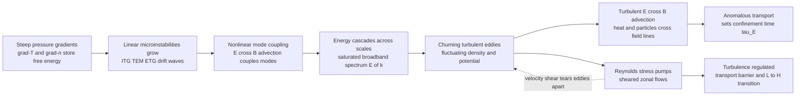

# 🌀 Plasma Turbulence and Nonlinear Dynamics

> [!abstract] TL;DR
> A linear instability tells you a plasma *will* go unstable; **turbulence** is what happens *next* — many unstable modes couple nonlinearly, exchange energy across scales in a **cascade**, and saturate into a churning sea of eddies in density, potential, and temperature. The single most important consequence is **anomalous (turbulent) transport**: fluctuating $\mathbf{E}\times\mathbf{B}$ eddies advect heat and particles *across* the confining magnetic field **far faster** than classical or neoclassical collisional transport, and this sets the energy **confinement time** $\tau_E$ — the number that decides whether a reactor ignites. The culprits are **drift-wave microinstabilities** — **ITG** (ion-temperature-gradient), **TEM** (trapped-electron mode), and **ETG** (electron-scale) — feeding on pressure gradients. Remarkably, the turbulence can **self-organize**: it drives sheared **zonal flows** that then **shear apart** and regulate the very turbulence that made them, a **predator–prey** dynamic that is the leading explanation of the **L–H transition** and transport barriers. The modelling tool of choice is **gyrokinetics** (a gyro-averaged, tractable reduction of the 5-D kinetic problem — GENE, GYRO, GS2, XGC), and the key scaling question is **Bohm vs gyro-Bohm**. Taming this leak is the central drama of magnetic confinement fusion.

## Intuition — ANALOGY FIRST

Watch smoke rising from a candle. For a few centimetres it climbs in a smooth, glassy column — laminar, orderly, predictable. Then, quite suddenly, it breaks into a chaotic swirl of eddies that fold, stretch, and tangle. That break-up is **turbulence**, and it is the reason your coffee cools faster when you stir it: the eddies physically *carry* hot fluid to the cold rim far faster than heat could ever diffuse molecule-to-molecule.

In a fusion plasma the very same churning happens — but here it is the **enemy**. Countless tiny eddies of density and electric field, born from instabilities that feed on the plasma's own steep pressure gradients, act like a swarm of ferries: each eddy grabs a parcel of scorching plasma from the core and carries it a little way outward, hands it to the next eddy, and the heat is relayed straight out to the cold wall. This is **anomalous transport** — "anomalous" because for decades it was mysteriously, embarrassingly larger than every collisional ("classical") calculation predicted. The plasma turbulently **leaks its own heat**, and taming that leak — slowing the ferries — is the central obstacle standing between us and a burning fusion plasma.

The twist that makes the story beautiful rather than merely bleak: the storm can generate its own calm. Just as a hurricane can spin up banded jet-stream winds, the plasma turbulence pumps energy into **sheared flows** that then reach back and tear the eddies apart — the system polices itself.

---

## How It Works

### Core Mechanics

**1. From linear instability to nonlinear saturation.** A linear microinstability (the subject of the sibling note *Two_Stream_and_Kinetic_Instabilities*) extracts free energy from a gradient — a temperature or density gradient — and a single Fourier mode grows *exponentially*, $\delta n \sim e^{\gamma t}$. Exponential growth cannot continue: as the amplitude rises, the mode begins to feel the modes it has excited. **Nonlinear mode coupling** (the $\mathbf{v}\cdot\nabla$ advective term, chiefly $\mathbf{E}\times\mathbf{B}$ advection of vorticity and pressure) redistributes energy among a broad spectrum of wavenumbers. Growth stalls when the nonlinear energy transfer *out* of a scale balances the linear drive *into* it — **saturation**. The end-state is not one clean wave but a statistically stationary, broadband **turbulent** field.

**2. The cascade across scales.** Once saturated, energy is not stored — it *flows through scales*, exactly as in Kolmogorov's picture of fluid turbulence (see [[Kolmogorov_Theory_and_the_Energy_Cascade]]). Drive enters near the instability's characteristic scale (for ITG, wavelengths of order the ion gyroradius $\rho_i$); nonlinear coupling spreads it across a **spectrum** $E(k)$; and it is removed at small scales by collisional dissipation and Landau damping. A crucial subtlety: strongly magnetized plasma turbulence is quasi-**two-dimensional** (motion is fast along field lines, slow across), and 2-D turbulence supports a **dual cascade** — energy tends to flow to *large* scales (an **inverse cascade**) while enstrophy flows to small scales. This inverse tendency is exactly what feeds the large-scale zonal flows below.

**3. Anomalous transport — the payload.** The turbulent radial heat and particle flux is set by the correlation between fluctuating $\mathbf{E}\times\mathbf{B}$ velocity and fluctuating pressure/density:
$$\Gamma \;=\; \langle \tilde{n}\,\tilde{v}_{E\times B,r}\rangle, \qquad Q \;=\; \tfrac{3}{2}\langle \tilde{p}\,\tilde{v}_{E\times B,r}\rangle, \qquad \tilde{\mathbf v}_{E\times B} = \frac{\tilde{\mathbf E}\times\mathbf B}{B^2}.$$
A useful mixing-length estimate makes the danger vivid: $D_{\text{turb}} \sim \tilde{v}\,\ell_c \sim \gamma/k_\perp^2$, where $\ell_c$ is the eddy correlation length. For fusion parameters this is **one to three orders of magnitude larger** than the collisional (classical/neoclassical) diffusivity — which is why the confinement problem is a *turbulence* problem.

**4. Confinement time.** Integrated over the plasma, anomalous transport fixes the **energy confinement time** $\tau_E = W/P_{\text{loss}}$ (stored energy over loss power). Because fusion power scales steeply with $\tau_E$ (the Lawson triple product $n T \tau_E$), *understanding and reducing turbulent transport is equivalent to making fusion work.*

**5. Self-organization — zonal flows and the predator–prey loop.** The turbulence is not the whole story. Through its **Reynolds stress** $\langle \tilde v_r \tilde v_\theta\rangle$, the small-scale turbulence pumps momentum into **zonal flows** — radially sheared, poloidally symmetric ($k_\theta = k_\parallel = 0$) $\mathbf{E}\times\mathbf{B}$ flows that carry no transport themselves. But their **velocity shear** stretches and tears the turbulent eddies, **decorrelating** them and cutting the flux. Turbulence feeds zonal flows; zonal flows starve turbulence — a **predator–prey** relationship. Push the drive hard enough and this loop, aided by the equilibrium sheared flow, can trigger a sudden bifurcation into a **high-confinement (H-mode)** state with an edge **transport barrier**.

### Flow / Architecture



---

## Key Concepts

### Secondary Level

- **Turbulence** — smooth flow suddenly breaking into a swirling mess of eddies; the same thing that makes stirred coffee cool faster.
- **The fusion enemy** — in a magnetically confined plasma those eddies *carry heat outward* to the wall much faster than gentle particle collisions ever could. This heat leak is called **anomalous transport**, and it is the biggest reason fusion is hard.
- **Confinement time** — how long the plasma holds onto its heat before leaking it away. More turbulence means shorter confinement, which means it is harder to reach fusion conditions.
- **Self-calming storm** — the turbulence can spin up its own banded "jet-stream" flows (**zonal flows**) that then quiet the turbulence, sometimes flipping the plasma into a much better-confined state.

### Undergraduate Level

- **Anomalous vs classical/neoclassical transport** — collisional (classical) transport across a magnetic field is tiny ($D \sim \rho_i^2 \nu$); **neoclassical** adds toroidal-geometry corrections (banana orbits). Measured transport is **far larger** than both — the excess is turbulent (anomalous), driven by fluctuating $\mathbf{E}\times\mathbf{B}$ flows.
- **Drift waves** — the universal low-frequency oscillation of an inhomogeneous magnetized plasma; a density perturbation + adiabatic electron response + finite phase shift → a growing wave that transports particles down the gradient. The backbone of core microturbulence.
- **The microinstability zoo** — **ITG** (ion-temperature-gradient / "toaster" mode, ion-scale $k_\perp\rho_i \sim 1$), **TEM** (trapped-electron mode, driven by trapped-particle precession and $\nabla n,\nabla T_e$), **ETG** (electron-temperature-gradient, electron-scale $k_\perp\rho_e\sim 1$). Different drives, different scales, all feeding on pressure gradients.
- **Mixing-length estimate** — $D_{\text{turb}} \sim \gamma/k_\perp^2 \sim \tilde v\,\ell_c$: relates the *linear* growth rate and eddy size to a *nonlinear* transport coefficient. A first, order-of-magnitude tool.
- **Forward vs inverse cascade** — 3-D fluid turbulence sends energy to small scales (forward). Quasi-2-D magnetized turbulence sends energy to *large* scales (**inverse cascade**), which is how the turbulence builds the large-scale zonal flows that regulate it.
- **Bohm vs gyro-Bohm** — two candidate scalings for how diffusivity varies with machine size (see graduate box). This is central to extrapolating today's tokamaks to a reactor.

### Graduate Level

- **Gyrokinetics — the tool.** The full kinetic problem is a 6-D Vlasov–Maxwell system; resolving the fast gyromotion is hopeless. **Gyrokinetic theory** averages over the gyro-orbit, removing the fast cyclotron timescale and one velocity coordinate, leaving a **5-D** problem for the gyro-center distribution — while retaining crucial **finite-Larmor-radius** (FLR) physics. This is *not* full Vlasov and *not* fluid; it is the rigorous low-frequency, small-$\rho^\ast$ reduction. Flagship codes: **GENE, GYRO, GS2, GKW** (continuum/$\delta f$) and **XGC, ORB5** (particle-in-cell, edge-capable).
- **Zonal flows and the predator–prey model (Diamond et al.).** Reynolds-stress-driven, radially sheared, $k_\theta=k_\parallel=0$ $\mathbf{E}\times\mathbf{B}$ flows. Undamped by Landau resonance (zero real frequency); the residual **Rosenbluth–Hinton** level survives collisionless damping. A minimal 0-D model $\partial_t \mathcal{E} = (\gamma - \alpha V^2)\mathcal{E}$, $\partial_t V^2 = \alpha \mathcal{E} V^2 - \gamma_d V^2$ reproduces limit cycles and the L–H transition as a bifurcation.
- **The Dimits shift.** Zonal flows raise the *effective* nonlinear critical gradient above the *linear* threshold: near marginality the turbulence is almost entirely quenched by self-generated zonal flows, so flux stays near zero until the gradient is pushed well past the linear onset. A signature nonlinear result, invisible to linear theory.
- **Profile stiffness and avalanches.** Because flux rises steeply once the critical gradient is exceeded, temperature profiles are **stiff** (resist steepening). Transport is often **non-local and non-diffusive**: ballistic **avalanches** of heat propagate radially, and the system sits near **self-organized criticality** (SOC) — connecting to sandpile models.
- **Bohm vs gyro-Bohm scaling.** $D_{\text{Bohm}} = \tfrac{1}{16}\,T/eB$ (diffusivity independent of gradient scale, scales with device size). $D_{\text{gB}} = \rho^\ast\,D_{\text{Bohm}}$ with $\rho^\ast = \rho_i/a$ the normalized gyroradius — so gyro-Bohm transport *improves* (relatively) in larger machines. Whether a given regime is Bohm or gyro-Bohm (set by $\rho^\ast$ dependence, turbulence spreading, and profile shear) is decisive for reactor extrapolation.
- **Broader nonlinear plasma dynamics.** Beyond drift-wave transport: **wave–wave three-wave coupling** and parametric instabilities, **solitons** and coherent structures (blobs/filaments in the SOL), and **reconnection-mediated turbulence** in space and astrophysical plasmas (solar wind, accretion disks via the MRI) — a rich nonlinear arena bridging to fluid turbulence and complexity theory.

---

## Python Demo

```python
# Plasma turbulence: cascade spectrum + anomalous transport.
#   (a) Build a synthetic 2D turbulent electrostatic potential from
#       random-phase Fourier modes with a power-law spectrum E(k) ~ k^-alpha
#       (a Kolmogorov-like cascade across scales).
#   (b) Form the incompressible E x B eddy velocity v = zhat x grad(phi),
#       release test particles in the frozen eddies + weak collisions, and
#       measure the effective (anomalous) diffusivity -- it vastly exceeds
#       the bare collisional estimate. That gap IS anomalous transport.
import numpy as np
import matplotlib.pyplot as plt

rng = np.random.default_rng(7)

# ============================================================
# (a) SYNTHETIC 2D TURBULENT FIELD with a power-law spectrum
#     Filter white noise so the shell-averaged spectrum ~ k^-alpha.
# ============================================================
N     = 256                     # grid points per side
Lbox  = 2*np.pi                 # periodic box size
dx    = Lbox/N
alpha = 5/3                     # target spectral slope (Kolmogorov-like)

kx    = np.fft.fftfreq(N, d=dx)*2*np.pi
KX, KY = np.meshgrid(kx, kx, indexing='ij')
K      = np.sqrt(KX**2 + KY**2)
K[0,0] = 1.0                    # guard k=0

# |phi_k|^2 ~ k^-(alpha+1)  =>  shell-integrated E(k) ~ k^-alpha in 2D
p      = (alpha + 1)/2
white  = rng.standard_normal((N, N))
phik   = np.fft.fft2(white) * K**(-p)
phik[0,0] = 0.0                 # zero mean
phi    = np.fft.ifft2(phik).real
phi   -= phi.mean(); phi /= phi.std()   # normalized turbulent potential

# radially averaged power spectrum
P2    = np.abs(np.fft.fft2(phi))**2
kbin  = np.arange(1, N//2)
Ek    = np.array([P2[(K >= k-0.5) & (K < k+0.5)].sum() for k in kbin], float)
Ek   /= Ek[3]                   # normalize for plotting

# ============================================================
# (b) E x B eddy velocity: v = zhat x grad(phi)  (divergence-free)
# ============================================================
gphix, gphiy = np.gradient(phi, dx, dx)     # d/dx (axis0), d/dy (axis1)
vx = -gphiy
vy =  gphix
vrms = np.sqrt((vx**2 + vy**2).mean())
vx /= vrms; vy /= vrms          # unit rms turbulent drift speed

def sample(fld, xp, yp):
    """periodic nearest-cell sample of a grid field at particle positions."""
    ix = (np.floor(xp/dx).astype(int)) % N
    iy = (np.floor(yp/dx).astype(int)) % N
    return fld[ix, iy]

# ---- test-particle transport: frozen eddies + weak collisions ----
nP     = 4000
steps  = 4000
dt     = 5e-3
D_coll = 2.0e-4                 # bare collisional (classical) diffusivity
sig    = np.sqrt(2*D_coll*dt)   # collisional random-step size

xp = rng.uniform(0, Lbox, nP); yp = rng.uniform(0, Lbox, nP)
x0, y0 = xp.copy(), yp.copy()
ux = np.zeros(nP); uy = np.zeros(nP)   # unwrapped displacement accumulators
msd = np.zeros(steps)
ntr = 12
traj = np.zeros((steps, ntr, 2))       # a few trajectories to draw

for s in range(steps):
    ex = sample(vx, xp, yp); ey = sample(vy, xp, yp)
    ddx = ex*dt + sig*rng.standard_normal(nP)
    ddy = ey*dt + sig*rng.standard_normal(nP)
    ux += ddx; uy += ddy
    xp = (xp + ddx) % Lbox; yp = (yp + ddy) % Lbox
    msd[s] = (ux**2 + uy**2).mean()
    traj[s,:,0] = x0[:ntr] + ux[:ntr]
    traj[s,:,1] = y0[:ntr] + uy[:ntr]

t     = np.arange(steps)*dt
half  = steps//2
slope = np.polyfit(t[half:], msd[half:], 1)[0]   # MSD = 4 D t in 2D
D_turb = slope/4

print(f"collisional  D_classical = {D_coll:.2e}")
print(f"turbulent    D_anomalous = {D_turb:.2e}")
print(f"enhancement  factor      = {D_turb/D_coll:.0f} x")

# ============================================================
# PLOTS
# ============================================================
fig, ax = plt.subplots(2, 2, figsize=(13, 10))

im = ax[0,0].imshow(phi.T, origin='lower', cmap='RdBu_r',
                    extent=[0, Lbox, 0, Lbox])
ax[0,0].set_title("(a) Turbulent E x B potential  phi(x,y)")
ax[0,0].set_xlabel("x"); ax[0,0].set_ylabel("y")
fig.colorbar(im, ax=ax[0,0], shrink=0.85, label="phi (normalized)")

ax[0,1].loglog(kbin, Ek, 'k.', ms=4, label="measured spectrum")
inr = (kbin >= 3) & (kbin <= N//4)
ref = (kbin/kbin[3])**(-alpha)
ax[0,1].loglog(kbin[inr], ref[inr], 'r-', lw=2,
               label=f"k^(-{alpha:.2f}) reference")
ax[0,1].set_xlabel("wavenumber  k"); ax[0,1].set_ylabel("E(k)  (normalized)")
ax[0,1].set_title("(b) Cascade: power-law energy spectrum")
ax[0,1].legend(); ax[0,1].grid(alpha=0.3, which='both')

ax[1,0].imshow(phi.T, origin='lower', cmap='Greys', alpha=0.35,
               extent=[0, Lbox, 0, Lbox])
for j in range(ntr):
    ax[1,0].plot(traj[:,j,0] % Lbox, traj[:,j,1] % Lbox, lw=0.8)
ax[1,0].set_xlim(0, Lbox); ax[1,0].set_ylim(0, Lbox)
ax[1,0].set_title("(c) Test particles ferried by turbulent eddies")
ax[1,0].set_xlabel("x"); ax[1,0].set_ylabel("y")

ax[1,1].loglog(t[1:], msd[1:], 'b-', lw=2, label="turbulent MSD")
ax[1,1].loglog(t[1:], 4*D_turb*t[1:], 'b:', lw=1.5,
               label=f"4 D_turb t   (D={D_turb:.1e})")
ax[1,1].loglog(t[1:], 4*D_coll*t[1:], 'k--', lw=2,
               label=f"4 D_coll t   (D={D_coll:.1e})")
ax[1,1].set_xlabel("time  t"); ax[1,1].set_ylabel("mean-square displacement")
ax[1,1].set_title(f"(d) Anomalous transport: ~{D_turb/D_coll:.0f}x classical")
ax[1,1].legend(fontsize=8); ax[1,1].grid(alpha=0.3, which='both')

plt.tight_layout()
plt.savefig("plasma_turbulence.png", dpi=130)
plt.show()
```

Running it produces a mottled turbulent potential, a clean $E(k)\propto k^{-5/3}$ power spectrum confirming the synthetic cascade, tangled test-particle trajectories that wander from eddy to eddy, and — the punchline — a mean-square-displacement curve whose turbulent diffusivity sits **hundreds of times above** the bare collisional line. That gap between the two slopes *is* anomalous transport: the same physical reason a real tokamak leaks heat far faster than any collisional calculation allows. (Making the eddy field decorrelate in time, or shearing it with a zonal flow, would *reduce* the gap — the numerical analogue of turbulence suppression.)

---

## Real-World Applications

- **Tokamak and stellarator confinement (ITER, JET, DIII-D, ASDEX-U, W7-X).** Anomalous transport driven by ITG/TEM/ETG turbulence sets $\tau_E$ and therefore the size, cost, and viability of every magnetic-confinement reactor. Predicting ITER's performance rests on gyrokinetic turbulence models validated against these machines.
- **The H-mode and transport barriers.** The **L–H transition** — a sudden jump to high confinement discovered on ASDEX in 1982 and the baseline scenario for ITER — is understood as sheared-flow (zonal-flow + equilibrium $\mathbf{E}\times\mathbf{B}$ shear) suppression of edge turbulence, forming an edge transport barrier (pedestal). Internal transport barriers (ITBs) do the same in the core.
- **Gyrokinetic supercomputing.** Codes such as **GENE, GYRO, GS2, XGC, ORB5** are among the largest consumers of leadership-class HPC in fusion science, routinely running first-principles turbulence simulations to predict fluxes and design experiments.
- **Scrape-off-layer (SOL) and divertor physics.** Coherent turbulent **blobs/filaments** carry particles and heat radially in the plasma edge, governing divertor heat loads — a critical materials and engineering constraint for reactors.
- **Space and astrophysical plasmas.** The **solar wind** is a natural turbulence laboratory showing a clean cascade with a $k^{-5/3}$-like inertial range; turbulence and reconnection govern coronal heating, and the **magnetorotational instability (MRI)** drives the turbulent angular-momentum transport that lets **accretion disks** feed black holes and protostars.

---

## Common Pitfalls

- **"Transport is collisional."** In fusion plasmas, **anomalous (turbulent) transport dominates** classical and neoclassical collisional transport, often by 1–3 orders of magnitude. Quoting a neoclassical diffusivity as *the* transport level is the classic error — the turbulence is the whole story for the electron channel and usually the ion channel too.
- **Ignoring which microinstability is driving.** Lumping all core turbulence together hides the physics: **ITG** (ion-scale, ion heat), **TEM** (density/electron-temperature gradients, trapped electrons), and **ETG** (electron-scale, electron heat) have different drives, scales, and remedies. The transport channel and the fix depend on the culprit.
- **Forgetting zonal flows.** Zonal flows are *not* incidental — they are **self-generated by the turbulence** via Reynolds stress and then **shear the turbulence apart**, a **predator–prey** regulation. Omitting them (e.g. artificially suppressing them in a simulation) can *double or triple* the predicted transport and miss the **Dimits shift** and the L–H transition entirely.
- **Reaching for full Vlasov.** The right tool is **gyrokinetics**, not the full 6-D Vlasov–Maxwell system. Gyro-averaging removes the fast cyclotron motion and one velocity dimension while keeping finite-Larmor-radius physics — that reduction is what makes the problem computable. Trying to resolve the gyromotion directly is wasteful and usually intractable.
- **Confusing Bohm and gyro-Bohm.** They scale *oppositely* with machine size relative to a reactor: **gyro-Bohm** ($D \propto \rho^\ast D_{\text{Bohm}}$) improves in larger devices, **Bohm** does not. Assuming the wrong one badly mis-extrapolates today's tokamaks to ITER/DEMO.
- **Treating turbulence as mere "noise."** It is **not** random noise — it **self-organizes** into coherent zonal flows, streamers, blobs, and avalanches, and can sit near **self-organized criticality** with non-local, non-diffusive transport. A purely diffusive, stochastic mental model misses profile stiffness and ballistic heat avalanches.
- **Assuming a single forward cascade.** 3-D fluid turbulence cascades energy to small scales, but strongly magnetized (quasi-2-D) plasma turbulence has a **dual cascade** with an **inverse** energy cascade to large scales — precisely the route by which small eddies build the large zonal flows that regulate them.

---

## Related Concepts

- [[Plasma_Physics_Overview]] — the vault entry point; turbulence and anomalous transport are the reason confinement is hard, framed against the collective-behavior foundations.
- [[Plasma_Oscillations_and_Frequency]] — collective oscillations and drift waves are the *linear* building blocks whose nonlinear saturation *is* this turbulence.
- [[Debye_Shielding_and_Plasma_Parameters]] — sets the gyroradius $\rho_i$ and $\rho^\ast$ that fix the turbulence scale and the Bohm/gyro-Bohm question.
- [[Turbulence_Fundamentals]] — the neutral-fluid parent: eddies, correlation, Reynolds decomposition, and turbulent transport carry over directly to plasmas.
- [[Kolmogorov_Theory_and_the_Energy_Cascade]] — the cascade and $k^{-5/3}$ spectrum that the plasma turbulence generalizes (with a dual/inverse cascade in the magnetized 2-D limit).
- [[Mixing_Dispersion_and_Turbulent_Transport]] — the fluid statement of eddy-enhanced diffusion; the plasma's $\mathbf{E}\times\mathbf{B}$ anomalous transport is its magnetized cousin.
- [[Magnetohydrodynamics]] — the large-scale, low-frequency fluid limit; MHD instabilities set the equilibrium that microturbulence then relaxes.
- [[Emergence_and_Self_Organization]] — zonal flows and transport barriers are textbook self-organization: order (sheared flow) emerging from turbulent disorder.
- [[Feedback_Loops_and_Causality]] — the turbulence–zonal-flow predator–prey loop is a balancing feedback that regulates transport and drives the L–H bifurcation.
- [[Chaos_and_Nonlinear_Dynamics_Numerically]] — the numerical toolkit for the nonlinear, chaotic dynamics underlying saturation, limit cycles, and avalanches.

*Sibling notes in this section (planned): Two_Stream_and_Kinetic_Instabilities (the linear seeds that saturate into this turbulence), Kinetic_Theory_and_the_Vlasov_Equation (the parent kinetic description that gyrokinetics reduces), Confinement_Transport_and_H_Mode (where anomalous transport sets $\tau_E$ and the L–H transition realizes zonal-flow regulation), Collisions_and_Transport_in_Plasmas (the classical/neoclassical baseline that turbulence overwhelms), and MHD_Instabilities (large-scale instabilities that set the equilibrium the microturbulence feeds on).*

---

## Review Questions

1. **(Secondary)** Using the stirred-coffee analogy, explain why turbulence makes a fusion plasma *lose* heat faster, and why "anomalous transport" earned its name. Why is a plasma that generates its own sheared "jet-stream" flows sometimes *better* confined?
2. **(Undergraduate)** Write down the turbulent radial particle flux in terms of the fluctuating density and $\mathbf{E}\times\mathbf{B}$ velocity, and use the mixing-length estimate $D_{\text{turb}}\sim\gamma/k_\perp^2$ to argue why turbulent transport can exceed neoclassical transport by orders of magnitude. Name the three main microinstabilities and the gradient each one feeds on.
3. **(Graduate)** Explain the turbulence–zonal-flow predator–prey model and the **Dimits shift**. Why do zonal flows regulate but not directly transport? Then contrast **Bohm** and **gyro-Bohm** scaling: define $\rho^\ast$, state how each diffusivity scales with device size, and explain why the distinction is decisive for extrapolating present tokamaks to ITER. Finally, justify why **gyrokinetics** (not full Vlasov) is the appropriate first-principles tool.

---

## Sources

- Diamond, P. H., Itoh, S.-I. & Itoh, K. *Modern Plasma Physics, Vol. 1: Physical Kinetics of Turbulent Plasmas* (Cambridge University Press, 2010) — the definitive graduate treatment of drift-wave turbulence, cascades, and zonal-flow self-regulation.
- Horton, W. "Drift waves and transport." *Reviews of Modern Physics* **71**, 735 (1999) — comprehensive review of drift-wave microturbulence and anomalous transport.
- Krommes, J. A. "Fundamental statistical descriptions of plasma turbulence in magnetic fields." *Physics Reports* **360**, 1–352 (2002) — the statistical-theory foundations of magnetized plasma turbulence.
- Garbet, X., Idomura, Y., Villard, L. & Watanabe, T. H. "Gyrokinetic simulations of turbulent transport." *Nuclear Fusion* **50**, 043002 (2010) — review of gyrokinetic theory and simulation (GENE/GYRO/GS2/XGC) for turbulent transport.
- Terry, P. W. "Suppression of turbulence and transport by sheared flow." *Reviews of Modern Physics* **72**, 109 (2000) — the sheared-flow / zonal-flow mechanism behind transport barriers and the L–H transition.

---

#plasma-physics #plasma-turbulence #anomalous-transport #drift-waves #zonal-flows
