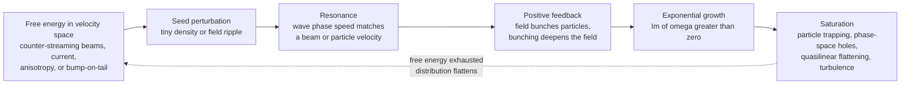

# ⚡ Two-Stream and Kinetic Instabilities

> [!abstract] TL;DR
> A plasma stores **free energy** in the *shape* of its velocity distribution — in beams, currents, or anisotropies. A **kinetic (micro)instability** is the mechanism that taps that reservoir: when the dispersion relation yields a complex frequency with **positive imaginary part** ($\mathrm{Im}\,\omega > 0$), any whisper of noise grows **exponentially** into a real wave. The archetype is the **two-stream / beam-plasma instability**: two counter-streaming electron populations, where a tiny density ripple bunches the beams via runaway positive feedback — unstable for $k v_0 < \omega_p$, peaking at $\gamma_{\max}=\omega_p/2\sqrt{2}\approx0.35\,\omega_p$. Its kinetic cousin, the **bump-on-tail instability**, is literally the *sign-flip* of Landau damping: a fast-particle beam makes $\partial f/\partial v > 0$, so **inverse Landau damping** pumps the wave instead of draining it. These microinstabilities set confinement limits, heat and accelerate particles in space and astrophysical shocks, and are the microscopic seed of plasma turbulence.

## Intuition — analogy FIRST

Soldiers marching in lockstep across a footbridge can shake it to pieces — not because they push hard, but because their rhythm feeds energy into the bridge's natural sway on *every* step, and each larger sway makes the next footfall land more perfectly in phase. A trickle of coordination becomes a violent oscillation.

Fire two streams of electrons through each other and the *same* runaway happens. A tiny ripple in one beam sets up an electric field; that field **bunches** the other beam; the bunched beam deepens the field; the deeper field bunches harder — a positive-feedback loop that explodes a whisper of thermal noise into violent waves. This is the **two-stream instability**, and it is exactly the flip side of **Landau damping**: there the plasma drains a wave by absorbing its energy into resonant particles; here the beam **pumps** the wave, feeding its own streaming energy into the field. An instability is nothing more than a free-energy source plus a resonance that lets a wave sip from it — and once the sipping reinforces itself, the growth is exponential.

---

## How It Works

### Core mechanics

1. **Free energy lives in velocity space.** A Maxwellian is the *maximum-entropy* distribution — it has no free energy to give. But bend that distribution — add a beam, a drift (current), a bump, or a temperature anisotropy — and you have stored kinetic energy that thermodynamics *wants* to relax. A microinstability is the relaxation channel.
2. **A wave provides the resonance.** Perturb the plasma with a wave $\propto e^{i(kx-\omega t)}$. Particles moving near the wave's phase speed $v=\omega/k$ stay in step with the field and exchange energy strongly — exactly the resonance the soldiers exploited with the bridge.
3. **Solve the dispersion relation.** Linearize the fluid (or Vlasov) equations plus Poisson's law. You get $\varepsilon(k,\omega)=0$, an equation whose roots $\omega(k)$ may be **complex**. Writing $\omega=\omega_r+i\gamma$, the perturbation behaves as $e^{\gamma t}e^{i(kx-\omega_r t)}$.
4. **Positive imaginary part = exponential growth.** If $\gamma=\mathrm{Im}\,\omega>0$ the amplitude grows exponentially (**instability**); if $\gamma<0$ it damps (Landau damping); if $\gamma=0$ it is a steady wave. The plasma is unstable the instant *any* $k$ has a root with $\gamma>0$.
5. **The two-stream feedback.** For two cold electron beams at $\pm v_0$, a density ripple in one beam makes a field that decelerates/accelerates the other beam, piling its electrons into denser bunches; those bunches strengthen the field, which bunches the first beam — a closed loop that grows exponentially for wavenumbers $k v_0 < \omega_p$.
6. **Growth cannot last forever.** As the wave reaches large amplitude it **traps** the resonant particles in its potential troughs; the trapped particles orbit, forming **phase-space vortices ("holes")**, and the distribution **flattens** ($\partial f/\partial v \to 0$) so the free energy is exhausted. This is **nonlinear saturation** — the doorway to turbulence.



### Deriving the two-stream growth rate

Take two cold electron populations of equal density $n_0/2$ drifting at $+v_0$ and $-v_0$ on a fixed ion background. Each contributes a susceptibility, and the electrostatic dispersion relation is

$$1 = \frac{\omega_p^2/2}{(\omega-kv_0)^2} + \frac{\omega_p^2/2}{(\omega+kv_0)^2},$$

where $\omega_p=\sqrt{n_0 e^2/\varepsilon_0 m_e}$ is the *total* plasma frequency. Clearing denominators gives the compact biquadratic

$$(\omega^2 - k^2v_0^2)^2 = \omega_p^2\,(\omega^2 + k^2v_0^2).$$

Writing $y=\omega^2/\omega_p^2$ and $a = kv_0/\omega_p$, this is $y^2-(2a^2+1)y+(a^4-a^2)=0$, with roots

$$y_\pm = \frac{(2a^2+1)\pm\sqrt{8a^2+1}}{2}.$$

The smaller root $y_-$ goes **negative** when $a<1$, i.e. $k v_0 < \omega_p$. A negative $\omega^2$ means $\omega$ is **purely imaginary** — one root has $\gamma>0$ and the mode grows. The growth rate is

$$\boxed{\;\gamma(k) = \omega_p\sqrt{\frac{\sqrt{8a^2+1}-(2a^2+1)}{2}}\;},\qquad a=\frac{kv_0}{\omega_p}.$$

Maximising over $a$ gives the classic result: the fastest growth sits at $k v_0=\sqrt{3/8}\,\omega_p\approx0.61\,\omega_p$, with

$$\gamma_{\max}=\frac{\omega_p}{2\sqrt{2}}\approx0.35\,\omega_p.$$

So the instability is *strong* — it grows on the plasma-oscillation timescale itself — and it occupies a finite **unstable band** $0<kv_0<\omega_p$ (long wavelengths; short wavelengths $kv_0>\omega_p$ are stable oscillations).

### The kinetic cousin: bump-on-tail and inverse Landau damping

Replace the two cold beams with a warm Maxwellian bulk plus a small fast-particle **bump** on its tail. The kinetic (Vlasov) growth rate of a Langmuir wave is the Landau formula

$$\gamma \;=\; \frac{\pi}{2}\,\frac{\omega_p^3}{k^2}\left.\frac{\partial f_0}{\partial v}\right|_{v=\omega/k}.$$

Everything hinges on the **sign of $\partial f/\partial v$** at the resonant velocity $v=\omega/k$:

- In a plain Maxwellian, $\partial f/\partial v<0$ for all $v>0$ $\Rightarrow$ $\gamma<0$ $\Rightarrow$ **Landau damping**.
- On the *rising* flank of a bump, $\partial f/\partial v>0$ $\Rightarrow$ $\gamma>0$ $\Rightarrow$ **growth**. Because there are slightly *more* fast particles than slow ones at the resonance, the wave gains more energy from the fast group than it loses to the slow group — the exact **sign-flip** of Landau damping, called **inverse Landau damping**.

---

## Key Concepts

### Secondary Level

- **Instability = free energy + feedback.** If a system has stored energy and a way to feed it into a growing wiggle, a tiny disturbance blows up — like marching soldiers wrecking a bridge.
- **Two-stream instability.** Push two electron streams through each other; a small ripple bunches them, the bunches strengthen the ripple, and waves grow explosively.
- **It is the opposite of damping.** Landau damping lets the plasma *soak up* a wave; a beam instability makes the plasma *pump* a wave instead. The difference is whether the beam adds or removes energy.
- **Growth then saturation.** The wave cannot grow forever — eventually it traps particles and stirs the plasma into turbulence.

### Undergraduate Level

- **Complex frequency test.** Solve $\varepsilon(k,\omega)=0$; if any root has $\mathrm{Im}\,\omega>0$ the plasma is unstable and that mode grows as $e^{\gamma t}$.
- **Two-stream dispersion relation.** $1=\tfrac{\omega_p^2}{2}\!\left[(\omega-kv_0)^{-2}+(\omega+kv_0)^{-2}\right]\Rightarrow(\omega^2-k^2v_0^2)^2=\omega_p^2(\omega^2+k^2v_0^2)$; unstable for $kv_0<\omega_p$, with $\gamma_{\max}=\omega_p/2\sqrt2$ at $kv_0=\sqrt{3/8}\,\omega_p$.
- **Unstable band + peak growth.** Long wavelengths ($kv_0<\omega_p$) are unstable; there is a single most-unstable wavenumber — the mode that dominates the observed structure.
- **Bump-on-tail.** A fast-particle beam creates a region where $\partial f/\partial v>0$; inverse Landau damping there drives Langmuir waves. The growth rate follows the *sign* of $\partial f/\partial v$ at $v=\omega/k$.
- **Convective vs absolute.** A convective instability grows but is swept away with the flow; an absolute instability grows *in place* at a fixed point. Which one occurs is decided by the topology of the dispersion roots.

### Graduate Level

- **The zoo of velocity-space instabilities.** *Two-stream / beam-plasma* (counter-streaming or beam-through-plasma). *Buneman* (current-driven: electrons drifting through ions faster than thermal). *Bump-on-tail* (gentle beam, weak growth, quasilinear). *Weibel* (temperature-anisotropy or counterstreaming driven; **electromagnetic**, spontaneously generates magnetic fields). *Loss-cone* (mirror machines, anisotropic $f$ missing the loss cone). *Ion-acoustic* (current-driven, needs $T_e\gg T_i$).
- **Weibel is special — it makes magnetic fields.** Unlike the electrostatic beam instabilities, Weibel grows a *transverse electromagnetic* mode from a temperature anisotropy, filamenting the current and generating $B$. It is the accepted mechanism for magnetic-field generation in **collisionless astrophysical shocks** (gamma-ray bursts, supernova remnants) and for beam filamentation in **fast-ignition** inertial fusion.
- **Nonlinear saturation.** Linear theory only gives the seed growth. Saturation comes via (i) **particle trapping** — the wave's bounce frequency $\omega_b=\sqrt{ekE/m}$ rises until $\omega_b\sim\gamma$; (ii) **BGK phase-space holes/vortices** — self-sustaining trapped-particle equilibria; and (iii) **quasilinear flattening** — the bump-on-tail plateaus $\partial f/\partial v\to0$, diffusing particles in velocity until the free energy is gone.
- **Micro vs macro instabilities.** *Kinetic (micro)* instabilities draw on **velocity-space** free energy (non-Maxwellian $f$) and need the Vlasov description — the subject here. *MHD (macro)* instabilities draw on **configuration-space** free energy (currents, pressure gradients, field-line curvature: kink, sausage, interchange/Rayleigh–Taylor) and live in the fluid model.
- **Convective vs absolute (Briggs–Bers).** Analysing pinch points of $\omega(k)$ in the complex plane distinguishes disturbances that grow while propagating away (convective) from those that grow at a fixed location (absolute) — critical for whether a device or a shock front is truly unstable.

---

## Python Demo

```python
# Two-stream & kinetic instabilities.
#   (a) DISPERSION & GROWTH RATE: solve the cold two-beam dispersion relation
#       1 = (wp^2/2)[1/(w-k v0)^2 + 1/(w+k v0)^2] for complex w(k); plot the
#       growth rate Im(w) vs k -> an unstable band with a peak at k v0 = sqrt(3/8) wp.
#   (b) BUMP-ON-TAIL: a Maxwellian with a beam bump; shade the df/dv > 0 region
#       where inverse Landau damping drives growth (the sign-flip of Landau damping).
#   (c,d) A tiny 1D electrostatic PIC of two counter-streaming beams -> phase-space
#       "holes"/vortices form as the instability saturates.
import numpy as np
import matplotlib.pyplot as plt

# ============================================================
# (a) TWO-STREAM GROWTH RATE  (normalised: wp = 1, v0 = 1, so a = k)
#     (w^2 - a^2)^2 = w^2 + a^2  ->  quartic  w^4 - (2a^2+1)w^2 + (a^4 - a^2) = 0
# ============================================================
kv = np.linspace(1e-3, 1.5, 500)          # k v0 / wp
gamma_num = np.zeros_like(kv)
for j, a in enumerate(kv):
    coeffs = [1.0, 0.0, -(2*a**2 + 1.0), 0.0, a**4 - a**2]   # in units of wp
    roots = np.roots(coeffs)
    gamma_num[j] = np.max(roots.imag)      # fastest-growing root

# analytic closed form for cross-check
disc = (np.sqrt(8*kv**2 + 1) - (2*kv**2 + 1)) / 2.0
gamma_ana = np.sqrt(np.clip(disc, 0, None))
a_peak, g_peak = np.sqrt(3/8), 1/(2*np.sqrt(2))   # 0.612, 0.354

# ============================================================
# (b) BUMP-ON-TAIL distribution and its slope
# ============================================================
v   = np.linspace(-6, 10, 1200)
eps, vth = 0.10, 1.0            # beam fraction, bulk thermal speed
vb,  vtb = 4.5, 0.7            # beam drift speed, beam thermal spread
f_core = (1-eps)*np.exp(-v**2/(2*vth**2)) / np.sqrt(2*np.pi*vth**2)
f_beam =    eps *np.exp(-(v-vb)**2/(2*vtb**2)) / np.sqrt(2*np.pi*vtb**2)
f   = f_core + f_beam
dfdv = np.gradient(f, v)
pos = dfdv > 0                 # positive-slope band -> inverse Landau damping -> growth

# ============================================================
# (c,d) MINIMAL 1D ELECTROSTATIC PIC  (wp = 1, v0 = 1, eps0 = m = |q| = 1)
# ============================================================
rng   = np.random.default_rng(0)
kseed = np.sqrt(3/8)          # seed the fastest-growing wavenumber
nw    = 4                     # number of unstable wavelengths in the box
L     = nw * 2*np.pi/kseed    # box length
Ng    = 128                   # grid cells
N     = 20000                 # macro-particles (half per beam)
dx    = L/Ng
dt    = 0.05
nt    = 500                   # -> t_final = 25  (~9 e-foldings)
n0    = 1.0                   # number density -> wp = 1
Q     = -n0*L/N               # macro-particle charge (electron sign)

Np = N//2
x  = np.concatenate([rng.uniform(0, L, Np), rng.uniform(0, L, Np)])
vv = np.concatenate([ np.full(Np, +1.0),    np.full(Np, -1.0)])   # beams at +/- v0
x  = (x + 0.10*np.cos(kseed*x)) % L                               # seed the ripple
beam = np.concatenate([np.ones(Np), -np.ones(Np)])               # colour tag
x0, v0_snap = x.copy(), vv.copy()                                 # t = 0 snapshot

kfreq = 2*np.pi*np.fft.rfftfreq(Ng, d=dx)
def fields(xp):
    """CIC charge deposit -> spectral Poisson -> E on grid."""
    g  = xp/dx
    i  = np.floor(g).astype(int) % Ng
    fr = g - np.floor(g)
    rho = np.zeros(Ng)
    np.add.at(rho, i,        Q*(1-fr))
    np.add.at(rho, (i+1)%Ng, Q*fr)
    rho = rho/dx + n0                       # add neutralising ion background
    rhok = np.fft.rfft(rho)
    phik = np.zeros_like(rhok)
    phik[1:] = rhok[1:]/kfreq[1:]**2        # d2phi/dx2 = -rho
    Ek = -1j*kfreq*phik                     # E = -dphi/dx
    return np.fft.irfft(Ek, n=Ng)

def gather(E, xp):
    g  = xp/dx
    i  = np.floor(g).astype(int) % Ng
    fr = g - np.floor(g)
    return E[i]*(1-fr) + E[(i+1)%Ng]*fr

for _ in range(nt):                         # leapfrog push, q/m = -1
    E = fields(x)
    vv += (-gather(E, x))*dt
    x   = (x + vv*dt) % L

# ============================================================
# PLOTS
# ============================================================
fig, ax = plt.subplots(2, 2, figsize=(13, 10))

# (a) growth-rate curve
ax[0,0].plot(kv, gamma_num, 'b-',  lw=2,   label="numeric  max Im(w)")
ax[0,0].plot(kv, gamma_ana, 'r--', lw=1.4, label="analytic")
ax[0,0].axvspan(0, 1, color='orange', alpha=0.12)
ax[0,0].plot(a_peak, g_peak, 'ko', ms=7)
ax[0,0].annotate("peak: k v0 = sqrt(3/8) wp\n gamma = wp / (2 sqrt 2)",
                 (a_peak, g_peak), xytext=(0.7, 0.20), fontsize=8,
                 arrowprops=dict(arrowstyle="->"))
ax[0,0].axvline(1.0, color='gray', ls=':')
ax[0,0].text(1.02, 0.05, "stable\nk v0 > wp", color='gray', fontsize=8)
ax[0,0].set_xlabel("wavenumber  k v0 / wp")
ax[0,0].set_ylabel("growth rate  gamma / wp")
ax[0,0].set_title("(a) Two-stream instability: unstable band + peak growth")
ax[0,0].legend(); ax[0,0].grid(alpha=0.3)

# (b) bump-on-tail
ax[0,1].plot(v, f, 'k-', lw=2, label="f(v): Maxwellian + beam bump")
ax[0,1].fill_between(v, 0, f, where=pos, color='tab:green', alpha=0.35,
                     label="df/dv > 0  ->  wave GROWTH")
axb = ax[0,1].twinx()
axb.plot(v, dfdv, 'tab:purple', lw=1.2, alpha=0.8)
axb.axhline(0, color='tab:purple', ls=':', lw=1)
axb.set_ylabel("df/dv", color='tab:purple')
ax[0,1].axvline(vb, color='gray', ls=':')
ax[0,1].text(vb+0.2, 0.28, "beam", color='gray', fontsize=8)
ax[0,1].set_xlabel("velocity  v / v_th")
ax[0,1].set_ylabel("f(v)")
ax[0,1].set_title("(b) Bump-on-tail: positive slope = inverse Landau damping")
ax[0,1].legend(loc='upper right', fontsize=8)

# (c) PIC phase space at t = 0
ax[1,0].scatter(x0[beam>0], v0_snap[beam>0], s=0.4, c='tab:red',  alpha=0.3)
ax[1,0].scatter(x0[beam<0], v0_snap[beam<0], s=0.4, c='tab:blue', alpha=0.3)
ax[1,0].set_xlim(0, L); ax[1,0].set_ylim(-3, 3)
ax[1,0].set_xlabel("position  x"); ax[1,0].set_ylabel("velocity  v")
ax[1,0].set_title("(c) PIC phase space  t = 0: two cold beams")

# (d) PIC phase space, saturated -> vortices / holes
ax[1,1].scatter(x[beam>0], vv[beam>0], s=0.4, c='tab:red',  alpha=0.3)
ax[1,1].scatter(x[beam<0], vv[beam<0], s=0.4, c='tab:blue', alpha=0.3)
ax[1,1].set_xlim(0, L); ax[1,1].set_ylim(-3, 3)
ax[1,1].set_xlabel("position  x"); ax[1,1].set_ylabel("velocity  v")
ax[1,1].set_title("(d) Saturated: phase-space holes (BGK vortices)")

plt.tight_layout()
plt.savefig("two_stream_instability.png", dpi=130)
plt.show()

# ---- printed sanity check ----
imax = np.argmax(gamma_num)
print(f"peak growth (numeric):  gamma/wp = {gamma_num[imax]:.4f}  at k v0/wp = {kv[imax]:.4f}")
print(f"peak growth (analytic): gamma/wp = {g_peak:.4f}  at k v0/wp = {a_peak:.4f}")
print(f"unstable band: k v0/wp in (0, 1);  {nw} vortices seeded in box L = {L:.2f}")
```

**What you see.** Panel (a) reproduces the textbook two-stream result: a growth rate that rises from zero, peaks at $k v_0/\omega_p=\sqrt{3/8}\approx0.61$ with $\gamma_{\max}=\omega_p/2\sqrt2\approx0.354$, and vanishes at the band edge $k v_0=\omega_p$ — the numeric roots and the closed form agree to machine precision. Panel (b) draws the bump-on-tail distribution and shades the **positive-slope** band on the beam's inner flank, where $\partial f/\partial v>0$ flips Landau damping into growth. Panels (c)–(d) run a real (if tiny) particle simulation: two clean beams at $t=0$ roll up into **phase-space vortices** — the "holes" of nonlinear saturation where the wave has trapped particles and stopped growing.

---

## Real-World Applications

- **Fusion confinement limits (anomalous transport).** Velocity-space microinstabilities (and their drift-wave relatives) drive **turbulence** that transports heat and particles across the magnetic field far faster than collisions alone. This anomalous transport is the dominant loss channel in tokamaks and stellarators — the practical ceiling on confinement.
- **Solar type-III radio bursts.** Electron beams streaming from solar flares excite the **bump-on-tail** instability, growing Langmuir waves that convert to escaping radio emission at $\omega_p$ and $2\omega_p$ — a beam-plasma instability we literally hear sweeping down in frequency as the beam races outward through the thinning corona.
- **Collisionless shocks & cosmic-ray injection.** The **Weibel instability** generates the magnetic turbulence that mediates collisionless shocks in supernova remnants and gamma-ray-burst outflows, providing the scattering that accelerates particles to cosmic-ray energies.
- **Fast-ignition inertial fusion.** Intense relativistic electron beams driven into dense fuel are prone to **Weibel filamentation** and two-stream growth, which break the beam into filaments and degrade energy coupling — a central design worry.
- **Beam-plasma & microwave devices.** Traveling-wave tubes, klystrons, free-electron lasers, and Pierce/Buneman beam-circuit instabilities all *harness* controlled beam-plasma coupling to amplify or generate coherent radiation — the instability turned into a tool.
- **Magnetic reconnection & anomalous resistivity.** Current-driven **Buneman** and ion-acoustic instabilities in thin current sheets scatter electrons, producing an effective ("anomalous") resistivity that can enable fast reconnection in the near-collisionless magnetosphere.

---

## Common Pitfalls

- **Forgetting that instability needs *both* a free-energy source and a resonance.** A single Maxwellian beam alone is stable if it just shifts the whole distribution (Galilean-invariant). You need **velocity-space structure** — two streams, a bump, a current, an anisotropy — so a wave can resonate with one part of $f$ and drain it. No free energy, no growth.
- **Confusing the flavours of instability.** *Two-stream/beam-plasma* (counter-streaming beams), *bump-on-tail* (a gentle beam on a Maxwellian, weak/quasilinear growth), *Buneman* (current-driven, electron drift through ions), and *Weibel* (anisotropy-driven, and uniquely **electromagnetic**, generating $B$) are distinct mechanisms with different thresholds and signatures. They are not interchangeable.
- **Mistaking the sign of $\partial f/\partial v$.** Growth by inverse Landau damping requires $\partial f/\partial v>0$ at the resonant velocity $v=\omega/k$. The bump's *rising* (low-velocity) flank drives growth; its *falling* flank damps. Getting the flank wrong flips growth into damping.
- **Stopping at the linear growth rate.** $\gamma$ from the dispersion relation only describes the exponential *seed* phase. The physically important outcome — **saturation** via particle trapping, BGK phase-space holes, and quasilinear flattening of $f$ — is nonlinear and *not* predicted by linear theory. A large $\gamma$ does not mean a large final amplitude.
- **Blurring micro (kinetic) and macro (MHD) instabilities.** Microinstabilities feed on **velocity-space** free energy and require Vlasov kinetics; MHD instabilities (kink, sausage, interchange) feed on **configuration-space** free energy (currents, pressure gradients) in the fluid picture. They act on different scales and demand different models — see the MHD-instabilities discussion in the MHD section.
- **Ignoring convective vs absolute.** A "positive $\gamma$" can still be harmless if the disturbance is **convective** — it grows only as it is swept out of the region of interest. Whether an instability is genuinely dangerous (absolute, growing in place) requires the pinch-point analysis of $\omega(k)$, not just the sign of $\gamma$.

---

## Related Concepts

- [[Plasma_Oscillations_and_Frequency]] — the two-stream instability is a *destabilised* plasma oscillation; $\omega_p$ sets both its unstable band ($kv_0<\omega_p$) and its peak growth rate $\omega_p/2\sqrt2$.
- [[Debye_Shielding_and_Plasma_Parameters]] — the Debye length $\lambda_D=v_{th}/\omega_p$ is the natural scale below which velocity-space physics and these microinstabilities live.
- [[Plasma_Physics_Overview]] — situates kinetic microinstabilities within the broader map of collective plasma behaviour.
- [[Oscillations_and_SHM]] — an instability is an oscillator with a *negative* damping coefficient; $\ddot{x}-\gamma^2 x=0$ has exponentially growing solutions, the mechanical analogue of $\mathrm{Im}\,\omega>0$.
- [[Wave_Motion_and_Properties]] — dispersion relations, phase velocity $v=\omega/k$, and the resonance condition generalise the wave side of the instability.
- [[Feedback_Loops_and_Causality]] — the beam-bunching loop is a textbook **positive feedback**: field $\to$ bunching $\to$ stronger field, the runaway that turns noise into structure.
- [[Bifurcations_and_Tipping_Points]] — crossing $\gamma=0$ (a root's imaginary part passing through zero) is exactly a linear stability bifurcation; the plasma tips from damped to explosively growing.
- [[Dynamical_Systems_and_Attractors]] — saturation lands the system on a nonlinear attractor (BGK holes, turbulent state) rather than the unbounded linear growth.
- [[Hydrodynamic_Instabilities]] — the fluid cousins (Kelvin–Helmholtz, Rayleigh–Taylor) share the free-energy-plus-mode template; two-stream is the velocity-space analogue of shear-driven fluid instability.
- [[Transition_to_Turbulence]] — nonlinear saturation of microinstabilities is one microscopic route by which a plasma transitions from laminar to turbulent.
- [[Eigenvalues_and_Eigenvectors]] — linear stability is an eigenvalue problem; a mode is unstable when the governing operator has an eigenvalue with positive real part (equivalently $\mathrm{Im}\,\omega>0$).
- [[Complex_Numbers_and_Functions]] — the whole test lives in the complex $\omega$-plane; growth is encoded in the *imaginary* part of the dispersion root.
- [[Magnetohydrodynamics]] — the fluid limit that hosts the *macroscopic* instabilities to contrast with these kinetic microinstabilities.

*Sibling notes in this section (planned): Landau_Damping is the direct sign-flip partner of the bump-on-tail instability; Kinetic_Theory_and_the_Vlasov_Equation provides the Vlasov–Poisson footing for all velocity-space instabilities; Warm_Plasma_and_Kinetic_Waves supplies the resonant-wave modes that go unstable; Plasma_Turbulence_and_Nonlinear_Dynamics carries the saturated state into fully developed turbulence; and MHD_Instabilities is the macroscopic (configuration-space) counterpart to contrast with these micro (velocity-space) instabilities.*

---

## Review Questions

1. **(Secondary)** Using the marching-soldiers-on-a-bridge picture, explain why firing two electron streams through each other produces growing waves. What is the "free energy" the waves feed on, and why does the growth eventually stop?
2. **(Undergraduate)** Starting from $1=\tfrac{\omega_p^2}{2}\!\left[(\omega-kv_0)^{-2}+(\omega+kv_0)^{-2}\right]$, show that the two-stream mode is unstable for $kv_0<\omega_p$ and find the wavenumber of maximum growth and the value of $\gamma_{\max}$. Then explain, in terms of $\partial f/\partial v$ at $v=\omega/k$, why the bump-on-tail instability is the *sign-flip* of Landau damping.
3. **(Graduate)** A hot-electron beam is fired into dense plasma. (a) Which instabilities can grow (two-stream, bump-on-tail, Buneman, Weibel), and what distinguishes the electromagnetic Weibel mode from the electrostatic beam modes? (b) The linear growth rate is large, yet the measured wave energy saturates at a modest level — describe the nonlinear mechanisms (trapping, phase-space holes, quasilinear flattening) that limit growth, and explain how you would decide whether the instability is convective or absolute.

---

## Sources

- Chen, F. F. *Introduction to Plasma Physics and Controlled Fusion*, 3rd ed. (Springer, 2016) — Ch. 6: the two-stream instability, growth-rate derivation, and beam-plasma physics.
- Nicholson, D. R. *Introduction to Plasma Theory* (Wiley, 1983) — Vlasov treatment of the bump-on-tail instability, inverse Landau damping, and quasilinear saturation.
- Krall, N. A. & Trivelpiece, A. W. *Principles of Plasma Physics* (McGraw-Hill, 1973) — comprehensive survey of velocity-space microinstabilities, Weibel and current-driven modes.
- Buneman, O. "Instability, Turbulence, and Conductivity in Current-Carrying Plasma," *Phys. Rev. Lett.* **1**, 8 (1958) — original current-driven (Buneman) beam-plasma instability.
- Pierce, J. R. "Possible Fluctuations in Electron Streams Due to Ions," *J. Appl. Phys.* **19**, 231 (1948) — early beam-instability analysis underlying microwave-tube (Pierce) instabilities.
- Weibel, E. S. "Spontaneously Growing Transverse Waves in a Plasma Due to an Anisotropic Velocity Distribution," *Phys. Rev. Lett.* **2**, 83 (1959) — the anisotropy-driven electromagnetic instability.

---

#plasma-physics #two-stream-instability #kinetic-instabilities #bump-on-tail #wave-growth
