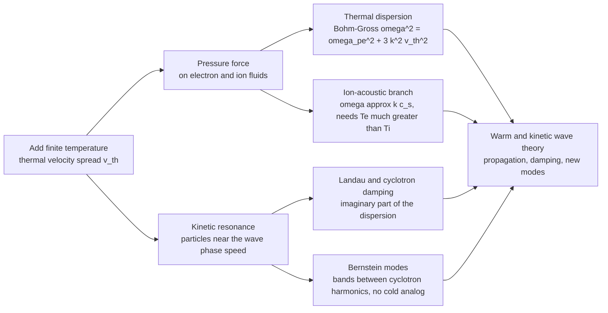

# 🌡️ Warm Plasma and Kinetic Waves

> [!abstract] TL;DR
> The **cold-plasma** picture pretends every electron drifts in lockstep, so a disturbance just oscillates in place at the plasma frequency $\omega_{pe}$ and goes nowhere. Switch on **finite temperature** — a real spread of thermal velocities — and two things happen. **Pressure** turns those standing oscillations into genuine traveling waves: the electron mode acquires the **Bohm–Gross dispersion** $\omega^2 = \omega_{pe}^2 + 3k^2 v_{th,e}^2$, and a brand-new low-frequency sound wave appears, the **ion-acoustic wave** $\omega \approx k c_s$ with $c_s=\sqrt{k_B T_e/m_i}$ (which survives only when $T_e \gg T_i$). **Kinetic resonance** does the rest: particles moving near the wave's phase speed quietly drain its energy (**Landau damping**, the imaginary part of the dispersion), and across a magnetic field entirely new modes appear — the **Bernstein modes**, electrostatic waves living in narrow bands between cyclotron harmonics with *no cold analog at all*. Temperature is not a small correction: it decides whether a mode **propagates, damps, or even exists**, and this warm/kinetic wave theory is exactly what underpins **RF heating, wave diagnostics, and instability thresholds**.

---

## Intuition

**Analogy.** The cold-plasma picture imagines the electrons as a **marching band** — every member steps at the identical speed, so a nudge from the front rank just ripples back and forth in place, a standing oscillation that never travels. But a real, warm plasma is not a marching band; it is a **swarm of bees**. Each particle buzzes around at its own thermal velocity, fast ones and slow ones mixed together in a spread. That thermal jitter changes *everything*.

Three consequences flow from the buzzing swarm. First, the random thermal motion is **pressure**, and pressure — like the springiness of air — lets a compression push its neighbors, so the in-place oscillation becomes a **traveling wave** that carries energy outward at roughly the thermal speed. Second, whenever a handful of bees happen to be flying at almost exactly the wave's own phase speed, they **surf** the wave and silently siphon its energy away — this is **Landau damping**, and no cold theory can see it. Third, wrap a magnetic field around the swarm and the bees spiral; the interplay of that gyration with their thermal spread **conjures whole new waves** — the **Bernstein modes** that ripple across the field lines in bands between cyclotron harmonics — that a cold plasma simply cannot support. Warmth is not a correction; it is a new world of physics.

---

## How It Works

### Core Mechanics

The engine behind every warm-plasma wave is the **linearized Vlasov–Maxwell system**: perturb the particle distribution $f(\mathbf{x},\mathbf{v},t)=f_0(\mathbf{v})+f_1$, feed the perturbed charge/current into Maxwell's equations, and demand self-consistency. The solvability condition is the **dispersion relation** $\epsilon(\mathbf{k},\omega)=0$ — but now $\epsilon$ is a *velocity integral* over $f_0$, which brings in the temperature.

1. **Add a thermal velocity spread.** Replace the cold delta-function $f_0(\mathbf v)=n_0\,\delta(\mathbf v)$ with a Maxwellian of width $v_{th}=\sqrt{k_B T/m}$. Now particles occupy a *band* of velocities, not a single one.
2. **Pressure enters the fluid moment.** Taking moments of Vlasov adds a pressure-gradient force $-\nabla p/nm$ to the electron momentum equation. Closing it with a 1-D adiabatic law ($\gamma=3$) gives the **Bohm–Gross** correction: the flat cold cutoff $\omega=\omega_{pe}$ lifts into a rising branch $\omega^2=\omega_{pe}^2+3k^2v_{th,e}^2$. The wave now has a non-zero **group velocity** $\sim 3v_{th,e}^2 k/\omega$ — it *propagates and carries energy*.
3. **A new low-frequency sound wave appears.** Let the electrons provide a springy, near-isothermal pressure while the massive ions carry the inertia. The result is the **ion-acoustic wave**, $\omega \approx k c_s$ with the ion-sound speed $c_s=\sqrt{k_B T_e/m_i}$ — sound in a gas where electrons are the "spring" and ions are the "mass."
4. **Kinetic resonance = damping.** The velocity integral in $\epsilon(\mathbf k,\omega)$ has a pole at $v=\omega/k$ (the phase velocity). Handling it correctly (Landau's contour, giving the **plasma dispersion function** $Z$) produces a complex $\omega$: the imaginary part is **Landau damping** if there are resonant particles, and **cyclotron damping** near $\omega=n\Omega_c$ in a magnetized plasma.
5. **Genuinely kinetic modes with no fluid analog.** Perpendicular to a magnetic field, the full kinetic integral over gyrating orbits yields the **Bernstein modes** — electrostatic waves that exist only in bands between successive cyclotron harmonics $n\Omega_c<\omega<(n{+}1)\Omega_c$. A fluid (cold or warm) cannot produce them.
6. **The correspondence limit.** When the phase velocity dwarfs the thermal speed, $v_\phi=\omega/k \gg v_{th}$, almost no particles are resonant: damping vanishes and the kinetic dispersion **collapses back to the fluid result**. Fluid and kinetic theories agree only in this $v_\phi\gg v_{th}$ regime; when $v_\phi \sim v_{th}$, only kinetics is trustworthy.

### Flow / Architecture



---

## Key Concepts

### Secondary Level

- **Cold plasma = marching band; warm plasma = swarm of bees.** In cold theory all electrons move together and a disturbance just oscillates in place. Real particles have a *spread* of speeds (temperature), and that changes what waves can do.
- **Temperature lets waves travel.** Thermal motion is pressure, and pressure pushes the disturbance along — the in-place plasma oscillation becomes a **traveling wave** carrying energy.
- **A new sound wave appears.** Warm plasmas support **ion-acoustic waves** — literally sound in a plasma, with electrons acting as the spring and heavy ions as the mass.
- **Some waves fade on their own.** Particles moving at the wave's speed can "surf" it and drain its energy (**Landau damping**) — a purely warm-plasma effect with no cold-plasma version.

### Undergraduate Level

**Bohm–Gross (electron plasma / Langmuir waves).** For high-frequency electrostatic oscillations of the electron fluid, the two-fluid momentum equation with an adiabatic pressure closure ($\gamma=3$ for 1-D compression) gives
$$\boxed{\;\omega^2 = \omega_{pe}^2 + 3\,k^2 v_{th,e}^2\;} = \omega_{pe}^2\left(1 + 3k^2\lambda_{De}^2\right),\qquad v_{th,e}=\sqrt{\tfrac{k_B T_e}{m_e}},\;\; \lambda_{De}=\tfrac{v_{th,e}}{\omega_{pe}}.$$
The cold limit ($T_e\to0$) is the flat, non-propagating oscillation $\omega=\omega_{pe}$ with zero group velocity; warmth tilts it into a dispersive branch with $v_g = d\omega/dk = 3v_{th,e}^2 k/\omega$.

**Ion-acoustic waves.** For low-frequency, long-wavelength motion with hot electrons ($T_e$) shielding cold ions ($T_i$), the dispersion is
$$\omega^2 = \frac{k^2 c_s^2}{1+k^2\lambda_{De}^2},\qquad c_s=\sqrt{\frac{k_B T_e}{m_i}}\;\;(\text{more fully }\sqrt{\tfrac{k_B(T_e+3T_i)}{m_i}}).$$
For $k\lambda_{De}\ll1$ this is the dispersionless sound wave $\omega\approx k c_s$; for $k\lambda_{De}\gg1$ it bends over to the ion plasma frequency $\omega\to\omega_{pi}$ (note $c_s=\omega_{pi}\lambda_{De}$). The wave **survives only when $T_e\gg T_i$**: otherwise the phase velocity $c_s$ sits inside the ion thermal distribution and **ion Landau damping** kills it.

**Landau damping — the imaginary part.** Solving Vlasov exactly gives a *complex* frequency. For Langmuir waves,
$$\gamma_L \sim -\sqrt{\tfrac{\pi}{8}}\,\frac{\omega_{pe}}{(k\lambda_{De})^3}\exp\!\left[-\frac{1}{2k^2\lambda_{De}^2}-\frac32\right],$$
exponentially weak when $v_\phi \gg v_{th}$ (few resonant particles) and severe when $v_\phi \sim v_{th}$. Damping is set by the *slope* of $f_0$ at the phase velocity.

### Graduate Level

- **The kinetic dispersion relation and $Z$.** Linearizing Vlasov–Poisson for a Maxwellian gives $\epsilon(k,\omega)=1+\sum_s \tfrac{1}{k^2\lambda_{Ds}^2}\big[1+\zeta_s Z(\zeta_s)\big]=0$, where $\zeta_s=\omega/(\sqrt2\,k\,v_{th,s})$ and $Z$ is the **plasma dispersion function** (a scaled complex error function, analytically continued below the real axis via the Landau contour). Its large-argument expansion $Z(\zeta)\approx -1/\zeta-1/2\zeta^3-\dots$ reproduces Bohm–Gross; the small-argument / resonant part supplies the damping.
- **Fluid–kinetic correspondence.** The real part of the kinetic dispersion reduces to Bohm–Gross (electrons) or the ion-acoustic relation (ions) precisely when $\zeta\gg1$, i.e. $v_\phi\gg v_{th}$. When $\zeta\lesssim1$ the fluid closure is *meaningless* and only the full $Z$-function dispersion is valid.
- **Bernstein modes.** Solving the *magnetized* kinetic dispersion for $\mathbf k \perp \mathbf B$ gives electrostatic **Bernstein waves**: $1+\frac{\omega_{p}^2}{k_\perp^2 v_{th}^2}\big[1-\dots\big]=0$ with an infinite sum of terms peaked at cyclotron harmonics. The branches occupy bands $n\Omega_c<\omega<(n{+}1)\Omega_c$, connect to the **upper-hybrid** frequency at small $k_\perp$, and asymptote *down* to the harmonics as $k_\perp\rho\to\infty$. They are **undamped, purely kinetic**, and have **no cold-plasma counterpart** — a pure product of finite Larmor radius plus a thermal spread. **Electron Bernstein waves (EBW)** are the workhorse for heating overdense spherical-tokamak and stellarator plasmas.
- **Cyclotron damping.** Off perpendicular propagation, resonances at $\omega - k_\parallel v_\parallel = n\Omega_c$ give **cyclotron damping** — the magnetized cousin of Landau damping and the mechanism behind ion- and electron-cyclotron RF heating.

---

## Python Demo

```python
# How warmth reshapes plasma waves.
# (a) BOHM-GROSS: the electron-plasma-wave dispersion omega^2 = omega_pe^2 + 3 k^2 v_th^2.
#     A flat COLD cutoff at omega_pe becomes a rising WARM branch that propagates & carries energy.
# (b) ION-ACOUSTIC: omega ~ k c_s with c_s = sqrt(kTe/mi); the sound branch bends to omega_pi.
#     Ion Landau damping (needs Te >> Ti) sketched via the phase-speed vs ion-thermal-speed ratio.
# (c) BERNSTEIN MODES: electrostatic bands living BETWEEN electron-cyclotron harmonics (no cold analog).
import numpy as np
import matplotlib.pyplot as plt

# ---------------------------------------------------------------
# (a) BOHM-GROSS  --  x = k * lambda_De (dimensionless), y = omega / omega_pe
#     omega^2 = omega_pe^2 (1 + 3 (k lambda_De)^2)
# ---------------------------------------------------------------
kL          = np.linspace(0.0, 1.0, 400)         # k * lambda_De
w_cold      = np.ones_like(kL)                    # cold: flat cutoff at omega_pe (no propagation)
w_warm      = np.sqrt(1.0 + 3.0 * kL**2)          # warm: Bohm-Gross rising branch
vg_warm     = 3.0 * kL / w_warm                   # group velocity d(omega)/d(k lambda_De) in omega_pe units

# ---------------------------------------------------------------
# (b) ION-ACOUSTIC  --  x = k * lambda_De, y = omega / omega_pi
#     since c_s = omega_pi * lambda_De:  sound branch  omega/omega_pi = k lambda_De
#     full branch  omega/omega_pi = k lambda_De / sqrt(1 + (k lambda_De)^2)  -> 1 as k grows
# ---------------------------------------------------------------
kL2         = np.linspace(0.0, 4.0, 400)
w_sound     = kL2                                  # non-dispersive sound line omega = k c_s
w_full      = kL2 / np.sqrt(1.0 + kL2**2)          # dispersive: bends over to ion plasma frequency

# Ion Landau damping condition: phase speed vs ion thermal speed.
# v_phi / v_th_i = c_s / v_th_i = sqrt(Te / Ti). Weak damping needs Te >> Ti.
Te_over_Ti  = np.array([1.0, 4.0, 25.0, 100.0])
vphi_ratio  = np.sqrt(Te_over_Ti)                  # = v_phi / v_th_i

# ---------------------------------------------------------------
# (c) BERNSTEIN-MODE band schematic  --  x = k_perp * rho_e, y = omega / Omega_ce
#     Electrostatic branches live in bands n < omega/Omega_ce < n+1, connect to upper hybrid
#     near k=0 and asymptote DOWN to the harmonics as k_perp*rho grows. No cold analog.
# ---------------------------------------------------------------
kr          = np.linspace(0.05, 6.0, 400)
w_UH        = 2.6                                  # illustrative upper-hybrid freq (omega_pe/Omega_ce set)
def bernstein_branch(n_low):
    # schematic branch inside band [n_low, n_low+1]: starts high, decays toward the lower harmonic
    top = min(n_low + 0.97, w_UH if n_low + 1 >= w_UH else n_low + 0.97)
    return (n_low + 1.0) - (n_low + 1.0 - (n_low + 0.03)) * (1.0 - np.exp(-1.1 * kr))

# ---------------------------------------------------------------
fig, ax = plt.subplots(1, 3, figsize=(16, 5))

# Panel (a): cold vs warm electron plasma wave
ax[0].plot(kL, w_cold, lw=2.5, color="tab:blue",  label="COLD  omega = omega_pe  (flat, no propagation)")
ax[0].plot(kL, w_warm, lw=2.5, color="tab:red",   label="WARM  Bohm-Gross  omega^2 = omega_pe^2 + 3k^2 v_th^2")
ax[0].fill_between(kL, w_cold, w_warm, color="tab:orange", alpha=0.15)
ax[0].plot(kL, vg_warm, lw=1.6, ls="--", color="tab:green", label="warm group velocity v_g / (omega_pe lambda_De)")
ax[0].axhline(1.0, ls=":", color="gray")
ax[0].set_xlabel("k  lambda_De   (dimensionless)")
ax[0].set_ylabel("omega / omega_pe")
ax[0].set_title("(a) Bohm-Gross: warmth lifts the flat\ncutoff into a propagating branch")
ax[0].set_ylim(0, 2.1); ax[0].legend(fontsize=7.5, loc="upper left"); ax[0].grid(alpha=0.3)

# Panel (b): ion-acoustic dispersion + Landau-damping condition
ax[1].plot(kL2, w_sound, lw=2.0, ls="--", color="gray",     label="sound line  omega = k c_s")
ax[1].plot(kL2, w_full,  lw=2.5,          color="tab:purple",label="ion-acoustic  (bends to omega_pi)")
ax[1].axhline(1.0, ls=":", color="tab:purple")
ax[1].text(2.6, 1.03, "omega -> omega_pi", color="tab:purple", fontsize=9)
ax[1].text(0.15, 3.0, "linear 'sound'\nregime  k lambda_De << 1", fontsize=8, color="dimgray")
# inset-style annotation of the damping condition
txt = "Ion Landau damping (weak if Te >> Ti):\n" + "\n".join(
    f"  Te/Ti = {r:5.0f}  ->  v_phi/v_th,i = {v:4.1f}" for r, v in zip(Te_over_Ti, vphi_ratio))
ax[1].text(0.9, 0.05, txt, fontsize=7.5, family="monospace",
           bbox=dict(boxstyle="round", fc="lightyellow", ec="orange"))
ax[1].set_xlabel("k  lambda_De   (dimensionless)")
ax[1].set_ylabel("omega / omega_pi")
ax[1].set_title("(b) Ion-acoustic wave:\nsound speed c_s = sqrt(kTe/mi)")
ax[1].set_ylim(0, 4.2); ax[1].legend(fontsize=8, loc="upper left"); ax[1].grid(alpha=0.3)

# Panel (c): Bernstein-mode band schematic
for n in range(1, 5):
    ax[2].axhspan(n, n + 1, color="tab:cyan", alpha=0.08)
    ax[2].axhline(n, ls="--", color="gray", lw=0.9)
    ax[2].text(6.05, n, f"{n} Omega_ce", va="center", fontsize=7.5, color="gray")
    ax[2].plot(kr, bernstein_branch(n), lw=2.0, color="tab:red")
ax[2].axhline(w_UH, ls="-.", color="tab:blue", lw=1.5)
ax[2].text(0.1, w_UH + 0.08, "upper hybrid omega_UH", color="tab:blue", fontsize=8)
ax[2].set_xlabel("k_perp  rho_e   (finite Larmor radius)")
ax[2].set_ylabel("omega / Omega_ce")
ax[2].set_title("(c) Bernstein modes: electrostatic bands\nbetween cyclotron harmonics (no cold analog)")
ax[2].set_xlim(0, 6); ax[2].set_ylim(0.5, 5.2); ax[2].grid(alpha=0.2)

plt.tight_layout()
plt.savefig("warm_plasma_waves.png", dpi=130)
plt.show()

# --- sanity checks (physical numbers for a lab plasma) ---
kB, e, me = 1.381e-23, 1.602e-19, 9.109e-31
mi        = 1.673e-27               # proton mass
Te_eV     = 10.0
cs        = np.sqrt(Te_eV * e / mi) # ion-sound speed, m/s
vthe      = np.sqrt(Te_eV * e / me) # electron thermal speed, m/s
print(f"Te = {Te_eV} eV  ->  c_s (ion sound) = {cs:.3e} m/s,   v_th,e = {vthe:.3e} m/s")
print(f"Bohm-Gross group velocity at k*lambda_De=0.3 :  v_g/(omega_pe*lambda_De) = {3*0.3/np.sqrt(1+3*0.3**2):.3f}")
print("Ion-acoustic needs Te >> Ti; at Te/Ti=1 the phase speed sits in the ion thermal bulk -> heavy Landau damping.")
```

**What you see.** Panel (a) is the heart of it: the **cold** electron plasma wave is a flat line at $\omega_{pe}$ — it oscillates but its group velocity is zero, so it goes nowhere. Turn on temperature and the **Bohm–Gross** branch rises with $k$; the dashed green curve is the newly non-zero group velocity, the physical statement that *the wave now carries energy at the thermal speed*. Panel (b) shows the **ion-acoustic** wave: a clean sound line $\omega=kc_s$ at long wavelength that bends over to the ion plasma frequency $\omega_{pi}$ as $k\lambda_{De}$ grows, with the yellow box tracking the **ion Landau damping** condition — the phase speed only escapes the ion thermal bulk when $T_e\gg T_i$. Panel (c) sketches the **Bernstein modes**: electrostatic branches trapped in bands between electron-cyclotron harmonics, connecting to the upper-hybrid frequency and piling up on the harmonics — waves that a cold plasma cannot produce at all.

---

## Real-World Applications

> **Example — RF heating of fusion plasmas (the flagship use).** Every warm/kinetic wave here is a heating channel in a tokamak or stellarator. **Ion-cyclotron resonance heating (ICRH, tens of MHz)** dumps power via *cyclotron damping* at $\omega=n\Omega_{ci}$; **electron-cyclotron resonance heating (ECRH, ~100+ GHz gyrotrons)** does the same for electrons. When a plasma is *overdense* (so ordinary EM waves are cut off at $\omega_{pe}$), operators launch **electron Bernstein waves (EBW)** — the purely kinetic mode from panel (c) — which have no density cutoff and deposit energy cleanly at cyclotron harmonics. Spherical tokamaks (MAST, NSTX) and stellarators (W7-X) rely on EBW precisely because it exists *only* in a warm, magnetized plasma.

- **Wave diagnostics.** **Incoherent (Thomson) scatter radar** reads the **ion-acoustic** and electron features in the scattered spectrum to measure $T_e$, $T_i$, density and drift in the ionosphere and in lab plasmas — the whole diagnostic *is* warm-plasma dispersion made visible.
- **Space plasmas.** Solar-wind and magnetospheric spacecraft routinely detect **ion-acoustic waves** and beam-driven **Langmuir (Bohm–Gross) waves**; type-III solar radio bursts are electron beams exciting Langmuir waves that mode-convert to radio emission.
- **Instability thresholds.** The **ion-acoustic instability** (current-driven, needs $T_e\gg T_i$ to escape ion Landau damping) and the **two-stream / bump-on-tail** instabilities are warm/kinetic phenomena that set anomalous-resistivity and turbulent-transport limits in reactors and space.

---

## Trade-offs

| Aspect | Pro (warm / kinetic theory) | Con |
|--------|-----|-----|
| Physical fidelity | Captures propagation, damping, and modes (Bernstein, ion-acoustic) that cold/fluid theory misses entirely | The full Vlasov + plasma-dispersion-function $Z$ treatment is analytically heavy and often numerical |
| Complexity | A single framework ($\epsilon(\mathbf k,\omega)=0$) unifies real dispersion *and* damping in one complex root | Requires velocity-space integrals, Landau contours, and Bessel sums over gyro-harmonics |
| Applicability | Essential wherever $v_\phi\sim v_{th}$: RF heating, diagnostics, instability onset | Overkill when $v_\phi\gg v_{th}$ — there the simpler cold/fluid dispersion already agrees |

---

## When to Use vs Avoid

**Use warm / kinetic wave theory when:**
- The phase velocity is comparable to the thermal velocity ($v_\phi \sim v_{th}$) — damping and resonant physics are then first-order, not corrections.
- You need **damping rates, growth rates, or instability thresholds** (Landau/cyclotron damping is invisible to fluid theory).
- You are dealing with **ion-acoustic waves, Bernstein modes, or RF heating** — modes that either require warmth to exist or to deposit energy.

**Avoid (use cold/fluid instead) when:**
- $v_\phi \gg v_{th}$ and you only need the *real* dispersion — the cold or two-fluid relation is simpler and already accurate.
- You care about **bulk, low-frequency MHD dynamics** (equilibrium, large-scale stability), where the fluid picture is the right rung of the ladder.
- A quick order-of-magnitude estimate of cutoffs/resonances suffices — cold-plasma dispersion gives those directly.

---

## Common Pitfalls

- **Confusing "cold" with "warm/kinetic."** Thermal terms add *both* **dispersion** (real: Bohm–Gross, ion-acoustic) **and** **damping** (imaginary: Landau/cyclotron). Keeping the real correction while dropping the imaginary part quietly deletes the damping physics.
- **Applying Bohm–Gross to the wrong species.** $\omega^2=\omega_{pe}^2+3k^2v_{th,e}^2$ is the *electron* plasma wave. The low-frequency ion mode is the **ion-acoustic** wave $\omega\approx kc_s$ — a different branch with different physics.
- **Forgetting $T_e\gg T_i$ for ion-acoustic waves.** If $T_e\sim T_i$, the phase speed $c_s$ lands inside the ion thermal distribution and **ion Landau damping** obliterates the wave. The "sound wave" is only weakly damped in the hot-electron, cold-ion regime.
- **Expecting a cold analog for Bernstein modes.** Bernstein modes are **kinetic, perpendicular, and inter-harmonic** ($n\Omega_c<\omega<(n{+}1)\Omega_c$); they simply *do not exist* in cold or fluid theory. Do not look for them in a cold dispersion relation.
- **Ignoring the $v_\phi$ vs $v_{th}$ ratio.** The *slope of $f_0$ at the phase velocity* sets the damping. A wave with $v_\phi\gg v_{th}$ (few resonant particles) is nearly undamped; $v_\phi\sim v_{th}$ means strong damping. This single ratio governs whether a mode survives.
- **Trusting fluid = kinetic everywhere.** The fluid dispersion agrees with the kinetic one **only when $v_\phi\gg v_{th}$**. Near resonance the fluid closure is not merely inaccurate — it is qualitatively wrong (it misses damping and can predict spurious modes).

---

## Related Concepts

- [[Debye_Shielding_and_Plasma_Parameters]] — supplies the building blocks $\lambda_{De}$, $\omega_{pe}$, and the identity $\lambda_{De}=v_{th,e}/\omega_{pe}$ that turns Bohm–Gross into $\omega^2=\omega_{pe}^2(1+3k^2\lambda_{De}^2)$.
- [[Kinetic_Theory_of_Gases]] — the Maxwell–Boltzmann velocity distribution and the notion of thermal speed / pressure that make a plasma "warm" in the first place.
- [[Waves_in_Fluids_and_Acoustics]] — ordinary sound waves, whose $\omega=kc_s$ structure the ion-acoustic wave directly mirrors (electrons as spring, ions as mass).
- [[Polarization_and_Dispersion]] — the general idea of a frequency-dependent dispersion relation $\omega(k)$ and phase-vs-group velocity that warm-plasma waves specialize.
- [[Complex_Numbers_and_Functions]] — the analytic-continuation and contour machinery behind the plasma dispersion function $Z$, whose imaginary part *is* Landau damping.

---

## Review Questions

**Secondary.** In plain words, what does adding temperature do to a plasma oscillation that a cold plasma cannot do? Give one entirely new wave that only a warm plasma supports.

**Undergraduate.** Write the Bohm–Gross dispersion relation and explain, using the group velocity, why the cold plasma wave "goes nowhere" while the warm one carries energy. For the ion-acoustic wave, why is $T_e\gg T_i$ required, and what happens to the wave when $T_e\approx T_i$? A plasma has $T_e=10$ eV and hydrogen ions — estimate $c_s$.

**Graduate.** Starting from the linearized Vlasov–Poisson system for a Maxwellian, sketch how the plasma dispersion function $Z(\zeta)$ yields *both* the Bohm–Gross real branch (large-$\zeta$ expansion) and Landau damping (the resonant pole). Then explain physically why **Bernstein modes** have no cold-plasma analog, where their band structure ($n\Omega_c<\omega<(n{+}1)\Omega_c$) comes from, and why electron Bernstein waves are used to heat *overdense* plasmas.

---

## Sources

- Stix, T. H. *Waves in Plasmas* (AIP Press, 1992) — the canonical reference for the warm/kinetic dielectric tensor, Bernstein modes, and RF-heating resonances.
- Chen, F. F. *Introduction to Plasma Physics and Controlled Fusion*, 3rd ed. (Springer, 2016) — accessible derivations of the Bohm–Gross relation and ion-acoustic waves (Ch. 4).
- Krall, N. A. & Trivelpiece, A. W. *Principles of Plasma Physics* (McGraw-Hill, 1973) — full kinetic dispersion, the plasma dispersion function $Z$, and Landau/cyclotron damping.
- Bernstein, I. B. "Waves in a Plasma in a Magnetic Field," *Phys. Rev.* **109**, 10 (1958) — the original derivation of the Bernstein modes.
- Nicholson, D. R. *Introduction to Plasma Theory* (Wiley, 1983) — clear linearized-Vlasov treatment bridging fluid and kinetic wave descriptions.

---

#plasma-physics #kinetic-waves #bohm-gross #ion-acoustic-waves #bernstein-modes
