# 🧲 Ideal MHD and Frozen-In Flux

> [!abstract] TL;DR
> In a **perfectly conducting** plasma the resistive term in Ohm's law vanishes, so $\vec{E}+\vec{v}\times\vec{B}=0$ and Faraday's law collapses to the **ideal induction equation** $\partial_t\vec{B}=\nabla\times(\vec{v}\times\vec{B})$ — pure advection, no diffusion. The consequence is **Alfvén's frozen-flux theorem**: the magnetic flux through any surface that moves with the fluid is **conserved**, so field lines are "frozen into" and carried by the plasma. Their **topology (connectivity) is preserved**, plasma slides freely *along* field lines but drags them *perpendicularly*, and stretching the fluid **amplifies** the field. The **magnetic Reynolds number** $R_m=vL/\eta$ decides when this holds — astronomically huge in stars and fusion devices (ideal), finite only in thin resistive layers where the idealization must break to allow reconnection.

## Intuition

**Analogy:** Imagine the magnetic field lines are **threads of colored dye frozen into a flowing fluid**. Wherever the fluid goes, the dye goes with it — stretching, twisting, and folding but never crossing or slipping between neighboring parcels. In a perfectly conducting plasma this is *literally* true: the magnetic field is **frozen** into the plasma, so the field lines and the matter move as one body. Stretch the plasma and you stretch the field like taffy; twist the plasma and you wind up the field like a spring you are coiling.

This single idea — **flux freezing** — is the master key to cosmic magnetism. It is why the Sun's field, anchored in a churning, rotating, convecting fluid, gets sheared and tangled into **sunspots** and arching **prominences**; and why, when a knot of that frozen field is flung outward, it carries its magnetism bodily across the solar system as a **coronal mass ejection**. The plasma cannot let go of its field, and the field cannot let go of its plasma.

---

## How It Works

### Core mechanics

**1. The ideal limit: perfect conductivity.** Ideal MHD is the single-fluid plasma model ([[Magnetohydrodynamics]]) taken in the limit of **infinite electrical conductivity**, i.e. resistivity $\eta\to 0$. The generalized Ohm's law for the plasma, keeping only the leading terms, is $\vec{E}+\vec{v}\times\vec{B}=\eta\vec{J}$. Setting $\eta\to 0$ gives the **ideal Ohm's law**:

$$\boxed{\;\vec{E}+\vec{v}\times\vec{B}=0\quad\Longleftrightarrow\quad \vec{E}=-\vec{v}\times\vec{B}\;}$$

Physically: a perfect conductor cannot support an electric field in its own rest frame — any field would drive an infinite current — so the fluid instantly short-circuits $\vec{E}'=\vec{E}+\vec{v}\times\vec{B}$ to zero.

**2. The ideal induction equation.** Substitute the ideal Ohm's law into Faraday's law $\partial_t\vec{B}=-\nabla\times\vec{E}$ ([[Faradays_Law_and_Induction]]):

$$\frac{\partial \vec{B}}{\partial t}=\nabla\times(\vec{v}\times\vec{B}).$$

Keeping finite resistivity instead adds a diffusion term (from $\nabla\times(\eta\vec{J})$ with $\mu_0\vec{J}=\nabla\times\vec{B}$):

$$\frac{\partial \vec{B}}{\partial t}=\underbrace{\nabla\times(\vec{v}\times\vec{B})}_{\text{advection + stretching}}+\underbrace{\eta\,\nabla^2\vec{B}}_{\text{resistive diffusion}}.$$

This is an **advection–diffusion equation** for $\vec{B}$ ([[Partial_Differential_Equations]]). With $\eta=0$ there is *no diffusion*: the field can only be carried and deformed by the flow, never allowed to slip.

**3. Alfvén's frozen-flux theorem.** Consider the magnetic flux $\Phi=\int_S \vec{B}\cdot d\vec{A}$ through a surface $S(t)$ that is **carried by the fluid** (its bounding loop moves with velocity $\vec{v}$). Differentiating and using the ideal induction equation together with $\nabla\cdot\vec{B}=0$ gives the celebrated result:

$$\frac{d\Phi}{dt}=0.$$

The flux through any co-moving loop is **constant in time**. Two frozen-in corollaries follow: (i) two fluid elements that lie on a common field line at one instant remain on a common field line forever — **field-line connectivity (topology) is preserved**; and (ii) plasma can flow **freely along** field lines but **drags them along perpendicularly**.

**4. Amplification by stretching — the dynamo seed.** Flux conservation with a *shrinking* cross-section means the field must *strengthen*. If a flux tube of length $\ell$ and cross-section $A$ is stretched to $2\ell$, incompressibility shrinks $A$ to $A/2$, and constant $\Phi=BA$ forces $B\to 2B$. **Stretching the plasma amplifies the field** — the basic engine of **dynamo action** that regenerates the magnetic fields of the Sun, the Earth's core, and galaxies.

**5. The magnetic Reynolds number.** Comparing the advection term $\sim vB/L$ to the diffusion term $\sim \eta B/L^2$ gives the dimensionless

$$R_m=\frac{vL}{\eta}=\frac{\text{advection}}{\text{diffusion}}.$$

$R_m\gg 1$ → **frozen-in / ideal**; $R_m\lesssim 1$ → **diffusive / resistive**. In stars ($R_m\sim 10^{8}\text{–}10^{12}$), the interstellar medium ($\sim 10^{18}$), and tokamaks ($\sim 10^{6}\text{–}10^{8}$), $R_m$ is astronomically large, so ideal MHD holds almost everywhere. Freezing breaks only in **thin current sheets**, where the gradient length $L$ collapses and the local $R_m$ falls to order unity — the doorway to magnetic reconnection.

**6. The field pushes back: magnetic pressure and tension.** The Lorentz force per volume $\vec{J}\times\vec{B}$ (with $\mu_0\vec{J}=\nabla\times\vec{B}$) splits into two intuitive pieces:

$$\vec{J}\times\vec{B}=\underbrace{-\nabla\!\left(\frac{B^2}{2\mu_0}\right)}_{\text{magnetic pressure}}+\underbrace{\frac{1}{\mu_0}(\vec{B}\cdot\nabla)\vec{B}}_{\text{magnetic tension}}.$$

**Magnetic pressure** $B^2/2\mu_0$ pushes perpendicular to the field, resisting compression of field lines; **magnetic tension** acts like *elastic bands* along the field lines, resisting bending and providing the restoring force of **Alfvén waves**. The ratio of thermal to magnetic pressure is the **plasma beta**:

$$\beta=\frac{p}{B^2/2\mu_0}.$$

**Low-$\beta$** plasmas (corona, tokamak core) are magnetically dominated — the field organizes the flow; **high-$\beta$** plasmas (stellar interiors, solar wind at large distances) are gas-dominated — the flow drags the field.

### Flow / architecture

```mermaid
graph LR
    A["Perfect conductivity<br/>resistivity eta to 0<br/>infinite conductivity"] --> B["Ideal Ohm's law<br/>E + v x B = 0<br/>resistive term eta J vanishes"]
    B --> C["Faraday's law<br/>dB/dt = minus curl E"]
    C --> D["Ideal induction equation<br/>dB/dt = curl of v x B<br/>pure advection, no diffusion"]
    D --> E["Alfven frozen-flux theorem<br/>flux through any co-moving loop<br/>is conserved, dPhi/dt = 0"]
    E --> F["Field lines frozen into and<br/>carried by the plasma;<br/>topology preserved"]
    F --> G["Plasma slides freely along B<br/>but drags B perpendicular;<br/>stretching amplifies the field"]
    G --> H["J x B reacts back on the flow<br/>magnetic pressure B^2 / 2mu0<br/>plus magnetic tension"]
    H --> I["Alfven waves, sunspots, CMEs,<br/>dynamo amplification, confinement"]
```



---

## Key Concepts

### Secondary Level

- In a plasma that conducts electricity perfectly, the **magnetic field is glued to the gas**: wherever the gas flows, it carries the field along, like dye frozen into a moving liquid.
- Because the field is glued in, **stretching the gas stretches and strengthens the field**, and **twisting the gas winds the field up** — this is how the Sun tangles its field into spots and loops.
- The field can slide **along** its own lines freely, but the gas cannot cross the lines without dragging them — the field and matter are locked together *sideways*.

### Undergraduate Level

- **Ideal Ohm's law** $\vec{E}=-\vec{v}\times\vec{B}$: a perfect conductor kills the electric field in its rest frame. Feeding this into [[Faradays_Law_and_Induction]] gives the **ideal induction equation** $\partial_t\vec{B}=\nabla\times(\vec{v}\times\vec{B})$.
- **Alfvén's theorem**: flux through any fluid-carried loop is conserved ($d\Phi/dt=0$). Field lines are **frozen in**; field-line **connectivity is preserved**.
- **Magnetic Reynolds number** $R_m=vL/\eta$ measures advection vs diffusion. $R_m\gg 1$ → frozen (ideal); $R_m\lesssim 1$ → diffusive (resistive). It is the magnetic analog of the ordinary Reynolds number that governs viscous flows.
- **Frozen-flux is the exact analog of Kelvin's circulation theorem** in an ideal fluid ([[Vorticity_and_Circulation]]): vorticity is to velocity as $\vec{B}$ is to $\vec{v}$ here, with $R_m$ playing the role of the Reynolds number.
- **Magnetic pressure** $B^2/2\mu_0$ (push perpendicular to $\vec{B}$) and **magnetic tension** (elastic pull along $\vec{B}$). **Plasma beta** $\beta=p/(B^2/2\mu_0)$: low-$\beta$ = field-dominated, high-$\beta$ = gas-dominated.

### Graduate Level

- **Derivation of $d\Phi/dt=0$**: for a co-moving surface, $\tfrac{d}{dt}\int_S\vec{B}\cdot d\vec{A}=\int_S\big(\partial_t\vec{B}-\nabla\times(\vec{v}\times\vec{B})\big)\cdot d\vec{A}$, which vanishes identically under the ideal induction equation. The two flux-transport terms (local $\partial_t\vec{B}$ and the motion of the boundary) cancel exactly.
- **Lundquist number** $S=v_A L/\eta$ (the magnetic Reynolds number built on the **Alfvén speed** $v_A=B/\sqrt{\mu_0\rho}$) governs resistive instabilities and sets the Sweet–Parker reconnection rate $\sim S^{-1/2}$.
- **Maxwell stress tensor**: $\vec{J}\times\vec{B}=\nabla\cdot\mathbf{T}$ with $T_{ij}=\frac{1}{\mu_0}\big(B_iB_j-\tfrac12 B^2\delta_{ij}\big)$ — a tension $B^2/\mu_0$ along the field plus an isotropic pressure $B^2/2\mu_0$. This makes explicit that field lines behave like stressed elastic strings under tension while pushing apart sideways.
- **Topology and helicity**: frozen-in flow conserves not just individual flux but the **magnetic helicity** $H=\int\vec{A}\cdot\vec{B}\,dV$ (the linkage/knottedness of field lines). Reconnection can change topology only by locally violating flux freezing while approximately conserving total helicity (Taylor relaxation).
- **Fluid limit of single-particle drifts**: the MHD currents and the frozen-in condition emerge from summing the charge-dependent grad-$B$ and curvature drifts of [[Single_Particle_Motion_and_Drifts]]; the $\vec{E}\times\vec{B}$ drift $\vec{v}_E=\vec{E}\times\vec{B}/B^2$ *is* the perpendicular fluid velocity that satisfies $\vec{E}=-\vec{v}\times\vec{B}$.

---

## Python Demo

```python
# Flux freezing vs resistive diffusion in the INDUCTION EQUATION
#   dB/dt = curl(v x B) + eta * laplacian(B)
# For a stagnation-point flow v = (-a x, +a y) and a field B = B_y(x) y_hat,
# the induction equation reduces EXACTLY to a 1D advection-amplification-diffusion PDE:
#   dB/dt = a*x*dB/dx  +  a*B  +  eta*d2B/dx2
#           (advection)   (stretching)  (resistive diffusion)
# High magnetic Reynolds number Rm = a L^2 / eta  ->  field is FROZEN:
#   the converging flow advects it toward x=0 and the diverging flow STRETCHES /
#   amplifies it (flux piles up).  Low Rm  ->  the field DIFFUSES and slips
#   through the fluid (the precursor of reconnection).
import numpy as np
import matplotlib.pyplot as plt

a, L, N = 1.0, 1.0, 161
x  = np.linspace(-L, L, N)
dx = x[1] - x[0]
vx = -a * x                      # converging flow: inward from both sides

def evolve(eta, T, dt):
    B = np.exp(-((x - 0.4) / 0.08)**2)          # initial magnetized blob
    nsteps = int(T / dt)
    snap_steps = [int(f * nsteps) for f in (0.0, 0.25, 0.5, 0.75, 1.0)]
    snaps, times, peaks = [], [], []
    for n in range(nsteps + 1):
        if n in snap_steps:
            snaps.append(B.copy())
        times.append(n * dt); peaks.append(B.max())
        # upwind advection of -vx * dB/dx  (choose the neighbour the flow comes from)
        fwd = np.zeros_like(B); bwd = np.zeros_like(B)
        fwd[:-1] = (B[1:] - B[:-1]) / dx
        bwd[1:]  = (B[1:] - B[:-1]) / dx
        dBdx = np.where(vx > 0, bwd, fwd)
        diff = np.zeros_like(B)
        diff[1:-1] = eta * (B[2:] - 2*B[1:-1] + B[:-2]) / dx**2
        B = B + dt * (-vx * dBdx + a * B + diff)
        B[0] = 0.0; B[-1] = 0.0                  # field-free fluid flows in at edges
    return snaps, np.array(times), np.array(peaks)

dt, T = 2e-5, 1.0
eta_ideal, eta_resist = 1e-3, 1.0
Rm_ideal, Rm_resist = a * L**2 / eta_ideal, a * L**2 / eta_resist
print(f"ideal     : eta = {eta_ideal:.0e}  ->  Rm = {Rm_ideal:.0f}")
print(f"resistive : eta = {eta_resist:.0e}  ->  Rm = {Rm_resist:.0f}")

s_i, t_i, p_i = evolve(eta_ideal,  T, dt)
s_r, t_r, p_r = evolve(eta_resist, T, dt)
print(f"peak |B| amplification  ideal     = {p_i[-1]/p_i[0]:.2f} x  (frozen: advected & stretched)")
print(f"peak |B| amplification  resistive = {p_r[-1]/p_r[0]:.2f} x  (diffused: field slips)")

# ----- plots -----
fig, ax = plt.subplots(2, 2, figsize=(12, 9))
fracs = [0.0, 0.25, 0.5, 0.75, 1.0]
cmap  = plt.cm.viridis

for k, B in enumerate(s_i):
    ax[0, 0].plot(x, B, color=cmap(k / 4), label=f"t={fracs[k]*T:.2f}")
ax[0, 0].set_title(f"(a) Ideal / high Rm={Rm_ideal:.0f}: frozen field advected & stretched")
ax[0, 0].set_xlabel("x"); ax[0, 0].set_ylabel("B_y"); ax[0, 0].legend(fontsize=8)

for k, B in enumerate(s_r):
    ax[0, 1].plot(x, B, color=cmap(k / 4), label=f"t={fracs[k]*T:.2f}")
ax[0, 1].set_title(f"(b) Resistive / low Rm={Rm_resist:.0f}: field diffuses & slips")
ax[0, 1].set_xlabel("x"); ax[0, 1].set_ylabel("B_y"); ax[0, 1].legend(fontsize=8)

ax[1, 0].plot(t_i, p_i, label=f"ideal  (Rm={Rm_ideal:.0f})")
ax[1, 0].plot(t_r, p_r, label=f"resistive  (Rm={Rm_resist:.0f})")
ax[1, 0].set_title("(c) Peak |B_y|: frozen flux amplifies vs resistive spreading")
ax[1, 0].set_xlabel("time"); ax[1, 0].set_ylabel("max B_y"); ax[1, 0].legend()

systems = ["Liquid-metal\nlab", "Earth's\ncore", "Tokamak\nplasma",
           "Solar\ncorona", "Interstellar\nmedium"]
Rm_vals = [1e1, 1e3, 1e7, 1e10, 1e18]
ypos = np.arange(len(systems))
ax[1, 1].barh(ypos, Rm_vals, color="steelblue")
ax[1, 1].set_xscale("log")
ax[1, 1].axvline(1.0, color="red", ls="--")
ax[1, 1].text(2.0, 3.9, "Rm=1: frozen above,\ndiffusive below", color="red", fontsize=8)
ax[1, 1].set_yticks(ypos); ax[1, 1].set_yticklabels(systems, fontsize=8)
ax[1, 1].set_xlabel("magnetic Reynolds number  Rm = vL / eta")
ax[1, 1].set_title("(d) Rm across regimes: astrophysical plasmas are deeply ideal")

plt.tight_layout()
plt.savefig("ideal_mhd_flux_freezing.png", dpi=130)
plt.show()
```

Running it prints two very different magnetic Reynolds numbers ($R_m\approx 1000$ vs $R_m=1$) and shows the physics directly: in the **ideal** run the frozen field is **advected toward the stagnation point and stretched into a tall, narrow sheet** (peak amplified several-fold — flux piling up), while in the **resistive** run the same flow cannot concentrate the field because **diffusion lets the lines slip**, leaving a low, broad, decaying profile. Panel (d) places real systems on the $R_m$ axis, making plain why stars, the ISM, and tokamaks live deep in the ideal, frozen-in regime while liquid-metal experiments sit near the resistive boundary.

---

## Real-World Applications

- **The solar magnetic field, sunspots, and prominences.** The Sun's plasma is an almost perfect conductor, so its field is frozen into the differentially rotating, convecting fluid. Rotation **shears** the field (the $\Omega$-effect), convection twists it, and buoyant frozen-flux tubes rise through the surface to form bipolar **sunspots** and arching **prominences** ([[The_Sun]]). None of this structure could form if the field could simply diffuse through the gas.
- **Coronal mass ejections and the solar wind.** When the coronal field destabilizes, a magnetized plasmoid is ejected carrying its **frozen-in field** bodily outward; the expanding **solar wind** drags the heliospheric field into the Parker spiral because the field remains locked to the radially streaming plasma out to hundreds of AU.
- **Planetary magnetospheres.** The solar wind's frozen field cannot instantly merge with Earth's field, so it **piles up and drapes** around the magnetosphere, forming the bow shock and magnetopause — a direct manifestation of two frozen-in plasmas refusing to mix (until localized reconnection at the nose lets them).
- **Fusion confinement.** In a tokamak the frozen-in condition ties the hot core plasma to nested magnetic flux surfaces; **flux conservation** during current ramp-up and the ideal-MHD force balance $\vec{J}\times\vec{B}=\nabla p$ are what hold the plasma off the wall. Ideal-MHD stability (kink, ballooning limits) sets the achievable plasma pressure.
- **Dynamos and laboratory flux experiments.** Stretch-and-fold of a frozen field amplifies it — the mechanism behind the geodynamo and stellar/galactic dynamos. Liquid-sodium experiments (Riga, Karlsruhe, VKS) deliberately push $R_m$ above the threshold where a seed field is self-amplified rather than diffusing away.

---

## Common Pitfalls

- **"Ideal MHD means the plasma has no dynamics."** Ideal means *dissipationless* (infinite conductivity, $\eta\to 0$), **not** static. The plasma flows, waves, and can be violently unstable — it simply cannot let the field diffuse or change topology. Ideal $=$ flux frozen (Alfvén's theorem), full stop.
- **Forgetting that $R_m$ decides which regime you are in.** The *same* plasma can be ideal on large scales (huge $L$, huge $R_m$) yet resistive inside a thin current sheet (tiny $L$, order-unity local $R_m$). Freezing is a statement about the ratio $vL/\eta$, not an intrinsic property of the material.
- **Treating frozen-in as exact and eternal.** Flux freezing is an **idealization** that *must* break somewhere, or the Sun could never flare and the magnetosphere could never load and unload. **Magnetic reconnection** is precisely the localized, resistive violation of frozen-in that changes field-line connectivity — impossible in strictly ideal MHD.
- **Confusing magnetic pressure with tension.** $B^2/2\mu_0$ is an isotropic-*perpendicular* **pressure** that resists compressing field lines; the $(\vec{B}\cdot\nabla)\vec{B}/\mu_0$ term is a **tension** along the lines that resists *bending* and restores Alfvén waves. They are different components of the Maxwell stress and act in different directions.
- **Ignoring plasma beta.** Whether the field commands the flow (low $\beta$) or the flow commands the field (high $\beta$) flips the intuition entirely. Applying "the field organizes everything" to a high-$\beta$ stellar interior, or "the gas drags the field" to a low-$\beta$ corona, gives wrong answers.
- **Overlooking topology conservation.** Frozen-in flow conserves field-line **connectivity and helicity**, not just field strength. This is the deep constraint that makes reconnection *the* topology-breaking exception, and why 3D field evolution is far more constrained than the induction equation alone suggests.

---

## Related Concepts

- [[Magnetohydrodynamics]] — the single-fluid MHD equations; ideal MHD is their $\eta\to 0$ limit.
- [[Magnetohydrodynamics_and_Plasma_Flows]] — the fluid-dynamics view of the induction equation and MHD forces.
- [[Faradays_Law_and_Induction]] — $\partial_t\vec{B}=-\nabla\times\vec{E}$, which with the ideal Ohm's law yields the induction equation.
- [[Maxwells_Equations]] — the electromagnetic framework; MHD uses the low-frequency (pre-displacement-current) Ampère law $\mu_0\vec{J}=\nabla\times\vec{B}$.
- [[Vorticity_and_Circulation]] — Kelvin's circulation theorem is the exact ideal-fluid analog of Alfvén's frozen-flux theorem.
- [[Euler_Equations_and_Ideal_Fluids]] — ideal MHD adds the $\vec{J}\times\vec{B}$ force (pressure + tension) to the inviscid momentum equation.
- [[Vector_Calculus_and_Differential_Operators]] — the curl/divergence identities behind $\nabla\times(\vec{v}\times\vec{B})$ and the pressure–tension split.
- [[Partial_Differential_Equations]] — the induction equation is a canonical advection–diffusion PDE.
- [[Single_Particle_Motion_and_Drifts]] — the microscopic $\vec{E}\times\vec{B}$, grad-$B$, and curvature drifts whose fluid sum gives the frozen-in condition and MHD currents.
- [[Plasma_Physics_Overview]] — where ideal MHD sits in the hierarchy of plasma models.
- [[Collisions_and_Transport_in_Plasmas]] — collisions set the resistivity $\eta$, hence $R_m$ and where freezing breaks.
- [[The_Sun]] — frozen field building sunspots and prominences and driving coronal mass ejections.

*Foundational siblings in this section (build order): The_Two_Fluid_and_MHD_Models derives the single-fluid equations this note idealizes; MHD_Equilibrium_and_the_Grad_Shafranov_Equation applies the ideal force balance $\vec{J}\times\vec{B}=\nabla p$; MHD_Waves_and_Alfven_Waves shows how magnetic tension gives the plasma its restoring "guitar-string" oscillations; Magnetic_Reconnection is the resistive exception where frozen-in flux is deliberately broken; Astrophysical_Plasmas_and_Dynamos develops flux amplification into full dynamo theory.*

---

## Review Questions

1. **(Secondary)** In your own words, what does it mean to say the magnetic field is "frozen into" a plasma? Give one everyday analogy and one thing the Sun does that this idea explains.
2. **(Undergraduate)** Starting from the ideal Ohm's law $\vec{E}+\vec{v}\times\vec{B}=0$ and Faraday's law, derive the ideal induction equation. Which term disappears compared with the resistive case, and what physical process does that missing term represent?
3. **(Undergraduate)** A flux tube of length $\ell$, cross-section $A$, and field $B$ is stretched by an incompressible flow to twice its length. What happens to $A$ and to $B$? Explain how this "stretching amplification" underlies dynamo action.
4. **(Undergraduate/Graduate)** Estimate the magnetic Reynolds number for (a) the solar corona and (b) a liquid-metal laboratory experiment, and state which is in the frozen-in regime. Why can the *same* solar plasma be ideal on global scales yet resistive inside a coronal current sheet?
5. **(Graduate)** Decompose $\vec{J}\times\vec{B}$ into magnetic pressure and tension using the Maxwell stress tensor. Explain physically how each term acts, how their competition sets the plasma beta, and why the tension term is the restoring force of Alfvén waves. Then explain why strict ideal MHD *forbids* reconnection and what must change locally to permit it.

---

## Sources

- Alfvén, H. — "Existence of Electromagnetic–Hydrodynamic Waves," *Nature* **150**, 405 (1942) — the original frozen-flux / Alfvén-wave paper.
- Freidberg, J. P. — *Ideal Magnetohydrodynamics* (Plenum, 1987; reissued *Ideal MHD*, Cambridge University Press, 2014), Ch. 2–3 (ideal Ohm's law, frozen flux, force balance).
- Priest, E. R. — *Magnetohydrodynamics of the Sun* (Cambridge University Press, 2014), Ch. 2 (induction equation, magnetic Reynolds number, flux freezing).
- Chen, F. F. — *Introduction to Plasma Physics and Controlled Fusion* (3rd ed., Springer, 2016), Ch. 3–4 (single-fluid MHD, magnetic pressure and tension).
- Davidson, P. A. — *An Introduction to Magnetohydrodynamics* (2nd ed., Cambridge University Press, 2017), Ch. 4–5 (Alfvén's theorem, magnetic Reynolds number, dynamo stretching).

---

#plasma-physics #ideal-mhd #flux-freezing #alfven-theorem #magnetic-reynolds-number
