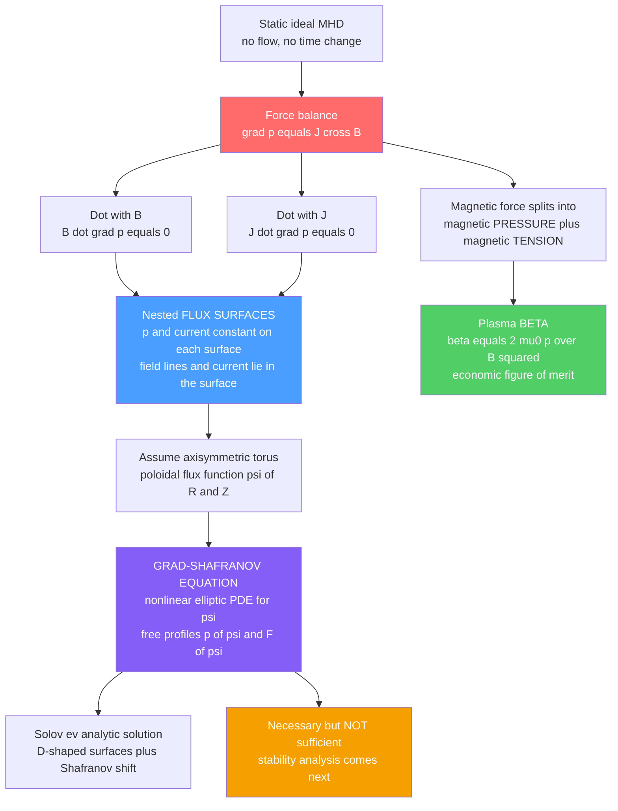

# 🧲 MHD Equilibrium and the Grad-Shafranov Equation

> [!abstract] TL;DR
> A magnetically confined plasma sits in **static force balance** when its outward pressure gradient is exactly cancelled by the magnetic force: $\nabla p = \mathbf J\times\mathbf B$. Two consequences follow immediately — $\mathbf B\cdot\nabla p = 0$ and $\mathbf J\cdot\nabla p = 0$ — so both pressure and current are **constant on nested magnetic flux surfaces**: the plasma organizes itself into a set of tori-within-tori, field lines and current lines lying inside surfaces of constant pressure. The economic figure of merit for how much plasma a given field can hold is the **plasma beta** $\beta = 2\mu_0 p/B^2$. For an *axisymmetric* toroidal device (a tokamak) this whole picture collapses into one master equation for the poloidal flux function $\psi(R,Z)$ — the **Grad-Shafranov equation**, a nonlinear elliptic PDE with two free profile functions $p(\psi)$ and $F(\psi)$. Its solutions give the D-shaped nested surfaces of a real tokamak, complete with the outward **Shafranov shift** of the inner surfaces. Crucially, equilibrium is *necessary but not sufficient*: a plasma can be in perfect force balance and still be violently unstable — stability is the next question, not this one.

## Intuition — analogy FIRST

To hold a blob of gas ten times hotter than the Sun's core without any material wall ever touching it, you must balance it perfectly on **invisible magnetic scaffolding**. Picture balancing a water balloon on a web of stretched elastic bands: at every single point on its surface the outward push of the hot water has to be met by an equal inward squeeze of the bands. Get the balance right and the balloon sits perfectly still, cradled in the web. Get it slightly wrong — a little too much push here, a little too little tension there — and it sags, bulges through a gap, and escapes.

**MHD equilibrium is the blueprint for that magnetic cage.** The hot plasma is the water balloon; the magnetic field is the web of elastic bands, which can both *push* (magnetic pressure) and *pull along their length* (magnetic tension, like a stretched rubber band trying to shorten). The requirement that push balances squeeze *everywhere at once* is the single vector equation $\nabla p = \mathbf J\times\mathbf B$. And when the cage is a doughnut with a symmetry axis — a tokamak — the entire blueprint reduces to one scalar equation for the shape of the surfaces, the **Grad-Shafranov equation**. Solve it and you have drawn the cage.

---

## How It Works

### Core mechanics

Start from ideal single-fluid MHD (see sibling note *The_Two_Fluid_and_MHD_Models*) and set every time derivative and flow to zero — a *static* equilibrium. The momentum equation collapses to a pure force balance:

1. **The equilibrium condition.** The plasma pressure gradient is held up by the magnetic force per unit volume, $\mathbf J\times\mathbf B$:
   $$\nabla p = \mathbf J\times\mathbf B .$$
   This is the magnetostatic analogue of hydrostatic balance $\nabla p = \rho\mathbf g$ (see [[Fluid_Statics_and_Buoyancy]]): the Lorentz force plays the role of "gravity" holding the pressure up.
2. **Pressure and current live on flux surfaces.** Dot the balance with $\mathbf B$ and then with $\mathbf J$. Because $\mathbf B\cdot(\mathbf J\times\mathbf B)=0$ and $\mathbf J\cdot(\mathbf J\times\mathbf B)=0$, we get
   $$\mathbf B\cdot\nabla p = 0, \qquad \mathbf J\cdot\nabla p = 0 .$$
   Field lines and current lines **never cross contours of pressure** — they wind around inside them. Surfaces of constant $p$ are therefore also surfaces containing $\mathbf B$ and $\mathbf J$: the **magnetic flux surfaces**. In a confined plasma these are a set of **nested** tori collapsing onto a central closed field line, the *magnetic axis*.
3. **Pressure fights magnetic pressure and tension.** Decompose the magnetic force using Ampère's law (see [[Magnetism_and_Biot_Savart]]):
   $$\mathbf J\times\mathbf B = \underbrace{-\nabla\!\left(\frac{B^2}{2\mu_0}\right)}_{\text{magnetic pressure}} + \underbrace{\frac{(\mathbf B\cdot\nabla)\mathbf B}{\mu_0}}_{\text{magnetic tension}} .$$
   The field acts like a fluid with pressure $B^2/2\mu_0$ that also resists bending along its length. Balance is a contest between plasma pressure on one side and magnetic pressure plus tension on the other.
4. **Plasma beta — the figure of merit.** The ratio of the two competing pressures is
   $$\beta = \frac{p}{B^2/2\mu_0} = \frac{2\mu_0 p}{B^2} .$$
   High $\beta$ means *more plasma held per unit magnetic field* — cheaper, more powerful fusion. Real tokamaks run at a few percent; the ceiling is set not by equilibrium but by the *instabilities* that appear as $\beta$ rises.
5. **Axisymmetry $\to$ the Grad-Shafranov equation.** In a toroidally symmetric device the poloidal field derives from a single scalar **poloidal flux function** $\psi(R,Z)$, and force balance becomes one nonlinear elliptic PDE (derived below) with two *free* profile functions $p(\psi)$ and $F(\psi)$ that the engineer chooses. Its solutions are the nested D-shaped surfaces of a tokamak, with the inner ones pushed **outward** — the Shafranov shift.

### Flow / architecture



---

## Key Concepts / Details

### Secondary Level

**Balancing push against squeeze.** A hot gas wants to expand — that outward push is the *pressure gradient*. To stop it without a wall, you surround it with magnetic field, which behaves like a set of stretched elastic bands. The bands both **push inward** (magnetic pressure) and **pull taut around the plasma** (magnetic tension). Equilibrium is when the outward push of the gas exactly equals the combined inward push-and-pull of the field, at every point.

**Field lines lie *along* the surfaces, never through them.** A remarkable consequence: the magnetic field lines and the electric current wind *around inside* surfaces of constant pressure — they never poke through them. The plasma naturally arranges itself into **nested shells**, like the layers of an onion (but doughnut-shaped), each shell at its own pressure, hottest and densest at the core.

**Beta = how much bang for your magnetic buck.** Building strong magnetic fields is expensive. *Plasma beta* measures how much plasma pressure you get for a given field: a bigger beta means a more economical machine. The whole game of fusion engineering is pushing beta as high as you can before the plasma becomes unstable and wriggles free.

### Undergraduate Level

**The screw pinch — 1D equilibrium you can solve by hand.** Model the plasma as an infinite cylinder with an axial field $B_z(r)$ and an azimuthal (poloidal) field $B_\theta(r)$ produced by an axial current. Radial force balance $\nabla p = \mathbf J\times\mathbf B$ reduces to a single ODE:
$$\frac{d}{dr}\!\left(p + \frac{B_\theta^2 + B_z^2}{2\mu_0}\right) = -\frac{B_\theta^2}{\mu_0 r}.$$
The left side is the gradient of *total* (plasma + magnetic) pressure; the right side is the inward pull of **magnetic tension** from the curved $B_\theta$ lines (the "hoop" term). Special cases:

- **$\theta$-pinch** ($B_\theta=0$, only $B_z$): total pressure is constant, $p + B_z^2/2\mu_0 = \text{const}$ — pure pressure balance, no tension. The plasma simply *dents* the axial field (it is diamagnetic; see [[Single_Particle_Motion_and_Drifts]]).
- **Z-pinch** ($B_z=0$, only $B_\theta$): a pure current column confined by its own azimuthal field and its tension. Simple, but notoriously unstable (sausage and kink modes).
- **Screw pinch** (both): the general cylindrical equilibrium and the natural model of a tokamak's local physics.

**Plasma beta, three flavours.** Referencing the pressure against different fields gives:
$$\beta_t = \frac{2\mu_0\langle p\rangle}{B_t^2}\ (\text{toroidal}),\qquad \beta_p = \frac{2\mu_0\langle p\rangle}{B_\theta^2}\ (\text{poloidal}),\qquad \frac{1}{\beta} = \frac{1}{\beta_t}+\frac{1}{\beta_p}.$$
Engineers quote the normalized **Troyon beta** $\beta_N = \beta_t\,[\%]\,aB_t/I_p$, whose empirical stability limit sits around $\beta_N\approx 3\text{–}4$.

**The safety factor $q$.** How tightly a field line winds is measured by the safety factor — the number of times it goes *the long way around* (toroidally) per single trip *the short way around* (poloidally):
$$q \approx \frac{r B_t}{R_0 B_\theta}.$$
It is *the* control knob for stability: rational values $q=m/n$ (e.g. $q=1,2,3/2$) are where dangerous modes resonate. $q$ enters equilibrium through the poloidal field it implies, and dominates the stability analysis that follows.

### Graduate Level

**Deriving the Grad-Shafranov equation.** Impose axisymmetry ($\partial/\partial\phi = 0$) in cylindrical coordinates $(R,\phi,Z)$. Because $\nabla\!\cdot\mathbf B=0$, the poloidal field is written through a stream (flux) function $\psi$, and the toroidal field through a poloidal-current function $F(\psi)=R B_\phi$:
$$\mathbf B = \frac{1}{R}\,\nabla\psi\times\hat{\boldsymbol\phi} \;+\; \frac{F(\psi)}{R}\,\hat{\boldsymbol\phi}.$$
Here $\psi = $ poloidal flux $/2\pi$, and $\mathbf B\cdot\nabla\psi = 0$ makes $\psi=\text{const}$ surfaces the flux surfaces automatically. Ampère's law gives $\mathbf J$, and $\mathbf B\cdot\nabla p=0$ forces $p=p(\psi)$ and $F=F(\psi)$ — both **functions of $\psi$ alone**. Substituting into $\nabla p=\mathbf J\times\mathbf B$ and projecting yields the **Grad-Shafranov equation**:
$$\boxed{\;\Delta^\ast\psi \equiv R^2\,\nabla\!\cdot\!\left(\frac{\nabla\psi}{R^2}\right) = R\frac{\partial}{\partial R}\!\left(\frac{1}{R}\frac{\partial\psi}{\partial R}\right)+\frac{\partial^2\psi}{\partial Z^2} = -\mu_0 R^2\,\frac{dp}{d\psi} - F\frac{dF}{d\psi}\;}$$
It is a **nonlinear, elliptic** PDE (a boundary-value problem — see [[Introduction_to_PDEs]]): elliptic like Poisson's equation, but with a right-hand side that depends on the unknown $\psi$ through the two freely chosen profiles $p(\psi)$ and $F(\psi)$. The operator $\Delta^\ast$ is the axisymmetric "Grad-Shafranov operator," a cousin of the Laplacian modified by toroidal geometry.

**Solov'ev solutions.** Choosing the *source* terms to be linear in $\psi$ — i.e. $\mu_0\,dp/d\psi=\text{const}$ and $F\,dF/d\psi=\text{const}$ — makes the right-hand side of the form $c_1 R^2 + c_2$, and the Grad-Shafranov equation becomes *linear* with polynomial solutions. These are the **Solov'ev equilibria**: a particular solution $\tfrac{c_1}{8}R^4 + \tfrac{c_2}{2}Z^2$ plus homogeneous polynomials ($1,\ R^2,\ R^4-4R^2Z^2,\dots$) fitted to a desired boundary shape. They are the workhorse analytic benchmark for equilibrium codes and reproduce the essential physics with pen and paper.

**The Shafranov shift.** Toroidicity breaks the inboard-outboard symmetry: the tension in the poloidal field and the outward "tire-tube" force of the plasma pressure and toroidal field together push the inner flux surfaces **outward** (to larger $R$) relative to the plasma boundary. The magnetic axis therefore sits at $R_{\text{axis}} > R_0$. For a large-aspect-ratio circular plasma the shift of a surface of minor radius $r$ obeys a Shafranov-shift equation, with the axis displacement scaling as
$$\frac{\Delta_{\text{axis}}}{a} \sim \frac{a}{R_0}\left(\beta_p + \frac{\ell_i}{2}\right),$$
where $\ell_i$ is the internal inductance (a measure of current peaking). Higher pressure or more peaked current $\Rightarrow$ larger shift $\Rightarrow$ flux surfaces bunched on the outboard side. The Python demo below exhibits exactly this.

**Confinement geometries compared.**
- **Tokamak** — axisymmetric; equilibrium is a Grad-Shafranov solution; needs an externally driven toroidal plasma *current* to make the poloidal field. Elegant but the current is a stability liability (disruptions).
- **Stellarator** — deliberately *non*-axisymmetric; the rotational transform is supplied entirely by 3D external coils, so there is no Grad-Shafranov equation — equilibria are genuinely 3D (VMEC-class codes) and current-free, sidestepping current-driven instabilities.
- **Screw/Z/$\theta$-pinch** — the 1D cylindrical idealizations, exactly solvable, that build intuition before the toroidal geometry is switched on.

---

## Python Demo

```python
# MHD equilibrium in two acts — the balance of pressure against magnetic force:
#   (a) SCREW PINCH (1D cylindrical): prescribe the fields B_theta(r), B_z(r) from a
#       current profile, then INTEGRATE the radial pressure balance
#           d/dr( p + (B_theta^2 + B_z^2)/2mu0 ) = -B_theta^2/(mu0 r)
#       to recover p(r). Plot pressure, fields, and total (plasma+magnetic) pressure,
#       verify the balance residual ~ 0, and compute the plasma BETA.
#   (b) FLUX SURFACES (2D Solov'ev Grad-Shafranov solution): solve the LINEAR
#       Grad-Shafranov equation for a chosen boundary and plot the nested D-shaped
#       flux surfaces psi(R,Z), locating the magnetic axis and the SHAFRANOV SHIFT.
# numpy + matplotlib only.
import numpy as np
import matplotlib.pyplot as plt

mu0 = 4.0e-7 * np.pi

# =====================================================================
# (a) SCREW PINCH — 1D radial pressure balance
# =====================================================================
a   = 0.20                      # plasma minor radius [m]
B0  = 1.0                       # axial (toroidal-like) field B_z [T], taken uniform
J0  = 5.1e6                     # peak axial current density [A/m^2]
N   = 2000
r   = np.linspace(1e-4, a, N)   # avoid r = 0

# Current profile J_z(r) = J0 (1 - (r/a)^2)  ->  peaked on axis, zero at edge.
# Poloidal field from Ampere: B_theta(r) = (mu0/r) * integral_0^r J_z r' dr'
Bth = mu0 * J0 * (r/2.0 - r**3 / (4.0*a**2))     # closed form of that integral
Bz  = B0 * np.ones_like(r)                        # uniform axial field (theta-pinch part)

# Radial pressure balance:  dp/dr = -(B_theta/(mu0 r)) d(r B_theta)/dr - (B_z/mu0) dB_z/dr
rBth   = r * Bth
d_rBth = np.gradient(rBth, r)
dpdr   = -(Bth/(mu0*r)) * d_rBth - (Bz/mu0) * np.gradient(Bz, r)

# Integrate inward with edge condition p(a) = 0  ->  p(r) = integral_a^r dp/dr dr'
cum  = np.concatenate(([0.0], np.cumsum(0.5*(dpdr[1:]+dpdr[:-1])*np.diff(r))))
p    = cum - cum[-1]            # shift so p(a) = 0  (yields p > 0, peaked on axis)

p_mag  = (Bth**2 + Bz**2) / (2.0*mu0)     # magnetic pressure
p_tot  = p + p_mag                         # total pressure

# Verify the balance: d/dr(p_tot) should equal the tension term -B_theta^2/(mu0 r)
lhs = np.gradient(p_tot, r)
rhs = -Bth**2 / (mu0 * r)
residual = np.max(np.abs(lhs - rhs)[5:-5]) / np.max(np.abs(rhs))

# Plasma beta
beta_axis = 2*mu0*p[0] / (Bz[0]**2 + Bth[0]**2 + 1e-30)   # on-axis (Bth->0 there)
pbar      = 2.0*np.trapz(p*r, r) / a**2                    # volume-averaged pressure
beta_avg  = 2*mu0*pbar / B0**2

print("=== (a) Screw pinch equilibrium ===")
print(f"  central pressure p(0)      = {p[0]/1e3:8.2f} kPa")
print(f"  peak B_theta               = {Bth.max():8.3f} T")
print(f"  balance residual (rel.)    = {residual:.2e}   (should be ~0)")
print(f"  beta (on axis, ref B_z)    = {beta_axis*100:6.2f} %")
print(f"  beta (volume avg, ref B_z) = {beta_avg*100:6.2f} %")

# =====================================================================
# (b) SOLOV'EV FLUX SURFACES — 2D Grad-Shafranov solution
# =====================================================================
# Normalized units, R0 = 1. Linear (Solov'ev) source: Delta* psi = c1 R^2 + c2.
# General solution: psi = d1 + d2 R^2 + d3 (R^4 - 4 R^2 Z^2) - (c1/8) R^4 - (c2/2) Z^2
# Fit d1,d2,d3 so psi = 0 on three boundary points (outboard, inboard, top).
R0, eps, kap = 1.0, 0.30, 1.80     # geometric centre, inverse aspect ratio, elongation
c1, c2 = 1.0, 1.0                  # source strengths (pressure-like, current-like)

bpts = [(R0+eps, 0.0), (R0-eps, 0.0), (R0, kap*eps)]   # outboard, inboard, top
M = np.array([[1.0, R**2, R**4 - 4*R**2*Z**2] for (R, Z) in bpts])
b = np.array([(c1/8.0)*R**4 + (c2/2.0)*Z**2      for (R, Z) in bpts])
d1, d2, d3 = np.linalg.solve(M, b)

def psi(R, Z):
    return d1 + d2*R**2 + d3*(R**4 - 4*R**2*Z**2) - (c1/8.0)*R**4 - (c2/2.0)*Z**2

Rg = np.linspace(R0-1.6*eps, R0+1.6*eps, 400)
Zg = np.linspace(-1.3*kap*eps, 1.3*kap*eps, 400)
RR, ZZ = np.meshgrid(Rg, Zg)
PSI = psi(RR, ZZ)

# Magnetic axis = interior extremum of psi (max |psi| away from the psi=0 boundary)
inside = (RR > R0-eps) & (RR < R0+eps) & (np.abs(ZZ) < kap*eps)
idx = np.argmax(np.where(inside, np.abs(PSI), -np.inf))
iz, ir = np.unravel_index(idx, PSI.shape)
R_axis, Z_axis, psi_axis = RR[iz, ir], ZZ[iz, ir], PSI[iz, ir]
shift = R_axis - R0             # SHAFRANOV SHIFT (outward if positive)

print("\n=== (b) Solov'ev flux surfaces ===")
print(f"  geometric centre R0        = {R0:6.3f}")
print(f"  magnetic axis  R_axis      = {R_axis:6.3f}")
print(f"  Shafranov shift (outward)  = {shift:+6.3f}  (fraction of R0)")

# =====================================================================
# PLOTS
# =====================================================================
fig, ax = plt.subplots(2, 2, figsize=(13, 10))

# (a1) pressures
ax[0,0].plot(r/a, p/1e3,     lw=2, label="plasma pressure p")
ax[0,0].plot(r/a, p_mag/1e3, lw=2, label="magnetic pressure B^2/2mu0")
ax[0,0].plot(r/a, p_tot/1e3, lw=2, ls="--", label="total pressure")
ax[0,0].set_xlabel("r / a"); ax[0,0].set_ylabel("pressure [kPa]")
ax[0,0].set_title("(a) Screw pinch: plasma vs magnetic pressure balance")
ax[0,0].legend()

# (a2) fields
ax[0,1].plot(r/a, Bth, lw=2, label="B_theta (poloidal)")
ax[0,1].plot(r/a, Bz,  lw=2, label="B_z (axial)")
ax[0,1].set_xlabel("r / a"); ax[0,1].set_ylabel("field [T]")
ax[0,1].set_title(f"(a) Fields  |  beta_avg = {beta_avg*100:.1f}%  |  residual = {residual:.1e}")
ax[0,1].legend()

# (b1) nested flux surfaces
levels = np.sort(np.linspace(psi_axis, 0.0, 12))
ax[1,0].contour(RR, ZZ, PSI, levels=levels[1:-1], colors="#4a9eff", linewidths=1.1)
ax[1,0].contour(RR, ZZ, PSI, levels=[0.0], colors="k", linewidths=2.2)   # separatrix
ax[1,0].axvline(R0, color="grey", ls=":", label=f"geometric centre R0={R0:.2f}")
ax[1,0].plot(R_axis, Z_axis, "rx", ms=12, mew=3,
             label=f"magnetic axis R={R_axis:.3f}")
ax[1,0].annotate("", xy=(R_axis, 0.0), xytext=(R0, 0.0),
                 arrowprops=dict(arrowstyle="->", color="red", lw=2))
ax[1,0].text((R0+R_axis)/2, 0.02, "Shafranov\nshift", color="red", ha="center")
ax[1,0].set_aspect("equal"); ax[1,0].set_xlabel("R"); ax[1,0].set_ylabel("Z")
ax[1,0].set_title("(b) Nested flux surfaces (Solov'ev Grad-Shafranov)")
ax[1,0].legend(loc="upper right", fontsize=8)

# (b2) midplane cut: axis displaced outward from geometric centre
ax[1,1].plot(Rg, psi(Rg, 0.0), lw=2, color="#845ef7")
ax[1,1].axhline(0, color="k", lw=0.8)
ax[1,1].axvline(R0, color="grey", ls=":", label="geometric centre")
ax[1,1].axvline(R_axis, color="red", ls="--", label="magnetic axis")
ax[1,1].set_xlabel("R  (Z = 0 midplane)"); ax[1,1].set_ylabel("psi(R, 0)")
ax[1,1].set_title(f"(b) Midplane psi: axis shifted outward by {shift:+.3f} R0")
ax[1,1].legend(fontsize=8)

plt.tight_layout()
plt.savefig("mhd_equilibrium_demo.png", dpi=110)
print("\nsaved mhd_equilibrium_demo.png")
```

**What you should see.** Part (a) prints a *balance residual* near machine zero — a numerical proof that the reconstructed pressure $p(r)$ and the fields satisfy $d(p+B^2/2\mu_0)/dr = -B_\theta^2/\mu_0 r$ pointwise — and a plasma beta of a few percent. The plasma pressure peaks on axis exactly where the magnetic pressure has carved out room for it. Part (b) draws the **nested D-shaped flux surfaces** of the Solov'ev equilibrium: the outer boundary (black separatrix) is centred on $R_0$, but the inner surfaces and the magnetic axis (red cross) are pushed to *larger* $R$ — the **Shafranov shift**, quantified in the printout and shown again as the outward displacement of the midplane $\psi$ peak. Both panels are two faces of the same statement: pressure held up by magnetic force.

---

## Real-World Applications

- **Tokamak equilibrium reconstruction (EFIT and friends).** Every discharge on JET, DIII-D, EAST, KSTAR, and ITER is monitored by codes that solve the Grad-Shafranov equation in real time, fitting $p(\psi)$ and $F(\psi)$ to magnetic diagnostics (flux loops, pickup coils, MSE, kinetic profiles) to reconstruct where the flux surfaces, the magnetic axis, and the separatrix actually are — the ground truth for control and analysis.
- **Poloidal field (PF) coil design.** The external PF coils exist precisely to *shape and position* the Grad-Shafranov solution — elongating the plasma, adding triangularity, and creating the X-point and divertor. Their currents are chosen so the equilibrium boundary sits exactly where engineers want it.
- **Setting the operating point.** The achievable $\beta$, the Shafranov shift, and the $q$-profile computed from the equilibrium define the *starting point* for every stability and transport study — and the Troyon/Greenwald limits that cap fusion performance are limits on the *equilibrium* that can be sustained.
- **Stellarator equilibria.** Non-axisymmetric machines (W7-X, LHD) drop the Grad-Shafranov equation for fully 3D equilibrium solvers (VMEC), optimizing the 3D coil set so that good nested flux surfaces exist at all — a design philosophy that trades geometric complexity for freedom from plasma current.
- **Astrophysical and space plasmas.** Force-balanced magnetic structures — solar coronal loops, magnetic flux ropes, and force-free fields ($\mathbf J\times\mathbf B\approx 0$) — are the same equilibrium physics with the pressure term small, governed by relatives of the Grad-Shafranov equation.

---

## Common Pitfalls

1. **Equilibrium is necessary but *not* sufficient.** A plasma can satisfy $\nabla p = \mathbf J\times\mathbf B$ perfectly and still be violently unstable — a pencil balanced on its tip is in equilibrium too. Finding the equilibrium is only the first step; whether it *survives* a perturbation is a separate calculation (energy principle, MHD stability). Confusing "I found a force balance" with "this plasma is confined" is the classic beginner error. (See sibling *MHD_Instabilities*.)
2. **Pressure and current are constant on flux surfaces, not on circles.** Because $\mathbf B\cdot\nabla p=0$, $p$ is a function of $\psi$ *only*. Evaluating pressure at fixed geometric radius, or assuming $p$ follows the vacuum-vessel shape, is wrong — it follows the (shifted, shaped) flux surfaces. All profile physics is "flux-surface-averaged."
3. **The Grad-Shafranov equation is axisymmetric — full stop.** It exists *only* because $\partial/\partial\phi=0$ collapses the problem to 2D in $(R,Z)$. Apply it to a stellarator or a rippled tokamak field and you are solving the wrong equation; those need genuine 3D equilibrium codes.
4. **Beta is not a free dial.** $\beta=2\mu_0 p/B^2$ is bounded by stability, not by force balance. You can *write down* a high-$\beta$ Grad-Shafranov solution that is dynamically impossible. The Troyon limit $\beta_N\lesssim 3\text{–}4$ is the real ceiling, and it comes from instability, not equilibrium.
5. **The Shafranov shift is a real, order-one effect — don't ignore it.** At finite $\beta$ and peaked current the inner surfaces move outward significantly; the magnetic axis is *not* at the geometric centre. Placing diagnostics, heating deposition, or the current profile as if surfaces were concentric circles gives the wrong answer.
6. **The safety factor $q$ lives at the boundary between equilibrium and stability.** $q(\psi)$ is computed *from* the equilibrium (field-line pitch), but its *rational surfaces* ($q=1, 3/2, 2,\dots$) are where the dangerous tearing and kink modes resonate. Treating $q$ as a mere equilibrium byproduct rather than the master stability parameter misses the whole point.
7. **Screw pinch $\ne$ tokamak $\ne$ stellarator.** The cylindrical pinch is a *local* idealization; toroidicity (the Grad-Shafranov geometry) and 3D shaping (stellarators) change both equilibrium and stability qualitatively. Don't extrapolate a cylinder's clean result straight to a torus.

---

## Related Concepts

- [[Magnetohydrodynamics]] — the single-fluid model whose static limit *is* MHD equilibrium; this note takes MHD and sets the flow and time derivatives to zero.
- [[Maxwells_Equations]] — supply Ampère's law $\mu_0\mathbf J=\nabla\times\mathbf B$ and $\nabla\!\cdot\mathbf B=0$, the two ingredients (besides force balance) that produce the Grad-Shafranov equation.
- [[Magnetism_and_Biot_Savart]] — the current-makes-field relationship behind $\mathbf J\times\mathbf B$, magnetic pressure, and magnetic tension.
- [[Introduction_to_PDEs]] — the Grad-Shafranov equation is a nonlinear *elliptic* boundary-value problem; the classification and solution methods for elliptic PDEs apply directly.
- [[Fluid_Statics_and_Buoyancy]] — hydrostatic balance $\nabla p=\rho\mathbf g$ is the exact mechanical analogue, with the Lorentz force in place of gravity holding the pressure up.
- [[Fluid_Statics_and_Properties]] — the same hydrostatic-equilibrium idea in ordinary fluids, a useful sanity-check picture for magnetostatic balance.
- [[Single_Particle_Motion_and_Drifts]] — the microscopic origin of plasma diamagnetism and the currents ($\nabla p$-driven, magnetization) that appear as $\mathbf J$ in the force balance.
- [[Kinetic_Theory_and_the_Vlasov_Equation]] — the fundamental description beneath MHD; the equilibrium $p(\psi)$ ultimately comes from a flux-surface-constant distribution function.
- [[Plasma_Physics_Overview]] — the map of the whole subject; equilibrium is the gateway from single-particle/fluid basics to confinement and fusion.

---

## Review Questions

1. **Secondary.** In your own words, why can a magnetic field hold a hot plasma still without any wall touching it? Explain what "the field pushes and pulls" means, and why the field lines end up lying *along* the surfaces of constant pressure rather than crossing them.
2. **Undergraduate.** Starting from $\nabla p=\mathbf J\times\mathbf B$, derive the two consequences $\mathbf B\cdot\nabla p=0$ and $\mathbf J\cdot\nabla p=0$, and explain in words what each one tells you about the geometry of the plasma. Then, for a $\theta$-pinch ($B_\theta=0$), show that the total pressure $p+B_z^2/2\mu_0$ is constant, and interpret this physically in terms of plasma diamagnetism.
3. **Graduate.** You solve the Grad-Shafranov equation for a tokamak and obtain a beautiful nested set of flux surfaces at $\beta_N=5$. A colleague concludes the plasma "is confined." Why is this conclusion unjustified? Explain precisely what equilibrium does and does not guarantee, name the additional analysis required, and describe how the Shafranov shift and the $q$-profile — both read off from your equilibrium — feed into that next step. Contrast how a stellarator avoids the current-driven part of this problem.

---

## Sources

- Freidberg, J. P. — *Ideal Magnetohydrodynamics* — the definitive derivation of the Grad-Shafranov equation, Solov'ev solutions, and the Shafranov shift.
- Freidberg, J. P. — *Plasma Physics and Fusion Energy* — accessible treatment of equilibrium, beta, and the screw pinch with fusion context.
- Wesson, J. — *Tokamaks* (4th ed.) — the reference on tokamak equilibrium, flux surfaces, safety factor, and equilibrium reconstruction.
- Grad, H. & Rubin, H. (1958), *Proc. 2nd UN Conf. on Peaceful Uses of Atomic Energy* — the original hydromagnetic equilibrium paper; Shafranov's independent 1957–66 work on toroidal equilibrium and the shift.
- Goldston, R. J. & Rutherford, P. H. — *Introduction to Plasma Physics* — clear undergraduate development of MHD equilibrium, pinches, and beta.

#plasma-physics #mhd-equilibrium #grad-shafranov #flux-surfaces #plasma-beta
