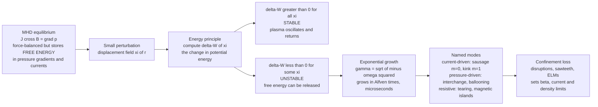

# 💥 MHD Instabilities

> [!abstract] TL;DR
> A magnetically confined plasma can sit in perfect **force balance** ($\mathbf J\times\mathbf B=\nabla p$) and still be a hair-trigger away from destroying itself — because **equilibrium is not stability**. The stored **free energy** of pressure gradients and electric currents can be released by the right small deformation, and the master tool for deciding whether it *will* be released is the **energy principle**: perturb the plasma by a displacement $\boldsymbol\xi$ and compute the change in potential energy $\delta W[\boldsymbol\xi]$; if *any* allowed $\boldsymbol\xi$ makes $\delta W<0$, the plasma is **unstable** and that mode grows exponentially — in **Alfvén times** (microseconds), fast enough to end a discharge. The rogues' gallery: **current-driven** modes (the **sausage** $m=0$ that necks the column into links, the **kink** $m=1$ that writhes helically, bounded by the **Kruskal–Shafranov** safety-factor limit $q>1$); **pressure-driven** modes (the **interchange/flute** mode — the plasma's Rayleigh–Taylor, heavy plasma dripping through light field in "bad curvature," and the **ballooning** mode that sets the $\beta$ limit); and **resistive** modes (**tearing** modes that break frozen-in flux to form **magnetic islands**). These macroscopic modes are the reason MHD stability — not equilibrium — sets the fundamental performance ceilings of every tokamak and stellarator.

## Intuition

**Analogy — the pencil on its tip.** Balancing a pencil vertically on its point is a genuine *equilibrium*: the forces cancel and, in principle, it could stand forever. But the tiniest nudge topples it, because leaning even slightly shifts its weight so the pencil leans *more* — a **positive feedback** that feeds on the pencil's own stored gravitational energy. That is the difference between equilibrium and *stability*: the pencil sits at a **maximum** of potential energy, so every perturbation finds a downhill direction.

A confined plasma is a whole zoo of such precarious balances stacked on top of one another. **Squeeze** a current-carrying column and it can pinch off into a chain of **sausage links** — because where it necks, the pinching field gets *stronger* and squeezes harder still. **Kink** it sideways and the field lines bunch on the inside of the bend and shove the kink *further* out. **Stack** heavy plasma on top of light magnetic field and the plasma **drips through** like water poured over oil — the plasma version of a heavy fluid falling into a light one (**Rayleigh–Taylor**). Every one of these is a place where the system can lower its energy by deforming, and once it starts it runs away. The catch that makes them lethal rather than academic: they grow in **microseconds**. Taming them — with field shaping, current-profile control, and feedback coils — is the entire difference between a working reactor and a violent **disruption** that dumps the whole plasma into the wall.

---

## How It Works

### Core mechanics

**1. Equilibrium stores free energy.** Ideal MHD equilibrium is the force balance $\mathbf J\times\mathbf B=\nabla p$ (see *MHD_Equilibrium_and_the_Grad_Shafranov_Equation*). It is a *static* balance, but it is not the lowest-energy state available to the plasma: the **pressure gradient** $\nabla p$ and the **current** $\mathbf J$ are reservoirs of free energy. If the plasma can rearrange itself to release some of that energy, it will.

**2. The energy principle is the master tool.** Displace every fluid element by a small field $\boldsymbol\xi(\mathbf r)$. Because ideal MHD is conservative, the linearized force operator $\mathbf F[\boldsymbol\xi]$ is **self-adjoint**, and the change in potential energy is a quadratic functional
$$
\delta W[\boldsymbol\xi] = -\tfrac12\int \boldsymbol\xi\cdot\mathbf F[\boldsymbol\xi]\,dV .
$$
The verdict is beautifully simple:
$$
\boxed{\;\delta W[\boldsymbol\xi] < 0 \text{ for some allowed } \boldsymbol\xi \;\Longleftrightarrow\; \textbf{UNSTABLE}\;}
$$
If $\delta W>0$ for *every* $\boldsymbol\xi$, the plasma sits in a potential-energy well and merely oscillates back (an MHD wave). If *any* deformation makes $\delta W<0$, the plasma sits on a hill and rolls off. This is exactly the pencil test, generalized to a continuum.

**3. Growth is in Alfvén times.** Writing $\boldsymbol\xi\propto e^{-i\omega t}$ turns the equation of motion into an eigenvalue problem $-\omega^2\rho\,\boldsymbol\xi=\mathbf F[\boldsymbol\xi]$, with $\omega^2=\delta W/K$ and $K>0$ a normalization (see [[Eigenvalues_and_Eigenvectors]]). So $\delta W<0\Rightarrow\omega^2<0\Rightarrow\omega$ imaginary $\Rightarrow$ **exponential growth** $e^{\gamma t}$ with $\gamma=\sqrt{-\omega^2}$. The natural rate is set by the **Alfvén speed** $v_A=B/\sqrt{\mu_0\rho}$: $\gamma\sim k\,v_A$, i.e. the Alfvén transit time $\tau_A=a/v_A$, which is **microseconds** in a fusion plasma. Ideal MHD instabilities are the fastest and most destructive.

**4. Current-driven modes (the pinch family).** A Z-pinch — an axial current $I$ through a column — generates an azimuthal field $B_\theta=\mu_0 I/2\pi r$ whose magnetic pressure pinches the plasma inward.
- **Sausage mode ($m=0$):** an axisymmetric radius ripple. Where the column *necks*, $B_\theta\propto 1/r$ and the magnetic pressure $B_\theta^2/2\mu_0\propto 1/r^2$ both **spike**, squeezing the neck harder — positive feedback that pinches the column into sausage links.
- **Kink mode ($m=1$):** a helical sideways displacement. Field lines bunch on the concave inside of the bend, raising the pressure there and pushing the kink *further* out — helical writhing. The **Kruskal–Shafranov limit** says a current column is kink-stable only if the **safety factor** $q=rB_z/RB_\theta$ exceeds $1$ (field lines must wind the *long* way around faster than the short way). Too much current lowers $q$ below $1$ and the column kinks. **External kinks** move the plasma boundary; **internal kinks** ($q_0<1$ on axis) reconnect the core and drive **sawteeth**.

**5. Pressure-driven modes.** Here the free energy is $\nabla p$, and magnetic **curvature** decides the sign.
- **Interchange / flute mode:** the plasma analogue of **Rayleigh–Taylor** (see [[Hydrodynamic_Instabilities]]). Field-line curvature acts like an effective gravity $g_{\text{eff}}\sim v_{\text{th}}^2/R_c$. In **bad curvature** (field lines convex toward the plasma, curving *away* — field weakening outward) heavy plasma is "supported" by light field and interchanges with it, dripping through. In **good curvature** (a **magnetic well**, field lines concave toward the plasma) the same swap costs energy and stabilizes. "Flute" modes are constant along $\mathbf B$ ($k_\parallel\approx0$) so they bend no field lines — the cheapest, most dangerous deformation.
- **Ballooning mode:** at high $\beta=p/(B^2/2\mu_0)$ the pressure **bulges out** in the bad-curvature region (the outboard side of a tokamak), ballooning between good-curvature anchors. This sets the **$\beta$ limit** (Troyon scaling) — the hard ceiling on how much plasma pressure a given field can hold.

**6. Resistive modes.** Ideal MHD's **frozen-in flux** (see *Ideal_MHD_and_Frozen_In_Flux*) forbids field lines from breaking, which forbids many rearrangements. Add a whiff of **resistivity** $\eta$ and, at **rational surfaces** where $q=m/n$ (field lines close on themselves), flux can diffuse and **reconnect** (see *Magnetic_Reconnection*), tearing nested surfaces into chains of **magnetic islands** — the **tearing mode**. Islands short-circuit heat radially and degrade confinement; they grow on a hybrid resistive timescale (slower than Alfvén but still fatal). **Neoclassical tearing modes (NTMs)** are metastable: once a seed island flattens the pressure inside it, the local **bootstrap current** vanishes, which makes the island grow further — a leading performance limiter in ITER-class devices.

### Flow / architecture



---

## Key Concepts

### Secondary Level

- **Equilibrium is not the same as stability.** A pencil balanced on its tip is in equilibrium, but the tiniest nudge topples it. A plasma can be perfectly force-balanced and still fall apart at the slightest disturbance.
- **Squeeze, kink, drip.** Three pictures cover most of it: a current-carrying plasma column can pinch off into **sausage** links; it can **kink** sideways and writhe; and heavy plasma stacked on light magnetic field can **drip through** like water poured over oil.
- **Fast and destructive.** These instabilities grow in **microseconds**. When they win, a fusion plasma can dump its entire energy into the wall in an instant — a **disruption**.
- **The whole game of fusion** is arranging the magnetic field so that deforming the plasma *costs* energy instead of releasing it — so every nudge pushes the plasma back, like a marble in a bowl rather than a pencil on its tip.

### Undergraduate Level

- **Free-energy sources:** pressure gradient $\nabla p$ (drives interchange, ballooning) and current $\mathbf J$ (drives kink, sausage, tearing). No free energy, no instability.
- **The energy principle:** $\delta W[\boldsymbol\xi]=-\tfrac12\int\boldsymbol\xi\cdot\mathbf F[\boldsymbol\xi]\,dV$. Unstable iff some allowed displacement gives $\delta W<0$. This is a **variational** statement — you minimize $\delta W$ over trial displacements, exactly the [[Work_Energy_and_Conservation]] idea of rolling downhill in a potential.
- **Growth rate:** $\omega^2=\delta W/K$; instability means $\omega^2<0$ and $\gamma=\sqrt{-\omega^2}\sim k v_A$, the **Alfvén** rate. Compare the stable case, where $\omega^2>0$ gives an oscillation ([[Single_Particle_Motion_and_Drifts]] and MHD waves).
- **Sausage ($m=0$):** surface $B_\theta\propto 1/r$, so magnetic pressure $\propto 1/r^2$ intensifies at the neck — positive feedback. Stabilized by a strong internal axial field $B_z$.
- **Kink ($m=1$) and Kruskal–Shafranov:** stable only for **safety factor** $q=rB_z/RB_\theta>1$. High current $\Rightarrow$ low $q\Rightarrow$ kink. This caps the plasma current a tokamak can carry.
- **Interchange as Rayleigh–Taylor:** field-line curvature is an effective gravity. **Bad curvature** $\to$ unstable; **good curvature (magnetic well)** $\to$ stable. Flute modes ($k_\parallel\approx0$) bend no field lines and are the most dangerous.
- **Tearing** needs **resistivity**: it breaks frozen-in flux to reconnect field into **magnetic islands** at rational surfaces $q=m/n$.

### Graduate Level

- **The ideal MHD force operator** $\mathbf F[\boldsymbol\xi]=\nabla(\boldsymbol\xi\cdot\nabla p+\gamma p\nabla\cdot\boldsymbol\xi)+\tfrac{1}{\mu_0}(\nabla\times\mathbf Q)\times\mathbf B+\tfrac{1}{\mu_0}(\nabla\times\mathbf B)\times\mathbf Q$ (with $\mathbf Q=\nabla\times(\boldsymbol\xi\times\mathbf B)$) is **self-adjoint**, guaranteeing $\omega^2$ real: modes are **purely growing or purely oscillating**, never overstable, in ideal MHD.
- **The intuitive $\delta W$ decomposition** (Furth–Killeen–Rosenbluth / Freidberg) splits the plasma term into: field-line **bending** ($|\mathbf Q_\perp|^2$, always $\ge0$, stabilizing — minimized by $k_\parallel\to0$ flutes); field **compression** ($\gamma p|\nabla\cdot\boldsymbol\xi|^2\ge0$, stabilizing); the **current-driven** (kink) term $\propto j_\parallel$; and the **pressure-driven** (interchange/ballooning) term $\propto(\boldsymbol\xi_\perp\cdot\nabla p)(\boldsymbol\xi_\perp\cdot\boldsymbol\kappa)$ with curvature $\boldsymbol\kappa$ — negative (destabilizing) in bad curvature.
- **Kruskal–Shafranov, precisely:** for a periodic straight screw pinch of length $2\pi R$, the $m=1$ external kink is unstable for $0<q_a<1$; toroidal tokamaks demand $q_a\gtrsim2\text{–}3$ operationally. The **internal kink** ($q_0<1$) and its **sawtooth** cycle are governed by the Bussac/Kadomtsev criteria.
- **Ideal vs resistive ordering:** ideal modes grow in $\tau_A$; the classical tearing mode grows in $\tau\sim\tau_A^{3/5}\tau_R^{2/5}$ (intermediate between Alfvén $\tau_A$ and resistive $\tau_R=\mu_0 a^2/\eta$), governed by the stability index $\Delta'$ (jump in $\psi'/\psi$ across the rational surface); $\Delta'>0\Rightarrow$ unstable. **Marginal ideal stability** at $\delta W=0$ often masks a resistive instability just beneath it.
- **Ballooning and the $s$–$\alpha$ diagram:** the high-$n$ ballooning eigenmode equation along a field line yields the first/second stability regions in the magnetic-shear $s$ versus pressure-gradient $\alpha$ plane, and the **Troyon $\beta$ limit** $\beta_N=\beta\,aB/I$.
- **Macro vs micro:** MHD (macro) modes are whole-plasma, fluid-scale, and *catastrophic*. **Micro** (kinetic, drift-wave: ITG, TEM, ETG) instabilities live at the gyroradius scale, are driven by velocity-space and gradient free energy, and saturate into **turbulence** that sets the confinement time $\tau_E$ rather than destroying the plasma (contrast *Two_Stream_and_Kinetic_Instabilities*).

---

## Python Demo

```python
# MHD INSTABILITIES: the energy principle and the pinch instabilities.
# Four physically motivated illustrations, all in normalized units
# (mu0 = 1, unperturbed radius a = 1, Alfven speed v_A = 1).
#   (a) SAUSAGE (m=0): a Z-pinch column with a radius ripple; show WHY the
#       neck runs away -- where r is small, surface B_theta ~ 1/r and its
#       magnetic pressure ~ 1/r^2 SPIKE, squeezing harder (positive feedback).
#   (b) That feedback -> exponential growth of the neck in Alfven times.
#   (c) KINK (m=1): the Kruskal-Shafranov boundary -- delta-W changes sign
#       at safety factor q = 1 (unstable q<1, stable q>1).
#   (d) INTERCHANGE / RAYLEIGH-TAYLOR growth rate gamma = sqrt(g_eff * k):
#       BAD curvature (g_eff>0) grows; GOOD curvature (magnetic well) is stable.
# numpy + matplotlib only.
import numpy as np
import matplotlib.pyplot as plt

# ------------------------------------------------------------------
# (a) Z-PINCH SAUSAGE (m=0): the neck's positive feedback
# ------------------------------------------------------------------
z      = np.linspace(0.0, 4.0*np.pi, 600)
a      = 1.0                                   # unperturbed column radius
eps    = 0.18                                  # perturbation amplitude
kz     = 1.0                                   # axial wavenumber
r_surf = a * (1.0 + eps*np.cos(kz*z))          # perturbed radius r(z)
p_mag  = 1.0 / r_surf**2                        # surface magnetic pressure ~ 1/r^2
p_mag /= p_mag.mean()                           # normalize for display

i_neck  = int(np.argmin(r_surf))                # tightest neck
i_bulge = int(np.argmax(r_surf))                # widest bulge

# ------------------------------------------------------------------
# (b) POSITIVE FEEDBACK -> exponential growth in Alfven times
# ------------------------------------------------------------------
vA     = 1.0                                    # Alfven speed (normalized)
gamma  = kz * vA                                # order-of-magnitude ideal rate
t      = np.linspace(0.0, 3.0, 300)
amp    = np.minimum(eps*np.exp(gamma*t), 1.0)   # grows, then saturates (pinch-off)

# ------------------------------------------------------------------
# (c) KINK (m=1): Kruskal-Shafranov safety-factor boundary
# ------------------------------------------------------------------
q          = np.linspace(0.3, 2.0, 400)
dW_kink    = q - 1.0                            # delta-W < 0 (unstable) for q < 1
gamma_kink = kz*vA*np.sqrt(np.maximum(0.0, 1.0/q - 1.0))   # growth only for q < 1

# ------------------------------------------------------------------
# (d) INTERCHANGE / RAYLEIGH-TAYLOR: gamma = sqrt(g_eff * k)
# ------------------------------------------------------------------
kperp      = np.linspace(0.1, 6.0, 400)
g_bad, g_good = +0.5, -0.5                       # bad vs good (magnetic well) curvature
gamma_bad  = np.sqrt(g_bad * kperp)              # real  -> exponential growth
gamma_good = np.sqrt(np.maximum(0.0, g_good*kperp))  # imaginary root -> stable (0)

# ------------------------------------------------------------------
# sanity checks
# ------------------------------------------------------------------
print("(a) SAUSAGE positive feedback (surface p_mag ~ 1/r^2):")
print(f"    neck : r_min = {r_surf[i_neck]:.3f}  ->  p_mag = {p_mag[i_neck]:.3f}  (PEAK -> squeezes harder)")
print(f"    bulge: r_max = {r_surf[i_bulge]:.3f}  ->  p_mag = {p_mag[i_bulge]:.3f}  (trough)")
print("(c) KINK  : Kruskal-Shafranov marginal point q = 1.00 (unstable q<1, stable q>1)")
print(f"(d) INTERCHANGE gamma at k=2: bad curvature = {np.sqrt(g_bad*2):.3f} (grows), "
      f"good curvature = {np.sqrt(max(0.0, g_good*2)):.3f} (stable)")

# ------------------------------------------------------------------
# PLOTS
# ------------------------------------------------------------------
fig, ax = plt.subplots(2, 2, figsize=(12, 9))

# (a) the sausaging column + surface magnetic pressure
axa = ax[0, 0]
axa.fill_between(z, r_surf, -r_surf, color="#ffd8a8", label="plasma column")
axa.plot(z, r_surf, color="#e8590c"); axa.plot(z, -r_surf, color="#e8590c")
axa.axvline(z[i_neck], ls=":", c="k", lw=1)
axa.set_xlabel("axial position z"); axa.set_ylabel("radius r(z)")
axa.set_ylim(-2.2, 2.2); axa.set_title("(a) Sausage m=0: necks and bulges")
axb = axa.twinx()
axb.plot(z, p_mag, "b--", lw=1.4, label="surface p_mag ~ 1/r^2")
axb.set_ylabel("normalized surface magnetic pressure", color="b")
axb.tick_params(axis="y", colors="b")
axa.annotate("neck: B_theta ~ 1/r spikes\n-> squeezes harder",
             xy=(z[i_neck], 0.0), xytext=(z[i_neck]+0.4, 1.5),
             fontsize=8, arrowprops=dict(arrowstyle="->", color="k"))

# (b) exponential growth of the neck
ax[0, 1].plot(t, amp, color="#c92a2a", lw=2)
ax[0, 1].axhline(1.0, ls="--", c="gray", lw=1)
ax[0, 1].text(0.1, 1.02, "pinch-off (r -> 0)", fontsize=8, color="gray")
ax[0, 1].set_xlabel("time (Alfven times)"); ax[0, 1].set_ylabel("neck amplitude")
ax[0, 1].set_title("(b) Positive feedback -> exp growth, gamma ~ k v_A")

# (c) Kruskal-Shafranov boundary
axc = ax[1, 0]
axc.plot(q, dW_kink, color="#1c7ed6", lw=2, label="delta-W (energy principle)")
axc.axhline(0.0, c="k", lw=0.8); axc.axvline(1.0, ls="--", c="r", lw=1.2)
axc.fill_between(q, dW_kink, 0.0, where=(dW_kink < 0), color="#ffc9c9", alpha=0.6)
axc.plot(q, gamma_kink, color="#e8590c", lw=2, label="growth rate gamma")
axc.text(0.55, -0.55, "UNSTABLE\nq < 1", color="#c92a2a", fontsize=9, ha="center")
axc.text(1.55, 0.35, "STABLE\nq > 1", color="#2b8a3e", fontsize=9, ha="center")
axc.set_xlabel("safety factor q"); axc.set_ylabel("delta-W  /  growth rate")
axc.set_title("(c) Kink m=1: Kruskal-Shafranov limit at q = 1")
axc.legend(loc="upper right", fontsize=8)

# (d) interchange / Rayleigh-Taylor growth rate
axd = ax[1, 1]
axd.plot(kperp, gamma_bad,  color="#c92a2a", lw=2, label="bad curvature (g_eff>0): grows")
axd.plot(kperp, gamma_good, color="#2b8a3e", lw=2, label="good curvature / magnetic well: stable")
axd.set_xlabel("perpendicular wavenumber k"); axd.set_ylabel("growth rate gamma = sqrt(g_eff k)")
axd.set_title("(d) Interchange = plasma Rayleigh-Taylor")
axd.legend(loc="upper left", fontsize=8)

plt.tight_layout()
plt.savefig("mhd_instabilities_demo.png", dpi=120)
print("\nsaved mhd_instabilities_demo.png")
```

**What you should see.** Part (a) draws the column rippling into sausage links and prints that the **surface magnetic pressure peaks exactly at the neck** ($p_{\text{mag}}\propto1/r^2$) — the mechanical signature of the positive feedback. Part (b) shows that feedback compounding into **exponential growth** on the Alfvén timescale until nonlinear pinch-off. Part (c) plots the **Kruskal–Shafranov** boundary: $\delta W$ (blue) crosses zero at $q=1$, shaded red where it is negative and the kink grows, with the growth rate (orange) rising as $q$ falls below $1$. Part (d) contrasts the interchange growth rate for **bad curvature** (real, growing) against **good curvature / a magnetic well** (imaginary root $\to$ zero growth $\to$ the plasma merely oscillates) — the plasma's version of stacking heavy fluid over light.

---

## Real-World Applications

- **Tokamak operational limits (ITER, JET, SPARC, DIII-D).** MHD stability, not equilibrium, draws the operating boundaries: the **Kruskal–Shafranov** safety-factor limit caps the plasma current ($q_{95}\gtrsim3$), the **Troyon $\beta$ limit** (ballooning/kink) caps the pressure, and the **Greenwald density limit** $n_G=I_p/\pi a^2$ caps the density. Push past any edge and you invite a **disruption** — a sub-millisecond loss of the entire stored energy, with wall heat loads, huge halo-current forces, and beams of runaway electrons. Avoiding and mitigating disruptions is *the* central engineering problem for ITER.
- **Sawtooth oscillations.** The internal kink ($m=1,n=1$, $q_0<1$) periodically reconnects the core, flattening and rebuilding the central temperature in the classic sawtooth trace — routine in nearly every tokamak, and a natural (if disruptive) way the core resets its current profile.
- **Edge-Localized Modes (ELMs).** Coupled **peeling–ballooning** instabilities of the H-mode edge pedestal fire off periodic bursts that expel edge plasma and heat onto the divertor. Controlling them with **resonant magnetic perturbations (RMPs)** and pellet pacing is essential to protect ITER's divertor.
- **Neoclassical tearing modes (NTMs).** The dominant soft performance limiter in long-pulse tokamaks; suppressed in real time by driving current inside the island with steered **electron-cyclotron current drive (ECCD)**.
- **Astrophysical and space plasmas.** The **kink** instability limits how much current solar coronal loops can carry before erupting; **interchange/Rayleigh–Taylor** modes structure supernova remnants, the crab nebula, and the plasma at the magnetopause; **tearing** and reconnection power solar flares and magnetospheric substorms.
- **Z-pinch and inertial-confinement devices.** The **sausage** and **kink** instabilities are the classic nemeses of pinch machines (dense plasma focus, Z-machine); modern designs use sheared axial flow and applied $B_z$ to hold them off long enough to reach fusion conditions.

---

## Common Pitfalls

- **Confusing equilibrium with stability.** Solving $\mathbf J\times\mathbf B=\nabla p$ finds an equilibrium; it says *nothing* about whether that equilibrium survives a nudge. A separate stability calculation — the energy principle — is mandatory. The pencil balances; it does not stand.
- **Getting the sign convention of the energy principle backwards.** Instability is $\delta W<0$ (the perturbation *lowers* potential energy, releasing free energy). $\delta W>0$ is stable. The plasma is unstable if it can find *even one* downhill direction, so you must **minimize** $\delta W$ over all allowed displacements — a single stabilizing trial function proves nothing.
- **Ignoring resistivity when it matters.** **Ideal** modes (kink, sausage, interchange, ballooning) need no resistivity and grow in $\tau_A$. **Tearing modes and magnetic islands require finite resistivity** to break frozen-in flux and reconnect — a plasma that is ideal-stable can still be tearing-unstable. Do not declare victory at $\delta W=0$.
- **Mixing up current-driven and pressure-driven families.** **Current-driven** (kink, sausage) are governed by the current profile and the **Kruskal–Shafranov** $q>1$ condition. **Pressure-driven** (interchange, ballooning) are governed by $\nabla p$ and **curvature** (good vs bad). They have different stabilization strategies; treating them interchangeably leads to the wrong fix.
- **Forgetting good vs bad curvature.** Curvature sets the sign of the pressure-driven drive. A **magnetic well** (average good curvature) stabilizes interchange; **bad curvature** destabilizes it. Stellarators and min-$B$ mirrors are literally shaped to maximize the good-curvature fraction.
- **Overlooking rational surfaces.** Tearing and NTMs localize at surfaces where $q=m/n$ and field lines close on themselves. The safety-factor *profile* $q(r)$ — not just its edge value — determines which islands can form and where.
- **Timescale mistakes.** Ideal instabilities are **Alfvénic** (microseconds), tearing is intermediate ($\tau_A^{3/5}\tau_R^{2/5}$), and resistive diffusion is slow ($\tau_R$). Quoting a resistive growth rate for an ideal kink (or vice versa) is off by orders of magnitude.
- **Conflating macro and micro instabilities.** MHD (macro) modes destroy confinement catastrophically and set hard limits; **micro** (kinetic, drift-wave) instabilities saturate into turbulence and set the (soft) transport-limited confinement time. They are different physics at different scales — do not use one to explain the other.

---

## Related Concepts

- [[Magnetohydrodynamics]] — the single-fluid model whose equilibrium and linearized force operator are the entire stage on which these instabilities play out.
- [[Hydrodynamic_Instabilities]] — the neutral-fluid **Rayleigh–Taylor** and **Kelvin–Helmholtz** instabilities that the interchange/flute mode directly generalizes to a magnetized plasma.
- [[Single_Particle_Motion_and_Drifts]] — grad-B and curvature drifts in "bad curvature" are the microscopic seed of the interchange and ballooning drives.
- [[Work_Energy_and_Conservation]] — the potential-energy landscape and the "roll downhill" picture that the energy principle $\delta W$ makes precise.
- [[Eigenvalues_and_Eigenvectors]] — normal-mode analysis: the growth rate is the (imaginary) eigenvalue of the self-adjoint MHD force operator.
- [[Bifurcations_and_Tipping_Points]] — the marginal-stability boundary ($\delta W=0$, or $q=1$) is a bifurcation where a stable equilibrium loses stability, exactly as in nonlinear dynamics.
- [[Feedback_Loops_and_Causality]] — every MHD instability is a **positive feedback** loop (necking intensifies the pinch, the kink deepens the bend); control fights back with engineered negative feedback.

*Section siblings (build order, prose only): MHD_Equilibrium_and_the_Grad_Shafranov_Equation supplies the force-balanced states whose stability is tested here; Ideal_MHD_and_Frozen_In_Flux provides the frozen-flux constraint that ideal modes respect and tearing modes violate; Magnetic_Reconnection is the topology-changing process behind tearing, sawteeth, and disruptions; Two_Stream_and_Kinetic_Instabilities are the micro (kinetic) counterparts contrasted throughout; Tokamak_Physics is where these limits become engineering constraints.*

---

## Review Questions

1. **(Secondary)** A pencil balanced on its tip and a marble resting in a bowl are both in equilibrium. Which is stable, and why? Explain how this distinction applies to a magnetically confined plasma, and name one instability that behaves "like the pencil."
2. **(Undergraduate)** For a Z-pinch column carrying a fixed axial current, explain physically why a small *neck* in the column tends to grow (the **sausage** mode). Use the fact that the surface field is $B_\theta\propto1/r$ to describe the positive-feedback loop, and state one thing you could add to the column to stabilize it.
3. **(Undergraduate)** State the **Kruskal–Shafranov** condition in terms of the safety factor $q$. If a tokamak operator increases the plasma current at fixed toroidal field, what happens to $q$, and why does this eventually trigger a kink? How does this set a *current* limit?
4. **(Undergraduate/Graduate)** Explain the **interchange** instability as a plasma Rayleigh–Taylor problem. What plays the role of gravity, what distinguishes "good" from "bad" magnetic curvature, and why is a **magnetic well** stabilizing? Why are **flute** modes ($k_\parallel\approx0$) the most dangerous?
5. **(Graduate)** Using the energy principle $\delta W[\boldsymbol\xi]$, explain why (a) an ideal-MHD instability is a statement that *some* trial displacement makes $\delta W<0$, (b) the growth is Alfvénic, and (c) a plasma that is marginally *ideal*-stable ($\delta W=0$) may still be **tearing**-unstable. What physical ingredient must you add to ideal MHD to permit tearing, and what does it change about the field-line topology?
6. **(Graduate)** Contrast **macro** (MHD) and **micro** (kinetic/drift-wave) instabilities in a tokamak: their spatial scales, their free-energy sources, their growth rates, and — crucially — what each one *does* to the plasma (catastrophic loss vs. turbulent transport). Which sets the confinement time $\tau_E$, and which sets the operational limits?

---

## Sources

- Freidberg, J. P. — *Ideal Magnetohydrodynamics* (and *Ideal MHD*, 2014). Cambridge/Springer — the definitive treatment of the energy principle, the kink/interchange/ballooning modes, and MHD stability limits.
- Wesson, J. — *Tokamaks* (4th ed.), Oxford University Press, 2011 — MHD instabilities in tokamaks: Kruskal–Shafranov, sawteeth, tearing/NTMs, disruptions, ELMs, and operational limits.
- Bateman, G. — *MHD Instabilities*, MIT Press, 1978 — a focused classic on the physical mechanisms and stability criteria of the principal MHD modes.
- Biskamp, D. — *Nonlinear Magnetohydrodynamics*, Cambridge University Press, 1993 — nonlinear evolution, reconnection, tearing/island dynamics, and disruptions.
- Goldston, R. J. & Rutherford, P. H. — *Introduction to Plasma Physics*, CRC Press, 1995 — accessible derivations of the pinch instabilities, the energy principle, and the safety factor.

---

#plasma-physics #mhd-instabilities #kink-instability #ballooning-mode #tearing-mode
