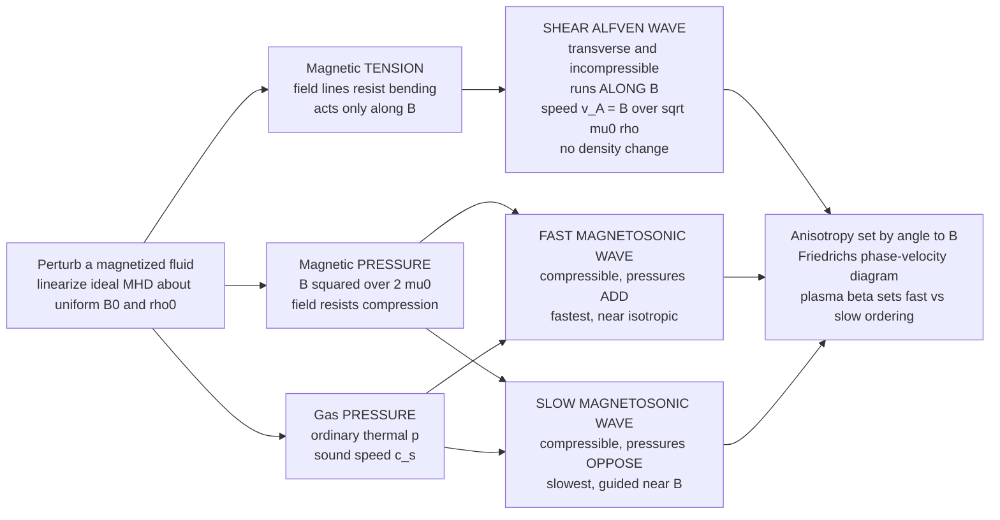

# 🎻 MHD Waves and Alfvén Waves

> [!abstract] TL;DR
> Take a magnetized fluid and give it a small kick. Three restoring forces answer back — **gas pressure** (ordinary sound), **magnetic pressure** ($B^2/2\mu_0$, the field resisting compression), and **magnetic tension** (field lines resisting bending) — so a plasma supports **three wave modes** instead of one. The signature mode is the **shear Alfvén wave**: a transverse, *incompressible* wave that runs **along** the field, restored purely by magnetic tension like a wave on a plucked string, travelling at the **Alfvén speed** $v_A = B/\sqrt{\mu_0\rho}$ and carrying **no density change at all** — Alfvén's 1942 prediction that helped win his Nobel Prize. Add compression and you get the **fast** magnetosonic wave (gas + magnetic pressure *add*, fastest, nearly isotropic) and the **slow** magnetosonic wave (the two pressures partly *oppose*, guided near $\mathbf B$). Because tension only acts along field lines and pressure acts every which way, all three speeds depend on the **angle to $\mathbf B$** — the anisotropy captured by the **Friedrichs phase-velocity diagram** with its characteristic figure-eight and peanut lobes, whose ordering is set by the **plasma beta**. These are the **low-frequency, long-wavelength** foundation (below the ion cyclotron frequency) of the whole cold-plasma wave zoo, and they are why the Sun's corona hums, why space weather ripples toward Earth, and how fusion plasmas ring.

---

## Intuition

**Analogy.** Pluck a guitar string and a wave races down its length — not because the string is pushed, but because it is under **tension**: displace it sideways and the tension snaps it back, overshoots, and the ripple propagates along the string at a speed set by tension and mass per length.

Now picture the magnetic field lines threading a plasma as a bundle of **taut elastic strings**. In an ideal plasma the fluid is **frozen** onto those field lines (it cannot slip across them), so the plasma is like beads strung densely along each string. Grab one field line and pluck it sideways: magnetic tension pulls it back, the frozen-in plasma sloshes with it, and a transverse ripple travels **along the field** — the plasma swaying side to side while the field snaps it back and forth. That is an **Alfvén wave**, and its speed $v_A = B/\sqrt{\mu_0\rho}$ is the exact magnetic analogue of "tension over mass" on a string. Because it is a pure sideways shear, the plasma is never squeezed — **the density never changes**. Now let the plasma's ordinary thermal pressure also push back, and the string can not only wobble sideways but also bunch up along its length: layer sound on top of the plucked-string tension and you get the full **family of MHD waves**, the fundamental vibrations of magnetized matter. It is why the solar corona rings, why gusts in the solar wind arrive as Alfvénic fluctuations, and why a tokamak plasma can be made to resonate.

---

## How It Works

### Core Mechanics

The recipe is **linearized ideal MHD**. Start from a uniform equilibrium — constant density $\rho_0$, pressure $p_0$, and a straight magnetic field $\mathbf B_0$ — and add a tiny perturbation $\propto \exp[i(\mathbf k\cdot\mathbf x - \omega t)]$ to the density, velocity, pressure, and field. The ideal-MHD equations (mass, momentum with the $\mathbf J\times\mathbf B$ force, and the induction equation with frozen-in flux) then reduce to a single algebraic eigenvalue problem whose three solutions are the three wave modes.

1. **Three restoring forces.** Perturbing the momentum equation exposes exactly three springs. **Gas pressure** $p$ resists compression isotropically (this is ordinary sound, speed $c_s=\sqrt{\gamma p_0/\rho_0}$). **Magnetic pressure** $B^2/2\mu_0$ resists *compressing* the field. **Magnetic tension** $\mathbf B\cdot\nabla\mathbf B/\mu_0$ resists *bending* the field lines — it acts only along $\mathbf B$ and only on transverse displacements.

2. **The shear Alfvén wave — tension alone.** Displace the plasma *perpendicular* to $\mathbf B_0$ and let $\mathbf k$ point *along* $\mathbf B_0$. Only tension responds; there is no compression, so gas and magnetic pressure sit out. The result is a transverse, incompressible wave with $\omega = k_\parallel v_A$ and phase speed
$$\boxed{\,v_A = \dfrac{B_0}{\sqrt{\mu_0\rho_0}}\,}$$
the **Alfvén speed**. It carries a velocity and magnetic-field perturbation but **zero density perturbation** — the cleanest signature of a magnetized plasma.

3. **The fast magnetosonic wave — pressures add.** Now allow compression. In the fast mode the gas-pressure and magnetic-pressure forces push **in phase**, reinforcing each other, so this is the *fastest* mode. It propagates in **all directions** (roughly isotropic), with perpendicular speed $\sqrt{v_A^2 + c_s^2}$.

4. **The slow magnetosonic wave — pressures oppose.** In the slow mode the two pressure forces are partly **out of phase**, working against each other, so it is the *slowest* compressible mode and is **guided near $\mathbf B$** (its speed collapses to zero for propagation across the field).

5. **Anisotropy and the general dispersion relation.** With $\theta$ the angle between $\mathbf k$ and $\mathbf B_0$, the two magnetosonic speeds are the roots of
$$v_{ph}^2 = \tfrac12\Big[(v_A^2+c_s^2) \pm \sqrt{(v_A^2+c_s^2)^2 - 4\,v_A^2 c_s^2\cos^2\theta}\,\Big],$$
with $+$ for **fast**, $-$ for **slow**, while the Alfvén mode obeys $v_{ph}=v_A|\cos\theta|$. Plotting these speeds versus $\theta$ gives the **Friedrichs diagram** — the fast mode a bulging near-circle, the Alfvén mode a figure-eight along $\mathbf B$, the slow mode an inner peanut hugging $\mathbf B$.

6. **Plasma beta sets the ordering.** The dimensionless **plasma beta** $\beta = p_0/(B_0^2/2\mu_0) = \tfrac{2}{\gamma}(c_s/v_A)^2$ decides whether sound or Alfvén speed is larger — i.e. whether the fast mode is "mostly sound" or "mostly magnetic," and which speed the slow mode limits to along $\mathbf B$.

### Flow / Architecture



---

## Key Concepts

### Secondary Level

- **Field lines are like guitar strings.** A magnetic field threading a plasma behaves like a bundle of taut elastic strings. Pluck one sideways and magnetic **tension** sends a ripple travelling along it — an **Alfvén wave**.
- **The plasma rides the strings.** Because the plasma is "frozen" to the field lines, it sways along with them. In a shear Alfvén wave the plasma slides side to side but is never squeezed, so **the density stays constant**.
- **The Alfvén speed.** How fast the ripple runs is $v_A = B/\sqrt{\mu_0\rho}$: **stronger field → faster; heavier (denser) plasma → slower**, exactly like a tighter, lighter string sounding a higher note.
- **Add sound and you get three waves.** Ordinary pressure lets the plasma also bunch up. Combined with the magnetic springs, a plasma supports **three** wave modes, not one — the Alfvén wave plus a **fast** and a **slow** magnetic-sound wave.
- **Direction matters.** Unlike sound in air, these waves travel at **different speeds in different directions** relative to the magnetic field, because tension only pulls along the field lines.

### Undergraduate Level

**The three ideal-MHD modes.** Linearizing ideal MHD about $(\rho_0, p_0, \mathbf B_0)$ yields three modes, parameterized by the angle $\theta$ between $\mathbf k$ and $\mathbf B_0$:

$$\text{Shear Alfvén:}\quad \omega = k v_A\cos\theta,\qquad v_A=\frac{B_0}{\sqrt{\mu_0\rho_0}}.$$

$$\text{Fast / slow magnetosonic:}\quad \frac{\omega^2}{k^2}=v_{ph}^2 = \tfrac12(v_A^2+c_s^2)\left[1\pm\sqrt{1-\dfrac{4\,v_A^2 c_s^2\cos^2\theta}{(v_A^2+c_s^2)^2}}\right],\qquad c_s=\sqrt{\frac{\gamma p_0}{\rho_0}}.$$

**Limiting cases worth memorizing.**

| Direction | Fast | Alfvén (shear) | Slow |
|-----------|------|----------------|------|
| **Along** $\mathbf B$ ($\theta=0$) | $\max(v_A,c_s)$ | $v_A$ | $\min(v_A,c_s)$ |
| **Across** $\mathbf B$ ($\theta=90^\circ$) | $\sqrt{v_A^2+c_s^2}$ | $0$ | $0$ |

Two of the three modes **vanish for propagation across the field** — only the fast (compressional) wave crosses field lines freely, because crossing $\mathbf B$ requires *compressing* the field, which only pressure forces (not tension) can drive.

**Alfvén wave is incompressible and non-dispersive.** For the shear mode $\nabla\cdot\mathbf v=0$ and $\delta\rho=0$; the velocity and field perturbations are **transverse** and **anti-correlated** ($\delta\mathbf v \parallel \delta\mathbf B$, with the sign set by direction), and $\omega/k=v_A\cos\theta$ is independent of wavelength — no dispersion in ideal MHD.

**Plasma beta.** $\beta = \dfrac{p_0}{B_0^2/2\mu_0} = \dfrac{2}{\gamma}\left(\dfrac{c_s}{v_A}\right)^2$. **Low-$\beta$** (field-dominated, e.g. corona): $v_A > c_s$, the field is the stiff spring. **High-$\beta$** (pressure-dominated, e.g. dense/hot interiors): $c_s > v_A$, gas pressure dominates. Beta flips which speed the fast/slow modes limit to.

### Graduate Level

- **The Alfvén speed as a magnetic sound speed.** Writing $v_A^2 = B_0^2/\mu_0\rho_0$, the magnetic tension per unit area is $B_0^2/\mu_0$ and the inertia is $\rho_0$, so $v_A$ is literally "$\sqrt{\text{tension}/\text{density}}$," the field-line analogue of $\sqrt{T/\mu}$ on a string. Equivalently, magnetic pressure $B^2/2\mu_0$ gives a magnetic "sound speed" that, combined with tension, produces the compressional (magnetosonic) branches.
- **Eigenmode structure.** In the $(\mathbf k, \mathbf B_0)$ plane the fast and slow modes are **coplanar** (compressional, $\delta\rho\neq0$), while the shear Alfvén mode polarizes **out of the plane** — it is the intermediate root and is decoupled from the pressure perturbations. This is why the Alfvén wave is often called the *intermediate* or *shear* mode.
- **Friedrichs diagrams.** Polar plots of phase speed vs $\theta$ give the **normal-speed surface** (Friedrichs diagram): the fast surface is convex and outermost; the Alfvén "surface" is a pair of circles tangent at the origin (the figure-eight, $v_A\cos\theta$); the slow surface is the inner cusped peanut. The corresponding **group-velocity (ray) surfaces** are dramatically anisotropic — slow-mode and Alfvén-wave energy is funneled into narrow cones **along $\mathbf B$**, the reason coronal-loop and field-line-guided energy transport is so directional.
- **Where they sit in the wave zoo.** MHD waves are the $\omega \ll \Omega_{ci}$ (below ion cyclotron), $k\rho_i \ll 1$ (long-wavelength) corner of the full cold-plasma dispersion. As $\omega\to\Omega_{ci}$ the shear Alfvén wave connects continuously to the **ion-cyclotron / shear-Alfvén** branch and the fast wave to the **compressional Alfvén / magnetosonic-whistler** branch — the low-frequency roots of the cold-plasma dielectric tensor. MHD is thus the "acoustic limit" of the kinetic wave spectrum.
- **Resonant absorption and phase mixing.** In a non-uniform plasma the local Alfvén frequency $\omega_A(x)=k_\parallel v_A(x)$ varies in space. Where a driving frequency matches $\omega_A(x)$ there is an **Alfvén resonance**: energy accumulates on that surface, gradients steepen (**phase mixing**), and the wave dissipates on small scales — a leading candidate mechanism for **coronal heating**. Standing Alfvén waves on closed field lines give **field-line resonances**, the physics of magnetospheric ULF pulsations.
- **Toroidal Alfvén eigenmodes (TAEs).** In a torus the periodic geometry opens gaps in the Alfvén continuum, inside which discrete global modes (**TAEs**) live. Fusion-born alpha particles whose speed matches $v_A$ can resonantly drive TAEs unstable, threatening fast-ion confinement — a central concern for ITER and burning plasmas.

---

## Python Demo

```python
# The MHD wave triad, visualized two ways.
#   (a) ALFVEN SPEED & SHEAR WAVE: v_A = B / sqrt(mu0 * rho).
#       - Left: how v_A scales with field strength and with density.
#       - Middle: a snapshot of the shear Alfven wave -- transverse displacement
#         travelling ALONG B, plasma & field moving together (frozen-in), NO compression.
#   (b) FRIEDRICHS DIAGRAM: polar phase-speed-vs-angle plot of the three MHD modes
#       (shear ALFVEN, FAST magnetosonic, SLOW magnetosonic) for a chosen c_s / v_A ratio,
#       showing the figure-eight (Alfven) and peanut (slow) anisotropic shapes.
import numpy as np
import matplotlib.pyplot as plt

mu0 = 4.0e-7 * np.pi
m_p = 1.673e-27          # proton mass (kg)

def alfven_speed(B, n):
    """Alfven speed for a hydrogen plasma: B in Tesla, n in m^-3."""
    rho = n * m_p
    return B / np.sqrt(mu0 * rho)

# --- sanity numbers: solar corona vs a tokamak edge ---
vA_corona = alfven_speed(1.0e-3, 1.0e15)   # B ~ 10 G, n ~ 1e15 /m^3
vA_tokamak = alfven_speed(3.0, 1.0e19)     # B ~ 3 T,  n ~ 1e19 /m^3
print(f"Corona  : v_A = {vA_corona:.3e} m/s  (~ {vA_corona/1e3:.0f} km/s)")
print(f"Tokamak : v_A = {vA_tokamak:.3e} m/s  (~ {vA_tokamak/1e6:.2f} x 1e6 m/s)")

# =====================================================================
# (a) Alfven-speed scaling + shear-wave snapshot
# =====================================================================
fig = plt.figure(figsize=(16, 5))
ax0 = fig.add_subplot(1, 3, 1)
ax1 = fig.add_subplot(1, 3, 2)
ax2 = fig.add_subplot(1, 3, 3, projection="polar")

# ---- (a1) v_A vs field and vs density ----
B = np.linspace(0.2e-3, 5.0e-3, 300)          # field strength (T)
for n, c in [(0.5e15, "tab:blue"), (2.0e15, "tab:red")]:
    ax0.plot(B * 1e3, alfven_speed(B, n) / 1e3, lw=2.2, color=c,
             label=f"n = {n:.1e} /m^3   (v_A ~ B)")
ax0b = ax0.twiny()
n_arr = np.linspace(0.3e15, 5.0e15, 300)      # density sweep at fixed B
ax0b.plot(n_arr / 1e15, alfven_speed(1.0e-3, n_arr) / 1e3,
          lw=2.2, ls="--", color="tab:green", label="v_A ~ 1/sqrt(rho)")
ax0.set_xlabel("magnetic field B  (milliTesla)")
ax0.set_ylabel("Alfven speed v_A  (km/s)")
ax0b.set_xlabel("density n  (1e15 /m^3)   [dashed curve]")
ax0.set_title("(a1) Alfven speed v_A = B / sqrt(mu0 rho)\nstronger B -> faster, denser -> slower")
ax0.grid(alpha=0.3)
h0, l0 = ax0.get_legend_handles_labels()
h0b, l0b = ax0b.get_legend_handles_labels()
ax0.legend(h0 + h0b, l0 + l0b, fontsize=7.5, loc="upper left")

# ---- (a2) shear Alfven wave: transverse displacement travelling along B ----
z = np.linspace(0, 4 * np.pi, 400)            # distance along B (horizontal)
disp = np.sin(z)                              # transverse (vertical) displacement of field line
ax1.plot(z, disp, lw=2.5, color="tab:purple", label="field line + frozen-in plasma")
# velocity arrows show the plasma sloshing side to side (transverse), no along-B compression
zq = z[::28]
ax1.quiver(zq, np.sin(zq), np.zeros_like(zq), np.cos(zq),
           color="tab:orange", scale=18, width=0.005, label="plasma velocity (transverse)")
ax1.axhline(0, ls=":", color="gray")
ax1.annotate("B0 (propagation along field)", xy=(0.5, -1.35),
             xytext=(0.5, -1.35), fontsize=9, color="black")
ax1.annotate("", xy=(4 * np.pi, -1.55), xytext=(0.0, -1.55),
             arrowprops=dict(arrowstyle="->", color="black", lw=1.6))
ax1.set_xlabel("distance along B0")
ax1.set_ylabel("transverse displacement")
ax1.set_title("(a2) Shear Alfven wave: transverse, incompressible\n"
              "restoring force = magnetic tension, density unchanged")
ax1.set_ylim(-1.8, 1.6)
ax1.legend(fontsize=8, loc="upper right")
ax1.grid(alpha=0.25)

# =====================================================================
# (b) FRIEDRICHS diagram: three MHD phase speeds vs angle to B
# =====================================================================
vA = 1.0                 # Alfven speed (normalized)
cs = 0.6                 # sound speed  -> low-beta case (v_A > c_s)
theta = np.linspace(0, 2 * np.pi, 720)
ct2 = np.cos(theta)**2

disc = np.sqrt((vA**2 + cs**2)**2 - 4.0 * vA**2 * cs**2 * ct2)
v_fast = np.sqrt(0.5 * ((vA**2 + cs**2) + disc))     # + root: FAST magnetosonic
v_slow = np.sqrt(0.5 * ((vA**2 + cs**2) - disc))     # - root: SLOW magnetosonic
v_alf = vA * np.abs(np.cos(theta))                   # shear ALFVEN (figure-eight)

ax2.plot(theta, v_fast, lw=2.4, color="tab:red",    label="FAST magnetosonic")
ax2.plot(theta, v_alf,  lw=2.4, color="tab:blue",   label="shear ALFVEN  (v_A cos t)")
ax2.plot(theta, v_slow, lw=2.4, color="tab:green",  label="SLOW magnetosonic")
ax2.set_theta_zero_location("E")                     # B points along the horizontal (theta = 0)
ax2.set_title("(b) Friedrichs diagram (c_s/v_A = 0.6, low beta)\n"
              "angle measured from B  ->  strong anisotropy", pad=18)
ax2.set_rlabel_position(135)
ax2.legend(fontsize=8, loc="lower left", bbox_to_anchor=(-0.15, -0.15))

plt.tight_layout()
plt.savefig("mhd_waves_alfven.png", dpi=130)
plt.show()

# --- numeric check of the key limits ---
print("\nPhase-speed limits (normalized, v_A=1, c_s=0.6):")
print(f"  along  B (theta=0)  : fast={max(vA,cs):.2f}  alfven={vA:.2f}  slow={min(vA,cs):.2f}")
print(f"  across B (theta=90) : fast={np.sqrt(vA**2+cs**2):.2f}  alfven=0.00  slow=0.00")
```

**What you see.** Panel (a1) is the scaling law made visual: $v_A$ rises **linearly with field strength** and falls as **$1/\sqrt{\text{density}}$** — a strong, tenuous field gives a fast, "tight-string" plasma (corona, $\sim1000$ km/s) while a dense one is sluggish. Panel (a2) is the shear Alfvén wave itself: a **transverse** ripple gliding *along* the field, with the plasma velocity arrows pointing sideways and the field line and plasma moving **together** (frozen-in) — nowhere does the plasma bunch up, so the density is untouched. Panel (b) is the **Friedrichs diagram** with $\mathbf B$ pointing right: the **fast** mode (red) is the outermost, nearly round curve that propagates in every direction; the **Alfvén** mode (blue) is the tell-tale **figure-eight** hugging the field axis ($v_A\cos\theta$, vanishing across $\mathbf B$); the **slow** mode (green) is the inner **peanut** squeezed even more tightly along $\mathbf B$. Change `cs` above `vA` (high beta) and watch the fast/slow lobes swap character — the plasma beta rewrites the whole diagram.

---

## Real-World Applications

> **Example — heating the solar corona (the classic puzzle).** The Sun's surface is $\sim6000$ K yet its corona is millions of degrees — energy is somehow carried *up* against gravity and dumped high in the atmosphere. **Alfvén waves** are a prime suspect and, since Parker Solar Probe and DKIST, a confirmed carrier: convective buffeting of magnetic footpoints in the photosphere plucks the field lines, launching Alfvén waves that propagate up flux tubes at $v_A=B/\sqrt{\mu_0\rho}$. Because they are nearly incompressible they travel far without shocking; they deposit their energy only where **Alfvén resonance** and **phase mixing** (from the spatial gradient of $v_A$) grind them down to dissipative scales, heating the corona and helping accelerate the fast solar wind. This is the shear Alfvén wave doing exactly what the guitar-string analogy predicts, on a stellar scale.

- **Fusion heating, current drive, and the TAE hazard.** Reactors launch waves in the MHD/ion-cyclotron range to heat and drive current: **ICRF heating** and dedicated **Alfvén-wave heating/current-drive** schemes couple external antennas to these modes. The flip side is that fusion-born **alpha particles** moving at $\sim v_A$ can resonantly excite **toroidal Alfvén eigenmodes (TAEs)**, expelling the very fast ions meant to self-heat the plasma — a first-order design constraint for ITER and burning-plasma tokamaks.
- **Space weather and the solar wind.** The turbulent solar wind is threaded with **Alfvénic fluctuations** (correlated velocity and magnetic swings with little density change); the "switchbacks" seen by Parker Solar Probe are large-amplitude Alfvén-wave features. MHD waves set how disturbances — and their timing — **propagate toward Earth**.
- **Magnetospheric ULF pulsations.** Earth's dipole field lines act as resonating strings closed at both ionospheric ends. Solar-wind buffeting drives **standing Alfvén waves** on them — **field-line resonances** observed as ultra-low-frequency (mHz) magnetic pulsations, a direct geophysical measurement of $v_A$ along the field.
- **MHD turbulence.** In the interstellar medium, solar wind, and accretion disks, energy cascades to small scales largely as an **Alfvénic cascade** (counter-propagating Alfvén-wave packets interacting), the workhorse model of anisotropic MHD turbulence and heating.

---

## Common Pitfalls

- **Lumping all three modes together.** There are **three distinct waves**: the **shear Alfvén** wave is *incompressible*, restored by *tension alone*, and travels *along* $\mathbf B$; the **fast** and **slow** waves are **magnetosonic** — *compressible*, driven by *pressure plus tension*. Calling any magnetized-plasma wave "an Alfvén wave" erases the physics.
- **Forgetting the Alfvén wave carries no compression.** The shear mode has $\delta\rho=0$ and $\nabla\cdot\mathbf v=0$. Density-probe diagnostics see *nothing*; you must look at the transverse magnetic and velocity perturbations. Expecting a density signature is a common trap.
- **Misremembering the Alfvén speed.** It is $v_A = B/\sqrt{\mu_0\rho}$ in SI (with $\mu_0$; in Gaussian units $v_A=B/\sqrt{4\pi\rho}$). Note the $1/\sqrt{\rho}$: **heavier or denser plasma slows the wave**. Dropping $\mu_0$ or using number density instead of mass density $\rho=n m_i$ is a frequent numerical error.
- **Ignoring anisotropy.** Unlike sound, MHD phase speeds **depend on the angle to $\mathbf B$**. Two of the three modes (Alfvén and slow) **vanish for propagation perpendicular to $\mathbf B$**; only the fast mode crosses field lines. Treating these waves as isotropic gives wrong speeds and wrong energy paths.
- **Getting the fast/slow ordering backwards.** Which mode is faster along $\mathbf B$ depends on **plasma beta**: for low-$\beta$ (field-dominated) $v_A>c_s$, for high-$\beta$ (pressure-dominated) $c_s>v_A$. The labels "fast/slow" refer to the mode, not to a fixed number — check $\beta$ before asserting speeds.
- **Overreaching the MHD limit.** MHD waves are the **low-frequency** ($\omega\ll\Omega_{ci}$), **long-wavelength** ($k\rho_i\ll1$) corner of the full plasma wave spectrum. Push to higher frequency or shorter wavelength and the ideal-MHD dispersion breaks down — the modes bend into cyclotron, whistler, and kinetic-Alfvén branches that require the cold- or warm-plasma dielectric tensor.
- **Confusing ideal (non-dissipative) waves with heating.** Ideal MHD gives *undamped* propagating waves. Heating requires a **dissipation mechanism** — resistivity, viscosity, or (crucially) **resonant absorption / phase mixing** where $v_A$ varies in space. Assuming Alfvén waves automatically heat, without a gradient or resonance to localize the dissipation, skips the essential step.

---

## Related Concepts

- [[Magnetohydrodynamics]] — the ideal-MHD equations (frozen-in flux, $\mathbf J\times\mathbf B$ force) that, when linearized about a uniform state, *produce* these three wave modes.
- [[Waves_in_Fluids_and_Acoustics]] — ordinary sound $\omega=kc_s$; the magnetosonic waves are sound *plus* magnetic pressure, and the Alfvén speed is a magnetic "sound speed."
- [[Wave_Motion_and_Properties]] — the plucked-string / transverse-wave physics ($v=\sqrt{\text{tension}/\text{density}}$) that the Alfvén wave copies exactly with field-line tension.
- [[Polarization_and_Dispersion]] — phase vs group velocity and dispersion relations $\omega(k)$; MHD modes are non-dispersive but sharply anisotropic (direction-dependent).
- [[Maxwells_Equations]] — Faraday's and Ampère's laws that couple the field perturbation to the plasma motion and give tension and magnetic pressure their form.
- [[Single_Particle_Motion_and_Drifts]] — gyration and the ion cyclotron frequency $\Omega_{ci}$, the upper frequency bound below which the MHD description holds.
- [[Plasma_Oscillations_and_Frequency]] — the electrostatic plasma frequency; contrast with these low-frequency, magnetic, compressional/transverse MHD waves.
- [[The_Sun]] — the corona and solar wind, where Alfvén-wave heating and Alfvénic turbulence are the leading energy-transport mechanisms.
- [[Pitch_and_the_Harmonic_Series]] — vibrating strings under tension and their harmonics: the direct musical analogue of a plucked field line and standing Alfvén-wave (field-line) resonances.

*Companion notes in this section (Magnetohydrodynamics): see the sibling notes on Ideal MHD and Frozen-In Flux (the equations these waves come from), The Two-Fluid and MHD Models (where the single-fluid picture comes from), Cold Plasma Waves and Dispersion (how the Alfvén and magnetosonic branches connect to the full cold-plasma wave zoo), The Solar Wind and Heliosphere (Alfvénic turbulence and switchbacks), and Plasma Heating and Current Drive (Alfvén/ICRF heating and TAEs).*

---

## Review Questions

**Secondary.** Using the guitar-string picture, explain why an Alfvén wave travels *along* the magnetic field and why the plasma is never compressed as it passes. If you double the magnetic field strength, what happens to the Alfvén speed? If you double the density?

**Undergraduate.** State the three ideal-MHD wave modes and give their phase speeds for propagation *along* and *across* $\mathbf B$. Why do two of the three modes vanish for perpendicular propagation? Define the plasma beta and explain how it decides whether the fast mode is "mostly sound" or "mostly magnetic." A coronal loop has $B=10$ G and $n=10^{15}\,\text{m}^{-3}$ hydrogen — estimate $v_A$.

**Graduate.** Starting from linearized ideal MHD, sketch how the momentum equation's three restoring forces (gas pressure, magnetic pressure, magnetic tension) give the fast/slow magnetosonic dispersion $v_{ph}^2 = \tfrac12[(v_A^2+c_s^2)\pm\sqrt{(v_A^2+c_s^2)^2-4v_A^2c_s^2\cos^2\theta}]$ and the shear-Alfvén root $v_A\cos\theta$. Draw the Friedrichs diagram and identify each lobe. Then explain **resonant absorption / phase mixing** in a non-uniform $v_A(x)$ and why it is a candidate for coronal heating, and describe how fusion alphas at $v\sim v_A$ destabilize toroidal Alfvén eigenmodes.

---

## Sources

- Alfvén, H. "Existence of Electromagnetic–Hydrodynamic Waves," *Nature* **150**, 405 (1942) — the original prediction of what are now called Alfvén waves (work cited in his 1970 Nobel Prize).
- Chen, F. F. *Introduction to Plasma Physics and Controlled Fusion*, 3rd ed. (Springer, 2016) — clear derivation of the Alfvén and magnetosonic waves and the Alfvén speed (Ch. 4).
- Priest, E. R. *Magnetohydrodynamics of the Sun* (Cambridge Univ. Press, 2014) — MHD waves, Friedrichs diagrams, resonant absorption, and coronal-heating applications.
- Boyd, T. J. M. & Sanderson, J. J. *The Physics of Plasmas* (Cambridge Univ. Press, 2003) — systematic treatment of the three MHD modes, anisotropy, and their place in the wave spectrum.
- Cross, R. *An Introduction to Alfvén Waves* (Adam Hilger, 1988) — a focused, physically motivated account of Alfvén-wave propagation, resonance, and heating.

---

#plasma-physics #alfven-waves #magnetosonic-waves #mhd-waves #coronal-heating
