# 💥 Magnetic Reconnection

> [!abstract] TL;DR
> **Magnetic reconnection is the process that breaks and re-joins magnetic field lines, explosively converting stored magnetic energy into heat and hurled particles.** Ideal magnetohydrodynamics freezes the field into the plasma and forbids any change of topology, so magnetic energy piled up in sheared, stressed fields has *nowhere to go*. Reconnection is nature's escape valve: where oppositely-directed field lines are jammed together, a razor-thin **current sheet** forms, and inside a tiny **diffusion region** the frozen-in law breaks — by resistivity, or in collisionless plasmas by Hall and electron physics. The lines snap and re-tie into a new topology at an **X-point**, and the released magnetic tension fires **outflow jets at the Alfvén speed** while accelerating particles to high energy. It is the engine of solar flares and coronal mass ejections, of magnetospheric substorms and the aurora, and of the sudden sawtooth crashes and disruptions that plague fusion tokamaks — the universe's way of untying its own magnetic knots.

---

## Intuition

**Analogy:** Take **two stretched rubber bands pointing in opposite directions** and push them hard against each other. Nothing happens at first — they just press together, storing your effort as tension. But squeeze them into a thin enough contact zone and they can suddenly **SNAP and re-tie themselves into a completely new configuration**, releasing all that pent-up tension in a violent recoil that flings the pieces sideways.

Magnetic field lines do exactly this. Normally they are **frozen into the plasma** and forbidden to cross — a field line is a permanent thread that moves *with* the fluid and can never break. But squeeze two oppositely-directed bundles of field lines into a thin enough sheet and, in that tiny zone, the freezing law fails: the lines **break and RECONNECT into a new topology**, converting stored magnetic energy into heat and hurled particles in a violent snap. This is the engine of the solar flares that fling billion-ton clouds at Earth, of the shimmering auroras, and of the sudden disruptions that can wreck a fusion plasma. Reconnection is the universe's way of **untying magnetic knots** — the topology-changing counterpart to the flux-freezing that otherwise locks the field in place forever.

---

## How It Works

### Core mechanics

**1. The problem: ideal MHD freezes the field and preserves topology.** In ideal magnetohydrodynamics the magnetic field obeys the induction equation with no dissipation,

$$\frac{\partial \vec{B}}{\partial t} = \nabla\times(\vec{v}\times\vec{B}),$$

which is Alfvén's **frozen-in theorem**: the magnetic flux through any surface carried by the plasma is conserved, so field lines move *with* the fluid and their **topology (connectivity) can never change**. Stir sheared or stressed fields together and you can pile up enormous magnetic energy — but with topology locked, that energy has no way to be released. See [[Faradays_Law_and_Induction]] for the induction equation and [[Magnetohydrodynamics|Magnetohydrodynamics (Physics)]] for the ideal framework this violates.

**2. The demand: observations require fast energy release.** A solar flare dumps $\sim 10^{25}$ J in minutes; magnetospheric substorms light up the aurora on the same timescale; tokamak sawtooth crashes flatten the core temperature in microseconds. Ideal MHD flatly cannot do any of this. Something must break the freezing.

**3. The current sheet.** Where two regions of **oppositely-directed field** are pushed together, $\vec{B}$ must reverse across a thin boundary layer. By Ampère's law ([[Maxwells_Equations]]), a field that reverses over a thickness $\delta$ implies an intense current density $J \sim B/(\mu_0\delta)$ concentrated in that layer — a **current sheet**. The thinner the sheet, the steeper the gradient.

**4. The diffusion region.** The full (resistive) induction equation carries a diffusion term $\frac{\eta}{\mu_0}\nabla^2\vec{B}$. In the bulk plasma this term is utterly negligible (the field is frozen), but inside a *thin enough* current sheet the gradients $\nabla^2\vec{B}$ become so large that diffusion switches on locally. In this small **diffusion region** the frozen-in condition breaks — field lines are no longer glued to the fluid and are free to slip, break, and re-join.

**5. Reconnection and the X-point.** Inside the diffusion region, in-flowing field lines from opposite sides are cut and **spliced onto each other**, changing the topology. In 2D the geometry is a hyperbolic magnetic null — an **X-point** — with four **separatrices** dividing inflow regions from outflow regions. What was two disconnected bundles becomes lines that thread *across* the former boundary.

**6. Energy release and outflow jets.** The newly reconnected field lines are sharply bent at the X-point and, like a stretched slingshot, they **snap straight**, converting magnetic **tension** into bulk kinetic energy. Plasma is fired out along the sheet in two **outflow jets at roughly the Alfvén speed** $v_A = B/\sqrt{\mu_0\rho}$, while the strong electric field and turbulence in the diffusion region **accelerate particles** to high energy. Stored magnetic energy becomes heat, flow, and fast particles.

**7. The rate problem.** *How fast* can reconnection proceed? The **Sweet-Parker** model treats a long, thin, steady resistive sheet of system length $L$: mass conservation plus Alfvénic outflow give a dimensionless reconnection rate

$$M_{\rm SP} = \frac{v_{\rm in}}{v_A} \approx \frac{1}{\sqrt{S}}, \qquad S = \frac{\mu_0 L v_A}{\eta}\ \text{(Lundquist number)}.$$

For the solar corona $S \sim 10^{12}$, so $M_{\rm SP}\sim 10^{-6}$ — a flare would take **months**, not minutes. Sweet-Parker is *far* too slow. Three resolutions give **fast reconnection**, with rate $M \sim 0.01$–$0.1$ nearly independent of $S$: **Petschek's** localized diffusion region with standing slow-mode shocks; the **plasmoid instability**, in which a long sheet fragments into a chain of magnetic islands once $S \gtrsim 10^4$; and **collisionless / Hall reconnection**, where the diffusion region shrinks to kinetic (ion-inertial) scales and Hall and electron-pressure physics open the outflow.

### Flow / architecture

```mermaid
graph LR
    A["Anti-parallel field lines<br/>sheared, stressed B<br/>stored magnetic energy"] --> B["Fields pushed together<br/>plasma inflow"]
    B --> C["Thin CURRENT SHEET<br/>B reverses across a thin layer<br/>Ampere law: intense J"]
    C --> D["DIFFUSION REGION<br/>huge gradients switch on<br/>resistive OR Hall / kinetic physics<br/>frozen-flux BREAKS"]
    D --> E["Field lines RECONNECT<br/>new topology<br/>X-point and separatrices"]
    E --> F["Magnetic TENSION released<br/>bent field lines snap back<br/>like slingshots"]
    F --> G["OUTFLOW JETS near v_A<br/>plus ACCELERATED particles<br/>magnetic energy to heat and kinetic"]
    G --> H["Solar flares and CMEs<br/>substorms and aurora<br/>tokamak sawteeth and disruptions"]
```



---

## Key Concepts

### Secondary Level

- Magnetic field lines normally act like unbreakable threads locked into a plasma — they can bend and stretch, but never cut or cross. That storage of tension is why energy can build up.
- **Reconnection** is when oppositely-pointing field lines are squeezed together, **break**, and **re-join** into a new pattern — releasing their stored energy in a sudden burst of heat and fast-moving particles.
- It is the trigger behind **solar flares** and **coronal mass ejections** (huge clouds of plasma the Sun hurls into space), behind **substorms and the aurora**, and behind sudden hiccups inside **fusion machines**.
- Think of it as the universe *untying a magnetic knot*: energy stored in the tangle is dumped all at once.

### Undergraduate Level

- **Frozen-in flux (Alfvén's theorem):** in ideal MHD, $\partial_t\vec{B}=\nabla\times(\vec{v}\times\vec{B})$ conserves magnetic topology; field lines move with the fluid. Reconnection is precisely the *breakdown* of this law in a localized region.
- **Magnetic Reynolds / Lundquist number** $S = \mu_0 L v_A/\eta$ measures the ratio of advection to resistive diffusion. Huge $S$ means the field is frozen almost everywhere — *except* in a thin current sheet where $\nabla^2\vec{B}$ is large.
- **Current sheet:** a thin layer where $\vec{B}$ reverses, carrying an intense current $\vec{J}=\nabla\times\vec{B}/\mu_0$. This is where reconnection localizes.
- **X-point geometry:** a 2D magnetic null with four **separatrices**; inflow of anti-parallel field on two sides, Alfvénic **outflow jets** on the other two.
- **Sweet-Parker rate** $M_{\rm SP}=S^{-1/2}$ (slow), sheet aspect ratio $\delta/L = S^{-1/2}$. **Petschek** gives $M\sim \pi/(8\ln S)$ (weakly $S$-dependent, fast) via standing slow shocks.
- **Energy conversion:** magnetic tension $\to$ kinetic (jets) + thermal (heating) + non-thermal (accelerated particles). The Poynting flux into the sheet is balanced by outflow enthalpy and particle energization.

### Graduate Level

- **Generalized Ohm's law** governs *what* breaks the frozen-in condition:
$$\vec{E}+\vec{v}\times\vec{B} = \eta\vec{J} + \underbrace{\frac{\vec{J}\times\vec{B}}{ne}}_{\text{Hall}} - \underbrace{\frac{\nabla\cdot\mathbb{P}_e}{ne}}_{\text{electron pressure}} + \underbrace{\frac{m_e}{ne^2}\frac{d\vec{J}}{dt}}_{\text{electron inertia}}.$$
Collisional reconnection uses $\eta\vec{J}$; **collisionless** reconnection relies on the Hall term (at the ion-inertial length $d_i=c/\omega_{pi}$) and, ultimately, the off-diagonal **electron pressure tensor** and electron inertia to break the *electron* frozen-in condition at the electron-diffusion-region scale.
- **Sweet-Parker vs Petschek vs plasmoid.** SP is a self-consistent resistive steady state but too slow. Petschek's fast solution requires *localized* (anomalous) resistivity or it collapses back to SP in uniform-$\eta$ MHD. The **plasmoid (tearing) instability** resolves this: once $S \gtrsim S_c \approx 10^4$, the SP sheet is unstable and fragments into a hierarchy of **magnetic islands**, yielding a statistically steady fast rate $M\approx 0.01$ nearly independent of $S$.
- **Universal fast rate.** Kinetic simulations and experiments converge on $M \approx 0.1$ for collisionless reconnection, set by the geometry of the ion-scale (Hall) region and the dispersive whistler/kinetic-Alfvén physics that opens the outflow — remarkably insensitive to the microscopic dissipation mechanism.
- **3D reconnection** is far richer than the 2D X-point: null-point, separator, and quasi-separatrix-layer (QSL) reconnection, with the topological invariant being **magnetic helicity**, which is well-conserved even as energy is dissipated (Taylor relaxation).
- **Particle acceleration:** direct DC electric fields at the X-line, Fermi acceleration in contracting/merging plasmoids, and betatron acceleration in compressed regions produce the non-thermal power-law tails seen in flares and the magnetotail.

---

## Python Demo

```python
# Magnetic reconnection: (a) the X-point field geometry from a flux function,
# and (b) WHY Sweet-Parker is too slow -- reconnection rate vs Lundquist number.
import numpy as np
import matplotlib.pyplot as plt

# =====================================================================
# (a) X-POINT GEOMETRY from the flux function  psi = (x^2 - y^2)/2.
#     In 2D,  B = grad(psi) x z_hat  ->  Bx =  d psi/dy = -y ,
#                                        By = -d psi/dx = -x .
#     Field lines are contours of psi.  psi = 0 gives the separatrices y = +/- x.
#     The reconnecting Bx reverses across the current sheet y = 0 (INFLOW along y);
#     plasma is expelled along x as two OUTFLOW JETS.
# =====================================================================
grid = np.linspace(-2.0, 2.0, 400)
X, Y = np.meshgrid(grid, grid)
Bx = -Y
By = -X
# check the field is divergence-free (a real magnetic field):  dBx/dx + dBy/dy = 0
print("div B (should be ~0):", np.max(np.abs(np.gradient(Bx, grid, axis=1)
                                            + np.gradient(By, grid, axis=0))))

# =====================================================================
# (b) RECONNECTION RATE vs Lundquist number S  (the magnetic Reynolds number
#     built on the Alfven speed).  Dimensionless rate  M = v_in / v_A.
#       Sweet-Parker (long thin resistive sheet):  M_SP  = S^(-1/2)   -> too slow
#       Petschek (localized diffusion region):     M_Pet = pi/(8 ln S)
#       Fast (plasmoid / collisionless / Hall):    M_fast ~ 0.01 - 0.1, ~constant
#     Plasmoid instability switches the sheet on above  S_c ~ 1e4.
# =====================================================================
S      = np.logspace(2, 14, 400)      # corona reaches S ~ 1e12 - 1e14
M_SP   = S**(-0.5)                     # Sweet-Parker: far too slow
M_Pet  = np.pi / (8.0 * np.log(S))     # Petschek: only logarithmic in S
M_fast = 0.1                           # collisionless / plasmoid saturation
S_c    = 1.0e4                         # plasmoid-instability critical Lundquist no.

S_corona = 1.0e12
print(f"\nAt coronal S = {S_corona:.0e}:")
print(f"  Sweet-Parker M_SP  = {S_corona**-0.5:.2e}   -> flare time ~ months")
print(f"  Petschek     M_Pet = {np.pi/(8*np.log(S_corona)):.2e}")
print(f"  observed fast rate ~ 0.01 - 0.1              -> flare time ~ minutes")

# --- Plots ---
fig, (ax1, ax2) = plt.subplots(1, 2, figsize=(14, 6))

# (a) X-point field
ax1.streamplot(X, Y, Bx, By, density=1.4, color="steelblue",
               linewidth=0.8, arrowsize=1.0)
ax1.plot([-2, 2], [-2, 2], "r--", lw=1.5)     # separatrix y = x
ax1.plot([-2, 2], [2, -2], "r--", lw=1.5)     # separatrix y = -x
ax1.axhline(0, color="orange", lw=7, alpha=0.20)          # current sheet
ax1.text(-1.92, 0.10, "current sheet", color="darkorange", fontsize=9)
ax1.plot(0, 0, "ko", ms=7)                                # magnetic null
ax1.annotate("X-point null", (0, 0), xytext=(0.18, 0.30), fontsize=9)
for ys in (1.5, -1.5):
    ax1.annotate("inflow", xy=(0, 0.55*np.sign(ys)), xytext=(0, ys),
                 arrowprops=dict(arrowstyle="->", color="green"),
                 ha="center", color="green", fontsize=9)
for xs in (1.6, -1.6):
    ax1.annotate("outflow jet", xy=(xs, 0), xytext=(0.55*np.sign(xs), 0),
                 arrowprops=dict(arrowstyle="->", color="purple"),
                 color="purple", fontsize=9, va="center")
ax1.set_xlim(-2, 2); ax1.set_ylim(-2, 2); ax1.set_aspect("equal")
ax1.set_xlabel("x   (outflow direction)")
ax1.set_ylabel("y   (inflow direction)")
ax1.set_title("(a) Reconnection X-point:  psi = (x^2 - y^2)/2")

# (b) rate vs Lundquist number
ax2.loglog(S, M_SP,  "b-", lw=2.2, label="Sweet-Parker   M = S^(-1/2)  (too slow)")
ax2.loglog(S, M_Pet, "g-", lw=2.0, label="Petschek   M = pi / (8 ln S)")
ax2.axhline(M_fast, color="crimson", lw=2.2,
            label="fast / collisionless / plasmoid   M ~ 0.1")
ax2.axvline(S_c, color="gray", ls=":", lw=1.5)
ax2.text(S_c*1.4, 2e-4, "plasmoid onset\nS_c ~ 1e4", color="gray", fontsize=8)
ax2.scatter([S_corona], [S_corona**-0.5], color="blue", zorder=5)
ax2.annotate("corona: SP predicts ~1e-6", (S_corona, S_corona**-0.5),
             textcoords="offset points", xytext=(-155, 10),
             color="blue", fontsize=8)
ax2.set_xlabel("Lundquist number   S = mu0 L v_A / eta")
ax2.set_ylabel("reconnection rate   M = v_in / v_A")
ax2.set_title("(b) Why Sweet-Parker fails: rate vs S")
ax2.set_ylim(1e-7, 1.0)
ax2.legend(loc="lower left", fontsize=8)
ax2.grid(which="both", alpha=0.2)

plt.tight_layout()
plt.savefig("magnetic_reconnection.png", dpi=130)
plt.show()
```

**What the plots show.** Panel (a) is the reconnection X-point drawn straight from the flux function $\psi=(x^2-y^2)/2$: hyperbolic field lines, the two red **separatrices** $y=\pm x$ crossing at the central null, anti-parallel field flowing *in* from top and bottom across the orange **current sheet**, and Alfvénic **outflow jets** fired left and right. Panel (b) is the crux of the whole subject — the **reconnection-rate crisis**: the Sweet-Parker prediction $S^{-1/2}$ plunges to $\sim 10^{-6}$ at coronal $S\sim10^{12}$ (flares would take months), while the observed **fast** rate sits at $\sim 0.1$, reached via Petschek's weakly-$S$-dependent branch, the plasmoid instability above $S_c\sim10^4$, or collisionless Hall physics. The gap between the blue curve and the red line *is* the reason kinetic and Hall reconnection physics exist.

---

## Real-World Applications

- **Solar flares and coronal mass ejections.** In the standard (CSHKP) flare model, a current sheet forms beneath an erupting magnetic flux rope in the corona; reconnection releases up to $10^{25}$–$10^{26}$ J in minutes, heats plasma to tens of millions of kelvin, accelerates particles, and drives billion-ton **CMEs** outward at hundreds to thousands of km/s. When one hits Earth it triggers geomagnetic storms. See [[The_Sun]].
- **Magnetospheric substorms and the aurora.** In the **Dungey cycle**, reconnection on the *dayside* magnetopause opens Earth's field to the solar wind and interplanetary magnetic field, loading energy into the magnetotail; *nightside* reconnection in the tail then releases it explosively as a **substorm**, injecting particles that precipitate into the atmosphere and light the **aurora**. NASA's **MMS** mission flew four spacecraft in tight formation directly through the electron diffusion region to measure this in situ.
- **Laboratory and fusion plasmas.** The **MRX** (Magnetic Reconnection Experiment, Princeton) and related devices reproduce and measure reconnection under controlled, collisional-to-collisionless conditions. In **tokamaks**, reconnection drives the periodic **sawtooth crash** (a Kadomtsev-style relaxation of the $q<1$ core that flattens the central temperature) and, more dangerously, **tearing modes** and **disruptions** that can abruptly terminate a discharge — so it is at once a useful relaxation channel and a serious threat to reactors like ITER.
- **Astrophysical dynamos and jets.** Reconnection permits the topology changes that let the **geodynamo** and **solar/galactic dynamos** regenerate large-scale field, heats accretion-disk coronae, powers giant flares on **magnetars**, and dissipates magnetic energy in relativistic jets and pulsar winds.

---

## Common Pitfalls

- **"Ideal MHD can release the stored energy."** It cannot. With frozen-in flux, magnetic topology is conserved and stressed fields stay stressed forever. Reconnection *requires* a **diffusion region** where the ideal law is broken — by resistivity, or in collisionless plasmas by Hall physics, the electron pressure tensor, or electron inertia. If your model keeps ideal MHD everywhere, no reconnection can occur.
- **Trusting the Sweet-Parker rate.** $M_{\rm SP}=S^{-1/2}$ is a legitimate steady resistive solution, but at astrophysical $S\sim10^{12}$ it predicts flare timescales of *months* — off by orders of magnitude. Reality is **fast reconnection** ($M\sim0.01$–$0.1$), via Petschek's localized geometry, the **plasmoid instability** (sheets fragment into islands above $S_c\sim10^4$), or **collisionless/Hall** physics. Quoting Sweet-Parker as *the* reconnection rate is a classic error.
- **Confusing topology change with mere diffusion.** Ordinary resistive diffusion slowly smears the field everywhere; reconnection is a *localized, structural* change of connectivity that reorganizes the global field and releases energy far faster than global diffusion could. The whole point is that dissipation is confined to a microscopically thin region yet has macroscopic consequences.
- **Assuming collisional resistivity sets the rate.** In the corona and magnetosphere the Spitzer resistivity is negligible; reconnection there is **collisionless**. The frozen-in condition is broken at kinetic scales (ion-inertial length and below), and the rate is set by Hall/whistler dynamics — confirmed by **MRX** in the lab and **MMS** in space — not by classical $\eta$.
- **Treating reconnection as only destructive (or only benign).** It is both. In fusion it causes damaging **disruptions** yet also the self-limiting **sawtooth** relaxation and the self-organization behind spheromaks and reversed-field pinches (Taylor relaxation, conserving helicity). In nature it powers flares, substorms, and dynamos. Whether it is friend or foe depends entirely on context.
- **Forgetting the 2D cartoon is an idealization.** The clean X-point is a 2D picture. Real reconnection is 3D (null-point, separator, and quasi-separatrix-layer reconnection), often turbulent and plasmoid-riddled, with **magnetic helicity** — not field-line identity — as the robust conserved quantity.

---

## Related Concepts

- [[Magnetohydrodynamics|Magnetohydrodynamics (Physics)]] — the ideal single-fluid theory whose frozen-in flux law reconnection locally violates; supplies the induction equation and Alfvén speed.
- [[Faradays_Law_and_Induction]] — the induction equation $\partial_t\vec{B}=\nabla\times(\vec{v}\times\vec{B})+\tfrac{\eta}{\mu_0}\nabla^2\vec{B}$; the diffusion term is what "switches on" in the reconnection layer.
- [[Maxwells_Equations]] — Ampère's law turns the reversing field of a current sheet into the intense current where reconnection localizes.
- [[Magnetism_and_Biot_Savart]] — how currents generate the anti-parallel fields that are pushed together in the first place.
- [[Single_Particle_Motion_and_Drifts]] — guiding-center theory *fails* at the field null, where particles demagnetize and get directly accelerated; the microscopic side of reconnection.
- [[Collisions_and_Transport_in_Plasmas]] — sets the resistivity $\eta$ (Spitzer) and thus the collisional Lundquist number; its smallness in space plasmas is why collisionless reconnection dominates.
- [[Plasma_Physics_Overview]] — the vault hub defining the plasma regimes (magnetization, collisionality) that decide which reconnection mechanism applies.
- [[The_Sun]] — solar flares, the corona, and CMEs are the archetypal reconnection engine.
- [[Pulsars_Neutron_Stars_and_Magnetars]] — reconnection in ultra-strong fields drives magnetar giant flares and pulsar-wind dissipation.
- [[Accretion_Disks_and_X_ray_Binaries]] — reconnection heats magnetized disk coronae and dissipates the turbulent field the magnetorotational instability generates.
- [[Vorticity_and_Circulation]] — the fluid analogue: magnetic flux freezing mirrors Kelvin's circulation theorem, and vortex reconnection is the hydrodynamic cousin of field-line reconnection.
- [[Hydrodynamic_Instabilities]] — the tearing/plasmoid instability that fragments current sheets is a magnetic sibling of the shear and interface instabilities studied there.
- [[Criticality_and_Phase_Transitions]] — flare energies follow scale-free power laws, modeled as self-organized criticality: many small reconnection avalanches with rare giant ones.
- [[Cascades_and_Systemic_Risk]] — the plasmoid hierarchy and avalanching energy release are a cascade phenomenon in the complexity-science sense.

*Foundational siblings in this section (build order, prose only): Ideal_MHD_and_Frozen_In_Flux establishes the frozen-flux law reconnection breaks; MHD_Instabilities develops the tearing and kink modes that trigger it; Space_Plasma_Physics_and_the_Magnetosphere applies it to substorms and the aurora; Astrophysical_Plasmas_and_Dynamos shows why dynamos need it for topology change; The_Solar_Wind_and_Heliosphere carries the reconnected flux out through the heliosphere.*

---

## Review Questions

1. **(Secondary)** Magnetic field lines are usually described as unbreakable threads locked into a plasma. In plain language, what happens during reconnection, and why does it release a sudden burst of energy? Name one place in nature where you can *see* the result.
2. **(Undergraduate)** Explain why ideal MHD forbids the release of stored magnetic energy, and identify precisely *where* and *why* the frozen-in condition breaks during reconnection. What role does the thinness of the current sheet play in switching on the resistive diffusion term?
3. **(Undergraduate)** Derive (or sketch the scaling argument for) the Sweet-Parker rate $M_{\rm SP}=S^{-1/2}$ from mass conservation and Alfvénic outflow. For coronal $S\sim10^{12}$, estimate the flare timescale and explain quantitatively why this is a problem.
4. **(Graduate)** Compare the three routes to *fast* reconnection — Petschek's localized diffusion region, the plasmoid instability, and collisionless/Hall reconnection. What breaks the electron frozen-in condition in the collisionless case, and what experimental or spacecraft evidence (e.g. MRX, MMS) supports a near-universal rate $M\sim0.1$?
5. **(Graduate)** In a tokamak, reconnection produces both the benign sawtooth crash and potentially catastrophic disruptions. Explain the topology change involved in the sawtooth (Kadomtsev relaxation, $q<1$ core), why magnetic helicity is better conserved than magnetic energy, and how this same conservation underlies Taylor relaxation and plasma self-organization.

---

## Sources

- Priest, E. R. & Forbes, T. G. *Magnetic Reconnection: MHD Theory and Applications* (Cambridge University Press, 2000) — the standard graduate text.
- Biskamp, D. *Magnetic Reconnection in Plasmas* (Cambridge University Press, 2000) — MHD and kinetic theory, current-sheet formation, and instabilities.
- Parker, E. N. "Sweet's mechanism for merging magnetic fields in conducting fluids," *J. Geophys. Res.* **62**, 509 (1957); Sweet, P. A., in *Electromagnetic Phenomena in Cosmical Physics*, IAU Symp. 6 (1958) — the original slow-reconnection model.
- Petschek, H. E. "Magnetic Field Annihilation," in *AAS-NASA Symposium on the Physics of Solar Flares*, NASA SP-50, 425 (1964) — the fast, shock-mediated model.
- Yamada, M., Kulsrud, R. & Ji, H. "Magnetic reconnection," *Rev. Mod. Phys.* **82**, 603 (2010); Zweibel, E. G. & Yamada, M. "Magnetic Reconnection in Astrophysical and Laboratory Plasmas," *Annu. Rev. Astron. Astrophys.* **47**, 291 (2009) — modern reviews spanning MRX, MMS, and plasmoid physics.

---

#plasma-physics #magnetic-reconnection #solar-flares #current-sheet #magnetic-topology
