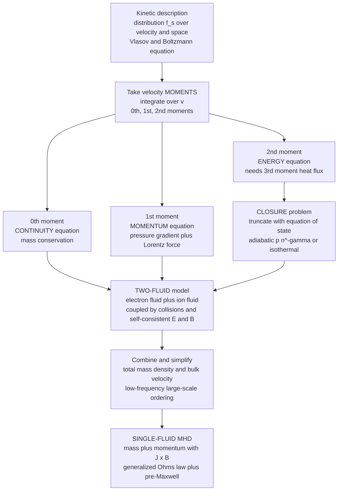

# ⚡ The Two-Fluid and MHD Models

> [!abstract] TL;DR
> Tracking every electron and ion in a plasma is hopeless, so we take **velocity moments** of the kinetic (Vlasov/Boltzmann) equation and collapse the swarm of particles into smooth *fluids*. The 0th moment gives **continuity** (mass), the 1st gives **momentum** (pressure gradient + Lorentz force), the 2nd gives **energy** — but each equation drags in the next moment, so the chain never closes and we truncate it with an **equation of state**. Keeping a separate electron fluid and ion fluid gives the **two-fluid model** (Hall physics, plasma oscillations, species separation); merging them into one conducting fluid — total mass density, a bulk velocity, a $\mathbf{J}\times\mathbf{B}$ force, and a **generalized Ohm's law** — gives **magnetohydrodynamics (MHD)**, valid at low frequency ($\omega\ll\omega_{ci}$) and large scale ($L\gg r_{Li}$). MHD is how we understand solar flares, the geodynamo, and the wobble of a fusion reactor.

---

## Intuition

**Analogy FIRST.** Tracking every electron and ion in a plasma is hopeless — there are $10^{20}$ of them per cubic metre, each on its own tangled orbit. So we zoom out until the swirling particles blur into a smooth **fluid**, exactly the way a crowd of people becomes a flowing river when you watch it from an aeroplane. You lose the individual, but you gain the *current*.

First we keep **two rivers** flowing through each other: a light, nimble **electron fluid** and a heavy, sluggish **ion fluid**. Because the electrons are $\sim\!1800\times$ lighter, they respond fast and carry most of the current, while the ions provide the mass and inertia. That is the **two-fluid model**, and it still remembers fast, small-scale effects — plasma oscillations, Hall drifts, two-stream streaming.

Then we blur even further, merging the two rivers into **ONE electrically conducting fluid** carried along by magnetic field lines. This is **MHD**: the plasma as a magnetized liquid. It forgets the fast electron jitter and the tiny gyro-orbits, keeping only the slow, large-scale bulk motion — and that is precisely the scale on which stars, planets, and tokamaks actually live.

---

## How It Works

### Core mechanics — from kinetic theory to fluids

1. **Start kinetic.** The full description is the distribution function $f_s(\mathbf{x},\mathbf{v},t)$ for each species $s$ (electrons, ions), evolving under the **Vlasov/Boltzmann equation** $\partial_t f_s + \mathbf{v}\cdot\nabla_x f_s + \frac{q_s}{m_s}(\mathbf{E}+\mathbf{v}\times\mathbf{B})\cdot\nabla_v f_s = (\partial_t f_s)_{\text{coll}}$. This is six-dimensional and far too much detail.

2. **Take velocity moments.** Multiply the kinetic equation by successive powers of $\mathbf{v}$ and integrate over all velocities $\int d^3v$:
   - **0th moment** ($\times 1$) $\Rightarrow$ **continuity**: $\partial_t n_s + \nabla\cdot(n_s \mathbf{u}_s)=0$ (mass conservation).
   - **1st moment** ($\times\, m_s\mathbf{v}$) $\Rightarrow$ **momentum**: $m_s n_s \dfrac{D\mathbf{u}_s}{Dt} = -\nabla\cdot\mathbf{P}_s + q_s n_s(\mathbf{E}+\mathbf{u}_s\times\mathbf{B}) + \mathbf{R}_s$, where $\mathbf{P}_s$ is the pressure tensor and $\mathbf{R}_s$ is the inter-species collisional friction.
   - **2nd moment** ($\times\, \tfrac12 m_s v^2$) $\Rightarrow$ **energy**, which introduces the **heat flux** $\mathbf{q}_s$ (a 3rd-moment quantity).

3. **The closure problem.** Each moment equation contains the *next* higher moment: continuity needs $\mathbf{u}$, momentum needs the pressure $\mathbf{P}$, energy needs the heat flux $\mathbf{q}$… The hierarchy never closes on its own. We **truncate** it by supplying an **equation of state** — most often **adiabatic** $p\,n^{-\gamma}=\text{const}$ (fast, no heat exchange) or **isothermal** $p=n k_B T$ with fixed $T$ (slow, perfectly conducting heat). This is the single most important modelling choice in fluid plasma theory.

4. **The two-fluid model.** Keep the electron and ion moment equations **separate** — each species has its own continuity, momentum, and energy equation. They are coupled two ways: (i) through **collisions** (the friction $\mathbf{R}_e=-\mathbf{R}_i$), and (ii) through the **self-consistent fields** $\mathbf{E},\mathbf{B}$ that all charges produce via Maxwell's equations. This model captures **plasma oscillations** (electrons ringing against ions), the **Hall effect**, **two-stream** instabilities, and any physics where electrons and ions move differently.

5. **Reduce to single-fluid MHD.** Define combined variables:
   - total mass density $\rho = n_e m_e + n_i m_i \approx n_i m_i$ (ions carry the mass),
   - center-of-mass (bulk) velocity $\mathbf{v} = \dfrac{n_e m_e \mathbf{u}_e + n_i m_i \mathbf{u}_i}{\rho}$,
   - current density $\mathbf{J} = \sum_s q_s n_s \mathbf{u}_s = e n(\mathbf{u}_i - \mathbf{u}_e)$ (electrons carry the current).

   Adding the two momentum equations, the internal collisional forces cancel and the **MHD momentum equation** emerges:
   $$\rho\frac{D\mathbf{v}}{Dt} = -\nabla p + \mathbf{J}\times\mathbf{B}.$$
   *Subtracting* them (the electron equation, solved for $\mathbf{E}$) gives the **generalized Ohm's law**:
   $$\mathbf{E} + \mathbf{v}\times\mathbf{B} = \underbrace{\eta\mathbf{J}}_{\text{resistive}} + \underbrace{\frac{\mathbf{J}\times\mathbf{B}}{ne}}_{\text{Hall}} - \underbrace{\frac{\nabla p_e}{ne}}_{\text{electron pressure}} + \underbrace{\frac{m_e}{ne^2}\frac{\partial\mathbf{J}}{\partial t}}_{\text{electron inertia}}.$$
   **Dropping terms** defines the models: keep only $\eta\mathbf{J}$ → **resistive MHD**; drop even that ($\eta\to0$) → **ideal MHD** with $\mathbf{E}+\mathbf{v}\times\mathbf{B}=0$ (frozen-in flux); retain the Hall term → **Hall MHD** (two-fluid physics leaking back in).

6. **Close with pre-Maxwell + quasineutrality.** MHD uses the **pre-Maxwell** equations — Ampère's law *without* the displacement current, $\nabla\times\mathbf{B}=\mu_0\mathbf{J}$, plus Faraday's law $\partial_t\mathbf{B}=-\nabla\times\mathbf{E}$ and $\nabla\cdot\mathbf{B}=0$ — and assumes **quasineutrality** $n_e\approx Z n_i$ (charge separation is confined to the tiny Debye length). Combining Faraday + Ohm gives the **induction equation** $\partial_t\mathbf{B}=\nabla\times(\mathbf{v}\times\mathbf{B})+\frac{\eta}{\mu_0}\nabla^2\mathbf{B}$.

7. **The ordering that justifies MHD.** All the fast, small-scale physics is thrown away by an explicit **ordering**: MHD is valid when the frequency is *below* the ion cyclotron frequency ($\omega\ll\omega_{ci}$), the scale is *larger* than the ion Larmor radius and ion skin depth ($L\gg r_{Li},\,d_i$), and the flow is sub-Alfvénic/quasineutral. In that corner, electron inertia, Hall drifts, and charge separation all wash out, leaving one magnetized fluid.

### Flow / Architecture



---

## Key Concepts

### Secondary Level

- **Too many particles to track.** A plasma has astronomically many electrons and ions. Instead of following each one, we average over them to get a smooth *fluid* — density, flow velocity, pressure — just like treating air as a continuous gas.
- **Two fluids, then one.** First we picture a light electron fluid and a heavy ion fluid flowing through each other (the **two-fluid** picture). Then we merge them into a single **conducting fluid** carried by magnetic field lines — that is **MHD**.
- **Averaging (moments).** "Moments" just means weighted averages of the particle velocities: the count gives **density**, the average velocity gives the **flow**, and the spread gives the **pressure/temperature**.
- **MHD is the slow, big picture.** MHD deliberately ignores the fast electron jitter and the tiny circular gyro-orbits, keeping only the large-scale, slow motion — the scale on which the Sun, Earth's core, and fusion reactors behave.

### Undergraduate Level

- **The moment hierarchy.** Multiply the kinetic equation by $1,\ m\mathbf{v},\ \tfrac12 m v^2$ and integrate over $\mathbf{v}$: you get **continuity**, **momentum** (with $-\nabla p + q n(\mathbf{E}+\mathbf{u}\times\mathbf{B})$), and **energy**. Each equation needs the next moment — an open-ended chain.
- **Closure = equation of state.** Because the chain never closes, you impose $p\propto n^\gamma$ (adiabatic, $\gamma=5/3$) or $T=\text{const}$ (isothermal). Choice of closure changes the sound speed and wave physics.
- **Two-fluid variables.** Electron and ion continuity + momentum, coupled by collisional friction $\mathbf{R}_e=-\mathbf{R}_i$ and by shared $\mathbf{E},\mathbf{B}$. Retains $\omega_{pe}$ (electron plasma oscillations), $\omega_{ci}/\omega_{ce}$ cyclotron motion, and species drift.
- **Single-fluid reduction.** $\rho=\sum n_s m_s$, bulk velocity $\mathbf{v}$ (mass-weighted, ion-dominated), current $\mathbf{J}=\sum q_s n_s\mathbf{u}_s$ (electron-dominated). *Sum* momentum → MHD momentum with $\mathbf{J}\times\mathbf{B}$; *difference* → generalized Ohm's law.
- **Pre-Maxwell.** MHD drops the displacement current: $\nabla\times\mathbf{B}=\mu_0\mathbf{J}$, so $\mathbf{J}$ is *slaved* to $\mathbf{B}$, and light-speed EM waves are removed. Quasineutrality removes Poisson's equation for charge separation.
- **Ideal vs resistive.** Ideal MHD: $\mathbf{E}+\mathbf{v}\times\mathbf{B}=0$ (perfect conductor, frozen-in flux). Resistive MHD: $\mathbf{E}+\mathbf{v}\times\mathbf{B}=\eta\mathbf{J}$ — the resistivity $\eta$ enables diffusion and reconnection.

### Graduate Level

- **Generalized Ohm's law, term by term.** $\mathbf{E}+\mathbf{v}\times\mathbf{B}=\eta\mathbf{J}+\frac{1}{ne}\mathbf{J}\times\mathbf{B}-\frac{1}{ne}\nabla p_e+\frac{m_e}{ne^2}\partial_t\mathbf{J}$. The **Hall** term matters when $L\lesssim d_i=c/\omega_{pi}$ (ion skin depth); the **electron pressure** term drives the Biermann battery and reconnection E-field; the **electron inertia** term matters at $L\lesssim d_e=c/\omega_{pe}$ and $\omega\sim\omega_{pe}$. Ideal MHD keeps *none* of the right-hand side except (in resistive MHD) $\eta\mathbf{J}$.
- **The MHD ordering formally.** Expand in the smallness parameters $\omega/\omega_{ci}\ll1$, $r_{Li}/L\ll1$, and $v/v_A\lesssim1$. To leading order the electron momentum equation gives quasineutrality and force balance; Hall and inertia terms are $O(r_{Li}/L)$ and drop. This is the rigorous justification, not hand-waving.
- **Anisotropic closures.** A magnetized collisionless plasma has $p_\parallel\ne p_\perp$; the **CGL (Chew–Goldberger–Low) double-adiabatic** closure gives two invariants ($p_\perp/(\rho B)$ and $p_\parallel B^2/\rho^3$). **Braginskii** transport supplies the collisional closure (resistivity, viscosity, heat conduction) for the two-fluid equations.
- **What MHD throws away.** No Langmuir/EM waves (removed by pre-Maxwell), no cyclotron resonances, no Landau damping (a kinetic effect invisible to any finite moment truncation), no charge-separation electrostatics beyond $\lambda_D$. Recovering these needs kinetic theory (Vlasov) or gyrokinetics.
- **Hierarchy of models.** Vlasov (kinetic) $\to$ gyrokinetic $\to$ two-fluid/Braginskii $\to$ Hall MHD $\to$ resistive MHD $\to$ ideal MHD, each a further coarse-graining trading physics for tractability.

---

## Python Demo

```python
# From two fluids to MHD, in two pictures:
#   (a) THE MOMENT HIERARCHY -- take velocity moments of a Maxwellian:
#         0th moment -> density n, 1st -> flow u, 2nd (central) -> pressure p.
#       Plus a schematic of WHY the hierarchy never closes (the closure problem).
#   (b) THE ORDERING that justifies MHD -- plot the characteristic FREQUENCIES
#       and LENGTH SCALES on log axes. MHD lives at the LOW-frequency, LARGE-scale
#       end, where the fast two-fluid/kinetic details wash out.
import numpy as np
import matplotlib.pyplot as plt

# ---- Physical constants (SI) ----
e    = 1.602176634e-19     # elementary charge, C
eps0 = 8.8541878128e-12    # vacuum permittivity, F/m
me   = 9.1093837015e-31    # electron mass, kg
mp   = 1.67262192369e-27   # proton mass, kg
c    = 2.99792458e8        # speed of light, m/s
kB   = 1.380649e-23        # Boltzmann constant, J/K
mu0  = 1.25663706212e-6    # vacuum permeability, H/m

fig = plt.figure(figsize=(14, 10))

# ==================================================================
# (a) MOMENT HIERARCHY: numerically recover n, u, p from a Maxwellian
#     f(v) = n / (sqrt(2 pi) v_th) * exp(-(v-u)^2 / (2 v_th^2))   (1-D)
#     0th moment  int f dv           = n        (density)
#     1st moment  int v f dv / n     = u        (bulk flow)
#     2nd central int m (v-u)^2 f dv = p = n kT (pressure)
# ==================================================================
n_true = 1.0e19            # density [1/m^3]
u_true = 3.0e5             # drift velocity [m/s]
T_eV   = 200.0             # temperature [eV]
T_K    = T_eV * e / kB     # temperature [K]
vth    = np.sqrt(kB * T_K / mp)                       # ion thermal speed [m/s]

v  = np.linspace(u_true - 6*vth, u_true + 6*vth, 40000)
f  = n_true / (np.sqrt(2*np.pi)*vth) * np.exp(-(v - u_true)**2 / (2*vth**2))

M0 = np.trapz(f, v)                        # -> density n
M1 = np.trapz(v * f, v) / M0               # -> bulk velocity u
p  = mp * np.trapz((v - M1)**2 * f, v)     # -> pressure p = n kB T
T_eV_rec = p / (M0 * e)                    # recovered temperature [eV]

axA = fig.add_subplot(2, 2, 1)
axA.plot(v/1e5, f, 'b-', lw=2)
axA.fill_between(v/1e5, f, alpha=0.15, color='b',
                 label=f"0th moment: area = n = {M0:.2e}")
axA.axvline(M1/1e5, color='r', ls='--', lw=2,
            label=f"1st moment: u = {M1/1e5:.2f} x1e5 m/s")
sig = np.sqrt(p/(M0*mp))                    # width = sqrt(p/(n m)) = v_th
axA.annotate("", xy=((M1+sig)/1e5, f.max()*0.6), xytext=((M1-sig)/1e5, f.max()*0.6),
             arrowprops=dict(arrowstyle='<->', color='green', lw=2))
axA.text(M1/1e5, f.max()*0.66, f"2nd moment -> p = {p:.2e} Pa",
         color='green', ha='center', fontsize=8)
axA.set_xlabel("velocity  v  [x1e5 m/s]")
axA.set_ylabel("distribution  f(v)")
axA.set_title("(a) Velocity moments of a Maxwellian -> n, u, p")
axA.legend(fontsize=8, loc='upper left'); axA.grid(alpha=0.3)

# ---- moment-closure schematic (why the chain never closes) ----
axS = fig.add_subplot(2, 2, 2)
axS.axis('off')
levels = [("moment 0", "CONTINUITY   d_t n + div(n u) = 0", "needs u (moment 1)"),
          ("moment 1", "MOMENTUM   rho Du/Dt = -grad p + qn(E+uxB)", "needs p (moment 2)"),
          ("moment 2", "ENERGY   d_t p + ... = -div q", "needs q (moment 3)"),
          ("moment 3", "HEAT FLUX q ...", "needs moment 4 ... (open)")]
for i, (mom, eqn, need) in enumerate(levels):
    y = 0.9 - i*0.22
    axS.add_patch(plt.Rectangle((0.02, y-0.07), 0.66, 0.12,
                  facecolor='#e8f0ff', edgecolor='#4a9eff'))
    axS.text(0.05, y-0.005, f"{mom}:  {eqn}", fontsize=8, va='center')
    axS.text(0.72, y-0.005, need, fontsize=7.5, va='center', color='#b5651d')
    if i < len(levels)-1:
        axS.annotate("", xy=(0.35, y-0.09), xytext=(0.35, y-0.07),
                     arrowprops=dict(arrowstyle='->', color='k'))
axS.add_patch(plt.Rectangle((0.02, 0.02), 0.9, 0.11,
              facecolor='#fff2cc', edgecolor='#d6b656'))
axS.text(0.47, 0.075,
         "CLOSURE: truncate with an equation of state\n"
         "adiabatic  p n^(-gamma) = const   or   isothermal  T = const",
         fontsize=8.5, ha='center', va='center')
axS.set_title("The closure problem: each moment needs the next")

# ==================================================================
# (b) THE MHD ORDERING: characteristic frequencies & length scales
#     Tokamak-core-like parameters.
# ==================================================================
n  = 1.0e20      # density [1/m^3]
B  = 5.0         # magnetic field [T]
Te = 10.0e3      # electron temperature [eV]
Ti = 10.0e3      # ion temperature [eV]
L  = 1.0         # system size [m]

wpe = np.sqrt(n * e**2 / (eps0 * me))     # electron plasma frequency
wpi = np.sqrt(n * e**2 / (eps0 * mp))     # ion plasma frequency
wce = e * B / me                          # electron cyclotron frequency
wci = e * B / mp                          # ion cyclotron frequency
vthe = np.sqrt(Te * e / me)               # electron thermal speed
vthi = np.sqrt(Ti * e / mp)               # ion thermal speed
vA   = B / np.sqrt(mu0 * n * mp)          # Alfven speed
w_mhd = vA / L                            # MHD/Alfven frequency  (~ k v_A, k ~ 1/L)

lam_D = vthe / wpe                        # Debye length
rLe   = vthe / wce                        # electron Larmor radius
rLi   = vthi / wci                        # ion Larmor radius
d_e   = c / wpe                           # electron skin depth
d_i   = c / wpi                           # ion skin depth

# ---- frequency ladder ----
freqs = [("MHD / Alfven  v_A/L", w_mhd, '#51cf66'),
         ("ion cyclotron  w_ci", wci,   '#51cf66'),
         ("ion plasma  w_pi",    wpi,   '#4a9eff'),
         ("electron plasma  w_pe", wpe, '#ff6b6b'),
         ("electron cyclotron  w_ce", wce, '#ff6b6b')]
axF = fig.add_subplot(2, 2, 3)
for i, (name, val, col) in enumerate(freqs):
    axF.scatter(val, i, s=90, color=col, zorder=3)
    axF.text(val*1.5, i, f"{name}", va='center', fontsize=8)
axF.axvspan(1e5, wci, color='#51cf66', alpha=0.12)
axF.text(np.sqrt(1e5*wci), 4.4, "MHD valid\n(low frequency, w << w_ci)",
         ha='center', fontsize=8, color='#2b8a3e')
axF.set_xscale('log'); axF.set_xlim(1e6, 1e13); axF.set_ylim(-0.6, 4.9)
axF.set_yticks([]); axF.set_xlabel("angular frequency  [rad/s]")
axF.set_title("(b1) Frequency ordering: MHD is the SLOW corner")
axF.grid(axis='x', alpha=0.3, which='both')

# ---- length-scale ladder ----
scales = [("Debye length  lambda_D", lam_D, '#ff6b6b'),
          ("electron Larmor  r_Le",  rLe,   '#ff6b6b'),
          ("electron skin depth  d_e", d_e, '#4a9eff'),
          ("ion Larmor  r_Li",       rLi,   '#4a9eff'),
          ("ion skin depth  d_i",    d_i,   '#4a9eff'),
          ("system size  L",         L,     '#51cf66')]
axL = fig.add_subplot(2, 2, 4)
for i, (name, val, col) in enumerate(scales):
    axL.scatter(val, i, s=90, color=col, zorder=3)
    axL.text(val*1.5, i, f"{name}", va='center', fontsize=8)
axL.axvspan(rLi, 1e2, color='#51cf66', alpha=0.12)
axL.text(np.sqrt(rLi*1e2), 5.5, "MHD valid\n(large scale, L >> r_Li, d_i)",
         ha='center', fontsize=8, color='#2b8a3e')
axL.set_xscale('log'); axL.set_xlim(1e-5, 1e2); axL.set_ylim(-0.6, 6.0)
axL.set_yticks([]); axL.set_xlabel("length scale  [m]")
axL.set_title("(b2) Scale ordering: MHD is the LARGE-scale corner")
axL.grid(axis='x', alpha=0.3, which='both')

plt.tight_layout()
plt.savefig("two_fluid_and_mhd.png", dpi=130)
plt.show()

# ---- printed sanity check ----
print("MOMENT HIERARCHY (Maxwellian, should recover the inputs):")
print(f"  0th moment  n = {M0:.4e}  (input {n_true:.4e})")
print(f"  1st moment  u = {M1:.4e}  (input {u_true:.4e})")
print(f"  2nd moment  T = {T_eV_rec:.2f} eV  (input {T_eV:.2f} eV)")
print("\nMHD ORDERING (tokamak-like: n=1e20, B=5 T, T=10 keV, L=1 m):")
print(f"  frequencies [rad/s]:  w_MHD={w_mhd:.2e} << w_ci={wci:.2e} "
      f"<< w_pi={wpi:.2e} < w_pe={wpe:.2e} ~ w_ce={wce:.2e}")
print(f"  lengths [m]:  lambda_D={lam_D:.2e} ~ r_Le={rLe:.2e} < d_e={d_e:.2e} "
      f"< r_Li={rLi:.2e} < d_i={d_i:.2e} << L={L:.2e}")
```

Running it confirms the moments of the Maxwellian recover the input density, drift, and temperature to machine precision (the whole point of the moment procedure), and the two ladders make the MHD ordering visual: the **MHD/Alfvén frequency sits four to five decades below** the ion cyclotron frequency, and the **system size sits two to three decades above** the ion Larmor radius and ion skin depth. MHD is precisely the low-frequency, large-scale corner where the electron jitter, gyromotion, and charge separation of the two-fluid picture have all averaged away.

---

## Real-World Applications

- **Fusion (tokamaks, stellarators).** The equilibrium of a magnetically confined plasma — where does the pressure balance the $\mathbf{J}\times\mathbf{B}$ force — is a *single-fluid* MHD problem (the Grad–Shafranov equation). MHD **stability** (kink, ballooning, tearing modes) sets the operational pressure and current limits of ITER; two-fluid/Hall corrections govern fast reconnection during sawtooth crashes and disruptions.
- **The solar corona and flares.** Coronal loops, filaments, and the magnetic energy stored before a flare are modelled with ideal MHD; the flare itself is **reconnection**, where finite resistivity and the Hall/electron-pressure terms of generalized Ohm's law break the frozen-in condition in thin current sheets.
- **The geodynamo and planetary fields.** Earth's liquid-iron outer core is a conducting MHD fluid whose convective motion regenerates the geomagnetic field — a direct application of the induction equation derived from Ohm's law.
- **The solar wind and space weather.** The heliospheric magnetic field, the Parker spiral, and coronal mass ejections propagating to Earth are large-scale MHD flows; but *kinetic and two-fluid* effects (ion-scale turbulence at $d_i$, temperature anisotropy) appear where spacecraft resolve the small scales.
- **Astrophysical accretion and jets.** The magnetorotational instability that drives accretion-disk turbulence, and the launching of relativistic jets from black holes, are MHD (and Hall-MHD in weakly ionized disk regions) phenomena.
- **Industrial MHD.** Liquid-metal cooling and electromagnetic pumps/stirrers in metallurgy and fission reactors are low-magnetic-Reynolds-number MHD, where the resistive term dominates.

---

## Common Pitfalls

- **Forgetting the hierarchy of approximations.** Kinetic $\to$ two-fluid $\to$ MHD is a *ladder of coarse-grainings*, each valid in a narrower regime. Two-fluid holds when species move differently but collisions/fields still let a fluid picture stand; MHD holds only in the low-frequency, large-scale, quasineutral corner. Using MHD outside that corner (e.g., at the ion skin depth, or for Langmuir waves) gives wrong physics.
- **Ignoring the closure problem.** The moment equations **never close** — every level invokes the next moment. You *must* supply an equation of state (adiabatic vs isothermal). Pretending the chain closes by itself, or choosing the wrong closure, changes the sound speed, the wave modes, and stability thresholds.
- **Treating MHD as exact.** MHD is intrinsically **low-frequency ($\omega\ll\omega_{ci}$), large-scale ($L\gg r_{Li}$), and quasineutral**. It cannot describe cyclotron resonances, plasma oscillations, or anything at kinetic scales. Landau damping in particular is *invisible* to any finite moment truncation.
- **Dropping the wrong Ohm's-law terms.** Ideal MHD is $\mathbf{E}+\mathbf{v}\times\mathbf{B}=0$; resistive MHD adds $\eta\mathbf{J}$. The **Hall term** $\mathbf{J}\times\mathbf{B}/(ne)$ becomes essential at $L\lesssim d_i$ (fast reconnection, whistler/kinetic-Alfvén physics), the **electron-pressure term** drives the reconnection electric field and the Biermann battery, and the **electron-inertia term** matters only near $d_e$ and $\omega\sim\omega_{pe}$. Keeping/dropping the right terms *defines* which model you are actually solving.
- **Forgetting MHD drops charge separation and the displacement current.** MHD assumes **quasineutrality** ($n_e\approx Zn_i$, valid beyond $\lambda_D$) and uses **pre-Maxwell** Ampère's law ($\nabla\times\mathbf{B}=\mu_0\mathbf{J}$, no $\partial_t\mathbf{E}$). This removes electrostatic waves and light-speed EM waves; do not use MHD where those matter.
- **Confusing the single-fluid velocity with species velocities.** The MHD bulk velocity $\mathbf{v}$ is the *mass-weighted* (ion-dominated) center-of-mass velocity, while the current $\mathbf{J}=ne(\mathbf{u}_i-\mathbf{u}_e)$ is set by the *relative* drift (electron-dominated). $\mathbf{v}\ne\mathbf{u}_e\ne\mathbf{u}_i$ in general — collapsing them loses the Hall physics.

---

## Related Concepts

- [[Magnetohydrodynamics]] — the Physics/10 survey of ideal MHD, Alfvén waves, reconnection, and dynamos; **this note supplies the derivation and the two-fluid precursor** behind that survey.
- [[Plasma_Physics_Overview]] — the map of the whole subject; the fluid models sit between single-particle motion and full kinetic theory.
- [[Plasma_Oscillations_and_Frequency]] — $\omega_{pe}$ is a *two-fluid* (electron vs ion) effect that MHD deliberately filters out; it sets the high-frequency edge of the ordering diagram.
- [[Debye_Shielding_and_Plasma_Parameters]] — the Debye length $\lambda_D$ is the scale below which charge separation lives; quasineutrality in MHD holds only for $L\gg\lambda_D$.
- [[Single_Particle_Motion_and_Drifts]] — the Larmor radius $r_L$ and guiding-centre drifts define the small-scale limit ($L\gg r_{Li}$) that MHD averages over.
- [[Collisions_and_Transport_in_Plasmas]] — supplies the collisional friction $\mathbf{R}_s$ coupling the two fluids and the Spitzer resistivity $\eta$ that appears in the generalized Ohm's law.
- [[Kinetic_Theory_of_Gases]] — the same moment-taking idea (Boltzmann equation $\to$ Euler/Navier–Stokes) that underlies the plasma fluid equations.
- [[Maxwells_Equations]] — MHD uses the *pre-Maxwell* form (no displacement current) plus quasineutrality; Faraday + Ohm gives the induction equation.
- [[Euler_Equations_and_Ideal_Fluids]] — the neutral-fluid analogue; MHD momentum is Euler's equation plus the $\mathbf{J}\times\mathbf{B}$ force and a magnetic pressure/tension.
- [[Conservation_Laws_and_Control_Volumes]] — the mass/momentum/energy conservation structure that the 0th/1st/2nd moments reproduce for a plasma.

*Section roadmap (siblings, some planned): this opener sets up **Kinetic_Theory_and_the_Vlasov_Equation** (the level above the fluids), **Ideal_MHD_and_Frozen_In_Flux** (dropping every Ohm's-law term but keeping $\mathbf{E}+\mathbf{v}\times\mathbf{B}=0$), **MHD_Equilibrium_and_the_Grad_Shafranov_Equation** (force balance $\nabla p=\mathbf{J}\times\mathbf{B}$), and **MHD_Waves_and_Alfven_Waves** (the linear modes of the single fluid). Together they build out the S03 Magnetohydrodynamics section.*

---

## Review Questions

1. **(Secondary)** Why can't we just track every electron and ion in a plasma, and what do we gain by treating the particles as one or two smooth *fluids* instead? Using the crowd-becomes-a-river analogy, explain what "zooming out" to MHD makes us forget.
2. **(Undergraduate)** Explain the **closure problem**: why does taking the 0th, 1st, and 2nd velocity moments of the kinetic equation produce a chain of equations that never closes? How does an **equation of state** (adiabatic vs isothermal) fix this, and what physical assumption does each closure encode?
3. **(Graduate)** Starting from the two-fluid (electron + ion) momentum equations, sketch how *adding* them yields the MHD momentum equation with the $\mathbf{J}\times\mathbf{B}$ force while *subtracting* them yields the **generalized Ohm's law**. For a tokamak-scale plasma ($n\sim10^{20}\,\mathrm{m^{-3}}$, $B\sim5\,\mathrm{T}$, $L\sim1\,\mathrm{m}$), estimate the ion skin depth $d_i$ and ion Larmor radius $r_{Li}$, and state at which scales the **Hall** and **electron-inertia** terms of Ohm's law can no longer be dropped.

---

## Sources

- Freidberg, J. P. *Ideal Magnetohydrodynamics* (Plenum, 1987) — derivation of the MHD model from the two-fluid equations and the MHD ordering.
- Chen, F. F. *Introduction to Plasma Physics and Controlled Fusion*, 3rd ed. (Springer, 2016) — Ch. 3, the fluid equations, moments, and the single-fluid reduction.
- Goldston, R. J. & Rutherford, P. H. *Introduction to Plasma Physics* (IOP, 1995) — two-fluid model, generalized Ohm's law, and MHD limits.
- Boyd, T. J. M. & Sanderson, J. J. *The Physics of Plasmas* (Cambridge University Press, 2003) — moment hierarchy, closure, and the transition from kinetic to fluid descriptions.
- Bellan, P. M. *Fundamentals of Plasma Physics* (Cambridge University Press, 2006) — velocity moments, two-fluid equations, and the MHD Ohm's law term-by-term.

---

#plasma-physics #magnetohydrodynamics #two-fluid-model #fluid-moments #generalized-ohms-law
