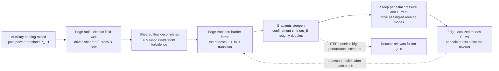

# 🔥 Confinement, Transport, and the H-Mode

> [!abstract] TL;DR
> How long a magnetically confined plasma holds its heat is captured by a single figure of merit — the **energy confinement time** $\tau_E = W/P_{\text{loss}}$ (stored energy over loss power) — and it is the number that decides whether a reactor ignites. The catch: because **anomalous (turbulent) transport** dominates the collisional baseline, $\tau_E$ **cannot be predicted from first principles**, so the field leans on empirical **scaling laws** (ITER89-P for L-mode, **ITER98(y,2)** for H-mode) — power laws in current, field, size, density, and power — to extrapolate to **ITER**. These laws carry an unwelcome message: confinement **degrades** with heating power, $\tau_E \propto P^{-0.7}$. The great reprieve is the **H-mode**: discovered on **ASDEX (Wagner, 1982)**, when auxiliary heating crosses a **power threshold** the plasma *spontaneously* jumps from Low to High confinement. The mechanism is **sheared $\mathbf{E}\times\mathbf{B}$ flow** (edge radial electric field plus zonal flows) that **shreds the edge turbulence**, building a narrow **edge transport barrier** — the **pedestal** — where gradients steepen and $\tau_E$ roughly **doubles**. H-mode is the **ITER baseline scenario**. The price: the steep pedestal is unstable to **edge-localized modes (ELMs)** — peeling-ballooning bursts that can **sandblast** plasma-facing components — so a reactor needs **ELM control** (RMPs, pellet pacing, QH-mode, I-mode). The pedestal is the linchpin of fusion performance: the bridge from turbulence physics to real reactor projections.

## Intuition — ANALOGY FIRST

A fusion plasma leaks heat like a **poorly insulated house in winter**. You crank the furnace, but warmth pours straight out through the walls — and not by any slow, well-behaved trickle. Turbulent eddies act like gale-force draughts inside the walls, physically **carrying heat outward far faster** than any calm, molecule-to-molecule process should allow. Pour in more heating power and, frustratingly, the house leaks *even faster* — the harder you push, the leakier the insulation gets. That is the transport problem, and the number that measures it is the **energy confinement time**: how many seconds of heat the house holds before it all escapes.

Then, in 1982, physicists stumbled onto something close to magic. On the ASDEX tokamak, if you crank the heating **past a certain threshold**, the plasma **spontaneously grows its own insulation**. A thin barrier forms right at the edge — a region where the internal draughts are suddenly **sheared apart and stop dead**. Heat can no longer stroll out; it has to climb a steep new wall. Confinement roughly **doubles**, all by itself. This "**High-confinement mode**" — **H-mode** — was so important that it became the **baseline design point for ITER**, the reactor meant to prove fusion at power-plant scale.

But there is no free lunch. That freshly grown insulating edge sits under enormous pressure, and like a **pressure cooker with a jiggling valve**, it periodically **bursts** to relieve itself. Each burst — an **edge-localized mode**, or **ELM** — flings a slug of edge heat and particles at the reactor wall in a fraction of a millisecond, and in a full-scale machine those bursts can **sandblast** the very components meant to survive the plasma. Building the insulation was the breakthrough; keeping it from exploding is the engineering war.

---

## How It Works

### Core Mechanics

**1. The figure of merit: energy confinement time.** Define the plasma's stored thermal energy $W = \tfrac{3}{2}\int (n_e T_e + n_i T_i)\,dV$ and the power leaking out, $P_{\text{loss}}$. In steady state the loss is balanced by heating, $P_{\text{loss}} = P_{\text{heat}}$, and the **energy confinement time** is
$$\tau_E = \frac{W}{P_{\text{loss}}}.$$
It is simply *how long the plasma would keep its heat if you switched the furnace off* — the single most important performance number, because fusion power gates on the **Lawson triple product** $n T \tau_E$. Double $\tau_E$ and you slash the size, field, and cost needed to reach ignition.

**2. Why we cannot compute it — anomalous transport.** If transport were **classical** (collisions of gyrating particles, $D \sim \rho_i^2 \nu$) or even **neoclassical** (adding toroidal-geometry banana-orbit corrections), we could predict $\tau_E$ from first principles. But measured transport is **one to three orders of magnitude larger** — it is **anomalous**, driven by drift-wave microturbulence (ITG, TEM, ETG) whose fluctuating $\mathbf{E}\times\mathbf{B}$ eddies ferry heat across the field (see [[Plasma_Turbulence_and_Nonlinear_Dynamics]]). Turbulence is a hard, still-unsolved nonlinear problem, so $\tau_E$ resists first-principles prediction.

**3. The empirical crutch: scaling laws.** Because theory alone cannot deliver $\tau_E$, the field fits **multi-machine databases** to power laws in the engineering knobs. Two are canonical:
- **ITER89-P (L-mode):** $\tau_E \propto I_p^{0.85}\, B^{0.2}\, n^{0.1}\, P^{-0.5}\, R^{1.2}\, \dots$
- **ITER98(y,2) / IPB98(y,2) (H-mode):** $\tau_E \propto I_p^{0.93}\, B^{0.15}\, n^{0.41}\, P^{-0.69}\, R^{1.97}\, \kappa^{0.78}\, \dots$

Read the exponents like a strategy guide: **plasma current $I_p$ is king** (strong, favorable $\sim I_p^{0.93}$), toroidal field $B$ matters weakly, **size $R$ helps a lot**, and — the sting — **heating power hurts**, $\tau_E \propto P^{-0.69}$. This is **power degradation**: the more you heat, the leakier the confinement, exactly the poorly-insulated-house behavior. These fits are the backbone of every **ITER** performance projection, which is precisely why their uncertainty is a live scientific worry.

**4. The L-H transition — spontaneous insulation.** Raise the heating past a **power threshold** $P_{\text{LH}}$ (itself scaling roughly as $P_{\text{LH}} \propto n^{0.7} B^{0.8} S$, with $S$ the plasma surface area) and the plasma **bifurcates** from Low (L) to High (H) confinement. The trigger is a self-reinforcing feedback at the plasma edge: a **radial electric field well** $E_r$ develops, its **$\mathbf{E}\times\mathbf{B}$ flow shear** decorrelates and tears apart the edge turbulent eddies, transport drops, the pressure gradient steepens, which deepens $E_r$ further — a runaway that locks in a **narrow edge transport barrier**. This is the turbulence–zonal-flow **predator-prey** dynamic realizing itself as a macroscopic phase change (see [[Feedback_Loops_and_Causality]], [[Bifurcations_and_Tipping_Points]]).

**5. The pedestal — where confinement is won.** The edge barrier appears in the profiles as a **pedestal**: a few-centimeter-wide region near the last closed flux surface where temperature and density gradients become almost vertical, so the whole core profile is **lifted up** as if sitting on a raised platform. Because tokamak core profiles are **stiff** (they resist steepening — turbulence pins the core gradient near a critical value), *the pedestal height largely sets the global stored energy*. Get a taller pedestal and the entire plasma benefits — hence H-mode's rough **doubling** of $\tau_E$ over L-mode at the same knobs.

**6. The price — edge-localized modes (ELMs).** A steep pedestal stores steep pressure gradient and edge current, which is exactly the fuel for **peeling-ballooning** MHD instabilities (see [[Ideal_MHD_and_Frozen_In_Flux]], [[Hydrodynamic_Instabilities]]). When the pedestal climbs to the stability boundary it **crashes**: a **Type-I ELM** expels roughly 5-15 percent of the pedestal energy in under a millisecond, the pedestal rebuilds, and it crashes again — a quasi-periodic cycle. In a reactor those transient heat pulses **exceed material limits** on the divertor, so **ELM control** (resonant magnetic perturbations, pellet pacing, or naturally small/no-ELM regimes like QH-mode and I-mode) is not optional — it is a reactor-enabling requirement.

**7. Going further — internal transport barriers.** The same barrier trick can be pulled in the **core**, not just the edge: reversed magnetic shear plus $\mathbf{E}\times\mathbf{B}$ shear can spawn an **internal transport barrier (ITB)**, steepening core gradients for advanced, high-performance, steady-state scenarios — at the cost of harder control and stability margins.

### Flow / Architecture



---

## Key Concepts

### Secondary Level

- **Confinement time** — how long a plasma holds onto its heat before it leaks away. Longer is better; it is the master number for fusion.
- **The leaky-house problem** — turbulent eddies carry heat out to the walls far faster than calm processes would, so plasmas are hard to keep hot. Worse, pushing more heating power in makes the leak *faster*, not slower.
- **H-mode (the self-grown insulation)** — crank the heating past a threshold and the plasma suddenly builds a thin insulating barrier at its edge; confinement roughly **doubles**. Discovered in 1982; it is the design baseline for the ITER reactor.
- **ELMs (the pressure-cooker vents)** — the new insulating edge is under such pressure that it periodically bursts, flinging heat at the wall. Controlling these bursts is a central reactor challenge.

### Undergraduate Level

- **$\tau_E = W/P_{\text{loss}}$** — stored thermal energy over loss power; in steady state, loss equals heating. Sets the Lawson triple product $n T \tau_E$ needed for ignition.
- **Anomalous vs classical/neoclassical transport** — the measured heat loss is far above collisional predictions because **turbulence**, not collisions, does the transporting. This is *why* $\tau_E$ needs empirical fitting.
- **Scaling laws (ITER89-P, ITER98(y,2))** — regression fits of $\tau_E$ to $I_p, B, n, P, R, \kappa$ across many machines. Key lessons: strong favorable current dependence, favorable size dependence, and **unfavorable power degradation** $\tau_E \propto P^{-0.7}$.
- **The L-H power threshold** — H-mode only switches on above a heating power $P_{\text{LH}}$ that grows with density, field, and machine surface area. Below threshold you are stuck in L-mode.
- **The pedestal** — the steep-gradient edge region that defines H-mode. Because core profiles are **stiff**, pedestal height largely determines global stored energy.
- **H-factor** — the ratio $H_{98} = \tau_{E,\text{exp}} / \tau_{E,\text{scaling}}$. $H_{98} \approx 1$ means "matches the H-mode scaling"; L-mode confinement is roughly half.
- **Type-I ELMs** — the peeling-ballooning pedestal crashes that expel edge energy; large and quasi-periodic, damaging to plasma-facing components.

### Graduate Level

- **Sheared-flow decorrelation (Biglari-Diamond-Terry).** Turbulence is suppressed when the $\mathbf{E}\times\mathbf{B}$ shearing rate $\omega_{E\times B} = \left| \frac{d}{dr}\!\left(\frac{E_r}{B}\right)\right|$ exceeds the turbulence decorrelation (growth) rate $\gamma_{\max}$. The edge $E_r$ well — set by the radial force balance $E_r = \frac{1}{Z e n_i}\nabla p_i - v_\theta B_\phi + v_\phi B_\theta$ — supplies the shear. This is the quantitative heart of the L-H transition and of ITB formation.
- **Predator-prey / bifurcation models.** Zero-dimensional models coupling turbulence intensity $\mathcal E$ and zonal/mean shear $V$ (e.g. Kim-Diamond) reproduce the **limit-cycle oscillations (I-phase / dithering)** seen just before the sharp transition, and cast the L-H transition as a **subcritical bifurcation** in heating power. The transition exhibits **hysteresis**: the H-L back-transition power is below $P_{\text{LH}}$.
- **The EPED pedestal model.** Predicts pedestal height and width self-consistently from two constraints: **peeling-ballooning** MHD stability (bounds the pressure gradient and edge bootstrap current) and **kinetic-ballooning-mode (KBM)** onset (sets the width-height relation $\Delta_{\text{ped}} \propto \beta_{\text{pol,ped}}^{1/2}$). It is the workhorse for projecting ITER pedestal performance.
- **Peeling-ballooning ELM cycle.** The pedestal builds until the edge $(j_{\text{edge}}, \nabla p)$ operating point pierces the peeling-ballooning stability boundary; the ELM crash relaxes the gradient and edge current; the pedestal rebuilds. **Type-I** (large, grows with heating), **Type-II/grassy** (small, high-shaping), and **Type-III** (near threshold) ELMs occupy different regions of the stability diagram.
- **ELM control strategies.** **RMPs** (resonant magnetic perturbations — 3D fields that increase edge transport and clamp the pedestal below the P-B limit; demonstrated on DIII-D, KSTAR, ASDEX-U; ITER has in-vessel RMP coils), **pellet pacing** (trigger frequent small ELMs), **QH-mode** (ELM-free; an edge harmonic oscillation provides steady particle transport), and **I-mode** (an energy barrier *without* a particle barrier — high $\tau_E$, no density pedestal, naturally ELM-free).
- **Bohm vs gyro-Bohm scaling.** Whether the turbulent diffusivity scales as $D_{\text{Bohm}} = \tfrac{1}{16} T/eB$ (worse for large machines) or $D_{\text{gB}} = \rho^\ast D_{\text{Bohm}}$ with $\rho^\ast = \rho_i/a$ (better for large machines) governs how confidently today's tokamaks extrapolate to ITER — a central reason the empirical scaling laws are treated with care.
- **$\tau_E$ vs pulse length.** Do not conflate the **energy confinement time** (a transport timescale, tenths of a second to seconds) with the **discharge/pulse length** (seconds to minutes to steady-state). A long pulse with poor $\tau_E$ still fails; the two are independent axes of reactor performance.

---

## Python Demo

```python
# Confinement, the L-H transition, and the pedestal.
#   (a) CONFINEMENT SCALING: energy confinement time tau_E vs heating power,
#       for an L-mode branch and an H-mode branch (simplified ITER98-style
#       power laws). Ramping power crosses the L-H threshold and tau_E JUMPS
#       up by ~2x, then keeps degrading as ~P^-0.69 along the H-branch.
#   (b) PEDESTAL PROFILES: temperature and pressure across the minor radius,
#       L-mode (smooth, low edge) vs H-mode (steep EDGE PEDESTAL lifting the
#       whole core). Integrated pressure gives the ~2x stored-energy gain.
#   (c) ELM CYCLE: edge pedestal pressure as a sawtooth -- builds toward the
#       peeling-ballooning stability limit, CRASHES, rebuilds.
import numpy as np
import matplotlib.pyplot as plt

# ============================================================
# (a) CONFINEMENT SCALING and the L-H JUMP
#     Simplified power laws (prefactors lump fixed I_p, B, n, R).
#     H-mode: tau ~ P^-0.69  (ITER98(y,2)-like power degradation)
#     L-mode: tau ~ P^-0.50  (ITER89-P-like)
# ============================================================
Ip, B = 2.0, 3.0                 # plasma current [MA], toroidal field [T]
P  = np.linspace(3.0, 40.0, 400) # heating power [MW]
P_LH = 10.0                      # L-H power threshold [MW]

C_L, C_H = 0.14, 0.43            # tuned so H ~ 2x L at threshold
tauL = C_L * Ip**0.85 * B**0.20 * P**(-0.50)
tauH = C_H * Ip**0.93 * B**0.15 * P**(-0.69)

jump = tauH[np.argmin(np.abs(P - P_LH))] / tauL[np.argmin(np.abs(P - P_LH))]
print(f"L-H confinement jump at P_LH = {P_LH:.0f} MW : x{jump:.2f}")

# ============================================================
# (b) PEDESTAL PROFILES across the minor radius r/a
# ============================================================
r = np.linspace(0.0, 1.0, 500)   # normalized minor radius r/a
T_sep = 0.15                     # separatrix (edge) temperature [keV]

# L-mode: smooth, roughly parabolic, low edge gradient
T_L = (3.5 - T_sep) * (1 - r**2)**1.1 + T_sep

# H-mode: tanh EDGE PEDESTAL (top ~0.9) + peaked core sitting on top of it
r_mid, w = 0.94, 0.02
T_ped, T_axis = 3.0, 6.5
ped  = T_sep + 0.5 * (T_ped - T_sep) * (1 - np.tanh((r - r_mid) / w))
core = (T_axis - T_ped) * np.clip(1 - (r / 0.9)**2, 0.0, 1.0)
T_H  = ped + core

# density: mild pedestal in H-mode -> pressure p = n*T shows an even sharper knee
n_L = (0.9 - 0.2) * (1 - r**2)**0.6 + 0.2
n_H = 0.2 + 0.5 * (1 - np.tanh((r - r_mid) / w)) + 0.35 * np.clip(1 - r**2, 0, 1)
p_L, p_H = n_L * T_L, n_H * T_H

# stored energy ~ integral of pressure over the (cylindrical) volume, 2*pi*r dr
W_L = np.trapz(p_L * r, r)
W_H = np.trapz(p_H * r, r)
print(f"stored-energy ratio  W_H / W_L = {W_H / W_L:.2f}  (H-mode ~2x)")

# ============================================================
# (c) ELM CYCLE: pedestal pressure sawtooth toward the P-B limit
# ============================================================
t = np.linspace(0.0, 12.0, 1500)     # time [ms]
period, p_crash, p_lim = 2.0, 0.80, 1.0
phase = (t % period) / period
p_edge = p_crash + (p_lim - p_crash) * phase   # rebuild ramp, then reset (crash)

# ============================================================
# PLOTS
# ============================================================
fig, ax = plt.subplots(2, 2, figsize=(13, 10))

# (a) tau_E vs P with the L-H jump
lo, hi = P < P_LH, P >= P_LH
ax[0,0].plot(P[lo], tauL[lo], 'b-',  lw=2.5, label="L-mode (accessed)")
ax[0,0].plot(P[hi], tauL[hi], 'b--', lw=1.5, alpha=0.6, label="L-mode branch")
ax[0,0].plot(P[hi], tauH[hi], 'r-',  lw=2.5, label="H-mode (accessed)")
ax[0,0].plot(P[lo], tauH[lo], 'r--', lw=1.5, alpha=0.6, label="H-mode branch")
iL = np.argmin(np.abs(P - P_LH))
ax[0,0].annotate("", xy=(P_LH, tauH[iL]), xytext=(P_LH, tauL[iL]),
                 arrowprops=dict(arrowstyle="-|>", color="k", lw=2))
ax[0,0].text(P_LH + 0.6, 0.5*(tauL[iL]+tauH[iL]), "L-H\njump\nx2", fontsize=9)
ax[0,0].axvline(P_LH, color='grey', ls=':', lw=1)
ax[0,0].text(P_LH, ax[0,0].get_ylim()[1]*0.02, " P_LH", fontsize=8, color='grey')
ax[0,0].set_xlabel("heating power  P  [MW]")
ax[0,0].set_ylabel("energy confinement time  tau_E  [s]")
ax[0,0].set_title("(a) Confinement scaling and the L-H transition")
ax[0,0].legend(fontsize=8); ax[0,0].grid(alpha=0.3)

# (b) temperature pedestal
ax[0,1].plot(r, T_L, 'b-', lw=2.5, label="L-mode")
ax[0,1].plot(r, T_H, 'r-', lw=2.5, label="H-mode")
ax[0,1].axvspan(0.88, 1.0, color='orange', alpha=0.15)
ax[0,1].text(0.90, 0.3, "pedestal", rotation=90, fontsize=9, color='darkorange')
ax[0,1].set_xlabel("normalized minor radius  r / a")
ax[0,1].set_ylabel("temperature  T  [keV]")
ax[0,1].set_title("(b) The edge pedestal: L-mode vs H-mode")
ax[0,1].legend(); ax[0,1].grid(alpha=0.3)

# (c) pressure profile (pedestal even sharper in pressure)
ax[1,0].plot(r, p_L, 'b-', lw=2.5, label=f"L-mode  (W ~ {W_L:.2f})")
ax[1,0].plot(r, p_H, 'r-', lw=2.5, label=f"H-mode  (W ~ {W_H:.2f})")
ax[1,0].fill_between(r, p_L, p_H, where=(p_H > p_L), color='red', alpha=0.10)
ax[1,0].axvspan(0.88, 1.0, color='orange', alpha=0.15)
ax[1,0].set_xlabel("normalized minor radius  r / a")
ax[1,0].set_ylabel("pressure  p = n T  [a.u.]")
ax[1,0].set_title(f"(c) Pressure profile: H-mode stores ~{W_H/W_L:.1f}x the energy")
ax[1,0].legend(); ax[1,0].grid(alpha=0.3)

# (d) ELM sawtooth cycle
ax[1,1].plot(t, p_edge, 'r-', lw=2)
ax[1,1].axhline(p_lim, color='k', ls='--', lw=1.5,
                label="peeling-ballooning limit")
crashes = np.arange(period, t[-1] + 0.1, period)
for tc in crashes:
    ax[1,1].annotate("ELM", xy=(tc, p_lim), xytext=(tc, p_lim + 0.06),
                     ha='center', fontsize=8, color='darkred',
                     arrowprops=dict(arrowstyle="-|>", color='darkred', lw=1.5))
ax[1,1].set_xlabel("time  [ms]")
ax[1,1].set_ylabel("edge pedestal pressure  [a.u.]")
ax[1,1].set_title("(d) ELM cycle: build to the P-B limit, crash, rebuild")
ax[1,1].set_ylim(0.7, 1.15); ax[1,1].legend(fontsize=8); ax[1,1].grid(alpha=0.3)

plt.tight_layout()
plt.savefig("confinement_h_mode.png", dpi=130)
plt.show()
```

Running it prints an **L-H confinement jump of about x2** at the threshold power and a **stored-energy ratio $W_H/W_L \approx 2$**, then draws four panels. Panel (a) is the classic picture: as heating ramps up, $\tau_E$ slides *down* the L-mode branch (power degradation), then at $P_{\text{LH}}$ **jumps up** onto the H-mode branch before resuming its slower $P^{-0.69}$ decline — you pay power to *access* better confinement, not to buy it linearly. Panels (b) and (c) show the **pedestal**: the smooth L-mode profile versus the H-mode profile whose steep edge barrier lifts the entire core, so the shaded area between them (the extra stored energy) is what "doubling confinement" physically means. Panel (d) is the **ELM sawtooth** — the edge pedestal pressure climbing to the peeling-ballooning stability limit, crashing, and rebuilding, over and over; each crash is a slug of energy hurled at the divertor.

---

## Real-World Applications

- **ITER (the H-mode baseline).** ITER's headline goal — a fusion gain $Q = 10$ — is designed around a **Type-I ELMy H-mode** at $I_p = 15$ MA. Its projected $\tau_E \approx 3.7$ s and stored energy come straight from the **ITER98(y,2)** scaling extrapolated over an order of magnitude in size, with a target $H_{98} \approx 1$. If the pedestal underperforms, $Q$ underperforms — which is why pedestal and confinement physics dominate the ITER Physics Basis.
- **The discovery machine, ASDEX (1982).** Wagner and colleagues found the L-H transition on ASDEX when neutral-beam heating past a threshold abruptly doubled confinement — arguably the single most consequential experimental result in magnetic-fusion history, since it made a compact reactor conceivable.
- **DIII-D and KSTAR — ELM suppression by RMPs.** These tokamaks demonstrated that small **resonant magnetic perturbations** (3D coils) can fully **suppress Type-I ELMs** while retaining H-mode confinement. ITER incorporates in-vessel RMP coils on the strength of these results.
- **JET (ITER-like wall, DT records).** JET's H-mode discharges with a tungsten/beryllium wall set world fusion-energy records (59 MJ in 2021) and calibrate both the confinement scaling and the ELM heat-load projections for ITER's materials.
- **Alcator C-Mod — I-mode.** The high-field compact tokamak developed **I-mode**: a regime with an *energy* barrier (H-mode-like $\tau_E$) but *no particle* barrier and *no ELMs* — a naturally ELM-free operating point of great interest for reactors that cannot tolerate large transient heat loads.
- **Stellarators (Wendelstein 7-X).** Optimized stellarators also access H-mode-like edge barriers and must manage edge transport and heat exhaust, testing whether the pedestal/ELM paradigm generalizes beyond the tokamak.

---

## Common Pitfalls

- **"We can calculate $\tau_E$ from first principles."** No — because **anomalous (turbulent) transport** dominates the collisional (classical/neoclassical) baseline by one to three orders of magnitude, and turbulence is unsolved, the field relies on **empirical scaling laws**. Treating a neoclassical diffusivity as *the* confinement level badly under-predicts the loss.
- **Forgetting power degradation.** More heating gives *shorter* $\tau_E$ ($\propto P^{-0.7}$), not longer. Newcomers assume "more power in $\rightarrow$ hotter, better-confined plasma"; the scaling says heating buys temperature while *eroding* confinement. Crossing $P_{\text{LH}}$ to reach H-mode is a discrete access event, not a linear reward.
- **Confusing the L-H threshold with a knob you can dial gently.** The transition is a **bifurcation** with **hysteresis** — a threshold crossing, often preceded by limit-cycle "dithering" (the I-phase), and the back-transition happens at lower power. It is not a smooth, reversible slider.
- **Thinking the pedestal is a minor edge detail.** Because core profiles are **stiff**, the **pedestal height essentially sets global stored energy** — the whole core rides on top of it. The edge barrier is *the* lever for fusion performance, not a boundary-condition afterthought.
- **Ignoring the ELM price of H-mode.** The steep pedestal is peeling-ballooning unstable; uncontrolled **Type-I ELMs** deliver transient divertor heat loads that **exceed material limits** in a reactor. H-mode without an **ELM-control** plan (RMPs, pellets, QH-mode, I-mode) is not reactor-viable.
- **Assuming ELM mitigation is free of trade-offs.** RMPs can cause **density pump-out** and confinement loss; pellet pacing adds fueling and control complexity; QH-mode and I-mode have their own operational windows. Suppressing ELMs while *keeping* H-mode confinement is a genuine multi-objective problem.
- **Mixing up Bohm and gyro-Bohm.** They scale **oppositely** with device size, so guessing wrong mis-extrapolates present tokamaks to ITER. The scaling-law uncertainty is largely this question in disguise.
- **Conflating $\tau_E$ with pulse length.** The **energy confinement time** (a transport timescale) is independent of **how long the discharge runs**. A steady-state machine with poor $\tau_E$ still fails to reach fusion conditions; a great $\tau_E$ in a millisecond pulse is not a power plant.
- **Overlooking internal transport barriers.** H-mode is the edge barrier; **ITBs** are core barriers enabling advanced high-$\beta$, steady-state scenarios — but they add stability and control challenges and are not automatically compatible with a good edge pedestal.

---

## Related Concepts

- [[Plasma_Turbulence_and_Nonlinear_Dynamics]] — the upstream physics: anomalous transport and the turbulence-zonal-flow predator-prey loop are *what* $\tau_E$ measures and *what* the L-H transition suppresses.
- [[Collisions_and_Transport_in_Plasmas]] — the classical/neoclassical collisional baseline that turbulence overwhelms; the yardstick against which transport is called "anomalous."
- [[Single_Particle_Motion_and_Drifts]] — the $\mathbf{E}\times\mathbf{B}$ drift whose *sheared* version tears apart edge eddies and builds the transport barrier.
- [[Ideal_MHD_and_Frozen_In_Flux]] — the ideal-MHD framework behind the peeling-ballooning instability that limits the pedestal and triggers ELMs.
- [[Magnetohydrodynamics]] — the large-scale fluid description in which pedestal stability and ELM crashes are computed.
- [[Hydrodynamic_Instabilities]] — ballooning modes are the magnetized cousins of pressure-gradient-driven fluid instabilities; the same interchange intuition applies at the pedestal.
- [[Turbulence_Fundamentals]] — eddies, correlation, and turbulent transport from neutral fluids carry directly into the plasma edge-barrier picture.
- [[Bifurcations_and_Tipping_Points]] — the L-H transition *is* a subcritical bifurcation with hysteresis and a threshold; the pedestal is the new attractor state.
- [[Feedback_Loops_and_Causality]] — the edge $E_r$ / shear / transport loop is a self-reinforcing feedback that locks in the barrier.
- [[Emergence_and_Self_Organization]] — the plasma spontaneously growing its own insulating edge is textbook self-organization: order (a sheared barrier) emerging from turbulent disorder.
- [[Criticality_and_Phase_Transitions]] — H-mode is usefully read as a confinement phase transition, with the ELM cycle a near-critical, self-organized relaxation.
- [[Scaling_Laws]] — the empirical power-law / regression mindset behind ITER98(y,2); the same "fit exponents, then extrapolate" logic that governs data-scaling in other fields.

*Sibling notes in this section (planned): Tokamak_Physics (the magnetic geometry that hosts the pedestal), Plasma_Heating_and_Current_Drive (how heating crosses the L-H threshold and drives current), Plasma_Material_Interactions_and_the_Divertor (where the ELM and exhaust heat loads land), and The_Path_to_Fusion_Energy (how confinement scaling feeds reactor projections).*

---

## Review Questions

1. **(Secondary)** Using the poorly-insulated-house analogy, explain what the "energy confinement time" measures and why pouring in more heating power can make a plasma *leak faster*. What surprising thing did physicists find happens when you crank the heating past a threshold, and why is it called "H-mode"?
2. **(Undergraduate)** Write down $\tau_E = W/P_{\text{loss}}$ and explain why it cannot be predicted from first principles, motivating the use of scaling laws like ITER98(y,2). Given the H-mode exponents (strong $I_p$, weak $B$, and $P^{-0.69}$), which knob would you raise to improve confinement, and why is "just add heating power" a trap? Sketch how $\tau_E$ behaves as heating power is ramped through the L-H threshold.
3. **(Graduate)** State the sheared-flow suppression criterion $\omega_{E\times B} > \gamma_{\max}$ and explain, via the edge radial-force balance for $E_r$, why the L-H transition is a self-reinforcing bifurcation with hysteresis. Then explain the peeling-ballooning ELM cycle in terms of the pedestal operating point on the $(j_{\text{edge}}, \nabla p)$ stability diagram, and compare two ELM-control strategies (e.g. RMPs vs QH-mode), including their trade-offs against confinement.

---

## Sources

- Wagner, F. et al. "Regime of Improved Confinement and High Beta in Neutral-Beam-Heated Divertor Discharges of the ASDEX Tokamak." *Physical Review Letters* **49**, 1408 (1982) — the discovery of the H-mode.
- Wesson, J. *Tokamaks* (4th ed., Oxford University Press, 2011) — the standard reference on confinement, transport, scaling laws, and MHD edge stability.
- ITER Physics Basis Editors. "Chapter 2: Plasma confinement and transport" and "Chapter 3: MHD stability, operational limits and disruptions." *Nuclear Fusion* **39**, 2175 (1999); and Progress in the ITER Physics Basis, *Nuclear Fusion* **47**, S1 (2007) — the ITER98(y,2) scaling, pedestal, and ELM basis.
- Diamond, P. H., Itoh, S.-I., Itoh, K. & Hahm, T. S. "Zonal flows in plasma — a review." *Plasma Physics and Controlled Fusion* **47**, R35 (2005) — sheared/zonal flows and the L-H transition mechanism.
- Snyder, P. B. et al. "A first-principles predictive model of the pedestal height and width: development, testing and ITER optimization with the EPED model." *Nuclear Fusion* **51**, 103016 (2011) — the peeling-ballooning + KBM pedestal model.

---

#plasma-physics #confinement #h-mode #pedestal #edge-localized-modes
