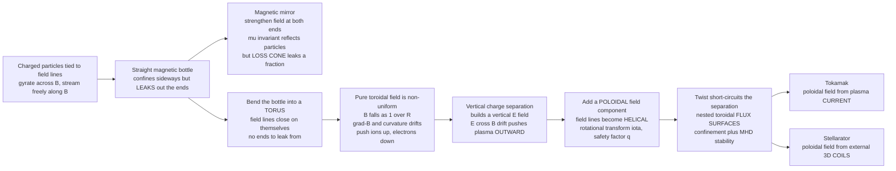

# 🧲 Magnetic Confinement Concepts

> [!abstract] TL;DR
> No solid vessel can hold a plasma ten times hotter than the Sun's core — it would vaporize on contact. But charged particles are **tied to magnetic field lines** like beads threaded on wires, so a magnetic field can be an invisible, wall-less **bottle**. The problem: a *straight* bottle leaks out its open ends. A **magnetic mirror** plugs the ends by strengthening the field there, but a **loss cone** still lets a fraction escape. The elegant fix is to bend the bottle into a **torus** so there are no ends at all — yet a *pure toroidal* field falls off as $1/R$, and the resulting grad-B and curvature drifts push ions up and electrons down, separating charge and expelling the plasma outward via $\vec{E}\times\vec{B}$. The cure is to add a **poloidal twist** so field lines become **helices** winding around nested **flux surfaces** — the **rotational transform** $\iota$ / **safety factor** $q$. That twisted-donut cage is the shared heart of every **tokamak** and **stellarator**.

## Intuition

**Analogy:** You want to store a gas so hot it is a plasma — ten times hotter than the centre of the Sun. Any material wall you could build would be vaporized in an instant, and the mere touch would chill and contaminate the plasma. So build a bottle out of **nothing but magnetic field**. It works because a charged particle cannot cross field lines: the magnetic force whips it into a tight circle, so it is a **bead threaded on a wire**, free to slide *along* the field line but trapped *around* it.

But a straight bundle of wires is a bottle with two **open ends**, and beads slide right off the ends. Trick one: make the wires **bunch together** at each end (a stronger field) so the beads bounce back — that is a **magnetic mirror**, but the most head-on beads still shoot straight through the pinch and escape. Trick two, the winning one: bend the whole bundle of wires around into a **donut** so the wires close on themselves and there are **no ends to leak from**. The catch is that a plain donut field is stronger on the inside of the hole than the outside, and that lopsidedness makes the beads **drift sideways out of the donut**. The final flourish is to **twist** the donut's field into a helix, so every wire spends equal time on the top and the bottom of the tube — the twist cancels the drift. A twisted donut of magnetic field, holding a star's worth of heat with no walls at all, is the entire idea behind fusion energy.

---

## How It Works

### Core mechanics

**1. The starting fact: particles are chained to field lines.** Every charged particle gyrates around $\vec{B}$ at the cyclotron frequency $\omega_c=|q|B/m$ on a tiny Larmor radius $r_L=mv_\perp/|q|B$, while streaming *freely* along the field. So a magnetic field confines **perpendicular** motion beautifully but does **nothing** to stop motion **along** the field. Every confinement scheme is really an answer to one question: *what do you do about the parallel escape?* (This single-particle picture is developed in the sibling note **Single_Particle_Motion_and_Drifts**.)

**2. Open systems — the magnetic mirror.** Strengthen $\vec{B}$ at both ends of a straight bottle. As a particle streams into stronger field, conservation of the **magnetic moment** $\mu=mv_\perp^2/2B$ (an adiabatic invariant) forces $v_\perp$ up; since speed is fixed, $v_\parallel$ must fall to zero and the particle **reflects**. But reflection only works for particles with enough perpendicular energy. Those inside the **loss cone**,

$$\sin^2\theta_{\text{loss}}=\frac{B_{\min}}{B_{\max}}=\frac{1}{R_m},$$

have too little $v_\perp$ and shoot straight out the ends. Collisions constantly scatter particles *into* the loss cone, so mirrors suffer relentless **end losses** — the reason simple mirrors never reached breakeven. **Tandem mirrors** add electrostatic end plugs to fight this, but the open topology is a permanent handicap.

**3. Closed systems — bend the bottle into a torus.** Remove the ends entirely: wrap the field into a **torus** so field lines close on themselves. Now parallel streaming just carries a particle round and round forever, never reaching a wall. This is the decisive topological move behind all mainline fusion.

**4. The catch: a pure toroidal field drifts the plasma out.** Toroidal field coils produce (by Ampère's law) a field that is **stronger on the inboard side**, $B_\phi \propto 1/R$. This non-uniform, curved field drives the charge-dependent **grad-B** and **curvature** drifts:

$$\vec{v}_{\nabla B}=\frac{mv_\perp^2}{2qB^3}\,\vec{B}\times\nabla B,\qquad \vec{v}_R=\frac{mv_\parallel^2}{qB^2}\frac{\vec{R}_c\times\vec{B}}{R_c^2}.$$

Both point **vertically**, and both flip sign with charge: **ions drift up, electrons drift down**. This separates charge, building a **vertical electric field** across the plasma. That $\vec{E}$, crossed with the toroidal $\vec{B}$, gives an $\vec{E}\times\vec{B}$ drift that is **radially outward for the whole plasma at once** — ions and electrons together — slamming it into the outer wall. A purely toroidal field confines nothing.

**5. The fix: add a poloidal field — the rotational transform.** Superpose a **poloidal** field component $B_\theta$ (the short way around the tube) on the toroidal $B_\phi$ (the long way around the hole). Field lines are no longer circles; they become **helices** that spiral around the torus, and the surfaces they trace out are **nested toroidal flux surfaces**. As a field line spirals, it carries a particle alternately over the **top and the bottom** of the plasma, so the upward and downward drifts **cancel on average** — the twist **short-circuits the charge separation**. The amount of twist is measured two equivalent ways:

$$q=\frac{\text{toroidal transits}}{\text{poloidal transit}}\approx\frac{r\,B_\phi}{R\,B_\theta},\qquad \iota=\frac{2\pi}{q}.$$

$q$ is the **safety factor** (field-line pitch — how many times around the long way per one time around the short way); $\iota$ is the **rotational transform** (poloidal angle advanced per toroidal transit). The name "safety factor" is literal: MHD stability against the kink mode requires $q(a)>1$ at the edge (the **Kruskal–Shafranov limit**). The nested flux surfaces are surfaces of constant pressure, so good confinement *is* well-formed flux surfaces.

**6. Two ways to make the twist.** The poloidal field has to come from somewhere:

- **Tokamak** — drive a large **toroidal plasma current** ($\sim$ mega-amps) through the plasma itself; that current generates the poloidal field. The device is beautifully **axisymmetric** (2D), but it *needs* a current, which must be driven and eventually stops (pulsed operation, disruption risk).
- **Stellarator** — twist the field entirely with **external, non-axisymmetric 3D coils**. No plasma current is required, so it runs **steady-state** and is disruption-free — at the cost of intricate, hard-to-build coils and a fully 3D geometry.

**7. Other closed configurations.** The same "twisted closed flux surface" idea appears with different current/field mixes: the **reversed-field pinch** (mostly poloidal field, $q<1$), the **spheromak** and **field-reversed configuration** (compact tori with little or no external toroidal-field coil), and the **levitated dipole** (confinement in a single coil's field, mimicking a planetary magnetosphere). All mainline reactors share the one core insight: **closed, twisted, nested flux surfaces**. The single-particle drift picture here is the microscopic story; the macroscopic force balance $\vec{J}\times\vec{B}=\nabla p$ that decides the *shape* of those flux surfaces is the province of **MHD_Equilibrium_and_the_Grad_Shafranov_Equation**, and the payoff — enough hot, confined plasma to ignite — is set by **Nuclear_Fusion_and_the_Lawson_Criterion**.

### Flow / architecture



---

## Key Concepts

### Secondary Level

- A hot plasma cannot touch a wall, so we hold it in a bottle made of **magnetic field**. Charged particles are stuck to field lines like **beads on a wire** — they can slide along, but not across.
- A **straight** magnetic bottle leaks out its two open ends. A **magnetic mirror** squeezes the field at each end to bounce particles back, but some always slip through.
- Bend the bottle into a **donut (torus)** and there are **no ends** to leak from. But a plain donut field must also be **twisted** into a spiral, or the particles drift sideways out of it.
- **Tokamaks** and **stellarators** are both twisted magnetic donuts; they differ only in *how* they make the twist.

### Undergraduate Level

- **The parallel-escape problem:** $\vec{B}$ confines motion perpendicular to itself (gyration, $r_L=mv_\perp/qB$) but not along itself. Every scheme is a strategy for the parallel direction.
- **Magnetic mirror:** $\mu=mv_\perp^2/2B$ conserved $\Rightarrow$ reflection where $B$ is large; the **loss cone** $\sin^2\theta_{\text{loss}}=1/R_m$ sets which particles escape. Open topology $\Rightarrow$ end losses.
- **Toroidal drift problem:** $B_\phi\propto 1/R$ makes grad-B and curvature drifts (charge-dependent) push ions and electrons apart vertically $\Rightarrow$ vertical $\vec{E}$ $\Rightarrow$ outward $\vec{E}\times\vec{B}$ that expels the plasma. Same drift physics as [[Rotational_Dynamics]] plus the [[Magnetism_and_Biot_Savart]] force.
- **Rotational transform / safety factor:** add $B_\theta$ so field lines are helical on **nested flux surfaces**; $q=rB_\phi/RB_\theta$ (toroidal per poloidal turn), $\iota=2\pi/q$. The twist averages the vertical drift to zero.
- **Tokamak vs stellarator:** tokamak makes $B_\theta$ from a **toroidal plasma current** (axisymmetric, pulsed); stellarator makes it from **external 3D coils** (steady-state, complex).

### Graduate Level

- **Flux surfaces as invariant tori:** field-line flow is a 1.5-degree-of-freedom Hamiltonian system; nested flux surfaces are KAM tori labelled by $q(\psi)$. **Rational surfaces** ($q=m/n$) are where resonant perturbations tear surfaces into **magnetic islands** and, once islands overlap, produce **stochastic (ergodic) field-line regions** that destroy confinement — the field-line analogue of the transition to chaos ([[Hamiltonian_Mechanics]]).
- **Safety-factor profile and stability:** the $q(r)$ profile controls MHD modes — Kruskal–Shafranov ($q(a)>1$) for the external kink, the $q=1$ surface for the sawtooth, low-order rationals for **tearing** and **neoclassical tearing modes**. Shaping and shear ($dq/dr$) are the main levers.
- **Single-particle vs fluid pictures:** the drift-orbit argument here is the microscopic story; the equilibrium *shape* follows from the ideal-MHD force balance $\vec{J}\times\vec{B}=\nabla p$ and the **Grad–Shafranov equation** (see [[Magnetohydrodynamics]]). Neither picture alone is complete: **neoclassical transport** and turbulent (gyrokinetic) transport bridge them, and **trapped-particle (banana) orbits** in the toroidal $1/R$ field set the neoclassical baseline.
- **Configuration zoo by current/field content:** tokamak ($q\gtrsim1$, external $B_\phi$, driven $I_p$), stellarator (external $\iota$, $I_p\approx0$), reversed-field pinch ($q<1$, minimal external $B_\phi$, self-organized by dynamo), spheromak/FRC (compact tori, $B_\phi$ from internal currents), levitated dipole (turbulent inward pinch). All maximize confined $n T \tau_E$ subject to stability and engineering.

---

## Python Demo

```python
# WHY A TOROIDAL MAGNETIC BOTTLE NEEDS A TWIST.
# (a) In a purely toroidal field B ∝ 1/R, the grad-B and curvature drifts push
#     IONS UP and ELECTRONS DOWN -> vertical charge separation -> a vertical E
#     field -> an outward E×B drift that expels the whole plasma.
# (b) Adding a POLOIDAL field makes the field lines HELICAL: one line winds
#     around a nested flux surface, sampling top AND bottom equally, which
#     short-circuits the separation. The winding defines the SAFETY FACTOR q.
import numpy as np
import matplotlib.pyplot as plt

# ---- geometry / field on-axis ----
R0, B0 = 3.0, 2.0                 # major radius (m), toroidal field on axis (T)

# local Cartesian basis in the poloidal (phi = 0) plane
Rhat   = np.array([1.0, 0.0, 0.0])   # major-radius direction (outward)
phihat = np.array([0.0, 1.0, 0.0])   # toroidal direction (out of the R-Z plane)
Zhat   = np.array([0.0, 0.0, 1.0])   # vertical

# ================================================================
# (a) PURE TOROIDAL FIELD  ->  grad-B drift  ->  charge separation
# ================================================================
R      = R0                                   # evaluate on the magnetic axis
Bmag   = B0 * R0 / R                           # |B| = B0 R0 / R   (∝ 1/R)
B_vec  = Bmag * phihat
gradB  = -B0 * R0 / R**2 * Rhat                # grad|B| points toward major axis
m, vperp2 = 1.0, 1.0                           # normalized mass, v_perp^2

def gradB_drift(q):                            # v = (m v_perp^2 / 2 q B^3) B x gradB
    return (m * vperp2 / 2.0) / (q * Bmag**3) * np.cross(B_vec, gradB)

v_ion = gradB_drift(+1.0)
v_ele = gradB_drift(-1.0)
print("(a) PURE TOROIDAL FIELD  (B ∝ 1/R)")
print("  |B| inboard  R0-1 :", round(B0 * R0 / (R0 - 1), 3), "T")
print("  |B| outboard R0+1 :", round(B0 * R0 / (R0 + 1), 3), "T  (weaker outside)")
print("  ion  grad-B drift  :", np.round(v_ion, 4), "-> Z", "UP"   if v_ion[2] > 0 else "DOWN")
print("  elec grad-B drift  :", np.round(v_ele, 4), "-> Z", "DOWN" if v_ele[2] < 0 else "UP")

# the charge separation builds a vertical E (down: from + ions on top to - below)
E_vec = np.array([0.0, 0.0, -1.0])
v_ExB = np.cross(E_vec, B_vec) / Bmag**2
print("  resulting E×B drift:", np.round(v_ExB, 4),
      "->", "RADIALLY OUTWARD  (plasma lost)" if v_ExB[0] > 0 else "inward")

# ================================================================
# (b) ADD POLOIDAL FIELD  ->  HELICAL field line on a flux surface
# ================================================================
q  = 2.5                          # safety factor: toroidal turns per poloidal turn
a  = 1.0                          # minor radius of the chosen flux surface
# field-line ODE on a surface:  dtheta/dphi = 1/q  (large-aspect-ratio limit)
phi   = np.linspace(0.0, 2 * np.pi * q * 4, 6000)   # 4 poloidal transits
theta = phi / q
Rl = R0 + a * np.cos(theta)
Xl, Yl, Zl = Rl * np.cos(phi), Rl * np.sin(phi), a * np.sin(theta)
iota = 2 * np.pi / q
print("\n(b) ADD A POLOIDAL TWIST  ->  helical field line")
print("  safety factor q           :", q)
print("  rotational transform iota :", round(iota, 4), "rad per toroidal transit")
print("  fraction of line at Z>0   :", round(np.mean(Zl > 0), 3),
      " at Z<0 :", round(np.mean(Zl < 0), 3), " -> samples top AND bottom")

# ---- plots ----
fig = plt.figure(figsize=(12, 5.5))

# (a) poloidal cross-section schematic
ax1 = fig.add_subplot(1, 2, 1)
tt = np.linspace(0, 2 * np.pi, 240)
ax1.plot(R0 + a * np.cos(tt), a * np.sin(tt), 'k-', lw=1.5)
ax1.scatter([R0, R0, R0], [0.55, 0.70, 0.85], marker='+', s=140, c='red',
            label='ions  (drift UP)')
ax1.scatter([R0, R0, R0], [-0.55, -0.70, -0.85], marker='_', s=140, c='blue',
            label='electrons  (drift DOWN)')
ax1.annotate('', xy=(R0, -0.30), xytext=(R0, 0.30),
             arrowprops=dict(arrowstyle='->', color='green', lw=2.5))
ax1.text(R0 + 0.06, -0.05, 'E (down)', color='green', fontsize=9)
ax1.annotate('', xy=(R0 + 0.95, 0.0), xytext=(R0 + 0.15, 0.0),
             arrowprops=dict(arrowstyle='->', color='purple', lw=2.5))
ax1.text(R0 + 0.30, 0.12, 'E x B  OUTWARD', color='purple', fontsize=9)
ax1.text(R0 - 1.05, 1.05, 'B toroidal (out of page)', fontsize=8)
ax1.set_aspect('equal'); ax1.set_xlabel('R (major radius)'); ax1.set_ylabel('Z')
ax1.set_title('(a) Pure toroidal field:\ncharge separation -> outward loss')
ax1.legend(loc='lower left', fontsize=8)

# (b) 3D helical field line on a nested flux surface
ax2 = fig.add_subplot(1, 2, 2, projection='3d')
u = np.linspace(0, 2 * np.pi, 60); v = np.linspace(0, 2 * np.pi, 60)
u, v = np.meshgrid(u, v)
Xs = (R0 + a * np.cos(v)) * np.cos(u)
Ys = (R0 + a * np.cos(v)) * np.sin(u)
Zs = a * np.sin(v)
ax2.plot_surface(Xs, Ys, Zs, alpha=0.15, color='gray', linewidth=0)
ax2.plot(Xl, Yl, Zl, 'r-', lw=0.9)
ax2.set_title('(b) Add poloidal twist:\nhelical field line on flux surface (q=2.5)')
ax2.set_box_aspect((1, 1, 0.45))
ax2.set_xlabel('X'); ax2.set_ylabel('Y'); ax2.set_zlabel('Z')

plt.tight_layout()
plt.savefig('magnetic_confinement.png', dpi=130)
plt.show()
```

Running it prints that the toroidal field is **stronger on the inboard side** ($B\propto1/R$), that the grad-B drift is **up for ions and down for electrons**, and that the vertical $\vec{E}$ this builds gives an $\vec{E}\times\vec{B}$ drift that is **radially outward** — the whole plasma lost. Part (b) then traces a single helical field line that spends **half its length above the midplane and half below** ($\approx0.50/0.50$), visibly short-circuiting the separation, and reports the **safety factor** $q=2.5$ and **rotational transform** $\iota=2\pi/q$.

---

## Real-World Applications

- **Tokamaks (ITER, JET, SPARC, EAST, KSTAR).** The workhorse of fusion: a toroidal field plus a driven multi-mega-amp **plasma current** that supplies the poloidal twist. ITER aims for $Q\ge10$ on exactly this principle — nested flux surfaces with $q$ rising from $\sim1$ on axis to $\sim3$–$4$ at the edge.
- **Stellarators (Wendelstein 7-X, LHD, HSX).** Generate the entire twist with sculpted **external 3D coils** — no plasma current, so genuinely **steady-state and disruption-free**. W7-X's optimized "quasi-isodynamic" geometry is a direct engineering embodiment of tailoring $\iota(\psi)$ for good confinement.
- **Magnetic mirrors and tandem mirrors (GDT at Novosibirsk; historically 2XIIB, MFTF).** Open linear machines that plug the ends with high-field coils and (in tandems) electrostatic potentials, fighting the ever-present loss-cone leak.
- **Compact and alternative toroids.** Reversed-field pinches (RFX-mod, MST), **spheromaks**, and **field-reversed configurations** (TAE Technologies, Helion) trade external-coil simplicity for self-organized internal currents; the **levitated dipole** (LDX) confines plasma in a single floating ring's field, deliberately mimicking a planetary magnetosphere.
- **Natural confinement.** The same physics is at work in the [[The_Sun]]'s magnetized corona and in the magnetospheres of Earth and of magnetars ([[Pulsars_Neutron_Stars_and_Magnetars]]), where field-line geometry traps energetic particles for years.

---

## Common Pitfalls

- **Confusing open (mirror) with closed (toroidal) confinement.** A **mirror** is an *open* linear bottle plugged by strong end fields; it always leaks through the **loss cone** because collisions refill it — this is why mirrors struggle to reach breakeven. A **torus** is *closed*: field lines have no ends, so parallel streaming never reaches a wall. Do not describe a tokamak as "a mirror bent into a circle" — the whole point is the change in **topology**.
- **Thinking a pure toroidal field confines.** A field from toroidal coils alone has $B_\phi\propto1/R$; the resulting grad-B and curvature drifts separate charge vertically, and the vertical $\vec{E}$ drives an outward $\vec{E}\times\vec{B}$ that dumps the plasma in microseconds. **A poloidal twist is mandatory, not optional.**
- **Muddling the rotational transform and the safety factor.** They are reciprocals: $\iota=2\pi/q$. $q$ counts **toroidal transits per poloidal transit** (the field-line pitch); $\iota$ is the **poloidal angle advanced per toroidal transit**. Tokamak people quote $q$, stellarator people quote $\iota/2\pi=1/q$ — same physics, different convention. And "safety factor" is not a metaphor: $q(a)>1$ is a genuine MHD stability requirement.
- **Forgetting where the twist comes from.** In a **tokamak** the poloidal field is made by the **plasma's own toroidal current** — so it is axisymmetric but *needs* current drive and can disrupt. In a **stellarator** the twist is built into **external coils** — steady-state and current-free, but geometrically brutal to engineer. Attributing a tokamak's twist to its external coils (or vice versa) is a common slip.
- **Ignoring that confinement lives on flux surfaces.** Good confinement means well-formed **nested flux surfaces**; where surfaces break into **magnetic islands** or go **stochastic** (at overlapping rational-$q$ resonances), heat leaks out along the now-radial field lines. Confinement quality is a statement about field-line topology, not just field strength.
- **Overreaching with the single-particle picture.** The drift-orbit argument explains *why you need a twist*, but it does **not** by itself give the equilibrium shape or the pressure limit — that requires the fluid **MHD equilibrium** ($\vec{J}\times\vec{B}=\nabla p$, the Grad–Shafranov equation) and, for real transport, kinetic/neoclassical theory. Use the right level of description for the question.

---

## Related Concepts

- [[Magnetism_and_Biot_Savart]] — the $q\vec{v}\times\vec{B}$ force that ties particles to field lines; toroidal-coil geometry gives the $B_\phi\propto1/R$ field via Ampère's law.
- [[Maxwells_Equations]] — the full field framework; the poloidal field, plasma current, and toroidal field are all consistent solutions of it.
- [[Magnetohydrodynamics]] — the fluid picture whose force balance $\vec{J}\times\vec{B}=\nabla p$ fixes the *shape* of the flux surfaces the single-particle argument assumes.
- [[Rotational_Dynamics]] — gyration is uniform circular motion; the Larmor orbit and its adiabatic invariant underlie the mirror and the drifts.
- [[Hamiltonian_Mechanics]] — field-line flow is a 1.5-DOF Hamiltonian system; nested flux surfaces are invariant (KAM) tori, and rational-$q$ resonances seed islands and stochasticity.
- [[Ordinary_Differential_Equations]] — tracing a field line is integrating $d\theta/d\phi=1/q$; the demo does exactly this.
- [[Nuclear_Reactions_Fission_Fusion]] — the D–T fusion reaction whose reactants must be confined hot and dense enough to burn.
- [[The_Sun]] — natural magnetic confinement of coronal plasma along closed loops.
- [[Pulsars_Neutron_Stars_and_Magnetars]] — the same trapping physics at $10^{12}$-Gauss fields.

*Foundational siblings in this section (build order): Single_Particle_Motion_and_Drifts supplies the gyration, mirror, and grad-B/curvature drifts used here; Magnetic_Confinement_Concepts (this note) states the closed-twisted-flux-surface strategy; Tokamak_Physics and Stellarators_and_Alternative_Confinement are the two ways to build the twist; MHD_Equilibrium_and_the_Grad_Shafranov_Equation gives the equilibrium shape of the flux surfaces; Nuclear_Fusion_and_the_Lawson_Criterion sets the confinement target the whole cage exists to meet.*

---

## Review Questions

1. **(Secondary)** Why can we hold a plasma ten times hotter than the Sun's core inside a magnetic field but not inside any solid container? And why does bending the magnetic bottle into a donut shape help?
2. **(Undergraduate)** In a *purely toroidal* field, which way do ions drift and which way do electrons drift, and why? Trace the chain from that vertical charge separation to the loss of the entire plasma, and explain precisely how adding a poloidal field stops it.
3. **(Undergraduate)** Define the safety factor $q$ and the rotational transform $\iota$, state how they are related, and explain what "$q=rB_\phi/RB_\theta$" is measuring physically. Why is $q(a)>1$ called a *safety* requirement?
4. **(Undergraduate/Graduate)** A magnetic mirror and a tokamak both use a magnetic field to confine plasma. Contrast their **topologies**, name the dominant loss channel in each, and explain why the closed toroidal topology was the decisive advance for reaching fusion conditions.
5. **(Graduate)** A tokamak and a stellarator produce the poloidal twist by completely different means. Describe each, and discuss the engineering and physics trade-offs (steady-state vs pulsed, axisymmetry, disruptions, current drive, coil complexity). Then explain what happens to confinement near a low-order rational surface as a resonant perturbation grows.

---

## Sources

- Wesson, J. — *Tokamaks* (4th ed.), Oxford University Press, 2011 (safety factor, equilibrium, flux surfaces, stability).
- Freidberg, J. P. — *Plasma Physics and Fusion Energy*, Cambridge University Press, 2007 (magnetic confinement concepts, mirrors vs tori, rotational transform).
- Chen, F. F. — *Introduction to Plasma Physics and Controlled Fusion* (3rd ed.), Springer, 2016, Ch. 8 (why a purely toroidal field fails; the need for the twist).
- Miyamoto, K. — *Plasma Physics for Nuclear Fusion*, MIT Press, 1980 (toroidal equilibrium, rotational transform, configurations).
- Freidberg, J. P. — *Ideal MHD*, Cambridge University Press, 2014 (flux surfaces, Grad–Shafranov equilibrium, MHD stability of confinement).

---

#plasma-physics #magnetic-confinement #toroidal-confinement #rotational-transform #safety-factor
