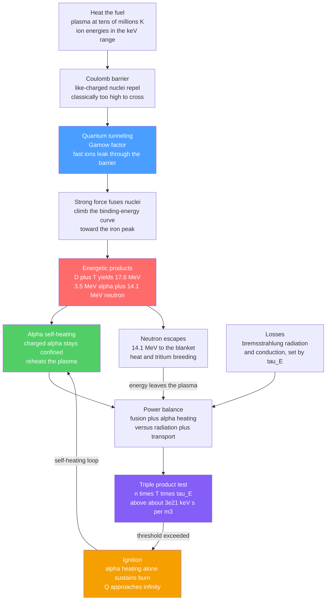

# ☀️ Nuclear Fusion and the Lawson Criterion

> [!abstract] TL;DR
> **Fusion** releases energy by welding light nuclei into a more tightly bound heavier one, climbing the binding-energy curve toward the iron peak — the Sun's power source and, on Earth, the goal of a clean, near-limitless reactor. The obstacle is the **Coulomb barrier**: two positively charged nuclei repel fiercely, and only at plasma temperatures of tens of millions of kelvin (keV energies) do they move fast enough to **quantum-tunnel** through the barrier so the short-range strong force can fuse them. The easiest reaction is **D-T** (deuterium + tritium → $^4$He + n, releasing $17.6\,\text{MeV}$: a $3.5\,\text{MeV}$ **alpha** that stays and self-heats the plasma plus a $14.1\,\text{MeV}$ **neutron** that escapes). Producing net power is not about temperature alone but about a *triple bargain*: the plasma must be hot enough, dense enough ($n$), and confined long enough ($\tau_E$) simultaneously. The **Lawson criterion**, sharpened into the **triple product** $n T \tau_E \gtrsim 3\times10^{21}\ \text{keV}\cdot\text{s}/\text{m}^3$ for D-T, is the quantitative finish line — the difference between **breakeven** ($Q=1$), **ignition** ($Q\to\infty$, alpha self-heating alone sustains the burn), and the far harder engineering/wall-plug gain. Both routes to it — **magnetic confinement** (low density, long $\tau_E$) and **inertial confinement** (enormous density, tiny $\tau_E$) — must satisfy the same criterion.

## Intuition — analogy FIRST

Getting two nuclei to fuse is like trying to make two bar magnets touch when their **same poles** face each other. The closer you push, the harder they shove back — the repulsion grows without limit as the gap shrinks. No matter how carefully you press, they refuse to meet. The only way through is to *hurl* them together so fast that they cross the gap before the repulsion can stop them. For nuclei, "fast" means temperatures of millions of degrees. If they get close enough, a completely different force takes over — the **strong nuclear force**, a much more powerful but extremely short-range "glue" that only reaches across about a proton's width. Once inside that range, it snaps the nuclei together and slams the door, releasing a burst of energy far larger than what you spent to push them.

Here is the twist that has consumed fusion research for seventy years: **heating a plasma that hot is the easy part.** A microwave beam or a particle injector can reach fusion temperatures in a lab. The real trick is *holding* it. A hot plasma wants to fly apart, cool down, and radiate its energy away instantly. To get more fusion energy out than you put in, you must keep it **hot enough, dense enough, and bottled up long enough — all at the same time.** That simultaneous triple bargain is the **Lawson criterion**. It is why fusion is not a physics mystery (the Sun solved it) but an engineering marathon, and it is the single number every reactor design — magnetic or laser-driven — is ultimately chasing.

---

## How It Works

Fusion energy is a competition between two power flows. On the winning side: the **fusion reactions** themselves, plus the fraction of their output (the charged alpha particles) that stays trapped and **reheats the plasma**. On the losing side: **radiation** (bremsstrahlung, when electrons decelerate past ions) and **transport** (heat leaking out by conduction and convection, quantified by the energy confinement time $\tau_E$). Net energy flows only when the winning side beats the losing side — and because fusion power scales as $n^2\langle\sigma v\rangle$ while losses scale differently with $n$, $T$, and $\tau_E$, the balance collapses into a single threshold on the product $n T \tau_E$.

**The chain of events:**

1. **Heat the fuel** past tens of millions of kelvin so ion thermal energies reach the keV range — enough for the fast tail of the [[Kinetic_Theory_of_Gases|Maxwell-Boltzmann distribution]] to approach the Coulomb barrier.
2. **Tunnel and fuse.** Even the fastest ions rarely have enough energy to climb the barrier classically; they **quantum-tunnel** through it (the Gamow factor). Once inside strong-force range, the nuclei fuse and rearrange into a more tightly bound product.
3. **Release energetic products.** For D-T, each fusion yields a $3.5\,\text{MeV}$ **alpha** ($^4$He) and a $14.1\,\text{MeV}$ **neutron**, sharing the $17.6\,\text{MeV}$ mass-energy released.
4. **Alpha self-heating.** The charged alpha stays confined by the magnetic field (or the inertial pinch) and dumps its energy back into the fuel; the neutron, uncharged, streams straight out to the surrounding blanket.
5. **Net gain if the triple product clears the bar.** When alpha heating plus external heating overcome radiation and transport losses, the plasma produces net energy; when alpha heating *alone* sustains the temperature, external heating can be switched off — **ignition**.



The green self-heating loop — alpha $\to$ balance $\to$ triple product $\to$ ignition $\to$ more alphas — is the "burning plasma" that fusion energy has spent seventy years trying to close.

---

## Key Concepts / Details

### Secondary Level

**Fusion vs fission — both cash in nuclear binding energy.** Draw the binding-energy-per-nucleon curve: it rises steeply from hydrogen, peaks at iron-56, then falls slowly. *Fission* splits a heavy nucleus (right of the peak) into medium ones; *fusion* joins light nuclei (far left of the peak) into a heavier one. Both move toward the peak — the "valley of stability" of iron — and the energy released is the mass that disappears, via $E=mc^2$. Fusion releases far more energy **per kilogram of fuel** than fission and leaves no long-lived fission-product waste.

**Why it is so hard.** Nuclei are all positively charged, so they repel. To fuse, they must be flung together hard enough to nearly touch — which means heating the fuel to temperatures hotter than the center of the Sun. At those temperatures matter is a **plasma** (see *Plasma_Physics_Overview*): a soup of free nuclei and electrons.

**The three knobs.** To get net energy you must win a balance: make enough fusion power to beat the power leaking away. Three things you can turn: how **hot** the plasma is ($T$), how **dense** it is ($n$), and how **long you hold it** ($\tau_E$). The Lawson criterion says their *product* must exceed a fixed value — you cannot fix a shortfall in one by pushing hard on just one other.

### Undergraduate Level

**The Coulomb barrier and Gamow tunneling.** Two nuclei of charge $Z_1 e$ and $Z_2 e$ feel a repulsive potential $U(r)=Z_1 Z_2 e^2/(4\pi\varepsilon_0 r)$ that peaks at the nuclear radius ($\sim$ hundreds of keV for D-T), far above typical thermal energies of $\sim 10\,\text{keV}$. Fusion nonetheless proceeds because ions **tunnel** through the barrier (see [[Schrodinger_Equation]]). The tunneling probability carries the **Gamow factor** $\exp(-\sqrt{E_G/E})$, where $E_G=2 m_r c^2 (\pi\alpha Z_1 Z_2)^2$ is the Gamow energy. The cross section is written $\sigma(E)=\dfrac{S(E)}{E}\exp\!\left(-\sqrt{E_G/E}\right)$, isolating the slowly varying nuclear physics in the astrophysical **S-factor** $S(E)$.

**Reactivity $\langle\sigma v\rangle(T)$.** In a thermal plasma the reaction rate per unit volume is $R=n_1 n_2\langle\sigma v\rangle$, where the **reactivity** averages $\sigma v$ over a Maxwellian:
$$
\langle\sigma v\rangle = \sqrt{\frac{8}{\pi m_r}}\;\frac{1}{(k_B T)^{3/2}}\int_0^\infty \sigma(E)\,E\,e^{-E/k_B T}\,dE .
$$
The integrand is the product of a **rising** Gamow tunneling factor and a **falling** Maxwellian tail — their overlap is the sharply peaked **Gamow window**. For D-T this makes $\langle\sigma v\rangle$ rise steeply through $5$–$20\,\text{keV}$ and broadly peak near $\sim 65\,\text{keV}$, orders of magnitude larger than D-D or D-$^3$He at the same temperature.

**The key reactions.**

| Reaction | Products | Energy $Q$ | Notes |
|---|---|---|---|
| D + T | $^4$He ($3.5$ MeV) + n ($14.1$ MeV) | $17.6\,\text{MeV}$ | **Easiest** — highest $\langle\sigma v\rangle$ at lowest $T$; but $80\%$ of energy in a fast neutron; needs tritium breeding |
| D + D | T + p, or $^3$He + n | $\sim 3.6$–$4.0\,\text{MeV}$ | Deuterium is abundant; $\sim100\times$ harder than D-T |
| D + $^3$He | $^4$He + p ($14.7$ MeV) | $18.4\,\text{MeV}$ | Charged products, few neutrons; needs $\sim3\times$ higher $T$; $^3$He is rare |
| p + $^{11}$B | $3\,^4$He | $8.7\,\text{MeV}$ | **Aneutronic**; hardest of all — needs $\sim300\,\text{keV}$ |

**The power balance.** For a D-T plasma with $n_D=n_T=n/2$, the fusion power density is $P_{\text{fus}}=\tfrac14 n^2\langle\sigma v\rangle E_{\text{fus}}$ and the alpha-heating density is $P_\alpha=\tfrac14 n^2\langle\sigma v\rangle E_\alpha$ (only $E_\alpha=3.5\,\text{MeV}$ of the $17.6$ stays). Against them:
- **Bremsstrahlung** radiation $P_{\text{br}}=C_B\,Z_{\text{eff}}\,n^2\sqrt{T}$ — electrons braking past ions, an unavoidable radiative floor.
- **Transport** loss $P_{\text{loss}}=W/\tau_E=3nT/\tau_E$, where $W=3nT$ is the plasma thermal energy density and $\tau_E$ is the **energy confinement time** (how long the plasma retains its heat).

### Graduate Level

**Deriving the Lawson criterion.** Ignition requires alpha self-heating alone to balance all losses:
$$
\underbrace{\tfrac14 n^2\langle\sigma v\rangle E_\alpha}_{\text{alpha heating}}\;\ge\;\underbrace{C_B n^2\sqrt{T}}_{\text{bremsstrahlung}}+\underbrace{\frac{3nT}{\tau_E}}_{\text{transport}} .
$$
Solving for the confinement product,
$$
\boxed{\;n\tau_E \;\ge\; \frac{3T}{\tfrac14\langle\sigma v\rangle E_\alpha - C_B\sqrt{T}}\;}
$$
and multiplying by $T$ gives the **triple product** $nT\tau_E$. Minimizing the right side over temperature yields, for D-T, the famous values $n\tau_E\gtrsim 1.5\times10^{20}\,\text{s}/\text{m}^3$ (at $T\approx 25$–$30\,\text{keV}$) and $nT\tau_E\gtrsim 3\times10^{21}\,\text{keV}\cdot\text{s}/\text{m}^3$ (at $T\approx 13$–$15\,\text{keV}$). The temperature at which brems and alpha heating cross, $\tfrac14\langle\sigma v\rangle E_\alpha=C_B\sqrt{T}$, is the **ideal ignition temperature** ($\approx4.4\,\text{keV}$ for D-T): below it, radiation *always* wins regardless of confinement — a hard floor.

**Why the triple product and not just $n\tau_E$.** Lawson's original 1957 formulation minimized $n\tau_E$; but because $\langle\sigma v\rangle\propto T^2$ over the reactor-relevant window $10$–$20\,\text{keV}$, the fusion power at fixed *pressure* $p\propto nT$ is nearly $T$-independent, so the pressure-based figure of merit $nT\tau_E$ is the more design-invariant quantity. Since plasma performance is ultimately limited by pressure (the plasma $\beta$ limit — pressure relative to magnetic-field energy), $nT\tau_E$ is the number reactor physicists actually report.

**Q, breakeven, and ignition.** The fusion **gain** is $Q=P_{\text{fus}}/P_{\text{heat}}$, the ratio of fusion power to *externally supplied* heating power.
- $Q=1$ — **scientific breakeven**: fusion output equals input heating (achieved by JET-class devices).
- $Q=5$ — alpha heating equals external heating ($P_\alpha=\tfrac15 P_{\text{fus}}=P_{\text{heat}}$): the "burning plasma" threshold.
- $Q\to\infty$ — **ignition**: external heating is zero; alpha self-heating alone sustains the burn.

Crucially, ignition needs a triple product roughly $\sim5\times$ higher than a naive breakeven because only the alpha's $\tfrac{3.5}{17.6}\approx20\%$ of the fusion energy stays to self-heat.

**Plasma $Q$ vs engineering/wall-plug $Q$.** The physics $Q$ above ignores every real-world inefficiency. **Engineering gain** $Q_{\text{eng}}=P_{\text{electric out}}/P_{\text{electric in}}$ must further pay for: thermal-to-electric conversion ($\sim\!35\%$ Carnot-limited), the efficiency of the heating systems and magnets, and the plant's own recirculating power. A commercial reactor needs plasma $Q\gtrsim 20$–$40$ just to reach $Q_{\text{eng}}>1$. NIF's December 2022 result — $3.15\,\text{MJ}$ fusion from $2.05\,\text{MJ}$ *laser* energy ($Q_{\text{plasma,laser}}\approx1.5$) — was a landmark **target-gain** ignition, but the lasers themselves drew $\sim300\,\text{MJ}$ from the wall, so $Q_{\text{eng}}\ll1$. Conflating these is the single most common misreading of fusion headlines.

**The two routes, one criterion.** Lawson constrains the *product* $n\tau_E$, leaving each factor free to trade against the other:
- **Magnetic confinement** (tokamaks, stellarators): low density $n\sim10^{20}\,\text{m}^{-3}$, long confinement $\tau_E\sim$ seconds, held by strong magnetic fields. (Developed across this section — see *Magnetic_Confinement_Concepts* and *Tokamak_Physics*.)
- **Inertial confinement** (lasers, Z-pinch): enormous density $n\sim10^{31}\,\text{m}^{-3}$, vanishing confinement $\tau_E\sim10^{-10}\,\text{s}$ set only by the fuel's own inertia before it blows apart. (See *Inertial_Confinement_Fusion*.)

Both land at similar triple products — the same finish line, approached from opposite ends of density space. Where this section culminates in a reactor is previewed in *The_Path_to_Fusion_Energy*.

---

## Python Demo

```python
# Fusion reactivity and the Lawson triple product, in two acts:
#   (a) REACTIVITY <sigma v>(T) for D-T, D-D, D-He3 via the Bosch-Hale
#       parametrization -> shows D-T is orders of magnitude easier and
#       broadly peaks near ~65 keV (the Gamow-window / tunneling origin).
#   (b) LAWSON POWER BALANCE -> the ignition contour n*tau_E vs T and the
#       TRIPLE PRODUCT n*T*tau_E vs T, whose minimum is ~3e21 keV.s/m^3 for
#       D-T; plus the bremsstrahlung floor (ideal ignition temperature) and
#       the approximate locations of JET / ITER / NIF.
# numpy + matplotlib only.
import numpy as np
import matplotlib.pyplot as plt

# ----------------------------------------------------------------------------------
# (a) FUSION REACTIVITY  <sigma v>(T)   [Bosch & Hale, Nucl. Fusion 32, 611 (1992)]
#     Returns cm^3/s for T in keV; we convert to m^3/s.
# ----------------------------------------------------------------------------------
def bosch_hale(T, BG, mrc2, C):
    """Reactivity <sigma v> in cm^3/s.  T in keV; C = [C1..C7]."""
    C1, C2, C3, C4, C5, C6, C7 = C
    theta = T / (1.0 - (T*(C2 + T*(C4 + T*C6))) / (1.0 + T*(C3 + T*(C5 + T*C7))))
    xi = (BG**2 / (4.0*theta))**(1.0/3.0)
    return C1 * theta * np.sqrt(xi / (mrc2 * T**3)) * np.exp(-3.0*xi)   # cm^3/s

# Coefficients (BG in keV^1/2, mrc2 in keV):
DT   = dict(BG=34.3827, mrc2=1124656,
            C=[1.17302e-9, 1.51361e-2, 7.51886e-2, 4.60643e-3,
               1.35000e-2, -1.06750e-4, 1.36600e-5])          # D + T -> n + alpha
DHe3 = dict(BG=68.7508, mrc2=1124572,
            C=[5.51036e-10, 6.41918e-3, -2.02896e-3, -1.91080e-5,
               1.35776e-4, 0.0, 0.0])                          # D + He3 -> p + alpha
DDp  = dict(BG=31.3970, mrc2=937814,
            C=[5.65718e-12, 3.41267e-3, 1.99167e-3, 0.0,
               1.05060e-5, 0.0, 0.0])                          # D + D -> p + T (one branch)

T = np.linspace(1.0, 100.0, 1000)                              # keV
sigv_DT   = bosch_hale(T, DT['BG'],   DT['mrc2'],   DT['C'])   * 1e-6   # -> m^3/s
sigv_DHe3 = bosch_hale(T, DHe3['BG'], DHe3['mrc2'], DHe3['C']) * 1e-6
sigv_DD   = bosch_hale(T, DDp['BG'],  DDp['mrc2'],  DDp['C'])  * 1e-6

imax = np.argmax(sigv_DT)
print(f"D-T reactivity peaks near T = {T[imax]:.0f} keV  "
      f"(<sigma v> = {sigv_DT[imax]:.2e} m^3/s)")
print(f"At T=10 keV:  D-T/D-D ratio = {sigv_DT[np.argmin(abs(T-10))]/sigv_DD[np.argmin(abs(T-10))]:.0f}x easier")

# ----------------------------------------------------------------------------------
# (b) LAWSON POWER BALANCE for a 50:50 D-T plasma
# ----------------------------------------------------------------------------------
keV   = 1.602176634e-16          # J per keV
E_a   = 3.5e3 * keV              # alpha energy that self-heats (J)
E_fus = 17.6e3 * keV             # total D-T energy (J)
C_B   = 5.35e-37                 # bremsstrahlung constant, W.m^3.keV^-1/2 (Z=1)

sigv = sigv_DT                   # m^3/s on the T grid above

# Ignition: alpha heating >= bremsstrahlung + transport (3nT/tau_E).
#   n*tau_E = 3T / ( (1/4) <sv> E_a  -  C_B sqrt(T) )      [s/m^3]
denom  = 0.25*sigv*E_a - C_B*np.sqrt(T)
valid  = denom > 0                                   # above the brems floor
nTau   = np.full_like(T, np.nan)
nTau[valid] = 3.0*(T[valid]*keV) / denom[valid]      # s/m^3
triple = T * nTau                                    # keV.s/m^3

imin = np.nanargmin(triple)
print(f"\nMinimum triple product  n*T*tau_E = {triple[imin]:.2e} keV.s/m^3  at T = {T[imin]:.0f} keV")
print(f"Minimum Lawson product  n*tau_E   = {np.nanmin(nTau):.2e} s/m^3")

# Ideal ignition temperature: alpha heating = bremsstrahlung
T_ideal = T[np.nanargmin(np.abs(0.25*sigv*E_a - C_B*np.sqrt(T)))]
print(f"Ideal ignition temperature (brems = alpha heating) ~ {T_ideal:.1f} keV")

# Approximate experimental points in (T, n*T*tau_E) space  [illustrative]
experiments = {
    "JET (DT, 1997)":  (13.0, 1.0e21),
    "JT-60U (equiv.)": (30.0, 1.5e21),
    "ITER (Q=10 goal)":(15.0, 6.0e21),
    "NIF (ignition)":  (8.0,  5.0e21),
}

# ----------------------------------------------------------------------------------
# PLOTS
# ----------------------------------------------------------------------------------
fig, ax = plt.subplots(2, 2, figsize=(13, 9))

# (a) reactivity curves
ax[0,0].loglog(T, sigv_DT,   lw=2.2, label="D-T")
ax[0,0].loglog(T, sigv_DHe3, lw=2.0, label="D-He3")
ax[0,0].loglog(T, sigv_DD,   lw=2.0, label="D-D (one branch)")
ax[0,0].axvspan(15, 70, color="gold", alpha=0.15, label="D-T broad peak")
ax[0,0].set_xlabel("temperature T [keV]"); ax[0,0].set_ylabel("<sigma v>  [m^3/s]")
ax[0,0].set_title("(a) Fusion reactivity: D-T is far easiest")
ax[0,0].legend(); ax[0,0].grid(True, which="both", alpha=0.3)

# brems floor: alpha heating vs bremsstrahlung per n^2
ax[0,1].loglog(T, 0.25*sigv*E_a, lw=2.2, label="alpha heating / n^2")
ax[0,1].loglog(T, C_B*np.sqrt(T), lw=2.2, label="bremsstrahlung / n^2")
ax[0,1].axvline(T_ideal, color="k", ls="--", lw=1.2,
                label=f"ideal ignition T ~ {T_ideal:.1f} keV")
ax[0,1].set_xlabel("temperature T [keV]"); ax[0,1].set_ylabel("power density / n^2  [W.m^3]")
ax[0,1].set_title("(b) Bremsstrahlung floor sets minimum T")
ax[0,1].legend(); ax[0,1].grid(True, which="both", alpha=0.3)

# Lawson n*tau_E ignition contour
ax[1,0].semilogy(T, nTau, lw=2.4, color="crimson")
ax[1,0].scatter([T[np.nanargmin(nTau)]], [np.nanmin(nTau)], zorder=5, color="k")
ax[1,0].annotate(f"min n.tau_E ~ {np.nanmin(nTau):.1e} s/m^3",
                 (T[np.nanargmin(nTau)], np.nanmin(nTau)),
                 textcoords="offset points", xytext=(10, 12))
ax[1,0].fill_between(T, nTau, 1e23, where=valid, color="crimson", alpha=0.08)
ax[1,0].text(45, 3e21, "IGNITED\n(above curve)", ha="center")
ax[1,0].set_xlabel("temperature T [keV]"); ax[1,0].set_ylabel("n.tau_E  [s/m^3]")
ax[1,0].set_title("(c) Lawson ignition contour (D-T)")
ax[1,0].set_ylim(1e20, 1e23); ax[1,0].grid(True, which="both", alpha=0.3)

# Triple product ignition contour + experiments
ax[1,1].semilogy(T, triple, lw=2.4, color="navy", label="ignition boundary")
ax[1,1].axhline(3e21, color="gray", ls=":", lw=1.4, label="min ~ 3e21 keV.s/m^3")
for name, (Tp, tp) in experiments.items():
    ax[1,1].scatter([Tp], [tp], zorder=5)
    ax[1,1].annotate(name, (Tp, tp), textcoords="offset points",
                     xytext=(6, 6), fontsize=8)
ax[1,1].set_xlabel("temperature T [keV]"); ax[1,1].set_ylabel("n.T.tau_E  [keV.s/m^3]")
ax[1,1].set_title("(d) Triple product: the finish line")
ax[1,1].set_xlim(0, 60); ax[1,1].set_ylim(1e21, 1e23)
ax[1,1].legend(loc="upper right"); ax[1,1].grid(True, which="both", alpha=0.3)

plt.tight_layout()
plt.savefig("fusion_lawson_demo.png", dpi=110)
print("\nsaved fusion_lawson_demo.png")
```

**What you should see.** Panel (a) shows D-T towering over D-D and D-$^3$He by roughly two orders of magnitude across the reactor window, broadly peaking near $65\,\text{keV}$ — the signature of the Gamow tunneling window. Panel (b) shows why there is a **temperature floor**: below $\sim4.4\,\text{keV}$ the bremsstrahlung curve sits above alpha heating, so no confinement can ignite the plasma. Panels (c) and (d) plot the U-shaped **ignition contours**: the Lawson product $n\tau_E$ bottoms out near $1.5\times10^{20}\,\text{s/m}^3$ around $25$–$30\,\text{keV}$, while the **triple product** $nT\tau_E$ bottoms out near $3\times10^{21}\,\text{keV}\cdot\text{s}/\text{m}^3$ around $14\,\text{keV}$ — with the magnetic (JET, ITER) and inertial (NIF) milestones clustered near the same finish line despite living at utterly different densities.

---

## Real-World Applications

- **Tokamaks — JET, ITER, SPARC, EAST, KSTAR.** The dominant magnetic-confinement path. JET set the fusion-power record ($59\,\text{MJ}$, 2021) and reached $Q\approx0.67$; **ITER** targets $Q=10$ ($500\,\text{MW}$ from $50\,\text{MW}$ heating) and a burning plasma; **SPARC** (Commonwealth Fusion) uses high-temperature-superconductor magnets to reach $Q>2$ in a compact device. All are engineered to clear the D-T triple product.
- **Stellarators — Wendelstein 7-X.** Twisted 3-D coils confine the plasma without a driven plasma current, trading engineering complexity for intrinsically steady-state, disruption-free operation while chasing the same Lawson target.
- **Inertial confinement — NIF (National Ignition Facility).** In December 2022, 192 lasers compressed a D-T capsule to achieve **target-gain ignition** ($3.15\,\text{MJ}$ out from $2.05\,\text{MJ}$ laser in) — the first lab demonstration that alpha self-heating can dominate, satisfying Lawson from the extreme-density end.
- **Aneutronic and alternative fuels — Helion, TAE.** Helion pursues **D-$^3$He** (fewer neutrons, direct electric conversion); TAE targets **p-$^{11}$B**. Both accept a far harder triple product in exchange for reduced neutron activation and simpler energy capture.
- **Stellar fusion — the Sun.** Nature's reactor confines D-T's cousins gravitationally: the [[The_Sun|Sun]] fuses hydrogen via the **pp-chain** (see [[Stellar_Structure_and_Energy_Generation]] and [[Stellar_Nucleosynthesis]]) at a *lower* reaction rate per volume than a tokamak, but with a confinement time of billions of years and a confinement region the size of a star — a spectacular satisfaction of Lawson by sheer $\tau_E$.

---

## Common Pitfalls

1. **Thinking temperature is the whole story.** Reaching $150$ million K is straightforward; the hard part is $n$ and $\tau_E$ *simultaneously*. Fusion is a **confinement** problem, not a heating problem. The triple product, not temperature, is the scoreboard.
2. **Forgetting the Coulomb barrier is beaten by tunneling, not brute force.** Almost no thermal ion has enough energy to climb the barrier classically; fusion lives entirely in the **Gamow tunneling tail** (see [[Schrodinger_Equation]]). This is why $\langle\sigma v\rangle$ is exponentially sensitive to temperature and to nuclear charge $Z_1 Z_2$ — and why low-$Z$ D-T wins.
3. **Assuming D-T is "best" because it is easiest.** D-T has the lowest ignition temperature, but $80\%$ of its energy escapes as a $14.1\,\text{MeV}$ **neutron** that activates and embrittles reactor walls and demands tritium breeding (tritium is radioactive, $12.3$-year half-life — see [[Radioactive_Decay]] — and does not occur naturally). "Easiest to ignite" is not "easiest to engineer."
4. **Confusing breakeven, ignition, and $Q$.** $Q=1$ is scientific **breakeven** (fusion = input heating); **ignition** is $Q\to\infty$ (alpha heating alone sustains the burn). Because only the alpha's $\sim20\%$ self-heats, ignition needs a triple product several times larger than a naive energy-balance estimate suggests.
5. **Quoting plasma $Q$ as if it were wall-plug $Q$.** Physics gain ignores laser/heater inefficiency, thermal-to-electric conversion, and recirculating power. NIF's 2022 "gain" was relative to *laser* energy delivered to the target, not the $\sim300\,\text{MJ}$ drawn from the grid. Commercial viability needs plasma $Q\gtrsim20$–$40$ for engineering $Q>1$.
6. **Ignoring the bremsstrahlung floor.** Radiation losses scale as $n^2\sqrt{T}$ and set a hard **minimum temperature** ($\sim4.4\,\text{keV}$ for D-T) below which no confinement can ignite. Higher-$Z$ fuels (p-$^{11}$B) push this floor up so far that ignition against bremsstrahlung is contested.
7. **Believing magnetic and inertial routes obey different physics.** They do not. Both must satisfy the *same* Lawson criterion; they merely trade $n$ against $\tau_E$ — magnetic confinement at low density for seconds, inertial at colossal density for a fraction of a nanosecond. The triple product is route-agnostic.

---

## Related Concepts

- [[Nuclear_Reactions_Fission_Fusion]] — the reaction kinematics and $Q$-values behind D-T, D-D, and D-$^3$He; fusion is the mirror image of fission across the iron peak.
- [[Nuclear_Structure]] — the binding-energy-per-nucleon curve and the iron peak that make fusion energetically favorable for light nuclei.
- [[Radioactive_Decay]] — tritium's $12.3$-year beta decay and neutron-induced activation of reactor materials, central to the D-T fuel cycle and waste picture.
- [[Schrodinger_Equation]] — quantum tunneling through the Coulomb barrier (the Gamow factor) is the reason thermonuclear fusion happens at all.
- [[Stellar_Structure_and_Energy_Generation]] — how stars balance gravity against fusion power; the astrophysical counterpart to the Lawson power balance.
- [[The_Sun]] — the pp-chain reactor next door; nature satisfies Lawson through gravitational confinement and astronomical $\tau_E$.
- [[Stellar_Nucleosynthesis]] — fusion chains beyond hydrogen that forge the elements, extending the binding-energy climb to the iron peak.
- [[Kinetic_Theory_of_Gases]] — the Maxwell-Boltzmann distribution whose high-energy tail supplies the ions that tunnel and fuse; temperature is the width of that distribution.

---

## Review Questions

1. **Secondary.** Explain, using the two-magnets-repelling analogy, why fusion needs such high temperatures, and then explain why temperature alone is not enough — what are the other two things a reactor must achieve at the same time, and what single rule ties all three together?
2. **Undergraduate.** For a 50:50 D-T plasma, write the alpha-heating, bremsstrahlung, and transport power densities. Set up the ignition inequality and derive the expression for the minimum $n\tau_E$. Why does multiplying by $T$ (the triple product) give a more design-relevant figure of merit than $n\tau_E$ alone?
3. **Graduate.** A press release announces "fusion gain $Q>1$." (a) Distinguish scientific breakeven, ignition, plasma $Q$, and engineering $Q$. (b) Given that only $3.5\,\text{MeV}$ of D-T's $17.6\,\text{MeV}$ self-heats, estimate how much larger the ignition triple product must be than a naive full-energy breakeven estimate. (c) Explain why a magnetic device ($n\sim10^{20}\,\text{m}^{-3}$, $\tau_E\sim1\,\text{s}$) and a laser device ($n\sim10^{31}\,\text{m}^{-3}$, $\tau_E\sim10^{-10}\,\text{s}$) can both satisfy the *same* Lawson criterion.

---

## Sources

- Lawson, J. D. — *Some Criteria for a Power Producing Thermonuclear Reactor* — Proc. Phys. Soc. B **70**, 6 (1957) — the original derivation of the confinement criterion.
- Freidberg, J. P. — *Plasma Physics and Fusion Energy* (Cambridge, 2007) — the modern standard on the power balance, triple product, and reactor design.
- Wesson, J. — *Tokamaks*, 4th ed. (Oxford, 2011) — authoritative treatment of confinement, $Q$, and magnetic-fusion performance.
- Chen, F. F. — *Introduction to Plasma Physics and Controlled Fusion*, 3rd ed. (Springer, 2016) — accessible introduction to fusion reactions, reactivity, and Lawson.
- Bosch, H.-S. & Hale, G. M. — *Improved formulas for fusion cross-sections and thermal reactivities* — Nuclear Fusion **32**, 611 (1992) — the reactivity parametrization used in the demo.

#plasma-physics #nuclear-fusion #lawson-criterion #triple-product #fusion-energy
