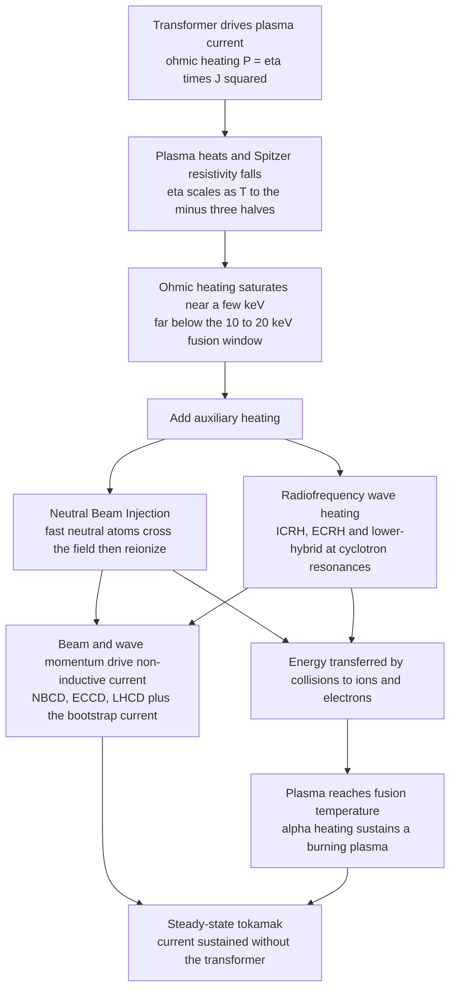

# 🔥 Plasma Heating and Current Drive

> [!abstract] TL;DR
> A fusion plasma must reach **150 million degrees** (~10–20 keV), ten times the Sun's core — but the obvious method, running a current through it like a toaster wire (**ohmic heating**, $P=\eta J^2$), *quits working just when you need it most*: Spitzer resistivity falls as $\eta \propto T^{-3/2}$, so a hotter plasma becomes a near-perfect conductor and ohmic heating **saturates at a few keV**, far below fusion needs. To close the gap you add **auxiliary heating**: fire in **neutral beams** (NBI) of fast atoms that cross the magnetic field, re-ionize, and collide their energy away; or launch **radio waves tuned to a cyclotron resonance** (ICRH at the ion gyro-frequency, ECRH at the electron gyro-frequency, plus lower-hybrid), which — because the toroidal field falls as $B\propto 1/R$ — deposit their power at a **specific major radius**. The same beams and waves also **drive a steady, non-inductive current** (NBCD, ECCD, LHCD), and the self-generated, pressure-driven **bootstrap current** supplies most of it — the key to a steady-state, self-sustaining **burning plasma**.

---

## Intuition — analogy FIRST

Imagine you must heat a pot of water to an impossible temperature. Your first idea is the cheapest: run an electric current through the water and let its resistance turn electricity into heat, exactly like the glowing wire of a **toaster**. This is **ohmic heating**, and for a while it works beautifully — the current is already there in a tokamak, holding the plasma together, and it warms the plasma for free.

But here is the cruel twist. A **hotter plasma conducts electricity better** — its resistance *drops* as it warms (like a metal that gets a superconductor's smoothness). So the toaster wire quits precisely when you need it most: past a few keV the resistance is so low that pushing current barely warms anything. Ohmic heating hits a **ceiling** around ten times too cold for fusion.

So physicists switch to heating a *specific spot* with two very different tricks:

- **Neutral beams — tiny cannonballs.** You can't just shoot charged particles in; the magnetic cage deflects them at the wall. So you fire in beams of **fast neutral atoms**, which sail straight across the field like uncharged cannonballs, then **re-ionize deep inside** and slam their energy into the plasma through collisions (also fuelling it, spinning it, and pushing current).
- **Radio waves — the opera singer's note.** Every particle gyrates around the magnetic field at a precise pitch, its **cyclotron frequency**. Tune a radio wave to exactly that pitch and the particles absorb it resonantly — like an **opera singer shattering a wine glass** by singing its natural note. Because the field strength (hence the pitch) changes with position, the wave dumps its energy at one chosen layer, giving you a scalpel for heating *and* for steering the current.

Learning heating and current drive is learning how to pour tens of megawatts into an invisible, magnetically levitated gas and make it burn — and then keep its current alive indefinitely without a transformer.

---

## How It Works

### The logic in one line

Start ohmic; watch it saturate as $\eta \propto T^{-3/2}$; add **neutral beams** and **resonant RF waves** to carry the plasma the rest of the way to fusion temperature; and use those same beams and waves — plus the self-generated **bootstrap current** — to sustain the plasma current **without** the pulsed transformer, so the machine can run in steady state.



### The four tools

1. **Ohmic (inductive) heating.** A central transformer solenoid induces a toroidal loop voltage; the driven current $J$ heats the plasma at power density $\eta J^2$. Free and automatic, but self-limiting: as $T$ rises, $\eta \propto T^{-3/2}$ collapses, so the heating fades. Also **inherently pulsed** — a transformer cannot ramp flux forever (Faraday's law), so a purely ohmic tokamak can only run in shots.

2. **Neutral Beam Injection (NBI).** Accelerate ions to 100 keV–1 MeV, then **neutralize** them so they can cross the confining field; inside, they re-ionize by charge exchange and ionization and **slow down by collisions**, dumping energy into ions and electrons. NBI simultaneously **heats, fuels, spins (torque/rotation), and drives current (NBCD)**. Reactor-scale energies (~1 MeV) need **negative-ion sources**, because positive ions neutralize too poorly at high energy.

3. **RF / wave heating.** Launch an electromagnetic wave that propagates to a **resonance layer** and is absorbed there:
   - **ICRH** — ion-cyclotron resonance, tens of MHz, heats ions (often via a minority species).
   - **ECRH** — electron-cyclotron resonance, ~100–200 GHz from **gyrotrons**; extremely localized, also used for **current drive (ECCD)** and for **suppressing instabilities** (e.g. neoclassical tearing modes).
   - **Lower-hybrid (LHCD)** — very efficient **off-axis current drive**; plus Alfvén-wave schemes.
   Because $B \propto 1/R$ in a torus, the cyclotron frequency $\omega_c = qB/m$ pins the resonance $\omega = n\,\omega_c$ to a **specific major radius** — deposition is a controllable layer, not a smear.

4. **Current drive & the bootstrap.** For **steady state** the pulsed transformer current must be replaced non-inductively: **NBCD** (beam momentum), **ECCD/LHCD** (wave momentum pushes electrons). Crucially, a high-pressure plasma **generates its own current** — the **bootstrap current**, a neoclassical current driven by the radial **pressure gradient**. In advanced steady-state scenarios the bootstrap can supply **most** of the needed current, so external drive only has to top it up. This is the "holy grail" of steady-state tokamak operation.

---

## Key Concepts / Details

### Secondary Level

- **Hot = fusion.** DT fuel only fuses fast enough at ~100–200 million K (10–20 keV); the particles must be moving fast enough to tunnel through their mutual electric repulsion.
- **The toaster stops working.** Ohmic heating warms the plasma by its electrical resistance, but hot plasma barely resists current, so this method **saturates** well short of fusion temperature.
- **Two ways to add heat.** Shoot in **fast neutral atoms** (they can cross the magnetic field because they carry no charge), or beam in **radio waves tuned to the exact frequency at which particles spiral** around the field — resonant absorption, like a singer shattering a glass.
- **Keep the current alive.** A tokamak needs a big electric current flowing in the plasma to make its magnetic cage. The transformer that normally drives it can only pulse, so for a power plant we need to **drive the current continuously** with beams, waves, and the plasma's own self-generated **bootstrap** current.

### Undergraduate Level

**Why ohmic saturates.** The **Spitzer resistivity** of a plasma scales as

$$\eta_\text{Sp} \propto \frac{Z\,\ln\Lambda}{T_e^{3/2}},$$

so ohmic power density $p_\Omega = \eta J^2 \propto T_e^{-3/2}$ (at fixed current). Meanwhile the power the plasma **loses** grows with temperature: at fixed density and energy-confinement time $\tau_E$, the loss is $P_\text{loss} = W/\tau_E$ with stored energy $W = 3 n T V$, so $P_\text{loss}\propto T$. The two curves cross at a **few keV** — the **ohmic ceiling** — which is why every fusion device needs auxiliary heating.

**Neutral beam physics.** A beam ion injected at energy $E_b$ slows on plasma electrons and ions. Above a **critical energy** $E_c \approx 14.8\,T_e\,(A_b/Z_\text{eff}^{2/3})$ it deposits mostly to **electrons** (drag $\propto v$); below $E_c$, mostly to **ions** ($\propto 1/v^2$). The neutralization step is essential: a charged beam would gyrate into the wall.

**Cyclotron resonance.** A particle gyrates at $\omega_c = qB/m$. A wave with $\omega = n\,\omega_c$ (fundamental $n=1$ or a harmonic) rotates in step with the gyration and transfers energy resonantly. In a tokamak the toroidal field is $B(R) = B_0 R_0 / R$, so the resonance condition selects a **major radius**:

$$R_\text{res} = \frac{n\,q\,B_0 R_0}{m\,\omega}.$$

Sweeping the launched frequency (or field) sweeps the deposition layer across the plasma — the basis of localized control.

**Frequencies to remember.** Electron-cyclotron $f_{ce} \approx 28\,\text{GHz}\times B[\text{T}]$ (so ~140–170 GHz gyrotrons at 5–6 T); ion-cyclotron for deuterium $f_{ci} \approx 7.6\,\text{MHz}\times B[\text{T}]$ (tens of MHz). ECRH lives in the microwave/millimetre band; ICRH in the shortwave-radio band.

### Graduate Level

**Bootstrap current.** In toroidal geometry, trapped particles on **banana orbits** carry a parallel momentum imbalance set by the pressure gradient; collisional coupling to passing particles converts this into a net toroidal current:

$$j_\text{bs} \sim -\,\varepsilon^{1/2}\,\frac{1}{B_\theta}\frac{dp}{dr},\qquad \frac{I_\text{bs}}{I_p} \sim c_\text{bs}\,\varepsilon^{1/2}\,\beta_p,$$

with inverse aspect ratio $\varepsilon = r/R$ and poloidal beta $\beta_p$. High-$\beta_p$, broad-pressure "advanced tokamak" scenarios can reach **bootstrap fractions of 70–90%**, minimizing the external current-drive recirculating power — the enabling physics for an economical steady-state reactor.

**Current-drive figure of merit.** Non-inductive efficiency is quoted as $\gamma_\text{CD} = n_e R_0 I_\text{CD}/P_\text{CD}$ (units $10^{20}\,\text{A W}^{-1}\text{m}^{-2}$). Wave current drive works by **selectively heating resonant electrons in one parallel direction**, raising their velocity so collisions damp their momentum less (Fisch–Boozer), or by creating an asymmetric trapped/passing boundary (Ohkawa). LHCD is efficient for **off-axis** current; ECCD is precise and **localized** (ideal for tearing-mode suppression at rational surfaces); NBCD scales with beam energy.

**Wave accessibility and absorption.** Whether a launched mode reaches its resonance without meeting an intervening **cutoff** is read off the cold-plasma dispersion (the O/X/R/L structure of the *Cold_Plasma_Waves_and_Dispersion* sibling). Cold theory predicts *where* the resonance sits ($n\to\infty$); the **finite temperature (kinetic)** picture supplies *how* it absorbs — **cyclotron/Landau damping** at $\omega - n\omega_c - k_\parallel v_\parallel = 0$, broadened by the Doppler term $k_\parallel v_\parallel$. Absorption strength and deposition width follow from this resonance denominator.

**Alpha heating and the burning plasma.** Once $T$ is high enough, DT fusion produces 3.5 MeV **alpha particles** that stay confined and heat the plasma. Alpha power density $p_\alpha = \tfrac14 n^2\langle\sigma v\rangle E_\alpha \propto T^2$ (in the 8–25 keV window) eventually outpaces both losses ($\propto T$) and any auxiliary input; the **required external power becomes non-monotonic in $T$** and can fall to zero at **ignition** ($Q=\infty$). The auxiliary heating's real job is to carry the plasma **across the hump** into the self-heated regime — the physics behind the fusion gain $Q = P_\text{fus}/P_\text{aux}$.

---

## Python Demo

```python
# Plasma heating and current drive: three linked pictures.
#  (a) THE OHMIC CEILING: ohmic power ~ eta*J^2 with Spitzer eta ~ T^(-3/2)
#      FALLS with temperature, while the power the plasma must supply to sit at
#      T rises ~ T -> the two cross at a few keV, far below the fusion window.
#  (b) RESONANT DEPOSITION: because B ~ 1/R, the electron-cyclotron resonance
#      f_ce = f_wave sits at ONE major radius -> a localized Gaussian deposit.
#  (c) BURNING-PLASMA ACCESS: the auxiliary power NEEDED vs temperature is
#      non-monotonic -- it rises to cross the gap, then falls as alpha heating
#      takes over, reaching zero at ignition.
import numpy as np
import matplotlib.pyplot as plt

fig, axes = plt.subplots(1, 3, figsize=(17, 5))

# ---------- (a) The ohmic ceiling ----------
T = np.linspace(0.3, 25.0, 600)          # temperature, keV
eta = T**(-1.5)                          # Spitzer resistivity, normalized (=1 @ 1 keV)
J = 1.0
P_ohmic = eta * J**2                     # ohmic power density ~ eta*J^2  (falls as T^-1.5)
P_needed = 0.06 * T                      # loss power the plasma must replace (~ T)
T_ceiling = (1.0/0.06)**(1.0/2.5)        # crossing where T^-1.5 = 0.06 T  -> ~3 keV
ax = axes[0]
ax.plot(T, P_ohmic, lw=2.2, color='crimson', label=r'ohmic input  $\propto \eta J^2 \propto T^{-3/2}$')
ax.plot(T, P_needed, lw=2.2, color='navy',   label=r'power needed (losses) $\propto T$')
ax.axvline(T_ceiling, color='k', ls='--', lw=1.2,
           label=f'ohmic ceiling ~ {T_ceiling:.1f} keV')
ax.axvspan(10, 20, color='gold', alpha=0.25, label='fusion window 10-20 keV')
ax.set_yscale('log'); ax.set_xlim(0, 25); ax.set_ylim(1e-3, 5)
ax.set_xlabel('temperature  T  [keV]'); ax.set_ylabel('power density [norm.]')
ax.set_title('(a) Ohmic heating saturates -> need auxiliary')
ax.legend(fontsize=7.5, loc='upper right'); ax.grid(alpha=0.3, which='both')

# ---------- (b) Localized cyclotron-resonance deposition ----------
R  = np.linspace(4.0, 8.0, 600)          # major radius, m (ITER-like)
R0, B0 = 6.2, 5.3                        # magnetic-axis radius (m), on-axis field (T)
B  = B0 * R0 / R                         # toroidal field falls as 1/R
f_ce = 28.0 * B                          # electron-cyclotron freq, GHz (28 GHz per tesla)
f_wave = 170.0                           # ITER ECRH gyrotron, GHz
R_res = R0 * B0 * 28.0 / f_wave          # resonance radius where f_ce = f_wave
sigma = 0.10                             # deposition width, m (beam width + Doppler)
dep = np.exp(-0.5 * ((R - R_res) / sigma)**2)   # localized power deposition profile
ax = axes[1]
ax.plot(R, f_ce, lw=2.2, color='teal', label=r'$f_{ce}(R)=28\,B(R)$,  $B\propto 1/R$')
ax.axhline(f_wave, color='crimson', ls='--', lw=1.4, label=f'gyrotron f = {f_wave:.0f} GHz')
ax.axvline(R_res, color='k', ls=':', lw=1.2)
ax.set_xlabel('major radius  R  [m]'); ax.set_ylabel('frequency  [GHz]', color='teal')
ax.set_title('(b) Resonance pinned to one radius -> localized deposit')
ax.set_xlim(4, 8)
ax2 = ax.twinx()
ax2.fill_between(R, dep, color='orange', alpha=0.35)
ax2.plot(R, dep, lw=1.5, color='darkorange', label='power deposition')
ax2.set_ylabel('deposited power [norm.]', color='darkorange'); ax2.set_ylim(0, 1.4)
ax.legend(fontsize=8, loc='upper right')
ax.annotate(f'resonance layer\nR = {R_res:.2f} m', xy=(R_res, f_wave),
            xytext=(R_res+0.5, f_wave+25), fontsize=8,
            arrowprops=dict(arrowstyle='->'))

# ---------- (c) Burning-plasma access: auxiliary power needed vs T ----------
n, V, tauE = 1.0e20, 840.0, 3.0          # density (m^-3), volume (m^3), confinement (s)
keV_J = 1.602e-16                        # 1 keV in joules
Tc = np.linspace(1.0, 22.0, 600)         # keV
P_loss = 3.0 * n * (Tc * keV_J) * V / tauE          # W  (W = 3 n T V ; loss = W/tauE)
P_ohm  = 20.0e6 * Tc**(-1.5)                         # W  (ohmic ~ 20 MW @ 1 keV, T^-1.5)
sigv   = 1.1e-22 * (Tc / 10.0)**2                   # DT reactivity fit (m^3/s), 8-25 keV
E_alpha = 3.5e6 * 1.602e-19                          # 3.5 MeV alpha in joules
P_alpha = (n/2.0)**2 * sigv * E_alpha * V           # W  (alpha self-heating)
P_aux = (P_loss - P_ohm - P_alpha) / 1e6            # required auxiliary power, MW
ax = axes[2]
mask = P_aux > 0
ax.plot(P_aux[mask], Tc[mask], lw=2.4, color='purple')
i_peak = np.argmax(P_aux); i_ign = np.argmin(np.abs(P_aux[Tc > 6]))
T_ign = Tc[Tc > 6][i_ign]
ax.axhspan(10, 20, color='gold', alpha=0.22, label='fusion window')
ax.scatter([P_aux[i_peak]], [Tc[i_peak]], color='crimson', zorder=5)
ax.annotate('access-to-burn barrier\n(max aux power)',
            xy=(P_aux[i_peak], Tc[i_peak]), xytext=(P_aux[i_peak]-2, Tc[i_peak]-3.5),
            fontsize=8, arrowprops=dict(arrowstyle='->'))
ax.annotate(f'ignition ~ {T_ign:.0f} keV\n(aux -> 0)', xy=(0, T_ign),
            xytext=(6, T_ign+0.5), fontsize=8, arrowprops=dict(arrowstyle='->'))
ax.set_xlabel('auxiliary power required  [MW]'); ax.set_ylabel('temperature  T  [keV]')
ax.set_title('(c) Aux heating carries plasma across the gap to ignition')
ax.set_xlim(left=0); ax.legend(fontsize=8, loc='lower right'); ax.grid(alpha=0.3)

plt.tight_layout()
plt.show()

# Console sanity checks
print(f"(a) ohmic ceiling temperature      ~ {T_ceiling:.2f} keV")
print(f"(b) ECRH resonance radius           = {R_res:.2f} m  (f_wave={f_wave:.0f} GHz, B0={B0} T)")
print(f"(c) peak auxiliary power (barrier)  = {P_aux.max():.1f} MW at T={Tc[np.argmax(P_aux)]:.1f} keV")
print(f"    ignition temperature (aux->0)   ~ {T_ign:.1f} keV")
```

**What the plots show.** Panel (a): the ohmic input (red) *drops* as $T^{-3/2}$ while the power the plasma needs (blue) *rises* — they cross near ~3 keV, the **ohmic ceiling**, so in the shaded 10–20 keV fusion window ohmic heating is orders of magnitude too weak and auxiliary power is mandatory. Panel (b): since $B\propto 1/R$, the electron-cyclotron frequency crosses the 170 GHz gyrotron line at a **single major radius** (~5.4 m), producing a tight Gaussian **deposition layer** — a heating (and current-drive) scalpel. Panel (c): the auxiliary power *required* to hold the plasma at temperature $T$ first **rises** (crossing the loss gap) then **falls** as $\propto T^2$ alpha heating takes over, hitting zero at **ignition** near ~10 keV — the auxiliary systems' real task is to push the plasma **over the hump** into a self-sustaining burn.

---

## Real-World Applications

- **ITER.** Combines ~33 MW of **NBI** (1 MeV negative-ion beams), ~20 MW of **ICRH** (~40–55 MHz), and ~20 MW of **ECRH** (170 GHz gyrotrons) to reach burning-plasma conditions with fusion gain $Q\ge10$; ECCD is baselined for **NTM suppression** and sawtooth control.
- **JET / DIII-D / ASDEX Upgrade / EAST / KSTAR.** Every large tokamak uses NBI + RF; **EAST and KSTAR** hold long-pulse, high-bootstrap steady-state records by leaning on LHCD/ECCD and the bootstrap current.
- **Stellarators (Wendelstein 7-X, LHD).** Being current-free by design, they rely on **ECRH/NBI** for heating and do **not** need inductive current drive — a structural advantage for steady state.
- **Gyrotrons and negative-ion sources.** Megawatt-class 100–200 GHz gyrotrons (a maser cousin of the *Laser_Physics* tube) and MeV negative-ion neutral-beam injectors are major standalone engineering programs; the same RF technology heats plasmas in **materials processing and semiconductor etching**.
- **Profile & instability control.** Localized ECCD at a rational surface is the routine tool for **stabilizing neoclassical tearing modes** and tailoring the current profile for advanced (high-bootstrap) scenarios.

---

## Common Pitfalls

1. **"Just push more current."** Ohmic heating **saturates** because $\eta\propto T^{-3/2}$ — a hotter plasma is a *better* conductor, so extra loop voltage barely warms it past a few keV. Auxiliary heating is not optional; it is thermodynamically forced.
2. **Injecting charged beams.** A charged beam gyrates into the wall before it penetrates. Beams must be **neutralized** to cross the field, then **re-ionize** inside — hence "**neutral** beam injection." At reactor energies (~1 MeV) you need **negative-ion** sources because positive ions neutralize inefficiently.
3. **Confusing the RF flavours.** **ICRH** (ion-cyclotron, tens of MHz) heats ions; **ECRH** (electron-cyclotron, ~100+ GHz) heats electrons and drives localized current; **LHCD** (lower-hybrid) is an efficient off-axis current driver. They live in completely different frequency bands and hardware.
4. **Forgetting $B\propto 1/R$.** The cyclotron-resonance layer is not everywhere — it sits at the major radius where $\omega = n\omega_c$. Get the field profile wrong and your megawatts land in the wrong place. This localization is a **feature** (control), not a nuisance.
5. **Heating a resonance a cold model can't reach.** Cold-plasma theory says *where* the resonance is; whether the launched mode **gets there** without hitting a cutoff (accessibility) and *how strongly it absorbs* need the dispersion/kinetic picture. Launch geometry and polarization (O vs X mode) matter.
6. **Ignoring current drive for steady state.** Ohmic current is **inductive and pulsed** (a transformer can't ramp flux forever). A steady-state reactor **must** replace it non-inductively: NBCD + ECCD + LHCD + the **bootstrap** current.
7. **Underrating the bootstrap.** The pressure-gradient-driven bootstrap current is not a curiosity — in advanced scenarios it supplies **most** of $I_p$, slashing the recirculating power spent on external drive. Designing the pressure profile *is* designing the current profile.
8. **Treating heating and fuelling/rotation as separate.** NBI does all three at once (heat + fuel + torque). Changing one knob moves the others; the pieces are coupled, and so is **alpha self-heating** once the plasma burns.

---

## Related Concepts

- [[Magnetohydrodynamics]] — the MHD equilibrium and the plasma current that heating and current drive must build and sustain; the bootstrap current is a neoclassical, MHD-scale self-generated current
- [[Electromagnetic_Waves_and_Radiation]] — RF heating launches EM waves (ICRH, ECRH, lower-hybrid) that carry power to a resonance layer and deposit it
- [[Wave_Motion_and_Properties]] — resonance, group velocity, and absorption set where and how strongly wave energy is deposited in the plasma
- [[Magnetism_and_Biot_Savart]] — the toroidal field falls as $B\propto 1/R$, which is exactly what pins the cyclotron-resonance layer to a chosen major radius
- [[Oscillations_and_SHM]] — cyclotron-resonance heating is a driven oscillator: the wave pumps particle gyration hardest at its natural frequency (the glass-shattering-note analogy made quantitative)
- [[Laser_Physics]] — ECRH gyrotrons are megawatt resonant microwave sources, engineering cousins of the maser/laser
- [[Maxwells_Equations]] — the inductive transformer current obeys Faraday's law (hence it is pulsed), and every launched heating wave obeys Maxwell's equations

**Siblings in this vault (prose links):** *Tokamak_Physics* (the machine whose current these tools sustain), *Collisions_and_Transport_in_Plasmas* (Spitzer resistivity, beam slowing-down, and the confinement losses heating must overcome), *Cold_Plasma_Waves_and_Dispersion* (the O/X/R/L modes and cutoffs that decide wave accessibility to a resonance), *Confinement_Transport_and_H_Mode* (auxiliary power triggers the H-mode transition and sets $\tau_E$), *Nuclear_Fusion_and_the_Lawson_Criterion* (why 10–20 keV, and how alpha heating closes the loop toward ignition).

---

## Review Questions

1. **Secondary:** A tokamak already runs a big electric current through its plasma, which warms it for free. Explain in plain words why this "toaster wire" heating stops working before the plasma is hot enough to fuse, and name the two other methods engineers use to finish the job.
2. **Undergraduate:** Spitzer resistivity scales as $\eta\propto T^{-3/2}$, so ohmic power density $\eta J^2$ falls with temperature while loss power $\sim W/\tau_E$ rises with it. Sketch both curves versus $T$ and explain why their crossing defines an "ohmic ceiling" of a few keV. Separately, given $B(R)=B_0R_0/R$ and a 170 GHz gyrotron at $B_0=5.3$ T, $R_0=6.2$ m, find the major radius where the fundamental electron-cyclotron resonance sits, and explain why the deposition is localized there.
3. **Graduate:** In an advanced steady-state scenario the bootstrap fraction $I_\text{bs}/I_p \sim c_\text{bs}\,\varepsilon^{1/2}\beta_p$ reaches ~80%. (a) Why does operating at high $\beta_p$ minimize the external current-drive recirculating power? (b) Contrast ECCD and LHCD for the remaining current — which would you place at a rational surface to suppress a neoclassical tearing mode, and why? (c) Explain how alpha heating makes the *required* auxiliary power non-monotonic in temperature and what "access to burn" means in that picture.

---

## Sources

- Wesson, J. — *Tokamaks*, 4th ed. (Oxford University Press, 2011) — Ch. 4 (heating) and Ch. 8 (current drive & bootstrap).
- Freidberg, J. P. — *Plasma Physics and Fusion Energy* (Cambridge University Press, 2007) — heating, current drive, and power-balance/ignition chapters.
- Stix, T. H. — *Waves in Plasmas* (AIP Press, 1992) — the foundational treatment of RF wave propagation, resonances, and absorption.
- ITER Physics Basis, Chapter 6: "Plasma auxiliary heating and current drive," *Nuclear Fusion* **39**, 2495 (1999); and the 2007 Progress in the ITER Physics Basis, Ch. 6.
- NRL Plasma Formulary (U.S. Naval Research Laboratory) — Spitzer resistivity, cyclotron frequencies, and DT reactivity data used in the demo.

#plasma-physics #plasma-heating #current-drive #neutral-beam-injection #rf-heating
