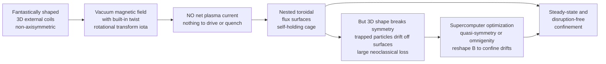

# 🌀 Stellarators and Alternative Confinement

> [!abstract] TL;DR
> A **stellarator** produces the twisting (**rotational transform**) that magnetically confines a plasma *entirely with external, three-dimensional coils* — carrying **no net plasma current**. That single choice buys **steady-state, disruption-free** operation with no current-driven instabilities, the tokamak's two great weaknesses. The price is severe: breaking axisymmetry lets **trapped particles drift off the flux surfaces**, ruining classical stellarator confinement — until you **computer-optimize the 3D shape for a hidden symmetry of $|B|$ (quasi-symmetry) or for omnigenity**, as **Wendelstein 7-X** did. Around it sits a whole zoo of *other* magnetic-confinement bets — RFP, spheromak, FRC, mirror, dipole, Z-pinch, magneto-inertial — none of which has yet beaten the tokamak on raw performance.

---

## Intuition

**Analogy FIRST.** A tokamak makes its magnetic cage twist by running a huge electric **current through the plasma itself** — clever and simple, but that current is like a **spinning top**: as long as it spins fast it stands upright, yet it is always one wobble away from toppling (a **disruption**), and it cannot spin forever without being re-driven. A **stellarator** makes a completely different bargain. Instead of asking the plasma to twist its own cage, it **bakes the entire twist into the coils** — fantastically contorted, almost sculpture-like magnets that look more like abstract art than engineering. Now the magnetic cage **holds itself**, with no current running in the plasma at all.

The catch is that this cage is far harder to *build* — its shape can only be found by **supercomputer optimization**, and the coils must be machined and aligned to a hair. But once built, it runs **quietly, steadily, and disruption-free, in principle forever**. The stellarator is the **tortoise** to the tokamak's hare: slower and costlier to get going, but with no dramatic falls along the way.

---

## How It Works

### Core mechanics

1. **What confinement needs: a rotational transform.** A purely toroidal field alone cannot confine a plasma — grad-$B$ and curvature drifts push ions up and electrons down (see [[Single_Particle_Motion_and_Drifts]]), the charge separation makes an $\vec{E}$, and the resulting $\vec{E}\times\vec{B}$ drift throws the whole plasma into the wall. The cure is to **twist the field lines poloidally** as they go around, so a drifting particle spends half its orbit "up" and half "down" and the drifts average out. This twist rate is the **rotational transform** $\iota$ (iota) $= 1/q$.

2. **Two ways to make the twist.** A **tokamak** drives a large toroidal **plasma current**; that current's poloidal field supplies $\iota$. A **stellarator** supplies the *same* poloidal twist **externally**, by making the coils and hence the vacuum field **three-dimensional (non-axisymmetric)** — helical windings, or the modern **modular twisted coils**. No plasma current is required.

3. **The immediate payoff.** With **no net current**: (a) the device is intrinsically **steady-state** (nothing needs to be inductively driven, so no pulse limit); (b) there are **no current-driven instabilities** (no kink, no sawteeth, and above all **no disruptions** — the violent, machine-damaging current-quench events that haunt tokamaks); (c) there is **no need for current drive**, saving recirculating power. These are the stellarator's structural advantages.

4. **The structural cost: broken symmetry.** A tokamak is **axisymmetric** — $|B|$ does not depend on the toroidal angle $\phi$ — and that symmetry guarantees a conserved canonical momentum that keeps guiding centres near their flux surface. A stellarator's $|B|$ **varies in all three dimensions**. Particles trapped in the local helical **magnetic wells** (banana-like orbits) then acquire a **bounce-averaged radial drift** that does not cancel: they **walk off the flux surfaces**. This **neoclassical transport** is catastrophic in a "classical" stellarator, scaling as the **effective ripple** $\varepsilon_{\text{eff}}^{3/2}$ and blowing up at high temperature (the **$1/\nu$ regime**).

5. **The breakthrough: optimization.** You cannot restore *geometric* axisymmetry in 3D, but you can restore a **hidden symmetry of the field strength**. If $|B|$, expressed in magnetic (Boozer) coordinates, depends on the angles only through a **single linear combination** $M\theta - N\phi$, the field is **quasi-symmetric** (quasi-axisymmetric $N=0$, or quasi-helical $N\neq0$); trapped-particle drifts then confine *as if* the machine were symmetric, even though its shape is wildly 3D. A slightly weaker but sufficient condition is **omnigenity**: the bounce-averaged radial drift vanishes for *all* trapped particles ($\partial J/\partial\alpha = 0$ for the second adiabatic invariant $J$). Finding a 3D boundary shape and coil set that achieves this requires **massive numerical optimization** — minimizing a cost function over hundreds of shape parameters. **Wendelstein 7-X** is the flagship result: quasi-isodynamic/omnigenous, with neoclassical transport reduced by roughly an order of magnitude and record stellarator triple products at long pulse.

### Flow / architecture



---

## Key Concepts

### Secondary Level

- A hot plasma must be held in a **twisted magnetic doughnut**. A **tokamak** makes the twist by running an electric current *through the plasma*; a **stellarator** makes the twist by **bending the magnets themselves** into strange 3D shapes, so no current flows in the plasma.
- **Why bother?** The tokamak's plasma current can suddenly collapse — a **disruption** — slamming huge forces and heat into the machine. A stellarator has **no such current**, so it **cannot disrupt**, and it can run **steadily forever** instead of in pulses.
- **The hard part:** the weird 3D shape lets some particles slowly **leak sideways** out of the cage. Modern stellarators use **computer design** to sculpt the field so the particles stay trapped — this is what makes **Wendelstein 7-X** work.

### Undergraduate Level

- **Rotational transform** $\iota = 1/q$: the average number of poloidal turns a field line makes per toroidal turn. Confinement requires $\iota \neq 0$. The tokamak gets it from the plasma current; the stellarator gets it from **3D external shaping** (helical or modular coils).
- **No plasma current** ⟹ **steady-state** and **no current-driven MHD** (no kink, no disruptions, no need for current drive). This is the core trade the stellarator makes versus the [[Magnetohydrodynamics]] instabilities of a current-carrying column.
- **Neoclassical transport in 3D:** particles trapped in helical ripple wells execute complicated banana orbits whose **bounce-averaged radial drift does not vanish** without symmetry. The loss rate scales with the **effective helical ripple** $\varepsilon_{\text{eff}}$, and in the collisionless **$1/\nu$ regime** the diffusion $D \propto \varepsilon_{\text{eff}}^{3/2}\, T^{7/2}/\nu$ — *worse* at the high temperatures fusion needs. This is why an unoptimized stellarator confines poorly.
- **Quasi-symmetry:** design $|B(\theta,\phi)|$ so that in Boozer coordinates it depends only on $M\theta - N\phi$. Then a hidden conserved momentum confines guiding centres just like true axisymmetry. **Quasi-axisymmetric** ($N=0$, e.g. NCSX design), **quasi-helical** ($M,N\neq0$, e.g. **HSX**), and **quasi-poloidal** are the flavours.
- **Omnigenity:** the more general condition $\partial J/\partial\alpha=0$ (the second adiabatic invariant $J=\oint m v_\parallel\,d\ell$ is constant on a flux surface). Quasi-symmetry is a special, exactly-symmetric case of omnigenity. **W7-X** is quasi-isodynamic (an omnigenous design with a small bootstrap current).

### Graduate Level

- **Boozer coordinates and the QS condition.** In straight-field-line Boozer coordinates $(\psi,\theta,\phi)$, quasi-symmetry is the statement $\vec{B}\cdot\nabla|B| \propto \vec{B}\cdot\nabla\psi \times \ldots$ reducing to $|B|=|B|(\psi,\,M\theta-N\phi)$. Exact QS overdetermines the field (Garren–Boozer): it can be imposed on a surface but not globally in a finite-volume 3D field, so real designs **minimize QS-breaking harmonics** rather than eliminate them.
- **The transport regimes.** Stellarator neoclassical transport passes through the **plateau**, the collisionless **$1/\nu$ regime** (ripple-trapped particles, $D\propto \varepsilon_{\text{eff}}^{3/2}/\nu$ — the regime optimization targets), and at low collisionality the **$\sqrt{\nu}$ and superbanana** regimes where the radial electric field $E_r$ matters. Optimization drives $\varepsilon_{\text{eff}}$ from a few percent down to $\lesssim 1\%$.
- **The bootstrap current subtlety.** A pressure gradient in 3D still self-generates a **bootstrap current**, which shifts $\iota$ and can move the crucial **island/rational surfaces** and the divertor strike points. **Quasi-isodynamic** designs (W7-X) are chosen partly to make the bootstrap current *small*, decoupling $\iota$ from plasma pressure and easing the **island divertor**.
- **Coil optimization.** Two-stage design: (1) find a plasma **boundary shape** minimizing a physics cost function (QS residual, $\varepsilon_{\text{eff}}$, MHD stability, particle-orbit losses); (2) find **coils** (modular filaments or a current potential on a winding surface) reproducing that boundary while respecting engineering limits (min bend radius, coil–coil spacing, forces). Modern codes (STELLOPT, SIMSOPT, DESC) run **gradient-based and adjoint** optimization over hundreds of Fourier shape coefficients — the reason stellarators only became practical in the supercomputer era. See [[Gradient_Descent]] and constrained optimization.
- **MHD without a current-limit.** Because there is no toroidal current, stellarators dodge the **kink and current-driven** limits; the operational boundary is instead **pressure-driven** ($\beta$-limits, ballooning, and equilibrium island formation), and remarkably stellarators often **soft-limit** rather than disrupt at high $\beta$.

---

## Python Demo

```python
# Stellarator confinement in two pictures:
#   (a) 3D SHAPING WITHOUT CURRENT: a flux surface whose cross-section
#       ROTATES as it goes around the torus (the non-axisymmetric plasma
#       of a stellarator), with a field line winding on it. The twist
#       (rotational transform) comes purely from the 3D GEOMETRY -- no
#       plasma current is imposed anywhere.
#   (b) NEOCLASSICAL LOSS & OPTIMIZATION: locally-trapped particles in a
#       3D field acquire a BOUNCE-AVERAGED RADIAL DRIFT. For a single-
#       harmonic (quasi-symmetric) |B| the drift cancels by symmetry;
#       add a second, incommensurate harmonic (an unoptimized stellarator)
#       and it no longer cancels -> particles walk off flux surfaces.
#       We compare the two and the resulting neoclassical transport.
import numpy as np
import matplotlib.pyplot as plt
from mpl_toolkits.mplot3d import Axes3D  # noqa: F401  (registers 3d proj)

rng = np.random.default_rng(0)

# =====================================================================
# (a) A TWISTED (NON-AXISYMMETRIC) FLUX SURFACE + a winding field line
# =====================================================================
Nfp   = 5            # field periods (like Wendelstein 7-X)
R0    = 5.0          # major radius
a, bb = 1.3, 0.55    # elliptical cross-section semi-axes (elongated)
iota  = 1.13         # rotational transform  -> field line winds

def surface_point(theta, phi):
    """Rotating-ellipse stellarator surface. The ellipse ORIENTATION
       turns with toroidal angle -> a 3D, non-axisymmetric flux surface."""
    psi = Nfp * phi / 2.0                       # ellipse rotation (2-fold shape)
    u0, v0 = a * np.cos(theta), bb * np.sin(theta)
    u = u0 * np.cos(psi) - v0 * np.sin(psi)     # rotate the cross-section
    v = u0 * np.sin(psi) + v0 * np.cos(psi)
    Rr = R0 + u
    return Rr * np.cos(phi), Rr * np.sin(phi), v

th = np.linspace(0, 2 * np.pi, 90)
ph = np.linspace(0, 2 * np.pi, 260)
TH, PH = np.meshgrid(th, ph)
Xs, Ys, Zs = surface_point(TH, PH)

# a field line: poloidal angle advances as iota * (toroidal angle).
phi_fl = np.linspace(0, 6 * np.pi, 3000)        # three toroidal transits
th_fl  = iota * phi_fl                          # twist from GEOMETRY, no current
Xf, Yf, Zf = surface_point(th_fl, phi_fl)

# =====================================================================
# (b) BOUNCE-AVERAGED RADIAL DRIFT of trapped particles
#     |B| along a field line, labelled by field-line phase alpha:
#       B(phi) = B0 * (1 - sum_j eps_j cos(alpha + k_j phi))
#     QS  : one harmonic  -> symmetric wells -> <dB/dalpha> = 0 (confined)
#     UNOPT: two harmonics -> asymmetric     -> <dB/dalpha> != 0 (loss)
# =====================================================================
QS    = [(0.09, 4.0)]                 # single helical harmonic (quasi-symmetric)
UNOPT = [(0.09, 4.0), (0.045, 1.0)]   # + incommensurate toroidal ripple

def Bfield(phi, harmonics):
    B    = np.ones_like(phi)
    dBda = np.zeros_like(phi)          # d|B|/d(alpha)  (alpha folded into phase)
    for eps, k in harmonics:
        arg   = k * phi
        B    -= eps * np.cos(arg)
        dBda += eps * np.sin(arg)
    return B, dBda

def bounce_avg_radial_drift(alpha, harmonics, f_trap=0.9, ng=6000):
    """<dB/dalpha> bounce-averaged over the deepest local well.
       This is the proxy for the net radial drift of a trapped particle."""
    phi = np.linspace(0, 2 * np.pi, ng) + alpha
    B, dBda = Bfield(phi, harmonics)
    i0 = int(np.argmin(B))
    iL = i0
    while iL - 1 >= 0 and B[iL - 1] >= B[iL]:
        iL -= 1
    iR = i0
    while iR + 1 < ng and B[iR + 1] >= B[iR]:
        iR += 1
    Bmin, Bbar = B[i0], min(B[iL], B[iR])
    Bref = Bmin + f_trap * (Bbar - Bmin)        # reflection point (pitch angle)
    Bw, dw = B[iL:iR + 1], dBda[iL:iR + 1]
    m = Bw < Bref                               # inside the well (v_par real)
    if m.sum() < 3:
        return 0.0
    w = 1.0 / np.sqrt(Bref - Bw[m])             # bounce weight  1/|v_par|
    return float(np.sum(dw[m] * w) / np.sum(w))

alphas   = np.linspace(0, 2 * np.pi, 400, endpoint=False)
drift_qs = np.array([bounce_avg_radial_drift(al, QS)    for al in alphas])
drift_un = np.array([bounce_avg_radial_drift(al, UNOPT) for al in alphas])

# neoclassical transport proxy ~ <radial drift^2>, and eps_eff ~ rms drift
eps_qs, eps_un = drift_qs.std(), drift_un.std()
D_qs,  D_un    = np.mean(drift_qs**2), np.mean(drift_un**2)
print(f"rms bounce-averaged radial drift  QS   = {eps_qs:.2e}")
print(f"rms bounce-averaged radial drift  UNOPT= {eps_un:.2e}")
print(f"neoclassical transport reduction (UNOPT/QS) ~ {D_un / max(D_qs,1e-30):.0f}x")

# |B| along the field line for one alpha (illustration for panel b1)
phi_show = np.linspace(0, 2 * np.pi, 1000)
B_qs, _  = Bfield(phi_show, QS)
B_un, _  = Bfield(phi_show, UNOPT)

# =====================================================================
# PLOTS
# =====================================================================
fig = plt.figure(figsize=(13, 10))

ax1 = fig.add_subplot(2, 2, 1, projection='3d')
ax1.plot_surface(Xs, Ys, Zs, rstride=6, cstride=3, color='#4a9eff',
                 alpha=0.28, linewidth=0)
ax1.plot(Xf, Yf, Zf, color='#d6336c', lw=1.6)
ax1.set_title("(a) 3D twisted flux surface + field line\n"
              "twist from GEOMETRY, no plasma current")
ax1.set_xlabel("X"); ax1.set_ylabel("Y"); ax1.set_zlabel("Z")
ax1.set_box_aspect((1, 1, 0.35))

ax2 = fig.add_subplot(2, 2, 2)
ax2.plot(phi_show, B_qs, color='#2f9e44', lw=2,
         label="quasi-symmetric (1 harmonic)")
ax2.plot(phi_show, B_un, color='#e8590c', lw=2,
         label="unoptimized (2 harmonics)")
ax2.set_xlabel("toroidal angle along field line  phi")
ax2.set_ylabel("|B|  (normalized)")
ax2.set_title("(b) |B| along a field line: helical wells trap particles")
ax2.legend(fontsize=8)

ax3 = fig.add_subplot(2, 2, 3)
ax3.scatter(alphas, drift_qs, s=8, color='#2f9e44',
            label=f"QS   rms={eps_qs:.1e}")
ax3.scatter(alphas, drift_un, s=8, color='#e8590c',
            label=f"UNOPT rms={eps_un:.1e}")
ax3.axhline(0, color='k', lw=0.8)
ax3.set_xlabel("field-line phase  alpha")
ax3.set_ylabel("bounce-averaged radial drift")
ax3.set_title("(c) Radial drift: ~0 for QS, large for unoptimized")
ax3.legend(fontsize=8)

ax4 = fig.add_subplot(2, 2, 4)
bars = ax4.bar(["quasi-symmetric\n(optimized)", "classic\n(unoptimized)"],
               [D_qs, D_un], color=['#2f9e44', '#e8590c'])
ax4.set_yscale('log')
ax4.set_ylabel("neoclassical transport  ~ <v_r^2>  (log)")
ax4.set_title("(d) Optimization slashes neoclassical loss")
for bar, val in zip(bars, [D_qs, D_un]):
    ax4.text(bar.get_x() + bar.get_width() / 2, val * 1.3,
             f"{val:.1e}", ha='center', fontsize=8)

plt.tight_layout()
plt.savefig("stellarator_optimization.png", dpi=130)
plt.show()
# Takeaways:
#  (a) a stellarator flux surface is genuinely 3D -- the cross-section
#      rotates around the torus, and a field line winds on it with a
#      rotational transform produced by geometry alone (no current).
#  (b,c,d) a single-harmonic (quasi-symmetric) |B| makes the trapped-
#      particle radial drift cancel by symmetry, so neoclassical
#      transport is tiny; adding an incommensurate ripple (an
#      unoptimized stellarator) breaks the symmetry and the drift --
#      and the transport -- jump by orders of magnitude. Optimization
#      (W7-X) is precisely the search for that hidden symmetry.
```

Running it prints an **rms radial drift ~10⁻¹⁶ for the quasi-symmetric field** (zero to machine precision — the symmetry makes trapped-particle drifts cancel) versus a large finite value for the unoptimized field, and a **neoclassical transport reduction of many orders of magnitude** — a cartoon of what W7-X's optimization achieved.

---

## Real-World Applications

> **Example — Wendelstein 7-X (Greifswald, Germany).** The world's flagship **optimized stellarator**: 50 non-planar superconducting **modular coils**, 5 field periods, quasi-isodynamic/omnigenous. Its shape was found by minimizing neoclassical transport, MHD, and orbit-loss cost functions on supercomputers. It has demonstrated **reduced neoclassical transport**, record stellarator **triple products**, and steady-state pulses of many minutes — validating the entire optimization thesis. Its **island divertor** exploits the natural edge magnetic islands for heat exhaust.

> **Example — Large Helical Device, LHD (Japan).** A large **heliotron** using two continuous **helical coils**; not quasi-symmetry-optimized, but a workhorse that pioneered long-pulse, high-density stellarator operation and demonstrated the intrinsic **disruption-free, steady-state** virtues of the concept.

> **Example — HSX (Helically Symmetric eXperiment, Wisconsin).** The first **quasi-helically symmetric** stellarator, built to *test* the quasi-symmetry idea directly: it measured the predicted **reduction in neoclassical transport and flow damping**, the experimental proof that a hidden symmetry of $|B|$ confines particles even in a 3D device.

> **Example — private HTS stellarators (Type One Energy, Thea Energy).** New ventures pairing **stellarator optimization** with **high-temperature superconducting (REBCO) magnets** ([[Superconductivity_and_BCS_Theory]]) to shrink the reactor. Thea's approach uses arrays of simpler **planar HTS coils** whose currents are tuned to synthesize the 3D field, attacking the stellarator's core weakness — **coil complexity**.

---

## Common Pitfalls

- **"A stellarator is just a weird tokamak."** No — the defining difference is *where the twist comes from*. A tokamak's rotational transform comes from a **plasma current** (⟹ pulsed, disruptive, needs current drive); a stellarator's comes from **external 3D coils** (⟹ steady-state, disruption-free, no current drive). Everything else follows from that one choice.
- **Forgetting the neoclassical penalty.** Breaking axisymmetry is *not free*: a naive 3D field has **huge neoclassical/trapped-particle transport** that worsens with temperature ($1/\nu$ regime, $D\propto\varepsilon_{\text{eff}}^{3/2}$). The classical stellarators of the 1950s–70s confined *worse* than tokamaks for exactly this reason.
- **Confusing quasi-symmetry with geometric symmetry.** The device shape is emphatically **not** symmetric; it is the **field strength $|B|$** in magnetic coordinates that has a hidden symmetry ($|B|=|B|(\psi, M\theta-N\phi)$). And **exact** quasi-symmetry cannot be achieved in a whole 3D volume (Garren–Boozer) — designs *minimize* the symmetry-breaking harmonics, and **omnigenity** ($\partial J/\partial\alpha=0$) is the practical weaker target (W7-X).
- **Underrating coil complexity.** The physics optimization produces a boundary shape; realizing it demands **fantastically contorted coils** built and aligned to sub-millimetre tolerance. This engineering — not the plasma physics — is the stellarator's dominant cost and schedule risk (much of W7-X's delay).
- **Thinking "alternative" means "one thing."** Beyond the stellarator lies a whole family, each trading confinement quality against simplicity or compactness: the **reversed-field pinch (RFP)**; the **spheromak** and **field-reversed configuration (FRC)** (compact, high-$\beta$, favoured by several private efforts); **magnetic mirrors** and **tandem mirrors**; the **levitated dipole**; the **sheared-flow-stabilized Z-pinch** revival (Zap Energy); and **magnetized-target / magneto-inertial fusion** (General Fusion) that bridges toward inertial confinement.
- **Assuming an alternative has "won."** As of the mid-2020s, **no alternative concept has beaten the tokamak on raw performance** ($n T \tau_E$). Stellarators and compact concepts offer *reactor-relevant advantages* (steady state, no disruptions, higher $\beta$, compactness) — reasons to pursue them — but the tokamak still leads on demonstrated fusion conditions.

---

## Related Concepts

- [[Single_Particle_Motion_and_Drifts]] — the trapped-particle banana orbits, grad-$B$/curvature drifts, and magnetic-mirror trapping whose bounce-averaged radial drift *is* the neoclassical loss that stellarator optimization defeats.
- [[Magnetohydrodynamics]] — the equilibrium (nested flux surfaces, $\vec{J}\times\vec{B}=\nabla p$) and the current-driven kink/disruption instabilities that a currentless stellarator simply avoids.
- [[Magnetism_and_Biot_Savart]] — how the fantastically shaped external coils generate the confining vacuum field in the first place.
- [[Maxwells_Equations]] — the full field framework; a stellarator's confining field is (largely) a **vacuum** solution set entirely by the coils.
- [[Superconductivity_and_BCS_Theory]] — the superconducting (and now HTS/REBCO) magnets that make the twisted coils and steady-state operation feasible.
- [[Gradient_Descent]] — the workhorse of the shape/coil optimization (with adjoint methods) that turns "3D chaos" into a confining, quasi-symmetric field.
- [[Lagrange_Multipliers]] — the constrained-optimization backbone: minimize a physics cost function subject to engineering and equilibrium constraints.
- [[Vectors_and_3D_Geometry]] — the 3D field-line and flux-surface geometry (cross products, winding numbers) underlying the rotational transform.

*Foundational siblings in this section (build order / prose only): Magnetic_Confinement_Concepts introduces the toroidal cage and rotational transform; Tokamak_Physics is the axisymmetric cousin this note is defined against; Confinement_Transport_and_H_Mode develops the transport and confinement-time picture; Collisions_and_Transport_in_Plasmas supplies the neoclassical/banana-orbit machinery; and The_Path_to_Fusion_Energy places stellarators and the alternative concepts on the roadmap to a power plant.*

---

## Review Questions

1. **(Secondary)** Both a tokamak and a stellarator confine plasma in a twisted magnetic doughnut. In one sentence each, say **where the twist comes from** in each machine, and name **one big advantage** the stellarator gets from its choice.
2. **(Undergraduate)** Why is a purely toroidal field unable to confine a plasma, and how does a **rotational transform** fix it? Explain how a stellarator produces $\iota$ **without any plasma current**, and list the three consequences of having no current.
3. **(Undergraduate)** What is **neoclassical transport**, and why is it far worse in a classic (unoptimized) stellarator than in a tokamak? What does the **effective ripple** $\varepsilon_{\text{eff}}$ measure, and why does the $1/\nu$-regime scaling make it especially dangerous at fusion temperatures?
4. **(Graduate)** Define **quasi-symmetry** and **omnigenity** precisely. Why can exact quasi-symmetry not be realized throughout a finite 3D plasma volume, and how did **W7-X** (quasi-isodynamic) navigate around that limitation? Why is a *small bootstrap current* a design goal there?
5. **(Graduate)** You are handed a fixed budget and must choose a confinement concept for a **steady-state** power plant. Compare a **stellarator** against a **tokamak** and one **compact alternative** (FRC *or* sheared-flow Z-pinch) across: disruption risk, current-drive/recirculating power, engineering/coil complexity, achieved $n T \tau_E$, and $\beta$. Which do you pick, and what single technical risk most threatens your choice?

---

## Sources

- Freidberg, J. P. — *Plasma Physics and Fusion Energy* (Cambridge University Press, 2007), Ch. 12–17 (magnetic confinement, tokamak vs stellarator, reactor concepts).
- Helander, P. — "Theory of plasma confinement in non-axisymmetric magnetic fields," *Reports on Progress in Physics* **77**, 087001 (2014) — the definitive review of stellarator neoclassical theory, quasi-symmetry, and omnigenity.
- Boozer, A. H. — "Physics of magnetically confined plasmas," *Reviews of Modern Physics* **76**, 1071 (2004); and "What is a stellarator?," *Physics of Plasmas* **5**, 1647 (1998).
- Wesson, J. — *Tokamaks* (4th ed., Oxford University Press, 2011) — the reference for the axisymmetric device this note is contrasted against (current drive, disruptions, MHD limits).
- Pedersen, T. S. *et al.* — "Confirmation of the topology of the Wendelstein 7-X magnetic field to better than 1:100,000," *Nature Communications* **7**, 13493 (2016); and W7-X performance/optimization results.

---

#plasma-physics #stellarator #quasi-symmetry #alternative-confinement #W7X
