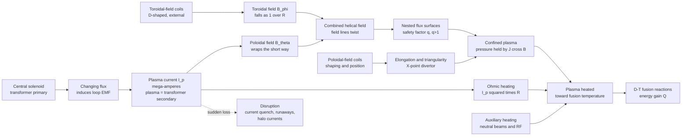

# 🍩 Tokamak Physics

> [!abstract] TL;DR
> A **tokamak** (Russian acronym for *"toroidal chamber with magnetic coils"*) is the world's leading magnetic-confinement fusion concept: a doughnut-shaped vessel that holds a plasma hotter than the Sun's core using **two crossed magnetic fields**. External **D-shaped coils** make a strong **toroidal field** ($B_\phi \propto 1/R$); then a huge **toroidal plasma current** ($I_p$, mega-amperes) — driven inductively by using the plasma itself as the **secondary winding of a transformer** — makes a **poloidal field** that twists the total field into the **helix** that confines the plasma, while simultaneously **ohmically heating** it. That self-generated twist is the tokamak's genius and the reason for JET, EAST, KSTAR, and the giant **ITER** now rising in France — but the same essential current is its **Achilles' heel**, prone to sudden **disruptions**. The single most important number is the **safety factor** $q$: it must exceed 1 for stability, and its rational surfaces ($q = 1, 2, 3$) host the instabilities that limit every tokamak.

## Intuition

**Analogy:** A tokamak is a **magnetic doughnut that confines a plasma partly by using the plasma *itself* as a wire.** First, wrap coils around the doughnut like beads on a ring — that makes the main field running *the long way around*. But a purely circular field can't hold a plasma: charged particles [drift](Single_Particle_Motion_and_Drifts) apart and leak straight to the wall. So here is the trick: drive an enormous electric current *through the plasma ring* — exactly like the **secondary winding of a transformer**, where a changing current in a central coil (the primary) induces a current in the loop around it. That plasma current does **two jobs at once**: it dumps ohmic heat into the plasma (a current through a resistor), and it wraps its own magnetic field *the short way around* the doughnut. Add the "long way" field to the "short way" field and every field line becomes a **helix** spiralling around the torus — and a helical cage, unlike a circular one, actually holds the plasma in.

This clever self-help — the plasma generating half of its own confining field — is why the tokamak beat every rival design (stellarators, mirrors, pinches) and became the front-runner for fusion power. But it comes with a curse. A transformer can only *push* current while its primary flux keeps changing, so the drive is **inherently pulsed**; and a current-carrying plasma is a coiled spring of magnetic energy that can let go all at once. When it does — a **disruption** — the current vanishes in milliseconds, slamming the machine with electromagnetic forces, spraying **runaway electrons**, and driving **halo currents** through the vessel. The tokamak's greatest strength and its greatest danger are the same thing: that current.

---

## How It Works

### Core mechanics

**1. Three field systems, one confining cage.** A tokamak superposes three magnetic-field sources:

- **Toroidal field $B_\phi$** — produced by external **D-shaped toroidal-field (TF) coils** threaded through the doughnut hole. Because a fixed number of ampere-turns is spread over a circumference $2\pi R$, the field falls off with major radius: $B_\phi(R) = B_0 R_0 / R$. This is the strongest field (5.3 T on axis in ITER) and it magnetizes the plasma, tying particles to field lines ([[Magnetism_and_Biot_Savart]]).
- **Poloidal field $B_\theta$** — produced *not* by external coils but by the **toroidal plasma current $I_p$** itself. By Ampère's law, a current $I(r)$ enclosed within minor radius $r$ makes $B_\theta(r) = \mu_0 I(r) / (2\pi r)$, wrapping the short way around the plasma cross-section.
- **Poloidal-field (PF) / shaping coils** — external ring coils above and below that create a **vertical field** to hold the current ring in radial force balance, and to **shape** the cross-section: elongation $\kappa$, triangularity $\delta$, the characteristic **D-shape**, and the **X-point divertor** that channels exhaust heat.

**2. The plasma is a transformer secondary.** The plasma current is driven **inductively**. A **central solenoid** (the transformer *primary*) ramps its current; the changing flux through the doughnut hole induces a loop EMF around the torus ([[Faradays_Law_and_Induction]], [[Maxwells_Equations]]), and since the plasma is a conductor forming a single-turn loop, that EMF drives $I_p$ (the *secondary*, mega-amperes). Two consequences follow immediately:

- **Ohmic heating.** The current dissipates $P_\Omega = I_p^2 R_p$ in the plasma's (Spitzer) resistance — free heating, but with a ceiling: hotter plasma is *less* resistive ($\eta \propto T^{-3/2}$), so ohmic heating fades exactly when you need it most. Above a few keV it stalls, and **auxiliary heating** (neutral beams, RF) takes over.
- **Pulsed operation.** A transformer cannot push flux forever — the solenoid saturates. So the inductive drive gives a **finite pulse**. Steady-state operation demands **non-inductive current drive** (RF and neutral beams) plus the self-generated **bootstrap current** — the holy grail of tokamak research.

**3. The twist, quantified: the safety factor $q$.** The combined field lines spiral. The **safety factor** counts how many times a field line goes *the long way* (toroidally) for each time it goes *the short way* (poloidally):

$$q(r) = \frac{r\,B_\phi}{R_0\,B_\theta(r)} = \frac{2\pi r^2 B_0}{\mu_0 R_0\, I(r)}.$$

- **$q$ large ⇒ gentle twist; $q$ small ⇒ tight twist.** More plasma current means smaller $q$.
- **Kruskal–Shafranov stability limit:** the whole column kink-buckles unless $q > 1$ everywhere (edge $q_a \gtrsim 2$–3 in practice). This directly **caps the plasma current** for a given field and size.
- **Rational surfaces** where $q = m/n$ (notably $q = 1, 2, 3$) are resonant: field lines close on themselves after $m$ toroidal and $n$ poloidal transits, and there magnetic islands and **tearing modes** grow. The $q = 1$ surface hosts the periodic **sawtooth** relaxation; the $q = 2$ surface is the classic **disruption trigger**.

**4. Equilibrium and stability.** Radial force balance is set by the MHD equilibrium $\vec{J} \times \vec{B} = \nabla p$ ([[Magnetohydrodynamics]]) — in a torus, the **Grad–Shafranov equation** describes the nested **flux surfaces** on which pressure and current are constant. Two families of limits then bound the operating space: **pressure limits** (the **Troyon $\beta$ limit** on plasma pressure relative to magnetic pressure) and **density limits** (the **Greenwald limit** $n_G = I_p / \pi a^2$). Push past any of them and confinement collapses — often violently.

### Flow / architecture



---

## Key Concepts

### Secondary Level

- A tokamak is a **doughnut-shaped magnetic bottle** for a gas so hot it would melt any container — so magnetic fields, not walls, hold it.
- It needs **two fields at once**: one going *around the long way* (from coils) and one going *the short way* (from a giant electric current flowing through the plasma). Together they make a **twisted, helical** cage that actually holds the plasma.
- That plasma current is driven like a **transformer** and also **heats** the plasma. The catch: a transformer only works while it is changing, so a basic tokamak runs in **pulses**, and if the current suddenly quits, the machine gets a violent jolt — a **disruption**.
- Real machines: **JET** (UK, held the fusion energy record), **EAST/KSTAR** (long-pulse), and **ITER** (France) — the giant designed to produce ten times more fusion power than it takes to heat the plasma.

### Undergraduate Level

- **Field structure:** $B_\phi = B_0 R_0/R$ (toroidal, from TF coils, $\propto 1/R$); $B_\theta(r) = \mu_0 I(r)/2\pi r$ (poloidal, from $I_p$). The ratio sets the field-line pitch.
- **Safety factor:** $q(r) = r B_\phi / R_0 B_\theta$. **Kruskal–Shafranov:** need $q > 1$ (edge $q_a \gtrsim 2$–3) or the column kinks. Lower $q$ = higher current = closer to disruption.
- **Inductive drive & ohmic heating:** the plasma is the transformer secondary; $P_\Omega = \eta j^2$ heats it, but $\eta_\text{Spitzer} \propto T^{-3/2}$ caps ohmic heating near ~1–3 keV — hence neutral-beam and RF **auxiliary heating**.
- **Greenwald density limit:** $n_G[10^{20}\,\text{m}^{-3}] = I_p[\text{MA}]/\pi a^2[\text{m}^2]$ — exceeding it triggers a radiative collapse and disruption.
- **Shaping:** vertical fields position the current ring; elongation $\kappa$ and triangularity $\delta$ (the **D-shape**) raise the current limit and stability; the **X-point divertor** handles exhaust.
- **Aspect ratio** $A = R_0/a$: conventional tokamaks $A \sim 3$; **spherical tokamaks** ($A \sim 1.3$–2, e.g. MAST, NSTX, ST40) are cored-apple shaped and reach high $\beta$.

### Graduate Level

- **Grad–Shafranov equation:** the 2-D axisymmetric ideal-MHD equilibrium, $\Delta^* \psi = -\mu_0 R^2 p'(\psi) - FF'(\psi)$, solved for the poloidal flux $\psi$; free functions $p(\psi)$ and $F(\psi) = R B_\phi$ encode the pressure and current profiles, and the **Shafranov shift** displaces flux surfaces outward.
- **Stability hierarchy:** ideal **kink/ballooning** modes (fast, set the $\beta$ limit via the **Troyon** scaling $\beta_N = \beta a B_0/I_p \lesssim 3.5$); resistive **tearing modes / neoclassical tearing modes (NTMs)** on rational surfaces (islands that degrade confinement); the **internal kink** ($m/n = 1/1$) driving **sawtooth** crashes at $q = 1$; **resistive wall modes** stabilized by rotation and feedback.
- **Current drive & steady state:** the fully non-inductive goal — external drive (ECCD, LHCD, NBCD) plus the pressure-gradient-driven **bootstrap current** ($f_\text{BS} \propto \beta_p \sqrt{\epsilon}$), which in an "advanced tokamak" can self-generate most of $I_p$.
- **Disruption physics:** thermal quench → current quench (current lost in ~ms); induced **halo currents** and eddy loads stress the vessel; toroidal electric field accelerates **runaway electrons** to tens of MeV (a multi-MA relativistic beam that can bore through the wall). Mitigation via massive gas / shattered-pellet injection — and increasingly, ML/[[Reinforcement_Learning|reinforcement-learning]] disruption **prediction and avoidance**.
- **Confinement scaling:** empirical **H-mode** energy-confinement scalings (ITER98, ITERH) set the size of a reactor; the **L–H transition** and edge **pedestal** (bounded by peeling–ballooning ELMs) are the frontier of transport physics.
- **High-field compact route:** confinement and fusion power scale steeply with $B$ (fusion power density $\propto \beta^2 B^4$), motivating **REBCO high-temperature-superconductor** magnets ([[Superconductivity_and_BCS_Theory]]) in SPARC and ARC to shrink the machine at fixed performance.

---

## Python Demo

```python
# TOKAMAK FIELDS AND THE SAFETY FACTOR q  (numpy + matplotlib)
# ------------------------------------------------------------------
# (a) FIELD STRUCTURE  -- large-aspect-ratio (cylindrical) circular model:
#       toroidal field  B_phi(R)   = B0 * R0 / R              (external TF coils, ~ 1/R)
#       poloidal field  B_theta(r) = mu0 * I(r) / (2 pi r)    (from the plasma current)
#       safety factor   q(r)       = r * B_phi / (R0 * B_theta(r))
#     q counts toroidal turns per poloidal turn of a field line; rational
#     q = m/n surfaces (q = 1, 2, 3) host sawteeth, tearing modes, disruptions.
# (b) OPERATIONAL SPACE -- Greenwald density limit and the q = 2 current boundary.
# ------------------------------------------------------------------
import numpy as np
import matplotlib.pyplot as plt

mu0 = 4.0e-7 * np.pi

# ---- Machine parameters (ITER-like, round teaching values) ----
R0, a, B0 = 6.2, 2.0, 5.3          # major radius [m], minor radius [m], on-axis field [T]

# ---- (a) Current profile -> enclosed current -> B_theta -> q(r) ----
nu = 3.0                            # peakedness of j(r) = j0 (1 - (r/a)^2)^nu
q0_target = 0.85                    # desired ON-AXIS q (inside the q=1 sawtooth zone)
j0 = 2.0 * B0 / (R0 * mu0 * q0_target)   # sets central current density
r  = np.linspace(1e-3, a, 400)
j  = j0 * (1.0 - (r / a) ** 2) ** nu

# enclosed current I(r) = integral_0^r j * 2 pi r' dr'  (analytic core + trapezoid)
I_core    = np.pi * r[0] ** 2 * j0                       # tiny r<r[0] core, j ~ j0
integrand = j * 2.0 * np.pi * r
I_enc = I_core + np.concatenate(
    [[0.0], np.cumsum(0.5 * (integrand[1:] + integrand[:-1]) * np.diff(r))])
I_p = I_enc[-1]

B_theta = mu0 * I_enc / (2.0 * np.pi * r)                # poloidal field from I_p
q = r * B0 / (R0 * B_theta)                              # safety factor profile

print(f"model plasma current  I_p = {I_p/1e6:5.2f} MA   (circular model; shaping raises this)")
print(f"safety factor on axis q0  = {q[0]:4.2f}")
print(f"safety factor at edge qa  = {q[-1]:4.2f}")

def find_surface(qval):             # locate where q crosses a rational value
    idx = np.where(np.diff(np.sign(q - qval)))[0]
    return r[idx[0]] if idx.size else None
for k in (1, 2, 3):
    loc = find_surface(k)
    if loc is not None:
        print(f"  q = {k} rational surface at r/a = {loc/a:4.2f}")

# ---- (b) Operational diagram: Greenwald limit + q = 2 current boundary ----
kappa = 1.85                        # elongation (D-shape) raises q at fixed I_p
shape = (1.0 + kappa ** 2) / 2.0
Ip_axis = np.linspace(1.0, 25.0, 200)                   # plasma current [MA]
n_G = Ip_axis / (np.pi * a ** 2)                        # Greenwald limit [1e20 /m^3]
Ip_q2 = (2.0 * np.pi * a ** 2 * B0 / (mu0 * R0)) / 2.0 * shape / 1e6   # I_p at q=2 [MA]
points = {"JET": (4.0, 0.6), "ITER": (15.0, 1.0)}       # (I_p [MA], n [1e20 /m^3])
print(f"\nGreenwald limit slope n_G/I_p = {1/(np.pi*a**2):.3f} (1e20/m^3 per MA)")
print(f"q = 2 disruption boundary at I_p = {Ip_q2:.1f} MA")

# ---- Plots ----
fig, ax = plt.subplots(2, 2, figsize=(12, 9))

Rspan = np.linspace(R0 - a, R0 + a, 200)
ax[0, 0].plot(Rspan, B0 * R0 / Rspan, 'b')
ax[0, 0].axvline(R0, ls=':', c='k')
ax[0, 0].set_xlabel("major radius R [m]"); ax[0, 0].set_ylabel("B_phi [T]")
ax[0, 0].set_title("(a) Toroidal field  B_phi ~ 1/R")

ax[0, 1].plot(r / a, B_theta, 'r')
ax[0, 1].set_xlabel("minor radius r/a"); ax[0, 1].set_ylabel("B_theta [T]")
ax[0, 1].set_title("(b) Poloidal field from plasma current")

ax[1, 0].plot(r / a, q, 'k', lw=2)
for k, c in zip((1, 2, 3), ("tab:red", "tab:orange", "tab:green")):
    ax[1, 0].axhline(k, ls='--', c=c, lw=1)
    loc = find_surface(k)
    if loc is not None:
        ax[1, 0].plot(loc / a, k, 'o', c=c)
        ax[1, 0].annotate(f"q={k}", (loc / a, k), textcoords="offset points", xytext=(4, 4))
ax[1, 0].set_xlabel("minor radius r/a"); ax[1, 0].set_ylabel("safety factor q")
ax[1, 0].set_title("(c) q profile & rational surfaces"); ax[1, 0].set_ylim(0, q[-1] + 0.5)

ax[1, 1].plot(Ip_axis, n_G, 'g', label="Greenwald limit n_G")
ax[1, 1].fill_between(Ip_axis, n_G, 2.5, color='green', alpha=0.08)
ax[1, 1].axvline(Ip_q2, ls='--', c='purple', label=f"q=2 boundary ({Ip_q2:.0f} MA)")
for name, (ip, n) in points.items():
    ax[1, 1].plot(ip, n, 'ks')
    ax[1, 1].annotate(name, (ip, n), textcoords="offset points", xytext=(6, 5))
ax[1, 1].set_xlabel("plasma current I_p [MA]"); ax[1, 1].set_ylabel("density n [1e20 /m^3]")
ax[1, 1].set_title("(d) Operational space"); ax[1, 1].set_ylim(0, 2.5)
ax[1, 1].legend(loc="upper left")

plt.tight_layout(); plt.savefig("tokamak_fields_q.png", dpi=130); plt.show()
```

Running it prints a monotonic $q$ profile rising from $q_0 \approx 0.85$ on axis (inside the sawtooth zone) to $q_a \approx 3.4$ at the edge, locates the **$q = 1, 2, 3$ rational surfaces** where the dangerous modes live, and draws the operational diagram: the **Greenwald density line** $n_G = I_p/\pi a^2$ with the disruption-prone region shaded above it, the **$q = 2$ current boundary**, and the JET/ITER operating points sitting safely below both limits. The key lesson is visual — **more current pushes $q$ down toward the $q = 2$ wall, and more density pushes you up toward the Greenwald line; a tokamak lives in the box between them.**

---

## Real-World Applications

- **ITER (Cadarache, France).** The flagship burning-plasma experiment: $R_0 = 6.2$ m, $B_0 = 5.3$ T, $I_p = 15$ MA, designed for **$Q = 10$** (500 MW fusion from 50 MW input) using superconducting Nb$_3$Sn TF coils. Every concept above — the transformer-driven current, the D-shaped shaping coils, the $q_{95} \approx 3$ target, disruption mitigation — is engineered into it.
- **JET (Culham, UK).** The largest operating tokamak before ITER; set the fusion-energy record ($\sim$59 MJ over 5 s in 2021, $Q \approx 0.33$; earlier $Q \approx 0.67$ transient) in **deuterium–tritium**, validating the ITER baseline scenario.
- **EAST (China) & KSTAR (Korea).** **Superconducting, long-pulse** machines pushing **steady-state, non-inductive** operation — EAST has sustained high-confinement plasmas for hundreds of seconds, KSTAR for minutes at $\sim$100 million kelvin, testing the bootstrap-plus-current-drive route past the transformer's pulse limit.
- **SPARC & ARC (Commonwealth Fusion / MIT).** The **high-field compact** route: **REBCO high-temperature-superconductor** magnets at $\sim$12 T shrink the machine dramatically (fusion power $\propto B^4$), targeting $Q > 2$ in a device a fraction of ITER's volume — the clearest payoff of [[Superconductivity_and_BCS_Theory|superconducting magnet]] advances.
- **Spherical tokamaks (MAST-U, NSTX-U, ST40).** Low aspect ratio ($A \sim 1.5$) for high $\beta$ and compact reactors; ST40 (Tokamak Energy) reached $\sim$100 million kelvin, exploring an alternative reactor line.
- **Machine-learning plasma control.** DeepMind + EPFL demonstrated [[Reinforcement_Learning|deep RL]] controlling the shaping coils of the TCV tokamak in real time to sculpt the plasma boundary; disruption **prediction/avoidance** with neural networks is now a core reactor-safety research thread.

---

## Common Pitfalls

- **"The magnetic coils make all the confining field."** No — the coils make only the **toroidal** field. The essential **poloidal** field (and half the confining twist) comes from the **plasma current itself**. That is what makes a tokamak a tokamak, and why the plasma is literally the secondary of a transformer.
- **Forgetting the tokamak is inherently pulsed.** Inductive drive relies on a *changing* solenoid flux; when the solenoid saturates the drive stops. **Steady state is not free** — it requires non-inductive current drive (RF, neutral beams) plus the self-generated **bootstrap current**. Assuming a tokamak naturally runs forever is a beginner's error.
- **Ignoring the safety factor $q$ and its rational surfaces.** $q > 1$ (Kruskal–Shafranov) is non-negotiable or the column kinks. And $q = m/n$ **rational surfaces** are not just numbers: $q = 1$ drives periodic **sawtooth** crashes, and $q = 2$ is the classic **disruption** trigger. Design lives or dies by the $q$ profile.
- **Treating the Greenwald limit as soft.** $n_G = I_p/\pi a^2$ is a **hard** density ceiling; crossing it triggers a radiative edge collapse and, typically, a disruption. You cannot buy confinement by simply cranking density.
- **Underestimating disruptions.** A disruption is the tokamak's defining hazard: a **thermal + current quench** in milliseconds that spawns **halo currents** (huge $\vec{J}\times\vec{B}$ forces on the vessel) and **runaway electrons** (a multi-MA relativistic beam that can puncture the wall). For a reactor this is a top-tier engineering threat — hence massive-gas / shattered-pellet injection and ML mitigation.
- **Confusing the ohmic-heating ceiling.** Ohmic heating $P_\Omega = \eta j^2$ looks free, but Spitzer resistivity $\eta \propto T^{-3/2}$ **falls** as the plasma heats, so ohmic heating alone stalls around 1–3 keV — far below ignition. Auxiliary heating is mandatory, not optional.
- **Assuming all tokamaks look alike.** **Aspect ratio** matters: conventional ($A\sim3$) vs **spherical** ($A\sim1.5$, MAST/NSTX/ST40) machines behave very differently ($\beta$, stability, coil stress), and **high-field compact** designs (SPARC) trade size for magnet technology.

---

## Related Concepts

- [[Faradays_Law_and_Induction]] — the induction law behind the central solenoid; the tokamak drives $I_p$ by treating the plasma as a transformer secondary.
- [[Magnetism_and_Biot_Savart]] — how the TF coils and the plasma current generate the toroidal and poloidal fields.
- [[Maxwells_Equations]] — the full electromagnetic framework governing the coupled coil–plasma fields and the induced loop voltage.
- [[Magnetohydrodynamics]] — the fluid model whose equilibrium ($\vec{J}\times\vec{B}=\nabla p$) and instabilities (kink, tearing, ballooning) set the tokamak's stability limits.
- [[Single_Particle_Motion_and_Drifts]] — the grad-B and curvature drifts that a purely toroidal field cannot contain, motivating the poloidal twist in the first place.
- [[Superconductivity_and_BCS_Theory]] — the superconducting (Nb$_3$Sn, REBCO) magnets that make ITER, SPARC, EAST, and KSTAR possible.
- [[Reinforcement_Learning]] — used to control tokamak shaping coils and to predict/avoid disruptions in real time.
- [[Plasma_Physics_Overview]] — the parent survey of what a plasma is and why it needs magnetic confinement.
- [[Collisions_and_Transport_in_Plasmas]] — Spitzer resistivity (ohmic heating and its ceiling) and the cross-field transport that limits confinement.
- [[Plasma_Turbulence_and_Nonlinear_Dynamics]] — the micro-turbulence that dominates anomalous transport and sets confinement scaling.

*Foundational siblings in this section (build order): Magnetic_Confinement_Concepts introduces why a twisted torus is needed; MHD_Equilibrium_and_the_Grad_Shafranov_Equation derives the flux-surface equilibrium behind $q$ and the Shafranov shift; Plasma_Heating_and_Current_Drive develops the auxiliary heating and non-inductive current drive that take over from ohmic heating; Confinement_Transport_and_H_Mode covers the L–H transition, the pedestal, and confinement scaling; The_Path_to_Fusion_Energy places the tokamak on the roadmap from JET through ITER to a power plant.*

---

## Review Questions

1. **(Secondary)** A tokamak uses two magnetic fields. Where does each one come from, and why isn't a single field going "the long way around" enough to hold the plasma? In one sentence, explain what the transformer has to do with it.
2. **(Undergraduate)** Define the safety factor $q(r)$ in terms of $B_\phi$, $B_\theta$, $r$, and $R_0$. Why must $q$ exceed 1 (Kruskal–Shafranov), and what physically happens at the $q = 1$ and $q = 2$ rational surfaces?
3. **(Undergraduate)** Ohmic heating scales as $P_\Omega = \eta j^2$ with $\eta \propto T^{-3/2}$. Explain why this makes ohmic heating self-limiting and estimate qualitatively why auxiliary heating becomes essential above a few keV.
4. **(Undergraduate/Graduate)** A tokamak has $a = 1$ m and runs at $I_p = 3$ MA. Compute the Greenwald density limit $n_G$. If you double the current to raise the density budget, what happens to the edge safety factor, and why is that a problem?
5. **(Graduate)** The inductive current drive makes a basic tokamak inherently pulsed. Explain the two routes to steady state (external current drive and the bootstrap current), and why an "advanced tokamak" scenario tries to maximize the bootstrap fraction $f_\text{BS} \propto \beta_p\sqrt{\epsilon}$.
6. **(Graduate)** Describe the sequence of a major disruption (thermal quench → current quench) and name the three consequences that most threaten a reactor. Why are runaway electrons especially dangerous, and what mitigation strategies (including ML-based) are being pursued?

---

## Sources

- Wesson, J. — *Tokamaks* (4th ed.), Oxford University Press, 2011. The definitive reference on tokamak equilibrium, stability, the safety factor, and disruptions.
- Freidberg, J. P. — *Plasma Physics and Fusion Energy*, Cambridge University Press, 2007. Clear derivations of MHD equilibrium, the $q$ profile, and operational limits.
- ITER Physics Expert Groups — "ITER Physics Basis," *Nuclear Fusion* **39** (1999) and updated "Progress in the ITER Physics Basis," *Nuclear Fusion* **47** (2007). The authoritative confinement/stability/disruption scalings.
- Kikuchi, M. — *Frontiers in Fusion Research: Physics and Fusion*, Springer, 2011. Advanced tokamak, bootstrap current, and steady-state scenarios.
- Degrave, J. et al. — "Magnetic control of tokamak plasmas through deep reinforcement learning," *Nature* **602** (2022) 414–419. RL-based shaping-coil control on TCV.

---

#plasma-physics #tokamak #fusion #safety-factor #ITER
