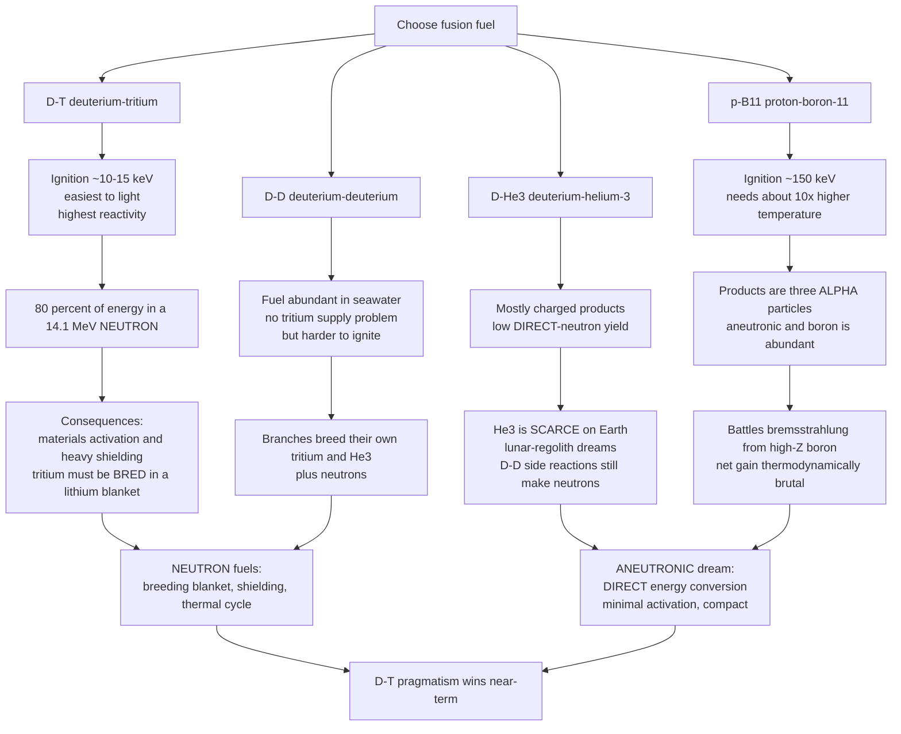

# ☢️ Fusion Fuel Cycles and Aneutronic Fusion

> [!abstract] TL;DR
> **Choosing a fusion fuel is choosing a set of trade-offs that reshape the entire reactor.** Deuterium–tritium (**D-T**) has the lowest ignition temperature ($\sim 10$–$15$ keV) and the highest reactivity, so nearly every near-term reactor bets on it — but $\sim 80\%$ of its $17.6$ MeV escapes as a $14.1$ MeV **neutron** that activates the structure, demands heavy shielding, and forces a **tritium-breeding blanket** (tritium is radioactive, $\sim 12.3$-yr half-life, essentially absent in nature, so it is bred from lithium). **D-D** fuel is abundant in seawater but harder to ignite and still makes neutrons. **D-³He** produces mostly charged particles but needs scarce ³He and still suffers D-D side neutrons. The holy grail is **aneutronic p-¹¹B**: abundant, stable fuel whose products are three charged **alpha particles**, enabling **direct energy conversion** and almost no activation — but it needs roughly **ten times higher temperature** ($\sim 150$+ keV) and battles severe **bremsstrahlung** losses from high-$Z$ boron that may make net gain thermodynamically brutal (Rider's limits). The neutron fraction of the fuel silently dictates breeding, shielding, materials, and how you turn fusion into electricity.

---

## Intuition

**Analogy:** Choosing a fusion fuel is like choosing wood for a campfire. The **easiest wood to light spits dangerous sparks everywhere**, while the **clean-burning hardwood needs a blast furnace to catch at all**. Deuterium–tritium is the easy kindling — it lights at the lowest temperature — but four-fifths of its energy flies out as fast **neutrons**, sparks that fly straight through your grate and slowly turn the whole fireplace radioactive, so you also have to run a factory just to keep making more of one of its two logs. The dream fuels, like hydrogen–boron, burn perfectly clean: they release only charged particles you could catch and turn straight into electricity, no radioactive soot. But they demand a furnace ten times hotter still, and even then the boron glows away much of its own heat as radiation before it can burn.

Every fusion program — public tokamaks and private startups alike — is fundamentally a **bet on which of these trade-offs will win**: the pragmatic, neutron-spitting D-T that we know ignites, or an aneutronic fuel that would be gorgeous to engineer *if* we can ever get it hot enough.

---

## How It Works

### Core mechanics

**1. The fuel sets the Coulomb barrier, hence the ignition temperature.** Two nuclei must tunnel through their mutual electrostatic repulsion to fuse. The barrier height scales as $Z_1 Z_2 / (r_1 + r_2)$, and the Gamow tunneling suppression scales as $\exp[-(E_G/E)^{1/2}]$ with the Gamow energy $E_G \propto (Z_1 Z_2)^2 \mu$. D-T has $Z_1 Z_2 = 1$; p-¹¹B has $Z_1 Z_2 = 1\times 5 = 5$, so its Gamow energy is roughly $25\times$ larger. That single factor is *why* p-¹¹B needs about ten times the temperature of D-T.

**2. The fuel sets the reactivity $\langle\sigma v\rangle(T)$.** The volumetric fusion rate is $R = n_1 n_2\langle\sigma v\rangle$, where the reactivity is the cross-section averaged over a Maxwellian velocity distribution (see [[Kinetic_Theory_of_Gases]]). D-T has both the lowest ignition temperature *and* the highest peak reactivity — a rare double win — which is why it dominates.

**3. The fuel sets the neutron fraction.** The reaction products decide where the energy goes. D-T dumps $80\%$ into a neutron; p-¹¹B produces three charged alphas and essentially none. Neutrons cannot be steered by magnetic or electric fields, so their energy can only be recovered as heat in a shielded, activated blanket. Charged products can, in principle, be decelerated directly into electricity.

**4. The neutron fraction sets the reactor.** A high-neutron fuel forces (a) a tritium-breeding blanket, (b) neutron shielding and remote maintenance, (c) materials that survive $\sim 14$ MeV neutron damage, and (d) a Carnot-limited thermal cycle. An aneutronic fuel opens the door to **direct energy conversion** and a compact, low-activation machine — the whole reason startups chase it.

**5. Availability sets whether you can even fuel it.** D-T needs tritium, which must be **bred** from lithium (`n + ⁶Li → ⁴He + T + 4.8 MeV`) because it barely exists in nature. ³He is astronomically scarce on Earth (hence lunar-regolith mining fantasies). Deuterium and boron-11 are cheap and abundant.

### Flow / architecture



---

## Key Concepts

### Secondary Level

**The four candidate reactions.**

| Fuel | Reaction | Energy | Neutron? |
|------|----------|--------|----------|
| **D-T** | $^2\text{D} + ^3\text{T} \to ^4\text{He}\,(3.5) + n\,(14.1)$ | 17.6 MeV | yes, ~80% |
| **D-D** | $^2\text{D} + ^2\text{D} \to \,^3\text{T}(1.01) + p(3.02)$  **or**  $^3\text{He}(0.82) + n(2.45)$ | 4.03 / 3.27 MeV | ~half the branches |
| **D-³He** | $^2\text{D} + ^3\text{He} \to ^4\text{He}\,(3.6) + p\,(14.7)$ | 18.3 MeV | almost none (direct) |
| **p-¹¹B** | $p + ^{11}\text{B} \to 3\,^4\text{He}$ | 8.7 MeV | ~none (aneutronic) |

**Neutron vs charged particle — why it matters.** A neutron is electrically neutral: it flies straight through magnets and walls, embedding its energy deep in the structure (heat you must catch, plus **activation** that makes the material radioactive). A charged product (proton, alpha) is trapped by fields, deposits its energy in the plasma to help sustain the burn, and can be recovered as electricity by slowing it in an electric field.

**Why D-T is the "easy" fuel.** It has the lowest ignition temperature and the largest cross-section of all fusion reactions. Every flagship device — tokamaks, the NIF laser implosions — burns D-T because it is the only fuel we can realistically ignite today.

**Tritium is the catch.** Tritium is radioactive (beta decay, $\sim 12.3$-yr half-life), so it does not exist in nature in usable amounts. A D-T reactor must **make its own tritium** — the single biggest complication of the "easy" fuel.

### Undergraduate Level

**Reactivity and the Gamow window.** $\langle\sigma v\rangle(T)$ rises steeply with temperature because raising $T$ pushes more ions into the high-energy Maxwellian tail where tunneling is possible. Because the Gamow energy grows as $(Z_1 Z_2)^2\mu$, higher-$Z$ fuels shift their whole reactivity curve to the right and downward: D-T peaks near $\sim 65$ keV at $\langle\sigma v\rangle \sim 9\times10^{-16}\ \text{cm}^3/\text{s}$, whereas p-¹¹B peaks near $\sim 600$ keV at a *lower* value. The Python demo plots exactly this.

**The tritium fuel cycle and breeding ratio.** The $14.1$ MeV D-T neutron is captured in a lithium **blanket** surrounding the plasma:
$$n + ^6\text{Li} \to ^4\text{He} + T + 4.78\ \text{MeV}, \qquad n + ^7\text{Li} \to ^4\text{He} + T + n - 2.47\ \text{MeV}.$$
The **tritium breeding ratio** (TBR = tritium bred per tritium burned) must exceed $\sim 1.05$–$1.1$ to cover burn, radioactive decay, and losses. Since one neutron can breed at most one triton, designers add **neutron multipliers** (beryllium or lead, via $(n,2n)$ reactions) to push TBR above unity. This breeding blanket is a whole subsystem that a neutron-free fuel would eliminate.

**Direct energy conversion.** If the products are charged, you can send them into a series of biased electrodes (a traveling-wave or venetian-blind converter) that decelerate them, turning kinetic energy straight into DC electricity at high efficiency — bypassing the boiler-turbine cycle and its Carnot ceiling. This is the prize aneutronic fuels dangle: it needs charged output, so it is essentially impossible for D-T.

**The catalyzed D-D and D-³He cycles.** Pure D-D breeds its own tritium and ³He, which then burn (D-T and D-³He), so a "D-D" reactor is really a mix. D-³He's *primary* reaction is aneutronic, but you cannot avoid D-D side reactions between the deuterons, which reintroduce $2.45$ MeV neutrons — so D-³He is "low-neutron," not neutron-free.

### Graduate Level

**Bremsstrahlung and the ignition margin.** Every hot plasma radiates **bremsstrahlung** as electrons scatter off ions, with power density
$$P_{\text{brem}} \propto n_e^2\, Z_{\text{eff}}\, \sqrt{T_e},$$
scaling with the *square* of ion charge. Boron ($Z=5$) is a strong radiator, so a p-¹¹B plasma loses a large fraction of its energy to X-rays *before* it can fuse. Ignition requires fusion power to exceed radiation losses; for D-T this is comfortable above a few keV, but for p-¹¹B in **thermal equilibrium** the bremsstrahlung curve can nearly touch (or exceed) the fusion curve, leaving a razor-thin or negative net-power margin.

**Rider's thermodynamic limits.** One escape is a **non-equilibrium** plasma — hot ions, cold electrons — to suppress bremsstrahlung. **Todd Rider (1995)** showed this is thermodynamically brutal: Coulomb collisions equilibrate ions and electrons so fast that maintaining the temperature difference costs recirculating power comparable to or exceeding the fusion output. His analysis implies that any fusion system *not* in thermodynamic equilibrium pays a prohibitive price, which is why p-¹¹B remains so hard even in principle.

**The confinement penalty.** Nevins (1998) and others quantified the confinement requirements for advanced fuels: the required triple product $n T \tau_E$ for p-¹¹B is roughly **two to three orders of magnitude** harder than D-T, combining lower reactivity, higher temperature, and radiation losses. Aneutronic fusion is not a small step past D-T; it is a different regime.

**Synchrotron radiation and revised cross-sections.** At the high $T$ and $B$ of an advanced-fuel machine, **synchrotron** emission adds another loss channel (mitigable by wall reflectivity). On the encouraging side, measurements (e.g. Sikora & Weller 2016) revised the p-¹¹B cross-section *upward* near its resonance, and private ventures — **TAE Technologies** (field-reversed configuration, p-¹¹B), **HB11 Energy** (laser-driven p-¹¹B), and **LPPFusion** (dense plasma focus) — pursue it commercially, with D-³He often cited as an intermediate advanced-fuel target.

---

## Python Demo

```python
"""
Fusion fuel-cycle comparison.
  (a) Maxwellian reactivity <sigma*v>(T) for D-T, D-D, D-3He, p-11B.
  (b) Neutron vs charged-particle energy split + fuel availability.

D-T, D-D and D-3He use the Bosch-Hale (1992) parametrization (accurate 0.2-1000 keV).
p-11B uses a log-log interpolation of published Nevins-Swain (2000) reactivities:
its cross-section has a resonance, so no simple Gamow form fits it.
Only numpy + matplotlib are used.
"""
import numpy as np
import matplotlib.pyplot as plt

# ---- Bosch-Hale reactivity <sigma*v> [cm^3/s], T in keV ---------------------
def bosch_hale(T, BG, mrc2, C1, C2, C3, C4, C5, C6, C7):
    theta = T / (1.0 - T*(C2 + T*(C4 + T*C6)) / (1.0 + T*(C3 + T*(C5 + T*C7))))
    xi = (BG**2 / (4.0*theta))**(1.0/3.0)
    return C1 * theta * np.sqrt(xi/(mrc2*T**3)) * np.exp(-3.0*xi)

# (BG, mrc2, C1..C7) from Bosch & Hale, Nucl. Fusion 32, 611 (1992)
DT   = (34.3827, 1124656, 1.17302e-9, 1.51361e-2, 7.51886e-2, 4.60643e-3, 1.35000e-2, -1.06750e-4, 1.36600e-5)
DHe3 = (68.7508, 1124572, 5.51036e-10, 6.41918e-3, -2.02896e-3, -1.91080e-5, 1.35776e-4, 0.0, 0.0)
DDp  = (31.3970,  937814, 5.65718e-12, 3.41267e-3, 1.99167e-3, 0.0, 1.05060e-5, 0.0, 0.0)  # D(d,p)T
DDn  = (31.3970,  937814, 5.43360e-12, 5.85778e-3, 7.68222e-3, 0.0, -2.96400e-6, 0.0, 0.0) # D(d,n)3He

T = np.logspace(0, 3, 500)                      # 1 ... 1000 keV
sv_DT   = bosch_hale(T, *DT)
sv_DHe3 = bosch_hale(T, *DHe3)
sv_DD   = bosch_hale(T, *DDp) + bosch_hale(T, *DDn)   # total D-D (both branches)

# p-11B: interpolate published Nevins-Swain reactivities in log-log space
Tp  = np.array([  20,      50,      100,     150,     200,     300,     400,     500,     700,     1000])
svp = np.array([3.0e-22, 1.4e-19, 4.6e-18, 2.4e-17, 6.5e-17, 1.7e-16, 2.6e-16, 3.1e-16, 3.4e-16, 3.2e-16])
sv_pB = 10.0**np.interp(np.log10(T), np.log10(Tp), np.log10(svp))

# peak (ignition-relevant) temperatures
Tpk_DT = T[np.argmax(sv_DT)]
Tpk_pB = T[np.argmax(sv_pB)]
print(f"D-T   peak reactivity {sv_DT.max():.2e} cm^3/s at ~{Tpk_DT:.0f} keV")
print(f"p-11B peak reactivity {sv_pB.max():.2e} cm^3/s at ~{Tpk_pB:.0f} keV")
print(f"peak-temperature ratio p-11B / D-T: {Tpk_pB/Tpk_DT:.0f}x")

# ---- figure -----------------------------------------------------------------
fig, (ax1, ax2) = plt.subplots(1, 2, figsize=(13, 5.2))

# (a) reactivity curves
ax1.loglog(T, sv_DT,   lw=2.4, label="D-T")
ax1.loglog(T, sv_DD,   lw=2.0, label="D-D (total)")
ax1.loglog(T, sv_DHe3, lw=2.0, label="D-He3")
ax1.loglog(T, sv_pB,   lw=2.4, ls="--", label="p-B11")
ax1.axvline(Tpk_DT, color="gray", ls=":", lw=1)
ax1.axvline(Tpk_pB, color="gray", ls=":", lw=1)
ax1.annotate(f"D-T peak ~{Tpk_DT:.0f} keV", (Tpk_DT, 3e-15),
             rotation=90, va="top", ha="right", fontsize=8)
ax1.annotate(f"p-B11 peak ~{Tpk_pB:.0f} keV (~{Tpk_pB/Tpk_DT:.0f}x hotter)",
             (Tpk_pB, 3e-18), rotation=90, va="bottom", ha="right", fontsize=8)
ax1.set_xlabel("Ion temperature  T  [keV]")
ax1.set_ylabel(r"Reactivity  $\langle\sigma v\rangle$  [cm$^3$/s]")
ax1.set_title("(a) D-T lights easiest; p-B11 needs ~10x higher T, lower peak")
ax1.set_ylim(1e-22, 1e-14)
ax1.grid(True, which="both", alpha=0.3)
ax1.legend()

# (b) neutron vs charged energy fraction + availability
fuels   = ["D-T", "D-D", "D-He3", "p-B11"]
neutron = np.array([80.0, 34.0, 5.0, 0.1])       # percent of fusion energy in neutrons
charged = 100.0 - neutron
avail   = ["T bred\nfrom Li", "seawater\nabundant", "He3\nscarce", "boron\nabundant"]

x = np.arange(len(fuels))
ax2.bar(x, neutron, color="#d9534f", label="neutron energy")
ax2.bar(x, charged, bottom=neutron, color="#5cb85c", label="charged-particle energy")
for i, nf in enumerate(neutron):
    inside = nf > 8
    ax2.text(i, nf/2 if inside else nf + 3, f"{nf:g}%", ha="center",
             va="center", fontsize=9, color="white" if inside else "black")
    ax2.text(i, -14, avail[i], ha="center", va="center", fontsize=8)
ax2.set_xticks(x); ax2.set_xticklabels(fuels)
ax2.set_ylabel("Share of fusion energy [percent]")
ax2.set_ylim(-22, 105)
ax2.axhline(0, color="k", lw=0.8)
ax2.set_title("(b) Neutron burden vs direct-convertible output + fuel supply")
ax2.legend(loc="center right")
ax2.text(1.5, -20, "high-Z boron -> strong bremsstrahlung (Rider limit)",
         ha="center", fontsize=7, style="italic")

plt.tight_layout()
plt.savefig("fusion_fuel_cycles.png", dpi=120)
plt.show()
```

**What it shows.** Panel (a): the D-T curve sits farthest left (lights coldest) and highest (best reactivity); p-B11 is shoved roughly ten times hotter with a *lower* peak — the campfire hardwood that needs a blast furnace. Panel (b): the neutron burden collapses from $\sim 80\%$ (D-T) toward zero (p-B11), which is precisely what unlocks direct energy conversion — paid for by ten-times temperature and a fuel-availability story (tritium must be bred, ³He is scarce, boron is cheap) plus boron's bremsstrahlung penalty.

---

## Real-World Applications

- **D-T is the default everywhere.** ITER, SPARC, most tokamaks, and the NIF laser-implosion ignition of 2022 all burn D-T — the only fuel we can currently ignite.
- **Tritium-breeding blankets.** ITER's Test Blanket Modules and proposed power-plant blankets use lithium ceramics, liquid lithium–lead (PbLi), or FLiBe molten salt to breed tritium and capture $14$ MeV neutron heat. This subsystem exists *only* because D-T is neutron-heavy.
- **Helium-3 mining fantasies.** Because terrestrial ³He is vanishingly rare, proposals to mine lunar regolith (which holds trace ³He from the solar wind) recur — an economic reach that underlines how fuel *availability*, not just physics, gates a fuel cycle.
- **Aneutronic startups.** TAE Technologies pursues p-¹¹B in a field-reversed configuration; HB11 Energy chases laser-driven p-¹¹B; LPPFusion uses a dense plasma focus. In 2023, laser experiments reported enhanced p-¹¹B alpha yields, keeping the aneutronic dream commercially alive despite the daunting physics.
- **Low-activation materials R&D.** The entire push for reduced-activation ferritic-martensitic steels and SiC composites exists to survive D-T's neutron flux — an engineering burden a p-¹¹B machine would largely sidestep.

---

## Common Pitfalls

- **"D-T is easy, therefore fusion is nearly solved."** D-T is easiest to *ignite*, but its $14.1$ MeV neutrons cause materials **activation**, demand thick shielding and remote maintenance, and force a tritium-breeding blanket. The easy fuel imports the hardest engineering.
- **Forgetting that tritium must be bred.** Tritium is radioactive and essentially absent in nature; a D-T plant that cannot breed a tritium breeding ratio above $\sim 1$ from its lithium blanket simply runs out of fuel. Global tritium inventories are tiny.
- **Thinking D-D avoids neutrons.** D-D breeds its own tritium and ³He, which then burn — so a "D-D" reactor still produces $14$ MeV D-T neutrons plus its own $2.45$ MeV D-D neutrons.
- **Calling D-³He "neutron-free."** Its primary reaction is aneutronic, but unavoidable D-D side reactions among the deuterons still emit $2.45$ MeV neutrons. It is low-neutron, not zero.
- **Assuming p-¹¹B is a small step past D-T.** It is aneutronic and its fuel is abundant, but it needs roughly ten times the temperature *and* fights bremsstrahlung from high-$Z$ boron, which can push it against or past the ideal ignition limit (Rider). The confinement requirement is orders of magnitude harsher.
- **Overselling "neutron-free" claims.** Even p-¹¹B has secondary neutron channels (e.g. $^{11}\text{B}(\alpha,n)$ at high energy) and any deuterium contamination adds neutrons. Aneutronic means *nearly* neutron-free — a huge advantage for direct energy conversion and low activation, but "zero neutrons" is marketing, not physics.

---

## Related Concepts

- [[Nuclear_Reactions_Fission_Fusion]] — the Q-values, cross-sections, and Lawson criterion that these fuel choices build on
- [[Nuclear_Structure]] — the binding-energy curve that makes light-nucleus fusion exothermic and sets each reaction's energy release
- [[Radioactive_Decay]] — why tritium's $\sim 12.3$-yr half-life makes it scarce and forces breeding
- [[Stellar_Structure_and_Energy_Generation]] — stars solve the same Coulomb-barrier problem with the pp chain and CNO cycle at their own "fuel" temperatures
- [[Stellar_Nucleosynthesis]] — where deuterium, lithium, and boron actually come from cosmically
- [[Kinetic_Theory_of_Gases]] — the Maxwellian velocity distribution whose high-energy tail the reactivity $\langle\sigma v\rangle$ averages over

Sibling notes in this section develop the surrounding physics in prose: *Nuclear Fusion and the Lawson Criterion* (the ignition condition each fuel must meet), *Inertial Confinement Fusion* (D-T pellet implosion), *Fusion Reactor Engineering and Breeding* (the blanket and tritium cycle in detail), *The Path to Fusion Energy* (public and private roadmaps), and *Stellarators and Alternative Confinement* (the machines that would host these fuels).

---

## Review Questions

1. **(Secondary)** D-T releases $17.6$ MeV, of which the neutron carries $14.1$ MeV. What fraction of the energy is in the neutron, and name two engineering consequences of that neutron for the reactor.
2. **(Undergraduate)** Explain, using the Gamow energy $E_G \propto (Z_1 Z_2)^2\mu$, *why* p-¹¹B ($Z_1 Z_2 = 5$) requires roughly ten times the temperature of D-T to reach comparable reactivity. Then write the two lithium reactions a D-T blanket uses to breed tritium and explain why the breeding ratio must exceed one.
3. **(Graduate)** A startup claims a p-¹¹B reactor that suppresses bremsstrahlung by running electrons much colder than ions. Using Rider's argument about collisional equilibration, explain why this "non-equilibrium" scheme is thermodynamically expensive, and contrast the ideal ignition margin of p-¹¹B with that of D-T.

---

## Sources

- Freidberg, *Plasma Physics and Fusion Energy* (Cambridge, 2007) — fuel cycles, reactivity, Lawson and ignition.
- Atzeni & Meyer-ter-Vehn, *The Physics of Inertial Fusion* (Oxford, 2004) — cross-sections, reactivities, ignition physics.
- Nevins, "A Review of Confinement Requirements for Advanced Fuels," *J. Fusion Energy* 17, 25 (1998).
- Rider, "Fundamental limitations on plasma fusion systems not in thermodynamic equilibrium," *Phys. Plasmas* 4, 1039 (1997) (MIT PhD thesis, 1995).
- Bosch & Hale, "Improved formulas for fusion cross-sections and thermal reactivities," *Nucl. Fusion* 32, 611 (1992).

---

#plasma-physics #fusion-fuels #aneutronic-fusion #deuterium-tritium #proton-boron
