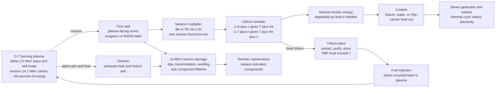

# 🏭 Fusion Reactor Engineering and Breeding

> [!abstract] TL;DR
> Making the plasma burn is only *half* the fusion problem; the other half is building a machine that survives sitting next to a small star for decades **and makes its own fuel**. Each D-T fusion releases a **14.1 MeV neutron** carrying ~80% of the energy, and that neutron is simultaneously a threat and a gift. As a threat it slams into the reactor wall like a sandblaster of subatomic bullets, knocking atoms off their lattice sites (**displacement damage**, measured in **dpa**), transmuting steel into helium and hydrogen that make it swell and go brittle, and leaving everything **radioactive** (activation). As a gift, if you wrap the plasma in a **lithium blanket**, those same neutrons transmute lithium into fresh **tritium** — the fuel D-T reactors burn but that does not exist in nature (half-life 12.3 years). The blanket must therefore do two jobs at once: **capture the neutron's energy as heat** for a steam turbine, and **breed more tritium than the plasma burns**. The measure of success is the **Tritium Breeding Ratio (TBR)**, which must exceed 1 (with margin) for a plant to be self-sufficient — achieved with **Li-6 enrichment** plus a **neutron multiplier** (beryllium or lead via the n,2n reaction). Tritium self-sufficiency and neutron-tolerant, low-activation materials are arguably the **hardest unsolved part of fusion**, often overshadowing the plasma physics itself.

## Intuition

**Analogy — the self-fueling neutron catcher wrapped around a magnetic bottle.** Imagine you own the world's cleanest furnace, but it burns a fuel so rare it barely exists on Earth — and, luckily, its own exhaust can be turned back into that fuel if you line the firebox correctly. That is a fusion reactor. Every fusion neutron that blasts out of the plasma is a bullet *and* a seed. Fire it into a bare steel wall and it wrecks the metal atom by atom, like a sandblaster chewing through a sign. Fire that same neutron into a **wall lined with lithium**, and it transmutes the lithium into a fresh atom of tritium fuel while dumping its kinetic energy as heat you can boil water with.

So the plasma physicist's triumph — a stable, hot, confined burning plasma — hands the *engineer* a brutal follow-on problem: build a **blanket** that catches nearly every neutron, breeds back more tritium than was burned, extracts the heat cleanly, and does all this while being slowly demolished by the very neutrons it is harvesting. The magnetic bottle holds the star; the blanket makes the machine a *power plant*. Engineering that blanket — and finding steels that do not crumble under a 14 MeV neutron rain — is as hard as taming the plasma, and it is the part that is still, genuinely, unsolved.

---

## How It Works

### Core mechanics

**1. The neutron carries the energy — and the damage.** The workhorse reaction is $D + T \rightarrow {}^4\text{He}\,(3.5\text{ MeV}) + n\,(14.1\text{ MeV})$. The charged **alpha** stays magnetically trapped and self-heats the plasma (that is what "ignition" means); the **neutron** is uncharged, ignores the magnetic field entirely, and flies straight out carrying **~80% of the fusion power**. Everything downstream of the plasma — power, fuel, and damage — is a story about what that neutron hits.

**2. The blanket does two jobs.** Surrounding the plasma (behind the first wall) sits the **breeding blanket**, ~0.5–1 m thick, and it must simultaneously:
- **Extract energy as heat.** The neutron scatters and slows down in the blanket, depositing its kinetic energy; a coolant (helium, water, or liquid metal) carries that heat to a conventional steam/turbine cycle. This is an ordinary [[Laws_of_Thermodynamics|heat engine]] bolted onto a neutron source, capped by the Carnot ceiling of its coolant temperature.
- **Breed tritium** from lithium.

**3. Breeding: turning lithium into fuel.** Two reactions matter:
$$
{}^6\text{Li} + n \rightarrow T + {}^4\text{He} + 4.8\text{ MeV} \quad(\text{exothermic; huge cross-section for slow neutrons})
$$
$$
{}^7\text{Li} + n \rightarrow T + {}^4\text{He} + n' - 2.5\text{ MeV} \quad(\text{endothermic; threshold} \sim 2.5\text{ MeV, and it gives a neutron back})
$$
Li-6 is the breeding workhorse but only **7.5%** of natural lithium — hence **Li-6 enrichment**. Li-7 contributes some breeding *and* regenerates a neutron, so you do not want 100% Li-6 either; there is an optimum.

**4. The Tritium Breeding Ratio must exceed 1.** Define
$$
\text{TBR} = \frac{\text{tritium atoms bred in the blanket}}{\text{tritium atoms burned in the plasma}}.
$$
Each fusion consumes one tritium and produces exactly **one** neutron, so a bare blanket can breed at most one tritium per burned tritium — **TBR = 1 is the absolute ceiling** without help, and real geometry (ports, divertor, structure, incomplete coverage, neutron streaming, tritium decay and processing losses) always eats into it. To reach the required **TBR ≳ 1.05–1.15** you must *multiply* the neutrons.

**5. The neutron multiplier.** Insert **beryllium** or **lead**, which undergo **(n,2n)**: one incoming neutron leaves as two. Be(n,2n) has a threshold near 1.8 MeV, Pb(n,2n) near 7 MeV — both are triggered by the fast 14 MeV source neutron before it slows down. Multiplying the neutron population lets each breed more than one tritium, pushing TBR comfortably above unity. Leading blanket concepts: **solid ceramic breeder + Be pebbles** (e.g., HCPB — Helium-Cooled Pebble Bed), **liquid lithium-lead** eutectic (PbLi in WCLL/DCLL, where the Pb is *also* the multiplier and the fluid can double as coolant), and **molten salt FLiBe** (which cools, breeds, and multiplies at once).

**6. The materials problem: 14 MeV is brutal.** Unlike a fission reactor's ~2 MeV neutrons, the fusion neutron is **7× more energetic**, and it does three kinds of harm to structural steel:
- **Displacement damage (dpa):** each neutron knocks lattice atoms off their sites, cascading into vacancies and interstitials ([[Defects_and_Dislocations_in_Crystals|point defects and dislocations]]). Accumulated **displacements-per-atom (dpa)** measure the dose. A first wall at 1 MW/m² neutron loading accrues **~10 dpa per full-power year**.
- **Transmutation:** 14 MeV neutrons drive (n,α) and (n,p) reactions that produce **helium and hydrogen gas** inside the metal — the He appm-per-dpa ratio (~10–15 for steel) is *far* higher than in fission. The gas collects at grain boundaries, causing **swelling** and **embrittlement**.
- **Activation:** neutron capture makes the structure **radioactive**, dictating waste handling and forcing **remote maintenance** of everything inside the vessel.

**7. Low-activation materials and the divertor.** These constraints drive **Reduced-Activation Ferritic-Martensitic (RAFM) steels** like **EUROFER97** (Cr-W-Ta-V, deliberately free of Nb, Mo, Ni which activate to long-lived isotopes), plus **SiC composites** and **tungsten** for the highest-flux plasma-facing components. The **divertor** — the exhaust duct that receives the alpha "ash" and up to ~10 MW/m² of surface heat — is the other material extreme (tie-in: *Plasma_Material_Interactions_and_the_Divertor*). Component **lifetime is set by the dpa limit** (~150 dpa target for RAFM), after which the first wall and divertor must be swapped out — remotely, because they are activated.

### Flow / architecture



---

## Key Concepts

### Secondary Level

- **The neutron is both threat and gift.** A single D-T fusion shoots out one fast neutron that carries most of the energy. Aimed at bare steel it *wrecks* the wall; aimed at lithium it *makes new fuel*. A fusion reactor is designed to exploit the second while surviving the first.
- **The blanket is the firebox lining.** The layer wrapped around the plasma catches the neutrons, turns their energy into **heat** (to boil water and spin a turbine, like any power plant), and **breeds tritium** from lithium.
- **Tritium is not found in nature.** It decays with a 12.3-year half-life, so there is essentially none lying around. A D-T reactor *must manufacture its own fuel* as it runs — this is what "breeding" means.
- **Breed more than you burn.** The plant only works if it makes at least a *little more* tritium than it consumes. That ratio is the **Tritium Breeding Ratio**, and it has to be above 1.
- **Neutrons slowly demolish the machine.** Over years, the 14 MeV rain damages the wall until parts must be replaced — and everything is radioactive, so replacement is done by robots.

### Undergraduate Level

- **The 80/20 energy split.** In D-T, the 3.5 MeV alpha (charged, confined) heats the plasma; the 14.1 MeV neutron (neutral, unconfined) escapes and delivers ~80% of the power to the blanket. Only the neutron energy is available for electricity; the alpha energy sustains the burn.
- **Breeding reactions:** ${}^6\text{Li}(n,\alpha)T$ (exothermic, large slow-neutron cross-section) and ${}^7\text{Li}(n,n'\alpha)T$ (endothermic, ~2.5 MeV threshold, *regenerates* a neutron). Natural Li is 7.5% Li-6 / 92.5% Li-7 — hence enrichment.
- **TBR ceiling and margin.** One fusion = one neutron = at most one bred tritium ⇒ **bare TBR ≤ 1**. Real losses (structure, coolant, ports, divertor gap, streaming, decay, processing hold-up) force a design target of **TBR ≈ 1.05–1.15**. The gap is closed by **Li-6 enrichment** + a **neutron multiplier**.
- **Neutron multiplier:** Be or Pb (n,2n) doubles neutrons above threshold, breaking the TBR ≤ 1 ceiling.
- **dpa and wall loading:** neutron **wall loading** (MW/m² of 14 MeV neutrons) sets the **dpa rate** (~10 dpa/fpy at 1 MW/m²). Component lifetime ≈ (dpa limit)/(dpa rate).
- **Low-activation steels:** RAFM steels (EUROFER97) replace Mo/Nb/Ni with W/Ta/V so activation decays to hands-on levels in ~100 years, not millennia.
- **The power cycle is conventional.** Once the heat is in the coolant, it is an ordinary [[Laws_of_Thermodynamics|Rankine/Brayton]] cycle — so **coolant temperature caps thermal efficiency** (higher-temperature He/PbLi blankets chase higher efficiency).

### Graduate Level

- **TBR budget accounting.** A credible design targets a *net* TBR above 1 after subtracting: geometric coverage (< 100% due to ports, NBI/RF ducts, divertor), neutron streaming through gaps, parasitic absorption in structure/coolant/multiplier, tritium radioactive decay in the inventory, and processing/extraction losses and hold-up. The required *doubling time* to bootstrap a fleet of reactors from a limited startup inventory adds further pressure to raise TBR.
- **Blanket concepts, compared.** **HCPB** (Li₄SiO₄ or Li₂TiO₃ ceramic pebbles + Be/Be₁₂Ti multiplier, He-cooled); **WCLL** (PbLi breeder-multiplier, water-cooled — high power density but water/PbLi chemistry and pressure risks); **DCLL** (Dual-Coolant Li-Pb with SiC flow-channel inserts for high outlet temperature); **molten salt FLiBe** (liquid immersion blanket, e.g., ARC/SPARC line — breeder, multiplier, and coolant in one, but tritium solubility/corrosion challenges). Solid-vs-liquid is the central blanket design axis.
- **He embrittlement and DBTT shift.** The high **He appm/dpa** ratio (~10–15) under the fusion spectrum drives **helium bubble** formation at grain boundaries → **swelling**, loss of [[Fracture_Mechanics_and_Toughness|fracture toughness]], and an upward **shift of the ductile-to-brittle transition temperature (DBTT)**. Combined with irradiation hardening and [[Fatigue_Creep_and_High_Temperature_Failure|thermal creep/fatigue]], this — not simple dpa — often sets the true operating window.
- **Tritium inventory, permeation, retention.** Tritium is small, mobile, and radioactive; it **permeates hot metals** by [[Diffusion_in_Solids_and_Ficks_Laws|Fickian diffusion]], is retained in plasma-facing components and co-deposited layers, and its inventory is both a **safety hazard** (mobile radionuclide) and a **fuel-cycle accounting** problem. Permeation barriers, low-inventory extraction, and precise accountancy are existential requirements.
- **The missing test facility.** There is **no operating 14 MeV neutron source** at reactor fluence to *qualify* materials; **IFMIF-DONES** (accelerator D-Li neutron source) is being built to fill this gap. Until then, materials data are extrapolated from fission reactors and ion beams — a recognized risk in the design of DEMO-class machines.
- **Systems-level realities.** Magnets (LTS Nb₃Sn / [[Superconductivity_and_BCS_Theory|HTS REBCO]] with cryogenics), balance-of-plant thermal efficiency, **remote maintenance** of activated internals, and **plant availability/economics** (frequent blanket/divertor replacement crushes capacity factor) turn reactor engineering into the true pacing item for commercial fusion.

---

## Python Demo

```python
# FUSION REACTOR ENGINEERING: tritium breeding and neutron damage.
# Two coupled engineering constraints that a D-T power plant must satisfy:
#
#   (a) TRITIUM BREEDING RATIO (TBR): a D-T plant burns tritium that does not
#       exist in nature, so its lithium BLANKET must breed MORE than it burns
#       (TBR > 1, with margin). One fusion makes exactly ONE neutron, so a bare
#       blanket caps at TBR = 1 -- we MUST multiply neutrons (Be/Pb via n,2n)
#       and enrich Li-6 to clear the bar. A simple phenomenological model shows
#       TBR vs Li-6 enrichment for several neutron-multiplication factors, plus
#       a bar chart of representative blanket designs.
#
#   (b) NEUTRON WALL LOADING and DAMAGE: the 14 MeV neutron flux knocks atoms
#       off the lattice (displacements-per-atom, dpa) and limits how long a
#       component survives. dpa accumulates linearly in time; component lifetime
#       = dpa_limit / dpa_rate. Higher wall loading => faster damage => shorter
#       life => the driver for low-activation, radiation-tolerant steels.
#
# numpy + matplotlib only. All numbers are order-of-magnitude engineering
# figures for teaching, not a neutronics code.

import numpy as np
import matplotlib.pyplot as plt

# ==================================================================
# (a) TRITIUM BREEDING RATIO model
# ==================================================================
# TBR = M * ( T6(e) + T7(e) ), where e = Li-6 enrichment fraction:
#   T6(e): Li-6 breeding, saturating in enrichment (slow-neutron capture)
#   T7(e): Li-7 breeding, proportional to Li-7 fraction (fast, above threshold)
#   M    : neutron multiplication factor (1.0 = none; >1 with Be/Pb via n,2n)
def tbr(e, M):
    T6 = 0.90 * e / (e + 0.10)     # saturates as almost all slow n hit Li-6
    T7 = 0.50 * (1.0 - e)          # fast-neutron breeding on Li-7 (also regen n)
    return M * (T6 + T7)

e = np.linspace(0.075, 0.95, 400)  # natural Li is 7.5% Li-6
M_values = [1.0, 1.2, 1.4]         # no multiplier, moderate, strong
TBR_required = 1.10                # design target: >1 with margin for losses

# Representative engineered blanket designs (enrichment, multiplication, label)
designs = [
    (0.075, 1.00, "Natural Li\nno multiplier"),
    (0.40,  1.00, "Li-6 enriched\nno multiplier"),
    (0.40,  1.30, "Enriched + Be\n(n,2n)"),
    (0.40,  1.25, "Enriched + PbLi\n(n,2n)"),
]
d_tbr = [tbr(en, M) for (en, M, _) in designs]
d_lbl = [lbl for (_, _, lbl) in designs]

# ==================================================================
# (b) NEUTRON WALL LOADING, dpa, and component LIFETIME
# ==================================================================
k_dpa     = 10.0     # dpa per full-power-year per (MW/m^2) of 14 MeV neutrons
dpa_limit = 150.0    # ~ RAFM steel (EUROFER) damage limit target [dpa]
He_per_dpa = 12.0    # helium appm produced per dpa under a fusion spectrum

# dpa accumulation vs time for several wall loadings
t = np.linspace(0.0, 20.0, 400)                 # full-power years
wall_loads = [0.5, 1.0, 2.0, 3.0]               # MW/m^2

# component lifetime vs wall loading (continuous)
P = np.linspace(0.5, 5.0, 400)                  # MW/m^2
dpa_rate = k_dpa * P                            # dpa / full-power-year
lifetime = dpa_limit / dpa_rate                 # full-power-years to reach limit

# ------------------------------------------------------------------
# sanity checks (printed)
# ------------------------------------------------------------------
print("(a) TRITIUM BREEDING RATIO")
for (en, M, lbl), val in zip(designs, d_tbr):
    verdict = "OK  (self-sufficient)" if val >= TBR_required else "FAIL (below margin)"
    print(f"    e={en:5.3f}  M={M:4.2f}  ->  TBR = {val:4.2f}   {verdict}")
opt = e[np.argmax(tbr(e, 1.0))]
print(f"    peak of the no-multiplier curve is near e = {opt:.2f} "
      f"(too much Li-6 loses the Li-7 neutron-regen contribution)")

print("\n(b) NEUTRON DAMAGE and LIFETIME")
for wl in wall_loads:
    life = dpa_limit / (k_dpa * wl)
    print(f"    wall loading {wl:3.1f} MW/m^2 -> {k_dpa*wl:5.1f} dpa/fpy "
          f"-> lifetime {life:5.1f} fpy, He at limit ~ {He_per_dpa*dpa_limit:.0f} appm")

# ==================================================================
# PLOTS
# ==================================================================
fig, ax = plt.subplots(2, 2, figsize=(13, 9))

# (a-1) TBR vs Li-6 enrichment for several multiplication factors
axa = ax[0, 0]
for M in M_values:
    axa.plot(e, tbr(e, M), lw=2, label=f"multiplier M = {M:.1f}")
axa.axhline(1.0, ls="--", c="gray", lw=1.2)
axa.axhline(TBR_required, ls=":", c="#c92a2a", lw=1.4)
axa.fill_between(e, 1.0, TBR_required, color="#ffe3e3", alpha=0.7)
axa.text(0.5, 1.02, "TBR = 1 (break-even ceiling for a bare blanket)",
         fontsize=8, color="gray")
axa.text(0.5, TBR_required + 0.02, "TBR target with margin",
         fontsize=8, color="#c92a2a")
axa.set_xlabel("Li-6 enrichment fraction")
axa.set_ylabel("Tritium Breeding Ratio (TBR)")
axa.set_title("(a) TBR vs enrichment: you need a multiplier to clear 1")
axa.legend(loc="lower right", fontsize=8)
axa.set_ylim(0.6, 1.9)

# (a-2) TBR of representative blanket designs
axb = ax[0, 1]
colors = ["#adb5bd" if v < TBR_required else "#2b8a3e" for v in d_tbr]
bars = axb.bar(range(len(d_tbr)), d_tbr, color=colors)
axb.axhline(1.0, ls="--", c="gray", lw=1.2)
axb.axhline(TBR_required, ls=":", c="#c92a2a", lw=1.4)
axb.set_xticks(range(len(d_lbl)))
axb.set_xticklabels(d_lbl, fontsize=8)
axb.set_ylabel("Tritium Breeding Ratio (TBR)")
axb.set_title("(b) Blanket designs: only enrichment + multiplier self-sustain")
for i, v in enumerate(d_tbr):
    axb.text(i, v + 0.02, f"{v:.2f}", ha="center", fontsize=9)
axb.set_ylim(0, 1.7)

# (b-1) dpa accumulation vs time for several wall loadings
axc = ax[1, 0]
for wl in wall_loads:
    axc.plot(t, k_dpa * wl * t, lw=2, label=f"{wl:.1f} MW/m^2")
axc.axhline(dpa_limit, ls="--", c="#c92a2a", lw=1.4)
axc.text(0.3, dpa_limit + 4, "RAFM steel dpa limit (~150)",
         fontsize=8, color="#c92a2a")
axc.set_xlabel("time (full-power years)")
axc.set_ylabel("accumulated damage (dpa)")
axc.set_title("(b) dpa accumulation: steeper flux hits the limit sooner")
axc.legend(title="neutron wall loading", loc="upper right", fontsize=8)
axc.set_ylim(0, 260)

# (b-2) component lifetime vs wall loading (with dpa rate on twin axis)
axd = ax[1, 1]
axd.plot(P, lifetime, color="#1c7ed6", lw=2.4, label="component lifetime")
axd.set_xlabel("neutron wall loading (MW/m^2)")
axd.set_ylabel("lifetime to dpa limit (full-power years)", color="#1c7ed6")
axd.tick_params(axis="y", colors="#1c7ed6")
axd.set_title("(b) Higher wall loading -> shorter life -> more replacements")
axe = axd.twinx()
axe.plot(P, dpa_rate, color="#e8590c", lw=2, ls="--", label="dpa rate")
axe.set_ylabel("damage rate (dpa per full-power year)", color="#e8590c")
axe.tick_params(axis="y", colors="#e8590c")

plt.tight_layout()
plt.savefig("fusion_reactor_engineering_demo.png", dpi=120)
print("\nsaved fusion_reactor_engineering_demo.png")
```

**What you should see.** Panel (a) plots **TBR vs Li-6 enrichment**: with **no multiplier** (M = 1.0) the curve *never* clears 1 with any margin — it even peaks at moderate enrichment and then falls, because pure Li-6 sacrifices the Li-7 reaction that *regenerates* a neutron. Adding a **neutron multiplier** (M = 1.2, 1.4) lifts the whole curve above the red target line, showing exactly why real blankets need Be or Pb. Panel (b) turns this into a bar chart of representative designs: **natural lithium with no multiplier fails**, while **Li-6-enriched blankets with a Be or PbLi multiplier** clear the margin and are self-sufficient. Panel (c) shows **dpa accumulating linearly** in time, steeper for higher **wall loading**, each line crossing the ~150 dpa RAFM limit at a different year. Panel (d) makes the trade explicit: **component lifetime is inversely proportional to wall loading** — the same higher power density that makes a compact reactor economical also demolishes its first wall faster, forcing more frequent (remote, activated) replacements. Tritium self-sufficiency and neutron endurance are two sides of the same 14 MeV neutron.

---

## Real-World Applications

- **ITER Test Blanket Module (TBM) program.** ITER itself is *not* tritium self-sufficient — it burns an external tritium supply (largely the world's civilian stockpile from CANDU heavy-water reactors). Its job for breeding is to **test candidate blanket modules** (HCPB and WCLL variants) in a real fusion neutron environment, the first in-situ TBR and materials data on the path to DEMO.
- **EU-DEMO.** The European demonstration power plant is designed around a **full breeding blanket** (HCPB with Li₄SiO₄/Li₂TiO₃ pebbles + beryllide multiplier, or WCLL PbLi), **EUROFER97** RAFM steel structure, and a genuine target of **TBR ≳ 1.1** with net electricity — the first machine intended to *close* the tritium fuel cycle.
- **ARC / SPARC (Commonwealth Fusion Systems).** A compact HTS-magnet tokamak line whose reference design uses a **liquid immersion blanket of molten FLiBe salt** that breeds tritium, multiplies neutrons, cools the machine, and shields the magnets simultaneously — and enables **replaceable vacuum-vessel** modules to sidestep the neutron-damage lifetime wall.
- **EUROFER97 and RAFM steel qualification.** The reference structural steel for European blankets, engineered to be **reduced-activation** (W/Ta/V instead of Mo/Nb/Ni) so that after shutdown the waste decays to hands-on levels in ~100 years rather than remaining hazardous for millennia.
- **IFMIF-DONES.** An accelerator-based **deuteron-on-lithium neutron source** under construction in Granada, Spain, purpose-built to produce a fusion-relevant 14 MeV neutron spectrum at high fluence so structural materials can finally be **qualified to the dpa doses** a real reactor demands — closing the single biggest gap in fusion materials data.
- **Tungsten divertors and plasma-facing components.** ITER's divertor uses **tungsten monoblocks** to survive ~10 MW/m² heat plus neutron loading, the highest-flux example of the plasma-material and neutron-damage problem in one component (see *Plasma_Material_Interactions_and_the_Divertor*).

---

## Common Pitfalls

- **Assuming TBR > 1 is easy.** One fusion produces exactly *one* neutron, so a bare blanket cannot exceed **TBR = 1** — and every real loss (structure, coolant, ports, divertor gap, neutron streaming, tritium decay, processing hold-up) pushes it *below*. Self-sufficiency **requires** Li-6 enrichment *and* a neutron multiplier (Be or Pb via n,2n); leaving either out silently sinks the fuel cycle.
- **Treating tritium as a fuel you can just buy.** Tritium does not exist naturally (12.3-year half-life; see [[Radioactive_Decay]]) and the world stockpile is tiny and shrinking. A D-T plant that does not breed its own is a dead end — tritium **self-sufficiency and inventory management are existential**, not optional.
- **Ignoring tritium retention and permeation.** Tritium is small, mobile, and radioactive; it **permeates hot metals** ([[Diffusion_in_Solids_and_Ficks_Laws|Fickian diffusion]]), gets **retained** in plasma-facing components, and its inventory is both a safety hazard and an accountancy nightmare. A blanket that "breeds enough on paper" but loses tritium to the walls is not self-sufficient.
- **Underestimating 14 MeV neutron damage.** Fusion neutrons are ~7× more energetic than fission neutrons and produce far more **helium and hydrogen per dpa**. That gas drives **swelling**, **DBTT shift**, and loss of [[Fracture_Mechanics_and_Toughness|toughness]] — real component lifetime is set by **embrittlement and He accumulation**, not dpa alone, and often earlier than a naive dpa count suggests.
- **Forgetting activation and remote maintenance.** Neutrons make the whole vessel radioactive, so *every* in-vessel replacement is **remote/robotic**. This is why **low-activation steels (EUROFER)** are mandatory and why **plant availability** hinges on how fast activated blanket/divertor modules can be swapped — an economics killer if underestimated.
- **Confusing "solid vs liquid" blanket trade-offs.** Solid ceramic-breeder + Be pebble beds (HCPB) and liquid PbLi / molten-salt FLiBe blankets have completely different failure modes, tritium extraction chemistry, MHD pressure-drop issues (liquid metal in a magnetic field), and coolant safety cases. Picking one is a whole-plant decision, not a detail.
- **Overrating thermal efficiency.** The power cycle is a conventional [[Laws_of_Thermodynamics|heat engine]] capped by coolant temperature — a water-cooled blanket at modest temperature yields modest Carnot efficiency. Chasing higher efficiency (high-temperature He or PbLi/DCLL) collides directly with materials limits.
- **Believing the materials are already qualified.** There is **no operating 14 MeV neutron source** at reactor fluence; data are extrapolated until **IFMIF-DONES** delivers. Reactor engineering — tritium self-sufficiency plus neutron-tolerant materials — is **arguably the hardest unsolved part of fusion**, frequently overshadowing the plasma physics.

---

## Related Concepts

- [[Nuclear_Reactions_Fission_Fusion]] — the D-T reaction that produces the 14.1 MeV neutron and the lithium(n,α) breeding reactions this whole note is built around.
- [[Radioactive_Decay]] — tritium's 12.3-year beta decay (why it must be bred, not mined) and the activation products that force remote maintenance and low-activation steels.
- [[Defects_and_Dislocations_in_Crystals]] — displacement damage (dpa) is precisely the neutron-driven creation of vacancies, interstitials, and dislocation loops in the structural lattice.
- [[Fracture_Mechanics_and_Toughness]] — irradiation embrittlement and the ductile-to-brittle transition shift that helium and hardening impose on the first wall.
- [[Fatigue_Creep_and_High_Temperature_Failure]] — the thermal-creep and cyclic-fatigue regime that hot, neutron-loaded blanket and divertor structures must survive alongside dpa.
- [[Diffusion_in_Solids_and_Ficks_Laws]] — the transport physics of tritium permeation and retention in hot metals, central to inventory, safety, and self-sufficiency.
- [[Laws_of_Thermodynamics]] — the balance-of-plant heat engine: coolant temperature caps the Carnot/Rankine efficiency of converting neutron heat to electricity.
- [[Superconductivity_and_BCS_Theory]] — the LTS (Nb₃Sn) and HTS (REBCO) magnets that make the magnetic bottle, and the cryogenics/shielding they demand behind the blanket.

*Section siblings (build order, prose only): Nuclear_Fusion_and_the_Lawson_Criterion sets the ignition conditions upstream of this engineering; Fusion_Fuel_Cycles_and_Aneutronic_Fusion contrasts D-T's neutron burden with neutron-lean alternatives that dodge the breeding/damage problem; Plasma_Material_Interactions_and_the_Divertor covers the heat-exhaust extreme complementary to the neutron-damage extreme here; Tokamak_Physics supplies the confined burning plasma the blanket wraps; The_Path_to_Fusion_Energy places tritium self-sufficiency and materials qualification on the roadmap to a power plant.*

---

## Review Questions

1. **(Secondary)** Tritium does not occur naturally, yet a D-T reactor runs on it continuously. Where does the fuel come from, and what everyday-sounding job does the reactor's "blanket" do besides catching heat? Explain in one or two sentences why the neutron is called "both a threat and a gift."
2. **(Undergraduate)** Explain why a *bare* fusion blanket can have a Tritium Breeding Ratio no greater than 1, and list at least three real effects that push it below 1. What two engineering measures raise it back above 1 with margin, and what nuclear reaction underlies the multiplier?
3. **(Undergraduate)** Define neutron **wall loading** and **dpa**. If the first wall sees 2 MW/m² and steel accrues ~10 dpa per full-power year per MW/m², how many full-power years until it reaches a 150 dpa limit? Why does a *more compact, higher-power-density* reactor face a *shorter* first-wall lifetime?
4. **(Undergraduate/Graduate)** Compare the 14 MeV fusion neutron to a ~2 MeV fission neutron in terms of the damage it does to structural steel. Beyond simple displacement damage, name the two transmutation products that accumulate and explain how they cause swelling and embrittlement — and why the He-appm-per-dpa ratio matters for setting the true component lifetime.
5. **(Graduate)** You are choosing between a solid ceramic-pebble HCPB blanket and a liquid PbLi (WCLL/DCLL) or molten-salt FLiBe blanket. Discuss the trade-offs across: tritium breeding and extraction, neutron multiplication, coolant temperature and thermal efficiency, MHD pressure drop, and safety/activation. Which considerations would push you toward a liquid immersion blanket in a compact HTS device?
6. **(Graduate)** Why is the lack of an operating 14 MeV neutron source (motivating IFMIF-DONES) considered one of the highest risks on the path to a fusion power plant? Explain what it prevents us from knowing about EUROFER-class steels, and argue for or against the claim that reactor engineering — not plasma physics — is now the pacing item for commercial fusion.

---

## Sources

- Freidberg, J. P. — *Plasma Physics and Fusion Energy*, Cambridge University Press, 2007 — comprehensive treatment of the D-T fuel cycle, blanket neutronics, tritium breeding, and reactor engineering constraints.
- Abdou, M., Riva, M., Ying, A., et al. — "Physics and technology considerations for the deuterium–tritium fuel cycle and conditions for tritium fuel self sufficiency," *Nuclear Fusion* 61, 013001 (2021) — the definitive analysis of TBR margins, tritium inventory, and self-sufficiency requirements.
- Zohm, H., et al. — "On the physics guidelines for a tokamak DEMO," *Nuclear Fusion* 53, 073019 (2013) — EU-DEMO design basis linking plasma performance to blanket, first-wall, and power-plant engineering.
- Knaster, J., Moeslang, A., & Muroga, T. — "Materials research for fusion," *Nature Physics* 12, 424–434 (2016) — the fusion neutron damage problem (dpa, He/H transmutation, activation), reduced-activation steels, and the IFMIF-DONES materials-qualification gap.
- Boccaccini, L. V., et al. — "Objectives and status of EUROfusion DEMO blanket studies," *Fusion Engineering and Design* 109–111, 1199–1206 (2016) — HCPB vs WCLL breeding blanket concepts, breeder/multiplier choices, and EUROFER structural design.

---

#plasma-physics #fusion-reactor #tritium-breeding #fusion-materials #blanket
