# 💥 Inertial Confinement Fusion

> [!abstract] TL;DR
> **Magnetic** fusion holds a wispy, near-vacuum plasma *gently* for a *long* time (seconds) with magnetic fields. **Inertial confinement fusion (ICF)** does the exact opposite: it crushes a peppercorn-sized pellet of frozen deuterium–tritium so violently and so fast that the fuel **fuses before it has time to fly apart** — held together for a few *billionths of a second* by nothing but its own **inertia**. The recipe is a controlled miniature hydrogen bomb: blast the pellet's surface with the world's most powerful lasers (or laser-generated X-rays), the heated surface blows off like a **rocket exhaust**, and Newton's third-law recoil **implodes** the core to densities *beyond the center of the Sun* ($\sim1000\ \mathrm{g/cm^3}$, denser than lead), igniting a central **hotspot** whose fusion **burn wave** propagates outward. It is the **same Lawson triple product** $n T \tau$ as magnetic fusion — but at the *opposite corner*: **colossal density $n$, minuscule confinement time $\tau$**. In **December 2022** the National Ignition Facility (NIF) crossed the threshold every fusion program chases: **3.15 MJ of fusion energy out from 2.05 MJ of laser energy in** — target gain $>1$, a scientific first.

## Intuition

**Analogy — the belt of dynamite and the rocket.** Imagine a marble-sized ball of ice, and you want to heat its center to a hundred million degrees for just long enough to fuse. You cannot *hold* it there — nothing solid survives those conditions. So instead you wrap the ball in a thin shell and detonate that shell *evenly, all at once, from every direction*. As the shell surface flashes into plasma and rockets **outward**, conservation of momentum drives the rest of the ball **inward** — a spherical rocket firing at its own core. The implosion piles the fuel onto itself, squeezing it thousands of times denser and slamming a tiny central spark to fusion temperatures. The fuel *immediately* wants to blow back apart — but its own **inertia** delays the disassembly by $\sim100$ picoseconds, and that fleeting instant is *just long enough* to fuse. Confinement here is not a magnetic cage; it is the same physics that keeps a bullet moving after the gun fires: **mass resists sudden acceleration.**

Now push the analogy one notch deeper. Magnetic fusion and inertial fusion are the **two ways to win the same bet** — the [[Nuclear_Reactions_Fission_Fusion|fusion]] break-even condition set by the Lawson criterion, $n T \tau \gtrsim$ constant. Magnetic fusion picks *long $\tau$, tiny $n$* (a dilute plasma, $10^{20}\ \mathrm{m^{-3}}$, confined for seconds). Inertial fusion picks *huge $n$, tiny $\tau$* ($10^{31}\ \mathrm{m^{-3}}$ — a thousand times solid density — confined for a nanosecond). Same product, opposite extremes: one bets on *duration*, the other on *density*.

---

## How It Works

### Core mechanics

**1. The target: a cryogenic DT capsule.** A spherical **capsule** a few millimeters across holds a frozen layer of **deuterium–tritium (D-T)** ice on its inner wall, with D-T gas filling the center. The outer **ablator** (plastic, high-density carbon / diamond, or beryllium) is the shell that will be burned off.

**2. The drive: deposit a megajoule in a nanosecond.** The world's largest lasers illuminate the capsule. NIF fires **192 beams** delivering $\sim2\ \mathrm{MJ}$ of ultraviolet light in a shaped $\sim10\ \mathrm{ns}$ pulse — a peak power of $\sim500\ \mathrm{TW}$, briefly exceeding the entire electrical grid of the planet. Two ways to couple this drive:
   - **Direct drive:** lasers hit the capsule surface *directly* (used at the **OMEGA** laser, Rochester). Efficient, but demands exquisite beam uniformity.
   - **Indirect drive:** the lasers instead heat the inside of a small gold cylinder — a **hohlraum** ("hollow space") — which re-radiates a bath of near-thermal **X-rays** ($\sim300\ \mathrm{eV}$, a $\sim3$-million-kelvin oven) that drive the capsule. This is **NIF's** approach: less efficient (X-ray conversion loses energy) but far more *uniform*, which is decisive for implosion symmetry. See [[Geometric_and_Wave_Optics|optics]] and [[Laser_Physics|laser physics]] for the drive itself.

**3. Ablation: the rocket.** The drive vaporizes the ablator. The heated plasma streams **outward** at hundreds of km/s (the "exhaust"), and by momentum conservation the remaining shell is accelerated **inward** — a **spherical ablative rocket**. This is the amplifier: a modest surface pressure becomes an enormous implosion because it acts continuously over the acceleration phase, driving the shell to peak velocities of $\sim350$–$400\ \mathrm{km/s}$.

**4. Implosion and compression.** The shell converges, doing $P\,dV$ work on the fuel. Radius shrinks by a **convergence ratio** $C_r = R_0/R_\text{min} \sim 20$–$40$, so density rises as $\rho \propto (R_0/R)^3$ — a **compression exceeding 1000-fold**, reaching $\sim1000\ \mathrm{g/cm^3}$ (denser than the center of the Sun, $\sim150\ \mathrm{g/cm^3}$). A carefully **shock-timed** pulse keeps the main fuel on a low **adiabat** (cold and compressible), while shocks converging on the center create a hot, lower-density **hotspot**.

**5. Hotspot ignition and the burn wave.** At **stagnation** the central hotspot reaches $\gtrsim5\ \mathrm{keV}$ and a hotspot areal density $\rho R \gtrsim 0.3\ \mathrm{g/cm^2}$. That $\rho R$ threshold is the key: it is the **range of the 3.5 MeV fusion alpha particle** in D-T. If $\rho R$ exceeds it, the alphas **stop inside the hotspot**, dumping their energy back into the fuel — **alpha self-heating**. Self-heating overtakes losses, the hotspot **ignites**, and a **thermonuclear burn wave** propagates outward into the cold, dense main fuel. All of this happens in the $\sim100\ \mathrm{ps}$ before inertia lets the assembly disassemble at the ion sound speed — hence **inertial** confinement.

**6. The Lawson criterion, ICF flavor.** The same triple product governs, but re-expressed for ICF: with $\tau \sim R/c_s$ and $n \propto \rho$, the ignition condition collapses to a requirement on **hotspot temperature and total fuel areal density $\rho R$** — reach the upper-right corner of the $(\,T,\ \rho R\,)$ plane and you ignite. NIF's 2022 shot sits *inside* that corner: **target gain $Q_\text{target} = 3.15/2.05 \approx 1.5 > 1$.**

### Flow / architecture

```mermaid
graph LR
    DRIVE["DRIVE: world's largest lasers<br/>NIF 192 beams, about 2 MJ UV, 10 ns"]
    COUPLE["Direct drive: laser on capsule<br/>OR Indirect drive: laser heats gold<br/>hohlraum which re-radiates X-rays"]
    ABL["ABLATION<br/>outer shell flashes to plasma<br/>and rockets OUTWARD"]
    IMP["IMPLOSION by recoil<br/>rest of shell driven INWARD<br/>spherical rocket, about 380 km per s"]
    COMP["COMPRESSION at stagnation<br/>radius shrinks 20 to 40 fold<br/>density spikes as 1 over R cubed<br/>over 1000 g per cm3, denser than the Sun core"]
    HOT["HOTSPOT forms at center<br/>T above 5 keV and rho-R above 0.3 g per cm2<br/>alphas stop inside and self-heat"]
    IGN["IGNITION and BURN WAVE<br/>alpha heating beats losses<br/>burn propagates into cold dense fuel"]
    OUT["FUSION ENERGY out<br/>held by INERTIA for about 100 ps<br/>NIF Dec 2022: 3.15 MJ out, gain above 1"]

    DRIVE --> COUPLE
    COUPLE --> ABL
    ABL --> IMP
    IMP --> COMP
    COMP --> HOT
    HOT --> IGN
    IGN --> OUT
```



---

## Key Concepts

### Secondary Level

- **Confine by crushing, not caging.** Magnetic fusion holds a thin plasma gently for a long time. Inertial fusion crushes a tiny fuel pellet so hard and so fast that it fuses in the split second before its own **inertia** lets it fly apart.
- **The pellet is a spherical rocket.** Blast the pellet's skin with lasers; the skin blows off outward like rocket exhaust, and the recoil drives the rest of the fuel inward, squeezing it more than a **thousand times denser** than lead.
- **A tiny spark lights the whole fuel.** The very center becomes a hot **spark** (the *hotspot*) that ignites; from there a **burn wave** spreads outward through the compressed fuel — exactly like lighting one corner of a fuel-soaked rag.
- **The 2022 milestone.** In December 2022 the NIF got **more fusion energy out (3.15 MJ) than the laser energy it put in (2.05 MJ)** — the first controlled fusion "gain" in a laboratory, a genuine scientific landmark.
- **Same goal, opposite recipe.** Both routes chase the same target (enough density × temperature × time). Magnetic fusion bets on *time*; inertial fusion bets on *density*.

### Undergraduate Level

- **The Lawson triple product, two corners.** Ignition needs $n T \tau \gtrsim$ constant. Magnetic: $n\sim10^{20}\ \mathrm{m^{-3}}$, $\tau\sim1\ \mathrm{s}$. Inertial: $n\sim10^{31}\ \mathrm{m^{-3}}$, $\tau\sim10^{-10}\ \mathrm{s}$. Same product; ICF trades **eleven orders of magnitude of density for eleven orders of magnitude of time.**
- **Inertial confinement time.** $\tau \sim R/c_s$, the time for a rarefaction to cross the fuel at the ion sound speed $c_s=\sqrt{k_B T/m_i}$. For $R\sim60\ \mu\mathrm{m}$ and $T\sim5\ \mathrm{keV}$, $\tau\sim100\ \mathrm{ps}$. No field holds the plasma — its **mass** does.
- **Compression scaling.** Spherical convergence gives $\rho/\rho_0=(R_0/R)^3=C_r^3$. A convergence ratio $C_r\sim16$ multiplies density $\sim4000\times$; from D-T ice ($0.25\ \mathrm{g/cm^3}$) that is $\sim1000\ \mathrm{g/cm^3}$.
- **Areal density $\rho R$ is the master ICF parameter.** The stopping of a charged particle depends on the *mass it traverses*, $\rho R$ (units $\mathrm{g/cm^2}$), not on $\rho$ or $R$ separately. Hotspot ignition needs $\rho R \gtrsim 0.3\ \mathrm{g/cm^2}$ (the alpha range); efficient **burn-up** of the main fuel needs $\rho R \gtrsim 1$–$3\ \mathrm{g/cm^2}$.
- **Direct vs indirect drive.** Direct = lasers on capsule (efficient, symmetry-sensitive). Indirect = lasers → gold **hohlraum** → X-ray bath → capsule (more uniform, lossier; NIF's route).
- **The ablative rocket equation.** Like a rocket, implosion velocity grows as $v_\text{imp}\approx v_\text{ex}\ln(m_0/m)$: burning off more ablator (mass ratio) buys more implosion velocity, at the cost of leaving less shell to do the compressing — a central design trade.
- **Rayleigh–Taylor is the enemy.** When a light fluid (ablated plasma) pushes a heavy one (the shell), the interface is **Rayleigh–Taylor unstable** — the *same* [[Hydrodynamic_Instabilities|instability]] that shreds any accelerated interface. Convergence amplifies the seeds. This is the central obstacle to a clean implosion.

### Graduate Level

- **Ignition condition as a $(\rho R,\,T)$ boundary.** Requiring alpha self-heating power to exceed radiative and conductive losses yields an **ignition contour** in the hotspot $(T,\ \rho R)$ plane with a "cliff" near the **ideal ignition temperature** $T_\text{ideal}\approx4.3\ \mathrm{keV}$ for D-T (where $\tfrac14 n^2\langle\sigma v\rangle E_\alpha$ first overtakes bremsstrahlung $\propto n^2\sqrt{T}$). Below $T_\text{ideal}$ no $\rho R$ ignites; above it the required $\rho R$ falls toward the alpha-range floor $\sim0.3\ \mathrm{g/cm^2}$. The **generalized Lawson parameter** for ICF, $\chi\propto (\rho R)\,T$ (or $P\tau$), exceeded unity for the first time in NIF's ignition campaign.
- **The rocket efficiency and hydrodynamic efficiency.** Ablation pressure $P_\text{abl}\propto I_\text{drive}^{2/3}$ (for direct drive) sets the implosion. Only $\sim$ a few percent of drive energy becomes shell kinetic energy (**hydrodynamic efficiency**), and only part of *that* becomes hotspot internal energy — the chain of inefficiencies is why *target* gain $>1$ is far easier than *wall-plug* gain.
- **Shock timing and adiabat.** A well-designed pulse launches a sequence of **shocks** (see [[Shock_Waves_and_Supersonic_Flow|shock waves]]) timed to coalesce at the fuel center, keeping the main fuel on a **low adiabat** $\alpha = P/P_\text{Fermi}\sim1$–$2$ (near-Fermi-degenerate, minimal entropy) so it compresses cheaply, while the hotspot is deliberately heated. Adiabat control is the art of ICF pulse shaping.
- **Rayleigh–Taylor growth and the feed-through problem.** Ablation-front RT growth $\gamma\approx\sqrt{k g}/\sqrt{1+kL} - \beta k v_\text{abl}$ (Takabe formula): **ablative stabilization** ($-\beta k v_\text{abl}$) tames short wavelengths, but long-wavelength modes from **capsule imperfections, the ice roughness, the fill tube, and drive asymmetry** grow, feed through the shell, and break the hotspot. This — not reaching the Lawson corner in principle — is the dominant practical failure mode.
- **Laser–plasma instabilities (LPI).** In the hohlraum (or corona), the intense light drives **stimulated Raman/Brillouin scattering (SRS/SBS)**, **two-plasmon decay**, and **cross-beam energy transfer (CBET)** — parametric instabilities that scatter drive energy, redirect symmetry, and generate **hot electrons** that preheat and decompress the fuel. Managing LPI (wavelength detuning, beam smoothing) is a core drive-physics problem.
- **Alternative ignition schemes.** **Fast ignition** separates compression from ignition: compress the fuel with a long pulse, then inject a **petawatt** short-pulse laser to drive a relativistic electron/proton beam that lights the spark — relaxing symmetry demands. **Shock ignition** uses a final intense spike to launch an igniter shock. **MagLIF / Z-pinch** (Sandia's **Z machine**) magnetizes and preheats a fuel cylinder, then implodes it with a huge pulsed-power current instead of lasers — a hybrid magneto-inertial route.
- **Burn-up fraction and gain.** The fraction of fuel burned is $\Phi \approx \rho R/(\rho R + H_B)$ with $H_B\approx6$–$8\ \mathrm{g/cm^2}$; **target gain** $G = E_\text{fusion}/E_\text{drive}$, while a **power plant** needs $G_\text{target}\times\eta_\text{laser}\times\eta_\text{thermal}\gg1$ — with today's $\sim1\%$-efficient lasers, a plant needs *target* gains of $\sim50$–$100$, far beyond the $\sim1.5$ demonstrated.

---

## Python Demo

```python
# INERTIAL CONFINEMENT FUSION: the implosion and the ICF Lawson criterion.
# Two panels, physically motivated, numpy + matplotlib only.
#
#   (a) ROCKET / ABLATION IMPLOSION:
#       Model the capsule radius R(t) collapsing (accelerate -> coast -> stagnate)
#       and the resulting density spike rho(t) = rho0 * (R0/R)^3.  Show the huge
#       (>1000-fold) compression at stagnation, and the tiny inertial confinement
#       time tau ~ R_min / c_s versus that enormous density.
#
#   (b) rho-R & HOTSPOT IGNITION:
#       Plot the ICF form of the Lawson criterion -- the ignition boundary in the
#       (hotspot temperature T, areal density rho-R) plane.  Below the ideal
#       ignition temperature (~4.3 keV) bremsstrahlung always wins (no rho-R
#       ignites); above it the required rho-R falls to the alpha-range floor
#       ~0.3 g/cm^2.  Mark NIF's Dec 2022 ignition shot (target gain > 1).
#
import numpy as np
import matplotlib.pyplot as plt

# ==================================================================
# (a) ROCKET / ABLATION IMPLOSION  ->  compression + confinement time
# ==================================================================
R0     = 1000.0e-6     # initial fuel radius            [m]  (1 mm)
Rmin   =   60.0e-6     # stagnation (hotspot) radius    [m]  -> C_r ~ 16.7
t_stag =    8.0e-9     # implosion time to stagnation   [s]  (~8 ns)
rho0   =  0.25         # D-T ICE initial density        [g/cm^3]

t      = np.linspace(0.0, t_stag, 400)
# Radius: starts at rest, accelerates, coasts, decelerates to Rmin at stagnation.
# cos^2 profile -> dR/dt = 0 at both ends, peak implosion velocity in the middle.
phase  = 0.5*np.pi * t/t_stag
R      = Rmin + (R0 - Rmin)*np.cos(phase)**2
Cr     = R0 / R                                   # convergence ratio R0/R(t)
rho    = rho0 * Cr**3                              # spherical compression [g/cm^3]

v_imp  = np.gradient(R, t)                         # implosion velocity [m/s]
v_peak = np.abs(v_imp).max()

# Inertial confinement time at stagnation: tau ~ R_min / c_s (ion sound speed)
T_hot_keV = 5.0                                    # hotspot temperature [keV]
kB_J      = 1.602e-16 * T_hot_keV                  # k_B * T in Joules
m_i       = 2.5 * 1.6726e-27                       # mean D-T ion mass [kg]
c_s       = np.sqrt(kB_J / m_i)                    # ion sound speed [m/s]
tau_conf  = Rmin / c_s                             # inertial confinement time [s]

Cr_stag   = R0/Rmin
comp      = Cr_stag**3                             # density amplification factor
rho_stag  = rho0 * comp

print("(a) ROCKET/ABLATION IMPLOSION")
print(f"    convergence ratio C_r = R0/R_min      = {Cr_stag:6.1f}")
print(f"    density amplification (C_r^3)         = {comp:8.0f} x")
print(f"    peak fuel density at stagnation       = {rho_stag:8.0f} g/cm^3")
print(f"      (lead ~ 11, Sun's core ~ 150 g/cm^3 -> BEYOND the solar core)")
print(f"    peak implosion velocity               = {v_peak/1e3:6.0f} km/s")
print(f"    ion sound speed c_s (T={T_hot_keV:.0f} keV)      = {c_s/1e3:6.0f} km/s")
print(f"    inertial confinement time tau ~ R/c_s = {tau_conf*1e12:6.1f} ps  (a fraction of a ns)")

# ==================================================================
# (b) ICF LAWSON CRITERION: ignition boundary in (T, rho-R) space
# ==================================================================
T_id  = 4.3          # ideal ignition temperature for D-T [keV] (brem = alpha heating)
lam   = 0.30         # alpha-range areal density floor    [g/cm^2]
T     = np.linspace(3.0, 20.0, 500)                # hotspot temperature [keV]

# Required deposited-alpha fraction to beat radiative loss ~ (T_id / T)^1.5.
# need -> 1 as T -> T_id (a "cliff"); need -> 0 at high T.
need  = np.clip((T_id/T)**1.5, 0.0, 0.999)
# f_dep = rho-R / (rho-R + lam) must exceed 'need'  ->  solve for boundary rho-R:
rhoR_ig = lam * need/(1.0 - need)                  # blows up near T_id
rhoR_ig = np.maximum(rhoR_ig, lam)                 # enforce alpha-range floor ~0.3

# NIF Dec 2022 ignition shot: well inside the ignition corner (gain ~ 1.5).
NIF_T, NIF_rhoR = 8.0, 1.0                          # burn-avg T [keV], total fuel rho-R [g/cm^2]

print("\n(b) ICF LAWSON / IGNITION BOUNDARY")
print(f"    ideal ignition temperature  T_ideal   = {T_id:.1f} keV")
print(f"    hotspot alpha-range floor   rho-R     = {lam:.2f} g/cm^2")
print(f"    NIF Dec 2022 shot: 2.05 MJ in -> 3.15 MJ out, target gain = {3.15/2.05:.2f} (> 1)")

# ==================================================================
# PLOTS
# ==================================================================
fig, ax = plt.subplots(1, 2, figsize=(13, 5.2))

# (a) implosion radius (left axis) + density spike (right, log)
axr = ax[0]
axr.plot(t*1e9, R*1e6, color="#1c7ed6", lw=2.2, label="fuel radius R(t)")
axr.axhline(Rmin*1e6, ls=":", c="#1c7ed6", lw=1)
axr.set_xlabel("time  [ns]")
axr.set_ylabel("radius R(t)  [micron]", color="#1c7ed6")
axr.tick_params(axis="y", colors="#1c7ed6")
axr.set_title("(a) Ablative-rocket implosion: >1000-fold compression")
axd = axr.twinx()
axd.semilogy(t*1e9, rho, color="#e8590c", lw=2.2, label="density rho ~ 1/R^3")
axd.axhline(150, ls="--", c="gray", lw=1)
axd.text(0.2, 175, "Sun's core ~150 g/cm3", fontsize=8, color="gray")
axd.set_ylabel("density  [g/cm3]  (log)", color="#e8590c")
axd.tick_params(axis="y", colors="#e8590c")
axr.annotate(f"stagnation\nrho ~ {rho_stag:.0f} g/cm3\ntau ~ {tau_conf*1e12:.0f} ps",
             xy=(t_stag*1e9, Rmin*1e6), xytext=(t_stag*1e9*0.45, R0*1e6*0.55),
             fontsize=8, arrowprops=dict(arrowstyle="->", color="k"))

# (b) ignition boundary in (T, rho-R)
axb = ax[1]
axb.plot(T, rhoR_ig, color="#c92a2a", lw=2.4, label="ignition boundary")
axb.fill_between(T, rhoR_ig, 10.0, color="#d3f9d8", alpha=0.7)
axb.axvline(T_id, ls="--", c="#862e9c", lw=1.4)
axb.text(T_id+0.15, 5.5, "T_ideal ~ 4.3 keV\n(brem wall)", color="#862e9c", fontsize=8)
axb.axhline(lam, ls=":", c="#495057", lw=1.2)
axb.text(14.5, lam*1.15, "alpha-range floor ~0.3 g/cm2", fontsize=8, color="#495057")
axb.text(12.5, 3.0, "IGNITION\n(self-heating)", color="#2b8a3e", fontsize=11,
         ha="center", weight="bold")
axb.plot(NIF_T, NIF_rhoR, "*", ms=20, color="#f08c00", mec="k", mew=0.8,
         label="NIF Dec 2022 (gain ~1.5)", zorder=5)
axb.set_xlabel("hotspot temperature  T  [keV]")
axb.set_ylabel("areal density  rho-R  [g/cm2]")
axb.set_ylim(0.0, 6.0)
axb.set_title("(b) ICF Lawson criterion: the (T, rho-R) ignition corner")
axb.legend(loc="upper right", fontsize=8)

plt.tight_layout()
plt.savefig("inertial_confinement_fusion_demo.png", dpi=120)
print("\nsaved inertial_confinement_fusion_demo.png")
```

**What you should see.** Panel **(a)** shows the fuel radius collapsing from $1000\ \mu\mathrm{m}$ to $\sim60\ \mu\mathrm{m}$ while the density (log scale, right axis) rockets up as $1/R^3$, blowing past the Sun's core density to $\sim1000\ \mathrm{g/cm^3}$ — a **>4000-fold compression**. The printout confirms the paradox at the heart of ICF: an *enormous* density held for a *tiny* confinement time, $\tau\sim R_\text{min}/c_s\sim100\ \mathrm{ps}$. Panel **(b)** draws the **ICF Lawson criterion** as an ignition boundary in the $(T,\ \rho R)$ plane: a purple "brem wall" near $T_\text{ideal}\approx4.3\ \mathrm{keV}$ below which nothing ignites, and a floor at the alpha-range $\rho R\approx0.3\ \mathrm{g/cm^2}$; the shaded green region is where alpha self-heating runs away, and the star marks **NIF's December 2022 ignition shot** sitting comfortably inside it (target gain $\approx1.5>1$).

---

## Real-World Applications

- **National Ignition Facility (NIF), LLNL — indirect drive.** The 192-beam, $\sim2\ \mathrm{MJ}$, $500\ \mathrm{TW}$ UV laser that achieved the **December 2022 ignition milestone** (2.05 MJ in → 3.15 MJ out, gain $\approx1.5$) and has since **repeated and exceeded** it (e.g. $\sim3.88\ \mathrm{MJ}$ in July 2023 and higher yields thereafter). NIF drives a gold **hohlraum** that bathes a diamond/beryllium capsule in X-rays.
- **OMEGA laser, University of Rochester (LLE) — direct drive.** A 60-beam, $\sim30\ \mathrm{kJ}$ facility that is the workhorse of **direct-drive** ICF physics, implosion diagnostics, and rep-rated target studies — the primary US direct-drive testbed.
- **Laser Mégajoule (LMJ), France.** The French analogue of NIF (CEA), a megajoule-class facility for indirect-drive ICF and stockpile-stewardship physics.
- **Z machine / MagLIF, Sandia National Laboratories.** A **pulsed-power** $\sim26\ \mathrm{MA}$ Z-pinch that implodes a **magnetized, laser-preheated** fuel liner — the leading **magneto-inertial (MagLIF)** route, a hybrid between magnetic and inertial confinement.
- **Stockpile stewardship (dual use).** ICF's core value to national labs is **weapons physics without nuclear testing**: an ignited capsule reproduces, in miniature, the high-energy-density plasma conditions of a thermonuclear secondary — validating simulation codes for the US stockpile. This dual-use origin explains why the largest ICF facilities are defense-funded.
- **Laboratory astrophysics and high-energy-density science.** ICF drivers create matter at conditions found in stellar interiors, [[Supernovae_and_Gamma_Ray_Bursts|supernova]] shocks, and giant-planet cores, letting experimenters study equations of state, radiative shocks, and hydrodynamic instabilities under otherwise-inaccessible pressures ($>100\ \mathrm{Gbar}$).
- **Inertial fusion energy (IFE) startups.** Post-2022, private ventures (e.g. laser-driven and projectile/pulsed-power schemes) are pursuing **rep-rated, high-gain** targets and cheap mass-manufactured fuel capsules — the engineering leap from a *single* ignition shot to a *power plant* firing several times per second.

---

## Common Pitfalls

- **Confusing the confinement mechanism.** ICF confines by **inertia** — a huge density $n$ held for a minuscule $\tau\sim100\ \mathrm{ps}$ — while magnetic fusion uses a **field** to hold a dilute plasma for seconds. Both satisfy the *same* $nT\tau$ Lawson product, just at **opposite corners**. Saying ICF "traps" the plasma with a field is simply wrong; nothing traps it — its mass just can't move fast enough.
- **Forgetting that $\rho R$ (not $\rho$ or $R$) is what matters.** Ignition and burn are governed by the **areal density** $\rho R$ in $\mathrm{g/cm^2}$, because it is the *mass a fusion alpha must traverse* to deposit its energy. A dense but tiny hotspot ($\rho R < 0.3$) lets alphas escape and never self-heats, no matter how high $\rho$ is.
- **Assuming direct drive and indirect drive are interchangeable.** **Direct drive** (laser on capsule) is more energy-efficient but exquisitely sensitive to beam-uniformity and laser-plasma instabilities. **Indirect drive** (laser → hohlraum → X-rays → capsule) sacrifices efficiency for far better symmetry — NIF chose it *for that symmetry*. They are different physics regimes with different failure modes.
- **Underestimating Rayleigh–Taylor.** The **single most important obstacle** is not reaching the Lawson corner in principle but doing so with a **symmetric** implosion. Ablation-front and deceleration-phase **Rayleigh–Taylor** growth amplifies capsule defects, ice roughness, the fill tube, and drive asymmetry; spherical convergence magnifies them further, mixing cold fuel into the hotspot and quenching ignition. Most failed shots fail *here*.
- **Quoting target gain as if it were plant gain.** NIF's $\sim1.5$ **target gain** ($E_\text{fusion}/E_\text{laser-on-target}$) is a scientific landmark — but the lasers are only $\sim1\%$ wall-plug efficient, and the shot rate is roughly *one per day*, not several per second. A power plant needs **target gains of $\sim50$–$100$**, high rep-rate, and cheap mass-produced targets. Ignition $\ne$ energy on the grid.
- **Ignoring laser-plasma instabilities and preheat.** Parametric instabilities (SRS, SBS, two-plasmon decay, cross-beam energy transfer) scatter drive energy, distort symmetry, and generate **hot electrons** that preheat the fuel — raising its adiabat, making it harder to compress. Treating the drive as clean, uniform absorption ignores a first-order physics problem.
- **Overlooking the alternative schemes.** Conventional "hotspot" central ignition is not the only path: **fast ignition** and **shock ignition** decouple compression from ignition to relax symmetry demands, and **MagLIF / Z-pinch** replaces lasers with a magnetized pulsed-power implosion. A blanket claim that "ICF means lasers imploding a sphere to a central hotspot" misses a live and diverse research landscape.
- **Missing the dual-use context.** The largest ICF facilities exist substantially for **stockpile stewardship** (weapons physics), not primarily for energy. This shapes their funding, classification, and design priorities — a point often lost when ICF is framed purely as a clean-energy program.

---

## Related Concepts

- [[Nuclear_Reactions_Fission_Fusion]] — the underlying D-T fusion reaction, its $17.6\ \mathrm{MeV}$ release, and the $3.5\ \mathrm{MeV}$ alpha whose *range* sets the $\rho R\gtrsim0.3\ \mathrm{g/cm^2}$ ignition threshold.
- [[Laser_Physics]] — stimulated emission, amplification, and the high-power laser architecture that produces the megajoule, nanosecond drive pulse.
- [[Geometric_and_Wave_Optics]] — beam focusing, frequency tripling to UV, and the optics that steer 192 beams onto a millimeter target with picosecond timing.
- [[Hydrodynamic_Instabilities]] — the **Rayleigh–Taylor** and Richtmyer–Meshkov instabilities that shred implosion symmetry; ICF's central practical obstacle is *hydrodynamic*, not thermonuclear.
- [[Shock_Waves_and_Supersonic_Flow]] — the timed converging shocks that set the fuel adiabat and create the hotspot; shock timing is the core of ICF pulse shaping.
- [[Supernovae_and_Gamma_Ray_Bursts]] — the astrophysical arena of imploding/exploding high-energy-density plasma; ICF is a laboratory analogue for supernova shock and instability physics.

*Section siblings (build order, prose only): **Nuclear_Fusion_and_the_Lawson_Criterion** derives the $nT\tau$ triple product whose inertial corner this note occupies; **Fusion_Fuel_Cycles_and_Aneutronic_Fusion** compares D-T with advanced fuels that ICF might one day burn; **Fusion_Reactor_Engineering_and_Breeding** takes up the tritium breeding, first-wall, and chamber engineering an IFE plant demands; **The_Path_to_Fusion_Energy** places the 2022 milestone on the road from ignition to the grid; and **MHD_Instabilities** is the magnetic-confinement counterpart whose interchange/Rayleigh–Taylor mode is the magnetized cousin of the hydrodynamic instability that plagues ICF.*

---

## Review Questions

1. **(Secondary)** In one or two sentences, explain how inertial confinement fusion "confines" its fuel *without* any magnetic field, and why the process must happen in a few *billionths* of a second. Use the rocket analogy.
2. **(Secondary/Undergraduate)** What was special about the NIF result of December 2022, and why is "more energy out than laser energy in" not the same as "a working power plant"? Name two things a power plant still needs.
3. **(Undergraduate)** ICF and magnetic fusion satisfy the *same* Lawson criterion $nT\tau$. Show, with rough numbers, how ICF and magnetic confinement sit at **opposite corners** of the $n$–$\tau$ trade-off, and explain physically what sets $\tau$ in ICF.
4. **(Undergraduate)** Why is the **areal density $\rho R$** (in $\mathrm{g/cm^2}$), rather than density or radius alone, the parameter that decides whether a hotspot ignites? What physical length does the threshold $\rho R\approx0.3\ \mathrm{g/cm^2}$ correspond to?
5. **(Undergraduate/Graduate)** Contrast **direct drive** and **indirect drive**: how does each couple laser energy to the capsule, and what does indirect drive buy that makes NIF prefer it despite its lower efficiency?
6. **(Graduate)** The **Rayleigh–Taylor instability** is often called the central obstacle to ICF. Explain where in the implosion it acts (ablation front and deceleration phase), why **spherical convergence** makes it worse, and one design lever (e.g. adiabat, ablative stabilization, capsule quality) used to fight it.
7. **(Graduate)** Sketch the ICF ignition boundary in the $(T,\ \rho R)$ plane. Why is there a near-vertical "wall" at the **ideal ignition temperature** $\approx4.3\ \mathrm{keV}$, and what physics (which loss channel vs which heating channel) produces it? Where does NIF's 2022 shot sit relative to that boundary?

---

## Sources

- Atzeni, S. & Meyer-ter-Vehn, J. — *The Physics of Inertial Fusion: Beam Plasma Interaction, Hydrodynamics, Hot Dense Matter*, Oxford University Press, 2004. The definitive graduate text on ICF hydrodynamics, ignition, and $\rho R$ physics.
- Lindl, J. D. — *Inertial Confinement Fusion: The Quest for Ignition and Energy Gain Using Indirect Drive*, Springer, 1998; and Lindl et al., "The physics basis for ignition using indirect-drive targets on the National Ignition Facility," *Physics of Plasmas* **11**, 339 (2004).
- Nuckolls, J., Wood, L., Thiessen, A. & Zimmerman, G. — "Laser Compression of Matter to Super-High Densities: Thermonuclear (CTR) Applications," *Nature* **239**, 139 (1972). The founding paper of laser ICF.
- Abu-Shawareb, H. et al. (Indirect Drive ICF Collaboration) — "Lawson Criterion for Ignition Exceeded in an Inertial Fusion Experiment," *Physical Review Letters* **129**, 075001 (2022); and the follow-up gain analysis in *Physical Review E* **109**, 025204 (2024).
- Lawrence Livermore National Laboratory — [Achieving Fusion Ignition (NIF)](https://lasers.llnl.gov/science/achieving-fusion-ignition) and the [NIF FY2022 Annual Report](https://annual.llnl.gov/fy-2022/national-ignition-facility-2022).

---

#plasma-physics #inertial-confinement-fusion #NIF #laser-fusion #implosion
