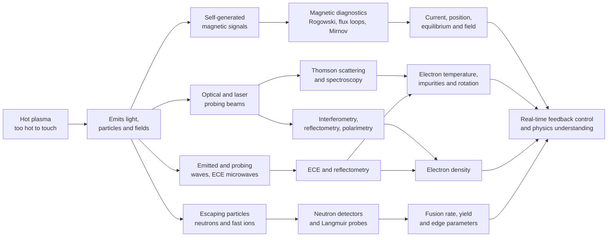

# 🩺 Plasma Diagnostics and Measurement

> [!abstract] TL;DR
> A fusion-grade plasma reaches $\sim$100–150 million kelvin, so **no material probe survives in its core** — almost every diagnostic is **non-invasive**, reading the plasma from a distance. Each technique exploits a *specific* piece of physics to extract a *specific* quantity: **magnetic** coils and loops (Rogowski, flux loops, Mirnov, diamagnetic) give **plasma current, position, equilibrium, stored energy, and MHD activity** — the backbone of tokamak control; **interferometry / reflectometry / polarimetry** give **electron density** from the refractive index; **Thomson scattering** — laser light scattered off electrons — gives **local $T_e$ and $n_e$** (Doppler width $\propto\sqrt{T_e}$, intensity $\propto n_e$); **spectroscopy** gives **impurities, ion temperature, and rotation** (Doppler broadening/shift, CXRS); **ECE** gives the **electron-temperature profile**; **bolometry** gives **radiated power**; and **neutron detectors** give the **fusion reaction rate and yield**. The recurring themes are **line-integrated vs local** measurement, **calibration and inversion** (Abel/tomography), and the fact that diagnostics are what make **real-time feedback control** — and validated transport physics — possible at all.

## Intuition

**Analogy:** You cannot stick a thermometer into something 150 million degrees — it would vaporize before it read anything. So measuring a fusion plasma is like being a **doctor who can never touch the patient**: you diagnose entirely from a distance. You read the **light it emits** (spectroscopy, ECE), time **laser pulses bounced through it** (interferometry, Thomson scattering), catch the **particles and neutrons it throws off** (neutron detectors, fast-ion probes), and sense the **magnetic fields it makes** (coils and loops). Each of these "remote senses" reveals one vital sign — temperature, density, magnetic field, purity, fusion rate — and stitching them together is how physicists know what is happening inside a magnetic bottle they can never open.

A single sense is never enough: a stethoscope tells you the heartbeat but not the blood pressure. In the same way, an interferometer tells you density but nothing about temperature, and a Thomson system tells you temperature at one point but nothing about the whole radial profile. A working fusion experiment carries **dozens of diagnostics at once**, each measuring one quantity through one physical channel, and the art is in fusing them into a coherent picture of the plasma.

---

## How It Works

### Core mechanics

**1. The core is off-limits, so nearly everything is remote.** A material probe placed in the core would melt, sputter, and cool the plasma catastrophically. Direct **insertable probes** (Langmuir probes, sheath physics) are therefore restricted to the **cool edge / scrape-off layer**, where $T_e$ is tens of eV, not keV. Everything about the hot core is inferred remotely from emitted radiation, scattered/transmitted beams, self-generated fields, and escaping particles.

**2. Each diagnostic maps one physical channel to one quantity.**

- **Magnetic diagnostics.** A **Rogowski coil** wound around the plasma measures the enclosed current via Ampère + Faraday: its output voltage is $\propto dI_p/dt$, integrated to give $I_p$. **Flux loops** (single-turn loops on the vessel) measure poloidal flux and, combined, reconstruct the equilibrium and plasma position. **Mirnov coils** (small pickup coils) catch the oscillating $\dot B$ of rotating MHD modes. A **diamagnetic loop** senses the plasma's diamagnetism, giving the **stored energy** $W$. These are cheap, fast, robust — and the primary sensors for real-time control ([[Faradays_Law_and_Induction]]).
- **Refractive / wave diagnostics — density.** A plasma's refractive index is $N=\sqrt{1-\omega_p^2/\omega^2}$, where $\omega_p^2 = n_e e^2/\varepsilon_0 m_e$. An **interferometer** compares a beam through the plasma to a reference beam; the accumulated **phase shift** $\Delta\phi \approx r_e\lambda_0\!\int n_e\,dl$ counts fringes proportional to the **line-integrated density**. **Reflectometry** bounces a swept-frequency wave off the density cutoff layer to profile $n_e(R)$; **polarimetry** measures Faraday rotation of the polarization to get $n_e B_\parallel$ ([[Interference_and_Diffraction]], [[Polarization_and_Dispersion]]).
- **Thomson scattering — local $T_e$, $n_e$.** Fire a high-power laser through the plasma; a tiny fraction scatters off free electrons. Because each electron moves thermally, the scattered light is **Doppler-broadened** — the spectral **width $\propto\sqrt{T_e}$** (broader = hotter) — while the **integrated intensity $\propto n_e$**. Collecting scattered light from a set of points along the beam gives a **spatially and temporally resolved** $T_e(R)$, $n_e(R)$ — the gold standard.
- **Spectroscopy — impurities, $T_i$, rotation.** Line emission identifies **impurity species** and their concentration; the **Doppler broadening** of an ion line gives the **ion temperature**, and the **Doppler shift** gives the **plasma rotation**. **Charge-exchange recombination spectroscopy (CXRS)** uses a neutral beam to light up fully-stripped impurities locally, giving $T_i$, rotation, and density profiles ([[Atomic_Models_and_Spectroscopy]]).
- **ECE — the $T_e$ profile.** Magnetized electrons radiate at the **cyclotron frequency** $\omega_c = eB/m_e$. Since $B\propto 1/R$ in a tokamak, frequency maps to major radius, and in optically-thick plasma the intensity is a blackbody set by $T_e$ — so a swept receiver reads the **electron-temperature radial profile** directly ([[Electromagnetic_Waves_and_Radiation]]).
- **Bolometry — radiated power.** Broadband detectors measure the **total radiated power** and, with many chords + tomographic inversion, its 2-D emission map.
- **Neutron diagnostics — fusion rate and yield.** D-T and D-D reactions emit neutrons; a neutron detector's count rate is the **direct fusion reaction rate**, the calibrated yield is the **fusion energy produced**, and the neutron **energy spectrum** (Doppler-broadened by ion motion) gives the **ion temperature**. Fast-ion and escaping-alpha diagnostics track the confined fusion products.

**3. Two cross-cutting problems: integration and inversion.** Many diagnostics measure a **line-integrated** quantity (interferometer $\int n_e\,dl$, bolometer chord emission, spectral line-of-sight). Recovering the **local** profile requires an **inversion** — an **Abel inversion** for a circularly symmetric plasma, or full **tomography** from many chords. This, plus **absolute calibration**, is where much of the experimental effort lives.

**4. Diagnostics close the control loop.** The fast, robust signals (magnetics, interferometry, ECE) feed **real-time feedback control**: plasma **position and shape** (from flux loops), **density** (gas puffing tied to interferometer fringes), and **instability avoidance** (Mirnov coils triggering mitigation). The slower, richer measurements (Thomson, CXRS, neutron spectra) **validate transport and turbulence physics** and benchmark models.

### Flow / architecture



---

## Key Concepts

### Secondary Level

- You **can't touch** a plasma hotter than the Sun's core, so you measure it **from a distance** — reading its light, timing beams through it, catching its particles, and sensing its magnetic field.
- **Each sense reads one vital sign.** Its **light colour and brightness** reveal temperature and what impurities are inside; a **laser bounced through it** reveals how dense it is; the **neutrons it spits out** reveal how much fusion is happening; the **magnetic field it makes** reveals its electric current and where it sits.
- The **only place you can dip a physical probe** is the cool edge — the core would vaporize any material instantly.
- A real machine carries **dozens of diagnostics at once**, and physicists stitch them together like a doctor combining pulse, temperature, and blood tests into one diagnosis.

### Undergraduate Level

- **Magnetics.** Rogowski coil output $\propto dI_p/dt$ (Faraday's law around the plasma) $\Rightarrow I_p$; flux loops $\Rightarrow$ position/equilibrium; diamagnetic loop $\Rightarrow$ stored energy $W$; Mirnov coils $\Rightarrow$ MHD-mode frequency/structure.
- **Interferometry.** Refractive index $N\approx 1-\tfrac12\omega_p^2/\omega^2$ with $\omega_p^2=n_e e^2/\varepsilon_0 m_e$ gives a phase shift $\Delta\phi = r_e\lambda_0\!\int n_e\,dl$ (classical electron radius $r_e=2.82\times10^{-15}$ m). Fringe count $\Rightarrow$ line-integrated density. **Longer wavelength = larger phase shift** (why FIR lasers are used), but the probe must stay **below the density cutoff** $n_c=\pi/(r_e\lambda_0^2)$ or the wave reflects instead of transmitting.
- **Thomson scattering.** Scattered spectrum width $\Delta\lambda_{1/e}=\dfrac{2\lambda_0\sin(\theta/2)}{c}\sqrt{\dfrac{2kT_e}{m_e}}\propto\sqrt{T_e}$; integrated intensity $\propto n_e$. Local, absolutely calibrated $T_e(R)$, $n_e(R)$.
- **Spectroscopy.** Doppler broadening of an ion line $\Rightarrow T_i$; Doppler shift $\Rightarrow$ rotation; line identification $\Rightarrow$ impurity species/content; Zeeman splitting $\Rightarrow$ local $B$.
- **ECE.** Emission at $\omega_c=eB/m_e$ with $B\propto1/R$ maps frequency $\to$ radius; optically thick $\Rightarrow$ blackbody at $T_e$ $\Rightarrow$ profile.
- **Neutrons & bolometry.** Neutron count rate $\Rightarrow$ fusion rate; calibrated yield $\Rightarrow$ energy; neutron spectrum width $\Rightarrow T_i$. Bolometer chords $\Rightarrow$ radiated power (and, inverted, its 2-D map).
- **Inversion.** Line-integrated $\to$ local via **Abel inversion** (cylindrical symmetry) or **tomography** (many chords).

### Graduate Level

- **Thomson regimes and the Salpeter parameter.** $\alpha=1/(k\lambda_D)$ separates **incoherent** ($\alpha\ll1$, spectrum reflects the electron velocity distribution $\Rightarrow T_e$) from **collective** ($\alpha\gtrsim1$, ion-acoustic and electron features $\Rightarrow T_i$, $Z_\mathrm{eff}$, flow). Relativistic corrections blue-shift and skew the incoherent spectrum at keV temperatures — a standard $T_e$ systematic.
- **Equilibrium reconstruction.** Codes like **EFIT** solve the Grad–Shafranov equation constrained by magnetics (flux loops, Rogowski, saddle coils), MSE, and pressure, delivering the flux-surface geometry, $q$-profile, and $\beta$ used by every other diagnostic to map measurements onto flux coordinates.
- **Motional Stark effect (MSE).** The $v\times B$ Stark splitting of neutral-beam emission encodes the local **magnetic pitch angle** $\Rightarrow$ internal **current-density / $q$-profile** — one of the few internal-field diagnostics.
- **CXRS & passive spectroscopy.** Charge-exchange with an injected neutral beam localizes impurity emission $\Rightarrow$ $T_i(R)$, toroidal/poloidal rotation, and impurity density; Zeeman/Stark modeling and atomic-data uncertainty dominate error bars.
- **Reflectometry & polarimetry.** Swept-frequency reflectometry profiles $n_e(R)$ from the cutoff-layer phase; fluctuation reflectometry probes turbulence; polarimetry (Faraday rotation $\propto\!\int n_e B_\parallel\,dl$, Cotton–Mouton $\propto\!\int n_e B_\perp^2\,dl$) constrains density and internal field.
- **Integrated data analysis.** Modern practice is **Bayesian / forward-modeling** fusion of all diagnostics (e.g. IDA, Minerva): each diagnostic is a forward model with known physics + calibration, jointly inverted for self-consistent profiles with rigorous uncertainties.
- **Neutron spectrometry.** Time-of-flight and magnetic-proton-recoil spectrometers resolve the D-T neutron line ($\approx14.1$ MeV) whose Doppler width gives $T_i$ and whose intensity gives the volumetric fusion rate — the most direct performance metric.

---

## Python Demo

```python
# TWO WORKHORSE PLASMA DIAGNOSTICS  (numpy + matplotlib)
# ---------------------------------------------------------------------------
# (a) THOMSON SCATTERING: a laser scatters off free electrons; each electron's
#     thermal motion Doppler-shifts the scattered light, so the SPECTRUM is
#     Gaussian with 1/e width  sigma_lambda proportional to sqrt(Te)
#     (BROADER = HOTTER). Integrated intensity is proportional to n_e.
#     We synthesize noisy spectra, then RECOVER Te from a Gaussian (log-parabola)
#     fit -- no scipy needed.
# (b) INTERFEROMETRY: the plasma refractive index (proportional to n_e) shifts
#     the PHASE of a probing beam: delta_phi = r_e * lambda0 * integral(n_e dl).
#     Fringe count -> line-integrated density. Longer wavelength -> bigger shift,
#     but the probe must stay below the density cutoff n_c = pi/(r_e*lambda0^2).
# ---------------------------------------------------------------------------
import numpy as np
import matplotlib.pyplot as plt

# --- physical constants (SI) ---
e, me, c, eps0 = 1.602e-19, 9.109e-31, 2.998e8, 8.854e-12
r_e = e**2 / (4*np.pi*eps0*me*c**2)            # classical electron radius = 2.82e-15 m

# ===========================================================================
# (a) THOMSON SCATTERING
# ===========================================================================
lam0    = 1064e-9                               # Nd:YAG probe wavelength [m]
theta   = np.deg2rad(90.0)                      # scattering angle
kfac    = 2.0 * np.sin(theta/2) / c             # geometry factor in the Doppler width

def sigma_lambda(Te_eV):                        # spectral 1-sigma width [m], ~ sqrt(Te)
    v_th = np.sqrt(Te_eV*e / me)                # electron thermal speed
    return lam0 * kfac * v_th

def Te_from_sigma(sig):                         # invert width -> Te [eV]
    v_th = sig / (lam0 * kfac)
    return me * v_th**2 / e

dlam = np.linspace(-350e-9, 350e-9, 600)        # wavelength offset from lam0 [m]
rng  = np.random.default_rng(0)

def spectrum(Te_eV, ne_rel, noise=0.03):        # amplitude proportional to n_e
    s = sigma_lambda(Te_eV)
    S = ne_rel * np.exp(-dlam**2 / (2*s**2))
    return S + noise * S.max() * rng.standard_normal(dlam.size)

def fit_Te(S):                                  # log-parabola fit of the Gaussian core
    m = S > 0.20 * S.max()                       # keep the well-above-noise core
    b = np.polyfit(dlam[m]**2, np.log(S[m]), 1)[0]
    return Te_from_sigma(np.sqrt(-1.0/(2*b)))

Te_show = [500.0, 1000.0, 2000.0]               # eV: three temperatures to display
spectra = [spectrum(T, ne_rel=1.0) for T in Te_show]

# recovery validation across a range of true temperatures (fixed n_e)
Te_true = np.array([300., 500., 800., 1200., 2000., 3500., 5000.])
Te_rec  = np.array([fit_Te(spectrum(T, ne_rel=1.0, noise=0.02)) for T in Te_true])
print("Thomson Te recovery (true -> fitted, eV):")
for t, r in zip(Te_true, Te_rec):
    print(f"   {t:6.0f}  ->  {r:6.0f}   ({100*(r-t)/t:+5.1f} %)")

# ===========================================================================
# (b) INTERFEROMETRY
# ===========================================================================
def phase_shift(nedl, lam0_probe):              # delta_phi [rad] = r_e * lambda0 * int(n_e dl)
    return r_e * lam0_probe * nedl

def n_crit(lam0_probe):                         # density cutoff n_c = pi/(r_e * lambda0^2) [m^-3]
    return np.pi / (r_e * lam0_probe**2)

nedl = np.linspace(0, 3e20, 200)                # line-integrated density [m^-2]  (e.g. n_e * 1 m)
probes = {"CO2 10.6 um": 10.6e-6, "FIR 118.8 um": 118.8e-6, "FIR 337 um": 337e-6}
print("\nInterferometer probe wavelengths and density cutoff:")
for name, lp in probes.items():
    print(f"   {name:14s}: n_c = {n_crit(lp):.2e} m^-3   "
          f"(fringes at nedl=1e20: {phase_shift(1e20, lp)/(2*np.pi):.2f})")

# ===========================================================================
# PLOTS
# ===========================================================================
fig, ax = plt.subplots(2, 2, figsize=(13, 9))

# (A) Thomson spectra: broader = hotter
for T, S in zip(Te_show, spectra):
    ax[0,0].plot(dlam*1e9, S, lw=1.6, label=f"Te = {T/1000:.1f} keV")
ax[0,0].set_xlabel(r"wavelength offset  $\Delta\lambda$ [nm]")
ax[0,0].set_ylabel("scattered intensity (a.u.)")
ax[0,0].set_title("(a) Thomson spectra: width grows as sqrt(Te)")
ax[0,0].legend()

# (B) Te recovery: fitted vs true should lie on y = x
ax[0,1].plot(Te_true/1000, Te_true/1000, 'k--', lw=1, label="ideal (fit = true)")
ax[0,1].plot(Te_true/1000, Te_rec/1000, 'o', ms=7, color="#e8590c", label="Gaussian-fit Te")
ax[0,1].set_xlabel("true Te [keV]"); ax[0,1].set_ylabel("recovered Te [keV]")
ax[0,1].set_title("(b) Te from spectral width (log-parabola fit)")
ax[0,1].legend()

# (C) Interferometry: phase shift vs line-integrated density, several wavelengths
for name, lp in probes.items():
    ax[1,0].plot(nedl, phase_shift(nedl, lp), lw=2,
                 label=f"{name}")
ax[1,0].set_xlabel(r"line-integrated density $\int n_e\,dl$  [m$^{-2}$]")
ax[1,0].set_ylabel(r"phase shift $\Delta\phi$ [rad]")
ax[1,0].set_title("(c) Interferometry: phase shift linear in density")
ax[1,0].legend()

# (D) Fringe count (2 pi per fringe) for the FIR probe: what the instrument counts
lp = probes["FIR 118.8 um"]
ax[1,1].plot(nedl, phase_shift(nedl, lp)/(2*np.pi), lw=2, color="#1c7ed6")
ax[1,1].axhline(0, color="gray", lw=0.8)
ax[1,1].set_xlabel(r"line-integrated density $\int n_e\,dl$  [m$^{-2}$]")
ax[1,1].set_ylabel("fringes counted")
ax[1,1].set_title(f"(d) FIR fringe count (cutoff n_c = {n_crit(lp):.1e} m^-3)")

plt.tight_layout()
plt.savefig("plasma_diagnostics.png", dpi=120)
print("\nSaved plasma_diagnostics.png")
```

**What the plot shows.** Panel (a): three Thomson spectra whose Gaussian widths grow visibly with temperature — the direct statement that **broader = hotter**, with $\Delta\lambda\propto\sqrt{T_e}$. Panel (b): feeding each noisy spectrum through a log-parabola Gaussian fit recovers $T_e$ to a few percent across 0.3–5 keV, landing on the ideal $y=x$ line — this *is* how a Thomson system turns a scattered spectrum into a temperature (and the amplitude, held fixed here, would give $n_e$). Panel (c): the interferometer phase shift is **exactly linear** in the line-integrated density $\int n_e\,dl$, and **steeper for longer wavelengths** — which is why fusion interferometers use far-infrared lasers. Panel (d): the same physics expressed as the **fringe count** the instrument actually reports, annotated with the density **cutoff** above which the probe would reflect instead of pass through.

---

## Real-World Applications

- **ITER's diagnostic suite.** ITER carries roughly **50 diagnostic systems** — magnetics (Rogowski/flux loops for control), multi-chord interferometry/polarimetry (density), core and edge Thomson scattering ($T_e$, $n_e$), ECE ($T_e$ profile), CXRS ($T_i$, rotation, impurities), bolometry (radiated power), and an extensive neutron-diagnostic set for the fusion-power measurement — all hardened against neutron/gamma flux and integrated into real-time control.
- **JET & DIII-D control.** Plasma **shape and position** are held by feedback on flux-loop signals; **density** is regulated by tying gas-valve actuation to interferometer fringe counts; **MHD/disruption precursors** are caught by Mirnov-coil arrays. These fast magnetic and microwave diagnostics are the sensors that make tokamak operation possible.
- **Thomson scattering as the gold standard.** DIII-D, JET, and ITER core Thomson systems deliver absolutely-calibrated, spatially-resolved $T_e(R)$, $n_e(R)$ profiles that anchor confinement studies and benchmark every other temperature diagnostic.
- **Neutron yield as the performance metric.** JET's record D-T campaigns and the NIF inertial-fusion shots are scored primarily by **calibrated neutron yield** — the most direct measure of fusion energy produced; neutron-spectrometer line widths simultaneously return the ion temperature.
- **Laboratory and industrial plasmas.** Langmuir probes and optical emission spectroscopy monitor $T_e$, $n_e$, and species in etching/deposition reactors, arc jets, and Hall thrusters — the same physics at kilovolt-and-below temperatures where insertable probes survive.

---

## Common Pitfalls

- **Thinking any diagnostic can reach the hot core with a probe.** It cannot. Insertable probes (Langmuir probes, sheath-based measurements) survive only in the **cool edge / scrape-off layer**; the core is measured **only** by remote techniques. Confusing edge probe values with core parameters is a classic error — the physics of the cool boundary layer that lets a probe survive is precisely the plasma-sheath physics of the plasma–wall transition.
- **Forgetting that each diagnostic measures ONE quantity via ONE physics channel.** Magnetics give current/equilibrium (not temperature); interferometry gives density (not temperature); Thomson gives local $T_e$/$n_e$; spectroscopy gives impurities/$T_i$/rotation; ECE gives the $T_e$ profile; bolometry gives radiated power; neutrons give the fusion rate. Asking an interferometer for temperature — or a bolometer for density — is a category error.
- **Confusing line-integrated with local.** An interferometer returns $\int n_e\,dl$ along a chord, a bolometer returns chord-integrated emission, and a spectrometer sees everything along its sight-line. Treating these as **local** values without an **Abel inversion** (cylindrical symmetry) or **tomographic** reconstruction (many chords) systematically misreads the profile — especially where gradients are steep.
- **Ignoring calibration and inversion uncertainty.** Absolute density from Thomson intensity needs Raman/Rayleigh calibration; ECE temperature needs the plasma to be optically thick; neutron yield needs an activation/calibration standard. The inversion step (Abel/tomography) is **ill-posed** and amplifies noise — most "measurement error" in profiles is inversion and calibration error, not photon statistics.
- **Assuming the probe beam always passes through.** An interferometer or reflectometer only works below the **density cutoff** $n_c=\pi/(r_e\lambda_0^2)$; above it the wave reflects (which reflectometry *exploits*, but which corrupts an interferometer). Choosing too long a wavelength for a dense plasma trades sensitivity for refraction and cutoff problems — the plasma-oscillation frequency and cold-plasma wave dispersion set this limit directly.
- **Reading ECE without checking optical thickness / harmonics.** ECE gives $T_e$ **only** where the plasma is optically thick at the observed harmonic; in low-density or high-field-gradient regions the intensity no longer equals the blackbody value, and overlapping harmonics or relativistic downshift can misplace the radius.
- **Neglecting relativistic and collective corrections in Thomson.** At keV temperatures the incoherent spectrum is blue-shifted and skewed by relativistic effects; and when $\alpha=1/(k\lambda_D)$ is not small the scattering becomes **collective**, reporting ion-feature information rather than a simple $T_e$ Gaussian.
- **Treating diagnostics as passive instruments only.** Their most demanding role is **real-time feedback control** — position, shape, density, and instability mitigation all run on live diagnostic signals. A diagnostic that is accurate but too slow or too noisy for the control loop fails at the job that matters most for a reactor.

---

## Related Concepts

- [[Interference_and_Diffraction]] — interferometry counts fringes from the phase shift a plasma imposes on a probe beam; the core density diagnostic is a two-beam interference measurement.
- [[Wave_Motion_and_Properties]] — Doppler shift/broadening underlies Thomson scattering ($T_e$), spectroscopy ($T_i$, rotation), and neutron spectrometry ($T_i$); wave propagation and cutoff set what a probe beam can penetrate.
- [[Atomic_Models_and_Spectroscopy]] — line emission identifies impurity species and, through Doppler and Zeeman/Stark structure, yields ion temperature, rotation, and local magnetic field.
- [[Polarization_and_Dispersion]] — polarimetry (Faraday rotation, Cotton–Mouton) and the plasma's dispersive refractive index connect polarization state to density and internal magnetic field.
- [[Faradays_Law_and_Induction]] — Rogowski coils, flux loops, and Mirnov coils all read an induced voltage $\propto d\Phi/dt$; the entire magnetic-diagnostics backbone is Faraday's law wrapped around the plasma.
- [[Electromagnetic_Waves_and_Radiation]] — ECE reads the cyclotron radiation emitted by magnetized electrons, and bolometry integrates the plasma's total radiated power.
- [[Nuclear_Reactions_Fission_Fusion]] — neutron diagnostics measure the D-T/D-D reaction rate, yield, and (via spectral width) ion temperature — the direct fusion-performance metric.
- [[Radioactive_Decay]] — the counting statistics and detector physics of neutron and gamma diagnostics build on the same radiation-detection principles.
- [[Fourier_Transform]] — phase extraction from interferograms, spectral analysis of ECE/Mirnov signals, and Abel/tomographic profile inversion are Fourier-domain operations.
- [[Frequency_Spectrum]] — Thomson, ECE, and neutron measurements are fundamentally spectral: temperature and rate are read off the shape and integral of a measured spectrum.

*Foundational siblings (in this vault): Langmuir-probe interpretation and the survivable cool edge rest on Plasma_Sheaths_and_Boundary_Layers; the interferometer/reflectometer cutoff is set by the plasma frequency of Plasma_Oscillations_and_Frequency; the wave propagation, refractive index, and cutoffs that make refractive diagnostics work are developed in Cold_Plasma_Waves_and_Dispersion; magnetics feed the equilibrium reconstruction and real-time control central to Tokamak_Physics; and modern control and disruption-avoidance increasingly couple these live diagnostic streams to machine-learning controllers.*

---

## Review Questions

1. **Secondary:** You cannot put a thermometer into a 150-million-degree plasma. Name three completely different "remote senses" a physicist uses instead, and state which single property (temperature, density, magnetic field, purity, or fusion rate) each one reveals. Why is the only place you can insert a physical probe the *edge* of the plasma?
2. **Undergraduate:** A far-infrared interferometer ($\lambda_0 = 118.8\,\mu$m) probes a plasma over a 1 m path at $n_e = 1\times10^{20}\,\mathrm{m^{-3}}$. Using $\Delta\phi = r_e\lambda_0\!\int n_e\,dl$ with $r_e = 2.82\times10^{-15}$ m, estimate the phase shift and the number of fringes. Why does a far-infrared laser give a larger signal than a visible one, and what limits how long a wavelength you can use (the density cutoff)?
3. **Undergraduate:** In Thomson scattering the spectral width scales as $\Delta\lambda\propto\sqrt{T_e}$ while the integrated intensity scales as $n_e$. If one plasma shows a scattered spectrum twice as broad as another (same laser, same geometry), how do their electron temperatures compare? Which measured quantity gives density, and why is Thomson called a *local* diagnostic while interferometry is not?
4. **Undergraduate/Graduate:** ECE reads the electron-temperature profile because $\omega_c = eB/m_e$ and $B\propto1/R$ in a tokamak, so frequency maps to major radius. Explain why this mapping fails if the plasma is *not optically thick* at the observed harmonic, and give one other diagnostic you would cross-check the ECE $T_e$ against.
5. **Graduate:** Distinguish **incoherent** and **collective** Thomson scattering via the Salpeter parameter $\alpha = 1/(k\lambda_D)$: what does each regime measure, and how does the scattering geometry (angle, wavelength) move you between them? Why does a keV-temperature plasma require relativistic corrections to the incoherent spectrum?
6. **Graduate:** A tokamak reconstructs its equilibrium (Grad–Shafranov / EFIT) from magnetic diagnostics but cannot get the internal current profile from external coils alone. Explain why, and describe how the motional Stark effect (MSE) supplies the missing internal-field information. How does a Bayesian integrated-data-analysis approach combine magnetics, MSE, Thomson, and interferometry into self-consistent profiles with uncertainties?

---

## Sources

- Hutchinson, I. H. — *Principles of Plasma Diagnostics* (2nd ed.), Cambridge University Press, 2002. The definitive graduate text: magnetics, refractive/interferometric, scattering, emission, and particle diagnostics with full theory.
- Chen, F. F. — *Introduction to Plasma Physics and Controlled Fusion*, Springer. Clear undergraduate treatment of Langmuir probes, interferometry, and the plasma refractive index / cutoff.
- Stott, P. E., Gorini, G., & Sindoni, E. (eds.) — *Diagnostics for Experimental Thermonuclear Fusion Reactors*, Plenum. Reactor-oriented reviews of Thomson scattering, ECE, CXRS, neutron, and magnetic diagnostics.
- Donné, A. J. H. et al. — "Chapter 7: Diagnostics," *Progress in the ITER Physics Basis*, *Nuclear Fusion* **47**, S337 (2007). The authoritative survey of the ITER diagnostic set and measurement requirements.
- Froula, D. H., Glenzer, S. H., Luhmann, N. C., & Sheffield, J. — *Plasma Scattering of Electromagnetic Radiation* (2nd ed.), Academic Press, 2011. The standard reference on incoherent and collective Thomson scattering.

---

#plasma-physics #plasma-diagnostics #thomson-scattering #interferometry #spectroscopy
