# 🔥 Plasma-Material Interactions and the Divertor

> [!abstract] TL;DR
> No matter how well you confine a fusion plasma, it must dump its exhaust heat and its helium "ash" somewhere — and that somewhere is a solid surface facing conditions like the surface of the Sun. The **divertor** is fusion's exhaust pipe and heat shield in one: a magnetically shaped region where the **open field lines** of the **scrape-off layer (SOL)** are steered onto dedicated **target plates** (usually **tungsten**, the highest-melting-point metal) far from the main wall, localizing the plasma-surface contact so the core stays clean. The killer problem is the **heat flux**: the parallel power funnels into a razor-thin **power-decay width** ($\lambda_q\sim$ 1 mm, **Eich scaling**), producing peak surface loads of order **10 MW/m$^2$** (and *parallel* fluxes of gigawatts per square metre) that would vaporize any material. Mitigation comes from **flux expansion**, **target tilting**, and above all **detachment** — a **radiative divertor** where seeded impurities and high edge density make the plasma **radiate and charge-exchange** its energy volumetrically *before* it reaches the plate. Layered on top are **sputtering**, **impurity radiation and core dilution** (a little high-Z tungsten goes a long way), **tritium retention and co-deposition**, and **neutron damage**. Exhaust and plasma-material interaction are a make-or-break reactor challenge, on par with confinement itself.

## Intuition

**Analogy — the exhaust pipe pressed against the Sun.** Even a perfectly confined fusion plasma has to touch a wall *somewhere* to get rid of its exhaust — the heat it generates and the helium "ash" left over from burning its fuel. Imagine trying to route the exhaust of a rocket engine through a pipe, except the "gas" is a million-degree plasma and the pipe wall is a solid metal that starts to melt at a few thousand degrees. The **divertor** is that exhaust system: a deliberately **sacrificial** region, armored in **tungsten** (the metal with the highest melting point), engineered to take a firehose of plasma without vaporizing, while skimming off the helium so it does not choke the fire.

Now make it worse: the "firehose" is not spread over a wide nozzle but squeezed into a stripe only about a **millimetre wide**, so the local heat flux rivals the surface of the Sun. Handling that exhaust — spreading it, radiating it away, keeping the eroded wall atoms from poisoning the core — is quietly one of the hardest problems standing between us and a fusion power plant. In a tokamak you can have beautiful confinement and still fail at the wall.

---

## How It Works

### Core mechanics

1. **Closed vs open field lines.** Inside the **last closed flux surface** (the **separatrix**), magnetic field lines close on themselves and trap the plasma — this is the confined core. Just outside it, field lines are **open**: they wander out of the confinement region and terminate on a solid surface. The thin layer of plasma riding these open field lines is the **scrape-off layer (SOL)**.

2. **The divertor diverts the open lines.** A set of **poloidal field coils** creates a magnetic **X-point**, pulling the open SOL field lines down into a separate chamber and onto dedicated **target (strike) plates**, well away from the main first wall. This is the key advantage over the older **limiter** (a solid object stuck into the edge plasma): the divertor **localizes** plasma-surface contact to an engineered region, screens sputtered impurities from the core, and enables the high-confinement **H-mode**.

3. **Parallel transport funnels the exhaust.** Escaping heat and particles stream *along* the open field lines toward the targets. Cross-field transport sets how far into the SOL the power spreads — a **power-decay width** $\lambda_q$ of only about a **millimetre** (the **Eich scaling**, $\lambda_q \propto B_\text{pol}^{-1.2}$). Squeezing tens of megawatts through a mm-wide channel gives an enormous **parallel heat flux** $q_\parallel$ (gigawatts per square metre).

4. **The sheath deposits it on the plate.** At the target, a magnetized **Debye sheath** (see the sibling note *Plasma_Sheaths_and_Boundary_Layers*) accelerates ions into the surface; the deposited heat flux is $q \approx \gamma\,\Gamma_i\,k T_e$ with sheath transmission coefficient $\gamma\sim 7$–$8$. Because the field strikes the plate at a shallow **grazing angle** $\alpha$, the *perpendicular* surface load is $q_\perp = q_\parallel \sin\alpha$ — tilting and **flux expansion** spread the stripe, but even so the attached load is far above what a cooled surface can survive.

5. **Detachment saves the plate.** Raise the edge density or **seed impurities** (nitrogen, neon, argon) and the SOL plasma **radiates** its energy as light and loses momentum to **charge-exchange** with neutrals *before* the ions reach the target. Past a threshold the target heat flux, temperature, and particle flux collapse — the **detachment rollover**. This **radiative divertor** is the reference solution for reactors.

6. **The wall bites back.** Ions and neutrals **sputter** atoms off the surface (physical and chemical erosion). Those impurities **radiate** (cooling and diluting the core — high-$Z$ tungsten radiates so strongly that even a trace in the core is damaging), **redeposit** elsewhere, and **trap tritium** by co-deposition (a fuel-loss and safety concern). Fast fusion **neutrons** meanwhile damage the material microstructure. Every one of these is part of **plasma-material interaction (PMI)**.

### Flow / architecture

```mermaid
graph LR
    CORE["Confined core plasma<br/>burning D-T fuel<br/>must stay HOT and CLEAN"]
    LCFS["Last closed flux surface<br/>the separatrix and X-point<br/>edge of confinement"]
    SOL["Scrape-off layer SOL<br/>OPEN field lines outside separatrix<br/>carry escaping heat, particles, He ash"]
    PAR["Parallel transport along B<br/>funneled into a narrow width<br/>lambda-q of order 1 mm"]
    TARGET["Divertor target plates<br/>tungsten armor, tilted<br/>far from the main wall"]
    HEAT["HUGE perpendicular heat flux<br/>order 10 MW per m2<br/>rivals a rocket nozzle"]
    SPUT["Sputtering and erosion<br/>ejects wall atoms as impurities"]
    RAD["Impurity and edge radiation<br/>plus charge-exchange cooling"]
    DET["DETACHMENT<br/>plasma radiates energy volumetrically<br/>BEFORE reaching the plate"]
    PUMP["Helium ash pumped away<br/>and DT fuel recycled"]
    CLEAN["Core kept clean and fuelled<br/>fusion burn sustained"]

    CORE --> LCFS
    LCFS --> SOL
    SOL --> PAR
    PAR --> TARGET
    TARGET --> HEAT
    TARGET --> SPUT
    HEAT --> RAD
    SPUT --> RAD
    RAD --> DET
    DET --> PUMP
    SPUT -->|"high-Z impurities leak inward and radiate"| CORE
    PUMP --> CLEAN
    CLEAN --> CORE

    style CORE fill:#4a9eff,color:#fff
    style CLEAN fill:#4a9eff,color:#fff
    style HEAT fill:#ff6b6b,color:#fff
    style SPUT fill:#ff6b6b,color:#fff
    style DET fill:#51cf66,color:#fff
    style PUMP fill:#51cf66,color:#fff
```



---

## Key Concepts / Details

### Secondary Level

**The exhaust problem in one picture.** A fusion reactor makes power by keeping a plasma extremely hot in the middle. But heat and the leftover **helium "ash"** constantly leak out of the confinement, and they have to land *somewhere*. That somewhere is the **divertor** — an armored region at the bottom (or top) of the machine where the leaking plasma is deliberately steered onto tough target plates, away from the delicate main wall.

**Why tungsten.** The plates are usually made of **tungsten**, the metal with the **highest melting point** of all (about 3400 °C). Even so, the heat arriving is so concentrated — comparable to the surface of the Sun — that tungsten alone is not enough; the plasma has to be cooled and spread out before it lands.

**Divertor vs limiter.** Early machines used a **limiter**: a solid block poked into the plasma edge to define where the plasma stops. The problem is that eroded atoms from the limiter drift straight back into the hot core and poison it. A **divertor** instead uses magnetic fields to peel the edge plasma away and route it to a distant chamber, keeping the eroded material far from the core. That is why every reactor-class design (ITER, DEMO) uses a divertor.

**Choking the fire.** Fusion "burns" deuterium and tritium and produces **helium**. If that helium is not pumped away, it builds up and dilutes the fuel — like exhaust fumes filling a sealed room and smothering a fire. The divertor is also where the helium ash is collected and pumped out.

### Undergraduate Level

**The scrape-off layer and $\lambda_q$.** Outside the separatrix, power flows along open field lines toward the divertor. Perpendicular (cross-field) transport competes with fast parallel flow, so the heat flux falls off exponentially into the SOL with a **power-decay width** $\lambda_q$. The empirical **Eich scaling** (from a multi-machine database) gives, for H-mode,
$$\lambda_q \; [\text{mm}] \;\approx\; 0.63\, B_\text{pol}^{-1.19},$$
i.e. **$\lambda_q\sim 1$ mm** for present tokamaks *and* for ITER — a strikingly narrow channel that barely grows with machine size, which is exactly what makes the exhaust problem so severe.

**Parallel vs perpendicular heat flux.** The **parallel** heat flux $q_\parallel$ carried along field lines through the thin SOL is huge — of order $10^9$ W/m$^2$ (GW/m$^2$). What the plate actually feels is the **perpendicular** load,
$$q_\perp = q_\parallel \sin\alpha,$$
where $\alpha$ is the **grazing angle** (typically $2$–$5^\circ$). Making $\alpha$ shallow and using magnetic **flux expansion** ($f_x$, the ratio of flux-tube spacing at the target to that upstream) spreads the strike point over a larger area. Even after all this geometry, the attached target load is $\sim 10$–$100$ MW/m$^2$, comparable to a **rocket-engine nozzle throat** and a good fraction of the Sun's photospheric flux ($\sim 60$ MW/m$^2$). Actively water-cooled tungsten monoblocks are engineered for $\sim 10$ MW/m$^2$ steady state — hence the gap that detachment must close.

**Sheath heat transmission.** At the plate, the sheath sets the ion impact energy. The heat flux deposited is
$$q = \gamma\, \Gamma_i\, k T_e, \qquad \gamma \approx 7\text{–}8,$$
with $\Gamma_i$ the Bohm ion flux. Lowering the target temperature $T_e$ therefore lowers *both* the heat per ion and the sputtering — the physics behind detachment.

**Sputtering and impurities.** Ions striking the surface eject wall atoms by momentum transfer (**physical sputtering**, with a threshold energy and a yield $Y$ that rises with impact energy), and reactive species can drive **chemical sputtering** (notably with carbon). Sputtered atoms enter the plasma as **impurities** that **radiate** power. The radiated power per impurity scales strongly with atomic number $Z$ (roughly the cooling function $L_Z$ grows with $Z$), so **high-$Z$ tungsten** in the *core* is far more dangerous than a low-$Z$ impurity — tolerable core tungsten concentrations are only $\sim 10^{-5}$.

**Tritium retention.** Hydrogen isotopes implant into and codeposit with eroded material in the walls. For **tritium** this means both a **fuel loss** and a growing **radioactive inventory** — a licensing-limiting safety issue, and the main reason **carbon** (which codeposits enormous tritium via hydrocarbon films) was abandoned as a plasma-facing material.

### Graduate Level

**The two-point model and detachment.** A minimal SOL model connects an upstream point (subscript $u$) to the target ($t$) along a field line of connection length $L$:

- **Power (conduction):** electron heat conduction $q_\parallel = -\kappa_0 T^{5/2}\,dT/ds$ integrates to $T_u^{7/2} = T_t^{7/2} + \tfrac{7}{2}\,q_\parallel L/\kappa_0$, so $T_u$ is nearly fixed by $q_\parallel$ and $L$.
- **Momentum (pressure balance):** in the attached, low-recycling limit $2 n_t T_t = n_u T_u$.
- **Sheath:** $q_\parallel = \gamma n_t c_{s,t} T_t$.

Combining these gives the crucial result that the **target temperature falls steeply with upstream density**, $T_t \propto q_\parallel^{2}/n_u^{2}$. Raising $n_u$ (or seeding impurities to raise radiation) drives $T_t$ down toward a few eV, where **volumetric processes switch on**: charge-exchange **momentum loss** breaks pressure balance ($n_t T_t \ll n_u T_u/2$), and hydrogenic **line radiation** plus **electron-ion recombination** remove power and particles in the volume. The result is **detachment** — the target particle flux rises, **rolls over**, and falls, while the heat flux collapses. Full/partial detachment is the reference ITER and DEMO operating scenario.

**The radiative divertor and impurity seeding.** Because unmitigated loads are intolerable, reactors deliberately dissipate most of the exhaust power as **radiation** in the divertor and edge. Seeded impurities are chosen by where their cooling function peaks: **nitrogen** and **neon** radiate efficiently at divertor temperatures (tens of eV), **argon** at higher (pedestal) temperatures. The design target is a high **radiated power fraction** $f_\text{rad}\gtrsim 0.9$ while keeping enough core temperature for fusion — a delicate balance, since the same radiation, if it penetrates the core, quenches the burn.

**Why $\lambda_q$ is a crisis.** The Eich database implies $\lambda_q$ is set by edge turbulence / drift physics and scales *inversely* with poloidal field, so it does **not** grow with device size. A reactor therefore concentrates far more power into a channel no wider than today's — projected upstream $q_\parallel$ reaching tens of GW/m$^2$. Whether $\lambda_q$ stays $\sim 1$ mm in a reactor, or is set instead by a broader turbulence-dominated regime, remains an active research question (heuristic-drift vs turbulence models).

**Advanced magnetic geometries.** To spread and radiate more effectively, alternative divertors reshape the field near the target: the **Super-X** divertor (large target major radius and long leg, increasing wetted area and volume for radiation), the **snowflake** (a second-order null, two X-points merged, expanding flux and sharing power among extra strike points), and the **X-divertor**. MAST-U (Super-X) and TCV (snowflake) are testing these experimentally.

**Liquid-metal divertors.** A radical alternative replaces solid tungsten with a flowing **liquid metal** (lithium, tin) held by capillary or centrifugal forces (capillary-porous systems, liquid-metal walls). A liquid surface cannot crack, self-heals erosion, and can carry heat convectively — but raises issues of splashing, vapor shielding, MHD forces on the flow, and, for lithium, tritium retention.

**Neutron damage compounds everything.** The 14 MeV fusion neutrons displace lattice atoms (measured in **dpa**), and transmute material producing **helium and hydrogen** that form bubbles, driving **swelling, hardening, embrittlement**, and shifts in the ductile-to-brittle transition. In tungsten they also cause **recrystallization** and loss of toughness. PMI and neutron damage act **synergistically** on the same components — a material can be fine against plasma *or* neutrons alone and fail against both.

**Transient loads.** Beyond steady state, **Edge-Localized Modes (ELMs)** and **disruptions** dump large energies onto the divertor in sub-millisecond bursts, melting and cracking surfaces and generating **dust**. ELM control (pellet pacing, resonant magnetic perturbations) is inseparable from divertor survival.

---

## Python Demo

```python
# Divertor heat exhaust and detachment - a reduced (two-point-model-inspired) picture.
# (a) The narrow SOL power-decay width lambda_q funnels a firehose of PARALLEL heat flux.
# (b) The Eich profile: flux expansion + tilting + spreading set the TARGET footprint,
#     but the attached load still sits far above the ~10 MW/m^2 handling limit.
# (c)+(d) Detachment: as the upstream density rises, radiation + charge-exchange cool the
#     plasma volumetrically, the target temperature collapses, and the heat flux and
#     particle flux "roll over" - the attached-to-detached transition.
import numpy as np
import matplotlib.pyplot as plt
import math

erfc = np.vectorize(math.erfc)     # numpy has no erfc; vectorize the stdlib one (no scipy)

# ---------------------------------------------------------------------------
# Representative reactor-scale numbers (ITER-like)
# ---------------------------------------------------------------------------
P_SOL  = 100e6            # power crossing the separatrix into the SOL [W]
R      = 6.2              # major radius [m]
lam_q  = 1.0e-3          # Eich power-decay width lambda_q [m]  (~1 mm!)
S_spr  = 0.5e-3          # divertor (private-flux) spreading width S [m]
f_x    = 5.0             # flux expansion from midplane to target
alpha  = np.deg2rad(2.7)  # field-line grazing angle at the target [rad]
Bt_Bp  = 3.3             # total/poloidal field ratio (parallel funneling)

# ---------------------------------------------------------------------------
# (a) Upstream SOL heat flux: exponential decay over the tiny width lambda_q.
#     q_par(r) = q0 * exp(-r/lam_q).  Power balance sets q0: P_SOL flows through a
#     ring of circumference 2*pi*R, over width lam_q, projected along the field
#     by B_tot/B_pol -> the PARALLEL heat flux is enormous (GW/m^2).
# ---------------------------------------------------------------------------
q_par0 = P_SOL / (2*np.pi*R * lam_q) * Bt_Bp     # peak PARALLEL heat flux [W/m^2]
r = np.linspace(0, 6e-3, 400)                    # distance into the SOL from separatrix [m]
q_par = q_par0 * np.exp(-r/lam_q)

# ---------------------------------------------------------------------------
# (b) Target heat-flux profile - the Eich formula (a shifted, broadened exponential):
#     q(s) = 0.5 * exp[(S/2/lam_q)^2 - s/(lam_q*f_x)] * erfc[S/2/lam_q - s/(lam_q*f_x)]
#     Flux expansion f_x stretches the footprint; S broadens it into the private-flux
#     region.  Tilting projects the parallel flux by sin(alpha) into the surface load.
# ---------------------------------------------------------------------------
s = np.linspace(-3e-3, 12e-3, 600)               # distance along target (midplane-mapped) [m]
def eich(lq, S):
    a = S/(2*lq)
    x = a - s/(lq*f_x)
    return 0.5*np.exp(a**2 - s/(lq*f_x)) * erfc(x)
prof_sharp  = eich(lam_q, 0.05e-3)               # minimal spreading (nearly attached)
prof_spread = eich(lam_q, S_spr)                 # with divertor spreading S
q_perp0  = q_par0 * np.sin(alpha) / f_x           # attached perpendicular peak [W/m^2]
q_sharp  = q_perp0 * prof_sharp  / prof_sharp.max()
q_spread = q_perp0 * prof_spread / prof_sharp.max()

# ---------------------------------------------------------------------------
# (c)+(d) Detachment rollover (reduced two-point model + phenomenology).
#   Attached branch: T_t ~ const / n_u^2  (two-point model, fixed power).
#   Radiated + charge-exchange fraction rises sigmoidally past a detachment threshold.
#   Target heat flux q_t = (1 - f_rad) * q_in ; particle flux rolls over via recombination.
# ---------------------------------------------------------------------------
n_u   = np.linspace(0.2, 2.0, 400)*1e20          # upstream separatrix density [m^-3]
n_ref = 0.5e20
T_t_att = 30.0 * (n_ref/n_u)**2                  # attached-branch target temperature [eV]
n_det, w = 1.0e20, 0.12e20
f_rad = 0.92 / (1 + np.exp(-(n_u - n_det)/w))    # radiated/CX power fraction -> ~0.9
q_in  = q_perp0                                  # attached-limit target heat flux [W/m^2]
q_t   = q_in * (1 - f_rad)                       # heat actually reaching the plate
T_t   = np.maximum(T_t_att*(1 - 0.9*f_rad), 0.6) # target temperature collapses at detachment
f_rec = 0.85 / (1 + np.exp(-(n_u - 1.25e20)/0.1e20))
Gamma_t = (n_u/1e20) * (1 - f_rec)               # target particle flux (rises then rolls over)

# =============================== plotting ==================================
fig, ax = plt.subplots(2, 2, figsize=(13, 9))

# (A) the narrow power-decay width and the firehose of parallel flux
ax[0,0].plot(r*1e3, q_par/1e6, color="#ff6b6b", lw=2.5)
ax[0,0].axvline(lam_q*1e3, color="gray", ls="--")
ax[0,0].text(lam_q*1e3+0.15, q_par0/1e6*0.6,
             f"$\\lambda_q$ = {lam_q*1e3:.0f} mm\n(power-decay width)", fontsize=9)
ax[0,0].set_xlabel("distance into SOL from separatrix  [mm]")
ax[0,0].set_ylabel("parallel heat flux $q_\\parallel$  [MW/m$^2$]")
ax[0,0].set_title(f"(a) A firehose in a mm: $q_\\parallel$ peaks near "
                  f"{q_par0/1e9:.1f} GW/m$^2$")

# (B) Eich target profile - flux expansion + spreading tame (but do not solve) the peak
ax[0,1].plot(s*1e3, q_sharp/1e6, color="#ff6b6b", lw=2.0, label="nearly attached (small S)")
ax[0,1].fill_between(s*1e3, 0, q_spread/1e6, color="#51cf66", alpha=0.35)
ax[0,1].plot(s*1e3, q_spread/1e6, color="#2f9e44", lw=2.5,
             label=f"with spreading S = {S_spr*1e3:.1f} mm")
ax[0,1].axhline(10, color="k", ls=":", lw=1.2)
ax[0,1].text(5.5, 12, "~10 MW/m$^2$ steady handling limit", fontsize=8)
ax[0,1].set_xlabel("distance along target (midplane-mapped)  [mm]")
ax[0,1].set_ylabel("perpendicular target load $q_\\perp$  [MW/m$^2$]")
ax[0,1].set_title("(b) Geometry alone is not enough -> must radiate")
ax[0,1].legend(fontsize=9)

# (C) detachment rollover: heat flux and target temperature vs upstream density
axL = ax[1,0]; axR = axL.twinx()
l1, = axL.plot(n_u/1e20, q_t/1e6, color="#ff6b6b", lw=2.5, label="target heat flux $q_t$")
l2, = axR.plot(n_u/1e20, T_t,     color="#4a9eff", lw=2.5, label="target temperature $T_t$")
axR.axhline(5, color="#4a9eff", ls=":", lw=1)
axL.axvspan(n_det/1e20, 2.0, color="#51cf66", alpha=0.10)
axL.text(1.55, q_in/1e6*0.5, "DETACHED\n(radiative)", color="#2f9e44", fontsize=9, ha="center")
axL.text(0.5,  q_in/1e6*0.78, "ATTACHED", color="#ff6b6b", fontsize=9)
axL.set_xlabel("upstream separatrix density $n_u$  [10$^{20}$ m$^{-3}$]")
axL.set_ylabel("target heat flux $q_t$  [MW/m$^2$]", color="#ff6b6b")
axR.set_ylabel("target temperature $T_t$  [eV]", color="#4a9eff")
axL.set_title("(c) The detachment rollover")
axL.legend(handles=[l1, l2], fontsize=9, loc="upper right")

# (D) radiated fraction rises; particle flux rises then rolls over
ax[1,1].plot(n_u/1e20, f_rad, color="#9775fa", lw=2.5, label="radiated + CX fraction")
ax[1,1].plot(n_u/1e20, Gamma_t/Gamma_t.max(), color="#f08c00", lw=2.5,
             label="target particle flux (norm.)")
ax[1,1].axvline(n_det/1e20, color="gray", ls="--")
ax[1,1].text(n_det/1e20+0.03, 0.15, "detachment\nonset", fontsize=8)
ax[1,1].set_xlabel("upstream separatrix density $n_u$  [10$^{20}$ m$^{-3}$]")
ax[1,1].set_ylabel("fraction / normalized flux")
ax[1,1].set_title("(d) Radiation rises; particle flux rolls over")
ax[1,1].legend(fontsize=9, loc="center left")

plt.tight_layout()
plt.savefig("divertor_exhaust.png", dpi=120)
print(f"peak PARALLEL heat flux q_par0  = {q_par0/1e9:6.2f} GW/m^2  (along field lines)")
print(f"grazing angle at target         = {np.rad2deg(alpha):6.1f} deg")
print(f"attached PERP target peak       = {q_perp0/1e6:6.1f} MW/m^2  (geometry only)")
print(f"peak after Eich spreading       = {q_spread.max()/1e6:6.1f} MW/m^2")
print(f"detached target heat flux       = {q_t[-1]/1e6:6.2f} MW/m^2  (mostly radiated away)")
```

**What the plot shows.** Panel (a): the parallel heat flux is a firehose (gigawatts per square metre) crammed into a $\lambda_q\sim 1$ mm stripe — the geometric root of the exhaust problem. Panel (b): projecting onto a tilted plate and spreading the footprint (flux expansion $f_x$ + private-flux width $S$) lowers the *peak* while conserving total power, but the attached load still towers over the $\sim 10$ MW/m$^2$ that cooled tungsten can survive — geometry alone does not close the gap. Panels (c)–(d): as the upstream density (or impurity seeding) rises, the two-point model drives the target temperature down as $\sim 1/n_u^2$; once it reaches a few eV, radiation and charge-exchange switch on ($f_\text{rad}\to 0.9$), the **target heat flux collapses** and the **particle flux rolls over** — the signature of the attached-to-detached transition that makes a reactor divertor survivable.

---

## Real-World Applications

- **ITER tungsten divertor.** ITER adopted a **full-tungsten divertor** from first plasma (dropping the earlier carbon start-up option to avoid tritium codeposition). Its water-cooled **monoblock** targets are designed for $\sim 10$ MW/m$^2$ steady state and $\sim 20$ MW/m$^2$ slow transients, and the operating scenario *requires* a partially detached, impurity-seeded divertor to stay within that limit. The physics basis (Pitts et al.) is a direct application of everything above.
- **JET ITER-Like Wall.** JET replaced its carbon wall with a **beryllium main wall + tungsten divertor** (the "ILW") specifically to test the ITER material choice — and measured a roughly ten-fold drop in tritium retention versus carbon, validating the abandonment of carbon.
- **ASDEX Upgrade and WEST.** ASDEX Upgrade pioneered **full-tungsten** operation and impurity (N, Ne) seeding for radiative divertor control; **WEST** (a tungsten-clad, actively cooled tokamak) stress-tests tungsten monoblock components under long pulses.
- **MAST-U and TCV — advanced divertors.** **MAST-U** operates a **Super-X** divertor (long, low-field leg) and has demonstrated strongly enhanced detachment access; **TCV** tests the **snowflake** geometry. These are the experimental proving grounds for exhaust concepts beyond the conventional divertor.
- **Wendelstein 7-X (stellarator).** Uses an **island divertor**, showing the exhaust problem is universal to magnetic confinement, not unique to tokamaks — and that different magnetic topologies route the SOL differently.
- **DEMO and reactor studies.** Because DEMO has higher power and neutron fluence than ITER, exhaust and PMI (including liquid-metal divertor concepts and alternative geometries) are treated as a **make-or-break** design driver on par with achieving confinement.

---

## Common Pitfalls

1. **Treating exhaust as a solved afterthought.** The divertor heat-exhaust problem ($\gtrsim 10$ MW/m$^2$ steady, concentrated by the mm-scale $\lambda_q$) is a **top-tier reactor challenge**, not a detail bolted on after the physics. A machine can have excellent core confinement and still be unbuildable because it cannot exhaust its power. Confinement and exhaust must be co-designed.
2. **Forgetting that $\lambda_q$ does not grow with size.** The Eich scaling ties $\lambda_q$ to $B_\text{pol}$, not machine radius, so a bigger, hotter reactor funnels *more* power into a channel *no wider* than today's. Assuming the strike-point width scales up with the device is a fundamental error.
3. **Underestimating sputtering and high-$Z$ core poisoning.** Physical and chemical **sputtering** release wall atoms that **radiate and dilute** the core. Because radiative cooling grows steeply with atomic number, **tungsten** is doubly dangerous: superb as a plate material, ruinous in the core at concentrations above $\sim 10^{-5}$. A little high-$Z$ impurity goes a very long way.
4. **Confusing "attached" survivability with reactor conditions.** In the **attached** regime the plate receives the full sheath heat flux; reactors cannot run attached at full power. The reference solution is **detachment / a radiative divertor** — deliberately radiating $\gtrsim 90\%$ of the exhaust before it lands. Designing to attached loads overstates what materials must survive and misses the whole operating strategy.
5. **Ignoring tritium retention and codeposition.** Hydrogen isotopes implant and **codeposit** in eroded layers; for tritium this is simultaneously a **fuel loss** and a **radioactive safety inventory** with hard licensing limits. This — not thermal performance — is the decisive reason **carbon** was retired despite its low-$Z$ radiation advantage.
6. **Analyzing PMI without neutron damage.** The **14 MeV neutrons** displace atoms and transmute the material (He/H production, swelling, embrittlement, tungsten recrystallization). A component fine against plasma *or* neutrons alone can fail against **both acting synergistically** on the same surface. Steady heat flux, transients (ELMs, disruptions), erosion, and neutron dose must be assessed together.
7. **Overlooking transients and dust.** Sub-millisecond **ELM** and **disruption** loads can melt and crack surfaces and generate **dust** (a safety and operational hazard), even when the time-averaged load is within limits. Peak transient loads, not just averages, set material lifetime.
8. **Assuming solid tungsten is the only path.** Advanced magnetic geometries (**Super-X, snowflake, X-divertor**) and **liquid-metal divertors** (Li, Sn, capillary-porous systems) are active solutions to spread, radiate, and self-heal the load. Treating the conventional solid divertor as the only option ignores the frontier where reactor exhaust may actually be won.

---

## Related Concepts

- [[Nuclear_Reactions_Fission_Fusion]] — the D–T fusion reaction is the *source* of everything the divertor handles: the alpha-heating power that becomes the exhaust heat, the helium "ash" that must be pumped, and the 14 MeV neutrons that damage the plasma-facing materials.
- [[Thermal_Properties_and_Heat_Conduction]] — a target survives only if it can **conduct** the deposited flux to a coolant; the temperature rise of a tungsten monoblock is set by its thermal conductivity and the water-cooled heat-sink design, the engineering side of the $\sim 10$ MW/m$^2$ limit.
- [[Fatigue_Creep_and_High_Temperature_Failure]] — divertor tiles endure cyclic thermal loading at high temperature; **creep**, thermal **fatigue**, and cracking govern component lifetime just as much as the peak heat flux does.
- [[Defects_and_Dislocations_in_Crystals]] — fusion **neutrons** create lattice **defects** and dislocation loops (displacement damage, plus He/H bubbles), driving the swelling and embrittlement of tungsten that compounds the plasma-material interaction problem.
- [[Electromagnetic_Waves_and_Radiation]] — **detachment** works by converting exhaust power into **radiation** (impurity and hydrogenic line emission); the same atomic-line photon emission that lets a radiative divertor shed $\gtrsim 90\%$ of its power volumetrically is what poisons the core if impurities leak inward.

*Siblings in this vault (prose references): the magnetized **Debye sheath** that deposits ion energy and sets sputtering is developed in **Plasma_Sheaths_and_Boundary_Layers**; the H-mode edge that feeds the SOL and sets $\lambda_q$ belongs to **Confinement_Transport_and_H_Mode**; the surrounding reactor context — blanket, breeding, first wall — is covered in **Fusion_Reactor_Engineering_and_Breeding**; the magnetic configuration that creates the X-point and separatrix is **Tokamak_Physics**; and the standing of exhaust as a gating challenge is framed in **The_Path_to_Fusion_Energy**.*

---

## Review Questions

1. **Secondary:** Why does even a perfectly confined fusion plasma still need a divertor? Explain in plain terms what the divertor does with (a) the exhaust heat and (b) the helium "ash," and why the target plates are made of tungsten even though the arriving heat can still be too much for tungsten to take.
2. **Undergraduate:** The parallel heat flux in the SOL is of order a gigawatt per square metre, yet the plate must survive only about 10 MW/m$^2$. Identify the three mechanisms that bridge this gap — the grazing-angle projection $q_\perp=q_\parallel\sin\alpha$, magnetic flux expansion, and radiative detachment — and explain quantitatively how each lowers the surface load. Given $\lambda_q\approx 1$ mm and the Eich scaling $\lambda_q\propto B_\text{pol}^{-1.19}$, why does a larger reactor *not* enjoy a proportionally wider strike point?
3. **Graduate:** Using the two-point model (electron heat conduction, pressure balance, and the sheath condition), derive the scaling $T_t \propto q_\parallel^{2}/n_u^{2}$ and explain how raising the upstream density drives the divertor into **detachment**. What volumetric processes (momentum loss via charge-exchange, line radiation, recombination) produce the heat-flux and particle-flux **rollover**, and why is a high radiated fraction ($f_\text{rad}\gtrsim 0.9$) both mandatory and dangerous? Finally, contrast how a **Super-X** or **liquid-metal** divertor changes the exhaust picture, and why **neutron damage** must be assessed jointly with the plasma load.

---

## Sources

- Stangeby, P. C. — *The Plasma Boundary of Magnetic Fusion Devices* (IOP, 2000) — the standard reference on the SOL, sheath, two-point model, and divertor operation.
- Pitts, R. A. et al. — "Physics basis for the first ITER tungsten divertor," *Nuclear Materials and Energy* **20**, 100696 (2019) — the ITER tungsten divertor design and its exhaust requirements.
- Eich, T. et al. — "Scaling of the tokamak near the scrape-off layer H-mode power width and implications for ITER," *Nuclear Fusion* **53**, 093031 (2013) — the multi-machine $\lambda_q$ (heat-flux width) scaling.
- Federici, G. et al. — "Plasma-material interactions in current tokamaks and their implications for next step fusion reactors," *Nuclear Fusion* **41**, 1967 (2001) — comprehensive PMI review (erosion, tritium retention, migration, materials).
- Krasheninnikov, S. I., Kukushkin, A. S. & Pshenov, A. A. — "Divertor plasma detachment," *Physics of Plasmas* **23**, 055602 (2016) — the physics of the detachment rollover and radiative divertors.

#plasma-physics #divertor #plasma-material-interaction #heat-exhaust #tungsten
