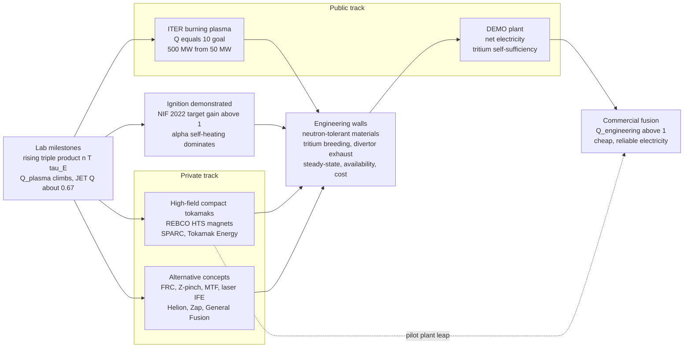

# 🔥 The Path to Fusion Energy

> [!abstract] TL;DR
> Fusion has been "thirty years away" for seventy years — but the joke is finally wearing thin. Measured on its true scorecards — the **triple product** $nT\tau_E$ and the gain $Q=P_{\text{fus}}/P_{\text{heat}}$ — controlled fusion has climbed toward the ignition band **faster than Moore's law**, JET reached $Q\approx0.67$, and in December 2022 **NIF crossed scientific ignition** (a target gain above 1). Two tracks now race: the giant international **ITER** tokamak (chasing $Q=10$, 500 MW of fusion from 50 MW of heating) as the de-risking public flagship pointing toward a **DEMO** power plant; and a well-funded **private wave** betting on faster, cheaper paths — high-field compact tokamaks with **REBCO high-temperature-superconductor magnets** (SPARC/Commonwealth, Tokamak Energy), field-reversed and pulsed concepts (TAE, Helion, Zap, General Fusion), stellarators, and inertial-fusion-energy startups. The remaining gap, honestly, is no longer core **physics** — it is **engineering**: breeding tritium fuel self-sufficiently, finding materials that survive 14 MeV neutrons, running in steady state, exhausting the divertor heat, and — above all — doing it **economically**. Scientific breakeven is *not* commercial breakeven: a plant needs plasma $Q\sim20$–$40$ just to reach wall-plug $Q_{\text{eng}}>1$. Fusion's advantages are real (abundant fuel, no CO$_2$, no long-lived waste, no meltdown), but it is **hard**, and the honest answer to "how close?" is: closer than ever, and still not soon.

## Intuition — analogy FIRST

Fusion has been "thirty years away" for seventy years — the running joke of energy research, the punchline every skeptic reaches for. But the joke is finally wearing thin, and here is why. **Look at the scorecard, not the calendar.** The real measure of a fusion machine is not the year on the press release but the **triple product** — how hot, how dense, and how well-confined the plasma is, all at once (this is the [[Nuclear_Fusion_and_the_Lawson_Criterion|Lawson criterion]]). Plot that number against time and it does not crawl: from the first Soviet tokamak T-3 in the late 1960s to the record shots of the late 1990s, it **doubled roughly every two years — as fast as, or faster than, Moore's law doubled transistors**. Then in 2022 the National Ignition Facility crossed **scientific ignition**: for the first time in a laboratory, a fusion fuel released more energy than the laser light that lit it. The physics finish line is in sight.

So why isn't fusion on the grid? Because *igniting* a plasma and *building a power plant around it* are wildly different problems. Think of it like the difference between a chemist showing that gasoline burns and an engineer building a reliable, affordable, mass-produced car engine that runs for years without exploding. The plasma is the flame; the reactor is everything else — and that "everything else" is now the hard part. The machine must **breed its own tritium fuel** (there is barely any on Earth), it must be built from materials that don't crumble under a relentless hail of high-energy neutrons, it must run **steadily** rather than in pulses, it must survive its own exhaust heat, and it must do all of this **cheaply enough to sell electricity**. Two camps are racing to get there: the giant, patient international project **ITER**, and a swarm of venture-backed startups armed with two genuinely new tools — **high-temperature-superconducting magnets** and **AI-driven design and control**. This note steps back to ask, honestly: how close are we really, what stands in the way, and why is *this* moment — despite seventy years of overpromising — genuinely different?

---

## How It Works

The path from a lab plasma to a power plant is not one road but a **relay of scorecards and gates**. Each stage is measured, cleared, and handed off:

1. **Lab milestones — the scorecards climb.** Every experiment is graded on the **triple product** $nT\tau_E$ and the **gain** $Q$. Decades of tokamaks (T-3 → Alcator → PLT → TFTR → JET → JT-60U → EAST/KSTAR) pushed the triple product up by five orders of magnitude, reaching $Q\approx0.67$ on JET's [[Tokamak_Physics|tokamak]] in deuterium-tritium. This is where the physics gets *demonstrated*.
2. **Ignition and burning plasma — the physics is settled.** Two events prove alpha self-heating can dominate: **NIF's December 2022 ignition** (3.15 MJ of fusion from 2.05 MJ of laser light — a **target gain above 1**), attacking the [[Nuclear_Fusion_and_the_Lawson_Criterion|Lawson criterion]] from the extreme-density inertial end; and **ITER**, designed for $Q=10$ (500 MW fusion from 50 MW heating), attacking it from the low-density magnetic end. Both aim to study a genuine **burning plasma** — one heated mostly by its own fusion products.
3. **Engineering walls — the hard part.** A burning plasma is necessary but nowhere near sufficient. A *power plant* must clear a wall of engineering problems the physics experiments deliberately sidestep: **breeding tritium** faster than it burns it, surviving **14 MeV neutron** damage, running in **steady state**, exhausting **divertor** heat, and achieving high **availability** at acceptable **cost**.
4. **Demonstration plant (DEMO) — electricity to the grid.** The public roadmap's penultimate step: a machine that actually generates net electricity, closes its own tritium cycle, and proves reliability. Private "pilot plants" aim to leapfrog straight here.
5. **Commercial fusion — the real finish line.** Not scientific $Q$ but **engineering / wall-plug $Q_{\text{eng}}>1$**, delivered cheaply, reliably, and at scale.

Crucially, two tracks run **in parallel**. The **public track** (ITER → DEMO) is large, slow, expensive, and de-risks the physics for everyone. The **private track** bets that new **REBCO high-temperature-superconductor** magnets (fusion power density scales as $\beta^2B^4$, so a stronger field shrinks the machine dramatically — see [[Superconductivity_and_BCS_Theory]]) plus venture capital and AI can reach a pilot plant faster and cheaper.



The single most important thing this diagram says: **crossing ignition (top) does not connect directly to commercial fusion (right).** Everything must pass through the engineering-walls box first.

---

## Key Concepts

### Secondary Level

- **"Always thirty years away" — but the scorecard says otherwise.** Judge fusion not by the calendar but by the **triple product** (hot × dense × well-confined) and the **gain $Q$** (energy out ÷ energy in). Both have risen dramatically — the triple product climbed *faster than Moore's law* for three decades.
- **Two landmark moments made this decade different.** (1) **NIF's 2022 ignition** — a lab fuel pellet released more energy than the laser that lit it. (2) **High-temperature-superconductor magnets** that let private companies build far smaller, cheaper machines.
- **Scientific breakeven is NOT plugging into the grid.** "Getting more fusion energy out than the heating in" ($Q=1$) is a physics milestone. A real power station has to pay for inefficient lasers/heaters, for turning heat into electricity, and for running the plant itself — so it needs to be **many times** past scientific breakeven.
- **Two camps race to the finish.** The giant public project **ITER** (patient, huge, international) and a wave of **private startups** (fast, focused, venture-funded) — plus laser-fusion companies riding NIF's success.
- **Fusion's real selling points are genuine — and so are its limits.** Fuel is essentially limitless (hydrogen from seawater and lithium), it emits **no CO$_2$**, produces **no long-lived high-level waste**, and **cannot melt down or make bomb material**. But it is **not** "free limitless energy on a plate" — it is fiendishly hard, and whether it wins comes down to **economics**.

### Undergraduate Level

- **The gain ladder — four different $Q$'s.** These are constantly conflated in headlines:
  - $Q_{\text{plasma}}=P_{\text{fus}}/P_{\text{heat}}$ — fusion power vs power *delivered to the plasma*. JET reached $\approx0.67$.
  - **Scientific breakeven:** $Q=1$.
  - **Ignition:** $Q\to\infty$ (alpha self-heating alone sustains the burn).
  - $Q_{\text{eng}}=P_{\text{electric out}}/P_{\text{electric in}}$ — the **wall-plug** number a business cares about. This is *far* smaller than $Q_{\text{plasma}}$ for the same shot.
- **The progress is real (Wurzel & Hsu 2022).** Plotting $nT\tau_E$ (and $Q$) against year for real machines — T-3, TFTR, JET, JT-60U, and the NIF ignition point — shows a climb of five-plus orders of magnitude, doubling every ~1.8 years, into the ignition band. Progress then *slowed* in the 2000s (funding, not physics) before HTS magnets and private capital re-accelerated it.
- **ITER — the physics de-risker.** $R_0=6.2$ m, $B_0=5.3$ T, $I_p=15$ MA, superconducting Nb$_3$Sn coils, **$Q=10$** target (500 MW from 50 MW). Its job is to demonstrate a **burning plasma** at reactor scale. Its curse is **schedule and cost**: repeated delays have pushed first plasma and the deuterium-tritium campaign well into the 2030s, and the project cost has grown into the tens of billions — the central argument the private sector uses against the big-machine model.
- **DEMO — the next public step.** A demonstration power plant that actually sends electricity to the grid and closes its own tritium cycle. Different partners (EU, China, Korea, Japan) have their own DEMO concepts; none is under construction.
- **The private fusion wave — a taxonomy.** A surge of well-funded startups betting on faster or cheaper paths:
  - **High-field compact tokamaks:** **Commonwealth Fusion Systems** (SPARC → ARC) and **Tokamak Energy** exploit REBCO HTS magnets and the $P_{\text{fus}}\propto B^4$ scaling to shrink the machine.
  - **Field-reversed / alternative magnetic:** **TAE** (advanced-fuel FRC), **Helion** (pulsed FRC collision with **direct energy conversion**, aiming for D-$^3$He), **Zap Energy** (**sheared-flow-stabilized Z-pinch**, no external coils), **General Fusion** (**magnetized target fusion** — a liquid-metal-compressed plasma).
  - **Stellarators:** Type One Energy, Thea Energy — steady-state, disruption-free, betting on modern optimization and manufacturing.
  - **Inertial-fusion-energy (IFE) startups:** **Focused Energy, Xcimer, Marvel Fusion** — riding NIF's ignition to pursue *repetitive* laser fusion for power.
- **The engineering walls, named.** Tritium breeding self-sufficiency; neutron-tolerant / low-activation materials; steady-state operation and current drive; divertor heat exhaust; reliability/availability; and cost. These, not the plasma physics, are where a power plant is won or lost.

### Graduate Level

- **Why $Q_{\text{eng}}$ is brutal.** Net electricity requires
  $$Q_{\text{eng}}=\frac{P_{\text{net elec}}}{P_{\text{grid in}}}=\frac{\eta_{\text{th}}\,(P_{\text{fus}}+P_{\text{heat}})\big(1+M_n\big)-P_{\text{recirc}}}{P_{\text{grid in}}},$$
  where $\eta_{\text{th}}\approx0.35$–$0.45$ is the thermal-to-electric efficiency (Carnot-limited), $M_n\approx1.1$–$1.2$ is the blanket neutron-energy multiplication, and $P_{\text{recirc}}$ pays for heating-system inefficiency ($\eta_{\text{heat}}\sim0.3$–$0.6$), magnets, cryoplant, and pumps. Folding these together, a viable plant typically needs **plasma $Q\gtrsim20$–$40$** to clear $Q_{\text{eng}}>1$ with margin — which is why $Q=10$ ITER is a *physics* demonstrator, not a power plant, and why NIF's target gain of ~1.5 (relative to *laser* energy) corresponds to a wall-plug $Q_{\text{eng}}\sim0.01$ once the lasers' ~300 MJ grid draw is counted.
- **Neutron materials — the wall without a wall.** D-T dumps 80% of its energy into 14.1 MeV neutrons. These cause **displacement damage** (tens of **dpa/full-power-year**), **transmutation**, and **helium/hydrogen embrittlement** via $(n,\alpha)$ and $(n,p)$ reactions — swelling, hardening, and cracking structural steels. The field pursues **reduced-activation ferritic-martensitic steels** (EUROFER-97), **ODS steels**, SiC/SiC composites, and tungsten armour. The killer gap: **there is no 14 MeV neutron source to qualify these materials** at reactor fluence — the **IFMIF-DONES** accelerator source is still being built. You cannot certify a 30-year reactor wall you have never irradiated.
- **Tritium self-sufficiency — the fuel that isn't there.** Tritium ($t_{1/2}=12.3$ yr) does not occur naturally; world stockpiles are kilograms. A D-T plant must **breed** it in a lithium **blanket**: $^6\text{Li}+n\to{}^4\text{He}+T+4.8\text{ MeV}$ (and $^7\text{Li}+n\to{}^4\text{He}+T+n'$). With a plasma **tritium burn fraction of only a few percent**, the blanket must achieve a **tritium breeding ratio TBR $\gtrsim1.05$–$1.15$** *including* a **neutron multiplier** (Be or Pb) to overcome leakage, structure absorption, and radioactive decay — while also extracting the tritium and surviving. Candidate blankets (HCPB solid ceramic pebbles, WCLL/DCLL liquid lithium-lead, FLiBe molten salt) are unproven at scale. The **startup inventory** problem is acute: where does the *first* few kilograms of tritium for a fleet of plants come from?
- **Steady state and current drive.** A basic tokamak is **inductively pulsed** (the transformer saturates — see [[Tokamak_Physics]]). A reactor needs near-100% non-inductive operation: RF/neutral-beam current drive plus a high self-generated **bootstrap fraction** $f_{\text{BS}}\propto\beta_p\sqrt{\epsilon}$. Stellarators sidestep this (no driven current, no [[MHD_Instabilities|disruptions]]) at the price of 3-D coil complexity; Helion sidesteps it entirely with a **pulsed, non-ignition** scheme and direct conversion.
- **Divertor heat exhaust.** A reactor divertor faces steady heat fluxes of order **10–20 MW·m$^{-2}$** (rivaling a rocket nozzle), plus transient ELM loads. Solutions — **radiative detachment**, advanced magnetic geometries (Super-X, snowflake), and **liquid-metal divertors** — are active frontiers; ARC-class high-power-density designs make this even harder.
- **Economics and availability — the true gate.** Fusion's cost is dominated by **capital** (magnets, blanket, buildings) and by **availability**: a plant whose neutron-damaged components need frequent replacement cannot compete. The 2021 **U.S. National Academies** report and a follow-on FESAC/DOE **Bold Decadal Vision** reframed the U.S. goal around a **cost-competitive fusion pilot plant** in the 2030s–40s, explicitly public-private. LCOE, not $Q$, is the final scorecard.
- **Why *this* moment is genuinely different.** Four things changed at once: (1) **ignition achieved** (NIF), removing the last core-physics doubt; (2) **REBCO HTS magnets** at 20+ T, enabling the $B^4$ compact route; (3) **private capital** at multi-billion-dollar scale; and (4) **AI-accelerated design and real-time control** — deep [[RL_Fundamentals|reinforcement learning]] now shapes tokamak plasmas and predicts/avoids disruptions. None of these existed a decade ago. The 30-year joke was true when progress had stalled; it is a weaker joke now.

---

## Python Demo

```python
# THE PROGRESS AND THE GAPS  (numpy + matplotlib only)
# ============================================================================
# (a) TRIPLE-PRODUCT PROGRESS: the fusion triple product n*T*tau_E for real
#     machines, on a log timeline, versus a Moore's-law reference (2-yr
#     doubling). Shows the "faster than Moore's law" climb into the ignition
#     band, plus the future ITER goal and the NIF ignition point.
# (b) THE Q LADDER / GAP: a horizontal ladder of the different "Q"s, making
#     the key point that SCIENTIFIC breakeven is NOT COMMERCIAL breakeven --
#     a power plant needs plasma Q ~ 30-40 (for wall-plug Q_eng > 1), far
#     above ITER's Q=10 goal and JET's Q~0.67.
# ============================================================================
import numpy as np
import matplotlib.pyplot as plt

# ---------------------------------------------------------------------------
# (a) HISTORICAL TRIPLE PRODUCT  n*T*tau_E  [keV.s/m^3]  (illustrative values,
#     after Wurzel & Hsu 2022 progress compilation)
# ---------------------------------------------------------------------------
# magnetic-confinement points used for the growth-rate fit (1969-1998):
mag = [
    ("T-3",        1969, 1.5e16),
    ("Alcator A",  1975, 2.0e18),
    ("PLT",        1978, 1.0e19),
    ("Alcator C",  1983, 8.0e19),
    ("TFTR",       1994, 4.0e20),
    ("JET (D-T)",  1997, 9.0e20),
    ("JT-60U",     1998, 1.53e21),
]
names  = [m[0] for m in mag]
years  = np.array([m[1] for m in mag], float)
triple = np.array([m[2] for m in mag], float)

# future / other-route landmarks (NOT in the fit):
nif  = ("NIF ignition\n(2022)", 2022, 4.0e21)   # inertial, above ignition
iterp = ("ITER goal\n(Q=10)",   2035, 6.0e21)   # magnetic, future

# --- fit the historical doubling time in log space ---
slope, intercept = np.polyfit(years, np.log10(triple), 1)   # decades per year
t_double = np.log10(2.0) / slope
print(f"(a) historical triple-product growth 1969-1998:")
print(f"    {slope:.3f} decades/yr  ->  doubling time = {t_double:.2f} years")
print(f"    Moore's law doubling      ~ 2.00 years  "
      f"({'FASTER' if t_double < 2 else 'slower'} than Moore's law)")

# Moore's-law reference anchored at the T-3 point, 2-yr doubling:
yr_line = np.linspace(1968, 2037, 300)
moore   = triple[0] * 2.0 ** ((yr_line - years[0]) / 2.0)

IGNITION_MIN = 3.0e21   # min D-T triple product for ignition [keV.s/m^3]

# ---------------------------------------------------------------------------
# (b) THE Q LADDER: name, Q value, category
#     category: 0 = below breakeven, 1 = scientific gain, 2 = commercial target
# ---------------------------------------------------------------------------
q_ladder = [
    ("NIF 2022  (wall-plug Q_eng)",           0.011, 0),
    ("JET 1997  (Q_plasma)",                  0.67,  0),
    ("NIF 2022  (target gain vs laser)",      1.5,   1),
    ("ITER goal (Q_plasma = 10)",             10.0,  1),
    ("Power plant needs (Q_plasma ~ 30-40)",  35.0,  2),
]
qlabels = [q[0] for q in q_ladder]
qvals   = np.array([q[1] for q in q_ladder])
qcat    = [q[2] for q in q_ladder]
colors  = {0: "#d9534f", 1: "#f0ad4e", 2: "#5cb85c"}
ypos    = np.arange(len(q_ladder))

# ---------------------------------------------------------------------------
# PLOTS
# ---------------------------------------------------------------------------
fig, (axL, axR) = plt.subplots(1, 2, figsize=(15, 6.5))

# ---- (a) triple-product timeline ----
axL.axhspan(IGNITION_MIN, 3e22, color="gold", alpha=0.18,
            label="ignition band (n*T*tau_E > 3e21)")
axL.plot(yr_line, moore, "k--", lw=1.6, alpha=0.7,
         label="Moore's law reference (2-yr doubling)")
axL.plot(years, triple, "o-", color="navy", lw=2.0, ms=8, label="magnetic devices")
for nm, yy, tp in mag:
    axL.annotate(nm, (yy, tp), textcoords="offset points",
                 xytext=(6, -12), fontsize=8)
# NIF and ITER landmarks
axL.scatter([nif[1]],  [nif[2]],  s=140, marker="*", color="crimson", zorder=6)
axL.annotate(nif[0],  (nif[1],  nif[2]),  textcoords="offset points",
             xytext=(-70, 6), fontsize=8, color="crimson")
axL.scatter([iterp[1]], [iterp[2]], s=120, marker="D", color="green", zorder=6)
axL.annotate(iterp[0], (iterp[1], iterp[2]), textcoords="offset points",
             xytext=(-30, 12), fontsize=8, color="green")
axL.set_yscale("log")
axL.set_xlabel("year"); axL.set_ylabel("triple product  n*T*tau_E  [keV.s/m^3]")
axL.set_title(f"(a) Triple product climbed faster than Moore's law\n"
              f"(historical doubling ~ {t_double:.1f} yr)")
axL.set_xlim(1965, 2040); axL.set_ylim(1e15, 3e22)
axL.legend(loc="lower right", fontsize=8); axL.grid(True, which="both", alpha=0.3)

# ---- (b) Q ladder / gap ----
axR.barh(ypos, qvals, color=[colors[c] for c in qcat], alpha=0.85, edgecolor="k")
axR.axvline(1.0, color="k", ls="--", lw=1.6)
axR.text(1.0, len(q_ladder)-0.35, " scientific\n breakeven Q=1",
         fontsize=8, va="top")
axR.axvspan(20, 1e3, color="green", alpha=0.08)
axR.text(20, -0.65, "commercial band (Q_plasma >~ 20-40)",
         fontsize=8, color="green")
for y, v in zip(ypos, qvals):
    axR.text(v * 1.15, y, f"{v:g}", va="center", fontsize=9)
axR.set_yticks(ypos); axR.set_yticklabels(qlabels, fontsize=9)
axR.set_xscale("log")
axR.set_xlabel("gain  Q  (log scale)")
axR.set_title("(b) The Q ladder: scientific breakeven\nis NOT commercial breakeven")
axR.set_xlim(5e-3, 1e2); axR.invert_yaxis()
axR.grid(True, axis="x", which="both", alpha=0.3)

plt.tight_layout()
plt.savefig("path_to_fusion.png", dpi=120)
print("\nsaved path_to_fusion.png")
```

**What you should see.** Panel (a): the magnetic-device points march up the log axis by **five-plus orders of magnitude** in three decades, with the fitted doubling time (~1.7–1.8 yr) printed *below* Moore's 2-year reference line — i.e. **fusion climbed faster than Moore's law**, ending inside the shaded **ignition band**, with the NIF 2022 ignition star (from the inertial route) and the future ITER $Q=10$ diamond clustered near the same finish line despite living at utterly different densities. Panel (b): the **Q ladder** drives home the single most misread fact in fusion — JET's $Q\approx0.67$ and even NIF's *wall-plug* $Q_{\text{eng}}\approx0.01$ sit far left of the $Q=1$ scientific-breakeven line; NIF's *laser-referenced* gain (~1.5) and ITER's $Q=10$ goal clear scientific breakeven but still fall **short of the green commercial band** ($Q_{\text{plasma}}\sim20$–$40$) a real power plant needs. The gap between "we made net fusion energy" and "we made net *electricity*" is the whole engineering story.

---

## Real-World Applications

- **ITER (Cadarache, France) — the physics flagship.** The 35-nation, tens-of-billions burning-plasma tokamak targeting $Q=10$; its purpose is to *de-risk the physics* of a self-heated plasma at reactor scale. Its schedule slips and cost growth are the central case study — and the private sector's chief counter-argument — in the "big machine vs fast machine" debate.
- **NIF / Lawrence Livermore — inertial ignition.** The December 2022 shot (and repeats with higher gain since) proved **ignition** is achievable, transforming inertial-confinement fusion from a weapons-science program into the seed of an **inertial-fusion-energy** industry — but at ~one shot per experiment, far from the ~10 Hz repetition a power plant needs.
- **Commonwealth Fusion Systems (SPARC → ARC).** The flagship of the private wave: in 2021 it demonstrated a **20 T REBCO HTS magnet**, validating the compact high-field route ($P_{\text{fus}}\propto B^4$); SPARC targets $Q>2$ in a device a fraction of ITER's volume, with ARC as the intended pilot plant. The clearest embodiment of "[[Superconductivity_and_BCS_Theory|superconductivity]] changes the game."
- **Helion, Zap, General Fusion, TAE — the alternative-concept bet.** Helion's **pulsed FRC with direct energy conversion** (skipping the steam cycle) chases D-$^3$He and has a power-purchase agreement with Microsoft; **Zap Energy's** coil-free **sheared-flow Z-pinch**; **General Fusion's** liquid-metal **magnetized target fusion**; **TAE's** advanced-fuel FRC — each trading the tokamak's maturity for a potentially simpler or cheaper machine.
- **EAST, KSTAR, W7-X, JT-60SA — steady-state and stellarator groundwork.** Superconducting long-pulse tokamaks (EAST held high-confinement plasmas for >1000 s; KSTAR ran minutes at ~100 million K) and the **Wendelstein 7-X** stellarator are proving the **steady-state** and **disruption-free** operation a reactor demands.
- **AI for fusion.** DeepMind + EPFL used deep [[RL_Fundamentals|reinforcement learning]] to control the TCV tokamak's shaping coils in real time; ML disruption prediction/avoidance and AI-accelerated reactor design are now standard tools — part of why this moment differs from past hype cycles.
- **The Sun — the existence proof.** Nature's reactor confines fusion fuel gravitationally with a $\tau_E$ of billions of years (see [[Stellar_Structure_and_Energy_Generation]] and [[The_Sun]]). Every terrestrial concept is an attempt to substitute magnetic or inertial confinement for a star's mass.

---

## Common Pitfalls

1. **Conflating scientific $Q$ with wall-plug $Q$.** The single most common misreading. $Q_{\text{plasma}}$ ignores heating/laser inefficiency, thermal-to-electric conversion (~35%), and recirculating power. NIF's 2022 "gain" was relative to *laser* energy on target, not the ~300 MJ drawn from the grid ($Q_{\text{eng}}\approx0.01$). A power plant needs plasma $Q\sim20$–$40$ for $Q_{\text{eng}}>1$ — scientific breakeven is **not** commercial breakeven.
2. **Treating "always 30 years away" as proof it will never work.** The joke was earned during the 2000s plateau — but the **triple product genuinely rose faster than Moore's law** from 1968 to 1998, and ignition + HTS magnets restarted the climb. Progress is measurable and steep; the honest critique is about **engineering and economics**, not "it can't be done."
3. **Assuming ITER = fusion.** ITER is one (very large, very public) bet aimed at $Q=10$ physics, with well-known **first-plasma delays and cost growth**. It is not the whole field: **private compact-HTS** (SPARC, Tokamak Energy), **alternative-concept** (Helion, Zap, General Fusion, TAE), **stellarator**, and **laser IFE** startups pursue faster, cheaper, or steadier routes. Betting for or against "fusion" by betting on ITER alone is a category error.
4. **Believing the remaining problems are physics.** They are mostly **engineering**: tritium breeding self-sufficiency (TBR > 1.05), neutron-tolerant / low-activation materials (**with no 14 MeV test facility yet built**), steady-state current drive, divertor heat exhaust, reliability/availability, and cost. Ignition proved the physics; the plant is where the difficulty now lives.
5. **Skipping the materials problem.** 14 MeV neutrons cause displacement damage, transmutation, and helium embrittlement no fission material has faced at this spectrum. Certifying a 30-year reactor wall requires irradiating it — but the qualification neutron source (IFMIF-DONES) is still under construction. This is a **decade-scale critical path**, not a footnote.
6. **Forgetting tritium doesn't exist.** World tritium stocks are kilograms; a plant must breed its own faster than it burns it (burn fraction only a few percent) *and* solve the startup-inventory problem. "Fuel is limitless" is true for deuterium and lithium — but the tritium fuel cycle is an unsolved engineering system.
7. **Overselling — or underselling — fusion's advantages.** The upsides are **real**: abundant fuel, **no CO$_2$**, **no long-lived high-level waste**, **no meltdown or proliferation risk**. But fusion is not "limitless free energy" — it is capital-intensive and hard, and its future turns on **LCOE and availability**, not on physics alone. Honesty in both directions is the mature position.

---

## Related Concepts

- [[Nuclear_Fusion_and_the_Lawson_Criterion]] — the triple product $nT\tau_E$ and the $Q$ / breakeven / ignition definitions that are the scorecards this whole roadmap is graded on.
- [[Tokamak_Physics]] — the leading magnetic-confinement concept (ITER, JET, SPARC) and its physics limits ($q$, disruptions, pulsed drive) that reactor engineering must overcome.
- [[Magnetic_Confinement_Concepts]] — why a twisted torus confines a plasma at all; the foundation beneath both tokamaks and stellarators.
- [[MHD_Instabilities]] — the kink, tearing, and disruption physics that threaten steady, reliable reactor operation and drive the case for stellarators and disruption mitigation.
- [[Plasma_Physics_Overview]] — the parent survey of what a plasma is and why confining one for net energy is so hard.
- [[Nuclear_Reactions_Fission_Fusion]] — the D-T reaction and its 14.1 MeV neutron, whose energy carries both the fuel-breeding opportunity and the materials-damage problem.
- [[Superconductivity_and_BCS_Theory]] — REBCO high-temperature superconductors are *the* enabling technology of the private high-field compact route ($P_{\text{fus}}\propto B^4$).
- [[Superconductivity]] — the underlying physics of the zero-resistance magnets (Nb$_3$Sn in ITER, REBCO in SPARC) that make magnetic confinement economical.
- [[Stellar_Structure_and_Energy_Generation]] — the Sun as the natural fusion reactor, confining fuel gravitationally where reactors use fields or inertia.
- [[The_Sun]] — the working existence proof that the Lawson criterion *can* be satisfied, given enough mass and time.
- [[RL_Fundamentals]] — deep reinforcement learning now controls tokamak plasmas and predicts disruptions, part of why this moment differs from past fusion hype.

*Section siblings that develop the pieces synthesized here (build order): Inertial_Confinement_Fusion details the laser/NIF route and ignition; Stellarators_and_Alternative_Confinement covers the disruption-free steady-state magnetic path; Fusion_Reactor_Engineering_and_Breeding develops the blanket, neutron materials, and divertor walls; and Fusion_Fuel_Cycles_and_Aneutronic_Fusion treats tritium self-sufficiency and the advanced-fuel (D-$^3$He, p-$^{11}$B) alternatives that Helion and TAE pursue.*

---

## Review Questions

1. **(Secondary)** Fusion has been "thirty years away" for seventy years. Using the idea of a **scorecard**, explain why that joke is misleading — what number has actually been climbing, and how fast? Then explain, in plain terms, why "getting more fusion energy out than we put in" is still not the same as "putting fusion electricity on the grid."
2. **(Undergraduate)** Define the four different "$Q$"s ($Q_{\text{plasma}}$, scientific breakeven, ignition, $Q_{\text{eng}}$). Given a machine with $Q_{\text{plasma}}=10$, thermal-to-electric efficiency $\eta_{\text{th}}=0.4$, and a large recirculating-power fraction, argue qualitatively why $Q_{\text{eng}}$ can still be barely above (or below) 1 — and hence why a power plant needs $Q_{\text{plasma}}$ several times higher.
3. **(Undergraduate)** Contrast the **public** (ITER → DEMO) and **private** (compact-HTS, alternative-concept, laser-IFE) tracks. What specifically did REBCO high-temperature-superconductor magnets change about the design space, and why does $P_{\text{fus}}\propto B^4$ make a *smaller* machine attractive?
4. **(Graduate)** Name the four principal engineering walls between a burning plasma and a power plant (tritium breeding, neutron materials, steady state, divertor exhaust). For **tritium breeding**, explain why the breeding ratio must exceed ~1.05 despite the reaction $^6\text{Li}(n,\alpha)T$ producing one triton per neutron, and identify the role of a neutron multiplier and the burn-fraction/startup-inventory problem.
5. **(Graduate)** "The physics of fusion is essentially solved; what remains is engineering and economics." Defend *and* critique this claim. In your answer, address the missing 14 MeV materials-qualification facility, the absence of a demonstrated closed tritium cycle, steady-state current drive, and why LCOE and availability — not $Q$ — are the ultimate scorecard. Then explain the four factors that make *this* decade genuinely different from prior fusion optimism.

---

## Sources

- Freidberg, J. P. — *Plasma Physics and Fusion Energy* (Cambridge, 2007) — the standard treatment of the power balance, $Q$, engineering gain, and reactor design.
- Wurzel, S. E. & Hsu, S. C. — "Progress toward fusion energy breakeven and gain as measured against the Lawson criterion," *Physics of Plasmas* **29**, 062103 (2022) — the definitive compilation of the triple-product and $Q$ progress figures used in the demo.
- ITER Organization — *ITER Research Plan within the Staged Approach* (ITR-18-003, 2018) — the official burning-plasma mission, $Q=10$ goal, and staged schedule.
- National Academies of Sciences, Engineering, and Medicine — *Bringing Fusion to the U.S. Grid* (2021) — the fusion pilot-plant report reframing the goal around a cost-competitive plant and public-private partnership.
- Abu-Shawareb, H. et al. (NIF Indirect Drive ICF Collaboration) — "Achievement of Target Ignition on the National Ignition Facility," *Phys. Rev. Lett.* **129**, 075001 (2024) — the peer-reviewed report of the December 2022 ignition result.

---

#plasma-physics #fusion-energy #ITER #private-fusion #triple-product
