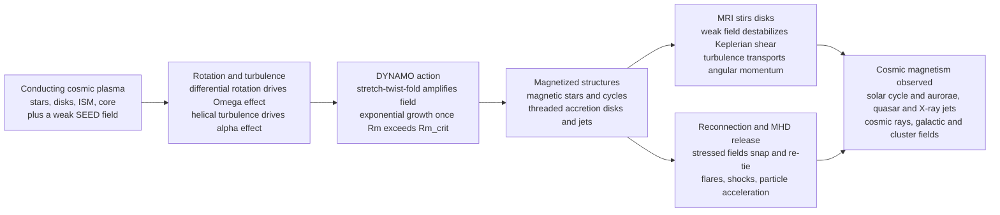

# 🌌 Astrophysical Plasmas and Dynamos

> [!abstract] TL;DR
> **Nearly all the matter you can see in the night sky is plasma, and almost all of it is pervasively threaded by magnetic fields that nobody switched on — the universe magnetizes itself.** The engine is **dynamo action**: a conducting fluid in motion (a star's churning convection zone, a swirling disk feeding a black hole, Earth's liquid iron core) amplifies a weak **seed field** by induction whenever the **magnetic Reynolds number** $R_m$ climbs above a critical value. The classic **stretch-twist-fold** cycle bootstraps a tiny field into an exponentially growing one; the **α-Ω dynamo** combines differential rotation (the Ω effect, which shears out toroidal field) with helical turbulence (the α effect, which regenerates poloidal field) to explain the Sun's 11-year sunspot cycle, its 22-year magnetic cycle, and the butterfly diagram. These self-generated fields then do spectacular work: through the **magnetorotational instability (MRI)** they make accretion disks turbulent so they can shed angular momentum and feed quasars and X-ray binaries; through **magnetic reconnection** they power flares and magnetar bursts; and through magnetic launching (Blandford-Znajek, magnetic towers) they fling **relativistic jets** across galaxies. Dynamos, the MRI, and reconnection are the master processes that make the cosmos magnetically active — and they are the *same* physics studied in the fusion lab and the near-Earth magnetosphere.

---

## Intuition

**Analogy:** A **bicycle dynamo** makes electricity out of nothing but the motion of the wheel — spin the wheel and a magnetic field appears where there was none. Now imagine the wheel is a whole star, or a disk of gas spiralling into a black hole, and there is no wiring at all: just a hot, electrically conducting fluid churning and rotating. That moving conductor does the same trick on itself. Give it a whisper of a seed field and its own swirling motion **stretches, twists, and folds** that field, piling amplification on amplification until a microgauss whisper becomes a kilogauss roar. The universe is a self-starting dynamo.

Once the field exists, it stops being a bystander and starts running the show. Magnetic tension acts like invisible rubber bands strung through the plasma: in a shearing disk those bands couple fast inner gas to slow outer gas and let the disk shed the angular momentum that otherwise forbids it from falling inward (the **MRI**); wound-up and stressed, the bands snap and re-tie in **reconnection**, dumping their stored energy as flares; and anchored to a spinning black hole, they act as a magnetic slingshot that launches jets to near light-speed. **Plasma astrophysics is the physics of a magnetized universe** — where the fields come from, and what they do once they are there.

---

## How It Works

### Core mechanics

**1. The setting: the universe is plasma, and it is magnetized.** Stars, the interstellar and intergalactic medium, accretion disks, jets, and the solar wind are all **plasma** — ionized, electrically conducting fluid. Observations (Zeeman splitting, synchrotron emission, Faraday rotation, polarized dust) show this plasma is **pervasively magnetized** on every scale, from planets to galaxy clusters. The puzzle is not whether cosmic fields exist but *where they come from*, because ohmic decay would erase a primordial field over cosmic time in most bodies. Something must be actively **regenerating** them.

**2. Induction: the tug-of-war between advection and diffusion.** The magnetic field of a conducting fluid obeys the **induction equation**
$$\frac{\partial \vec{B}}{\partial t} = \underbrace{\nabla\times(\vec{v}\times\vec{B})}_{\text{advection / stretching}} + \underbrace{\frac{\eta}{\mu_0}\nabla^2\vec{B}}_{\text{ohmic diffusion}}.$$
The ratio of the two terms is the **magnetic Reynolds number** $R_m = \mu_0 v L / \eta = vL/\eta_m$. When $R_m \gg 1$ the flux is nearly **frozen into the fluid** and the field is dragged and amplified by the flow; when $R_m \ll 1$ diffusion wins and any field decays. A dynamo is possible only when $R_m$ exceeds a geometry-dependent **critical value** $R_{m,c}$ (typically tens to hundreds).

**3. Stretch-twist-fold: how motion amplifies field.** In the high-$R_m$ limit, a flow that **stretches** a flux tube lengthens it and, by flux conservation, intensifies $B$; **twisting** the stretched tube and **folding** it back on itself doubles the flux threading the original area. Repeat the cycle and the field grows **exponentially** — the geometric picture behind the "fast dynamo." This is why the growth rate turns *positive* the moment $R_m$ crosses threshold: above it, stretching outruns diffusion.

**4. Kinematic vs saturated (nonlinear) dynamos.** In the **kinematic** phase the field is too weak to react back on the flow, so $\vec{v}$ is prescribed and $\vec{B}$ grows exponentially — a linear eigenvalue problem. As the field strengthens, the **Lorentz force** $\vec{J}\times\vec{B}$ begins to resist the very motions amplifying it. Growth **saturates** when magnetic energy reaches rough equipartition with the kinetic energy of the driving eddies; the fully nonlinear, saturated dynamo sets the observed field strength.

**5. The α-Ω dynamo (mean-field theory).** For a rotating, turbulent, stratified body the large-scale field is regenerated by two effects. The **Ω effect**: differential rotation shears a poloidal (meridional) field into a strong **toroidal** (azimuthal) field — cheap and powerful. The **α effect**: small-scale *helical* turbulence (rotation + stratification break mirror symmetry) systematically twists toroidal loops back into **poloidal** field, closing the loop. Together they sustain an oscillatory large-scale field — the dynamo wave that, in the Sun, migrates toward the equator and produces the sunspot cycle.

**6. Anti-dynamo theorems: why 3D and helicity are essential.** Dynamo action is *not* automatic. **Cowling's theorem** forbids a steady axisymmetric field from being maintained by axisymmetric motion; **Zel'dovich's theorem** rules out purely two-dimensional (planar) flows. A working dynamo therefore needs genuinely **three-dimensional** flow and, for the large-scale mean field, **kinetic helicity** $\langle\vec{v}\cdot(\nabla\times\vec{v})\rangle \neq 0$ — the symmetry-breaking that the α effect encodes.

**7. What the fields then do.** Once generated, cosmic fields drive the **MRI** in disks (a weak field destabilizes Keplerian shear, producing the turbulent "anomalous viscosity" that lets gas accrete), power **jets** by magnetic launching, mediate **collisionless shocks** that Fermi-accelerate **cosmic rays**, and store energy that **reconnection** later releases explosively. The magnetized universe is dynamically active because of these three master processes: **dynamos** make the field, the **MRI** stirs the disks, and **reconnection** releases the energy.

### Flow / architecture



---

## Key Concepts

### Secondary Level

- Almost everything glowing in space — stars, glowing gas clouds, the disks feeding black holes — is **plasma**: gas so hot its atoms have shed electrons, making it an electrical conductor.
- This plasma is laced with **magnetic fields nobody put there**. A moving conductor generates magnetism (that is how a bicycle dynamo lights your headlamp), and a churning, spinning star or disk does the same to *itself* — a **dynamo**.
- A dynamo takes a tiny **seed** field and amplifies it enormously by **stretching, twisting, and folding** it, over and over, like kneading dough.
- The Sun's dynamo makes **sunspots** wax and wane on an **11-year cycle**. Earth's liquid-iron core runs a dynamo that gives us the **magnetic field a compass follows**.
- Once made, these fields do dramatic things: they let disks pour matter onto black holes, and they store energy that is later released as **flares** and shot out as **jets** across a galaxy.

### Undergraduate Level

- **Induction equation and $R_m$:** $\partial_t\vec{B} = \nabla\times(\vec{v}\times\vec{B}) + (\eta/\mu_0)\nabla^2\vec{B}$. The **magnetic Reynolds number** $R_m = vL/\eta_m$ compares stretching to diffusion; dynamo growth requires $R_m > R_{m,c}$.
- **Frozen-in flux (Alfvén's theorem):** at high $R_m$ field lines move with the fluid, so flows that stretch flux tubes amplify $B$ (this is the ideal-MHD limit that sibling notes develop in full).
- **Stretch-twist-fold** doubles flux each cycle, giving exponential kinematic growth — the essence of field self-amplification.
- **α-Ω dynamo:** the **Ω effect** (differential rotation) shears poloidal field into toroidal field; the **α effect** (helical turbulence) regenerates poloidal field from toroidal. Their product sets the **dynamo number** $D$; a dynamo runs when $|D| > D_c$.
- **Solar dynamo signatures:** the 11-year sunspot number cycle, the 22-year magnetic (Hale) cycle, the **butterfly diagram** (sunspot latitude drifting equatorward), and the **tachocline** (the shear layer at the base of the convection zone where the Ω effect is thought to operate).
- **Magnetorotational instability (MRI):** a *weak* vertical field threading a differentially rotating disk with angular velocity *decreasing outward* is unstable. Magnetic tension links inner (fast) to outer (slow) fluid elements like a spring, transferring angular momentum outward and driving turbulence — the physical origin of the Shakura-Sunyaev $\alpha$ viscosity.
- **Anti-dynamo theorems:** Cowling (no steady axisymmetric dynamo) and Zel'dovich (no 2D dynamo) force real dynamos to be three-dimensional and, for mean fields, helical.

### Graduate Level

- **Mean-field electrodynamics.** Split $\vec{B} = \overline{\vec{B}} + \vec{b}$ and $\vec{v} = \overline{\vec{v}} + \vec{u}$; averaging the induction equation yields a turbulent EMF $\boldsymbol{\mathcal{E}} = \overline{\vec{u}\times\vec{b}} = \alpha\overline{\vec{B}} - \eta_T\nabla\times\overline{\vec{B}}$. The **α tensor** (nonzero only when the turbulence is helical / lacks mirror symmetry) regenerates large-scale field; $\eta_T$ is the **turbulent diffusivity**. The α coefficient scales as $\alpha \sim -\tfrac{1}{3}\tau\langle\vec{u}\cdot(\nabla\times\vec{u})\rangle$.
- **α-quenching and helicity conservation.** Because **magnetic helicity** $\int\vec{A}\cdot\vec{B}\,dV$ is nearly conserved at high $R_m$, generating large-scale (positive) helical field forces opposite small-scale helicity to build up, which **quenches** α catastrophically ($\alpha \sim \alpha_0/(1 + R_m\,\overline{B}^2/B_{eq}^2)$) unless helicity is expelled by fluxes/winds. This is the central open problem of nonlinear mean-field dynamo theory.
- **Fast vs slow dynamos.** A **fast dynamo** has a growth rate that stays finite (or grows) as $R_m\to\infty$; a **slow dynamo** relies on resistivity and vanishes in that limit. Chaotic, stretch-twist-fold flows (e.g. the stretch-fold-shear and ABC flows) are the paradigms of fast dynamos, tied to the positive Lyapunov exponent of the flow.
- **MRI dispersion relation.** For axisymmetric perturbations with vertical wavenumber $k$ and vertical Alfvén frequency $\omega_A = kv_{A}$ in a disk with epicyclic frequency $\kappa$,
$$\omega^4 - \omega^2\!\left(\kappa^2 + 2\omega_A^2\right) + \omega_A^2\!\left(\omega_A^2 + \frac{d\Omega^2}{d\ln r}\right) = 0.$$
Instability ($\omega^2<0$) requires $\omega_A^2 < -\,d\Omega^2/d\ln r$; for a **Keplerian** disk $d\Omega^2/d\ln r = -3\Omega^2$ and $\kappa=\Omega$, giving a **maximum growth rate $\gamma_{\max} = \tfrac{3}{4}\Omega$** at $\omega_A^2 = \tfrac{15}{16}\Omega^2$ — of order the orbital frequency, i.e. dynamically fast. Crucially, the *weaker* the field the more modes are unstable, so even an infinitesimal field destabilizes the disk; pure hydrodynamics (Rayleigh criterion on specific angular momentum) is **stable**.
- **Blandford-Znajek and magnetic launching.** Fields anchored in an accretion disk or threading a spinning black hole's ergosphere extract rotational energy electromagnetically; the BZ power scales as $P_{BZ}\propto \Phi^2\,\Omega_H^2$ (magnetic flux and horizon angular velocity), launching Poynting-flux-dominated **relativistic jets**. Magneto-centrifugal (Blandford-Payne) and magnetic-tower models launch disk winds and jets by the same tension-and-rotation principle.
- **Collisionless shocks and Fermi acceleration.** Supernova-remnant and jet shocks are collisionless; **diffusive shock acceleration** (first-order Fermi) scatters particles back and forth across the shock on magnetic irregularities, producing the near-universal $E^{-2}$ power-law spectrum of **cosmic rays**, with the field itself amplified upstream by cosmic-ray-driven (Bell) instabilities.

---

## Python Demo

```python
# Astrophysical plasmas: the two master amplification/instability processes.
#   (a) KINEMATIC DYNAMO -- magnetic energy grows exponentially once the
#       magnetic Reynolds number Rm exceeds a critical value (stretch-twist-fold).
#   (b) MAGNETOROTATIONAL INSTABILITY (MRI) -- a WEAK field destabilizes a
#       differentially-rotating Keplerian disk; we plot the growth rate vs wavenumber.
import numpy as np
import matplotlib.pyplot as plt

# =====================================================================
# (a) DYNAMO GROWTH vs magnetic Reynolds number Rm.
#     Schematic near-threshold model: stretching amplifies at the eddy
#     turnover rate gamma0, ohmic diffusion (which scales like 1/Rm) opposes it,
#     so the net growth rate is
#         gamma(Rm) = gamma0 * (1 - Rm_c / Rm).
#     gamma < 0 below the critical Rm_c  -> field DECAYS,
#     gamma > 0 above it                 -> field GROWS exponentially,
#     gamma -> gamma0 as Rm -> infinity  -> the fast-dynamo (ideal) limit.
# =====================================================================
gamma0 = 1.0          # ideal (Rm -> inf) growth rate, in units of 1/turnover time
Rm_c   = 10.0         # critical magnetic Reynolds number (geometry-dependent)

Rm = np.linspace(1.0, 100.0, 500)
gamma = gamma0 * (1.0 - Rm_c / Rm)

# Magnetic-energy histories E_B(t) ~ exp(2 gamma t) for three regimes.
t = np.linspace(0.0, 8.0, 400)
regimes = [("Rm = 5  (below Rm_c: decays)",  5.0,  "tab:blue"),
           ("Rm = 15 (above Rm_c: grows)",  15.0,  "tab:green"),
           ("Rm = 40 (well above: fast)",   40.0,  "tab:red")]

print("Dynamo growth rates (units of 1/turnover time):")
for label, Rm_i, _ in regimes:
    g = gamma0 * (1.0 - Rm_c / Rm_i)
    print(f"  {label:32s} gamma = {g:+.3f}")

# =====================================================================
# (b) MRI GROWTH RATE vs dimensionless wavenumber  x = k*v_A / Omega.
#     Dispersion relation (vertical field, axisymmetric, Keplerian disk,
#     kappa = Omega, dln Omega^2/dln r = -3), with s = (omega/Omega)^2:
#         s^2 - s(1 + 2 x^2) + x^2 (x^2 - 3) = 0.
#     The growing root has s < 0; growth rate  gamma_MRI/Omega = sqrt(-s).
#     Analytic facts (self-checked below):
#         unstable for x < sqrt(3);  gamma_max = 0.75 Omega at x^2 = 15/16.
# =====================================================================
x = np.linspace(1e-3, 2.0, 800)                      # x = k v_A / Omega
disc = 1.0 + 16.0 * x**2                             # discriminant simplifies to 1+16x^2
s = 0.5 * ((1.0 + 2.0 * x**2) - np.sqrt(disc))       # take the (possibly negative) root
gamma_mri = np.sqrt(np.clip(-s, 0.0, None))          # real growth rate where s < 0

i_max = np.argmax(gamma_mri)
print("\nMRI (Keplerian disk):")
print(f"  peak growth rate  gamma_max/Omega = {gamma_mri[i_max]:.3f}  (theory 0.750)")
print(f"  at wavenumber     x = k v_A/Omega = {x[i_max]:.3f}  (theory {np.sqrt(15)/4:.3f})")
print(f"  marginal cutoff   x_crit          = ~{np.sqrt(3):.3f}  (instability for x < sqrt3)")

# --- Plots ---
fig, (ax1, ax2) = plt.subplots(1, 2, figsize=(14, 5.5))

# (a) left: growth rate vs Rm; (a) inset-style twin via second axis is avoided --
# instead show gamma(Rm) and the energy histories side-annotated.
ax1.plot(Rm, gamma, "k-", lw=2.2, label="growth rate  gamma(Rm)")
ax1.axhline(0.0, color="gray", lw=1.0)
ax1.axvline(Rm_c, color="crimson", ls="--", lw=1.5)
ax1.text(Rm_c * 1.05, -0.55, "critical  Rm_c", color="crimson", fontsize=9)
ax1.fill_between(Rm, gamma, 0, where=(gamma > 0), color="tab:green", alpha=0.15)
ax1.fill_between(Rm, gamma, 0, where=(gamma < 0), color="tab:blue",  alpha=0.15)
ax1.text(60, 0.55, "DYNAMO\n(field grows)", color="darkgreen", fontsize=9, ha="center")
ax1.text(4.5, -0.75, "field\ndecays", color="tab:blue", fontsize=9, ha="center")
ax1.set_xlabel("magnetic Reynolds number  Rm = v L / eta_m")
ax1.set_ylabel("dynamo growth rate  gamma  (1 / turnover time)")
ax1.set_title("(a) Dynamo: exponential growth once Rm exceeds Rm_c")
ax1.legend(loc="lower right", fontsize=9)
ax1.grid(alpha=0.25)

# inset: magnetic-energy histories on a log axis
axin = ax1.inset_axes([0.12, 0.55, 0.40, 0.40])
for label, Rm_i, colour in regimes:
    g = gamma0 * (1.0 - Rm_c / Rm_i)
    axin.semilogy(t, np.exp(2.0 * g * t), color=colour, lw=1.8)
axin.set_title("E_B(t) ~ exp(2 gamma t)", fontsize=8)
axin.set_xlabel("t", fontsize=7); axin.set_ylabel("E_B", fontsize=7)
axin.tick_params(labelsize=6); axin.grid(alpha=0.2)

# (b) right: MRI growth rate vs wavenumber
ax2.plot(x, gamma_mri, "b-", lw=2.4)
ax2.plot(x[i_max], gamma_mri[i_max], "ro", ms=7)
ax2.annotate("gamma_max = 0.75 Omega", (x[i_max], gamma_mri[i_max]),
             textcoords="offset points", xytext=(10, -4), color="crimson", fontsize=9)
ax2.axvline(np.sqrt(3), color="gray", ls=":", lw=1.5)
ax2.text(np.sqrt(3) - 0.02, 0.05, "marginal\nx = sqrt3", color="gray",
         fontsize=8, ha="right")
ax2.fill_between(x, gamma_mri, 0, where=(gamma_mri > 0), color="tab:blue", alpha=0.12)
ax2.set_xlabel("wavenumber  x = k v_A / Omega")
ax2.set_ylabel("MRI growth rate  gamma / Omega")
ax2.set_title("(b) MRI: a weak field destabilizes a Keplerian disk")
ax2.set_xlim(0, 2.0); ax2.set_ylim(0, 0.85)
ax2.grid(alpha=0.25)

plt.tight_layout()
plt.savefig("astrophysical_plasmas_and_dynamos.png", dpi=130)
plt.show()
```

**What the plots show.** Panel (a) is the heartbeat of dynamo theory: the growth rate is *negative* below the critical magnetic Reynolds number $R_{m,c}$ (any seed field ohmically decays) and turns *positive* the instant $R_m$ crosses threshold, so magnetic energy runs away exponentially, $E_B(t)\propto e^{2\gamma t}$ (inset) — field self-amplification by stretch-twist-fold, saturating in reality when the Lorentz force reacts back on the flow. Panel (b) is the crux of accretion: for a Keplerian disk the MRI dispersion relation gives a growth rate that is positive for *all* wavenumbers below $x=\sqrt{3}$ and peaks at exactly $\gamma_{\max}=\tfrac{3}{4}\Omega$ — a growth time comparable to a single orbit. Because the unstable range widens as the field weakens, even a whisper of magnetic field makes the disk turbulent; the resulting transport is the "anomalous viscosity" that lets disks accrete. The demo self-checks these analytic values ($0.75\,\Omega$, $x=\sqrt{15}/4$) against the numerical maximum.

---

## Real-World Applications

- **The solar dynamo and space weather.** The Sun's α-Ω dynamo, seated at the **tachocline**, produces the 11-year sunspot cycle, the 22-year Hale magnetic cycle, and the equatorward **butterfly** migration of active regions. The emergent field drives flares, coronal mass ejections, and the solar wind — the source of terrestrial space weather that threatens satellites and power grids. See [[The_Sun]].
- **The geodynamo.** Convection in Earth's electrically conducting **liquid-iron outer core**, organized by rotation (Coriolis) into helical columns, sustains the geomagnetic field that shields the biosphere and drives compasses; the paleomagnetic record shows it reverses irregularly. This is the same dynamo physics as the Sun, in a very different fluid — detailed in [[Geomagnetism_and_the_Geodynamo]].
- **Accretion onto black holes and stars.** The **MRI** provides the turbulence that lets [[Accretion_Disks_and_X_ray_Binaries|accretion disks]] transport angular momentum and fall inward, powering X-ray binaries, cataclysmic variables, and — scaled up a millionfold — [[Active_Galactic_Nuclei_and_Quasars|quasars and AGN]]. Without magnetism, disks would essentially not accrete, and the brightest steady engines in the universe would not shine.
- **Relativistic jets.** Magnetically launched jets (Blandford-Znajek from spinning black holes, magneto-centrifugal winds from disks, and magnetic towers) collimate and accelerate plasma to relativistic speeds across kiloparsecs, seen in AGN, microquasars, and gamma-ray bursts.
- **Cosmic rays and collisionless shocks.** Supernova-remnant and jet shocks Fermi-accelerate particles to enormous energies; the resulting [[Cosmic_Rays_and_Neutrino_Astrophysics|cosmic rays]] both sample and amplify the interstellar field, closing a feedback loop with the [[The_Interstellar_Medium|interstellar medium]] and its MHD turbulence.
- **Magnetars and flares.** In [[Pulsars_Neutron_Stars_and_Magnetars|magnetars]], reconnection in ultra-strong fields ($10^{14}$–$10^{15}$ G) powers giant gamma-ray flares; the same reconnection process heats stellar coronae and drives the largest solar eruptions.
- **Galactic and cluster dynamos.** Turbulent dynamos amplify seed fields in galaxies and galaxy clusters up to microgauss strengths, shaping star formation and cosmic-ray confinement over the largest magnetized volumes known.

---

## Common Pitfalls

- **"Cosmic magnetic fields are just left over from the Big Bang."** In most bodies a primordial field would ohmically decay or be diluted away; the observed fields are actively **regenerated by dynamos**, which need a **seed** field, a magnetic Reynolds number **above critical**, and rotation/helicity. A dynamo is not a battery that stores an initial field — it is an engine that continuously rebuilds it.
- **Ignoring the kinematic-vs-saturated distinction.** Exponential kinematic growth is only the *linear* phase; it cannot continue forever. The field **saturates** near equipartition when the Lorentz force quenches the amplifying motions. Quoting a kinematic growth rate as the final field strength is wrong — and for mean-field dynamos, **catastrophic α-quenching** (a consequence of magnetic-helicity conservation) can throttle large-scale growth far below equipartition unless helicity escapes.
- **Forgetting the anti-dynamo theorems.** By **Cowling's theorem** no steady axisymmetric field can be maintained by axisymmetric flow, and by **Zel'dovich's theorem** no purely 2D flow works. Any dynamo model that is secretly axisymmetric or planar cannot work; **three-dimensionality and helicity are mandatory**. This is a favorite exam trap.
- **Treating accretion disks as viscous by ordinary molecular viscosity.** Molecular viscosity is astronomically too small — disks would take longer than the age of the universe to drain. It is the **MRI** that makes disks turbulent and provides the effective $\alpha$-viscosity. Equally wrong is the intuition that "magnetic fields stabilize" the disk: for the MRI a *weak* field is precisely what **destabilizes** a rotation profile (angular velocity decreasing outward) that is hydrodynamically **stable** by the Rayleigh criterion. Magnetism is essential, not incidental, to accretion.
- **Confusing the geodynamo and solar dynamo mechanisms in detail.** Both are rotating, convecting, conducting-fluid dynamos, but the geodynamo operates at very low magnetic Prandtl number in a rapidly rotating, Coriolis-dominated regime (columnar convection), while the solar dynamo is a highly turbulent, cyclic α-Ω system with a tachocline shear layer. The *principle* is shared; the *regime* is not — do not port intuition blindly between them.
- **Assuming reconnection and dynamos are unrelated.** They are complementary: dynamos **build** ordered field by stretching and folding, while **reconnection** changes field topology and **releases** the stored energy. A dynamo actually *needs* small-scale reconnection to reorganize the tangle it creates, and reconnection needs the field a dynamo supplies. Both, together with the MRI, are the master processes of the magnetized universe.
- **Overlooking that jets are magnetically, not thermally, launched.** Relativistic jets from black holes and AGN are Poynting-flux-dominated near their base — powered by magnetic launching (Blandford-Znajek / magneto-centrifugal), not by radiation or thermal pressure. Modeling them as hot gas pushed out by pressure misses the essential physics.

---

## Related Concepts

- [[Plasma_Physics_Overview]] — the vault hub; astrophysical plasmas are the largest-scale realization of the plasma regimes (magnetization, collisionality, $R_m$) defined there.
- [[Magnetohydrodynamics|Magnetohydrodynamics (Physics)]] — the single-fluid framework whose induction equation and frozen-in flux underpin every dynamo, the MRI, and jet launching.
- [[MHD_Waves_and_Alfven_Waves]] — the Alfvén speed $v_A=B/\sqrt{\mu_0\rho}$ sets the outflow speed in reconnection, the tension that drives the MRI, and the natural frequency $\omega_A=kv_A$ in the MRI dispersion relation.
- [[Plasma_Turbulence_and_Nonlinear_Dynamics]] — helical MHD turbulence supplies the α effect and turbulent diffusivity of mean-field dynamos and mediates dynamo saturation.
- [[The_Sun]] — the archetypal α-Ω dynamo: sunspot cycle, butterfly diagram, tachocline, and flare-driving field.
- [[Geomagnetism_and_the_Geodynamo]] — the geodynamo in Earth's liquid-iron core; the same physics in a rotation-dominated, low-magnetic-Prandtl regime.
- [[Accretion_Disks_and_X_ray_Binaries]] — the MRI is the engine of disk viscosity here, converting a stable Keplerian shear into accreting turbulence.
- [[Active_Galactic_Nuclei_and_Quasars]] — identical accretion-plus-jet physics scaled to supermassive black holes; Blandford-Znajek jet launching.
- [[Black_Hole_Physics]] — the spinning-black-hole ergosphere and horizon flux that the Blandford-Znajek mechanism taps to power jets.
- [[Pulsars_Neutron_Stars_and_Magnetars]] — reconnection and dynamo action in the strongest known fields, powering magnetar flares and pulsar winds.
- [[Supernovae_and_Gamma_Ray_Bursts]] — hyper-accreting, magnetized disks and collisionless shocks that accelerate particles and may launch GRB jets.
- [[Cosmic_Rays_and_Neutrino_Astrophysics]] — diffusive shock (Fermi) acceleration at magnetized collisionless shocks; the high-energy end of cosmic magnetism.
- [[Star_Formation]] — magnetic braking and disk winds regulate angular-momentum loss as protostellar disks (also MRI-active) build stars.
- [[The_Interstellar_Medium]] — the magnetized, turbulent medium whose galactic dynamo and MHD turbulence set the stage for star formation and cosmic-ray transport.
- [[Hydrodynamic_Instabilities]] — the purely hydrodynamic shear and interface instabilities against which the *magnetic* MRI (which destabilizes an otherwise-stable rotation profile) is best contrasted.
- [[Turbulence_Fundamentals]] — the Kolmogorov/energy-cascade backbone underlying MHD turbulence, the turbulent dynamo, and disk transport.

*Foundational siblings in this vault (build order, prose only): Ideal_MHD_and_Frozen_In_Flux establishes the frozen-flux law that lets flows amplify field; Magnetic_Reconnection is the topology-changing counterpart that releases dynamo-built energy; MHD_Instabilities develops the tearing and interchange modes that reorganize astrophysical fields; The_Solar_Wind_and_Heliosphere carries the Sun's dynamo-generated flux into interplanetary space; Space_Plasma_Physics_and_the_Magnetosphere applies the same magnetized-plasma physics to Earth's near-space environment.*

---

## Review Questions

1. **(Secondary)** In plain language, what is a "dynamo," and why do we say the universe magnetizes itself rather than inheriting its magnetic fields from birth? Give one everyday device that works on the same principle and two cosmic examples of dynamos in action.
2. **(Undergraduate)** Define the magnetic Reynolds number $R_m$ and explain, using the induction equation, why dynamo action requires $R_m$ to exceed a critical value. Describe the stretch-twist-fold cycle and why it produces *exponential* growth of magnetic energy.
3. **(Undergraduate)** Distinguish the Ω effect from the α effect in the solar dynamo. Which one requires the flow to lack mirror symmetry, and why? Explain how the two combine to reproduce the 11-year sunspot cycle and the butterfly diagram.
4. **(Graduate)** Starting from the MRI dispersion relation for a vertical field in a Keplerian disk, show that the flow is unstable for $\omega_A^2 < 3\Omega^2$ and that the maximum growth rate is $\tfrac{3}{4}\Omega$. Explain physically why a *weaker* field destabilizes *more* modes, and contrast this with the hydrodynamic Rayleigh stability criterion — why is magnetism essential to accretion?
5. **(Graduate)** State Cowling's and Zel'dovich's anti-dynamo theorems and explain what they imply about the geometry and helicity a working dynamo must possess. Then describe catastrophic α-quenching: how does magnetic-helicity conservation limit large-scale field growth at high $R_m$, and what physical process can relieve it?

---

## Sources

- Choudhuri, A. R. *The Physics of Fluids and Plasmas: An Introduction for Astrophysicists* (Cambridge University Press, 1998) — accessible graduate treatment of MHD, dynamos, and the solar cycle.
- Kulsrud, R. M. *Plasma Physics for Astrophysics* (Princeton University Press, 2005) — dynamos, reconnection, cosmic-ray transport, and MHD turbulence for astrophysical plasmas.
- Balbus, S. A. & Hawley, J. F. "A Powerful Local Shear Instability in Weakly Magnetized Disks. I," *Astrophys. J.* **376**, 214 (1991) — the paper that established the MRI as the engine of accretion-disk turbulence.
- Moffatt, H. K. *Magnetic Field Generation in Electrically Conducting Fluids* (Cambridge University Press, 1978) — the foundational monograph on mean-field and fast-dynamo theory.
- Brandenburg, A. & Subramanian, K. "Astrophysical Magnetic Fields and Nonlinear Dynamo Theory," *Phys. Rep.* **417**, 1 (2005) — modern review of nonlinear dynamos, helicity conservation, and α-quenching.

---

#plasma-physics #astrophysical-plasmas #dynamo-theory #accretion-disks #cosmic-magnetism
