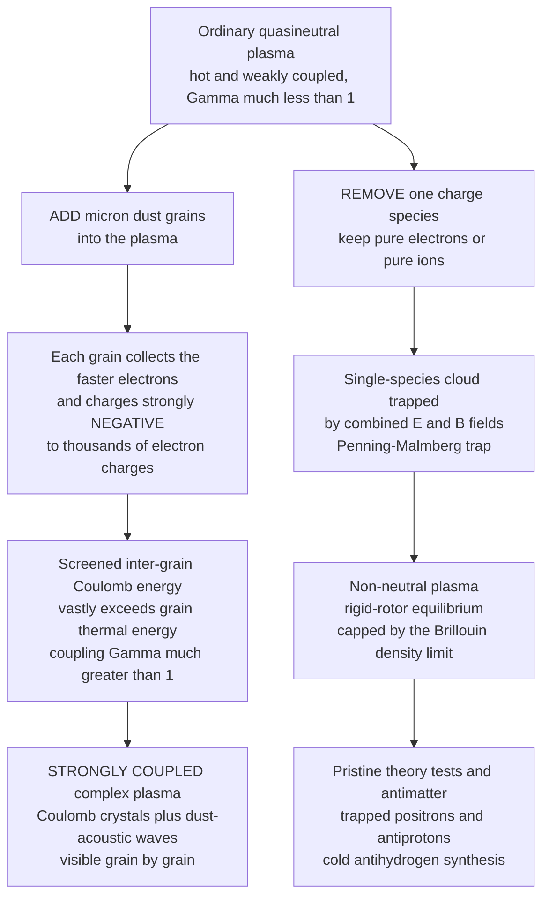

# ✨ Dusty and Non-Neutral Plasmas

> [!abstract] TL;DR
> Two "edge case" plasma regimes reveal plasma physics in unusually **visible** and **pure** forms. In a **dusty (complex) plasma**, micron-sized solid grains immersed in a plasma each rapidly collect the faster electrons and charge **strongly negative** (thousands of electron charges); because the inter-grain Coulomb energy dwarfs their thermal energy, the grains become **strongly coupled** (coupling parameter $\Gamma \gg 1$, opposite to ordinary plasmas with $\Gamma \ll 1$) and undergo real **phase transitions** — freezing into ordered **plasma crystals** large and slow enough to film grain by grain, plus new modes like the **dust-acoustic wave** you can watch with the naked eye. In a **non-neutral plasma**, a cloud of essentially a **single charge species** (pure electrons or pure ions) is bottled for hours in combined electric and magnetic fields (a **Penning-Malmberg trap**); it violates quasineutrality yet is a genuine plasma with its own confinement physics (the **Brillouin limit**, rigid-rotor equilibrium), and it is the pristine testbed behind precision theory checks and **antimatter** work — trapped positrons, antiprotons, and cold antihydrogen.

## Intuition — analogy FIRST

Drop grains of dust into a plasma and something wonderful happens. Each speck greedily soaks up electrons until it carries a big negative charge, and suddenly these charged grains push on one another like **tiny planets** — arranging themselves into floating, shimmering **crystals** you can watch, grain by grain, under a microscope. It is a plasma you can see in **slow motion with your own eyes**: melting, freezing, defects, sound waves, all playing out at the scale of single particles rather than hidden in an atomic blur.

Now go to the opposite extreme. Take a cloud of **pure electrons** with no ions to neutralize it. Ordinary intuition says it should blow itself apart instantly — and it would, except that magnetic and electric fields can **bottle it for hours**, a pristine one-species plasma perfect for testing the deepest theory and for holding the rarest stuff of all, **antimatter**. Between the greedy dust that makes plasma *visible* and the lonely electron cloud that makes plasma *pure*, these two regimes stretch the very meaning of the word "plasma" beyond the hot, quasineutral norm.

---

## How It Works

### Core mechanics

**Dusty (complex) plasmas.**
1. **Insert dust.** Micron-scale solid grains (silica, melamine, ice, soot) sit in an ordinary low-temperature plasma of electrons and ions.
2. **Grains charge negative.** Electrons are far lighter and faster than ions, so they hit each grain more often. The grain charges **negative** until its potential repels enough further electrons to balance the ion flux — reaching a floating charge of $Q = Z_d e$ with $Z_d \sim 10^3$–$10^4$ electrons for a micron grain.
3. **Screened repulsion.** Each grain's field is Debye-screened by the surrounding plasma, so grains interact through a **Yukawa (screened-Coulomb)** potential $\propto \tfrac{1}{r}e^{-r/\lambda_D}$ — the same shielding physics of ordinary plasma parameters, now acting *between* the macro-particles.
4. **Strong coupling.** Because $Q$ is enormous ($\Gamma \propto Q^2$) while the grains are nearly cold, the Coulomb energy between neighbors **vastly exceeds** their thermal energy: $\Gamma = Q^2/(4\pi\epsilon_0 a\,k_BT) \gg 1$. This is the reverse of ordinary weakly coupled plasmas ($\Gamma \ll 1$).
5. **Phase transitions and crystals.** Strongly coupled matter behaves like a **liquid or a solid**. Above a critical $\Gamma$ the grains freeze into an ordered **Coulomb / plasma crystal** — and new collective modes appear, notably the low-frequency **dust-acoustic wave**, slow enough to be seen unaided.

**Non-neutral plasmas.**
1. **Remove a species.** Keep essentially one sign of charge — pure electrons (or pure ions, or positrons). Space charge now creates a huge unbalanced field.
2. **Trap it in fields.** A **Penning-Malmberg trap** confines the cloud radially with a strong axial magnetic field and axially with electrostatic end plugs.
3. **Rigid-rotor equilibrium.** In thermal equilibrium the whole cloud rotates as a rigid body; the density is roughly uniform up to a sharp edge, capped by the **Brillouin density limit** set by the magnetic field.
4. **Pristine and long-lived.** With no oppositely charged species to drive many instabilities, such plasmas can be held for **hours to days**, giving the cleanest possible tests of plasma theory — and a way to accumulate and cool **antimatter**.



---

## Key Concepts / Details

### Secondary Level

- **Dusty plasma = plasma plus solid dust.** Each grain grabs electrons and turns strongly **negative**, so the grains repel each other like a swarm of charged marbles.
- **You can watch it.** The grains are big and slow, so a camera sees single particles — the plasma freezes into a floating **crystal**, melts, and carries slow **sound waves** you can see by eye.
- **Strong coupling.** In a normal plasma the particles are too hot and fast to hold formation ($\Gamma \ll 1$); dust grains are cold and hugely charged, so they lock into place ($\Gamma \gg 1$).
- **Non-neutral plasma = only one kind of charge.** A cloud of pure electrons, held in place by magnets and electric plates, that can be stored for hours — used to trap **antimatter**.

### Undergraduate Level

**Grain charging (orbit-motion-limited).** A grain floats to the potential $\phi_g$ where electron and ion currents balance. Equating OML currents gives the floating charge; for hydrogen-like plasmas the grain sits a few $k_BT_e/e$ **negative**, and its charge scales with radius, $Z_d \approx \dfrac{4\pi\epsilon_0 a_d\,k_BT_e}{e^2}\,\times O(1)$ — roughly a few thousand electrons per micron of radius. The charge is **not fixed**: it fluctuates and depends on local plasma conditions.

**Coupling parameter.** With grain density $n_d$, Wigner-Seitz spacing $a=(3/4\pi n_d)^{1/3}$, and grain kinetic temperature $T_d$,
$$\Gamma = \frac{Q^2}{4\pi\epsilon_0\,a\,k_BT_d}\,e^{-a/\lambda_D}, \qquad Q = Z_d e.$$
Because $\Gamma \propto Q^2 \propto Z_d^2$ and $Z_d\sim10^3$–$10^4$, dusty plasmas reach $\Gamma$ of hundreds to thousands — deep in the **liquid/solid** regime. For the one-component (Yukawa) plasma, freezing occurs near $\Gamma \approx 172$ (screening shifts the exact threshold).

**New waves.** The heavy, charged grains support a low-frequency acoustic mode, the **dust-acoustic wave (DAW)**, with phase speed $C_{DA}\sim\sqrt{Z_d^2 n_d k_B T_i/(n_i m_d)}$ of order cm/s — slow enough to be **imaged directly**. Confined 1-D grain chains support **dust-lattice waves** (a plasma analog of phonons).

**Non-neutral confinement.** In a Penning-Malmberg trap the radial force balance between the space-charge field, the $\mathbf{E}\times\mathbf{B}$ drift, and the centrifugal term forces the cloud into **rigid rotation** at frequency $\omega_r$. The maximum confinable density (the **Brillouin limit**) is
$$n_{\max} = \frac{\epsilon_0 B^2}{2 m},$$
reached when the rotation carries half the cyclotron frequency.

### Graduate Level

- **Yukawa one-component plasma (Yukawa OCP).** Dusty crystals are the laboratory realization of the screened OCP, parameterized by $(\Gamma,\ \kappa=a/\lambda_D)$. Its phase diagram (fluid, bcc, fcc) is a benchmark for classical strongly coupled matter, connecting directly to **warm dense matter**, white-dwarf and neutron-star crust interiors, and laser-cooled ion crystals.
- **Kinetic-level condensed matter.** Because the dynamics are slow and the particles individually visible, complex plasmas give **single-particle-resolved** movies of crystallization, melting, shear flow, dislocation glide, and even the propagation of the melting front — data inaccessible in atomic solids. This makes them a unique **model system** for statistical mechanics and non-equilibrium self-organization.
- **Non-neutral thermal equilibrium.** A single-species plasma reaches a **global thermal equilibrium** (unusual for plasmas): a rigidly rotating, uniform-density spheroid described by a Boltzmann distribution in the co-rotating frame — the cleanest confirmation of equilibrium statistical mechanics in a plasma. Laser-cooled single-species ion clouds crystallize into **Coulomb crystals** at $\Gamma \gtrsim 172$, the strongly coupled limit of the same physics as dusty plasmas.
- **Antimatter engineering.** Non-neutral traps accumulate positrons (from radioactive sources or LINAC pair production) and antiprotons (from decelerators), sympathetically cool them, and **mix** them to synthesize cold antihydrogen (ALPHA, ATRAP, ASACUSA at CERN) for CPT and gravity tests. The rotating-wall technique and mode diagnostics that make this possible are pure non-neutral plasma physics.
- **Dust in fusion.** Eroded wall material forms dust in tokamaks — a tritium-retention and safety concern rather than a benefit, and an active diagnostics/mitigation problem for ITER-class devices.

---

## Python Demo

```python
# Dusty plasmas as STRONGLY COUPLED matter you can see.
# (a) COULOMB CRYSTAL: relax many equally (negatively) charged, Yukawa-repelling
#     grains in a parabolic trap by overdamped gradient descent (energy minimization)
#     -> they settle into an ordered shell / hexagonal lattice: a visible plasma crystal.
# (b) COUPLING PARAMETER: map Gamma = (charge energy)/(thermal energy) over the
#     dust density-temperature plane and draw the Gamma ~ 1 (gas/liquid) and
#     Gamma ~ 172 (crystallization) boundaries -> dusty plasmas live at Gamma >> 1,
#     unlike ordinary weakly coupled plasmas where Gamma << 1.
import numpy as np
import matplotlib.pyplot as plt

rng = np.random.default_rng(7)

# ============================================================
# (a) Relax a 2D dust cloud into a Coulomb crystal
# ============================================================
N     = 80        # number of dust grains
kappa = 0.6       # inverse screening length a/lambda_D (Yukawa), reduced units
Ktrap = 1.0       # parabolic confinement stiffness
A     = 1.0       # grain-grain repulsion strength ~ Q^2/(4 pi eps0)
soft  = 1e-3      # softening to keep forces finite when grains get close

pos = rng.normal(0.0, 2.0, size=(N, 2))   # start from a random blob

def forces(p):
    F = -Ktrap * p                                   # parabolic trap pulls inward
    d  = p[:, None, :] - p[None, :, :]               # (N,N,2) pairwise separations
    r2 = np.sum(d*d, axis=-1) + soft
    r  = np.sqrt(r2)
    # Yukawa (screened-Coulomb) repulsion magnitude: A*exp(-kappa r)*(1/r^2 + kappa/r)
    fmag = A * np.exp(-kappa*r) * (1.0/r2 + kappa/r)
    np.fill_diagonal(fmag, 0.0)                       # no self-force
    Fpair = (fmag / r)[..., None] * d                # push away from each neighbour
    return F + np.sum(Fpair, axis=1)

dt = 0.02
for _ in range(6000):                                # overdamped "cooling" = minimize energy
    disp = dt * forces(pos)
    m = np.max(np.linalg.norm(disp, axis=1))         # limit step for stability
    if m > 0.1:
        disp *= 0.1 / m
    pos += disp
pos -= pos.mean(axis=0)                               # center the crystal

radius = np.linalg.norm(pos, axis=1)

# ============================================================
# (b) Coupling parameter Gamma across the dust n-T plane
# ============================================================
eps0 = 8.8541878128e-12
e    = 1.602176634e-19
Zd   = 3000.0                 # grain charge in electrons (micron dust): Q = Zd*e
Q    = Zd * e

n_dust = np.logspace(8, 12, 300)     # grain density [m^-3]
T_dust = np.logspace(-2, 1, 300)     # grain kinetic temperature [eV]
Nn, Tt = np.meshgrid(n_dust, T_dust)

a_ws  = (3.0/(4.0*np.pi*Nn))**(1.0/3.0)              # Wigner-Seitz spacing [m]
kT    = Tt * e
Gamma = Q**2 / (4.0*np.pi*eps0 * a_ws * kT)          # unscreened Coulomb coupling

# ------------------------------------------------------------
fig, ax = plt.subplots(1, 2, figsize=(14, 6))

# Panel (a): the relaxed plasma crystal
sc = ax[0].scatter(pos[:, 0], pos[:, 1], c=radius, s=140,
                   cmap="viridis", edgecolor="k", linewidth=0.6)
ax[0].set_aspect("equal")
ax[0].set_title("(a) Relaxed Coulomb / plasma crystal\n"
                f"{N} charged grains -> ordered shells")
ax[0].set_xlabel("x  (reduced units)"); ax[0].set_ylabel("y  (reduced units)")
fig.colorbar(sc, ax=ax[0], label="distance from trap center")

# Panel (b): coupling-parameter phase boundary
pcm = ax[1].pcolormesh(Nn, Tt, np.log10(Gamma), shading="auto", cmap="magma")
c1 = ax[1].contour(Nn, Tt, Gamma, levels=[1.0],   colors="cyan",  linewidths=2)
c2 = ax[1].contour(Nn, Tt, Gamma, levels=[172.0], colors="white", linewidths=2)
ax[1].clabel(c1, fmt="Gamma = 1  (gas/liquid)",  fontsize=8)
ax[1].clabel(c2, fmt="Gamma = 172  (freezing)",  fontsize=8)
ax[1].set_xscale("log"); ax[1].set_yscale("log")
ax[1].set_xlabel("dust density n_d  [m^-3]")
ax[1].set_ylabel("dust temperature T_d  [eV]")
ax[1].set_title("(b) Coupling parameter Gamma (Zd = 3000 e)\n"
                "dusty plasmas sit at Gamma >> 1  (strongly coupled)")
fig.colorbar(pcm, ax=ax[1], label="log10 Gamma")
# a typical dusty-plasma operating point (room-temperature grains)
ax[1].plot(1e11, 0.025, "o", color="lime", ms=12, mec="k")
ax[1].annotate("typical dusty plasma", (1e11, 0.025),
               textcoords="offset points", xytext=(-40, 14), color="lime")

plt.tight_layout()
plt.savefig("dusty_and_nonneutral_plasmas.png", dpi=130)
plt.show()

# --- sanity checks ---
G_typ = Q**2 / (4*np.pi*eps0 * (3/(4*np.pi*1e11))**(1/3) * (0.025*e))
print(f"grain charge Q      = {Zd:.0f} e")
print(f"typical Gamma point = {G_typ:.1f}  (>> 1 -> liquid/crystal)")
print(f"ordinary plasma     Gamma ~ 1e-3   (<< 1 -> weakly coupled gas)")
print(f"crystal shells: r range = [{radius.min():.2f}, {radius.max():.2f}]")
# typical Gamma ~ 3e3 : deep in the crystalline regime, opposite of ordinary plasmas
```

**What you see:** Panel (a) starts as a random blob and, under pure energy minimization, settles into concentric **shells** — a floating **Coulomb crystal**, exactly what dusty-plasma cameras record. Panel (b) maps the coupling parameter $\Gamma$: the cyan line ($\Gamma=1$) separates weakly coupled gas from strongly coupled liquid, and the white line ($\Gamma\approx172$) marks **freezing**. The green marker — room-temperature micron grains at modest density — lands at $\Gamma\sim10^3$, far into the crystalline regime, the **opposite corner** from ordinary plasmas ($\Gamma\ll1$).

---

## Real-World Applications

- **Tabletop condensed-matter physics.** Complex-plasma experiments (PK-3 Plus and PK-4 on the ISS, GEC reference cells) film crystallization, melting, dislocation motion, shear flow, and phase transitions at the **single-particle level** — a microscope onto statistical mechanics.
- **Semiconductor manufacturing.** In plasma etching and deposition, unwanted particulates grow, charge, and levitate in the sheath as a dusty plasma — a **contamination** problem that motivated much of the field.
- **Fusion devices.** Wall erosion produces dust in tokamaks; because it charges and retains tritium, it is a **safety and diagnostics** concern for ITER, not a benefit.
- **Space and planetary science.** Dusty plasmas are ubiquitous: **Saturn's rings** and spokes, **comet tails**, **noctilucent clouds** in the mesosphere, the **zodiacal light**, **lunar dust levitation** at the terminator, and **protoplanetary disks** where charged grains coagulate toward **planet formation**.
- **Antimatter and precision science.** Non-neutral traps hold pure electron, ion, and positron plasmas for **antihydrogen** synthesis (ALPHA, ATRAP), CPT-symmetry and antimatter-gravity tests, positron accumulation for materials science, and precision mass/g-factor measurements.
- **Strongly coupled and quantum platforms.** Laser-cooled single-species ion **Coulomb crystals** in traps underpin optical clocks and trapped-ion quantum computing — the crystalline limit of non-neutral plasma physics.

---

## Common Pitfalls

- **Assuming grains charge positive.** Grains charge **negative** because electrons are lighter and faster and thus strike the grain more often; the grain floats negative until it repels the excess electron flux. Positive charging happens only in special cases (strong UV photoemission, secondary emission, hot filaments).
- **Treating dusty plasmas as weakly coupled.** The huge grain charge ($\Gamma\propto Q^2$, $Z_d\sim10^3$–$10^4$) drives $\Gamma\gg1$, so dusty plasmas are **liquids and crystals**, the reverse of ordinary plasmas ($\Gamma\ll1$). Applying ideal-gas/collisionless intuition gives nonsense.
- **Missing the new waves.** Adding a heavy charged species creates genuinely new modes — the **dust-acoustic** and **dust-lattice** waves — with cm/s speeds **visible to the eye**; these are absent from electron-ion dispersion relations.
- **Assuming a non-neutral plasma cannot be confined.** A single-species cloud is not quasineutral, yet magnetic + electric fields (a **Penning-Malmberg trap**) hold it for hours as a rigidly rotating equilibrium — but only up to the **Brillouin density limit** $n_{\max}=\epsilon_0 B^2/2m$; push past it and confinement fails.
- **Forgetting charge fluctuates.** A grain's charge $Z_d$ is set self-consistently by local currents and **fluctuates** in time and space; treating it as a fixed constant misses charging-driven instabilities and heating.
- **Overlooking the model-system value (and the fusion hazard).** Dusty plasmas are simultaneously a **beautiful model** for phase transitions and self-organization *and* a **contaminant** in etching tools and fusion reactors — the same physics, opposite significance depending on context.

---

## Related Concepts

- [[Electric_Fields_and_Coulombs_Law]] — the bare inter-grain Coulomb repulsion (Debye-screened into a Yukawa force) that drives crystallization and confines non-neutral clouds.
- [[Classical_Statistical_Mechanics]] — the coupling parameter $\Gamma$ is a ratio of potential to thermal energy; strong coupling is where the ideal-gas partition function fails and correlations dominate.
- [[Phase_Transitions_and_Critical_Phenomena]] — dusty plasmas undergo real freezing/melting transitions, imaged at the single-particle level as a visible laboratory model.
- [[Crystal_Systems_and_Space_Groups]] — plasma crystals form ordered bcc/fcc/hexagonal lattices, the same symmetry classification as atomic solids but grain-resolved.
- [[Defects_and_Dislocations_in_Crystals]] — complex plasmas let you *watch* dislocation glide, grain boundaries, and defect dynamics one particle at a time.
- [[Emergence_and_Self_Organization]] — the crystal is a self-organized ordered state emerging from many identical repelling grains, a clean physical instance of emergence.
- [[Laser_Cooling_and_Trapping]] — laser-cooled single-species ion Coulomb crystals are the strongly coupled limit of non-neutral plasmas, sharing the same $\Gamma\gtrsim172$ freezing physics.
- [[Formation_of_the_Solar_System]] — charged dust in protoplanetary disks coagulates toward planetesimals; dusty-plasma physics touches planet formation.
- [[Small_Bodies_Asteroids_Comets_and_KBOs]] — comet dust tails and ring particles are natural space dusty plasmas shaped by grain charging and radiation.

---

## Review Questions

**Secondary.** Why does a dust grain in a plasma end up **negatively** charged, and what remarkable thing lets us watch a dusty plasma "freeze" that we cannot do with an ordinary gas of atoms?

**Undergraduate.** Define the coupling parameter $\Gamma$ and explain, using the fact that a micron grain carries $Z_d\sim10^3$–$10^4$ electrons, why dusty plasmas reach $\Gamma\gg1$ while ordinary electron-ion plasmas sit at $\Gamma\ll1$. What phase does $\Gamma\approx172$ mark? Separately, write the Brillouin density limit and say what sets it.

**Graduate.** A non-neutral pure-electron plasma reaches a global thermal-equilibrium rigid-rotor state — unusual for a plasma. Explain why single-species confinement enables this and why it makes non-neutral plasmas ideal for precision theory tests and antimatter accumulation. Then contrast the strongly coupled crystalline state of a dusty plasma with that of a laser-cooled ion Coulomb crystal: what physics do they share, and how do the charge and length scales differ?

---

## Sources

- Shukla, P. K. & Mamun, A. A. *Introduction to Dusty Plasma Physics* (IOP, 2002) — grain charging, dust-acoustic and dust-lattice waves, strong coupling and crystallization.
- Morfill, G. E. & Ivlev, A. V. "Complex plasmas: An interdisciplinary research field," *Rev. Mod. Phys.* **81**, 1353 (2009) — plasma crystals as single-particle-resolved condensed-matter model systems.
- Fortov, V. E. et al. "Complex (dusty) plasmas: Current status, open issues, perspectives," *Phys. Rep.* **421**, 1 (2005) — comprehensive review of dusty-plasma phases, waves, and space/lab occurrences.
- Davidson, R. C. *Physics of Nonneutral Plasmas* (Imperial College Press, 2001) — rigid-rotor equilibria, Brillouin limit, and confinement of single-species plasmas.
- Dubin, D. H. E. & O'Neil, T. M. "Trapped nonneutral plasmas, liquids, and crystals (the thermal equilibrium states)," *Rev. Mod. Phys.* **71**, 87 (1999) — Penning-Malmberg traps, thermal equilibrium, and Coulomb crystals.

---

#plasma-physics #dusty-plasma #complex-plasma #coulomb-crystal #non-neutral-plasma
