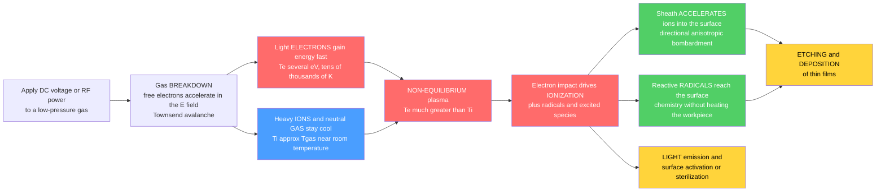

# 💡 Low-Temperature and Industrial Plasmas

> [!abstract] TL;DR
> Not every plasma is star-hot. In a **low-temperature (non-equilibrium) plasma**, a modest electric field heats only the light **electrons** to several eV (tens of thousands of kelvin), while the massive **ions and neutral gas stay near room temperature** — so the hot electrons drive rich **ionization and chemistry** (radicals, excited species, reactive fragments) *without melting the workpiece*. This is the physics of every fluorescent tube, neon sign, and — economically far more important — the **plasma etching and deposition** that carves every microchip. Discharges are struck by **gas breakdown** (the U-shaped **Paschen curve** of breakdown voltage vs. pressure-times-gap) in DC glow, RF (CCP/ICP), microwave/ECR, or atmospheric-pressure (DBD, jets) sources; the **sheath** then accelerates ions straight down onto the surface, giving the **directional (anisotropic) etching** that is the backbone of Moore's law. Low-temperature plasma is not a curiosity — it is a multi-hundred-billion-dollar technology hiding in plain sight.

## Intuition — analogy FIRST

Not all plasmas are star-hot. The glow in a fluorescent tube, a neon sign, or an old plasma TV is a plasma cool enough to touch the glass, yet it quietly runs the modern world. Every microchip in your phone was carved by plasma: a low-temperature plasma etches features thinner than a virus with atomic precision, because its ions can be steered straight down onto the silicon like a **sandblaster of single atoms**. These "cold" plasmas — where the electrons are blazing hot but the gas stays near room temperature — are a technology you meet every day without knowing it.

The trick is a **mismatch of masses**. An electron is thousands of times lighter than an ion, so an electric field flings electrons to high energy almost instantly, while the heavy ions and neutral gas barely notice. And because a light electron transfers only a tiny slice of its energy in each elastic collision with a heavy atom (like a ping-pong ball bouncing off a bowling ball), the electrons stay **hot** while the gas stays **cool**. The result is a strange, useful state: a gas that is chemically on fire — full of ionization and reactive radicals — yet cold enough to hold in your hand.

---

## How It Works

Apply a voltage or RF power to a low-pressure gas; free electrons run away hot while the heavy species stay cool (**non-equilibrium**); the hot electrons ionize and dissociate the gas into ions, radicals, and excited species; and those reactive fragments — plus ions steered by the sheath — do the etching, deposition, light emission, or surface treatment.



---

## Key Concepts / Details

### Secondary Level

**"Cold" means the gas is cold, not the electrons.** In a low-temperature plasma the *electrons* are ferociously hot — a few electron-volts, equivalent to tens of thousands of degrees — but there are relatively few of them and they are almost weightless. The *ions and neutral atoms*, which carry essentially all the mass and heat capacity, stay near room temperature. So the tube glows and does chemistry, yet the glass barely warms. This is why you can hold a fluorescent lamp.

**Where you already meet it.** The pink-orange glow of a **neon sign**, the ultraviolet-then-white light of a **fluorescent tube**, the little cells of an old **plasma television**, the purple flicker of a **plasma ball** toy — all are low-temperature plasmas. The hidden giant is **microchip manufacturing**: the patterns on every processor and memory chip are cut into silicon by plasma etching. This is by far the biggest use, worth tens of billions of dollars a year.

**How you start one.** Pump most of the air out of a tube, apply a high enough voltage across it, and at some point the gas suddenly "breaks down" — it becomes conducting and lights up. The voltage needed depends on the pressure and the gap: too much gas or too little both make it harder to strike. There is a sweet spot in between where it lights up most easily (the **Paschen minimum**).

### Undergraduate Level

**Non-equilibrium: two temperatures in one gas.** In steady state each electron gains energy from the electric field between collisions and loses energy in collisions. But in an *elastic* collision with a heavy atom of mass $M$, an electron of mass $m$ transfers only a fraction $\sim 2m/M \sim 10^{-4}$–$10^{-5}$ of its energy — a ping-pong ball off a bowling ball. At **low pressure** collisions are rare, so electrons run away to high energy ($T_e \sim 1$–$5$ eV) while the heavy species barely heat up ($T_i \approx T_g \sim 300$–$500$ K). The plasma is **non-equilibrium**: $T_e \gg T_i \approx T_g$. Raise the pressure (or current) enough and collisions finally couple the species: everything equilibrates to a single high temperature and you get a **thermal (equilibrium) plasma** — an arc, a torch, or plasma spray, where $T_e \approx T_i \approx T_g \sim 10^4$ K and things melt.

**Weakly ionized.** Low-temperature discharges are only faintly ionized — the ionization fraction $n_e/n_g$ is typically $10^{-6}$ to $10^{-3}$. Neutral gas dominates the dynamics; electron–neutral collisions, not Coulomb collisions, set the transport.

**Gas breakdown and the Paschen curve.** A discharge ignites by a **Townsend avalanche**: a seed electron drifting in the field ionizes atoms, each new electron ionizes more, and ions striking the cathode liberate **secondary electrons** (yield $\gamma$). Self-sustained breakdown requires each avalanche to regenerate one starter electron, $\gamma\,(e^{\alpha d}-1)=1$, where $\alpha$ is the first Townsend (ionization) coefficient. Because $\alpha/p$ and the drift both scale with the reduced field $E/p$, the breakdown voltage depends only on the product $pd$ (pressure × gap):
$$V_b = \frac{B\,(pd)}{\ln\!\big(A\,pd\big) - \ln\!\big[\ln(1+1/\gamma)\big]}.$$
This is the **Paschen law** — a U-shaped curve with a **minimum** at a particular $pd$. To the left (low $pd$) there are too few atoms to avalanche; to the right (high $pd$) electrons collide too often to gain ionizing energy. The minimum is why every glow discharge, sputtering tool, and neon sign is run near a favorable pressure-gap product.

**Families of sources.**
- **DC glow discharge** — steady voltage between electrodes; the classic structure of cathode dark space, negative glow, positive column. Simple but the electrodes are in contact with the plasma.
- **RF capacitively coupled (CCP)** — RF voltage across parallel plates; large oscillating sheaths set high ion energies. Workhorse for **anisotropic etching**.
- **RF inductively coupled (ICP)** — an antenna coil induces the current; produces **high density at low sheath voltage**, decoupling ion *flux* from ion *energy*.
- **Microwave / ECR** — 2.45 GHz power, often at electron-cyclotron resonance, for high-density, low-pressure plasmas.
- **Atmospheric-pressure** — **dielectric-barrier discharges (DBD)**, **plasma jets**, and **coronas** run in open air (no vacuum) and power ozone generators, surface treatment, and plasma medicine.

**The sheath sets ion energy and direction.** Every surface in contact with the plasma is covered by a thin **sheath** (see the sibling note *Plasma_Sheaths_and_Boundary_Layers*). Its electric field points *into* the surface, so ions cross it on nearly straight, perpendicular trajectories. This is the origin of **anisotropic (directional) etching**: ions carve deep vertical trenches because the sheath fires them straight down, while the neutral **radicals** supply the reactive chemistry that removes material. Etch *anisotropy* is a physical, ion-driven effect; etch *rate and selectivity* are largely radical chemistry.

### Graduate Level

**The electron energy distribution function (EEDF).** Rate coefficients for ionization, dissociation, and excitation are averages $k=\langle \sigma v\rangle$ over the EEDF, which is generally **non-Maxwellian** (e.g. Druyvesteyn) and controlled by the reduced field $E/N$. A small shift in the EEDF tail changes ionization and dissociation rates by orders of magnitude, so process control ultimately means EEDF control. Solving the electron Boltzmann equation (e.g. two-term / BOLSIG+ style) yields transport and rate coefficients versus $E/N$.

**CCP vs. ICP and independent control.** In a **CCP**, the same RF drives both the plasma and the sheath, so ion flux and ion bombardment energy are coupled; **dual-frequency** reactors decouple them (high frequency sets density/flux, low frequency sets sheath energy). In an **ICP**, the coil sustains a high-density plasma at a low intrinsic sheath voltage, and an *independent* RF bias on the wafer electrode sets the ion energy — the modern architecture for precise etching. The RF sheath is **ion-inertia-limited**: heavy ions respond only to the *time-averaged* field and cross a rectified DC self-bias, which sets the **ion energy distribution (IEDF)** at the wafer.

**Etch mechanisms.** The Coburn–Winters experiments established **ion-enhanced (ion-assisted) etching**: radicals plus ion bombardment together etch far faster than either alone — chemical sputtering. Practical processes exploit this: the **Bosch process** alternates etch and passivation for deep silicon vias; **atomic layer etching (ALE)** separates a self-limiting surface modification from a self-limiting removal for Ångström-level control; **aspect-ratio-dependent etching (ARDE)** and **charging-induced notching** are the hard, feature-scale limits. **PECVD** deposits films (SiO₂, SiN, amorphous Si) at low substrate temperature because electron-impact dissociation, not heat, supplies the reactive precursors.

**Sputtering and PVD.** In **magnetron sputtering**, ions accelerated across the cathode sheath eject target atoms that condense as a thin film; a magnetic trap raises ionization efficiency near the target. Reactive sputtering adds a gas (O₂, N₂) to grow oxides/nitrides for hard and optical coatings.

**Atmospheric-pressure physics.** At high $pd$, breakdown leaves the Townsend regime for **streamer (Meek) breakdown**: space-charge fields from a single avalanche trigger a fast-propagating ionization front. **DBDs** use a dielectric to quench the current into many short-lived **microdischarges**, preventing arcing and keeping the gas cold — the basis of ozone generation and **cold atmospheric plasma (CAP)** for biomedicine, where reactive oxygen and nitrogen species (RONS) do the biological work.

**Non-thermal vs. thermal, quantitatively.** The degree of non-equilibrium $T_e/T_g$ falls as pressure rises; near atmospheric pressure keeping a plasma non-thermal requires pulsing, dielectric barriers, or fast gas flow to prevent the glow-to-arc transition. Thermal plasmas (arc welders, plasma cutters, plasma spray, plasma torches for waste destruction) live at the opposite, fully equilibrated end of the same physics.

---

## Python Demo

```python
# Low-temperature (non-equilibrium) plasmas: the two defining pictures.
# (a) TWO-TEMPERATURE / NON-THERMAL: electrons are hot (few eV, ~10^4-10^5 K) while
#     ions and the neutral gas stay near room temperature -> "cold" plasma, no melting.
#     Contrast with a THERMAL (arc/torch) plasma where all species share one high T.
# (b) PASCHEN CURVE: gas breakdown voltage vs pressure*gap (pd), the U-shaped curve
#     with a minimum that explains why any glow discharge / neon sign / sputter tool
#     strikes most easily at a particular pd.
import numpy as np
import matplotlib.pyplot as plt

eV_to_K = 11604.5  # 1 eV in kelvin

# ---------------------------------------------------------------------------
# (a) Two-temperature bars: a non-thermal (cold) plasma vs a thermal plasma
# ---------------------------------------------------------------------------
species = ["electrons", "ions", "neutral gas"]
Te_cold = np.array([3.0, 0.03, 0.026])          # eV: hot electrons, cool ions/gas
Te_hot  = np.array([1.0, 0.95, 0.90])           # eV: near-equilibrium arc/torch
Tk_cold = Te_cold * eV_to_K                       # kelvin
Tk_hot  = Te_hot  * eV_to_K

# ---------------------------------------------------------------------------
# (b) Paschen law: V_b = B*pd / ( ln(A*pd) - ln(ln(1 + 1/gamma)) )
#     A [1/(Torr*cm)], B [V/(Torr*cm)] are gas constants; gamma = 2nd-emission yield.
# ---------------------------------------------------------------------------
def paschen(pd, A, B, gamma):
    K = np.log(1.0 + 1.0/gamma)
    denom = np.log(A*pd) - np.log(K)
    Vb = np.where(denom > 0, B*pd/denom, np.nan)  # no breakdown below the asymptote
    return np.where(Vb > 0, Vb, np.nan)

pd = np.logspace(-1.3, 2.3, 600)                  # Torr*cm
gases = {                                         # (A, B, gamma), textbook values
    "Air":   (15.0, 365.0, 0.01),
    "Argon": (12.0, 180.0, 0.02),
    "Neon":  ( 4.0, 100.0, 0.02),
}
colors = {"Air": "#4a9eff", "Argon": "#ff6b6b", "Neon": "#51cf66"}

# ======================= plotting =========================================
fig, ax = plt.subplots(2, 2, figsize=(13, 9))

# (A) non-thermal plasma: log-scale temperatures show the huge electron-gas gap
x = np.arange(3)
b1 = ax[0,0].bar(x, Tk_cold, color=["#ff6b6b", "#4a9eff", "#748ffc"])
ax[0,0].set_yscale("log")
ax[0,0].axhspan(250, 400, color="#c3fae8", alpha=0.7)          # "room temperature" band
ax[0,0].text(2.4, 330, "room T", fontsize=8, ha="right")
for xi, (Tk, TeV) in enumerate(zip(Tk_cold, Te_cold)):
    ax[0,0].text(xi, Tk*1.3, f"{Tk:,.0f} K\n({TeV:g} eV)", ha="center", fontsize=8)
ax[0,0].set_xticks(x); ax[0,0].set_xticklabels(species)
ax[0,0].set_ylabel("temperature [K]  (log scale)")
ax[0,0].set_ylim(100, 1e6)
ax[0,0].set_title("(a) NON-THERMAL 'cold' plasma:  Te >> Ti approx Tgas")

# (B) contrast: thermal plasma has all species at one high temperature
w = 0.35
ax[0,1].bar(x - w/2, Tk_cold, w, color="#ff922b", label="non-thermal (glow)")
ax[0,1].bar(x + w/2, Tk_hot,  w, color="#495057", label="thermal (arc/torch)")
ax[0,1].set_yscale("log")
ax[0,1].set_xticks(x); ax[0,1].set_xticklabels(species)
ax[0,1].set_ylabel("temperature [K]  (log scale)")
ax[0,1].set_ylim(100, 1e6)
ax[0,1].set_title("(b) Non-thermal vs thermal (equilibrium) plasma")
ax[0,1].legend(fontsize=9)

# (C) Paschen curves for several gases
for g, (A, B, gm) in gases.items():
    Vb = paschen(pd, A, B, gm)
    ax[1,0].plot(pd, Vb, lw=2.4, color=colors[g], label=g)
    imin = np.nanargmin(Vb)
    ax[1,0].plot(pd[imin], Vb[imin], "o", color=colors[g], ms=7)
ax[1,0].set_xscale("log")
ax[1,0].set_xlabel(r"pressure $\times$ gap,  $pd$  [Torr$\cdot$cm]")
ax[1,0].set_ylabel(r"breakdown voltage  $V_b$  [V]")
ax[1,0].set_ylim(0, 1200)
ax[1,0].set_title("(c) Paschen curve: U-shaped breakdown voltage")
ax[1,0].legend(fontsize=9)
ax[1,0].annotate("Paschen\nminimum", xy=(0.9, 330), xytext=(4, 700),
                 fontsize=9, ha="center",
                 arrowprops=dict(arrowstyle="->", color="gray"))

# (D) zoom on the minimum: hard to strike a discharge on either side
Vb_air = paschen(pd, *gases["Air"])
imin = np.nanargmin(Vb_air)
ax[1,1].plot(pd, Vb_air, lw=2.5, color="#4a9eff")
ax[1,1].plot(pd[imin], Vb_air[imin], "o", color="#e8590c", ms=9)
ax[1,1].axvline(pd[imin], color="gray", ls="--", lw=1)
ax[1,1].fill_betweenx([0, 1200], 1e-2, pd[imin], color="#ffe3e3", alpha=0.5)
ax[1,1].fill_betweenx([0, 1200], pd[imin], 1e3,  color="#e7f5ff", alpha=0.5)
ax[1,1].text(0.18, 950, "too few\natoms to\navalanche", fontsize=8, ha="center")
ax[1,1].text(30,   950, "too many\ncollisions,\nno energy gain", fontsize=8, ha="center")
ax[1,1].set_xscale("log")
ax[1,1].set_xlabel(r"$pd$  [Torr$\cdot$cm]")
ax[1,1].set_ylabel(r"$V_b$  [V]  (air)")
ax[1,1].set_ylim(0, 1200); ax[1,1].set_xlim(0.05, 200)
ax[1,1].set_title(f"(d) Easiest breakdown at pd = {pd[imin]:.2f} Torr-cm")

plt.tight_layout()
plt.savefig("low_temperature_plasma.png", dpi=120)

# --- printed diagnostics ---
print(f"Electron T : {Te_cold[0]:g} eV = {Tk_cold[0]:,.0f} K")
print(f"Ion/gas T  : {Te_cold[1]:g} eV = {Tk_cold[1]:,.0f} K (near room temperature)")
print(f"Te / Tgas  : {Tk_cold[0]/Tk_cold[2]:,.0f}  -> strongly NON-equilibrium")
print(f"Air Paschen minimum: Vmin = {Vb_air[imin]:.0f} V  at pd = {pd[imin]:.2f} Torr-cm")
```

**What the plot shows.** Panel (a): on a log temperature scale the electrons tower at $\sim 3\times10^{4}$ K while the ions and neutral gas sit in the room-temperature band near $300$ K — the defining $T_e \gg T_i \approx T_g$ signature that lets these plasmas do chemistry without melting the workpiece. Panel (b): a **thermal** plasma (arc/torch) collapses all three bars onto one high temperature — equilibrium, not the useful cold regime. Panel (c): the classic **Paschen** U-curves for air, argon, and neon, each with a clear minimum-voltage sweet spot in $pd$. Panel (d): a zoom explaining the two branches — too little gas (left) starves the avalanche, too much gas (right) robs electrons of ionizing energy — so discharges strike most easily at the minimum (for air, a few hundred volts near $pd \approx 1\ \mathrm{Torr\,cm}$).

---

## Real-World Applications

- **Semiconductor manufacturing — the single biggest use.** **Plasma (reactive-ion) etching** transfers circuit patterns into silicon, oxide, and metal with the vertical, high-aspect-ratio anisotropy that no wet chemistry can match — the physical enabler of Moore's-law scaling. **PECVD** deposits dielectrics and barriers at low temperature; **plasma ashing** strips photoresist; **atomic layer etching** reaches Ångström control. Etch and deposition tools are the heart of every fab.
- **Sputtering and PVD coatings.** Magnetron plasmas sputter targets to deposit thin films: reflective and low-emissivity coatings on architectural glass, hard TiN/CrN coatings on cutting tools, transparent conductors (ITO) on displays, and metal interconnect layers on chips.
- **Lighting and displays.** Fluorescent lamps (a low-pressure mercury glow producing UV that a phosphor converts to white), neon and other gas-discharge signs, high-intensity-discharge (HID) lamps, and the now-legacy plasma display panel all run on non-thermal glow discharges.
- **Plasma medicine and sterilization.** **Cold atmospheric plasma** jets and DBDs generate reactive oxygen/nitrogen species that inactivate bacteria and biofilms, sterilize heat-sensitive instruments and packaging, and promote wound healing and blood coagulation — all at skin-safe temperatures.
- **Ozone generation and pollution control.** Dielectric-barrier discharges make ozone for water and air treatment; non-thermal plasmas destroy volatile organic compounds and treat diesel exhaust (NOx/soot) and odors.
- **Surface activation and adhesion.** Brief plasma treatment raises the surface energy of polymers, films, and composites so inks, glues, and coatings wet and bond — routine in printing, packaging, and automotive assembly.
- **Materials synthesis and propulsion.** Plasmas grow carbon nanotubes and synthesize nanoparticles; on the thermal end, plasma spray and plasma torches coat and cut. In space, **Hall and gridded-ion thrusters** are low-temperature plasma engines — the same sheath/discharge physics accelerating ions for efficient propulsion (see the applied-plasma siblings in this section).

---

## Common Pitfalls

1. **Assuming "plasma" means "hot."** The defining, enabling property of these plasmas is **non-equilibrium**: $T_e \gg T_i \approx T_g$. Hot electrons drive ionization and chemistry while the gas stays near room temperature. Treating a glow discharge as a hot, single-temperature gas erases exactly what makes it useful (and safe to touch).
2. **Conflating the source types.** **DC glow**, **RF capacitive (CCP)**, **RF inductive (ICP)**, **microwave/ECR**, and **atmospheric-pressure (DBD, jets, corona)** discharges have very different densities, sheath voltages, and control knobs. In particular, CCP couples ion flux and energy while ICP (plus a separate bias) decouples them — a distinction that decides which reactor you use for a given etch.
3. **Forgetting that the sheath sets ion energy and direction.** Etch **anisotropy** (vertical sidewalls) is a *physical*, sheath-driven effect: the sheath field fires ions perpendicular into the surface. Attributing directional etching to chemistry alone — or ignoring the sheath entirely — misdiagnoses every anisotropy or profile problem. (See *Plasma_Sheaths_and_Boundary_Layers*.)
4. **Ignoring the radicals.** Ions get the attention, but neutral **radicals and reactive species** usually carry most of the surface chemistry (etch rate, selectivity, deposition). The best etch processes exploit **ion-enhanced** synergy — radicals plus ion bombardment — not one or the other.
5. **Treating breakdown as pressure-independent.** You cannot strike a discharge at an arbitrary pressure-gap product. The **Paschen curve** has a minimum; far below it (too few atoms) or far above it (too many collisions) the required voltage skyrockets. Vacuum-system and reactor design lives around this curve.
6. **Mixing up thermal and non-thermal plasmas.** Arcs, plasma torches, plasma cutters, and plasma spray are **thermal (equilibrium)** plasmas where every species is hot — the opposite regime from cold processing glows. They share the underlying physics but not the operating point; don't transfer intuitions blindly.
7. **Underrating the field.** Low-temperature plasma is not a laboratory curiosity next to fusion and astrophysics — it is a **pervasive, economically enormous** technology (the semiconductor industry alone) governed by the same sheath, breakdown, and collisional-transport physics as the rest of this vault.

---

## Related Concepts

- [[Semiconductors_Intrinsic_and_Extrinsic]] — the silicon wafers that plasma etching patterns and PECVD coats; low-temperature plasma processing is how doped semiconductor structures become integrated circuits.
- [[Nanofabrication_and_Self_Assembly]] — plasma etching is the dominant *top-down* nanofabrication tool, transferring lithographic patterns into sub-100 nm, high-aspect-ratio features.
- [[Nano_Electronics_and_MEMS_NEMS]] — deep reactive-ion etching (the Bosch process) and PECVD are the enabling steps that carve MEMS/NEMS structures and device layers.
- [[Electric_Fields_and_Coulombs_Law]] — the applied field heats the electrons and, through the sheath, accelerates ions into surfaces; the whole non-equilibrium engine runs on the electric field acting selectively on light charges.
- [[Gauss_Law_and_Electric_Potential]] — gas breakdown, the Townsend avalanche, and space-charge sheaths are Poisson/Gauss problems for the potential set up between the electrodes.
- [[Kinetic_Theory_of_Gases]] — the two-temperature picture rests on kinetic theory: the tiny $\sim 2m/M$ energy transfer per electron–neutral collision is exactly why electrons stay hot while the gas stays cool.
- [[Chemical_Kinetics]] — plasma chemistry is a set of electron-impact and radical reaction rates; process rates are rate coefficients averaged over the electron energy distribution.
- [[Pericyclic_Radical_and_Polymer_Chemistry]] — the reactive **radicals** electrons create by dissociation are the same open-shell species that drive plasma etching, PECVD, and plasma polymerization.

*Foundational siblings (in this vault): this note is the applied counterweight to Plasma_Physics_Overview; the surface interaction is governed by Plasma_Sheaths_and_Boundary_Layers (the sheath sets ion energy and anisotropy); weakly ionized transport and electron–neutral collisions come from Collisions_and_Transport_in_Plasmas; wave heating and RF/microwave coupling connect to Cold_Plasma_Waves_and_Dispersion; and the charged particulates grown or trapped in processing reactors are treated in Dusty_and_Non_Neutral_Plasmas.*

---

## Review Questions

1. **Secondary:** A fluorescent tube glows brightly yet you can hold it in your hand, while a welding arc of the "same" plasma would burn you instantly. Using the idea that electrons are far lighter than atoms, explain why a low-temperature plasma can be chemically active (glowing, ionized) while its gas stays near room temperature, and why an arc is different.
2. **Undergraduate:** Sketch the Paschen curve of breakdown voltage versus $pd$ and explain physically why the voltage rises steeply on *both* sides of the minimum. Then explain how the plasma **sheath** turns the neutral chemistry of a discharge into *anisotropic* (vertical-walled) etching of a silicon wafer — what role do the ions play versus the radicals?
3. **Graduate:** Contrast a capacitively coupled (CCP) and an inductively coupled (ICP) reactor for plasma etching. Why does a CCP couple ion flux and ion bombardment energy, and how do dual-frequency CCP or ICP-plus-bias architectures decouple them? Frame your answer in terms of the electron energy distribution function, the RF sheath and the ion energy distribution (IEDF), and the ion-enhanced etch mechanism.

---

## Sources

- Lieberman, M. A. & Lichtenberg, A. J. — *Principles of Plasma Discharges and Materials Processing* (2nd ed., Wiley) — the standard reference on discharge physics, sheaths, CCP/ICP reactors, and etching/deposition.
- Chabert, P. & Braithwaite, N. — *Physics of Radio-Frequency Plasmas* (Cambridge University Press) — RF sheath dynamics, CCP/ICP power coupling, and processing plasmas.
- Fridman, A. — *Plasma Chemistry* (Cambridge University Press) — non-equilibrium plasma chemistry, radicals, atmospheric-pressure discharges, and applications.
- Roth, J. R. — *Industrial Plasma Engineering* (Vols. 1–2, IOP Publishing) — breakdown/Paschen, glow discharges, and the breadth of industrial plasma technology.
- Makabe, T. & Petrović, Z. Lj. — *Plasma Electronics: Applications in Microelectronic Device Fabrication* (CRC Press) — EEDF/Boltzmann modeling and semiconductor process plasmas.

#plasma-physics #low-temperature-plasma #plasma-processing #semiconductor-etching #glow-discharge
