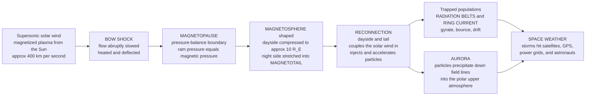

# 🌍 Space Plasma Physics and the Magnetosphere

> [!abstract] TL;DR
> **Space is not empty — it is a vast, tenuous plasma, and Earth swims through it inside a magnetic bubble carved out of the solar wind.** The supersonic solar wind slams into Earth's dipole field and is abruptly slowed at a **bow shock**; the **magnetopause** marks where the two pressures balance, compressing the field to about **ten Earth radii** on the dayside while stretching it into a vast **magnetotail** on the night side. Inside this cavity, charged particles are **trapped** — executing the three periodic motions of single-particle theory (fast **gyration**, **bounce** between magnetic mirror points, and slow azimuthal **drift**) that fill the **Van Allen radiation belts** and drive the **ring current**. **Magnetic reconnection** at the dayside and in the tail couples the solar wind to the magnetosphere, powering the **substorm** cycle, injecting and accelerating particles, and lighting the **aurora**. When the Sun hurls a **coronal mass ejection** at us, the whole shield rattles: a **geomagnetic storm** compresses the magnetopause, energizes the belts, and induces currents that damage **satellites, GPS, power grids, and communications** and endanger **astronauts**. The same physics explains why Earth kept its atmosphere while Mars, its dynamo long dead, did not. This note opens the section on space, astrophysical, and applied plasmas — the universe as a plasma laboratory, with Earth's magnetic bubble as the nearest experiment.

---

## Intuition

**Analogy:** Earth sails through space inside an invisible magnetic **force field**, like a boat pushing a **bow wave** through a river of charged particles streaming off the Sun. The magnetosphere deflects most of that solar wind *around* us — the reason Earth kept its atmosphere and Mars didn't — but where it leaks in near the poles it paints the sky with **auroras**. And when the Sun hurls a storm at us, it can **rattle the whole shield**, knocking out satellites and power grids.

The boat's bow wave is the **bow shock**; the hull that the water cannot cross is the **magnetopause**; the long wake trailing behind is the **magnetotail**. Push the boat harder — a faster, denser river during a solar storm — and the bow wave crowds *in* toward the hull, squeezing the whole protective cavity closer to Earth. Space is not empty; it is a plasma, and Earth's magnetic bubble is the nearest and best-instrumented experiment in the sky.

---

## How It Works

### Core mechanics

**1. The players: a magnetized planet in a magnetized wind.** Earth's core dynamo ([[Geomagnetism_and_the_Geodynamo]]) produces a roughly **dipole** magnetic field ([[Magnetism_and_Biot_Savart]]) tilted about 11° to the rotation axis. Streaming outward past it is the **solar wind** — a supersonic, super-Alfvénic flow of protons and electrons carrying the Sun's own **interplanetary magnetic field (IMF)** frozen into it, launched from the million-kelvin corona ([[The_Sun]]). Where the wind meets the planet's field, a **magnetosphere** forms: a cavity from which the wind is mostly excluded.

**2. The bow shock.** The solar wind travels faster than the fast magnetosonic speed of the medium, so it cannot smoothly flow around the obstacle — it must **shock**. Roughly 3 Earth radii upstream of the dayside boundary a standing **bow shock** abruptly slows, heats, compresses, and deflects the flow, just as a supersonic aircraft drives a shock ahead of it. Behind it lies the turbulent, heated **magnetosheath**.

**3. The magnetopause and pressure balance.** The boundary of the cavity, the **magnetopause**, sits where the **solar-wind ram (dynamic) pressure** pushing in equals the **magnetic pressure** of the compressed geomagnetic field pushing out:

$$\rho_{sw}\,v_{sw}^{2}\;\approx\;\frac{(f B_{0})^{2}}{2\mu_{0}}\left(\frac{R_E}{r}\right)^{6}.$$

Solving for the subsolar **standoff distance** gives the celebrated one-sixth-power law,

$$\boxed{\;\frac{r_{mp}}{R_E}\;=\;\left[\frac{(f B_0)^2}{2\mu_0\,\rho_{sw} v_{sw}^2}\right]^{1/6}\;\approx\;10\;}$$

for typical quiet conditions (density ~7 cm⁻³, speed ~400 km/s), where $f\approx 2$ accounts for the Chapman–Ferraro surface currents that roughly double the field at the boundary. The weak one-sixth exponent means even a large surge in solar-wind pressure moves the boundary only modestly — but, as we will see, enough to matter.

**4. The shape: compressed dayside, stretched tail.** Pressure balance is not symmetric. On the **dayside** the field is squeezed to ~10 $R_E$; on the **night side**, reconnection with the solar wind drags flux downstream into a **magnetotail** stretching *hundreds* of Earth radii, with two lobes of oppositely-directed field separated by a **cross-tail current sheet** and a hot **plasma sheet**. The whole three-dimensional shape — bullet-nosed front, long comet-like tail — is set by this balance of pressures.

**5. Trapped particles: gyrate, bounce, drift.** Deep inside, in the strong near-dipole field, energetic particles are **trapped** and execute the three periodic motions of single-particle motion and drifts, each with its own **adiabatic invariant**:

- **Gyration** around a field line — fast cyclotron circling, conserving the magnetic moment $\mu = m v_\perp^2/2B$ (the *first* invariant).
- **Bounce** along the field line between **magnetic mirror points** near the poles, where the converging field reflects the particle; only particles inside the small **loss cone** reach the atmosphere and are lost (conserving the *second*, longitudinal invariant $J$).
- **Drift** slowly in longitude — grad-$B$ and curvature drifts carry **ions westward and electrons eastward**, tracing closed **drift shells** around the planet (conserving the *third*, flux invariant $\Phi$).

These trapped populations form the two **Van Allen radiation belts**, and the charge-separating drift constitutes the westward **ring current** that encircles Earth.

**6. Dynamics: reconnection, substorms, aurora.** The system is not static. When the IMF turns **southward**, **magnetic reconnection** at the dayside magnetopause opens Earth's field to the solar wind and loads energy into the tail (the **Dungey cycle**); reconnection in the tail then releases it explosively as a **substorm**, injecting and accelerating plasma-sheet particles Earthward. Some precipitate through the loss cone and collide with the upper atmosphere, exciting oxygen and nitrogen to glow — the **aurora**. Coupling to Earth's own partially-ionized **ionosphere** (the conducting layer where field-aligned currents close) knits magnetosphere and atmosphere into one electrodynamic system.

**7. Space weather.** Solar flares and **coronal mass ejections** drive **geomagnetic storms**: enhanced solar-wind pressure compresses the magnetopause (sometimes inside geosynchronous orbit), southward IMF drives strong reconnection, the ring current swells and depresses the surface field (the negative **Dst** index), and the belts are energized. The consequences reach the ground — induced currents in **power grids**, **satellite** charging and drag, **GPS** and radio degradation, and radiation hazards to **astronauts** and airline crews.

### Flow / architecture



---

## Key Concepts

### Secondary Level

- Space between the planets is not truly empty — it is filled with a thin **plasma**, the **solar wind**, blowing out from the Sun at about a million kilometres per hour.
- Earth's **magnetic field** acts as a **shield** that pushes most of this wind aside, forming a protective bubble called the **magnetosphere**. This shield is a big reason Earth kept its air and water while **Mars** lost most of its atmosphere to space.
- Some particles leak in near the poles and crash into the upper air, making it glow — the **aurora** (northern and southern lights).
- When the Sun has a big outburst (a **solar storm**), the shield gets squeezed and shaken. This is **space weather**, and it can knock out satellites, disrupt **GPS**, and even black out **power grids**.

### Undergraduate Level

- **Pressure balance** sets the magnetopause: solar-wind ram pressure $\rho_{sw}v_{sw}^2$ equals the geomagnetic magnetic pressure $B^2/2\mu_0$, giving a subsolar standoff $r_{mp}\propto(B_0^2/\mu_0\rho_{sw}v_{sw}^2)^{1/6}\approx 10\,R_E$. The weak $1/6$ power makes the boundary "stiff."
- **Bow shock** forms because the solar wind is *super-magnetosonic*; the **magnetosheath** is the shocked, heated, turbulent region between shock and magnetopause.
- **Trapped-particle motions** are a direct application of single-particle theory in a dipole: **gyration** (frequency $\omega_c=qB/m$), **bounce** between mirror points set by $\mu = mv_\perp^2/2B$ conservation and the **loss cone** $\sin^2\alpha_{lc}=B_{eq}/B_{foot}$, and grad-$B$/curvature **drift** forming closed **L-shells**.
- The **ring current** is the net westward current from ions drifting west and electrons east; its intensification during storms depresses the surface field (the **Dst** index).
- **Reconnection** (dayside and tail) couples solar wind to magnetosphere — the **Dungey cycle** — and drives the **substorm** loading–unloading sequence that powers the aurora.
- The **ionosphere** is Earth's own weakly-ionized plasma layer (in the thermosphere) that closes magnetospheric currents and is where auroral precipitation deposits its energy.

### Graduate Level

- **Three adiabatic invariants**, one per periodic motion: $\mu$ (gyration), the longitudinal $J=\oint p_\parallel\,d\ell$ (bounce), and the drift-shell flux $\Phi$ (drift). Storm-time and substorm violations of these invariants — via wave–particle resonance or field reconfiguration — drive **radial diffusion** and **local acceleration** of relativistic "killer" electrons.
- **Wave–particle interactions** shape the belts: whistler-mode **chorus** and **hiss**, and **EMIC** waves, resonate with electrons and ions to scatter them into the loss cone (precipitation) or accelerate them locally — a kinetic problem tied to cold-plasma-wave dispersion and cyclotron resonance.
- The **Chapman–Ferraro** problem (currents that confine the dipole against the wind) yields the $f\approx 2$ field-doubling factor; the full boundary is a tangential discontinuity modulated by dayside reconnection when the IMF is southward.
- **Magnetospheric convection**: southward-IMF reconnection sets up a large-scale dawn-to-dusk electric field and an $\mathbf{E}\times\mathbf{B}$ two-cell convection pattern; the boundary between corotation and convection is the **plasmapause**.
- **Substorm phases** (growth/expansion/recovery) reflect tail flux loading followed by near-Earth reconnection and dipolarization; the exact trigger (near-Earth neutral line vs current-sheet instability) remains debated.
- **Comparative magnetospheres**: **intrinsic** (Earth, Jupiter, Saturn, Ganymede), **induced** (Venus, Mars, comets — where the solar wind interacts directly with an ionosphere/exosphere and drapes the IMF around it), and the giant **rotation-dominated** magnetosphere of Jupiter, powered by planetary spin and the Io plasma torus rather than the solar wind.

---

## Python Demo

```python
# Earth's magnetosphere: trapped-particle motion in the dipole + magnetopause standoff.
#   (a) DIPOLE field lines (meridional plane) -> the trapping cavity.
#   (b) BOUNCE motion: B along a field line; particles mirror where B = B_eq/sin^2(alpha).
#   (c) DRIFT SHELLS (equatorial top view): ions drift west, electrons east -> ring current.
#   (d) MAGNETOPAUSE STANDOFF vs solar-wind dynamic pressure -> compressed during storms.
import numpy as np
import matplotlib.pyplot as plt

B0   = 3.1e-5          # Earth's equatorial SURFACE field  [T]
mu0  = 4.0e-7 * np.pi  # vacuum permeability  [H/m]
f    = 2.0             # Chapman-Ferraro field-compression factor at the magnetopause

# ---------------------------------------------------------------
# Dipole helpers.  Field line of shell L:  r = L cos^2(lambda)  [R_E].
# Field magnitude on that line, normalized to the equator:
#     B(lambda)/B_eq = sqrt(1 + 3 sin^2 lambda) / cos^6 lambda,   B_eq = B0 / L^3.
# ---------------------------------------------------------------
def B_over_Beq(lat):
    return np.sqrt(1.0 + 3.0*np.sin(lat)**2) / np.cos(lat)**6

def loss_cone_deg(L):
    lat_foot = np.arccos(np.sqrt(1.0/L))        # where the field line meets r = 1 R_E
    return np.degrees(np.arcsin(np.sqrt(1.0/B_over_Beq(lat_foot))))

print("Loss-cone equatorial pitch angle:")
for L in (4.0, 6.0):
    print(f"  L = {L:.0f}:  alpha_lc = {loss_cone_deg(L):.2f} deg  "
          f"(particles below this precipitate into the atmosphere)")

# ---------------------------------------------------------------
# (d) Magnetopause standoff from pressure balance:
#     (f B0)^2/(2 mu0) (R_E/r)^6 = P_dyn   ->   r/R_E = [ (f B0)^2 / (2 mu0 P_dyn) ]^(1/6)
# ---------------------------------------------------------------
def standoff_RE(P_dyn_nPa):
    P = P_dyn_nPa * 1e-9                          # nPa -> Pa
    return ((f*B0)**2 / (2.0*mu0*P))**(1.0/6.0)

P_quiet, P_storm = 2.0, 20.0                      # nPa
print(f"\nMagnetopause standoff:")
print(f"  quiet  P_dyn = {P_quiet:4.1f} nPa  ->  r_mp = {standoff_RE(P_quiet):.2f} R_E")
print(f"  storm  P_dyn = {P_storm:4.1f} nPa  ->  r_mp = {standoff_RE(P_storm):.2f} R_E"
      f"  (geosync at 6.6 R_E now exposed)")

# =====================  PLOTS  =====================
fig, ax = plt.subplots(2, 2, figsize=(12, 10))

# (a) Dipole field lines in the meridional plane.
theta = np.linspace(0, 2*np.pi, 400)
ax[0,0].add_patch(plt.Circle((0, 0), 1.0, color="royalblue", alpha=0.5))  # Earth
for L in (2, 3, 4, 5, 6):
    lat_max = np.arccos(np.sqrt(1.0/L))
    lat = np.linspace(-lat_max, lat_max, 300)
    r = L*np.cos(lat)**2
    ax[0,0].plot(r*np.cos(lat), r*np.sin(lat), color="darkgreen", lw=1.1)
ax[0,0].set_aspect("equal"); ax[0,0].set_xlim(-6.5, 6.5); ax[0,0].set_ylim(-4.5, 4.5)
ax[0,0].set_xlabel("x  [Earth radii]"); ax[0,0].set_ylabel("z  [Earth radii]")
ax[0,0].set_title("(a) Dipole field lines: the trapping cavity")
ax[0,0].annotate("gyrate + bounce\nalong these lines", (0.3, 3.4), fontsize=8, color="darkgreen")

# (b) Bounce motion: B/B_eq vs magnetic latitude on the L = 4 shell.
Lb = 4.0
lat_foot = np.arccos(np.sqrt(1.0/Lb))
lat = np.linspace(-lat_foot*0.999, lat_foot*0.999, 600)
ratio = B_over_Beq(lat)
ax[0,1].plot(np.degrees(lat), ratio, "b-", lw=2)
half = lat >= 0
for a_deg, col in ((30.0, "crimson"), (15.0, "darkorange")):
    Bm = 1.0/np.sin(np.radians(a_deg))**2                     # mirror B/B_eq
    lat_m = np.interp(Bm, ratio[half], np.degrees(lat[half])) # mirror latitude
    ax[0,1].axhline(Bm, color=col, ls="--", lw=1.3)
    for s in (+1, -1):
        ax[0,1].axvline(s*lat_m, color=col, ls=":", lw=1.1)
    ax[0,1].text(-58, Bm*1.02, f"alpha_eq = {a_deg:.0f} deg  ->  mirror at "
                 f"{lat_m:.0f} deg", color=col, fontsize=8)
ax[0,1].set_yscale("log"); ax[0,1].set_ylim(1, 200); ax[0,1].set_xlim(-60, 60)
ax[0,1].set_xlabel("magnetic latitude  [deg]"); ax[0,1].set_ylabel("B / B_eq")
ax[0,1].set_title("(b) Bounce: particle mirrors where B rises enough")

# (c) Drift shells (equatorial top view): ions west, electrons east -> ring current.
ax[1,0].add_patch(plt.Circle((0, 0), 1.0, color="royalblue", alpha=0.6))
for L in (3, 4, 5):
    ax[1,0].plot(L*np.cos(theta), L*np.sin(theta), color="gray", lw=1.0, ls="--")
ax[1,0].annotate("", xy=(-4*np.sin(0.5), 4*np.cos(0.5)), xytext=(0, 4),
                 arrowprops=dict(arrowstyle="->", color="crimson", lw=2))
ax[1,0].text(-2.6, 4.2, "ions drift WEST", color="crimson", fontsize=9)
ax[1,0].annotate("", xy=(4*np.sin(0.5), -4*np.cos(0.5)), xytext=(0, -4),
                 arrowprops=dict(arrowstyle="->", color="navy", lw=2))
ax[1,0].text(0.4, -4.6, "electrons drift EAST", color="navy", fontsize=9)
ax[1,0].text(-3.2, 0.2, "net westward\nRING CURRENT", fontsize=9, color="purple")
ax[1,0].set_aspect("equal"); ax[1,0].set_xlim(-6, 6); ax[1,0].set_ylim(-6, 6)
ax[1,0].set_xlabel("x  [Earth radii]"); ax[1,0].set_ylabel("y  [Earth radii]")
ax[1,0].set_title("(c) Azimuthal drift shells -> ring current")

# (d) Magnetopause standoff vs solar-wind dynamic pressure.
P = np.logspace(np.log10(0.3), np.log10(60), 300)
ax[1,1].semilogx(P, standoff_RE(P), "k-", lw=2.2)
ax[1,1].axhline(6.6, color="gray", ls=":", lw=1.4)
ax[1,1].text(0.35, 6.8, "geosynchronous orbit (6.6 R_E)", color="gray", fontsize=8)
for Pv, lab, c in ((P_quiet, "quiet", "green"), (P_storm, "storm", "red")):
    ax[1,1].scatter([Pv], [standoff_RE(Pv)], color=c, zorder=5)
    ax[1,1].annotate(f"{lab}\n{standoff_RE(Pv):.1f} R_E", (Pv, standoff_RE(Pv)),
                     textcoords="offset points", xytext=(8, 6), color=c, fontsize=8)
ax[1,1].set_xlabel("solar-wind dynamic pressure  [nPa]")
ax[1,1].set_ylabel("subsolar standoff  r_mp  [Earth radii]")
ax[1,1].set_title("(d) Magnetopause pushed IN during storms")
ax[1,1].grid(which="both", alpha=0.2)

plt.tight_layout()
plt.savefig("magnetosphere.png", dpi=130)
plt.show()
```

**What it shows.** Panel (a) draws the **dipole field lines** ($r=L\cos^2\lambda$) that form the trapping cavity; a particle **gyrates** around one of these lines and **bounces** along it. Panel (b) plots the field strength along the $L=4$ line: a particle with equatorial pitch angle $30^\circ$ mirrors near $46^\circ$ latitude, while a $15^\circ$ particle penetrates deeper before reflecting — and the printout gives the tiny **loss cone** (~5° at $L=4$, ~3.5° at $L=6$) inside which particles hit the atmosphere and are lost. Panel (c) is the equatorial top-view of the **drift shells**: ions crawl west and electrons east, summing to the westward **ring current**. Panel (d) is the **pressure-balance** result — the magnetopause sits near $10\,R_E$ when the solar wind is quiet but is squeezed inward to about $6.5\,R_E$ during a $20\,\mathrm{nPa}$ storm, crossing **geosynchronous orbit** and exposing communications satellites directly to the shocked solar wind.

---

## Real-World Applications

- **Space-weather forecasting.** Agencies such as NOAA's Space Weather Prediction Center and ESA track CMEs and solar-wind conditions to warn of geomagnetic storms. The March 1989 storm collapsed the **Hydro-Québec** power grid in 90 seconds via geomagnetically induced currents; the 1859 **Carrington event** would, today, cause continent-scale grid and satellite damage. The 2022 loss of ~40 **Starlink** satellites to storm-enhanced atmospheric drag is a modern reminder.
- **Satellite design and operations.** Spacecraft in the radiation belts must survive **surface and deep-dielectric charging** and total-dose damage from energetic electrons; storms that push the magnetopause inside **geosynchronous orbit** expose those satellites directly to shocked solar-wind plasma. Belt models (AE9/AP9) drive shielding and orbit design.
- **Aviation, GPS, and communications.** Storm-time ionospheric disturbances corrupt **GNSS/GPS** positioning (a dispersive path delay), scintillate radio links, and force **polar flight** reroutes to limit crew radiation exposure and maintain HF communications.
- **Human spaceflight.** Solar energetic particles and trapped radiation set dose limits for the ISS and for lunar/Mars mission planning; the **South Atlantic Anomaly** (where the belt dips low) is a known hotspot for spacecraft anomalies.
- **Scientific missions.** NASA's **Van Allen Probes** mapped belt acceleration by chorus waves; **MMS** measured reconnection in the electron diffusion region; **THEMIS** dissected the substorm sequence; **Cluster**, **Parker Solar Probe**, and **MAVEN** (Mars) extend the picture from the Sun to induced planetary magnetospheres.
- **Fundamental and comparative science.** Earth's magnetosphere is a natural laboratory for collisionless shocks, reconnection, and particle acceleration relevant to **astrophysical plasmas and dynamos** far beyond the solar system.

---

## Common Pitfalls

- **"The magnetosphere is a fixed shape."** It is a **dynamic pressure-balance** structure. The bow shock and magnetopause breathe in and out with solar-wind pressure (the $1/6$-power standoff law), and the tail loads and unloads flux over the substorm cycle. Treating it as a static dipole misses the entire storm/substorm dynamics.
- **Confusing the ionosphere with the magnetosphere.** The **ionosphere** is Earth's own weakly-ionized plasma layer *inside* the upper atmosphere (the thermosphere, tens to hundreds of km up), collisional and gravitationally bound; the **magnetosphere** is the collisionless, magnetically-dominated cavity extending many Earth radii into space. They are electrodynamically **coupled** (field-aligned currents, auroral precipitation) but are distinct regions.
- **Forgetting the trapped motions are just single-particle physics.** The radiation belts and ring current are nothing more than **gyration + bounce + drift** with their three adiabatic invariants — the exact content of single-particle motion and drifts. Storms "energize the belts" by *violating* those invariants (radial diffusion, wave acceleration), not by inventing new physics.
- **Thinking reconnection is optional.** Without dayside/tail **magnetic reconnection**, the solar wind and magnetosphere would be nearly decoupled and there would be little geomagnetic activity. Southward IMF (which enables reconnection) is the single best predictor of storm strength — northward IMF leaves the shield largely closed.
- **"No magnetic field means no atmosphere" — stated too strongly.** A planetary field *helps* retain an atmosphere (Earth vs Mars, whose dynamo died and whose $\mathrm{CO_2}$ was gradually stripped, as MAVEN measured). But retention also depends on **gravity, supply, and escape rate**: **Venus** has *no* intrinsic dynamo yet keeps a 92-bar atmosphere behind an **induced** magnetosphere. The magnetic shield is one factor, not the whole story.
- **Assuming all magnetospheres are solar-wind-driven like Earth's.** **Jupiter's** giant magnetosphere is **rotation-dominated**, powered by the planet's fast spin and the Io plasma torus rather than the solar wind; Venus, Mars, and comets have **induced** magnetospheres with no internal dynamo at all. The Earth model does not transfer wholesale.

---

## Related Concepts

- [[Magnetism_and_Biot_Savart]] — the magnetic dipole whose field carves the magnetospheric cavity and traps particles.
- [[Geomagnetism_and_the_Geodynamo]] — the core dynamo that *generates* Earth's field, the ultimate source of the shield (Geophysics vault).
- [[Geomagnetism_and_Paleomagnetism]] — the planetary dynamo and field reversals recorded in rock; the field whose strength sets the standoff (Earth Science vault).
- [[The_Sun]] — the corona and solar wind that drive the magnetosphere, and the flares/CMEs behind space weather.
- [[Terrestrial_Planets]] — Earth vs Mars vs Venus: why a magnetic shield (plus gravity and supply) governs atmospheric retention.
- [[Giant_Planets_and_Their_Moons]] — Jupiter's rotation-dominated magnetosphere and Ganymede's own dynamo; comparative magnetospheres.
- [[Maxwells_Equations]] — Ampère's law relates the cross-tail and ring currents to the fields they perturb; Faraday's law underlies reconnection.
- [[Atmospheric_Layers_and_Composition]] — the thermosphere and **ionosphere** where the aurora glows and magnetospheric currents close (Meteorology vault).
- [[Pulsars_Neutron_Stars_and_Magnetars]] — the same gyration, mirroring, and belt physics at $10^{12}$-gauss field strengths.

*Foundational siblings in this section and vault (build order, prose only): **Single_Particle_Motion_and_Drifts** supplies the gyrate–bounce–drift trapped-particle physics and adiabatic invariants that fill the belts and ring current; **Magnetic_Reconnection** drives dayside/tail coupling, substorms, and the aurora; **Cold_Plasma_Waves_and_Dispersion** governs the whistler/EMIC waves that accelerate and scatter belt particles; **The_Solar_Wind_and_Heliosphere** provides the upstream driver and the interplanetary field; **Astrophysical_Plasmas_and_Dynamos** generalizes magnetized-plasma structure and field generation to stars, disks, and galaxies. This note opens the Space, Astrophysical & Applied Plasmas section, which continues into the solar wind, astrophysical plasmas, and applied/industrial and dusty plasmas.*

---

## Review Questions

1. **(Secondary)** In plain language, what is the magnetosphere, and why is it a reason Earth kept its atmosphere while Mars lost most of its own? Where does the aurora come from?
2. **(Undergraduate)** Starting from pressure balance between solar-wind ram pressure and geomagnetic magnetic pressure, derive the subsolar standoff distance $r_{mp}\propto(B_0^2/\mu_0\rho v^2)^{1/6}$. Using the $1/6$ power, estimate how far the magnetopause moves inward if the solar-wind dynamic pressure increases tenfold during a storm, and explain why a satellite at geosynchronous orbit might suddenly find itself *outside* the magnetosphere.
3. **(Undergraduate)** Describe the three periodic motions of a trapped radiation-belt particle and the adiabatic invariant associated with each. What sets the **loss cone**, and why is it smaller at higher L-shells?
4. **(Graduate)** Explain the **Dungey cycle**: how dayside and tail reconnection couple the solar wind to the magnetosphere, why a *southward* IMF is required, and how this loading–unloading produces the substorm sequence and the aurora. What role do wave–particle interactions (chorus, hiss, EMIC) play in energizing versus depleting the belts?
5. **(Graduate)** Contrast **intrinsic**, **induced**, and **rotation-dominated** magnetospheres using Earth, Venus/Mars, and Jupiter as examples. What determines which regime a body falls into, and why does the simple solar-wind-driven Earth picture fail for Jupiter?

---

## Sources

- Kivelson, M. G. & Russell, C. T. (eds.) — *Introduction to Space Physics* (Cambridge University Press, 1995). The standard graduate/upper-undergraduate text on the magnetosphere, solar wind, and space plasmas.
- Baumjohann, W. & Treumann, R. A. — *Basic Space Plasma Physics* (revised ed., Imperial College Press, 2012). Concise, equation-focused treatment of single-particle motion, MHD, and magnetospheric structure.
- Parks, G. K. — *Physics of Space Plasmas: An Introduction* (2nd ed., Westview Press, 2004). Emphasis on kinetic and single-particle foundations of magnetospheric physics.
- Gurnett, D. A. & Bhattacharjee, A. — *Introduction to Plasma Physics: With Space, Laboratory and Astrophysical Applications* (2nd ed., Cambridge University Press, 2017). Waves, dispersion, and space-plasma applications.
- Russell, C. T., Luhmann, J. G. & Strangeway, R. J. — *Space Physics: An Introduction* (Cambridge University Press, 2016). Modern survey including space weather and comparative magnetospheres.

---

#plasma-physics #space-plasma #magnetosphere #radiation-belts #space-weather
