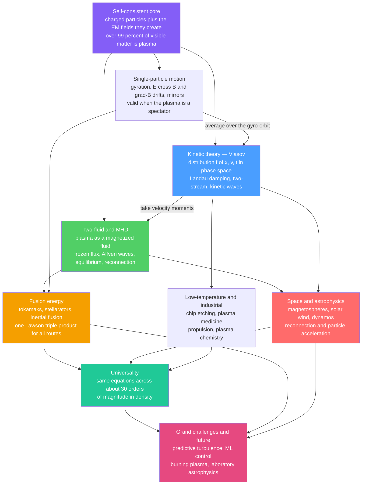

# 🌌 The Reach and Future of Plasma Physics

> [!abstract] TL;DR
> More than **99 percent of the visible universe is plasma** — the fourth state of matter — yet on Earth it is the state we learned to control last. This capstone steps back from the whole vault to see the single tangled thread that runs through all of it: **charged particles dancing with their own electromagnetic fields**. That one idea, self-consistent motion, generates the entire subject. Its **dual nature** (individual particles versus a collective fluid) forces a **hierarchy of descriptions** — single-particle orbits → kinetic Vlasov theory → two-fluid → magnetohydrodynamics — each valid in its own regime, each a deliberate simplification of the one above. From that core, applications radiate outward: **fusion energy** (tokamaks, stellarators, inertial fusion, all chasing the same Lawson triple product), **space and astrophysical plasmas** (magnetospheres, the solar wind, stellar and galactic dynamos, reconnection and particle acceleration), and **low-temperature industrial plasmas** (etching every microchip, sterilizing wounds, propelling spacecraft). The astonishing punchline is **universality**: the same equations describe a neon sign, the solar corona, and a tokamak core across roughly **thirty orders of magnitude in density**. The grand challenges — predictive turbulence and transport, real-time machine-learning control, closing the burning-plasma loop, decoding reconnection with spacecraft, and recreating the cosmos in the lab — define where the field is going. Plasma physics is the science of the universe's default state, and **fusion is its highest-stakes prize**.

## Intuition — analogy FIRST

Look at almost anything that glows and you are looking at the same physics. The pink light of a **neon sign**, the million-degree crown of the **Sun's corona**, the flicker of the **aurora**, the etching plasma inside the machine that made your phone's processor, the fireball of a **lightning** bolt, the accretion disk feeding a black hole — all of it is **plasma**, matter torn into free charges. Heat a gas until its atoms shed their electrons and something qualitatively new is born: a soup of positive ions and negative electrons that conducts electricity, responds violently to magnetic fields, carries waves that a neutral gas cannot, and organizes itself into filaments, sheets, and vortices without anyone arranging them. This is why plasma is called the **fourth state of matter** — it is as different from a gas as a gas is from a liquid.

Here is the humbling part. Plasma is the **default state of the universe** — stars, nebulae, interstellar space, the solar wind blowing past every planet — and yet on Earth it is the state of matter we understand least and learned to control latest. Solids and liquids and gases surround us and yield to intuition; plasma surrounds the *cosmos* and defies it. The reason is that a plasma is never just a crowd of particles: every charge feels the fields made by every other charge, so the medium is forever talking to itself. That single feature — **self-consistency** — makes plasma the most collective, most nonlinear, and most beautiful state of matter we know. This capstone stops zooming in on one wave or one instability and instead pulls back to see the **whole tapestry**: one thread of ideas, woven from the microchip to the cosmos, and where that thread is headed next.

---

## How It Works

The entire vault unfolds from one starting point and radiates into three families of application. At the **core** sits a self-referential loop: charged particles create electromagnetic fields (through their charge and current), and those same fields push the charges around (through the Lorentz force). Because the fields are not imposed from outside but generated by the plasma itself, everything is **self-consistent** and therefore **collective and nonlinear**. That single loop is why plasma has a "personality" no neutral gas possesses.

To make it tractable, physics built a **hierarchy of descriptions**, each a coarser but cheaper picture of the same reality:

1. **Single-particle motion** ([[Single_Particle_Motion_and_Drifts]]) — follow one charge in given fields: gyration, the E×B and grad-B and curvature drifts, magnetic mirrors. It ignores the fields the particle itself makes, so it is exact only when the plasma is dilute enough to be a spectator.
2. **Kinetic theory** ([[Kinetic_Theory_and_the_Vlasov_Equation]]) — track the full distribution function `f(x, v, t)` in six-dimensional phase space via the Vlasov equation, keeping *every* velocity. This is where uniquely plasma phenomena live: collisionless [[Landau_Damping]], the [[Two_Stream_and_Kinetic_Instabilities|two-stream instability]], the cold and [[Warm_Plasma_and_Kinetic_Waves|warm wave zoo]].
3. **Two-fluid and MHD** ([[The_Two_Fluid_and_MHD_Models]], [[Ideal_MHD_and_Frozen_In_Flux]]) — take velocity moments and treat the plasma as one (or two) magnetized fluids. This buys the elegance of [[MHD_Waves_and_Alfven_Waves|Alfvén waves]], [[MHD_Equilibrium_and_the_Grad_Shafranov_Equation|equilibrium]], frozen-in flux, and [[Magnetic_Reconnection|reconnection]] — at the cost of throwing away kinetic detail.

Two unifying ideas thread through all three levels. First, plasma is **married to the magnetic field**: frozen flux ties field lines to the fluid, confinement bottles the plasma, dynamos generate the field, and reconnection violently unbinds it. Second, plasma is **irreducibly nonlinear**: instabilities grow into [[Plasma_Turbulence_and_Nonlinear_Dynamics|turbulence]], and turbulence self-organizes into structures (zonal flows, plasma crystals, the Parker spiral). From this core the subject radiates into **fusion energy**, **space and astrophysics**, and **low-temperature industry** — and every application feeds back into a common set of **grand challenges**.



The lesson of the diagram is that **there is no single "plasma theory."** There is one physical core and a ladder of approximations, and the art of the field is choosing the rung that captures the effect you care about while discarding the detail you can afford to lose.

---

## Key Concepts / Details

### Secondary Level

**The one-sentence subject.** A plasma is an ionized gas of free charges that behaves *collectively* because each charge feels the fields made by all the others. That is the whole difference between plasma and ordinary gas, and everything else follows from it (start at *Plasma_Physics_Overview*).

**Three things that make plasma "plasma."** (1) **Debye shielding** ([[Debye_Shielding_and_Plasma_Parameters]]) — a plasma hides any stray charge behind a cloud of opposite charges within a tiny distance, keeping itself nearly neutral (quasineutrality). (2) **Plasma oscillations** — displace the electrons and they snap back, ringing at the *plasma frequency*, the medium's natural pitch. (3) **Magnetic coupling** — magnetic fields grab hold of a plasma the way a magnet grabs iron filings, which is why we can bottle it.

**The three homes of plasma.** *Fusion* (making a star in a box for clean energy), *space and astrophysics* (the medium of the cosmos), and *industry* (cold plasmas that etch chips, clean surfaces, and heal wounds). One physics, three worlds.

**Why it matters.** Fusion could supply near-limitless low-carbon energy; space plasma physics protects satellites and astronauts from solar storms; industrial plasmas already underpin the entire semiconductor economy. The stakes span the grid, the sky, and the fab.

### Undergraduate Level

**The parameters that define a plasma.** Three benchmarks separate a true plasma from a merely ionized gas ([[Debye_Shielding_and_Plasma_Parameters]]): the system must be larger than the **Debye length** `λ_D`; there must be *many* particles inside a Debye sphere (the **plasma parameter** `Λ = n λ_D³ ≫ 1`, i.e. weak coupling); and the collision time must exceed the plasma-oscillation period. The **plasma frequency** `ω_p = sqrt(n e² / ε₀ m)` and the **cyclotron frequency** `ω_c = qB/m` are the two clocks that set almost every timescale in the field.

**The description hierarchy, made precise.** Single-particle theory solves the [[Single_Particle_Motion_and_Drifts|Lorentz-force orbit]] and extracts guiding-center drifts. Kinetic theory promotes this to the [[Kinetic_Theory_and_the_Vlasov_Equation|Vlasov equation]] for `f(x, v, t)`, whose most famous consequence — collisionless **[[Landau_Damping|Landau damping]]** — proves waves can decay with no collisions at all, a purely kinetic effect invisible to fluid theory. Taking moments of Vlasov yields the [[The_Two_Fluid_and_MHD_Models|two-fluid equations]], and combining the fluids gives **MHD**.

**Magnetohydrodynamics and its jewels.** [[Ideal_MHD_and_Frozen_In_Flux|Ideal MHD]] freezes magnetic field lines into the fluid — they move with the plasma like threads in dough. This one theorem explains magnetic confinement, the winding of the solar magnetic field, and why [[MHD_Waves_and_Alfven_Waves|Alfvén waves]] can travel along field lines like waves on a plucked string. When frozen flux *breaks*, you get [[Magnetic_Reconnection|reconnection]], the engine of solar flares and magnetospheric substorms. [[MHD_Instabilities|MHD instabilities]] (kink, sausage, ballooning) set the pressure limits every confinement device must respect.

**The fusion quest in one number.** Net fusion power requires the **Lawson triple product** `n T τ_E` to exceed a threshold ([[Nuclear_Fusion_and_the_Lawson_Criterion]]): hot enough, dense enough, confined long enough — *all at once*. [[Tokamak_Physics|Tokamaks]] and [[Stellarators_and_Alternative_Confinement|stellarators]] chase it at low density for seconds; inertial fusion chases it at colossal density for a fraction of a nanosecond. **Same finish line, opposite ends of density space.**

### Graduate Level

**The dual nature as an organizing principle.** The deepest tension in the field is *particle versus fluid*. The Vlasov-Maxwell system is the honest description, but it is six-dimensional and stiff. Fluid closures (MHD, gyrokinetics, gyrofluid) are systematic reductions — each defined by an ordering of small parameters (`ρ/L`, `ω/ω_c`, `ν/ω`). Knowing *which* terms an approximation drops is the whole game: ideal MHD assumes infinite conductivity and hides reconnection; a Maxwellian closure hides Landau damping and kinetic instabilities. The competent plasma physicist is fluent in the **validity limits** of each rung, not just its equations.

**Nonlinearity, turbulence, and self-organization.** Linear instabilities ([[Two_Stream_and_Kinetic_Instabilities|kinetic]] and [[MHD_Instabilities|MHD]]) are only the overture. Their saturation produces **[[Plasma_Turbulence_and_Nonlinear_Dynamics|plasma turbulence]]**, which drives *anomalous transport* — heat and particles leaking across field lines far faster than collisions allow, the central obstacle to fusion confinement ([[Confinement_Transport_and_H_Mode]]). Yet turbulence also **self-organizes**: it spins up **zonal flows** that shear turbulent eddies apart (the L-to-H-mode transition), it builds the [[Magnetic_Reconnection|current sheets]] where reconnection ignites, and in dusty plasmas it freezes charged grains into **plasma crystals**. Emergent order from nonlinear chaos is a recurring theme across the vault (see the systems-thinking connection to [[Emergence_and_Self_Organization]]).

**Universality across thirty orders of magnitude.** The same dimensionless numbers — plasma beta `β`, Lundquist number `S`, magnetization — govern a laboratory tokamak (`n ~ 10²⁰ m⁻³`), the solar wind (`n ~ 10⁷ m⁻³`), and a stellar interior (`n ~ 10³²  m⁻³`). This is why **laboratory astrophysics** works: recreate the right dimensionless regime with a laser or a Z-pinch and you reproduce the physics of an accretion shock or a supernova remnant. Scaling, however, is subtle — collisionality, geometry, and kinetic scales do *not* all scale together, so "universal equations" must be applied with dimensional-analysis care, not blind analogy.

**The magnetic thread.** Across every application the coupling to `B` recurs: **frozen flux** confines fusion plasmas and winds the [[The_Sun|solar]] field; **dynamos** convert flow into field in stars, planets ([[Geomagnetism_and_the_Geodynamo|the geodynamo]]), and galaxies; **reconnection** releases the stored magnetic energy in flares, substorms, and sawtooth crashes; and **MHD equilibrium** ([[MHD_Equilibrium_and_the_Grad_Shafranov_Equation|Grad-Shafranov]]) shapes both tokamaks and astrophysical jets. Plasma physics is, to first order, the physics of magnetized matter.

**The grand challenges — where the thread leads.** (1) **Burning-plasma fusion**, now genuinely in sight: ITER's `Q=10` goal, NIF's 2022 ignition, and high-temperature-superconductor magnets enabling compact private-sector devices (SPARC, and *The_Path_to_Fusion_Energy* for the endgame). (2) **Predictive turbulent transport** via exascale gyrokinetic simulation and AI surrogates, plus **real-time machine-learning control** of disruptions and the tokamak boundary. (3) **Reconnection and particle acceleration**, being decoded in situ by the MMS and Parker Solar Probe missions. (4) **Laboratory astrophysics** on the world's largest lasers and pulsed-power machines. (5) **Low-temperature plasmas** for sustainability — plasma catalysis, decarbonized chemistry, plasma medicine, and semiconductor manufacturing. (6) **Plasma propulsion** for deep-space missions. (7) **Strongly-coupled, high-energy-density, and quantum** plasma frontiers where the weak-coupling assumptions of the textbook break down.

---

## Python Demo

```python
# ==========================================================================
# THE PLASMA PHYSICS DASHBOARD — a 4-panel synthesis of the whole vault.
#   (1) The "map of plasmas": density-temperature plane across ~30 orders of
#       magnitude, with named natural and laboratory plasmas + the strong-
#       coupling line  Gamma = 1  (FOUNDATIONS).
#   (2) The microscopic core: a single charged particle's E x B cycloid drift
#       -- gyration superposed on a steady guiding-center drift (SINGLE-PARTICLE).
#   (3) The fusion quest: the D-T Lawson triple product n*T*tau_E vs T with a
#       Bosch-Hale reactivity, and milestone experiments (FUSION).
#   (4) Space/astro: the Parker spiral -- the solar wind winding the
#       interplanetary magnetic field into an Archimedean spiral (SPACE/ASTRO).
# Self-contained: numpy + matplotlib only.
# ==========================================================================
import numpy as np
import matplotlib.pyplot as plt

fig, ax = plt.subplots(2, 2, figsize=(14, 10))

# --------------------------------------------------------------------------
# (1) THE MAP OF PLASMAS  (log n  vs  log T)
# --------------------------------------------------------------------------
# name: (density n [m^-3], temperature T [eV])
plasmas = {
    "Interstellar medium": (1e5,  1.0),
    "Solar wind (1 AU)":   (7e6,  10.0),
    "Magnetosphere":       (1e6,  1e3),
    "Ionosphere":          (1e12, 0.1),
    "Aurora":              (1e11, 1.0),
    "Solar corona":        (1e14, 1e2),
    "Neon / fluorescent":  (1e17, 1.0),
    "Glow discharge":      (1e16, 2.0),
    "Lightning":           (1e24, 3.0),
    "Tokamak core":        (1e20, 1e4),
    "Solar core":          (1e32, 1.3e3),
    "ICF hot spot":        (1e31, 1e4),
    "White dwarf":         (1e36, 1e3),
}
n_vals = np.array([v[0] for v in plasmas.values()])
T_vals = np.array([v[1] for v in plasmas.values()])
ax[0, 0].scatter(n_vals, T_vals, s=45, color="crimson", zorder=5)
for name, (n, T) in plasmas.items():
    ax[0, 0].annotate(name, (n, T), textcoords="offset points",
                      xytext=(5, 4), fontsize=7.5)

# Strong-coupling line: Gamma = e^2 / (4 pi eps0 a kT) = 1,  a = (3/4pi n)^(1/3)
e, eps0 = 1.602176634e-19, 8.8541878128e-12
n_line = np.logspace(4, 37, 200)
a = (3.0 / (4.0 * np.pi * n_line))**(1.0 / 3.0)
T_gamma1 = (e / (4.0 * np.pi * eps0 * a)) / 1.0        # eV where Gamma = 1
ax[0, 0].plot(n_line, T_gamma1, "k--", lw=1.4,
              label="strong-coupling  Gamma = 1")
ax[0, 0].fill_between(n_line, T_gamma1, 1e-3, color="gray", alpha=0.12)
ax[0, 0].text(3e33, 3e-1, "strongly\ncoupled", fontsize=8, ha="center")
ax[0, 0].set_xscale("log"); ax[0, 0].set_yscale("log")
ax[0, 0].set_xlim(1e4, 1e38); ax[0, 0].set_ylim(1e-2, 1e5)
ax[0, 0].set_xlabel("number density  n  [m^-3]  (~30 orders of magnitude)")
ax[0, 0].set_ylabel("temperature  T  [eV]")
ax[0, 0].set_title("(1) The map of plasmas: one physics, many worlds")
ax[0, 0].legend(loc="lower left", fontsize=8)
ax[0, 0].grid(True, which="both", alpha=0.25)

# --------------------------------------------------------------------------
# (2) SINGLE-PARTICLE CORE: the E x B cycloid drift
#     B = B z-hat, E = E x-hat, particle starts at rest.
#     x(t) = (E / (B wc)) (1 - cos wc t)
#     y(t) = -(E/B) t + (E / (B wc)) sin wc t     (drift speed E/B along -y)
# --------------------------------------------------------------------------
wc = 2.0 * np.pi           # cyclotron frequency (arb. units)
E_over_B = 1.0             # drift speed
r = E_over_B / wc          # gyro-radius scale
t = np.linspace(0, 6.0, 2000)
x = r * (1 - np.cos(wc * t))
y = -E_over_B * t + r * np.sin(wc * t)
ax[0, 1].plot(x, y, lw=2.0, color="navy", label="particle orbit")
ax[0, 1].plot(np.zeros_like(t), -E_over_B * t, "r--", lw=1.5,
              label="guiding-center drift  v = E/B")
ax[0, 1].scatter([x[0]], [y[0]], color="green", zorder=5, label="start (at rest)")
ax[0, 1].annotate("B out of page", (0.05, -0.6), fontsize=9)
ax[0, 1].annotate("E ->", (1.2, -0.2), fontsize=10, color="darkorange")
ax[0, 1].set_xlabel("x  (along E)"); ax[0, 1].set_ylabel("y  (along E x B drift)")
ax[0, 1].set_title("(2) Microscopic core: the E x B cycloid drift")
ax[0, 1].legend(loc="lower left", fontsize=8); ax[0, 1].grid(True, alpha=0.3)
ax[0, 1].set_aspect("equal", adjustable="box")

# --------------------------------------------------------------------------
# (3) THE FUSION QUEST: D-T triple product vs T  (Bosch-Hale reactivity)
# --------------------------------------------------------------------------
def bosch_hale_DT(T_keV):
    """D-T reactivity <sigma v> in m^3/s.  Bosch & Hale, Nucl. Fusion 32, 611."""
    BG, mrc2 = 34.3827, 1124656.0
    C = [1.17302e-9, 1.51361e-2, 7.51886e-2, 4.60643e-3,
         1.35000e-2, -1.06750e-4, 1.36600e-5]
    C1, C2, C3, C4, C5, C6, C7 = C
    T = T_keV
    theta = T / (1.0 - (T*(C2 + T*(C4 + T*C6))) / (1.0 + T*(C3 + T*(C5 + T*C7))))
    xi = (BG**2 / (4.0 * theta))**(1.0 / 3.0)
    return C1 * theta * np.sqrt(xi / (mrc2 * T**3)) * np.exp(-3.0 * xi) * 1e-6

keV = 1.602176634e-16
E_a = 3.5e3 * keV               # alpha self-heating energy [J]
C_B = 5.35e-37                  # bremsstrahlung constant [W m^3 keV^-1/2]
Tk = np.linspace(4, 100, 1200)  # keV
sigv = bosch_hale_DT(Tk)
denom = 0.25 * sigv * E_a - C_B * np.sqrt(Tk)     # alpha heating minus brems
valid = denom > 0
nTau = np.where(valid, 3.0 * (Tk * keV) / np.where(valid, denom, 1.0), np.nan)
triple = Tk * nTau              # keV s / m^3
imin = np.nanargmin(triple)
print(f"Min D-T triple product n*T*tau_E = {triple[imin]:.2e} keV.s/m^3 "
      f"at T = {Tk[imin]:.0f} keV")

experiments = {
    "JET (DT '97)":  (13.0, 1.0e21),
    "ITER (Q=10)":   (15.0, 6.0e21),
    "NIF (ignition)":(8.0,  5.0e21),
}
ax[1, 0].semilogy(Tk, triple, lw=2.4, color="navy", label="ignition boundary")
ax[1, 0].axhline(3e21, color="gray", ls=":", lw=1.4,
                 label="min ~ 3e21 keV.s/m^3")
ax[1, 0].scatter([Tk[imin]], [triple[imin]], color="crimson", zorder=6)
for name, (Tp, tp) in experiments.items():
    ax[1, 0].scatter([Tp], [tp], zorder=5)
    ax[1, 0].annotate(name, (Tp, tp), textcoords="offset points",
                      xytext=(6, 6), fontsize=8)
ax[1, 0].fill_between(Tk, triple, 1e23, where=valid, color="navy", alpha=0.06)
ax[1, 0].text(55, 4e22, "IGNITED\n(above curve)", ha="center", fontsize=9)
ax[1, 0].set_xlim(0, 100); ax[1, 0].set_ylim(1e21, 1e23)
ax[1, 0].set_xlabel("temperature  T  [keV]")
ax[1, 0].set_ylabel("n.T.tau_E  [keV.s/m^3]")
ax[1, 0].set_title("(3) The fusion quest: Lawson triple product (D-T)")
ax[1, 0].legend(loc="upper right", fontsize=8)
ax[1, 0].grid(True, which="both", alpha=0.3)

# --------------------------------------------------------------------------
# (4) SPACE / ASTRO: the Parker spiral of the interplanetary magnetic field
#     A field line is an Archimedean spiral: phi(r) = phi0 - r / L,
#     where L = v_sw / Omega ~ 1 AU per radian at 400 km/s.
# --------------------------------------------------------------------------
v_sw = 400e3                     # solar wind speed [m/s]
Omega = 2.7e-6                   # solar rotation rate [rad/s]
AU = 1.496e11                    # metres
L = (v_sw / Omega) / AU          # AU per radian (~0.99)
r_au = np.linspace(0.05, 5.0, 500)
for phi0 in np.linspace(0, 2 * np.pi, 6, endpoint=False):
    phi = phi0 - r_au / L
    ax[1, 1].plot(r_au * np.cos(phi), r_au * np.sin(phi), lw=1.8)
ax[1, 1].scatter([0], [0], color="orange", s=220, zorder=6, label="Sun")
ang = np.linspace(0, 2 * np.pi, 200)
ax[1, 1].plot(1.0 * np.cos(ang), 1.0 * np.sin(ang), "k--", lw=1.0,
              alpha=0.6, label="Earth orbit (1 AU)")
ax[1, 1].set_xlim(-5, 5); ax[1, 1].set_ylim(-5, 5)
ax[1, 1].set_xlabel("x  [AU]"); ax[1, 1].set_ylabel("y  [AU]")
ax[1, 1].set_title("(4) Space plasma: the Parker spiral (~45 deg at 1 AU)")
ax[1, 1].legend(loc="upper right", fontsize=8)
ax[1, 1].set_aspect("equal", adjustable="box"); ax[1, 1].grid(True, alpha=0.3)

fig.suptitle("The Plasma Physics Dashboard — from the microchip to the cosmos",
             fontsize=14, y=1.00)
plt.tight_layout()
plt.savefig("plasma_dashboard.png", dpi=110, bbox_inches="tight")
print("saved plasma_dashboard.png")
```

**What the dashboard shows.** Panel **(1)** is the field's family portrait: named plasmas scattered across roughly thirty orders of magnitude in density and seven in temperature, all obeying the same equations, with the dashed `Γ=1` line marking where the textbook weak-coupling assumption fails (white dwarfs, ICF hot spots, and stellar cores drift into the strongly-coupled corner). Panel **(2)** is the microscopic heartbeat — a single charge tracing a **cycloid**, gyration riding on a steady `E×B` drift that is independent of charge and mass, the seed of all guiding-center theory. Panel **(3)** is the fusion finish line: the U-shaped **Lawson ignition boundary** bottoms out near `3×10²¹ keV·s/m³` around 14 keV, with magnetic (JET, ITER) and inertial (NIF) milestones clustered near it despite living at wildly different densities — Panel (1) and Panel (3) are the *same universality, viewed twice*. Panel **(4)** is the cosmos: the outflowing solar wind, frozen to the rotating Sun's field, winds the interplanetary magnetic field into the **Parker spiral**, crossing Earth's orbit at the classic ~45° angle. Four panels, one thread.

---

## Real-World Applications

The reach of plasma physics is the widest of any subfield of physics — it is simultaneously the science of stars and the science of your phone.

- **Energy — fusion.** The flagship. [[Tokamak_Physics|Tokamaks]] (ITER, JET, EAST, KSTAR, SPARC), [[Stellarators_and_Alternative_Confinement|stellarators]] (Wendelstein 7-X), and inertial fusion (NIF's 2022 ignition) all pursue the [[Nuclear_Fusion_and_the_Lawson_Criterion|Lawson triple product]]. High-temperature-superconductor magnets and a wave of private companies have moved fusion from "always thirty years away" to a credible engineering endgame (*The_Path_to_Fusion_Energy*).
- **Space weather and the near-Earth environment.** Solar flares and coronal mass ejections — powered by [[Magnetic_Reconnection|reconnection]] — drive geomagnetic storms that endanger satellites, power grids, and astronauts. Understanding the *Space_Plasma_Physics_and_the_Magnetosphere* and *The_Solar_Wind_and_Heliosphere* systems is now operational infrastructure, informed by the MMS and Parker Solar Probe missions.
- **Astrophysics.** Accretion disks, relativistic jets, supernova remnants, pulsar magnetospheres, and galactic magnetic fields are all plasma phenomena, sculpted by *Astrophysical_Plasmas_and_Dynamos*. The [[The_Sun|Sun]] itself is a magnetized-plasma laboratory next door, and the [[Geomagnetism_and_the_Geodynamo|geodynamo]] is the plasma-like MHD engine inside our own planet.
- **Semiconductors and materials.** Every microchip is etched and deposited by [[Semiconductors_Intrinsic_and_Extrinsic|low-temperature plasmas]] (*Low_Temperature_and_Industrial_Plasmas*). Plasma processing is a multi-hundred-billion-dollar pillar of the global electronics economy — the state of matter that runs the Sun also runs the fab.
- **Medicine and sustainability.** Cold atmospheric plasmas sterilize instruments, treat wounds and cancers, and enable plasma catalysis for greener chemistry, nitrogen fixation, and CO₂ conversion — a growing front in decarbonization.
- **Propulsion.** Plasma thrusters (Hall and ion engines) already fly on commercial satellites and deep-space probes, offering the high exhaust velocity that chemical rockets cannot, and are a leading candidate for crewed interplanetary travel.

---

## Common Pitfalls

1. **Choosing the wrong rung of the description ladder.** Plasma's dual nature (particles versus fluid) means every problem demands a *decision*: single-particle, kinetic, or fluid/MHD. Using MHD where kinetic effects dominate (or vice versa) is the most common and most consequential modeling error in the field. Always ask which small parameters your chosen model orders away.
2. **Over-idealizing.** [[Ideal_MHD_and_Frozen_In_Flux|Ideal MHD]] (infinite conductivity) *forbids* [[Magnetic_Reconnection|reconnection]] — yet reconnection powers flares and substorms, so it must re-enter through resistivity or kinetic physics. A [[Kinetic_Theory_and_the_Vlasov_Equation|Maxwellian]] closure hides [[Landau_Damping|Landau damping]] and velocity-space instabilities. Elegant idealizations silently delete the physics you may most need.
3. **Believing "plasma equals hot."** The neon sign, the etching chamber, and the plasma scalpel are all *cold* in the heavy-particle sense: only the electrons are hot while the ions and gas stay near room temperature. [[Semiconductors_Intrinsic_and_Extrinsic|Low-temperature plasmas]] are an enormous, economically dominant class — "plasma" is defined by ionization and collective behavior, not by temperature.
4. **Underestimating nonlinearity and turbulence.** Linear stability analysis is only the opening move. [[Plasma_Turbulence_and_Nonlinear_Dynamics|Turbulence]] and anomalous transport are generic, hard, and often the binding constraint (e.g. confinement in [[Confinement_Transport_and_H_Mode|H-mode]]). Do not mistake a linear growth rate for a full prediction.
5. **Confusing the fusion physics gap with the engineering gap.** Reaching fusion temperatures and even scientific breakeven does not make a power plant. Neutron wall loading, tritium breeding, divertor heat exhaust, and wall-plug efficiency are separate, unforgiving engineering problems ([[Nuclear_Fusion_and_the_Lawson_Criterion|plasma Q is not engineering Q]]).
6. **Abusing universality.** The same equations spanning ~30 orders of magnitude is real and profound — but *scaling matters*. Collisionality, kinetic scales, and geometry do not all scale together, so a naive lab-to-cosmos analogy can mislead. Universality is a dimensional-analysis statement, not a license to ignore dimensionless parameters.
7. **Treating the sub-topics as disconnected.** The single greatest conceptual error a student makes is memorizing drifts, waves, MHD, and fusion as separate modules. They are one subject: charged particles and their self-consistent fields, seen at different resolutions. This capstone exists precisely to prevent that fragmentation.

---

## Related Concepts

This note is the **hub** of the Plasma & Fusion vault. Wikilinks below point only to files verified on disk; sibling notes still mid-build (inertial fusion, the path to fusion energy, and the section-06 space/astro/applied notes) are referenced in *italic prose* above.

**Foundations (Section 01)**
- [[Plasma_Physics_Overview]] — the front door: what a plasma is and why it is the fourth state of matter; this capstone is its bookend.
- [[Debye_Shielding_and_Plasma_Parameters]] — quasineutrality, the Debye length, and the plasma parameter that define the medium (the axes of Panel 1).
- [[Single_Particle_Motion_and_Drifts]] — the microscopic core: gyration and the E×B drift plotted in Panel 2.

**Kinetic theory and waves (Section 02)**
- [[Kinetic_Theory_and_the_Vlasov_Equation]] — the phase-space description that sits between particles and fluids.
- [[Landau_Damping]] — the signature collisionless kinetic effect that fluid theory cannot see.
- [[Two_Stream_and_Kinetic_Instabilities]] — velocity-space free energy driving instability, the seed of turbulence.
- [[Warm_Plasma_and_Kinetic_Waves]] — the wave zoo that kinetic theory unlocks beyond the cold-plasma limit.
- [[Plasma_Turbulence_and_Nonlinear_Dynamics]] — where instabilities go to saturate; anomalous transport and self-organization.

**Magnetohydrodynamics (Section 03)**
- [[The_Two_Fluid_and_MHD_Models]] — the moment reduction from kinetic theory to a magnetized fluid.
- [[Ideal_MHD_and_Frozen_In_Flux]] — the frozen-flux theorem underpinning confinement, dynamos, and reconnection.
- [[MHD_Waves_and_Alfven_Waves]] — the Alfvén and magnetosonic modes that carry energy along field lines.
- [[Magnetic_Reconnection]] — the universal engine of flares, substorms, and sawteeth; where ideal MHD breaks.
- [[MHD_Instabilities]] — kink, sausage, and ballooning limits that cap plasma pressure.
- [[MHD_Equilibrium_and_the_Grad_Shafranov_Equation]] — the equilibrium that shapes tokamaks and astrophysical structures.

**Fusion and confinement (Sections 04-05)**
- [[Nuclear_Fusion_and_the_Lawson_Criterion]] — the triple product that is the field's highest-stakes number (Panel 3).
- [[Magnetic_Confinement_Concepts]] — the strategies for bottling a plasma with magnetic fields.
- [[Tokamak_Physics]] — the leading magnetic-confinement device.
- [[Stellarators_and_Alternative_Confinement]] — the steady-state, disruption-free alternative.
- [[Plasma_Heating_and_Current_Drive]] — how the plasma is heated and its current sustained.
- [[Confinement_Transport_and_H_Mode]] — turbulent transport and the confinement barrier that made fusion viable.
- [[Fusion_Reactor_Engineering_and_Breeding]] — the engineering endgame: blankets, tritium breeding, materials.
- [[Fusion_Fuel_Cycles_and_Aneutronic_Fusion]] — D-T, D-D, D-³He, and p-¹¹B trade-offs.

**Cross-vault connections**
- [[Magnetohydrodynamics]] — the Physics-vault companion treatment of the MHD fluid model.
- [[Nuclear_Reactions_Fission_Fusion]] — the nuclear kinematics and Q-values behind fusion.
- [[The_Sun]] and [[Stellar_Structure_and_Energy_Generation]] — the astrophysical fusion reactor and its power balance.
- [[Geomagnetism_and_the_Geodynamo]] — Earth's own magnetized-fluid dynamo, an MHD system next door.
- [[Turbulence_Fundamentals]] and [[Turbulence_and_Instabilities]] — the neutral-fluid turbulence whose ideas plasma turbulence extends.
- [[Semiconductors_Intrinsic_and_Extrinsic]] — the low-temperature-plasma-processed material at the heart of the chip economy.
- [[Emergence_and_Self_Organization]] — the systems-thinking lens on zonal flows, plasma crystals, and the Parker spiral.

---

## Review Questions

1. **Secondary / synthesis.** In one paragraph, explain why plasma is called the "fourth state of matter," name the three worlds where plasma physics is applied, and give one everyday example and one cosmic example that obey the *same* physics. Why is it surprising that the most common state of matter in the universe is the one we control least well?
2. **Undergraduate / synthesis.** The vault develops a hierarchy of descriptions: single-particle → kinetic (Vlasov) → two-fluid → MHD. (a) State one phenomenon that *only* the kinetic level captures and one that MHD captures cleanly but kinetic theory makes harder to see. (b) For each rung, name the physical assumption you must make to descend to it. (c) Using the "map of plasmas," explain why the solar wind, a tokamak, and a stellar core can share governing equations across ~30 orders of magnitude in density — and one reason that shared-equations claim can still mislead.
3. **Graduate / synthesis.** Argue for or against the statement: *"The central obstacle to fusion energy is no longer physics but engineering."* Your answer should (a) distinguish the Lawson/burning-plasma physics problem from the neutron-wall, tritium-breeding, and wall-plug-efficiency engineering problems; (b) explain the role of turbulent transport and real-time ML control as a physics-and-engineering hybrid frontier; and (c) connect the fusion challenge to at least two other grand challenges in the field (reconnection, laboratory astrophysics, predictive turbulence, or low-temperature-plasma sustainability), showing how progress in one feeds the others.

---

## Sources

- Chen, F. F. — *Introduction to Plasma Physics and Controlled Fusion*, 3rd ed. (Springer, 2016) — the classic single-volume tour from foundations through waves, MHD, and fusion; the natural companion to this synthesis.
- Bellan, P. M. — *Fundamentals of Plasma Physics* (Cambridge, 2006) — rigorous unified development of the kinetic-to-fluid hierarchy and the collective nature of plasma.
- Freidberg, J. P. — *Plasma Physics and Fusion Energy* (Cambridge, 2007) — the standard on the Lawson power balance, confinement, and the reactor endgame.
- National Academies of Sciences, Engineering, and Medicine — *Plasma Science: Enabling Technology, Sustainability, Security, and Exploration* (the "Plasma 2020" decadal report, NASEM, 2021) — the field's own forward-looking survey of grand challenges across energy, space, industry, and discovery science.
- Freidberg, J. P. — *Ideal MHD* (Cambridge, 2014) — authoritative on equilibrium, stability, and the magnetic-confinement physics underlying fusion.

#plasma-physics #capstone #fusion-energy #space-plasma #the-fourth-state
