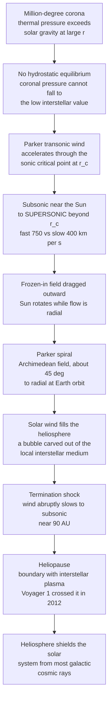

# ☀️ The Solar Wind and Heliosphere

> [!abstract] TL;DR
> The Sun's million-degree **corona** is so hot that thermal pressure overwhelms solar gravity at large distances, so the corona cannot stay put — it **boils off** as a continuous, **supersonic** plasma outflow: the **solar wind**. Parker (1958) predicted this by solving a **transonic wind equation**, in which the flow accelerates through a **sonic critical point** from subsonic near the Sun to supersonic far out (fast wind $\sim 750$ km/s from **coronal holes**, slow wind $\sim 400$ km/s from **streamers**). Because the Sun **rotates** while the wind streams **radially**, the **frozen-in** magnetic field is wound into an **Archimedean spiral** — the **Parker spiral** — meeting Earth's orbit at $\sim 45^\circ$ to the radial. The wind inflates a vast bubble, the **heliosphere**, carved out of the interstellar medium; it slows abruptly at the **termination shock** and ends at the **heliopause** (crossed by Voyager 1 in 2012, Voyager 2 in 2018), shielding the solar system from most galactic cosmic rays. It is **MHD, flux freezing, and the coronal-heating problem** written across the whole solar system.

## Intuition

**Analogy:** The Sun is **not** a quiet ball sitting in empty space. It is constantly **boiling off its outer atmosphere** into a supersonic wind of plasma that blows past every planet and streams out beyond Pluto, carving a vast bubble in the galaxy called the **heliosphere**. As it flows, this wind **drags the Sun's magnetic field with it into a giant spiral** — like water spiraling out of a spinning lawn sprinkler — and that magnetized wind is what carries space-weather storms all the way to Earth. The astonishing consequence: **we literally live *inside* the Sun's outer atmosphere**, and only in 2012 did a spacecraft — Voyager 1 — finally leave it.

Technically, the corona is a **hot, tenuous, magnetized plasma** whose thermal energy per particle exceeds its gravitational binding energy beyond a few solar radii. It cannot be held in **hydrostatic equilibrium** at large distance, so it must accelerate outward — and because the plasma is a nearly perfect conductor, the magnetic field is **frozen in** (see the sibling note *Ideal_MHD_and_Frozen_In_Flux*) and is carried bodily out with the flow, winding into the Parker spiral as the Sun turns beneath it.

---

## How It Works

### Core mechanics

**1. A static corona is impossible.** Try to hold the corona in **hydrostatic balance**, $dp/dr = -\rho\,GM_\odot/r^2$, with an isothermal ideal gas $p = \rho c_s^2$ (isothermal sound speed $c_s^2 = 2k_BT/m_p$ for a hydrogen plasma). Integrating outward gives a pressure that **does not fall to zero** at infinity — it tends to a finite value far larger than the pressure of the surrounding interstellar medium. The corona has no equilibrium to relax into; the excess pressure **pushes it out**. This is Parker's key 1958 insight, initially ridiculed and then confirmed in 1962 by **Mariner 2**.

**2. Parker's transonic wind.** Steady, spherically symmetric, isothermal momentum balance gives the **Parker wind equation**

$$\left(v - \frac{c_s^2}{v}\right)\frac{dv}{dr} = \frac{2c_s^2}{r} - \frac{GM_\odot}{r^2}.$$

The left side vanishes where $v = c_s$; the right side vanishes at the **critical (sonic) radius** $r_c = GM_\odot/(2c_s^2)$. Only the single solution that passes **through the critical point** $(r_c, c_s)$ is physically acceptable as a wind: it starts **subsonic** near the Sun and accelerates smoothly through $c_s$ to become **supersonic** beyond $r_c$, matching the low pressure of interstellar space. The isothermal solution has the clean implicit integral

$$\left(\frac{v}{c_s}\right)^2 - \ln\!\left(\frac{v}{c_s}\right)^2 = 4\ln\frac{r}{r_c} + 4\frac{r_c}{r} - 3,$$

which passes through $(v,r)=(c_s,r_c)$ exactly. Other members of the family are subsonic "breezes" (never reach interstellar pressures) or double-valued and unphysical.

**3. Fast wind vs slow wind.** The wind is **not uniform**. **Fast wind** ($\sim 700\text{–}800$ km/s, low density, steady) streams from **coronal holes** — regions of **open** magnetic field, especially over the poles at solar minimum. **Slow wind** ($\sim 300\text{–}450$ km/s, denser, more variable) emerges from the boundaries of closed-field **helmet streamers** near the equator. Their composition differs, a fingerprint of their different coronal source regions.

**4. The Parker spiral.** The wind carries the **frozen-in** interplanetary magnetic field (IMF). A parcel leaves a fixed footpoint on the rotating Sun and moves **radially** at $v_{sw}$, but the footpoint keeps rotating at angular rate $\Omega_\odot$. Connecting all parcels from one footpoint traces an **Archimedean spiral**,

$$\phi(r) = \phi_0 - \frac{\Omega_\odot}{v_{sw}}(r - R_\odot),\qquad \tan\psi = \frac{\Omega_\odot\, r}{v_{sw}},$$

where $\psi$ is the angle between the field and the radial direction. At Earth's orbit $\Omega_\odot r \approx v_{sw}$, so $\psi \approx 45^\circ$; the spiral **tightens** ($\psi \to 90^\circ$) at large $r$ and is nearly radial close in. Fast wind gives a **more open** (less wound) spiral than slow wind. Because the Sun's dipole is tilted, the boundary between outward and inward field warps into the **heliospheric current sheet**, the famous rotating "ballerina skirt."

**5. The heliosphere and its boundaries.** The supersonic wind sweeps out a cavity in the **local interstellar medium** ([[The_Interstellar_Medium]]). Where its ram pressure finally balances the interstellar pressure, the wind crosses the **termination shock** ($\sim 85\text{–}95$ AU) and abruptly **decelerates to subsonic** (heating the plasma and energizing pickup ions). The turbulent, subsonic **heliosheath** lies beyond, ending at the **heliopause** — the true contact boundary with interstellar plasma (Voyager 1: 2012 at $\sim 121$ AU; Voyager 2: 2018 at $\sim 119$ AU). The heliosphere **shields** the inner solar system from the bulk of **galactic cosmic rays**.

**6. Disturbances and space weather.** The steady wind is punctuated by **coronal mass ejections** (CMEs) — magnetized plasmoids launched by coronal eruptions — and by **corotating interaction regions** (CIRs), where fast wind overtakes slow wind and forms compression shocks. Both drive **shocks** and accelerate **solar energetic particles** that reach Earth in hours to days, producing geomagnetic storms and aurorae.

### Flow / architecture



---

## Key Concepts

### Secondary Level

- The Sun's outer atmosphere, the **corona**, is unbelievably hot — over a **million degrees**. It is so hot that gravity cannot hold its outer edge, so it **streams away into space** as a wind of charged gas: the **solar wind**.
- This wind moves **faster than sound** and blows out past all the planets, blowing a giant **bubble** (the heliosphere) in the thin gas between the stars. We live **inside** this bubble.
- As the wind flows out, it **carries the Sun's magnetism with it**; because the Sun spins, the magnetism gets wound into a **spiral**, like water flung off a spinning sprinkler.
- The wind is gusty: **fast wind** blows from dark "holes" in the corona, **slow wind** from bright streamers. Big eruptions on the Sun send **storms** that light up the **auroras** on Earth.

### Undergraduate Level

- **Why a wind at all:** an isothermal, hydrostatic corona has a pressure that stays finite at infinity, larger than interstellar pressure — no static solution exists, so the corona must flow outward. This is the physical content of Parker's argument.
- **Transonic solution:** the **Parker wind equation** $\left(v - c_s^2/v\right) v' = 2c_s^2/r - GM_\odot/r^2$ has a saddle-type **critical point** at $r_c = GM_\odot/(2c_s^2)$, $v = c_s$. The **unique wind** threads this point: subsonic $\to$ supersonic. A hotter corona (larger $c_s$) gives a smaller $r_c$ and a faster asymptotic wind.
- **Parker spiral:** frozen-in field plus radial flow plus solar rotation give an Archimedean spiral with $\tan\psi = \Omega_\odot r / v_{sw}$; $\psi \approx 45^\circ$ at 1 AU. This is [[Magnetohydrodynamics]] flux freezing (see *Ideal_MHD_and_Frozen_In_Flux*) applied to the whole heliosphere.
- **Heliospheric structure:** termination shock (supersonic $\to$ subsonic), heliosheath, heliopause; a **shock** because the wind is supersonic relative to the interstellar medium ([[Shock_Waves_and_Supersonic_Flow]]).
- **Fast vs slow wind** trace **open vs closed** coronal field; the tilted dipole makes the **heliospheric current sheet**.

### Graduate Level

- **Critical-point analysis:** the Parker equation is a first-order ODE with a **saddle** (X-type) singular point; the transonic wind is the separatrix. The same structure recurs in **Bondi accretion** (inflow) and in the **de Laval nozzle** — a converging–diverging effective area (gravity + geometry) that accelerates a flow through Mach 1. Polytropic ($p\propto\rho^\gamma$) closures shift $r_c$ and the terminal speed; for $\gamma \ge 3/2$ the isothermal-like wind picture degrades and heating deposition matters.
- **The coronal-heating problem:** the wind exists **only because** the corona is $\sim 200\times$ hotter than the 5800 K photosphere. Candidate mechanisms are **Alfvén-wave / turbulence heating** (wave energy from convection dissipating in the corona; see *MHD_Waves_and_Alfven_Waves*) and **nanoflare heating** (many small reconnection events; see *Magnetic_Reconnection*). Modern solar-wind models are wave-driven / turbulence-driven, adding momentum via wave pressure beyond the thermal drive.
- **IMF and current sheet:** the radial field falls as $B_r \propto r^{-2}$ (flux conservation) while the azimuthal component falls as $B_\phi \propto r^{-1}$, so far out the field is nearly azimuthal ($\psi \to 90^\circ$). The **heliospheric current sheet** separates the two dipolar hemispheres and warps with solar-cycle magnetic tilt, modulating cosmic-ray access.
- **Global boundary and cosmic rays:** the termination shock is a **weak, quasi-perpendicular** shock complicated by pickup ions; heliopause instabilities and a possible interstellar **bow wave** (subfast, so a wave rather than a bow shock) set the outer structure. The heliosphere modulates the galactic-cosmic-ray spectrum ([[Cosmic_Rays_and_Neutrino_Astrophysics]]) anticorrelated with solar activity. In-situ data now come from **Parker Solar Probe**, which has flown inside $\sim 10\,R_\odot$ and through the Alfvén surface where the wind first becomes super-Alfvénic. Connections to broader space plasma physics appear in *Space_Plasma_Physics_and_the_Magnetosphere* and *Astrophysical_Plasmas_and_Dynamos*.

---

## Python Demo

```python
# Parker's solar wind and the Parker spiral
#   (a) PARKER TRANSONIC WIND: the isothermal wind has a conserved integral
#         Lambda(r,v) = (v/cs)^2 - 2 ln(v/cs) - 4 ln(r/rc) - 4 rc/r
#       Every solution is a level set Lambda = const. The UNIQUE transonic
#       wind passes through the sonic critical point (r=rc, v=cs) -> Lambda=-3:
#       SUBSONIC below rc, accelerating smoothly to SUPERSONIC above rc.
#   (b) PARKER SPIRAL: radial flow + solar rotation winds the frozen-in field
#       into an Archimedean spiral, r proportional to phi, about 45 deg to the
#       radial at Earth's orbit; the winding TIGHTENS with distance.
import numpy as np
import matplotlib.pyplot as plt

# ------------------------------------------------------------------
# (a) Parker transonic wind (dimensionless: v in units of cs, r in units of rc)
# ------------------------------------------------------------------
def Lambda(r, v):
    return v**2 - 2*np.log(v) - 4*np.log(r) - 4.0/r

LAM_CRIT = -3.0   # value at the critical point (r=1, v=1): 1 - 0 - 0 - 4 = -3

def wind_speed(r):
    """Trace the transonic solution v(r)/cs by bisection on Lambda(r,v) = -3.
    Setting Lambda=-3 gives  h(v) = v^2 - 2 ln v = 4 ln r + 4/r - 3, where
    h decreases on (0,1) and increases on (1,inf); pick the branch by r<>rc."""
    target = 4.0*np.log(r) + 4.0/r - 3.0          # = h(v)
    if r < 1.0:                                    # subsonic branch: v in (0,1)
        lo, hi = 1e-9, 1.0
    else:                                          # supersonic branch: v in (1,inf)
        lo, hi = 1.0, 60.0
    for _ in range(200):
        mid = 0.5*(lo + hi)
        h = mid**2 - 2.0*np.log(mid)
        if r < 1.0:                                # h decreasing here
            lo, hi = (mid, hi) if h > target else (lo, mid)
        else:                                      # h increasing here
            lo, hi = (mid, hi) if h < target else (lo, mid)
    return 0.5*(lo + hi)

r_axis  = np.logspace(np.log10(0.15), np.log10(60.0), 500)
v_trans = np.array([wind_speed(r) for r in r_axis])

# family of solutions as level sets of Lambda
Rg = np.logspace(np.log10(0.15), np.log10(60.0), 400)
Vg = np.linspace(0.03, 5.5, 400)
RR, VV = np.meshgrid(Rg, Vg)
LL = Lambda(RR, VV)

# physical calibration: isothermal corona at T = 1.5 MK
kB, mp, G, Msun, Rsun, AU = 1.381e-23, 1.673e-27, 6.674e-11, 1.989e30, 6.96e8, 1.496e11
T  = 1.5e6
cs = np.sqrt(2*kB*T/mp)                 # isothermal sound speed of an H plasma
rc = G*Msun/(2*cs**2)                   # sonic critical radius
r_earth = AU/rc                         # Earth's orbit in units of rc
v_earth = wind_speed(r_earth)*cs
print(f"isothermal sound speed cs = {cs/1e3:6.1f} km/s")
print(f"critical radius       rc = {rc/Rsun:6.2f} Rsun  ({rc/AU:.3f} AU)")
print(f"Earth orbit           r  = {r_earth:6.1f} rc")
print(f"wind speed at 1 AU       = {v_earth/1e3:6.1f} km/s  (Mach {v_earth/cs:.2f})")

# ------------------------------------------------------------------
# (b) Parker spiral field lines and (c) spiral angle vs distance
# ------------------------------------------------------------------
Omega = 2.7e-6                          # rad/s, solar sidereal rotation (~27 day)
v_slow, v_fast = 400e3, 750e3           # slow / fast solar wind (m/s)

r_line = np.linspace(Rsun, 5*AU, 600)
phi0s  = np.deg2rad([0, 60, 120, 180, 240, 300])

def spiral_angle(r, vsw):
    return np.degrees(np.arctan(Omega*r/vsw))

psi_earth_slow = spiral_angle(AU, v_slow)
psi_earth_fast = spiral_angle(AU, v_fast)
print(f"Parker spiral angle at 1 AU: slow wind = {psi_earth_slow:4.1f} deg, "
      f"fast wind = {psi_earth_fast:4.1f} deg")

# ------------------------------------------------------------------ plots
fig = plt.figure(figsize=(16, 5))

# (a) transonic wind among the family
ax1 = fig.add_subplot(1, 3, 1)
cs_lvls = [-4.5, -4.0, -3.5, -3.0, -2.5, -2.0, -1.5]
ax1.contour(Rg, Vg, LL, levels=cs_lvls, colors="0.7", linewidths=0.8)
ax1.plot(r_axis, v_trans, "b-", lw=2.6, label="transonic wind (Lambda = -3)")
ax1.axhline(1.0, color="green", ls=":", lw=1, label="sonic line v = cs")
ax1.plot(1.0, 1.0, "r*", ms=15, label="critical point (rc, cs)")
ax1.axvline(r_earth, color="orange", ls="--", lw=1)
ax1.text(r_earth*1.05, 0.15, "1 AU", color="orange", rotation=90, fontsize=8)
ax1.set_xscale("log")
ax1.set_xlabel("r / rc"); ax1.set_ylabel("v / cs")
ax1.set_title("(a) Parker wind: subsonic -> SUPERSONIC\nthrough the critical point")
ax1.set_ylim(0, 5.5); ax1.legend(fontsize=8, loc="upper left")

# (b) Parker spiral field lines (polar)
ax2 = fig.add_subplot(1, 3, 2, projection="polar")
for phi0 in phi0s:
    phi = phi0 - Omega/v_slow*(r_line - Rsun)
    ax2.plot(phi, r_line/AU, color="crimson", lw=1.3)
th = np.linspace(0, 2*np.pi, 200)
ax2.plot(th, np.ones_like(th)*1.0, "b--", lw=1.5)     # Earth's orbit at 1 AU
ax2.text(np.deg2rad(35), 1.0, "1 AU (~45 deg)", color="blue", fontsize=8)
ax2.set_rmax(4.0); ax2.set_rticks([1, 2, 3, 4])
ax2.set_title("(b) Parker spiral field lines\n(frozen-in IMF, r ~ phi)", pad=18)

# (c) spiral angle vs distance: winding tightens outward
ax3 = fig.add_subplot(1, 3, 3)
r_c = np.linspace(0.1*AU, 10*AU, 400)
ax3.plot(r_c/AU, spiral_angle(r_c, v_slow), "r-",  lw=2, label="slow wind 400 km/s")
ax3.plot(r_c/AU, spiral_angle(r_c, v_fast), "b-",  lw=2, label="fast wind 750 km/s")
ax3.axhline(45, color="0.5", ls=":"); ax3.axvline(1.0, color="orange", ls="--")
ax3.text(1.05, 5, "Earth", color="orange", fontsize=8)
ax3.set_xlabel("heliocentric distance r (AU)")
ax3.set_ylabel("spiral angle psi (deg from radial)")
ax3.set_title("(c) Winding tightens with distance\ntan(psi) = Omega r / v_sw")
ax3.legend(fontsize=8); ax3.set_ylim(0, 90)

plt.tight_layout()
plt.savefig("solar_wind_and_heliosphere.png", dpi=130)
plt.show()
```

Running it prints a self-consistent picture: for a $1.5$-MK corona the isothermal sound speed is $\sim 157$ km/s, the sonic critical radius sits at $\sim 3.8\,R_\odot$, and the traced transonic solution reaches $\sim 620$ km/s (about Mach 4) by Earth's orbit — a realistic slow-to-fast wind speed. Panel (a) shows the **family of solutions** as grey level sets with the **unique accelerating wind** (blue) threading the red critical point from subsonic to supersonic. Panel (b) draws the **Parker spiral** field lines crossing Earth's orbit at $\sim 45^\circ$, and panel (c) confirms $\psi \to 90^\circ$ far out (winding tightens) while **fast wind** produces a more open spiral than **slow wind** — flux freezing and solar rotation, made visible.

---

## Real-World Applications

- **Space-weather forecasting.** Operational models (WSA–Enlil, and now Parker-Solar-Probe-informed schemes) propagate the wind and CMEs from the corona to Earth to predict geomagnetic storms that threaten power grids, satellites, GPS, and aviation. The **Parker spiral** sets *which* solar longitude is magnetically connected to Earth — critical for forecasting solar-energetic-particle arrival.
- **Satellite and astronaut radiation.** The heliosphere's modulation of **galactic cosmic rays** and the sporadic solar-energetic-particle events dominate deep-space radiation dose; mission planning for the ISS, lunar Gateway, and Mars transits depends on solar-cycle wind conditions.
- **Parker Solar Probe and Solar Orbiter.** PSP flies inside the corona and has crossed the **Alfvén surface**, sampling "switchbacks" and the wind's birth; Solar Orbiter images coronal-hole sources. Together they are resolving *how* fast vs slow wind is accelerated and heated.
- **Voyager interstellar mission.** Voyagers 1 and 2 measured the **termination shock**, heliosheath, and **heliopause** in situ — the only direct sampling of the boundary between solar and interstellar plasma, and of the local interstellar medium just beyond.
- **Exoplanet habitability.** Stellar winds and "astrospheres" around other stars strip planetary atmospheres and set space-weather environments; the solar wind is the calibrated template for interpreting them.
- **Comet tails and planetary magnetospheres.** The solar wind's frozen-in field drapes over comets to form **ion tails** (Biermann's original 1951 clue to the wind's existence) and continuously drives the dynamics of every planetary magnetosphere.

---

## Common Pitfalls

- **"The corona is in static equilibrium; the wind is a small leak."** No — an isothermal hydrostatic corona has **no acceptable static solution** (its pressure stays finite at infinity, above interstellar pressure). The wind is the *generic* outcome, and it is **transonic**, threading a sonic critical point — not a slow static leak.
- **Forgetting the critical point / picking the wrong branch.** The Parker equation has a whole *family* of solutions; only the one through $(r_c, c_s)$ is the wind. Confusing it with the subsonic "breeze" or a double-valued branch gives unphysical results — the transonic separatrix is the physical solution.
- **Thinking the interplanetary field is radial.** It is **not**: solar rotation plus frozen-in flux winds it into the **Parker spiral**, already $\sim 45^\circ$ from radial at 1 AU and nearly azimuthal far out. Magnetic connectivity from Sun to spacecraft follows the *spiral*, not a straight radial line.
- **Confusing fast and slow wind sources.** **Fast** wind comes from **open**-field **coronal holes**; **slow** wind from the **closed**-field streamer belt. Swapping them mislabels source regions and composition signatures.
- **Blurring the heliospheric boundaries.** The **termination shock** (supersonic $\to$ subsonic wind), the **heliosheath**, and the **heliopause** (contact with interstellar plasma) are three *different* surfaces at different distances. The heliopause — not the termination shock — is where Voyager "left the Sun."
- **Ignoring the coronal-heating problem.** The wind exists **only because** the corona is anomalously hot ($\sim 200\times$ the photosphere). Any wind model implicitly assumes a heating mechanism (Alfvén-wave / turbulence or nanoflare reconnection); treating $T$ as given hides the deepest open question.
- **Treating the wind as unmagnetized gas dynamics.** It is **MHD** with **flux freezing**: the field is dragged out, shapes the spiral, channels particles, and (via magnetic pressure and tension) carries momentum. Pure hydrodynamics misses the spiral, the current sheet, and CIR/CME shock physics.

---

## Related Concepts

- [[The_Sun]] — the corona, coronal holes, streamers, and the magnetic activity that launch and modulate the wind.
- [[Stellar_Structure_and_Energy_Generation]] — the interior engine and convection zone that ultimately power coronal heating and the wind.
- [[Magnetohydrodynamics]] — the single-fluid framework; the wind is transonic MHD flow carrying a frozen-in field.
- [[Plasma_Physics_Overview]] — where the solar wind sits among plasma regimes (collisionless, magnetized, super-Alfvénic).
- [[Single_Particle_Motion_and_Drifts]] — the microscopic $\vec E\times\vec B$ and gradient/curvature drifts underlying pickup-ion and cosmic-ray transport in the heliosphere.
- [[Collisions_and_Transport_in_Plasmas]] — the near-collisionless nature of the wind and the heat-flux / temperature-anisotropy puzzles it raises.
- [[Shock_Waves_and_Supersonic_Flow]] — the fluid-dynamics of the termination shock and CME/CIR shocks; supersonic-to-subsonic transitions.
- [[Compressible_Flow_and_Gas_Dynamics]] — the de Laval-nozzle analogy for transonic acceleration through the critical point.
- [[Wave_Motion_and_Properties]] — wave propagation underlying Alfvén-wave heating and wind acceleration.
- [[The_Interstellar_Medium]] — the medium the heliosphere carves its bubble in, setting the heliopause pressure balance.
- [[Cosmic_Rays_and_Neutrino_Astrophysics]] — the galactic cosmic rays the heliosphere shields, modulated over the solar cycle.

*Foundational siblings in this vault (build order): Ideal_MHD_and_Frozen_In_Flux supplies the flux-freezing that winds the Parker spiral; MHD_Waves_and_Alfven_Waves gives the Alfvén-wave heating and momentum that drive the wind; Magnetic_Reconnection powers CMEs and nanoflare coronal heating; Space_Plasma_Physics_and_the_Magnetosphere is where the wind meets Earth's field; Astrophysical_Plasmas_and_Dynamos generalizes the same MHD-wind physics to stars and accretion flows.*

---

## Review Questions

1. **(Secondary)** Why can't the Sun simply hold onto its corona? In your own words, explain how a million-degree atmosphere ends up blowing a supersonic wind out past the planets, and name one thing on Earth this wind causes.
2. **(Undergraduate)** Sketch the family of solutions of the Parker wind equation in the $(r, v)$ plane. Identify the critical point, and explain why the *transonic* solution — subsonic below $r_c$ and supersonic above — is the only physically acceptable wind.
3. **(Undergraduate)** Derive $\tan\psi = \Omega_\odot r / v_{sw}$ for the Parker spiral from radial flow plus solar rotation and frozen-in flux. Evaluate $\psi$ at 1 AU for slow (400 km/s) and fast (750 km/s) wind, and explain why the spiral tightens with distance.
4. **(Undergraduate/Graduate)** Distinguish the termination shock, heliosheath, and heliopause. Which one did Voyager 1 cross in 2012 to "leave the Sun," and what plasma signatures marked the crossing? Why is the heliosphere important for galactic cosmic rays?
5. **(Graduate)** The Parker wind exists only because the corona is $\sim 200\times$ hotter than the photosphere. Compare Alfvén-wave/turbulence heating with nanoflare reconnection heating, and explain how each would modify the wind's acceleration profile and terminal speed relative to the purely thermal isothermal model.

---

## Sources

- Parker, E. N. — "Dynamics of the Interplanetary Gas and Magnetic Fields," *Astrophysical Journal* **128**, 664 (1958) — the original transonic solar-wind prediction.
- Kivelson, M. G. & Russell, C. T. (eds.) — *Introduction to Space Physics* (Cambridge University Press, 1995), Ch. 4 & 9 (solar wind, IMF, heliosphere).
- Priest, E. R. — *Magnetohydrodynamics of the Sun* (Cambridge University Press, 2014), Ch. 13 (the solar wind and heliosphere).
- Meyer-Vernet, N. — *Basics of the Solar Wind* (Cambridge University Press, 2007) — a physically-motivated modern treatment of the wind and spiral.
- Owens, M. J. & Forsyth, R. J. — "The Heliospheric Magnetic Field," *Living Reviews in Solar Physics* **10**, 5 (2013) — the Parker spiral, current sheet, and observations.

---

#plasma-physics #solar-wind #heliosphere #parker-spiral #space-weather
