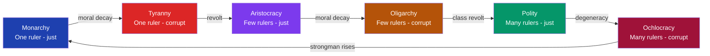

> [!abstract] TL;DR
> Classical political philosophy, developed by Greek and Roman thinkers from the 5th to 1st centuries BCE, provides the foundational vocabulary for every subsequent debate about justice, legitimacy, and the ideal state. Plato argued that only philosopher-kings who grasp the Form of the Good can govern justly; Aristotle countered that politics is empirical, constitutional change follows a predictable cycle (anacyclosis), and justice is proportional distribution. Cicero synthesized Greek theory with Roman practice through natural law and the res publica, while Thucydides' cold-eyed account of the Peloponnesian War established the realist tradition that power, not morality, drives interstate relations.

## Intuition

**Analogy:** Imagine a company cycling through leadership regimes — a visionary founder (monarchy) who dies and is replaced by a self-serving board (tyranny), then a council of senior engineers governs well (aristocracy) until they gradually protect only insiders (oligarchy), then employees seize democratic control (polity) which slowly degenerates into factional paralysis (mob rule), until a new charismatic leader emerges and the cycle restarts.

Plato watched Athenian democracy execute his mentor Socrates and concluded that popular rule was catastrophic. Aristotle dissected 158 actual constitutions and noticed that the cycle above was neither random nor inevitable — the right institutional design could break the loop. Cicero adapted this framework for Rome's republican tradition. Thucydides, writing a generation before Plato, looked at the same Athenian world and drew a colder conclusion: power, not wisdom or justice, ultimately determines political outcomes.

---

## How It Works

Aristotle's most important structural contribution — which Polybius later systematized as *anacyclosis* — is that constitutional forms are not static. Each of the three legitimate forms has a corresponding degenerate form, and corrupt rule tends to provoke violent reaction toward the next legitimate form, driving a cyclical pattern.



Aristotle's prescription for escaping the cycle: a **mixed constitution** that combines monarchical, aristocratic, and democratic elements so that no single mode can dominate long enough to corrupt. Rome, he thought, was the closest historical approximation.

---

## Key Concepts

### Secondary Level

**The Four Thinkers at a Glance**

| Thinker | Period | Core Text | Central Question |
|---------|--------|-----------|-----------------|
| Thucydides | ~460–400 BCE | *History of the Peloponnesian War* | What actually drives political events? |
| Plato | 428–348 BCE | *The Republic* | What is the ideal city-state? |
| Aristotle | 384–322 BCE | *Politics* | What constitutions actually work in practice? |
| Cicero | 106–43 BCE | *De Re Publica* | How do we justify political obligation? |

**Plato's Three Classes in the Kallipolis**

Plato's ideal city (kallipolis) maps directly onto the three parts of the soul:

| Soul Part | City Class | Function | Virtue |
|-----------|-----------|---------|-------|
| Reason | Philosopher-Rulers (Gold) | Govern with knowledge of the Good | Wisdom (sophia) |
| Spirit | Auxiliaries (Silver) | Defend the city | Courage (andreia) |
| Appetite | Producers (Bronze/Iron) | Feed and clothe the city | Temperance (sophrosyne) |

Justice (*dikaiosyne*) is when each class performs its own function and does not interfere with others — structural harmony, not individual rights.

**Aristotle's Six Constitutions**

| Number of Rulers | Just Form | Degenerate Form |
|-----------------|-----------|----------------|
| One | Monarchy | Tyranny |
| Few | Aristocracy | Oligarchy |
| Many | Polity (politeia) | Democracy (mob rule) |

Note: Aristotle used "democracy" pejoratively to mean unconstrained mob rule. His good many-rule form is "polity." Modern usage has reversed this convention; Polybius' later term "ochlocracy" for the degenerate form avoids the confusion.

**Man as Political Animal**

Aristotle's opening claim in the *Politics*: "Man is by nature a political animal (*zoon politikon*)." Unlike bees, humans form communities not merely for survival but to pursue *eudaimonia* (flourishing). A being without a polis is either a beast or a god. This is not just descriptive — it grounds political obligation: participation in civic life is required for full human development, not merely instrumental to it.

### Undergraduate Level

**Plato: The Theory of Forms and the Philosopher-King**

Plato's political theory rests on his epistemology. Most people live like prisoners in the *Allegory of the Cave*, mistaking shadows (appearances, conventions, opinions) for reality. Only philosophers, through decades of mathematical and dialectical training, can ascend to grasp the *Forms* — including the Form of the Good, which is to political knowledge what the Sun is to sight.

Because governance requires knowledge of the Good, and only philosophers possess it, they alone should rule — regardless of popular consent. This is not elitism for its own sake: Plato explicitly says that philosophers would prefer to remain in the sunlight (contemplating the Forms), but justice requires them to return to the cave and govern. The philosopher-king rules because they must, not because they want power.

The Republic proposes radical austerity within the guardian class: no private property, no nuclear family (child-rearing is communal), and female guardians are eligible on equal terms with males. These are instrumental measures to eliminate the conflicts of interest that corrupt rulers. A guardian who owns nothing has nothing to steal for.

**Plato's Constitutional Degeneration (Books VIII–IX)**

| Stage | Regime | Dominant Character | Cause of Decay |
|-------|--------|-------------------|---------------|
| 1 | Kallipolis | Philosopher-king | Eugenic miscalculation leads to inferior rulers |
| 2 | Timocracy | Honor-seeker (Spartan type) | Wealth begins to be valued over virtue |
| 3 | Oligarchy | Wealth-lover | Property qualifications replace honor; the poor excluded |
| 4 | Democracy | Appetite-driven | The poor overthrow the wealthy; freedom above all |
| 5 | Tyranny | Tyrant | Democratic excess produces its opposite; the demagogue seizes power |

Plato's sequence is soul-psychological — each regime is driven by the dominant psychological type of its rulers. Aristotle's anacyclosis is structural-institutional — driven by the interests and resentments of social classes.

**Aristotle: Phronesis and Distributive Justice**

*Phronesis* (practical wisdom) is Aristotle's central political virtue — neither the abstract knowledge of Platonic Forms nor mere rule-following, but the cultivated capacity to perceive what justice requires *in this specific situation*. Good governance cannot be algorithmic; it requires experienced judgment formed through habit and action. This is why Aristotle distrusts the philosopher-king model: political wisdom is practical, not contemplative.

**Distributive justice** for Aristotle: just distribution is proportional to relevant merit (*analogia*). If A contributes twice what B contributes to a common venture, A deserves twice the reward. This is formal justice — it says distributions should be proportional to some criterion of merit, but leaves open what that criterion is. Aristotle notes it depends on the regime: honor in aristocracy, wealth in oligarchy, free birth in democracy. The question of *which criterion is correct* is the deepest political question.

**Cicero: Natural Law and Res Publica**

Cicero, drawing on Stoic philosophy, argues that there is a natural law — reason embedded in the cosmos — that is universal, eternal, and not made by human legislators. Positive laws that violate natural law are not really laws at all. *Lex iniusta non est lex* ("an unjust law is no law") — a formula that Augustine, Aquinas, and later Martin Luther King Jr. would invoke across centuries.

*Res publica* (the republic / commonwealth) is for Cicero literally *res populi* — the property of the people. A state that serves only the ruler's interest is not a republic; it is a tyranny. The public interest (*utilitas communis*) is the criterion of legitimate government — the foundational claim that all subsequent republican theory inherits.

Cicero also advocated the **mixed constitution** — combining the consul (monarchical element), the Senate (aristocratic element), and the popular assemblies (democratic element) — arguing, following Polybius, that this balance prevented any one element from corrupting the whole.

**Thucydides: Power, Interest, and the Melian Dialogue**

Thucydides is the founder of political realism. His explanation for the Peloponnesian War: "The growth of the power of Athens, and the alarm which this inspired in Sparta, made war inevitable." Moral claims are epiphenomenal — the real driver is the security dilemma: two powers cannot both feel secure when either grows.

The **Melian Dialogue** (Book 5.85–113) is the locus classicus of realism: Athenian generals tell the neutral island of Melos that justice exists only between equals in power. "The strong do what they can and the weak suffer what they must." When Melos appeals to honor and the gods, the Athenians reply that gods themselves follow necessity. Athens destroys Melos.

Thucydides does not endorse this — Athens' ruthlessness is immediately followed by the catastrophic Sicilian Expedition (415–413 BCE) and eventual defeat. The narrative structure implies that pure-power reasoning is strategically self-defeating: moral blindness is also strategic blindness.

### Graduate Level

**The Epistemological Fault Line: Plato vs. Aristotle**

The deepest disagreement between Plato and Aristotle concerns the *source* of political knowledge. For Plato, political knowledge is a priori — derived from the Forms by pure reason, independent of historical observation. Constitutional design is a techne (craft): as medicine applies knowledge of health, politics applies knowledge of the Good. The constitution should be designed by those who *know*, not ratified by those who *want*.

For Aristotle, political knowledge is empirical and contextual. The *Politics* opens with a study of 158 actual constitutions. Political science (politike episteme) infers from historical patterns. This is why Aristotle's recommendations are probabilistic and contextual: democracy works better in some cities than others; the best constitution for a given city depends on its social structure, economy, and history.

This fault line runs through all subsequent political philosophy. Rationalist approaches (Rousseau's general will, Rawls's original position, modern technocracy) follow Plato. Empiricist and historical approaches (Montesquieu, Burke, Hayek, Oakeshott) follow Aristotle.

**Cicero and the Foundation of International Law**

Roman jurists distinguished *ius civile* (Roman citizens' law), *ius gentium* (law common to all peoples from commercial practice), and *ius naturale* (natural law). Cicero's claim that natural law is universal and knowable by reason alone gave ius gentium a philosophical foundation: these rules bind not because Rome decreed them but because any rational being can recognize their justice.

Hugo Grotius (*De Jure Belli ac Pacis*, 1625) built modern international law directly on this Ciceronian foundation, and crucially argued that natural law would bind states "even if God did not exist" — completing the secularization of a framework Cicero had left partly theological. Grotius' natural law → Vattel's law of nations → the UN Charter is a direct intellectual lineage.

**The Social Contract Bridge**

Classical political philosophy did not produce social contract theory — but it provided the vocabulary that made it possible.

- **Hobbes** (*Leviathan*, 1651): adopts the Thucydidean premise (the natural condition is competitive and dangerous — the war of all against all) but rejects Aristotle's claim that humans are naturally political. The social contract creates sovereign authority as an escape from the state of nature. Legitimacy derives from consent born of fear, not from natural law or knowledge of the Good.

- **Locke** (*Second Treatise*, 1689): adopts Cicero's natural law (pre-political rights to life, liberty, and property) and makes government's legitimacy conditional on protecting those rights. Revolution is justified when natural law is violated — an explicit Ciceronian principle extended to a right of resistance.

- **Rousseau** (*Social Contract*, 1762): adopts Aristotle's claim that genuine freedom is participation in collective self-governance and radicalizes it into the *volonté générale* (general will). The republic is the entire citizenry acting as philosopher-king collectively — a democratization of the Platonic ideal.

**Distributive Justice Across Traditions**

Aristotle's principle that just distribution is proportional to relevant merit anticipates two modern debates:

1. *What is the relevant criterion?* — Rawls (1971) argues the criterion should be determined behind a veil of ignorance (ignorance of one's social position), yielding the difference principle. Nozick (1974) argues historical entitlement is the only valid criterion. Both are working within Aristotle's formal framework while giving opposing answers to the substantive question he left open.

2. *Distributive vs. corrective justice* — Aristotle distinguished distributive justice (proportional allocation of benefits) from corrective justice (restoring equality after a wrong). Modern tort law, antitrust remedies, and reparations debates all operate within this dichotomy, typically without citing its classical source.

---

## Python Demo

```python
import numpy as np
import matplotlib.pyplot as plt
import matplotlib.patches as mpatches

# Aristotle / Polybius anacyclosis as a Markov chain
# States: 0=Monarchy, 1=Tyranny, 2=Aristocracy, 3=Oligarchy, 4=Polity, 5=Ochlocracy
states = ["Monarchy", "Tyranny", "Aristocracy", "Oligarchy", "Polity", "Ochlocracy"]
colors = ["#1e40af", "#dc2626", "#7c3aed", "#b45309", "#059669", "#9f1239"]

# Row-stochastic transition matrix [from_state, to_state]
# Good constitutions: high stability with some drift to their corrupt twin
# Corrupt constitutions: mostly transition to the next good form by overthrow
P = np.array([
    [0.70, 0.30, 0.00, 0.00, 0.00, 0.00],  # Monarchy -> stays | decays to Tyranny
    [0.00, 0.10, 0.90, 0.00, 0.00, 0.00],  # Tyranny -> rarely stable | overthrown to Aristocracy
    [0.00, 0.00, 0.65, 0.35, 0.00, 0.00],  # Aristocracy -> stays | decays to Oligarchy
    [0.00, 0.00, 0.00, 0.10, 0.90, 0.00],  # Oligarchy -> rarely stable | class revolt -> Polity
    [0.00, 0.00, 0.00, 0.00, 0.60, 0.40],  # Polity -> stays | degenerates to Ochlocracy
    [0.85, 0.00, 0.00, 0.00, 0.00, 0.15],  # Ochlocracy -> strongman rises | rarely stable
])

# Simulate for 300 "generations"
rng = np.random.default_rng(42)
n_steps = 300
state = 0  # start at Monarchy
history = [state]
for _ in range(n_steps - 1):
    state = rng.choice(len(states), p=P[state])
    history.append(state)

# Stationary distribution via left eigenvector of P (eigenvalue = 1)
eigenvalues, eigenvectors = np.linalg.eig(P.T)
idx = np.argmin(np.abs(eigenvalues - 1.0))
stationary = np.real(eigenvectors[:, idx])
stationary /= stationary.sum()

fig, axes = plt.subplots(1, 2, figsize=(14, 5))

# Left panel: constitutional history as a color-coded timeline
ax1 = axes[0]
for i, s in enumerate(history):
    ax1.bar(i, 1, color=colors[s], width=1.0, linewidth=0)
ax1.set_xlim(0, n_steps)
ax1.set_yticks([])
ax1.set_xlabel("Generation")
ax1.set_title("Anacyclosis: 300 Generations of Constitutional Change")
patches = [mpatches.Patch(color=colors[i], label=states[i]) for i in range(6)]
ax1.legend(handles=patches, loc="upper right", fontsize=8, ncol=2)

# Right panel: long-run stationary distribution
ax2 = axes[1]
ax2.bar(states, stationary, color=colors)
ax2.set_ylabel("Long-run probability")
ax2.set_title("Stationary Distribution of Constitutional Forms")
ax2.tick_params(axis="x", rotation=20)
for i, v in enumerate(stationary):
    ax2.text(i, v + 0.005, f"{v:.2f}", ha="center", fontsize=9)

plt.tight_layout()
plt.savefig("anacyclosis_markov.png", dpi=120)
plt.show()
print("Stationary distribution:", dict(zip(states, np.round(stationary, 3))))
```

The stationary distribution reveals which constitutional forms dominate the long run given the transition dynamics. Good constitutions (Monarchy, Aristocracy, Polity) have longer expected tenures; corrupt forms are transient. The model can be calibrated with empirical data from Polity IV or V-Dem datasets to test the anacyclosis hypothesis against historical constitutional transitions.

---

## Real-World Applications

**1. The US Constitution as mixed constitution.** Madison in *Federalist No. 10* and *No. 51* explicitly modeled the American system on Polybius' analysis of Rome: the President (monarchical element), the Senate (aristocratic element), and the House (democratic element) check each other to prevent factional capture. Madison's argument that an extended republic controls faction is a direct application of Aristotle's point that a larger, more heterogeneous polity is harder to capture by any single faction.

**2. Thucydides Trap and US-China relations.** Political scientist Graham Allison (2017) coined "Thucydides Trap" for the structural tendency toward war when a rising power threatens a dominant power. Of 16 such case studies in the past 500 years, 12 ended in war. The Melian Dialogue's logic — structural rivalry overrides moral reasoning — is invoked in contemporary realist analyses of great-power competition, from Mearsheimer to Kissinger.

**3. EU technocracy as Platonic governance.** The European Union's institutional architecture — an unelected Commission with legislative initiative, expert-driven regulatory agencies, courts that can override member-state parliaments — reflects a Platonic conviction that complex technical governance is best left to those with demonstrated expertise, not subjected to majoritarian fluctuation. Brexit and the broader Eurosceptic reaction represent the Aristotelian counter-argument: sustainable legitimacy requires ongoing popular consent, not just demonstrable competence.

**4. Distributive justice in antitrust and constitutional law.** Aristotle's proportionality principle runs through modern law: antitrust fines proportional to market harm, progressive taxation proportional to ability to pay, and debates over affirmative action all invoke the underlying question Aristotle formalized — what criterion of merit is relevant for this particular distribution? The legal question is always prior to the mathematical one.

---

## Common Pitfalls

- **"Plato advocated communism"** — Plato's abolition of private property and nuclear family applies only to the guardian class (rulers and soldiers), not to the producing majority. It is an anti-corruption device for those in power, not a general economic programme. Conflating it with Marxist communism ignores Plato's explicit class hierarchy and his conviction that the productive class should be privately motivated.

- **"Aristotle opposed democracy"** — Aristotle opposed *democracy* in his technical sense: unconstrained rule of the poor majority optimizing for their own faction. His preferred form, *polity*, is a mixed constitution that prominently includes democratic elements (popular election of magistrates, accountability mechanisms). He is an opponent of unbalanced populism, not of popular participation per se.

- **"The Melian Dialogue states Thucydides' own view"** — Thucydides presents the Athenian generals' argument in reported speech without endorsing it. Athens' destruction of Melos in 416 BCE is immediately followed by the catastrophic Sicilian Expedition (415–413 BCE), which ends in total Athenian defeat. The narrative structure implies that pure-power logic is strategically self-defeating — hubris precedes nemesis.

- **"Natural law theory is inherently religious"** — Cicero grounds natural law in *ratio* (reason) shared by all rational beings, not in divine command. The structure is explicitly secular: rational beings can identify natural law through reason alone, independent of revelation. Grotius' 1625 formulation — natural law would bind even if God did not exist — merely made explicit what was already implicit in Cicero.

---

## Related Concepts

- [[_MOC_Political_Theory_and_Ideologies|↑ Political Theory MOC]]
- [[Moral_Development]] — Kohlberg's postconventional moral stages (Stage 5: social contract reasoning, Stage 6: universal ethical principles) are structural descendants of Cicero's natural law and Aristotle's virtue ethics; the developmental sequence from conventional rule-following to principled reasoning mirrors the Platonic ascent from custom to Form.

- [[Group_Dynamics]] — Aristotle's analysis of how factions corrupt polities anticipates modern findings on groupthink and in-group/out-group dynamics; the oligarchic pathology — a small group optimizing for itself at the expense of the polis — is the institutional analog of group polarization and collective rationalization.

- [[Social_Influence_and_Conformity]] — Plato's Allegory of the Cave is one of the earliest systematic analyses of how social conformity traps people in shared epistemic illusions; the cave prisoners' hostility to the returning philosopher who tries to disrupt their consensus anticipates Asch's conformity experiments and Milgram's obedience studies.

- [[Public_Goods]] — Aristotle's collective-action problem (why should any individual contribute to the polis when they benefit from it regardless?) anticipates Samuelson's free-rider problem; Cicero's res publica is precisely a normative theory of when the existence of common goods justifies political authority and compulsory contribution.

- [[Nash_Equilibrium]] — The Melian Dialogue models a game with no mutually beneficial equilibrium under Athens' power constraints; Thucydides' repeated observations of alliance failures and defections prefigure the game-theoretic analysis of cooperation under anarchy in international relations theory.

- [[Repeated_Games_and_Folk_Theorems]] — Classical realism (Thucydides) and the folk theorem address the same question from different angles: under what conditions does sustained cooperation emerge among self-interested actors? Athens' empire collapse is a case study in defection spirals when the repeat-play constraint breaks down.

---

## Review Questions

### Secondary

1. Plato argues that philosophers should rule even though they would prefer not to. What is his reasoning, and why does he think this produces more just governance than democratic election by the citizenry?
2. Aristotle says that a human being outside a political community is "either a beast or a god." What does he mean? Is participation in political life part of what it means to be fully human, or merely a useful means to other ends?
3. Summarize the Melian Dialogue in your own words. Do you think the Athenians were strategically correct, morally justified, or both? What does Thucydides' subsequent narrative suggest about his own view?

### Undergraduate

1. Compare Plato's constitutional degeneration sequence (Books VIII–IX of the *Republic*) with Aristotle's anacyclosis. In what key respects do they differ, and what does that difference reveal about their underlying theories of political causation — psychological vs. structural?
2. Cicero claims that "an unjust law is no law" (*lex iniusta non est lex*). Evaluate this claim. What are its implications for civil disobedience? Does it make legal obligation purely conditional on compliance with natural law, and if so, who decides what natural law requires?
3. Both Plato and Aristotle hold that justice is proportional. Plato says justice is each person doing their assigned function; Aristotle says justice is receiving benefits in proportion to relevant merit. Are these the same view? If not, identify the fundamental disagreement and its practical political consequences.

### Graduate

1. The Platonic tradition in political philosophy tends to produce top-down governance by knowledge-holders (Leninism's vanguard party, EU technocracy, Rawlsian ideal theory). The Aristotelian tradition tends to produce bottom-up constitutionalism (common law, Burkean prescription, Hayekian spontaneous order). Trace this fault line through three post-classical political theorists (e.g., Hobbes, Burke, Rawls), showing where each owes an explicit or structural debt to one tradition.
2. Thucydides' historical method — inferring political regularities from closely observed events, separating stated causes from structural causes, and testing generalizations against multiple cases — is structurally similar to contemporary quantitative political science. Evaluate the claim that Thucydides is the first empirical political scientist, and identify two specific methodological moves in the *History* that anticipate modern causal inference.
3. Analyze Cicero's *res publica* concept as a proposed solution to Aristotle's problem of constitutional instability. Does grounding legitimate government in the common good provide a stable criterion for distinguishing legitimate from illegitimate regimes, or does it merely relocate the underlying dispute — moving it from "who should rule?" to "what is the common good?" — without resolving it?

---

## Sources

- Plato. *The Republic*. Trans. G.M.A. Grube, rev. C.D.C. Reeve. Hackett, 1992.
- Aristotle. *Politics*. Trans. C.D.C. Reeve. Hackett, 1998.
- Cicero. *De Re Publica / De Legibus*. Trans. N. Rudd. Oxford University Press, 1998.
- Thucydides. *History of the Peloponnesian War*. Trans. R. Warner. Penguin Classics, 1972.
- Strauss, Leo, and Joseph Cropsey, eds. *History of Political Philosophy*. 3rd ed. University of Chicago Press, 1987.

---

#PoliticalScience #PoliticalTheory #ClassicalPhilosophy
