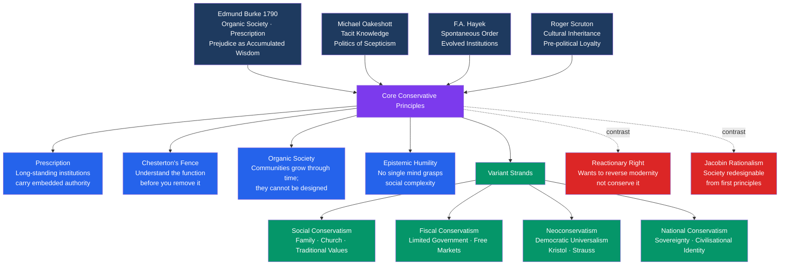

# Conservatism and Traditionalism

> [!abstract] TL;DR
> Conservatism is the political disposition that treats inherited institutions, customs, and practices as repositories of accumulated social wisdom, and insists that the burden of proof lies on those who would change them — not on those who would preserve them. Its intellectual foundation is not mere sentimentality but a deep epistemic claim: complex social systems encode knowledge no single generation could reconstruct from first principles, and revolutionary demolition destroys this knowledge before we can read it.

---

## Intuition

**Analogy:** You are handed a cathedral. It has strange arches, odd buttresses, and columns that seem to go nowhere. A rationalist consultant says: "This is inefficient — those buttresses serve no load-bearing purpose; we can remove them and save stone." A conservative engineer says: "We don't know why they are there yet. Before we remove them, we must understand what failure mode they were built to prevent."

This is Chesterton's Fence — perhaps the single most important conservative idea. G.K. Chesterton wrote: *"If you don't see the use of it, I certainly won't let you clear it away. Go away and think. Then, when you can come back and tell me that you do see the use of it, I may allow you to destroy it."*

The cathedral's buttresses are traditions, laws, customs, and institutions. Some were indeed useless ornament — but some were quietly preventing collapse. The conservative's core claim is that you cannot tell which is which without the very experience of having lived inside the tradition. Revolutionary reason, applied from outside the tradition, is epistemically blind to the functions it cannot directly observe.

---

## How It Works



---

## Key Concepts

### Secondary Level

**What does it mean to be "conservative"?**

At its simplest, conservatism is the preference for keeping things that work over replacing them with things that might work better. This is not laziness or ignorance. It is a considered response to the complexity of social life.

Consider a village that has fished a river for three hundred years. The elders insist on leaving one stretch fallow each season, for no reason anyone can articulate. A modern fisheries consultant calls this irrational and recommends full exploitation for maximum yield. The elders are overruled. Five years later, the fish population collapses. The fallow stretch was the spawning ground — the elders' "irrational" tradition had encoded ecological wisdom accumulated over generations that no individual could have derived from first principles.

**Burke versus the French Revolution.** When the French revolutionaries tore down the monarchy, aristocracy, church, and law all at once in 1789, Edmund Burke was horrified — not because he loved aristocrats, but because he understood that those institutions, however imperfect, formed the connective tissue of French social life. Removing everything simultaneously left nothing standing. "It is a presumption in favour of any settled scheme of government against any untried project," he wrote, "that a nation has long existed and flourished under it."

Burke's alternative was not "never change." It was: change slowly, preserving functions while updating forms. He admired the British Parliament's gradual, evolutionary reform. He supported American independence. What he opposed was the Jacobin delusion that you could redesign society the way you redesign a machine — by understanding its principles rationally and then rebuilding it from scratch.

**Chesterton's Fence — the conservative test.** Before removing any institution, law, or custom, ask: *Do I understand exactly why this was built?* If the answer is no, do not remove it yet. Investigate first. This is not a prohibition on change. It is a demand that reform be informed. The fence is an epistemological checkpoint, not a veto.

### Undergraduate Level

**Edmund Burke: the founding text**

Burke's *Reflections on the Revolution in France* (1790) establishes three foundational conservative concepts:

**Prescription.** Institutions that have survived and functioned over long periods accumulate a kind of practical authority that cannot be replicated by theoretical reasoning. This authority does not derive from consent theory or natural rights but from demonstrated performance over time. A constitution that has governed a people for centuries has been tested by reality in ways that a freshly-drafted one has not. Burke wrote: "The individual is foolish, but the species is wise." What no single mind could design, the accumulated choices of millions over generations have produced.

**Prejudice as wisdom.** Burke rehabilitated the concept of prejudice — not in the modern sense of racial bias, but in the sense of pre-reflective judgment, the inherited instincts and habits that guide behaviour without deliberate reasoning. Burke's claim was that these instincts often encode experience that conscious reason cannot access. A person who respects authority, family, and church without being able to articulate why may be tracking something real that the rationalist critique misses entirely. This is not anti-intellectualism; it is a claim about the limits of explicit reasoning relative to the kind of tacit knowledge embodied in custom.

**Organic society.** Society is not a social contract between atomistic individuals who could, in principle, exit it. It is an organic entity — a living structure that grows through time, embodying the accumulated choices of the dead and carrying obligations to the unborn. Burke's famous formulation: "Society is indeed a contract. Subordinate contracts for objects of mere occasional interest may be dissolved at pleasure — but the state ought not to be considered as nothing better than a partnership agreement in a trade of pepper and coffee...to be taken up for a little temporary interest, and to be dissolved by the fancy of the parties. It is a partnership in all science; a partnership in all art; a partnership in every virtue, and in all perfection. As the ends of such a partnership cannot be obtained in many generations, it becomes a partnership between the dead, the living, and those who are to be born."

**Michael Oakeshott: tacit knowledge and the limits of rationalism**

Oakeshott's *Rationalism in Politics* (1962) provides the philosophical underpinning that Burke's more rhetorical writing lacked.

Oakeshott distinguishes two kinds of knowledge: **technical knowledge** (explicit rules, formulas, techniques that can be written down and taught from a book) and **practical knowledge** (the tacit know-how that can only be acquired through participation, apprenticeship, and experience). Cooking from a recipe is technical knowledge; being a great chef is practical knowledge that the recipe can only approximately encode.

Politics, for Oakeshott, is overwhelmingly a domain of practical knowledge. The rationalist error is to believe that social problems can be solved by applying a **set of principles** derived a priori, independent of the specific tradition from which the rationalist operates. But the tradition is precisely what carries the practical knowledge that makes any political arrangement functional. A politician who arrives with a blueprint for a "rationally designed" society has, by definition, abandoned the only guide that actually knows what he is dealing with.

Oakeshott's conservative disposition therefore prefers **conversation to command**, the familiar to the theoretical, and the proven to the innovative. This is not reactionism — Oakeshott is not calling for the restoration of a golden past. He is insisting that change happen through the extension of existing tendencies rather than the imposition of an alien ideal.

**Hayek: spontaneous order and the knowledge problem**

F.A. Hayek's contribution to conservatism is indirect — Hayek explicitly called himself a liberal, not a conservative — but his argument about the **knowledge problem** provides the strongest epistemic case for conservative scepticism about central design.

Hayek's core insight: the information required to run a complex social system is dispersed across millions of individuals as tacit, local, context-dependent knowledge that cannot be gathered into any single centre. The price mechanism is not merely an allocative device; it is an information-processing system that aggregates and transmits this dispersed knowledge without requiring it to be articulated or centralized. Destroy the price mechanism — or any analogous social information-processing system — and you destroy the only way to coordinate the decisions of millions.

Applied conservatively: many traditional institutions (common law, property rights, religious communities, extended families) function as information-processing systems evolved over centuries to solve coordination problems. Their "design" cannot be reconstructed in a planning office. Reformers who replace them with centrally-designed alternatives substitute one generation's explicit reasoning for the aggregated practical wisdom of many generations — and typically produce worse outcomes.

**Hayek's tension with social conservatism:** Hayek's liberalism leads him to oppose the enforcement of traditional morality through the state — he opposes sodomy laws, drug prohibition, and paternalistic regulations as violations of individual liberty. This places him in direct tension with social conservatives who want the state to protect traditional family structures and religious norms. This tension between the "fiscal/libertarian right" and the "social/traditional right" is one of the persistent fault-lines within conservatism.

### Graduate Level

**Neoconservatism: Kristol, Strauss, and the turn to universalism**

Neoconservatism emerged in the 1970s from a group of American intellectuals — many former Trotskyists disillusioned with the New Left — who began migrating rightward. Irving Kristol's famous definition: "A neoconservative is a liberal who has been mugged by reality."

Neoconservatism differs from Burkean conservatism in a crucial respect: it is universalist. Where Burkean conservatism is deeply particularist (the traditions of *this* people, *this* history, *this* constitution are what matter), neoconservatism endorses an active foreign policy aimed at spreading liberal democratic institutions globally. Under the influence of Leo Strauss — who argued that political philosophy must be grounded in natural right rather than convention — neoconservatives believe that certain political arrangements are objectively better than others and should be promoted, by force if necessary.

This universalism is philosophically closer to the Jacobinism Burke opposed than to the Burkean conservatism it claims to inherit. The Iraq War (2003) represents neoconservatism's peak expression — and, for many conservatives, its refutation. The attempt to impose liberal democracy on a society with no institutional tradition of it produced precisely the kind of cascading failure that Burkean analysis would predict.

**Roger Scruton: oikophilia and pre-political loyalty**

Scruton provides perhaps the most philosophically coherent contemporary defence of conservatism. His central concept is **oikophilia** — love of home, of the familiar community and its forms of life — as the natural sentiment from which political attachment grows. Political obligation is not grounded in a social contract or universal rights, but in the pre-political bonds of community, territory, and shared history.

Scruton distinguishes sharply between conservatism and reaction. A reactionary wants to reverse history — to restore a lost golden age. A conservative wants to conserve what can still be conserved and reform what must change, guided by fidelity to the underlying social fabric. Scruton accepts that the market economy, constitutional government, and even some degree of multiculturalism are facts of modern life that must be worked with; what he opposes is the destruction of the inherited forms of cultural identity — common law, national language, religious calendar, the institutions of civil society — in the name of abstract universalism.

**Conservatism vs. the reactionary and fascist right**

A crucial distinction that conservative thinkers insist upon:

| | Conservatism | Reaction | Fascism |
|---|---|---|---|
| **Orientation to time** | Preserve the present's inherited past | Restore a lost past | Create a new future through will |
| **View of tradition** | Tradition as accumulated wisdom | Tradition as purity to be recovered | Tradition as myth instrumentalized for power |
| **View of change** | Gradual, informed, incremental | Reverse what has been changed | Total revolutionary transformation |
| **Epistemology** | Humble — social complexity exceeds reason | Nostalgic — the past was simply better | Rationalist/voluntarist — the will can remake society |
| **Attitude to institutions** | Cherish and reform | Purge and restore | Destroy and replace |
| **Key danger** | Defending bad institutions by default | Confusing oppression for tradition | State worship, violence, anti-liberalism |

The conservative critique of fascism is often missed: fascism is, at its core, a form of revolutionary politics. The Nazis did not preserve traditional German institutions — they destroyed them and replaced them with new party structures. Burke would have recognized Hitler as a Jacobin with a different flag.

**Haidt's moral foundations and the psychology of conservatism**

Jonathan Haidt's Moral Foundations Theory identifies six intuitive foundations of moral judgment: Care/Harm, Fairness/Cheating, Loyalty/Betrayal, Authority/Subversion, Sanctity/Degradation, and Liberty/Oppression. Across cultures, political liberals consistently emphasize Care and Fairness; conservatives draw on all six foundations, placing higher weight on Loyalty, Authority, and Sanctity.

This asymmetry explains why liberal reformers often fail to persuade conservatives: they argue from Care (this policy reduces suffering) while conservatives respond from Sanctity (this policy degrades something sacred) or Loyalty (this policy weakens the community). The arguments are not merely different conclusions from the same premises; they are different moral languages. Understanding this is prerequisite to any serious engagement with conservative political thought.

**Contemporary tensions and national conservatism**

The 2010s produced a new strand — national conservatism — that synthesizes Scruton's cultural conservatism with a stronger emphasis on national sovereignty, immigration restriction, and civilisational identity. Thinkers like Yoram Hazony argue that the nation-state is the natural, historically proven unit of political self-government, against both cosmopolitan liberalism and supranational institutions like the EU.

National conservatism represents a partial rejection of Hayekian free-market globalism — pointing out that globalization can destroy the cultural forms that give a community its coherence, in the same way that Chesterton's fence-breaking destroys hidden social functions. The tension between free trade (favoured by fiscal conservatives and Hayekians) and cultural protectionism (favoured by national conservatives) is the defining internal debate of conservatism today.

---

## Python Demo

```python
import numpy as np

# Chesterton's Fence: modelling hidden institutional interdependencies
# Institutions form a network of hidden dependencies.
# Revolutionary removal (random) vs. incremental reform (least-connected first)
# Measure: fraction of institutions remaining in the largest connected component.

np.random.seed(42)

N = 20        # number of institutions in the simulated society
DENSITY = 0.3  # probability of a hidden functional dependency between any two

# Build random undirected adjacency matrix (hidden interdependencies)
raw = (np.random.rand(N, N) < DENSITY).astype(int)
A_base = np.triu(raw, 1)
A_base = A_base + A_base.T  # symmetric, no self-loops


def largest_component_fraction(adj):
    """BFS: return size of largest connected component as fraction of N."""
    n = adj.shape[0]
    visited = np.zeros(n, dtype=bool)
    best = 0
    for start in range(n):
        if visited[start]:
            continue
        queue, size = [start], 0
        visited[start] = True
        while queue:
            node = queue.pop()
            size += 1
            for nb in np.where(adj[node] > 0)[0]:
                if not visited[nb]:
                    visited[nb] = True
                    queue.append(nb)
        best = max(best, size)
    return best / n


def remove_institutions(A, frac, strategy="random"):
    """
    Remove frac of institutions from the adjacency matrix.
    strategy='random'      : revolutionary — discard without understanding
    strategy='incremental' : reformist — remove least-connected first
    """
    A_copy = A.copy()
    n = A_copy.shape[0]
    n_remove = int(frac * n)
    removed = set()

    for _ in range(n_remove):
        if strategy == "random":
            available = list(set(range(n)) - removed)
            candidate = int(np.random.choice(available))
        else:
            # Incremental: remove least-integrated institution at each step.
            # Least-connected = fewest hidden dependencies = safest to remove.
            degrees = A_copy.sum(axis=1).astype(float)
            for r in removed:
                degrees[r] = float(n + 1)  # mask already-removed
            candidate = int(np.argmin(degrees))

        A_copy[candidate, :] = 0
        A_copy[:, candidate] = 0
        removed.add(candidate)

    return A_copy


print("Chesterton's Fence Simulation")
print("Fraction of society remaining in the largest functional cluster:\n")
print(f"{'Fraction':>10}  {'Revolutionary':>15}  {'Incremental':>13}")
print(f"{'removed':>10}  {'(random)':>15}  {'(reform)':>13}")
print("-" * 44)

for frac in [0.10, 0.20, 0.30, 0.40, 0.50]:
    np.random.seed(99)  # reproducible random removal at each fraction
    rev = largest_component_fraction(remove_institutions(A_base, frac, "random"))
    inc = largest_component_fraction(remove_institutions(A_base, frac, "incremental"))
    print(f"{frac:>10.0%}  {rev:>15.1%}  {inc:>13.1%}")

# Expected output (varies with seed/density):
# 10% removed:  revolutionary ~85-90%  |  incremental ~90-95%
# 30% removed:  revolutionary ~55-65%  |  incremental ~75-85%
# 50% removed:  revolutionary ~30-45%  |  incremental ~55-70%
#
# The gap widens with removal fraction: random removal
# destroys hidden links between highly-integrated institutions,
# cascading into network fragmentation. Incremental reform
# removes peripheral nodes first, preserving the core.
```

**What this demonstrates:** The institutions are a network with hidden interdependencies. The network encodes functions no single observer can read in full — exactly Burke's "prejudice as accumulated wisdom" and Hayek's "dispersed tacit knowledge." Random removal (the French Revolution approach) destroys highly-integrated nodes at the same rate as peripheral ones, causing network fragmentation to accelerate. Incremental reform (the Burkean approach) targets periphery first, probing the network's actual structure before touching its core. The performance gap widens as more is removed, because early random removals compromise exactly the hubs that hold everything else together.

---

## Real-World Applications

**Common Law vs. Civil Code.** The contrast between British common law (evolved incrementally through accumulated judicial decisions over centuries) and Napoleonic civil code (rationally designed and imposed all at once) is a canonical illustration. Common law embeds millennia of practical experience resolving disputes; civil code represents rationalist redesign. Both work, but common law typically handles novel cases better because it has more embedded context. The conservative preference is not for common law per se, but for the general principle: evolved systems often outperform designed ones.

**The Welfare State and Hayek's warning.** Post-WWII welfare states replaced dense networks of civil associations (friendly societies, mutual aid, church charities, trade guilds) with centralized state provision. Conservatives warned — and subsequent evidence partly confirmed — that destroying these civil associations removed the social fabric that the state bureaucracy could not replicate: informal monitoring, community pressure, stigma against free-riding. This is Chesterton's Fence applied to welfare policy.

**Constitutionalism and judicial review.** The counter-majoritarian character of constitutional courts — their ability to strike down democratic legislation — is a conservative institution. It embeds past consensus against present majorities. Edmund Burke would have approved: the wisdom of previous generations should constrain the enthusiasms of the current one.

**Brexit as conservative-traditionalist politics.** The Leave campaign deployed recognizably Burkean arguments: that the European Union's technocratic, supranational design had displaced the organic, historically evolved institutions of British parliamentary sovereignty. Whether or not one agrees with the conclusion, the *form* of the argument — organic community vs. rational design — is classically Burkean.

**Post-revolutionary failure patterns.** The French Revolution, Russian Revolution, and Cultural Revolution all exhibit the same structural failure: total institutional demolition followed by cascade. Burke predicted the French Terror before it happened. His mechanism: removing all institutions simultaneously destroys both the bad ones and the hidden load-bearing ones, leaving nothing on which to build new stability.

---

## Common Pitfalls

- **Confusing conservation with stasis** — Burke explicitly supported gradual reform; he opposed revolution, not change. A conservative who opposes all reform is a reactionary, not a Burkean. The Chesterton's Fence principle demands understanding before removal, not prohibition of removal.

- **Treating tradition as self-justifying** — the existence of a tradition does not prove it should be preserved. Slavery was a long-standing tradition; so was feudal serfdom. The conservative argument is an epistemic one: traditions carry embedded knowledge, but that knowledge may encode injustice as well as wisdom. The burden is to investigate, not to preserve blindly.

- **Conflating conservatism with the political right** — fiscal conservatism and social conservatism are distinct positions that often travel together politically but are logically independent. A consistent Hayekian (fiscal conservative) may be a social liberal. A national conservative may support substantial state intervention in the economy while opposing cultural liberalism.

- **Mistaking neoconservatism for Burkean conservatism** — neoconservatives are universalists who believe in spreading liberal democracy by force. Burke would have recognized this as Jacobinism with better public relations. The Iraq War is the clearest example of what happens when neoconservative universalism overrides Burkean epistemic humility about the limits of external institutional design.

- **The stability fallacy** — not every institution that has survived is adaptive; some survive because they are self-reinforcing, not because they are optimal. Patriarchal family structures, for example, long persisted not because they encoded dispersed social wisdom but because they were enforced by power asymmetries. Conservatism needs a theory for distinguishing adaptive traditions from merely entrenched ones — and this is the theoretical weak point most critics target.

---

## Related Concepts

- [[_MOC_Political_Theory_and_Ideologies|↑ Political Theory MOC]]
- [[Cognitive_Biases]] — Status quo bias and loss aversion (Kahneman/Tversky) give conservatism a psychological substrate: humans systematically overweight losses from change relative to gains, creating a rational-seeming attachment to the familiar that the conservative intellectual tradition attempts to justify at a deeper level.

- [[Social_Influence_and_Conformity]] — Normative social influence and the conformist pressures of group membership underpin the social reproduction of traditions; Asch's conformity findings show how individuals defer to group norms even against private judgment — the psychological mechanism through which traditions propagate.

- [[Moral_Development]] — Haidt's moral foundations theory, discussed in the Kohlberg critique, identifies the intuitive moral modules (Loyalty, Authority, Sanctity) that ground conservative moral cognition; conservative moral reasoning is not developmentally inferior to liberal reasoning but draws on a wider set of foundations.

- [[Evolutionary_Stable_Strategies]] — Hayek's spontaneous order maps onto ESS: institutions that persist over long evolutionary time periods are not necessarily optimal, but they are stable configurations that resisted invasion by alternatives; evolutionary game theory provides formal grounding for why evolved conventions outperform designed ones in complex environments.

- [[Repeated_Games_and_Folk_Theorems]] — Burkean institutions can be modelled as equilibria in infinitely-repeated games: cooperation norms, property rights, and reciprocity conventions are stable precisely because each party expects the relationship to continue; revolutionary destruction of institutions corresponds to defection in a repeated game that collapses cooperation.

---

## Review Questions

### Secondary

1. Explain Chesterton's Fence in your own words using an example from everyday life — a school rule, a traffic convention, or a family custom. How does this principle capture the core conservative instinct?
2. Why did Edmund Burke support American independence but oppose the French Revolution? Use his concept of "organic society" to explain the distinction.
3. What is the difference between a conservative and a reactionary? Why would a consistent Burkean oppose both reckless reform and the desire to restore a past golden age?

### Undergraduate

1. Oakeshott distinguishes technical knowledge from practical knowledge. Using this distinction, explain why Oakeshott believes that a political leader who arrives in office with a detailed policy blueprint is likely to fail — regardless of the blueprint's internal logic.
2. Hayek argues that market prices are not merely allocative but epistemological — they communicate dispersed tacit knowledge that no central authority can gather. Explain how this argument, originally made against socialist planning, becomes a conservative argument for preserving evolved social institutions.
3. Compare Burke's "prejudice as accumulated wisdom" with the modern cognitive-science concept of heuristics (fast, automatic judgments). In what ways does behavioural psychology vindicate Burke, and in what ways does it challenge him?

### Graduate

1. Neoconservatives argue that liberal democracy is a universal good that should be promoted by force when necessary. How does this universalism differ from, and arguably contradict, the Burkean conservatism that neoconservatives claim as intellectual heritage? Use the Iraq War as a case study.
2. Scruton grounds political obligation in pre-political loyalty — oikophilia, love of home — rather than in social contract theory or natural rights. What are the philosophical strengths and weaknesses of this account? Can it justify political obligation in multicultural or post-national societies?
3. The "stability fallacy" — the objection that many harmful institutions persist not because they encode wisdom but because they encode power — is conservatism's most serious theoretical weakness. How might a sophisticated Burkean respond? What test could distinguish adaptive traditions from merely entrenched ones, and does any conservative thinker provide a satisfactory answer?

---

## Sources

- [Edmund Burke's Criticism of the French Revolution — PolSci Institute](https://polsci.institute/western-political-thought/edmund-burke-criticism-french-revolution/)
- [Nature, Tradition, and Wisdom in Reflections on the Revolution in France — LitCharts](https://www.litcharts.com/lit/reflections-on-the-revolution-in-france/themes/nature-tradition-and-wisdom)
- [Michael Oakeshott on Rationalism in Politics — FEE](https://fee.org/articles/michael-oakeshott-on-rationalism-in-politics/)
- [Michael Oakeshott — Britannica](https://www.britannica.com/biography/Michael-Oakeshott)
- [Neoconservatism — Britannica](https://www.britannica.com/topic/neoconservatism)
- [The Meaning of Conservatism — Roger Scruton](https://www.roger-scruton.com/articles/330-the-meaning-of-conservatism)
- [Conservatism — Stanford Encyclopedia of Philosophy](https://plato.stanford.edu/entries/conservatism/)
- [Neoconservatism, Leo Strauss, and the Foundations for Liberty — Cato Unbound](https://www.cato-unbound.org/2011/03/11/douglas-b-rasmussen/neoconservatism-leo-strauss-foundations-liberty/)
- Edmund Burke — *Reflections on the Revolution in France* (1790)
- Michael Oakeshott — *Rationalism in Politics and Other Essays* (1962)
- F.A. Hayek — *The Constitution of Liberty* (1960)
- Roger Scruton — *The Meaning of Conservatism* (1980); *How to Be a Conservative* (2014)
- Jonathan Haidt — *The Righteous Mind* (2012)

---

#PoliticalScience #PoliticalTheory #Conservatism #Traditionalism #Burke #Oakeshott #Hayek #ChestertonsFence
