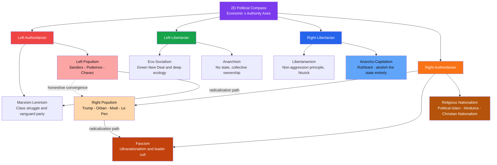

# Political Contemporary Political Ideologies

> [!abstract] TL;DR
> A political ideology is a coherent set of ideas about how power should be distributed and society organized; contemporary ideologies — nationalism, populism, fascism, Green politics, libertarianism, and religious political movements — are best mapped on a two-dimensional compass of economic and authority axes, and each carries a distinct theory of who "the people" are, who the enemy is, and what redemption looks like.

---

## Intuition

**Analogy:** Political ideologies are operating systems for societies.

Windows, macOS, and Linux represent radically different architectural philosophies about who controls the system, how resources are allocated, and how much users may customize their experience. Each runs on the same hardware — human beings, territory, scarce resources — but produces a fundamentally different environment. Some give maximum authority to the central kernel; others try to remove the kernel entirely. Some prioritize collective security over individual configuration; others do the reverse.

The analogy breaks down at exactly the right place: operating systems do not recruit users by appealing to their deepest fears and group identities. Political ideologies do. A fascist movement and a libertarian party both run on "human hardware," but they activate entirely different emotional and cognitive circuits — the fascist by invoking national humiliation and the promise of communal rebirth, the libertarian by invoking sovereign individual dignity and resentment of coercion. Understanding ideology therefore requires both intellectual analysis of its content and psychological analysis of its appeal.

---

## How It Works



---

## Key Concepts

### Secondary Level

**What is a political ideology?**

A political ideology is a relatively coherent system of beliefs that answers four questions: what are society's fundamental problems; who is responsible for them; what would the ideal social order look like; and what policies would bring it about? Ideologies simplify complex political reality into actionable worldviews. They serve a psychological function — providing certainty and group identity — as well as a practical one — coordinating collective action at scale.

**The one-dimensional spectrum and its failure**

The traditional left-right spectrum originated in the French National Assembly of 1789, where supporters of the king sat on the right and republicans on the left. Today "left" generally means economic equality and collective provision; "right" means tradition, property rights, and hierarchy. But this single axis is deeply misleading:

- A libertarian and a fascist are both labeled "right" on economic policy, yet are radically opposed on state authority
- A democratic socialist and a Leninist are both "left" economically, yet differ enormously on civil liberties

The **Political Compass** (developed from the Nolan chart tradition) adds a second axis: **authoritarian vs. libertarian**, measuring the degree of state power over personal behavior. Virtually every ideological family looks different when this second dimension is made explicit.

**Nationalism: the basics**

Nationalism is the belief that each nation — a people sharing culture, language, or history — deserves its own state, and that national interests should be the primary political concern. It is the most successful political ideology of the modern era: virtually every state on Earth is, at least nominally, organized as a nation-state.

Two broad variants:
- **Civic nationalism**: membership in the nation is defined by citizenship and shared political values, regardless of ethnicity. Associated with the French republican tradition and the American founding ideals
- **Ethnic nationalism**: membership is defined by descent, language, or blood. Associated with 19th-century German Romanticism and its 20th-century successors

**Populism: the basics**

Populism is a political style that divides society into "the pure people" and "the corrupt elite" and argues that politics should be the direct expression of the people's will. It is not a complete political program by itself — it always attaches to another ideology like a parasite to a host:
- **Left populism**: the corrupt elite = the rich, corporations, the IMF
- **Right populism**: the corrupt elite = cosmopolitan liberals, immigrants, EU technocrats

This is why Bernie Sanders and Viktor Orbán are both called populists despite sharing almost no policy overlap: they agree on the rhetorical form (pure people vs. corrupt elite) while disagreeing entirely on who fills each slot.

---

### Undergraduate Level

**Nationalism: Constructivist Accounts**

The dominant scholarly view today is *constructivism*: nations are not natural, ancient, or inevitable but historically constructed through specific modern mechanisms.

Ernest Gellner (*Nations and Nationalism*, 1983) argued nationalism is a product of industrial modernity. Agrarian societies tolerated cultural diversity because peasants and lords did not need a shared culture. Industrial societies require standardized mass literacy to function: workers must be able to read manuals, move between jobs, and communicate across regions. States therefore created "homogeneous" national cultures through mass education systems — nationalism is the *product* of the modernizing state, not its precondition.

Benedict Anderson (*Imagined Communities*, 1983) focused on the cultural mechanics. A nation is an "imagined community" because its members will never meet each other, yet in each member's mind lives the image of their communion. Anderson's key mechanism is **print capitalism**: when newspapers and novels began selling to a mass vernacular readership, readers across a territory began imagining themselves as part of a single simultaneous community. The nation is a cultural artifact of the age of print, not of primordial blood or soil.

Eric Hobsbawm and Terence Ranger (*The Invention of Tradition*, 1983) showed that many apparently ancient national traditions — the Scottish Highland kilt culture, Bastille Day, the British monarchy's ceremonial formality — were invented in the 18th and 19th centuries to create a sense of historical continuity that legitimized the new nation-state.

Will Kymlicka (*Multicultural Citizenship*, 1995) developed **liberal nationalism**: nations have a right to self-determination, and national minorities have group-differentiated rights within liberal democracies. His work navigates the tension between liberal individualism and the cultural embeddedness of persons.

**Populism: The Ideational Definition**

Cas Mudde and Cristóbal Rovira Kaltwasser (*Populism: A Very Short Introduction*, 2017) offer the standard academic definition: populism is "a thin-centered ideology that considers society to be ultimately separated into two homogeneous and antagonistic groups — 'the pure people' versus 'the corrupt elite' — and which argues that politics should be an expression of the *volonté générale* of the people."

Key analytical points:
- **Thin-centered**: populism addresses only part of the political agenda. It has no theory of economics, foreign policy, or culture by itself. It always needs a host ideology — nationalism on the right, socialism on the left
- **Moral cleavage**: the people/elite distinction is *moral*, not merely socioeconomic. The people are virtuous; the elite are corrupt. This moralism makes populism resistant to empirical counter-evidence
- **Manichean**: society is divided into exactly two homogeneous groups. Complexity, nuance, and individual variation within "the people" or "the elite" are suppressed
- **Democratic ambivalence**: populism can be a democratic corrective (giving voice to the marginalized) or a democratic threat (delegitimizing courts, media, and electoral rules as elite obstructions)

**Fascism: The Behavioral Definition**

Robert O. Paxton (*The Anatomy of Fascism*, 2004) argued that fascism cannot be understood as a coherent doctrine — it never had a founding text comparable to *The Communist Manifesto* or *The Wealth of Nations*. Instead, fascism must be understood **behaviorally** as a sequence of political stages.

Paxton's definition: fascism is "a form of political behavior marked by obsessive preoccupation with community decline, humiliation, or victimhood and by compensatory cults of unity, energy, and purity, in which a mass-based party of committed nationalist militants, working in uneasy but effective collaboration with traditional elites, abandons democratic liberties and pursues with redemptive violence and without ethical or legal restraints goals of internal cleansing and external expansion."

Key behavioral markers:
1. Obsession with national humiliation and victimhood — the "stab-in-the-back" narrative
2. A cult of action and violence as politically and spiritually redemptive
3. Extreme in-group solidarity against enemies *within* the nation
4. Contempt for parliamentary democracy and individual rights as obstacles
5. Glorification of the leader as the embodiment of national will
6. Corporatist economics: capital and labor collaborate under national direction rather than fighting class war

**Paxton's Five Stages of Fascism:**

| Stage | Description |
|---|---|
| **1. Movement creation** | Intellectual exploration of disillusionment with liberal democracy |
| **2. Rooting** | Fascism becomes a player amid political deadlock and polarization |
| **3. Seizure of power** | Conservatives invite fascists to share power as a bulwark against the left |
| **4. Exercise of power** | Fascism governs; traditional elites are gradually subordinated |
| **5. Radicalization or entropy** | Only Mussolini's Italy and Hitler's Germany completed this stage |

**Green Politics: Environmentalism vs. Ecologism**

Andrew Dobson (*Green Political Thought*, 1990) drew a crucial distinction:
- **Environmentalism**: manage the natural environment to sustain human economic growth — reform *within* capitalism
- **Ecologism**: a fundamental critique of the growth paradigm itself. Ecological crisis cannot be solved by "greener" capitalism; the industrial growth model must be superseded

Ecologism draws on:
- **Deep ecology** (Arne Naess, 1973): nature has intrinsic value independent of human utility; anthropocentrism is the root cause of ecological crisis. Naess distinguished "shallow ecology" (pollution management) from "deep ecology" (questioning the human-nature hierarchy)
- **Ecosocialism**: capitalism's structural drive for profit requires infinite growth on a finite planet; ecological and socialist critiques are inseparable; the Green New Deal is its most prominent recent expression

**Libertarianism: The Non-Aggression Principle**

Libertarianism holds that the only legitimate use of coercion is to prevent or punish violations of individual rights. This is the **non-aggression principle (NAP)**: no person or institution — including the state — may initiate force against another.

| Thinker | Position | Key Claim |
|---|---|---|
| **Robert Nozick** (*Anarchy, State, and Utopia*, 1974) | Minarchism | The minimal state protecting against violence and enforcing contracts is justified; taxation beyond this is illegitimate |
| **Murray Rothbard** (*For a New Liberty*, 1973) | Anarcho-capitalism | Even the minimal state is illegitimate; all state functions can be provided by voluntary market mechanisms |
| **F.A. Hayek** (*The Constitution of Liberty*, 1960) | Classical liberalism | Central planning destroys the information-processing mechanism of prices; liberty requires rule of law and limited government |

Nozick's critique of Rawls is central to libertarian political theory: even if the *procedure* by which wealth is distributed is just (free exchange, no fraud), the resulting *pattern* may be unequal — but that inequality is legitimate because it arose from just transactions.

**Religious Political Movements**

Religion as a source of political organization is not a historical relic — it is a growing force in 21st-century politics.

*Political Islam*: the belief that Islamic law should be the basis for political governance. Ranges from democratic participation (Tunisia's Ennahda) to revolutionary transformation (Khomeini's *velayat-e faqih* — governance of the Islamic jurist — institutionalized in Iran's constitution after 1979) to jihadist movements that reject the state system entirely. Hassan al-Banna (Muslim Brotherhood, founded 1928) and Sayyid Qutb (*Milestones*, 1964) provide foundational texts.

*Hindutva*: the Indian political movement asserting that India's national identity is fundamentally Hindu. Theorized by V.D. Savarkar (*Hindutva: Who Is a Hindu?*, 1923) and institutionalized through the RSS organization (founded 1925) and the political vehicle BJP, which has governed India since 2014 under Narendra Modi.

*Christian nationalism* (US context): the belief that the United States was founded as a Christian nation and that its laws should reflect Christian values. Sociologists Andrew Whitehead and Samuel Perry (*Taking America Back for God*, 2020) distinguish it from ordinary religiosity — it is a distinct ideology combining Christian identity with nativist and authoritarian political dispositions.

---

### Graduate Level

**The Authoritarian Personality and Political Psychology**

Theodor Adorno and colleagues (*The Authoritarian Personality*, 1950) proposed that fascist appeal is rooted in a psychodynamic character structure — the **F-scale** (fascism scale) measuring: submission to authority, aggression toward out-groups sanctioned by authorities, adherence to conventional norms, anti-intraception (hostility to introspection), and superstition or rigid categorical thinking.

Modern political psychology has largely moved away from the strict psychoanalytic framework but retained the core insight. Bob Altemeyer's **Right-Wing Authoritarianism** (RWA) construct (1996) — operationalized through survey rather than projective techniques — identifies three correlated attitudes: authoritarian submission, authoritarian aggression, and conventionalism. RWA predicts support for authoritarian leaders, hostility to minority groups, and rejection of democratic norms.

Jim Sidanius and Felicia Pratto's **Social Dominance Orientation** (SDO) is a related but distinct construct: preference for group-based social hierarchies. High-SDO individuals support ideologies that legitimize hierarchy — nationalism, racism, sexism — regardless of whether they personally occupy the dominant group.

These constructs connect ideological preferences to personality structures, suggesting that purely policy-focused political persuasion is insufficient; ideology engages deep emotional and identity-based cognition. This psychology is directly continuous with social identity theory's account of in-group favoritism covered in [[Prejudice_and_Discrimination]], and with the group polarization mechanisms covered in [[Group_Dynamics]].

**The Horseshoe Theory: Debate and Critique**

The **horseshoe theory** (Jean-Pierre Faye, *Théorie du récit*, 1972) proposes that the political spectrum resembles a horseshoe rather than a straight line: the far left and far right are closer to each other than either is to the liberal democratic center. Faye observed the Weimar Republic, where the KPD (Communist) and NSDAP (Nazi) parties sometimes found tactical common ground against the liberal Weimar center — the phenomenon of "red-brown" alliances.

*Arguments for the horseshoe reading:*
- Both extremes use anti-democratic rhetoric and reject liberal proceduralism
- Both exhibit paramilitary street politics and glorify direct action
- Historical National Bolshevism (Strasserism) and some anti-globalization coalitions blend left and right elements
- Both extremes tend to converge against the liberal center in foundational constitutional moments

*Critiques of horseshoe theory:*
- **Equates tactics with values**: antifascist violence and fascist violence have radically different moral content and structural consequences; the horseshoe conflates them
- **Centrist bias**: the theory implicitly legitimizes the liberal center and delegitimizes radical critique from any direction; it serves the political agenda of the moderate establishment
- **Norberto Bobbio** (*Left and Right: The Significance of a Political Distinction*, 1994) argues the distinction remains substantively meaningful: the left is defined by commitment to reducing inequality; the right by acceptance of natural or social hierarchy. This is not a symmetrical difference that collapses at the extremes
- The horseshoe confuses movements that fight oppression with movements that reinforce it; this is not a neutral analytical error

Contemporary political scientists largely treat horseshoe theory as journalistic rather than analytically rigorous: it may capture specific historical moments of anti-centrist tactical convergence without establishing any deeper structural equivalence.

**Chantal Mouffe, Agonistic Democracy, and the Conditions of Populism**

Chantal Mouffe (*For a Left Populism*, 2018) offers a structural account of why populism resurged in the 21st century. The post-political "third way" consensus of the 1990s — Blair, Clinton, Schröder — depoliticized genuine antagonisms by treating political questions as technical problems requiring expert management rather than genuine democratic choices. By suppressing the left-right distinction and presenting the neoliberal settlement as the natural end-state of history, mainstream center-left and center-right parties created an affective vacuum: citizens felt their fundamental grievances had no legitimate political outlet.

Right-wing populism filled that vacuum precisely because it offered what the technocratic center would not: a genuine friend-enemy distinction, a named enemy, and a collective identity with real emotional stakes.

Mouffe's prescription — a **left populism** that contests right-wing populism on its own terrain — proposes constructing a political frontier around a "people" defined by egalitarian and democratic values rather than ethnicity. Critics argue this risks reproducing the anti-pluralist logic it opposes: constructing a frontier always means defining an enemy, and Mouffe's framework provides no internal check against that frontier hardening into the Manichean moralism she claims to oppose.

**Ernesto Laclau's Theory of Populist Reason**

Laclau (*On Populist Reason*, 2005) provided the theoretical foundations for Mouffe's political project. Populism for Laclau is not a pathology or a deficiency but the *primary* form of political identity construction. Politics always involves the construction of a "people" through **chains of equivalence**: disparate social demands (for housing, healthcare, dignity, representation) are linked together by a single signifier ("the people," "the 99%," "the forgotten majority") that stands in for all of them against a common antagonist.

This framework explains why populism can attach to radically different host ideologies: the same formal structure — chains of equivalence against a constitutive outside — can construct very different "peoples" depending on which demands are linked and how the enemy is defined.

**Techno-Futurism as an Emerging Ideological Formation**

A distinctly 21st-century development: Silicon Valley has produced an ideological ecosystem that does not map cleanly onto the traditional compass.

- **Effective Altruism (EA)**: utilitarian movement focused on maximizing impartially calculated good. Politically disruptive — challenges conventional left-right categories by applying quantitative rationalism to moral questions. Led to **longtermism**: the view that the most important political questions concern the long-run future of civilization and the risk of extinction
- **Accelerationism (e/acc)**: the belief that technological and economic acceleration is inherently liberatory — constraints on AI, biotech, and market forces should be minimized or eliminated. Intersects with anarcho-capitalism but adds a techno-utopian vision of transcendence beyond current human limitations
- **TESCREAL bundle** (Émile Torres and Manon Revel): a cluster — Transhumanism, Extropianism, Singularitarianism, Cosmism, Rationalism, Effective Altruism, Longtermism — identified as a coherent ideological bloc with significant institutional power in the tech sector, sharing assumptions about the tractability of the future, the priority of existential risk, and the legitimacy of technocratic expertise

These movements illustrate that ideological innovation continues: the 2D political compass, while far more useful than the 1D spectrum, may itself be insufficient to locate ideological formations that challenge the nation-state as the primary unit of politics.

---

## Python Demo

```python
import matplotlib.pyplot as plt

# Ideology positions on the 2D political compass
# x-axis: economic dimension  (-1 = far left,  +1 = far right)
# y-axis: authority dimension (-1 = libertarian, +1 = authoritarian)
ideologies = [
    ("Marxism-Leninism",      -0.85,  0.85),
    ("Left Populism",         -0.55,  0.30),
    ("Eco-Socialism",         -0.50, -0.40),
    ("Anarchism",             -0.75, -0.85),
    ("Social Democracy",      -0.30, -0.05),
    ("Libertarianism",         0.70, -0.80),
    ("Anarcho-Capitalism",     0.90, -0.90),
    ("Classical Liberalism",   0.35, -0.30),
    ("Conservatism",           0.40,  0.25),
    ("Right Populism",         0.50,  0.65),
    ("Fascism",                0.30,  0.92),
    ("Christian Nationalism",  0.45,  0.78),
    ("Political Islam",       -0.10,  0.88),
]

colors = {
    "Marxism-Leninism":      "#ef4444",
    "Left Populism":         "#f87171",
    "Eco-Socialism":         "#16a34a",
    "Anarchism":             "#4ade80",
    "Social Democracy":      "#86efac",
    "Libertarianism":        "#2563eb",
    "Anarcho-Capitalism":    "#60a5fa",
    "Classical Liberalism":  "#93c5fd",
    "Conservatism":          "#fdba74",
    "Right Populism":        "#f97316",
    "Fascism":               "#c2410c",
    "Christian Nationalism": "#b45309",
    "Political Islam":       "#d97706",
}

fig, ax = plt.subplots(figsize=(11, 9))

# Quadrant shading
ax.fill_betweenx([-1, 0], -1, 0, alpha=0.07, color="red")
ax.fill_betweenx([ 0, 1], -1, 0, alpha=0.07, color="red")
ax.fill_betweenx([-1, 0],  0, 1, alpha=0.04, color="blue")
ax.fill_betweenx([ 0, 1],  0, 1, alpha=0.04, color="orange")

# Reference axes
ax.axhline(0, color="gray", lw=0.8, ls="--", alpha=0.6)
ax.axvline(0, color="gray", lw=0.8, ls="--", alpha=0.6)

# Plot each ideology and build coordinate lookup
coord = {}
for name, x, y in ideologies:
    c = colors.get(name, "gray")
    ax.scatter(x, y, color=c, s=130, zorder=5, edgecolors="white", linewidths=0.5)
    ax.annotate(name, (x, y), fontsize=8.2, xytext=(5, 4),
                textcoords="offset points", color="#111827")
    coord[name] = (x, y)

# Arrows showing radicalization paths and the horseshoe convergence
transitions = [
    ("Left Populism",  "Marxism-Leninism", "#dc2626"),   # left radicalization
    ("Right Populism", "Fascism",          "#c2410c"),   # right radicalization
    ("Left Populism",  "Right Populism",   "#7c3aed"),   # horseshoe convergence
]
for src, dst, col in transitions:
    x1, y1 = coord[src]
    x2, y2 = coord[dst]
    ax.annotate("", xy=(x2, y2), xytext=(x1, y1),
                arrowprops=dict(arrowstyle="->", color=col, lw=1.6))

# Quadrant labels
ax.text(-0.97,  0.90, "Left-Auth",  fontsize=9, color="#dc2626", style="italic", alpha=0.8)
ax.text(-0.97, -0.97, "Left-Lib",   fontsize=9, color="#16a34a", style="italic", alpha=0.8)
ax.text( 0.53,  0.90, "Right-Auth", fontsize=9, color="#f97316", style="italic", alpha=0.8)
ax.text( 0.53, -0.97, "Right-Lib",  fontsize=9, color="#2563eb", style="italic", alpha=0.8)

ax.set_xlim(-1.1, 1.1)
ax.set_ylim(-1.1, 1.1)
ax.set_xlabel("Economic Axis  (Left  <-->  Right)", fontsize=11)
ax.set_ylabel("Authority Axis  (Libertarian  <-->  Authoritarian)", fontsize=11)
ax.set_title("Contemporary Political Ideologies: 2D Compass", fontsize=13, fontweight="bold")
plt.tight_layout()
plt.savefig("political_compass.png", dpi=150)
plt.show()
```

---

## Real-World Applications

> **Hungary under Orbán (2010–present)**: the canonical case of right populism transitioning toward competitive authoritarianism. Viktor Orbán's Fidesz combines ethnic Hungarian nationalism, anti-EU populism (the corrupt elite = Brussels bureaucrats and George Soros), and systematic dismantling of liberal democratic institutions — court-packing, media capture, gerrymandering, NGO crackdowns. Political scientist Steven Levitsky terms it "autocratization by a thousand cuts." It illustrates that democratic backsliding does not require a military coup: it can be achieved through electoral politics and formal legal procedures, which exposes a central vulnerability in constitutionalism.

> **German Greens and the Energiewende**: Germany's Green Party went from extra-parliamentary protest movement (founded 1983) to junior coalition partner governing Germany (2021 election). The internal tension between "Fundis" (fundamentalists wanting ecosocialist transformation) and "Realos" (pragmatists willing to govern within capitalism) mirrors the broader ecologism vs. environmentalism debate in action. Germany's Energiewende (energy transition) is the most ambitious real-world implementation of Green politics — and its difficulties (coal remained a significant source into the 2020s; electricity prices rose sharply) illustrate the trade-offs between transformative ambition and governing constraints.

> **Iran's Islamic Revolution (1979)**: Khomeini's *velayat-e faqih* — supreme political authority belongs to the supreme Islamic jurist — is the most consequential implementation of political Islam in state form. It established a hybrid system: elected institutions operating under the authority of an unelected supreme leader. The post-2009 suppression of the Green Movement and the post-2022 crackdown on "Woman, Life, Freedom" protests demonstrate how theocratic governance tends toward authoritarian consolidation when its legitimizing ideology is contested by the population it rules.

> **US Libertarian Party and the minarchist-anarcho-capitalist split**: The LP has been internally divided since its founding between Nozickian minarchists (a minimal state for defense and contract enforcement is justified) and Rothbardian anarcho-capitalists (any state is illegitimate). This split is not merely tactical: it reflects a genuine philosophical disagreement about whether the non-aggression principle entails the abolition of the state or merely its radical reduction. The split recurs whenever the party must decide whether to govern (minarchist logic) or to act as a principled protest movement (anarcho-capitalist logic).

---

## Common Pitfalls

- **Conflating populism with fascism** — populism is a thin-centered ideology compatible with democratic values and civil liberties; fascism requires the explicit embrace of violence and the rejection of democratic pluralism. Trump is a populist; Mussolini was a fascist. Confusing them obscures both and prevents accurate diagnosis of democratic risk.

- **The one-dimensional spectrum trap** — describing any ideology only as "left" or "right" generates category errors. An anarcho-capitalist (economically far right, politically libertarian) and a fascist (economically ambiguous, politically authoritarian) are both labeled "right-wing" but share virtually nothing. Locate ideologies on both axes.

- **Treating ideological labels as stable across national contexts** — "liberal" in the United States (center-left, pro-welfare state) means almost the opposite of "liberal" in continental Europe or Australia (pro-free-market, classical liberalism). "Libertarian" in French political discourse often means libertine. Labels cannot be transferred across national contexts without examination.

- **The horseshoe fallacy** — observing that antifascists and fascists both use street violence does not make them morally equivalent or structurally similar. Tactics are not values. The horseshoe conflates surface behavioral patterns with the deep ideological goals those behaviors serve.

- **Treating nationalism as inherently right-wing** — civic nationalism is compatible with liberal values; several major left-wing liberation movements have been strongly nationalist: Amilcar Cabral's African nationalism in Guinea-Bissau, Ho Chi Minh's Vietnamese nationalism, the ANC's South African nationalism. The ideological content of nationalism depends entirely on who is constructed as "the nation" and what the national project is.

- **Treating religious politics as a unified bloc** — political Islam ranges from democratic participation (Ennahda in Tunisia) to revolutionary theocracy (Iran) to apocalyptic jihadism (ISIS). Christian nationalism in Norway looks entirely different from Christian nationalism in the United States. Treating "religious politics" as a single movement generates systematic analytical errors.

---

## Related Concepts

- [[_MOC_Political_Theory_and_Ideologies|↑ Political Theory MOC]]
- [[Prejudice_and_Discrimination]] — Social Identity Theory and in-group/out-group dynamics are the psychological mechanism underlying nationalist movements; the contact hypothesis is the most well-supported empirical intervention against ethnic nationalism
- [[Group_Dynamics]] — Group polarization is the mechanism by which ideological communities radicalize over time; groupthink explains how movements suppress internal dissent; deindividuation explains crowd behavior in mass political mobilization
- [[Social_Influence_and_Conformity]] — Conformity and obedience are the micro-level mechanisms that explain how ordinary people participate in authoritarian and fascist regimes; Milgram and Zimbardo are directly relevant to understanding how ordinary citizens comply with ideological directives
- [[Attitudes_and_Persuasion]] — Attitude formation and change; why ideological conversion is cognitively difficult; persuasion techniques (framing, elite cuing, emotional appeals) used by political movements to recruit and retain members
- [[Cognitive_Biases]] — Confirmation bias and motivated reasoning are the cognitive foundations of ideological rigidity; illusory correlation in out-group stereotyping is the cognitive mechanism behind nationalist and populist "corruption" narratives

---

## Review Questions

### Secondary

1. What is the difference between civic nationalism and ethnic nationalism? Name one contemporary state that most closely exemplifies each type and explain your reasoning.
2. Why is populism described as a "thin-centered" ideology, and what does it need in order to become a complete political program? Give an example of the same populist *form* attached to opposite *content*.
3. On a 2D political compass, explain why two ideologies can both be labeled "right-wing" and yet be fundamentally opposed on the question of state power. Use libertarianism and fascism as your examples.

### Undergraduate

1. Compare Gellner's and Anderson's accounts of where nationalism comes from. What does each theorist identify as the key modern mechanism for producing national identity? Are these accounts complementary or do they conflict?
2. Mudde and Kaltwasser argue that populism is inherently Manichean and moralistic. How does this specific feature explain why populist movements tend to be resistant to ordinary political negotiation and evidence-based critique? What does this imply for how democratic institutions should respond to populist challenges?
3. Paxton insists that fascism must be understood behaviorally rather than doctrinally. What are the methodological implications of this for identifying fascist movements in contemporary democracies that do not formally call themselves fascist? What behavioral indicators would you look for, and what would distinguish a fascist movement from a merely authoritarian-nationalist one?

### Graduate

1. Chantal Mouffe argues that the post-political consensus of the 1990s created the structural conditions for 21st-century populism by suppressing genuine political antagonism. Critically evaluate this claim using two specific national cases. Is her prescription — a left populism that contests right populism on its own terrain — coherent, or does it risk reproducing the anti-pluralist logic it claims to oppose?
2. The authoritarian personality research tradition (Adorno et al.; Altemeyer; Sidanius and Pratto) proposes that ideological preferences are partially determined by deep personality and motivational structures. Identify two specific methodological problems with this research tradition. If the core claim is substantially correct — that ideological commitment is partly driven by personality — what are the normative implications for democratic theory and political persuasion?
3. Assess the horseshoe theory as an analytical framework. Under what specific historical or structural conditions does it generate genuine insight about ideological convergence? Under what conditions does it generate ideological distortion? Does Bobbio's defense of the left-right distinction adequately rebut it, or does it address a different question?

---

## Sources

- [Mudde & Kaltwasser — Populism: A Very Short Introduction (LSE Review of Books, 2017)](https://blogs.lse.ac.uk/lsereviewofbooks/2017/07/18/book-review-populism-a-very-short-introduction-by-cas-mudde-and-cristobal-rovira-kaltwasser/)
- [Paxton — The Five Stages of Fascism (original PDF)](https://ia803103.us.archive.org/28/items/paxtonfivestagesoffascism/Paxton%20Five%20Stages%20of%20Fascism.pdf)
- [Benedict Anderson's Imagined Communities — Critical Legal Thinking](https://criticallegalthinking.com/2023/04/25/benedict-andersons-imagined-communities/)
- [Horseshoe Theory — The Conversation (critique)](https://theconversation.com/are-the-far-left-and-far-right-merging-together-thats-what-the-horseshoe-theory-of-politics-says-but-its-wrong-234079)
- [Horseshoe Theory — Wikipedia (overview and Faye origins)](https://en.wikipedia.org/wiki/Horseshoe_theory)
- [Imagined Communities — Britannica](https://www.britannica.com/topic/Imagined-Communities-Reflections-on-the-Origins-and-Spread-of-Nationalism)

---

#PoliticalScience #PoliticalTheory #Populism #Nationalism #Fascism #GreenPolitics #Libertarianism #Ideology
