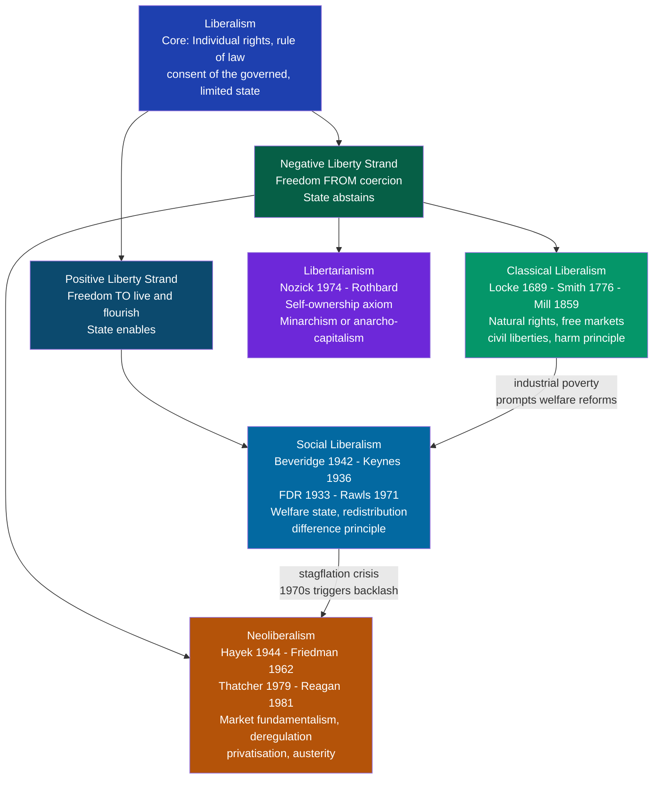

# Liberalism and Its Variants

> [!abstract] TL;DR
> Liberalism is the political tradition that places individual rights, rule of law, and limited government at the centre of political life. It is not a single doctrine but a family of competing schools — classical, social, and neo — that agree on the primacy of the individual yet disagree sharply on what genuine freedom requires, how much the state may do in its name, and how markets should be governed. These disagreements map onto one of philosophy's deepest fault lines: the difference between negative liberty (freedom from interference) and positive liberty (freedom to actually exercise one's capacities).

---

## Intuition

**Analogy:** Imagine two neighbours arguing about whether a fence represents freedom or its absence. The first says: "As long as no one forces me to move, I am free — the fence is my property and no one has the right to take it." The second says: "My children can't reach the playground because of your fence. Without access, their freedom is hollow — true liberty requires that everyone has a real chance to participate in life."

The first neighbour is a classical or neo-liberal: freedom means the absence of coercion by other people or the state. The second is a social liberal: freedom requires positive conditions — resources, capabilities, and access — that the state may need to provide. Every major dispute within liberalism — welfare state, taxation, regulation, redistribution — reduces to some version of this fence argument.

---

## How It Works

The liberal tradition shares a common trunk — individual rights, limited government, rule of law, and consent as the basis of political authority — but it splits into branches depending on how it answers two questions: *What does freedom require?* and *What may the state legitimately do?*



The arrows at the bottom of the diagram capture the historical dynamic: classical liberalism's indifference to industrial-age poverty generated the social liberal correction; social liberalism's Keynesian expansion generated the neoliberal counter-revolution after the stagflation crisis of the 1970s.

---

## Key Concepts

### Secondary Level

**What all liberals share.** Every liberal tradition holds three core commitments:

1. **Individualism** — the individual is the primary unit of moral and political analysis. Society is constituted by individuals, not the reverse.
2. **Rights** — individuals have rights that the state may not override simply because majorities prefer it. These may be natural (Locke), contractual (Rawls), or conventional (Mill).
3. **Limited government** — political authority requires justification, and that justification has limits. The burden of proof lies with those who would extend state power, not with those who resist it.

**Negative liberty** means being free from external coercion — no person or institution forces you to do or refrain from doing something. Taxes can violate negative liberty (you are compelled to part with income). Censorship violates it. Police brutality violates it. Classical liberals and neoliberals treat negative liberty as the core liberal value.

**Positive liberty** means having the real capacity to act freely — not just the absence of chains, but the presence of options. A person who cannot read is not truly free to engage in democratic life even if no law forbids them from participating. Positive liberty requires resources, education, health, and security. Social liberals argue that without these conditions, formal freedom is a mockery for the poor.

**Mill's harm principle** (from *On Liberty*, 1859): "The only purpose for which power can be rightfully exercised over any member of a civilised community, against his will, is to prevent harm to others." This single sentence is the most influential statement of the limits of state authority in the liberal tradition. It permits maximum individual autonomy while drawing a clear line: your freedom ends where another person's harm begins.

### Undergraduate Level

**Classical Liberalism — Locke, Smith, Mill.**

John Locke (1689) grounded liberal rights in *natural law*: individuals possess life, liberty, and property prior to government. Political authority exists only to protect these pre-political rights. Government by consent — not divine right — is the only legitimate form. The social contract is an agreement among rights-bearing individuals, not a surrender of rights to a sovereign.

Adam Smith (1776) gave classical liberalism its economic architecture. The *invisible hand* of competitive markets aggregates individual self-interest into socially efficient outcomes. State intervention in prices, trade, or production typically reduces welfare relative to the market equilibrium. Smith's political economy argues for free trade, division of labour, and limited mercantilism — but he was not an absolutist: he accepted the state's role in defence, justice, and public works markets would not provide.

John Stuart Mill (1859) synthesised liberal politics with utilitarian ethics. Beyond the harm principle, Mill defended freedom of thought and expression with particular force: even false ideas deserve a hearing because (1) they might turn out to be true, (2) truth is sharpened by meeting its opposite, and (3) suppressed ideas become dogma rather than living conviction. Mill also extended liberal principles to women's equality — an unusual position for his era.

**Social Liberalism — Keynes, Rawls, FDR.**

John Maynard Keynes (1936) provided the economic foundation for social liberalism. Markets can get stuck in low-output equilibria (the paradox of thrift: everyone saving simultaneously reduces everyone's income). When aggregate demand collapses — as in the Great Depression — the state must substitute for private spending. This is not socialism: Keynes wanted to *save* capitalism by correcting its macro instabilities, not replace it. His framework underwrote the welfare states built after 1945.

John Rawls (1971) provided the philosophical foundation. His *veil of ignorance* thought experiment asks: which principles would rational agents choose if they did not know their place in society — their class, natural talents, gender, or luck? Behind this veil, Rawls argued, rational agents would choose:
- **Equal basic liberties** (the liberty principle) — no trade-off of civil rights for economic gains.
- **The difference principle** — inequalities in social and economic arrangements are only just if they benefit the least advantaged members of society.

The difference principle is explicitly redistributive: it permits inequality, but only instrumental inequality — inequality that raises the floor, not inequality that merely raises the ceiling.

Franklin D. Roosevelt's New Deal (1933) is the practical implementation of social liberalism at scale: unemployment insurance, Social Security, minimum wages, bank regulation, and public employment — all framed not as socialism but as saving liberal democracy from fascism and communism by proving markets could be made compatible with dignity.

**Neoliberalism — Hayek, Friedman, Thatcher, Reagan.**

Friedrich Hayek's *The Road to Serfdom* (1944) argued that economic planning leads inexorably to political authoritarianism. The reason is *epistemic*: the knowledge needed to allocate resources efficiently is dispersed among millions of individuals and cannot be aggregated by any central planner. Prices are a spontaneous information system — they encode the knowledge of millions without anyone knowing it all. State interference destroys this system. Hayek's argument is not merely about efficiency; it is that planning requires the state to acquire coercive powers over individual choices that will eventually extend to political life itself.

Milton Friedman's *Capitalism and Freedom* (1962) made the empirical case that markets produce better outcomes than regulation in domain after domain: monetary policy (rules over discretion), education (vouchers over public monopoly), occupational licensing (entry barriers reduce competition and harm consumers). Friedman also argued the natural rate of unemployment makes Keynesian demand management self-defeating in the long run — the Phillips curve trade-off disappears once expectations adjust.

The Thatcher-Reagan policy revolution (1979–89) applied these ideas: top marginal tax rates slashed, state industries privatised, trade union power curtailed, capital flows deregulated, public services contracted out. "There is no such thing as society," Thatcher famously said — only individuals and families. The state's job was to clear the field for market activity, not to compensate for its outcomes.

### Graduate Level

**Isaiah Berlin's Two Concepts of Liberty (1958).** Berlin's canonical essay distinguishes:
- *Negative liberty*: the area within which a person can act unobstructed by others.
- *Positive liberty*: self-mastery; the capacity to be one's own master; freedom from internal compulsions and from conditions that prevent one from realising one's true nature.

Berlin's concern was that positive liberty is dangerous: once you define freedom as self-realisation, you can justify compelling people toward their "true" interests (as Rousseau's "forcing men to be free" or Marxist vanguardism). Classical and neoliberal liberals prefer negative liberty precisely because it admits no paternalistic extension.

**Rawls vs. Nozick — the defining 1970s debate.** Robert Nozick's *Anarchy, State, and Utopia* (1974) directly attacked Rawls. Nozick's *entitlement theory* holds that a distribution is just if it arises from just acquisition and just transfer, regardless of the resulting pattern. Forced redistribution — even via taxation — violates self-ownership: it treats persons as means to social ends. Nozick's argument: "Taxation of earnings from labour is on a par with forced labour." The Rawls-Nozick debate frames the central liberal dilemma — between a theory of distributive justice that licences state redistribution and an entitlement theory that forbids it.

**Neoliberalism's epistemic and political-economy critique of the welfare state.**
Beyond Hayek's knowledge problem, neoliberals raise a *public choice* critique: governments are not benevolent social planners but collections of self-interested politicians and bureaucrats. Regulation is captured by the regulated industries (Stigler, 1971). Welfare programmes create dependent constituencies that expand state power (Niskanen, 1971). The political process systematically produces over-spending relative to the optimal level because benefits are concentrated (visible) while costs are dispersed (invisible taxes and deficits).

**The tension that neoliberalism never resolved.** Hayek believed free markets require a strong legal and institutional framework — property rights, contract enforcement, stable money. This requires a state. But Hayek's followers often deployed his rhetoric to justify dismantling regulatory institutions (financial regulation, competition policy) while ignoring that unregulated markets can destroy the competition and price-signal system Hayek prized. The 2008 global financial crisis — product of deregulated financial markets — reopened every debate neoliberalism claimed to have settled.

---

## Python Demo

```python
# Nolan Chart: model liberal ideology variants in 2D ideological space.
# X-axis: Economic Freedom (0 = full state control, 10 = laissez-faire)
# Y-axis: Personal and Civil Freedom (0 = authoritarian, 10 = full civil liberty)
# Demonstrates how classical liberalism, social liberalism, and neoliberalism
# cluster differently depending on how each variant balances the two dimensions.

import matplotlib.pyplot as plt
import numpy as np

ideologies = {
    "Classical Liberalism\n(Locke, Smith, Mill)":    (7.5, 7.5, "#2563eb"),
    "Social Liberalism\n(Keynes, Rawls, FDR)":       (4.5, 8.3, "#059669"),
    "Neoliberalism\n(Hayek, Friedman, Thatcher)":    (8.8, 5.2, "#d97706"),
    "Libertarianism\n(Nozick, Rothbard)":             (9.4, 9.4, "#7c3aed"),
    "Nordic Social Democracy":                        (3.8, 8.9, "#0891b2"),
    "New Deal Welfare State\n(FDR era)":              (2.8, 6.8, "#dc2626"),
}

fig, ax = plt.subplots(figsize=(11, 10))
ax.set_facecolor("#f8fafc")
fig.patch.set_facecolor("#f8fafc")

# Light quadrant shading
for x0, x1, y0, y1, color in [
    (0, 5, 0, 5, "#ef4444"),   # bottom-left: authoritarian left
    (5, 10, 0, 5, "#f97316"),  # bottom-right: authoritarian right
    (0, 5, 5, 10, "#3b82f6"),  # top-left: progressive/left-liberal
    (5, 10, 5, 10, "#22c55e"), # top-right: liberal/libertarian
]:
    ax.fill_between([x0, x1], [y0, y0], [y1, y1], alpha=0.04, color=color)

# Plot each ideology as a labelled scatter point
for label, (x, y, color) in ideologies.items():
    ax.scatter(x, y, s=260, color=color, zorder=6, edgecolors="white", linewidths=1.8)
    ha = "right" if x > 5 else "left"
    x_off = -0.25 if x > 5 else 0.25
    ax.annotate(
        label, xy=(x, y), xytext=(x + x_off, y + 0.25),
        fontsize=9.5, color=color, fontweight="bold",
        ha=ha, va="bottom", linespacing=1.4,
        bbox=dict(boxstyle="round,pad=0.2", fc="white", ec="none", alpha=0.7)
    )

# Quadrant dividers
ax.axvline(x=5, color="#94a3b8", linestyle="--", linewidth=1.0, alpha=0.9)
ax.axhline(y=5, color="#94a3b8", linestyle="--", linewidth=1.0, alpha=0.9)

# Quadrant labels
quadrants = [
    (2.5, 2.5, "AUTHORITARIAN\nLEFT"),
    (7.5, 2.5, "AUTHORITARIAN\nRIGHT"),
    (2.5, 7.5, "PROGRESSIVE\nLEFT-LIBERAL"),
    (7.5, 7.5, "LIBERAL /\nLIBERTARIAN"),
]
for qx, qy, qt in quadrants:
    ax.text(qx, qy, qt, ha="center", va="center",
            fontsize=9, color="#94a3b8", style="italic", alpha=0.7)

# Annotate the negative/positive liberty divide
ax.annotate("", xy=(9.5, 5.5), xytext=(9.5, 9.5),
            arrowprops=dict(arrowstyle="<->", color="#94a3b8", lw=1.2))
ax.text(9.8, 7.5, "Neg. vs\nPos. Liberty\ntension", ha="left", va="center",
        fontsize=8, color="#94a3b8", style="italic")

ax.set_xlim(0, 10.5)
ax.set_ylim(0, 10.8)
ax.set_xlabel("Economic Freedom  (0 = full state control  |  10 = laissez-faire)",
              fontsize=11)
ax.set_ylabel("Personal and Civil Freedom  (0 = authoritarian  |  10 = full liberty)",
              fontsize=11)
ax.set_title("Nolan Chart: Liberal Variants in 2D Ideological Space",
             fontsize=13, fontweight="bold", pad=15)
ax.set_xticks(range(0, 11))
ax.set_yticks(range(0, 11))
ax.grid(True, alpha=0.12, color="#94a3b8")

plt.tight_layout()
plt.savefig("nolan_chart_liberalism.png", dpi=150, bbox_inches="tight")
plt.show()
print("Chart saved to nolan_chart_liberalism.png")
```

**Reading the chart.** Classical liberalism sits in the top-right quadrant — high economic *and* personal freedom. Social liberalism moves left on the economic axis (accepting redistribution) while staying high on personal freedom. Neoliberalism moves right on economic freedom but drops on personal freedom (Thatcher's government restricted trade union rights, press freedoms, and civil liberties in practice). Libertarianism is the corner case: maximum freedom on both axes. The chart reveals that no variant sits simply "left" or "right" in the US two-party sense — the two-dimensional space captures ideological distinctions that a single axis cannot.

---

## Real-World Applications

**1. The New Deal and the welfare state (United States, 1933–1938).** FDR's New Deal is the canonical social liberal state-building project. Faced with 25% unemployment, FDR did not nationalise industry (socialism) but created the institutional infrastructure that allowed capitalism to survive: deposit insurance (FDIC), Social Security, minimum wages, agricultural price supports, and the Securities and Exchange Commission. The New Deal extended positive liberty — the real capacity to participate in economic life — to ordinary Americans, while preserving private property and competitive markets. It was explicitly framed as saving liberalism from communism on the left and fascism on the right.

**2. The Thatcher-Reagan Revolution (1979–1989).** The neoliberal policy programme: top income tax rates reduced from 83% to 40% in the UK (60% to 28% in the US); state industries privatised (British Telecom, British Gas, British Airways); trade unions constrained (UK Employment Acts 1980–82; Reagan's firing of PATCO air traffic controllers 1981); capital controls abolished; financial deregulation accelerated. The results were mixed: inflation was broken (by tight monetary policy, not structural reforms), inequality rose sharply in both countries, and financial sector growth created the fragilities that produced the 2008 crisis. The neoliberal revolution reshaped the Overton window: even centre-left governments (Clinton, Blair) accepted market logic as the default.

**3. The Nordic Model as social liberalism's most successful instantiation.** Sweden, Denmark, Norway, and Finland combine high economic freedom (open markets, easy business entry, strong property rights, free trade) with high social protection (universal healthcare, subsidised childcare, generous unemployment insurance, free university). GDP per capita is among the world's highest. This challenges the neoliberal claim that welfare states necessarily destroy market dynamism. The Nordic model requires social trust, strong unions that practise wage restraint, and historically homogeneous societies — conditions that complicate direct export to more diverse nations.

**4. The Washington Consensus and its failures (1980s–2000s).** The IMF and World Bank required structural adjustment programmes — fiscal austerity, privatisation, deregulation, trade liberalisation — as conditions for loans to developing countries. This applied neoliberal prescriptions globally. The results in Latin America and sub-Saharan Africa were largely disappointing: growth did not materialise, inequality rose, and state capacity was gutted. Countries like South Korea and China that followed heterodox, state-directed industrial policy grew far faster. Joseph Stiglitz's *Globalization and Its Discontents* (2002) documented how market fundamentalism applied without attention to institutional context produced worse outcomes than the classical liberalism it claimed to represent.

---

## Common Pitfalls

- **Conflating US "liberal" with the philosophical tradition.** In US political discourse, "liberal" means centre-left (Democrat). In global political science, "liberal" means the tradition of Locke, Mill, and Smith — which includes what Americans call conservatives (free markets, limited government). The US Republican Party is in many ways the neoliberal party; the Democratic Party is the social liberal party. Neither label maps neatly onto the international usage.

- **Treating neoliberalism as identical to classical liberalism.** Classical liberalism (Mill, Smith) accepted public goods, infrastructure, and some regulation as legitimate state functions. Neoliberalism extended market logic far beyond what classical liberals endorsed: privatising prisons, schools, water utilities, and healthcare. Mill explicitly stated that the market presumption does not apply where competition is impossible or where information asymmetries are severe.

- **Assuming positive liberty requires more state power than negative liberty.** Berlin warned that positive liberty can licence authoritarian "freedom" — forcing people to be free by compelling them toward their real interests. But negative liberty also has authoritarian implications: a state that enforces property rights is using coercive power. The question is not whether the state uses power, but whom the power serves and with what justification.

- **The redistribution-freedom false dichotomy.** Rawls argued the difference principle is not in tension with liberty — the liberty principle (equal basic liberties) takes strict priority over the difference principle in his ordering. You cannot trade off civil liberties for economic equality. The common neoliberal claim that welfare states inevitably become authoritarian (Hayek's slippery slope) lacks robust empirical support: the Nordic welfare states are consistently ranked among the world's most free societies on civil liberties indices.

- **Ignoring the institutional preconditions of markets.** Hayek and Friedman assumed markets arise spontaneously when states step back. But markets require legal infrastructure — property rights, contract enforcement, anti-monopoly rules, financial regulation — that itself requires a capable state. Neoliberal deregulation of the 1980s–2000s did not produce self-organising free markets; it produced financialisation, monopoly consolidation, and systemic fragility.

---

## Related Concepts

- [[_MOC_Political_Theory_and_Ideologies|↑ Political Theory MOC]]
- [[Government_Spending_Multiplier]] — Keynesian fiscal multiplier is the economic foundation of social liberalism: the theoretical basis for why deficit spending can substitute for collapsed private demand, justifying the welfare state's counter-cyclical role.
- [[Tax_Policy]] — Supply-side economics is the fiscal arm of neoliberalism: the Laffer curve argument that cutting high marginal rates stimulates growth underpinned both Reagan and Thatcher tax reforms; critically evaluated there.
- [[Market_Failures]] — The social liberal case for intervention rests on market failures: externalities, public goods, information asymmetries, and monopoly. Where markets fail, state action can in principle improve on the unregulated outcome.
- [[Public_Goods]] — The public goods problem (non-rivalry, non-excludability, free-rider trap) is the canonical justification for state provision that even classical liberals accepted; Hayek and Friedman acknowledged it.
- [[Development_Economics]] — The Washington Consensus applied neoliberal prescriptions to developing nations; the subsequent debate between Sachs, Easterly, and Stiglitz is the empirical test of neoliberal theory at the largest scale.
- [[Behavioral_Economics_Psychology]] — Nudge theory (Thaler and Sunstein) attempts to reconcile libertarian freedom with social liberal outcomes: using choice architecture to steer behaviour without mandating it — "libertarian paternalism."
- [[Bargaining_Theory]] — Rawls' veil of ignorance is a bargaining game: rational agents behind the veil bargain over principles of justice. The Nash bargaining solution formalises the intuition that parties choose fair principles when their outside options are symmetric.

---

## Review Questions

### Secondary

1. Mill's harm principle says the state can only restrict your freedom to prevent harm to others. Name one policy that clearly passes this test and one that is genuinely ambiguous, and explain why each case lands where it does.
2. In your own words, what is the difference between negative and positive liberty? Give an everyday example of each.
3. How did the Great Depression challenge classical liberalism, and what did social liberals argue should replace it?

### Undergraduate

1. Rawls argues that the difference principle — allowing inequality only if it benefits the least advantaged — follows from rational self-interest behind a veil of ignorance. Nozick argues this conclusion is invalid: just distributions arise from just processes, not just patterns. Who has the stronger argument, and why?
2. Hayek claims that central planning must fail because the knowledge required for efficient allocation is dispersed and tacit. Does this argument refute social liberalism (welfare state, redistribution) or only central planning (Soviet-style command economy)? Where is the line?
3. The Nordic social democracies combine high economic freedom scores with high social protection. Does this refute the neoliberal claim that welfare states destroy economic dynamism? What conditions might explain the Nordic exception?

### Graduate

1. Isaiah Berlin warns that positive liberty contains the seeds of authoritarianism because it allows the state to define and compel people toward their "true" freedom. Evaluate this critique: does positive liberty necessarily lead to paternalism, or can it be bounded by the same rights-based framework that constrains negative-liberty states?
2. The 2008 financial crisis resulted from deregulated financial markets — a neoliberal policy programme. Does this constitute a decisive empirical refutation of Hayek's price-signal argument, or does it instead support Hayek's argument that the real problem was government distortion of price signals via monetary policy? Use specific evidence.
3. Suppose you are designing economic institutions for a newly democratising country. Using Rawls' difference principle as your normative criterion and Hayek's knowledge problem as your epistemic constraint, what mixture of market, regulatory, and redistributive institutions would you recommend? Where does the tension between these two frameworks become irresolvable?

---

## Sources

- John Locke, *Two Treatises of Government* (1689)
- Adam Smith, *The Wealth of Nations* (1776), Books I and IV
- John Stuart Mill, *On Liberty* (1859)
- John Maynard Keynes, *The General Theory of Employment, Interest and Money* (1936)
- Friedrich Hayek, *The Road to Serfdom* (1944)
- Isaiah Berlin, "Two Concepts of Liberty," in *Four Essays on Liberty* (1958)
- Milton Friedman, *Capitalism and Freedom* (1962)
- John Rawls, *A Theory of Justice* (1971)
- Robert Nozick, *Anarchy, State, and Utopia* (1974)
- Joseph Stiglitz, *Globalization and Its Discontents* (2002)
- David Harvey, *A Brief History of Neoliberalism* (2005)
- Dani Rodrik, *The Globalization Paradox* (2011)

---

#PoliticalScience #PoliticalTheory #Liberalism #Ideology
