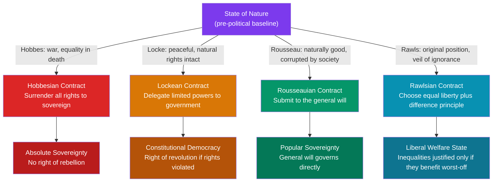

# Social Contract Theory

> [!abstract] TL;DR
> Social contract theory holds that legitimate political authority arises from a voluntary — real or hypothetical — agreement among individuals who consent to live under common rules in exchange for the benefits of organized society. Hobbes, Locke, Rousseau, and Rawls each construct a different contract from a different imagined pre-political baseline, arriving at radically different conclusions about sovereignty, rights, and the limits of state power. The theory is both the historical foundation of liberal democracy and a live framework for evaluating distributive justice today.

---

## Intuition

**Analogy:** Imagine a group of strangers marooned on a deserted island. Initially everyone scrambles for resources — the strongest take what they want, the weakest go without, and no one sleeps soundly because anyone might steal in the night. After enough exhausting conflict, someone proposes a deal: "Let's agree on rules. We'll share the fish catch, distribute shelter work fairly, and agree that nobody takes from another's pile. Anyone who breaks the deal gets expelled from the group." Each person, calculating that rule-bound cooperation beats chaotic scrambling, agrees.

That agreement — the moment the island group trades unlimited individual freedom for mutual security and shared benefit — is the social contract. The political theorists of the Enlightenment asked: what exact terms did humanity implicitly sign when it formed societies? And what happens when a government violates them?

---

## How It Works

Social contract theory does not claim a contract was literally signed in history. It is a **normative thought experiment**: what rules would rational, self-interested people agree to before knowing their position in society? The answer is meant to justify political authority and simultaneously define its limits.

The four major theorists each begin with a different **state of nature** (the pre-political condition) and deduce different contract terms and outcomes:

| Theorist | State of Nature | Core Contract | Political Result |
|---|---|---|---|
| **Hobbes** (1651) | War of all against all; life "solitary, poor, nasty, brutish, and short" | Surrender *all* rights to a sovereign for peace | Absolute monarchy; no right of rebellion |
| **Locke** (1689) | Mostly peaceful; natural rights pre-exist government | Delegate *limited* powers to protect those rights | Constitutional government; right of revolution |
| **Rousseau** (1762) | Natural humans are good; civilization corrupted them | Unite around the *general will*; community over self | Popular sovereignty; direct democracy ideal |
| **Rawls** (1971) | Original position behind veil of ignorance | Choose principles when no one knows their social place | Equal basic liberties plus the difference principle |



---

## Key Concepts

### Secondary Level

**State of Nature:** The thought experiment's starting point — humanity before government, law, or social institutions. Each theorist imagines this differently, and the entire political conclusion follows from that imagined baseline. Crucially, it is a device for philosophical argument, not a claim about prehistory.

**Legitimate Authority:** Governments derive their authority not from divine right or conquest, but from the consent of the governed. A government that systematically violates the contract forfeits its legitimacy — this is the philosophical basis for the right of revolution.

**Natural Rights (Locke):** Rights that exist independently of any government. Locke identifies life, liberty, and property. Government is created specifically to protect these and cannot legitimately abolish them without cause. Jefferson translated this directly into the American Declaration of Independence.

**Sovereignty:** Where does supreme political power reside? Hobbes locates it in the monarch; Rousseau locates it in the people collectively; Locke holds that it can never fully leave the individual, hence the conditional right of rebellion.

---

### Undergraduate Level

**Thomas Hobbes — *Leviathan* (1651)**

Hobbes writes in the shadow of the English Civil War. His state of nature rests on two premises:
1. Humans are roughly equal in physical capacity — even the weakest can kill the strongest through guile or coalition.
2. Resources are scarce, and without authority to enforce agreements, no one can trust anyone else to keep their word.

The result is a **perpetual, rational war** — not necessarily active fighting at every moment, but a standing disposition to fight whenever advantageous. No industry, agriculture, culture, knowledge, or commerce can develop under this condition. Everyone lives under the dominance of fear of violent death.

The Hobbesian contract: each person surrenders *all* natural rights to a sovereign (person or assembly) who holds absolute, undivided power, in exchange for peace. Three crucial corollaries:
- The sovereign is **not party to the contract** and therefore cannot breach it; there is no ground for legal complaint against the sovereign.
- **No right of rebellion** — any rebellion returns society to the state of nature, which is worse than even tyranny.
- **One exception**: self-defense against the sovereign's direct attempt to kill you cannot be alienated, since self-preservation is the entire purpose of the contract.

**John Locke — *Second Treatise of Government* (1689)**

Locke's state of nature is fundamentally different: it is governed by a **law of nature**, accessible to reason, that prohibits harming others' life, liberty, or property. Pre-political humans are mostly peaceful but face three practical inconveniences: there is no standing codified law, no impartial judge, and no executive power to enforce judgments.

Government is created specifically to solve these three deficiencies — nothing more, nothing less. Key implications:

- **Tacit consent**: living in a territory, using its roads and protections, implies consent to its laws.
- **Limited government**: government may only do what individuals could legitimately do themselves — protect rights. It has no authority over conscience, belief, or matters beyond rights protection. This proto-secularism directly influenced the First Amendment.
- **Right of revolution**: if government systematically violates natural rights — the very thing it was created to protect — the contract is dissolved and the people may replace the government. Jefferson borrowed this explicitly; "life, liberty, and the pursuit of happiness" is Locke's "life, liberty, and property" with "happiness" substituted for "property" to broaden the appeal.

**Jean-Jacques Rousseau — *The Social Contract* (1762)**

Rousseau's famous opening line: "Man is born free, and everywhere he is in chains." His state of nature features natural, pre-social humans who are essentially good, compassionate (*pitié*), and uncorrupted. Inequality and moral vice are **products of civilization**, not of human nature — the opposite of Hobbes.

The problem: once private property is established, inequality emerges, and the historical "social contract" that was actually struck was a **fraud** — the rich used it to legitimize their advantages, convincing the poor that protecting property was protecting everyone.

Rousseau's *prescriptive* contract seeks to reconstruct this:
- Each person gives themselves entirely to the **community** (not to a ruler), so that no one gains power over another.
- The **general will** (*volonté générale*) — distinct from the mere "will of all" (the sum of private, selfish interests) — represents what rational citizens would will for the common good.
- Popular sovereignty is inalienable: the people cannot permanently delegate their will to a representative parliament. Government is only an *agent* of the people, never the sovereign.

The tension Rousseau never fully resolved: who determines the general will? He acknowledged it could be manipulated. His claim that dissenters must be "forced to be free" (their particular will is corrupt; their rational will would agree) edges toward authoritarianism, as later critics noted when the French Revolutionary Terror invoked him.

---

### Graduate Level

**John Rawls — *A Theory of Justice* (1971)**

Rawls is the 20th-century heir to social contract theory, writing explicitly to challenge utilitarian dominance in Anglo-American political philosophy. His core objection to utilitarianism: it permits sacrificing one person's fundamental interests for aggregate welfare, which violates the separateness of persons. We need a theory of **justice as fairness**.

The method — the **original position** — is Rawls's version of the state of nature. Agents in the original position are:
- Rational and self-interested (but not envious)
- Knowledgeable about general facts — economics, psychology, sociology, political science
- Ignorant of their *particular* position — they do not know their social class, natural talents, gender, race, generation, or conception of the good (the **veil of ignorance**)

Under these conditions, Rawls argues via **maximin reasoning** (choose the option that maximizes the minimum outcome, because you might end up worst-off) that rational agents would choose two principles, in strict lexical order:

**First Principle (Equal Liberty):** Each person has the most extensive scheme of equal basic liberties — political freedom, freedom of speech, freedom of conscience, personal property — compatible with a similar scheme for all others.

**Second Principle (Difference + Fair Opportunity):**
- (a) Social and economic inequalities must be arranged so they benefit the **least-advantaged members** of society — the **difference principle**.
- (b) Those inequalities must be attached to positions open to all under fair equality of opportunity (not just formal legal equality, but substantive equal opportunity).

Key implications of the difference principle:
- It does not require strict equality; it permits any inequality that improves the absolute position of the worst-off. High surgeon salaries are Rawlsian *if* the alternative is a shortage of surgeons that harms everyone, especially the poor.
- It is not utilitarian maximization of average welfare — it requires specifically improving the position of the worst-off group, even if the aggregate effect is smaller.
- Rawls explicitly identifies the "least advantaged" with those occupying the lowest income and wealth positions, not with any particular person.

**Reflective equilibrium**: Rawls acknowledges the veil of ignorance argument is not a deductive proof. He uses reflective equilibrium — iterative adjustment between abstract principles and considered moral judgments — to justify the framework. The principles are acceptable because they cohere with our firmest intuitions about justice while systematizing them.

**Major critiques:**

| Critic | School | Argument |
|---|---|---|
| **Robert Nozick** (*Anarchy, State, and Utopia*, 1974) | Libertarianism | If each economic transaction was voluntary, the resulting distribution is just regardless of its shape. Rawls's difference principle requires ongoing redistribution that violates individual property rights. |
| **Michael Sandel** (*Liberalism and the Limits of Justice*, 1982) | Communitarianism | The "unencumbered self" behind the veil is incoherent. We are constituted by our communities, attachments, and histories. Principles chosen without knowing who we are cannot be genuinely ours. |
| **Martha Nussbaum** (Capabilities Approach) | Liberal feminism | Social contract tradition takes the paradigm contractor to be a rational, productive adult male. It structurally excludes animals, people with disabilities, non-citizens, and future generations. |
| **Carole Pateman** (*The Sexual Contract*, 1988) | Feminist theory | The "original" social contract had an unacknowledged sexual contract embedded in it — women were excluded from the public sphere and bound by a private sexual contract governing marriage and domestic labor. |

---

## Python Demo

```python
import numpy as np
import matplotlib.pyplot as plt

# -------------------------------------------------------------------------
# Social Contract Theory: Modeling Cooperation Logic via Two Games
#
# Game 1: Prisoner's Dilemma  → models HOBBES's state of nature
#   Rational individuals defect even when mutual cooperation is Pareto-optimal.
#   Without an external enforcer (Leviathan), defection dominates at every
#   probability of the other player cooperating.
#
# Game 2: Stag Hunt  → models LOCKE/ROUSSEAU/RAWLS coordination problem
#   Cooperating (hunting stag together) is best IF both cooperate.
#   Defecting (hunting hare alone) is safe regardless.
#   A social contract = mutual assurance that shifts both players to the
#   efficient cooperative equilibrium by making cooperation expected.
# -------------------------------------------------------------------------

def expected_payoffs(cooperate_prob_other, payoff_matrix):
    """Return [E(cooperate), E(defect)] given probability other cooperates."""
    q = np.array([cooperate_prob_other, 1.0 - cooperate_prob_other])
    return payoff_matrix @ q


# Prisoner's Dilemma payoff matrix (row player)
#           Other Cooperates    Other Defects
# Cooperate       3                  0          (Reward R=3, Sucker S=0)
# Defect          5                  1          (Temptation T=5, Punishment P=1)
pd_matrix = np.array([[3.0, 0.0],
                       [5.0, 1.0]])

# Stag Hunt payoff matrix (row player)
#           Other hunts Stag    Other hunts Hare
# Hunt Stag       4                  0
# Hunt Hare       3                  3          (safe outside option)
sh_matrix = np.array([[4.0, 0.0],
                       [3.0, 3.0]])

probs = np.linspace(0.0, 1.0, 300)

fig, axes = plt.subplots(1, 2, figsize=(13, 5))
fig.suptitle("Social Contract Logic: Prisoner's Dilemma vs. Stag Hunt", fontsize=12, fontweight="bold")

for ax, matrix, game_title, interpretation in zip(
    axes,
    [pd_matrix, sh_matrix],
    ["Prisoner's Dilemma\n(Hobbesian State of Nature)",
     "Stag Hunt\n(Contractarian Coordination Problem)"],
    ["Defect dominates at ALL p.\nA Leviathan enforcer is necessary\nto sustain cooperation (Hobbes).",
     "Cooperate dominates when p > 0.75.\nSocial contract = mutual assurance\nthat unlocks the efficient equilibrium."]
):
    e_coop = [expected_payoffs(p, matrix)[0] for p in probs]
    e_deft = [expected_payoffs(p, matrix)[1] for p in probs]

    ax.plot(probs, e_coop, label="Cooperate", color="steelblue", linewidth=2.5)
    ax.plot(probs, e_deft, label="Defect", color="firebrick",  linewidth=2.5, linestyle="--")

    # Shade region where each strategy dominates
    coop_arr = np.array(e_coop)
    deft_arr = np.array(e_deft)
    ax.fill_between(probs, coop_arr, deft_arr,
                    where=(coop_arr >= deft_arr), alpha=0.12, color="steelblue",
                    label="Cooperate preferred")
    ax.fill_between(probs, coop_arr, deft_arr,
                    where=(coop_arr < deft_arr),  alpha=0.12, color="firebrick",
                    label="Defect preferred")

    # Indifference point
    sign_change = np.where(np.diff(np.sign(coop_arr - deft_arr)))[0]
    for idx in sign_change:
        p_cross = probs[idx]
        ax.axvline(x=p_cross, color="gray", linestyle=":", linewidth=1.5,
                   label=f"Indifference at p={p_cross:.2f}")
        ax.annotate(f"p = {p_cross:.2f}", xy=(p_cross, matrix[0, 0] * p_cross + matrix[0, 1] * (1 - p_cross)),
                    xytext=(p_cross + 0.04, 2.5), fontsize=8, color="gray")

    ax.set_xlabel("Probability other player cooperates", fontsize=9)
    ax.set_ylabel("My expected payoff", fontsize=9)
    ax.set_title(game_title, fontsize=10, fontweight="bold")
    ax.set_xlim(0, 1)
    ax.legend(fontsize=8, loc="upper left")
    ax.text(0.02, 0.04, interpretation, transform=ax.transAxes, fontsize=8,
            verticalalignment="bottom",
            bbox=dict(boxstyle="round,pad=0.4", facecolor="lightyellow", alpha=0.85))

plt.tight_layout()
plt.savefig("social_contract_games.png", dpi=130, bbox_inches="tight")
plt.show()

# --- Console output: equilibrium analysis ---
print("=" * 60)
print("PRISONER'S DILEMMA — equilibrium analysis")
print("=" * 60)
for p in [0.0, 0.25, 0.5, 0.75, 1.0]:
    e = expected_payoffs(p, pd_matrix)
    br = "Cooperate" if e[0] > e[1] else ("Defect" if e[1] > e[0] else "Indifferent")
    print(f"  p={p:.2f}  E[C]={e[0]:.2f}  E[D]={e[1]:.2f}  => Best response: {br}")

print()
print("=" * 60)
print("STAG HUNT — equilibrium analysis")
print("=" * 60)
for p in [0.0, 0.50, 0.74, 0.75, 0.76, 1.0]:
    e = expected_payoffs(p, sh_matrix)
    br = "Hunt Stag" if e[0] > e[1] else ("Hunt Hare" if e[1] > e[0] else "Indifferent")
    print(f"  p={p:.2f}  E[Stag]={e[0]:.2f}  E[Hare]={e[1]:.2f}  => Best response: {br}")

print()
print("Interpretation:")
print("  PD:  Defect is ALWAYS dominant. No threshold at which Cooperate wins.")
print("       This is Hobbes: without a Leviathan to enforce agreements, defection")
print("       is individually rational and everyone ends up in the 'nasty, brutish' equilibrium.")
print()
print("  SH:  Cooperate wins ONLY when p > 0.75 (when you trust others enough).")
print("       The social contract is a credible commitment device that raises p above the")
print("       threshold, shifting society from the safe-but-inefficient (Hare, Hare)")
print("       equilibrium to the efficient (Stag, Stag) equilibrium.")
```

---

## Real-World Applications

**1. The US Declaration of Independence and Constitution (1776–1789)**
Locke's influence is unmistakable and explicit. Jefferson's "life, liberty, and pursuit of happiness" is a deliberate echo of Locke's "life, liberty, and property," with "happiness" substituted to broaden the claim beyond property ownership. The Declaration's argument — that government derives its just powers from the consent of the governed, and that when a government destroys these ends the people have the right to alter or abolish it — is Lockean contractarianism applied wholesale. The constitutional separation of powers, Bill of Rights, and judicial review are all institutional expressions of Locke's limited government. Madison's Federalist No. 51 ("If men were angels, no government would be necessary") is pure social contract reasoning: institutions exist because humans are self-interested, not because they are evil.

**2. The French Revolution and the General Will (1789–1794)**
Robespierre and the Jacobins invoked Rousseau explicitly and directly. "Liberty, equality, fraternity" encodes Rousseau's vision of a unified people expressing the general will. The Jacobin Terror was partly justified in Rousseauian terms: those who opposed the Revolution were expressing corrupt particular wills opposed to the general will — and "forcing them to be free" was legitimate. This is the clearest historical demonstration of the authoritarian potential latent in the general will concept: a faction that successfully claims to speak for the general will can rationalize extraordinary violence against dissenters.

**3. The Welfare State and the Rawlsian Difference Principle (20th–21st century)**
Progressive taxation, universal healthcare, public education, and social insurance can all be justified via Rawls: if you did not know whether you would be born wealthy or poor, healthy or disabled, you would rationally insure yourself by supporting a floor beneath which no member of society falls. The Nordic welfare states most closely approximate Rawlsian distributions — strong equal-liberty protections, substantive equality of opportunity, and inequalities permitted insofar as they raise productivity and thereby benefit the least well-off. The Affordable Care Act debate in the United States was, at its core, a dispute between Rawlsian distributive justice and Nozickean entitlement theory.

**4. International Law as a Global Social Contract**
The UN Charter, WTO agreements, nuclear non-proliferation treaties, and climate accords represent attempts to extend contractarian logic to the international level. States agree to constrain their sovereignty — analogous to individuals surrendering some freedom — in exchange for mutual benefit: collective security, regulated trade, environmental stability. The Hobbesian problem immediately re-emerges at this scale: without a global Leviathan, compliance depends on reciprocity, reputation, and international institutions that lack coercive authority. Realist international relations theory is essentially Hobbesian: the international system is an anarchic state of nature among sovereigns, with no binding contract.

---

## Common Pitfalls

- **"The social contract is a real historical document"** — It is not, and no major theorist claimed otherwise. Hume's 1748 essay "Of the Original Contract" demolished this reading: no historical founding moment of consent can be found, and no living person can meaningfully have consented to a pre-existing constitution. Social contract theory is a *normative* thought experiment for evaluating legitimacy, not an empirical account of history. Hobbes, Locke, and Rousseau all knew this; confusing description with prescription misreads the entire tradition.

- **"All social contract theories support limited government"** — Hobbes's theory explicitly and deliberately produces an **unlimited, absolute sovereign** with no right of rebellion. The only escape from the contract is mutual dissolution — which returns society to the state of nature, which Hobbes considered an unambiguous catastrophe. Conflating Hobbes with Locke because both use "social contract" language is one of the most common errors in undergraduate political philosophy.

- **"Rousseau's general will is just majority rule"** — Rousseau explicitly and repeatedly distinguishes the general will from the "will of all" (*volonté de tous*). The will of all is merely the aggregate of private, self-interested preferences — which can be systematically opposed to the public good. The general will is what rational citizens would will *for the common good*. A majority coalition pursuing its particular group interest is not expressing the general will; it is a faction. This is why Rousseau distrusts political parties and representative parliaments: they substitute particular wills for the general will.

- **"Rawls's difference principle requires equal outcomes"** — The difference principle is frequently misread as an egalitarian demand for equal distribution. It is not. It permits *any* degree of inequality, including extreme inequality, provided that inequality genuinely improves the absolute position of the worst-off group relative to the alternatives. Rawls was not an egalitarian but a **prioritarian**: special weight is given to the least well-off, but improving their position, even by a small amount, can justify large inequalities elsewhere.

---

## Related Concepts

- [[_MOC_Political_Theory_and_Ideologies|↑ Political Theory MOC]]
- [[Moral_Development]] — Kohlberg's Stage 5 is explicitly called "social contract orientation," mapping directly to Lockean contractarianism; Stage 6 "universal ethical principles" maps to Rawls; the entire progression from heteronomous rules to principled autonomy mirrors the movement from Hobbesian submission to Rawlsian self-legislation
- [[Prosocial_Behavior]] — Reciprocal altruism and iterated prisoner's dilemma are the evolutionary and game-theoretic underpinnings of cooperative norms; the bystander effect illustrates Hobbesian diffusion of responsibility without an enforcer
- [[Group_Dynamics]] — Collective action problems at the group level mirror the state-of-nature dilemma; free-riding and social loafing are the microsociological analogs of Hobbesian defection; groupthink illustrates how majority consensus can masquerade as Rousseau's general will
- [[Behavioral_Economics_Psychology]] — Rawls's rational contractors assume standard expected utility maximization; behavioral findings on fairness preferences, inequality aversion (ultimatum game), and loss aversion complicate and enrich social contract reasoning
- [[Nash_Equilibrium]] — The social contract can be modeled as a Nash equilibrium: a system of rules and expectations such that no individual has incentive to unilaterally deviate, given that others comply; Hobbes's sovereign enforces this equilibrium by changing the payoffs of defection
- [[Repeated_Games_and_Folk_Theorems]] — The "shadow of the future" formalizes how long-run cooperation can emerge from rational self-interest without a Leviathan enforcer; the folk theorem shows that cooperative outcomes are sustainable as equilibria when players interact repeatedly — offering a game-theoretic reply to Hobbes
- [[Public_Goods]] — National defense, rule of law, clean air, and public infrastructure are the canonical public goods that social contracts are designed to provide; the free-rider problem is the microeconomic formalization of the Hobbesian coordination failure

---

## Review Questions

### Secondary

1. Hobbes and Locke both begin with a "state of nature" but reach very different conclusions about how much power government should have. What is the single most important difference in how each describes the state of nature, and how does that difference explain why Hobbes endorses absolute monarchy while Locke endorses limited government?
2. Locke argues that citizens have the right to revolt against their government. Under what specific conditions does he permit this, and what must citizens do before exercising it? Would Hobbes ever permit rebellion, and why or why not?

### Undergraduate

3. Rousseau says man is "born free, and everywhere he is in chains." What does he mean by this? According to Rousseau, what corrupted natural freedom, and how does his proposed social contract differ from Locke's in addressing this corruption?
4. Apply Rawls's veil of ignorance to a specific contemporary policy dispute — such as progressive versus flat income taxation, or universal basic income versus means-tested benefits. What principles would rational agents behind the veil choose, and why? Are there any features of the policy that Rawls's framework cannot adjudicate?
5. Robert Nozick argues that Rawls's difference principle violates individual rights by requiring ongoing redistribution of justly acquired holdings. Reconstruct Nozick's "entitlement theory" argument. What is Rawls's most plausible reply?

### Graduate

6. Carole Pateman argues that the classical social contract tradition contains a hidden "sexual contract" that structures the exclusion of women from full civic standing. Trace her argument: what assumptions about the individual who enters the social contract render the tradition implicitly gendered, and can these assumptions be removed without transforming the theory into something unrecognizable to its authors?
7. The prisoner's dilemma shows that rational self-interested agents defect even when mutual cooperation is Pareto-optimal. Does this support Hobbes's argument for an absolute sovereign as the only solution? Evaluate the folk theorem as an alternative: can infinitely repeated interaction sustain cooperative norms without external enforcement, and if so, what does this imply for the necessity of the Leviathan?
8. Rawls uses "reflective equilibrium" to justify the original position: he adjusts principles until they cohere with our considered moral judgments, moving iteratively between abstract theory and particular intuitions. Is this a circular methodology? How does it differ from mere intuitionism, and is it vulnerable to the objection that it simply systematizes the parochial judgments of a mid-20th-century Anglo-American liberal philosopher?

---

## Sources

- Hobbes, T. (1651). *Leviathan*. Chapters 13–18. Available via Project Gutenberg.
- Locke, J. (1689). *Second Treatise of Government*. Chapters 2, 7–9, 19. Available via Project Gutenberg.
- Rousseau, J.-J. (1762). *The Social Contract*. Books I–II. Trans. G. D. H. Cole.
- Rawls, J. (1999). *A Theory of Justice* (Revised ed.). Harvard University Press. (Original 1971.)
- Nozick, R. (1974). *Anarchy, State, and Utopia*. Basic Books.

---

#PoliticalScience #PoliticalTheory #SocialContract
