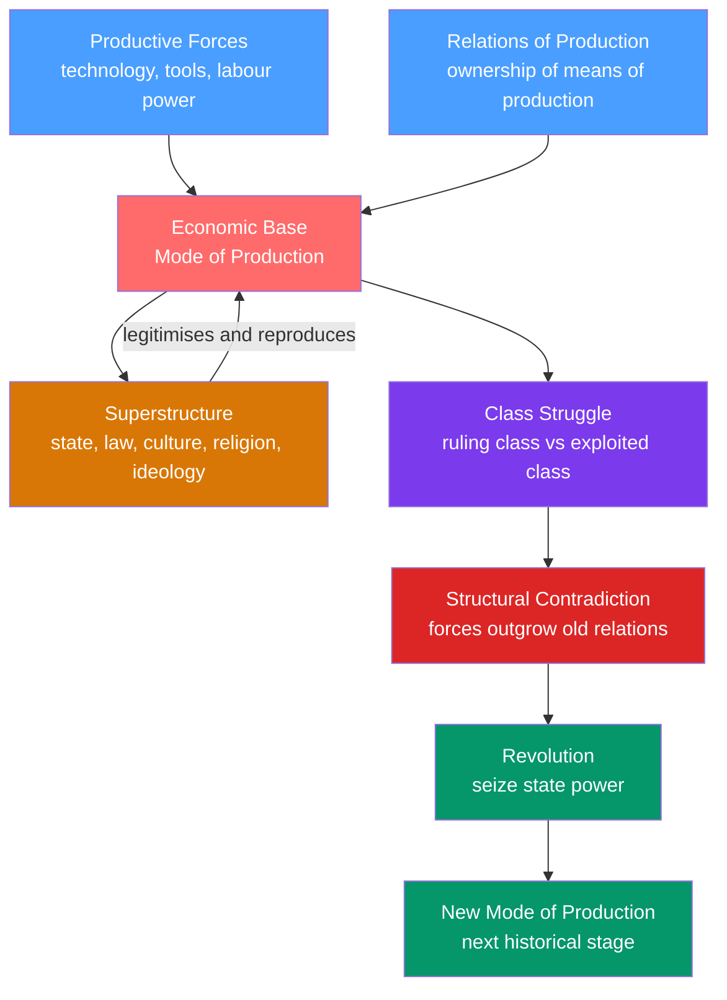

# Socialism, Marxism, and Communism

> [!abstract] TL;DR
> Marx's historical materialism argues that the economic structure of society — who owns the means of production — determines its laws, culture, and politics. Class struggle between owners and workers drives history through stages from feudalism to capitalism to socialism, with communism as the predicted endpoint. The 20th century generated three starkly different implementations of this tradition: Soviet Leninism, Maoist China, and Nordic social democracy — each reaching vastly different conclusions from the same intellectual lineage.

---

## Intuition

**Analogy:** Think of a city as a building. The foundation — concrete, steel, plumbing — determines what kind of structure can stand above it. You can repaint the walls, hang new curtains, and replace the furniture; but if the foundation is cracked, no decoration fixes it. Marx's great insight was to apply this architectural logic to society: the *economic base* — who owns the factories, farms, and machines — is the foundation. The legal system, the government, the dominant culture, religion, art, and ideas are the superstructure built on top. Change who controls the economy, and everything built above must eventually change.

Now extend the analogy: every foundation has physical limits. When a city grows beyond what the old foundation can support, the building either collapses or must be torn down and rebuilt. Marx called this the *contradiction between productive forces* (technology, skills, labour capacity) and *relations of production* (ownership structures). When the forces outgrow the relations — as when steam-powered industry outgrew the feudal guild system — class conflict erupts and history changes its shape.

---

## How It Works



---

## Key Concepts

### Secondary Level

**Who Were Marx and Engels?**

Karl Marx (1818-1883) was a German philosopher, economist, and revolutionary. Friedrich Engels (1820-1895) was his intellectual partner and financial backer. Together they published *The Communist Manifesto* in 1848 — a pamphlet responding to the revolutionary upheavals sweeping Europe. Marx later produced his masterwork, *Capital* Vol. 1 (1867), a 900-page analysis of how the capitalist economy actually operates beneath its appearances.

**The Opening Line That Defines the Framework**

"The history of all hitherto existing society is the history of class struggles." — *Communist Manifesto*, 1848.

Every legal system, every religion, every form of government, Marx argues, reflects the interests of whichever class controls the economic surplus at that moment in history.

**Three Main Currents of the Tradition**

| Current | Core Idea | Key Figures | Historical Example |
|---------|-----------|-------------|-------------------|
| Marxism | Scientific analysis of capitalism; expose its contradictions | Marx, Engels, Lukács | Academic and theoretical tradition |
| Socialism | Social ownership of production; redistribution of wealth | Owen, Proudhon, Bernstein | UK Labour Party, French Parti Socialiste |
| Communism | Classless, stateless society via vanguard-led transition | Lenin, Mao, Castro | USSR 1917-1991, Cuba, PRC |

These three currents overlap but disagree sharply on *method* — reform or revolution — and *endpoint* — a regulated capitalism or complete abolition of private property.

**The Sequence of Modes of Production**

Marx identified history as moving through stages, each defined by who controls the economic surplus:

| Stage | Ruling Class | Exploited Class | Primary Mechanism |
|-------|-------------|-----------------|------------------|
| Primitive Communism | None | None | Communal tribal survival |
| Slavery | Slave owners | Slaves | Direct coercion, forced labour |
| Feudalism | Nobility and Church | Serfs | Land monopoly, labour dues |
| Capitalism | Bourgeoisie | Proletariat | Wage labour, surplus value |
| Socialism | Working class state | Transitional | State ownership, central planning |
| Communism | None | None | "From each ability, to each need" |

**The 10 Demands of the Communist Manifesto (1848)**

The Manifesto's immediate demands for advanced countries included:
1. Abolition of property in land; application of rents to public purposes
2. A heavy progressive income tax
3. Abolition of inheritance rights
4. Confiscation of property of emigrants and rebels
5. Centralisation of credit in a national bank with state capital
6. Nationalisation of communication and transport
7. Extension of state ownership of factories and instruments of production
8. Equal liability of all to labour
9. Combination of agriculture with manufacturing industries
10. Free education for all children; abolition of child factory labour

Several of these — progressive taxation, central banking, free public education — are now standard features of capitalist democracies. Marx would not have found this comforting to capitalists.

---

### Undergraduate Level

**Historical Materialism vs Idealism**

Georg Hegel (1770-1831) believed ideas drive history: the world-spirit (*Geist*) unfolds dialectically through thesis, antithesis, and synthesis. Marx "stood Hegel on his head": material conditions, not ideas, are primary. The dialectic is real, but it operates in the economic sphere — in contradictions between productive forces and relations of production — not in pure thought.

Marx's decisive formulation (*A Contribution to the Critique of Political Economy*, 1859):

> "It is not the consciousness of men that determines their existence, but their social existence that determines their consciousness."

This is the inversion of Idealism: religion does not shape economic relations; economic relations shape religion.

**Base and Superstructure in Detail**

The economic base generates two types of superstructural apparatus:

- **Ideological State Apparatuses**: schools, churches, media, the family — institutions that reproduce dominant ideas. They naturalise existing ownership relations as "common sense," meritocracy as reality, and the wage relationship as free exchange between equals.
- **Repressive State Apparatuses**: police, military, courts, prisons — institutions that enforce ruling-class power through force when ideology proves insufficient.

The superstructure is not mechanically determined — Marx granted it *relative autonomy* — but it ultimately functions to reproduce the conditions for the existing mode of production. A capitalist state does not neutrally arbitrate between classes; it reflects and protects the interests of the class that controls the means of production.

**Surplus Value and the Rate of Exploitation**

This is Marx's central economic contribution in *Capital*. Under capitalism:

1. Workers sell their **labour power** — the capacity to work for a day — as a commodity on the labour market.
2. The value of labour power equals the labour time required to reproduce the worker's subsistence.
3. Workers produce more value per day than their subsistence cost — the excess is **surplus value** (S).
4. Capitalists appropriate surplus value as profit.

$$\text{Rate of exploitation} = \frac{S}{V} = \frac{\text{surplus value}}{\text{variable capital (wages)}}$$

If a worker's daily wage represents 4 hours of social labour, but the working day is 8 hours, the rate of exploitation is 100%. The capitalist appropriates 4 hours of unpaid labour daily — not through fraud, but through the normal operation of the market.

The **tendency of the rate of profit to fall** follows from competition: capitalists replace workers with machines to gain a competitive edge. But only living labour produces surplus value; as the ratio of machines to workers rises, the average rate of profit tends to decline — creating periodic crises of overaccumulation.

**Four Types of Alienation**

In *Economic and Philosophic Manuscripts* (1844), Marx identified alienation as the separation of the worker from:

| Type | What the Worker is Alienated From |
|------|-----------------------------------|
| Product | The thing they make (it belongs to the capitalist, confronts them as an alien power) |
| Process | The act of labour itself (mechanical, not self-expressive, externally imposed) |
| Other workers | Competition atomises; solidarity is structurally suppressed |
| Species-being | Human potential for conscious, creative, self-directed labour — *Gattungswesen* |

Alienation is not psychological unhappiness that therapy can fix. It is the structural separation of the producer from the conditions of production — a feature of capitalism, not a bug.

**Commodity Fetishism**

In capitalism, the social relationships between people appear as relationships between things. The price of a smartphone conceals the social labour relations behind its production. The Foxconn assembly worker's 12-hour shift disappears behind the commodity's exchange value. This "fetishism" makes capitalist social relations appear natural and eternal — like physical laws rather than historical constructions that could be otherwise arranged.

**Lenin's Two Key Contributions (1902-1916)**

*Vanguard party* (*What Is To Be Done?*, 1902): The working class, left to spontaneous organisation, develops only "trade union consciousness" — fighting for better wages within capitalism, not systemic change. A disciplined vanguard party of professional revolutionaries, organised on **democratic centralism** (free debate internally; unified action externally), must import revolutionary class consciousness from outside. This doctrine justified Bolshevik party discipline and, later, one-party communist states.

*Imperialism* (*Imperialism, the Highest Stage of Capitalism*, 1916): Lenin updated Marx for the 20th century. Capitalism in its monopoly phase exports capital rather than goods; finance-capital oligarchies carve up the world; intra-imperialist rivalry produces world wars. Revolution would therefore first erupt not in the most advanced capitalist countries — as Marx predicted — but at capitalism's "weakest links": semi-feudal Russia, agrarian China. This explained why communist revolutions came from the periphery rather than from Germany or England.

**Reform vs Revolution: The Bernstein Debate**

Eduard Bernstein (*Evolutionary Socialism*, 1899) challenged Marx's revolutionary teleology on empirical grounds:
- Capitalist crises were NOT intensifying — workers' living standards were rising
- The middle class was NOT being proletarianised — it was growing
- Parliamentary democracy offered a legitimate path to socialist reform without revolution
- Revolution was neither inevitable nor desirable

This "revisionism" became the theoretical foundation of European social democracy. Rosa Luxemburg responded (*Reform or Revolution?*, 1900): gradualist reform cannot fundamentally alter the capitalist state, which will use its monopoly on violence to protect property when threatened. The reformist path leaves the economic base intact.

Historically, *both* were partly right. Social democracy transformed the capitalist welfare state. And when socialism threatened property relations — Chile, 1973 — the state did reach for violence.

**Actually-Existing Socialism: USSR and Maoist China**

| Dimension | Soviet Union | Maoist China |
|-----------|-------------|-------------|
| Revolution year | 1917 | 1949 |
| Social base | Thin industrial proletariat | Peasant masses |
| Economic model | Gosplan, Five-Year Plans, collectivisation | Mass campaigns, Great Leap Forward |
| Signature catastrophe | Stalinist purges: ~750,000 executed 1936-38 | Great Leap Forward: ~15-55 million deaths 1959-61 |
| Development outcome | Agrarian to nuclear superpower by 1957 | Market reforms 1978-; world's 2nd-largest economy by 2010 |
| Ideological fate | Collapse 1991; capitalism restored | CCP rule maintained; "socialism with Chinese characteristics" |

Both cases confronted a structural problem identified by Mises and Hayek in the 1920s-1940s: without market prices, central planners lack the dispersed, real-time, tacit information required to coordinate millions of simultaneous resource allocation decisions. Planning worked adequately for simple industrialisation targets; it failed catastrophically at consumer goods, agriculture, and technology innovation.

---

### Graduate Level

**Gramsci: Hegemony and Counter-Hegemony**

Antonio Gramsci (1891-1937), writing in Mussolini's prisons (1929-1935), asked why the Italian working class had not revolted despite acute economic crisis. His answer: **cultural hegemony**.

The ruling class maintains power not only through coercion — police, prisons, armies — but through **consent**: by making its world-view appear to be common sense, natural, and universal. Workers do not need to be threatened into accepting capitalism; they internalise its assumptions through schools, churches, media, and everyday culture.

Key concepts:

- **Organic intellectuals**: every class generates intellectuals who articulate its world-view. The bourgeoisie creates lawyers, economists, and journalists. The working class needs its own organic intellectuals — from within the class, not parachuted in from outside — to contest hegemonic common sense.
- **War of position** vs **war of manoeuvre**: Lenin's "war of manoeuvre" — frontal assault on a weak state — was viable in Russia's underdeveloped civil society. In the advanced West, with its dense institutions, strong churches, free press, and parliamentary traditions, revolutionaries must first build **counter-hegemony** through civil society before state power can be meaningfully captured.
- **Historic bloc**: the alliance of social forces that sustains a hegemonic order. A ruling hegemony requires both economic dominance and moral-intellectual leadership. Crises of hegemony — when the ruling class loses consent without opposition gaining it — create the "interregnum" in which "a great variety of morbid symptoms appear" (Gramsci's phrase, often cited for contemporary far-right populism).

Gramsci's framework explains how ruling ideologies reproduce themselves without constant coercion, and has shaped progressive political strategy from the Italian Communist Party's historic compromise to the UK Corbyn movement, Latin American pink-tide governments, and theorists of right-wing populism (Laclau on Chávez, Mouffe on democratic strategy).

**Frankfurt School: Critical Theory and the Culture Industry**

The Institut für Sozialforschung (Frankfurt School, founded 1923) sought to explain why the German working class had supported fascism rather than revolution. Their answer went beyond economics into culture and psychology.

| Theorist | Lifespan | Key Contribution | Central Work |
|----------|----------|-----------------|--------------|
| Max Horkheimer | 1895-1973 | Critical theory vs. traditional theory; ideology critique | *Traditional and Critical Theory* (1937) |
| Theodor Adorno | 1903-1969 | Culture industry: mass culture as social control; authoritarian personality | *Dialectic of Enlightenment* (1944, with Horkheimer) |
| Herbert Marcuse | 1898-1979 | One-dimensional society; repressive desublimation; theoretical anchor for New Left | *One-Dimensional Man* (1964) |
| Jürgen Habermas | 1929- | Communicative rationality; public sphere; post-Marxist legitimation crisis | *Theory of Communicative Action* (1981) |

The Frankfurt thesis: Enlightenment rationality itself became **instrumental** — a tool of domination, not liberation. The "culture industry" (Hollywood, advertising, radio, now streaming) manufactures false needs, pacifies the working class, and makes capitalism appear natural and permanent. Critical theory's task is to unmask these ideological functions and preserve the emancipatory potential of reason.

Marcuse extended this to argue that advanced industrial capitalism had achieved a "one-dimensional society": the system integrates opposition, commodifies dissent, and satisfies real material needs well enough that structural critique becomes psychologically impossible. The revolutionary subject migrated from the organised proletariat to marginalised groups — students, minorities, anti-colonial movements — hence Marcuse's influence on the New Left of the 1960s.

Habermas broke decisively from the pessimism of Adorno and Horkheimer. Reason is not irredeemably instrumental; there is a communicative form of rationality — oriented toward mutual understanding rather than control — grounded in the pragmatics of language. The "public sphere" is the institutional arena where communicative rationality can contest systems of money and power. This shift from class struggle to deliberative democracy marks the transition from Marxism to post-Marxism.

**Althusser's Structural Marxism**

Louis Althusser (1918-1990) attempted to make Marxism scientifically rigorous by purging it of humanist "ideology":

- **Overdetermination**: no single contradiction (economic) determines the social formation. Social formations are overdetermined by economic, political, and ideological contradictions that can fuse or neutralise each other.
- **Ideological State Apparatuses (ISAs)**: schools, churches, and media reproduce labour power and ideological submission. Workers arrive at the factory already trained in punctuality, deference, and acceptance of the wage relation.
- **Interpellation**: ideology "hails" individuals as subjects — "Citizen!", "Worker!", "Taxpayer!" — and subjects recognise themselves in that hailing, freely reproducing their own subjection without coercion.

Althusser's formalism influenced structuralism, post-structuralism, Foucauldian discourse analysis, and cultural studies. Critics (E.P. Thompson, *The Poverty of Theory*, 1978) charged that it erased human agency and historical contingency — producing a system in which change becomes structurally impossible.

**Eurocommunism and Post-Marxism**

By the 1970s, the Italian PCI (Berlinguer), French PCF (Marchais), and Spanish PCE (Carrillo) adopted **Eurocommunism**: accepting parliamentary democracy, rejecting Soviet tutelage, and pursuing hegemony through democratic means. Carrillo's *Eurocommunism and the State* (1977) formalised this as a theoretical programme. Eurocommunism collapsed electorally by the 1980s, but it prepared the ground for centre-left parties that governed in France, Spain, and Italy through the 1990s.

**Post-Marxism** (Ernesto Laclau and Chantal Mouffe, *Hegemony and Socialist Strategy*, 1985) went further: it abandoned the primacy of class in favour of a plurality of social antagonisms. Gender, race, environment, and sexuality are not reducible to class. The revolutionary subject is not the proletariat but a broad hegemonic alliance of democratic movements — "radical democracy." The socialist project becomes: articulating these diverse antagonisms into a counter-hegemonic chain of equivalence against a common adversary.

**Neo-Marxist Political Economy Today**

- **David Harvey**: spatial theory of capital accumulation; *accumulation by dispossession* — privatisation of commons (water, housing, education) as a response to overaccumulation crises; *The Limits to Capital* (1982) and *A Brief History of Neoliberalism* (2005)
- **Thomas Piketty**: *Capital in the Twenty-First Century* (2014) — empirically confirms Marx's inequality prediction across 20 countries over 200 years; $r > g$ (return on capital exceeds economic growth rate) automatically concentrates wealth absent redistribution or war. Piketty explicitly rejects revolutionary Marxism while confirming its empirical core.
- **Dependency theory** (André Gunder Frank, Immanuel Wallerstein): the capitalist world-system maintains core-periphery structure through unequal exchange. Underdevelopment in the Global South is not a lag behind the West — it is a structural result of its integration into the world market as a raw-material exporter and market for manufactured goods.

---

## Python Demo

Simulate Marx's six historical modes of production as a Markov chain. Each state represents a mode of production; the transition matrix encodes the probability of historical progression (or regression). Use `numpy` matrix multiplication to project the distribution of "societies" across stages over time — testing whether Marx's teleological endpoint (communism as absorbing state) is borne out.

```python
import numpy as np

# Marx's six historical modes of production
stages = [
    "Primitive Communism",
    "Slavery",
    "Feudalism",
    "Capitalism",
    "Socialism",
    "Communism",
]
short = ["PrimCom", "Slavery", "Feudal", "Capital", "Social", "Commun"]

# Transition matrix P[i, j] = probability of moving from stage i to stage j
# Calibrated from historical evidence across major civilisations.
#
# Embedded observations:
#   - Most ancient societies transited: Primitive Communism -> Slavery -> Feudalism
#   - Germanic and Slavic tribes skipped slavery, going directly to feudalism
#   - 20th-century socialist revolutions occurred in feudal/semi-feudal contexts
#     (Lenin's "weakest link"), NOT in advanced capitalism as Marx predicted
#   - No society has empirically reached Communism; modelled as absorbing state
#   - High reversion rate from Socialism -> Capitalism reflects USSR 1991 collapse
#     and Eastern Bloc reversions
P = np.array([
    # PrimCom  Slavery  Feudal  Capital  Social  Commun
    [0.00,     0.55,    0.45,   0.00,    0.00,   0.00],  # Primitive Communism
    [0.00,     0.05,    0.95,   0.00,    0.00,   0.00],  # Slavery
    [0.00,     0.00,    0.05,   0.80,    0.15,   0.00],  # Feudalism
    [0.00,     0.00,    0.00,   0.65,    0.30,   0.05],  # Capitalism
    [0.00,     0.00,    0.00,   0.25,    0.45,   0.30],  # Socialism
    [0.00,     0.00,    0.00,   0.00,    0.00,   1.00],  # Communism (absorbing state)
])

assert np.allclose(P.sum(axis=1), 1.0), "Each row must sum to 1"

# Initial distribution: all probability mass in Primitive Communism (t = 0)
# Represents the earliest human societies before class differentiation
state = np.array([1.0, 0.0, 0.0, 0.0, 0.0, 0.0])

# Print distribution table -- each step ~ 300-500 years of macro-historical time
col_w = 9
header = f"{'Step':<6}" + "".join(f"{s:>{col_w}}" for s in short)
divider = "-" * (6 + col_w * len(short))
print(header)
print(divider)

for t in range(13):
    row = f"t={t:<4}" + "".join(f"{p:>{col_w}.4f}" for p in state)
    print(row)
    state = state @ P  # row-vector @ transition matrix advances one time step

# Long-run equilibrium via iterated matrix multiplication (50 steps)
state_lr = np.array([1.0, 0.0, 0.0, 0.0, 0.0, 0.0])
for _ in range(50):
    state_lr = state_lr @ P

print(f"\nLong-run equilibrium (t=50):")
for name, prob in zip(stages, state_lr):
    bar = "#" * int(prob * 40)
    print(f"  {name:<22}: {prob:.4f}  {bar}")

print("\nMarx's teleology confirmed mathematically: Communism is the absorbing state.")
print("Empirical caveat: the 25% reversion rate from Socialism -> Capitalism reflects")
print("the Soviet collapse, stalling most probability mass in Capitalism for centuries.")
```

---

## Real-World Applications

**Soviet Union (1917-1991)**

Lenin's Bolsheviks seized power in the October Revolution — the first successful Marxist revolution, achieved in a semi-feudal agrarian society rather than the advanced industrial capitalism Marx had anticipated. Stalin's "Socialism in One Country" from 1924 used forced industrialisation via Five-Year Plans, forced collectivisation of agriculture (causing ~5 million deaths in the Ukrainian Holodomor of 1932-33), and the Gulag system to transform an agrarian economy into a nuclear superpower. By 1957, the USSR had launched Sputnik. The system collapsed in 1991 under accumulated economic stagnation, bureaucratic paralysis, and the fundamental impossibility of replacing market price signals with administrative allocation. Capitalism was restored within three years.

**Maoist China (1949-1978 and Beyond)**

Mao Zedong's *New Democracy* (1940) adapted Marxism to a peasant society: the revolutionary subject was the peasant, not the urban proletariat. After victory in 1949, the People's Republic pursued rapid collectivisation and the Great Leap Forward (1958-1962) — a campaign to industrialise by mobilising peasant labour into "backyard steel furnaces" while diverting agricultural workers from food production. The result was the largest famine in human history, with scholarly estimates of 15-55 million deaths. The Cultural Revolution (1966-1976) purged the party bureaucracy and educated classes. After Mao's death, Deng Xiaoping's 1978 reforms introduced market mechanisms while maintaining one-party rule: "socialism with Chinese characteristics." By 2010, China was the world's second-largest economy — built, ironically, on export-led capitalism under Communist Party governance.

**Nordic Social Democracy**

Sweden, Norway, Denmark, and Finland implemented the strongest social democratic programs in the world: universal healthcare, free university education, generous unemployment insurance (replacing up to 90% of wages), strong trade unions, and top income tax rates of 50-60%. Yet they remained firmly capitalist. Private property, markets, profit, and capital accumulation were left intact; the state redistributed rather than owned. Bernstein's reformist path proved not only viable but strikingly successful. Paradoxically, the Nordic countries consistently rank among the world's *best* places to do business — low corruption, strong property rights, high social trust — alongside the most generous welfare states. This challenged both the Marxist prediction (capitalism must be abolished, not tamed) and the neoliberal claim (redistribution destroys growth).

**Latin America's Pink Tide (2000s)**

The early 2000s saw a wave of left-wing governments: Venezuela (Chavez, 1999), Bolivia (Morales, 2006), Ecuador (Correa, 2007), and Brazil (Lula, 2003). Drawing on Gramsci's hegemony theory and dependency theory, these governments pursued "21st-century socialism": oil-funded social programmes, selective nationalisations, regional integration (ALBA), and explicit anti-imperialist positioning. Venezuela's experiment collapsed when oil prices fell in 2014, producing hyperinflation exceeding 1,000,000% by 2018 and mass emigration. Bolivia's more moderate "resource nationalism" combined commodity-export revenue with macroeconomic discipline and proved more durable.

**Chile 1970-1973: The Limits of Electoral Socialism**

Salvador Allende won the 1970 presidential election on a socialist platform and attempted reform via parliamentary means: nationalising copper mines, land reform, price controls on food. On September 11, 1973, Pinochet's US-backed coup ended the experiment. Allende died in the presidential palace. The following junta implemented Chicago School neoliberalism under conditions of mass political violence. Rosa Luxemburg's 1900 warning reverberated: the capitalist state will ultimately use its coercive apparatus to prevent socialism from threatening property relations, regardless of electoral legitimacy.

---

## Common Pitfalls

- **Conflating Marx with Stalin.** Marx's analytical framework — historical materialism, surplus value, alienation, commodity fetishism — is separable from 20th-century Stalinist practice. Dismissing Marxism because of the Gulag is like dismissing liberalism because of colonial genocide. The question of what causally connects the theory to the practice is a serious one; the conflation is not an argument.
- **Treating Marxism as monolithic.** Analytical Marxism (G.A. Cohen, John Roemer), post-Marxism (Laclau, Mouffe), structural Marxism (Althusser), humanist Marxism (Erich Fromm), and eco-Marxism (James O'Connor) reach very different methodological and political conclusions from the same foundational texts.
- **The base/superstructure mechanicism error.** Marx never claimed the superstructure was purely derivative. Engels' 1890 letter to Bloch explicitly warns against "economic determinism," insisting that political, legal, and ideological factors exercise real causal force — they are not mere epiphenomena. The rigid one-way causation is a vulgarisation, not Marx's actual position.
- **Ignoring the socialist calculation problem.** Mises (1920) and Hayek (1945) demonstrated that central planners lack the dispersed, tacit, real-time information that market prices encode. Dismissing this as capitalist apologetics rather than a genuine technical problem has led to real planning catastrophes. Any serious socialist programme must engage with it, not ignore it.
- **Teleological determinism.** The claim that history inevitably progresses toward communism is an article of faith masquerading as social science. The Markov simulation above demonstrates that even with favourable transition probabilities, probability mass stalls in Capitalism or reverts from Socialism. History is not an escalator with a single destination.
- **Equating social democracy with socialism.** Nordic social democracies redistribute income and provide public services within capitalist market economies. Means of production remain privately owned; profit and capital accumulation remain operative. They are not socialist in the Marxist sense. Calling Sweden "socialist" frustrates analysis of both.

---

## Related Concepts

- [[_MOC_Political_Theory_and_Ideologies|↑ Political Theory MOC]]
- [[Development_Economics]] — imperialism, dependency theory, and the neo-Marxist analysis of why the Global South remains poor within the capitalist world-system; Wallerstein's world-systems theory extends Lenin's imperialism framework
- [[Market_Failures]] — Marxists argue that the "market failures" catalogued in mainstream economics — externalities, public goods, information asymmetries — are not exceptions to capitalism but structural features; the framework differs in treating them as systemic rather than correctable
- [[Public_Goods]] — collective ownership of the means of production extends the public-goods logic to the entire economy; the debate over excludability and rivalry underlies all socialist property regime design
- [[Unemployment]] — Marx's "reserve army of labour" thesis: structural unemployment is not a market failure but a deliberate mechanism to discipline wages, maintain the rate of surplus value extraction, and prevent workers from exercising collective power
- [[Monopoly]] — Lenin's imperialism theory: capitalism in its monopoly phase exports capital, creates finance-capital cartels, and requires colonial expansion; monopoly is not an aberration of capitalism but its highest developmental stage
- [[Group_Dynamics]] — class consciousness and collective action problems; why the proletariat structurally tends not to act in its common interest despite shared objective conditions; Marxists invoke ideology and hegemony, game theorists invoke free-rider dynamics
- [[Social_Influence_and_Conformity]] — Gramsci's hegemony operates through the classic mechanisms of social conformity: dominant ideology becomes "common sense," internalised without coercion; social pressure enforces ideological consensus within communities

---

## Review Questions

### Secondary

1. The Communist Manifesto ends with "Workers of the world, unite! You have nothing to lose but your chains." What does this mean, and why did Marx believe capitalism would eventually cause workers across different countries to recognise a shared interest against their employers rather than competing with each other?
2. List two demands from the Communist Manifesto that have since been adopted by capitalist democracies. What does this suggest about where Marxism has and has not had historical influence?

### Undergraduate

1. Marx argued that capitalism contains internal contradictions that must eventually destroy it. Explain two such contradictions — the tendency of the rate of profit to fall and the gap between productive capacity and purchasing power — and trace the mechanism by which surplus value theory underlies both. Does the empirical history of capitalist crises since 1850 confirm or challenge these predictions?
2. Compare Lenin's theory of the vanguard party with Bernstein's revisionist social democracy. What empirical observations led each thinker to their conclusion? The Nordic welfare state seems to vindicate Bernstein; the Allende coup seems to vindicate Lenin. How would each theorist interpret the other's favourite case?
3. The socialist calculation debate (Mises-Hayek vs Lange-Lerner) is often treated as a technical economics dispute. Explain what is at stake politically and why its outcome matters for evaluating the feasibility of socialism. How did the Soviet and Chinese experiences test the competing claims?

### Graduate

1. Gramsci argues that in advanced capitalist societies, a "war of position" must precede any "war of manoeuvre." Explain hegemony, counter-hegemony, and the historic bloc. How does this strategy differ from both Leninist vanguardism and Bernsteinian reformism? Evaluate the Gramscian strategy empirically in two cases — one apparent success, one failure — from the 20th or 21st century.
2. The Frankfurt School's concept of the "culture industry" claims that mass media pacifies the working class by manufacturing false needs and integrating opposition. Assess this claim against contemporary evidence — streaming services, social media, the algorithmic attention economy — and against theoretical critiques: the charge that the Frankfurt School assumes a passive audience and is itself an expression of elite cultural pessimism. Does Habermas's turn to communicative rationality rescue or abandon the emancipatory core of the Marxist project?
3. Piketty's $r > g$ finding appears to confirm Marx's prediction of secular inequality under capitalism. Yet Piketty explicitly rejects Marxism and proposes a global wealth tax rather than socialisation of the means of production. Where do their empirical analyses agree, and where do their causal frameworks diverge? Why do Marxists regard Piketty's proposed solutions as inadequate, and what counter-arguments can a Piketty defender offer against the Marxist critique?

---

## Sources

- Karl Marx and Friedrich Engels, *The Communist Manifesto*, 1848
- Karl Marx, *Capital*, Vol. 1, 1867; Vol. 2, 1885; Vol. 3, 1894
- Karl Marx, *A Contribution to the Critique of Political Economy*, 1859
- Karl Marx, *Economic and Philosophic Manuscripts of 1844*, published 1932
- V.I. Lenin, *What Is To Be Done?*, 1902
- V.I. Lenin, *Imperialism, the Highest Stage of Capitalism*, 1916
- Eduard Bernstein, *Evolutionary Socialism*, 1899
- Rosa Luxemburg, *Reform or Revolution?*, 1900
- Antonio Gramsci, *Prison Notebooks*, 1929-1935 (published 1947-1951)
- Georg Lukacs, *History and Class Consciousness*, 1923
- Max Horkheimer and Theodor Adorno, *Dialectic of Enlightenment*, 1944
- Herbert Marcuse, *One-Dimensional Man*, 1964
- Louis Althusser, *Lenin and Philosophy and Other Essays*, 1971
- Ernesto Laclau and Chantal Mouffe, *Hegemony and Socialist Strategy*, 1985
- Thomas Piketty, *Capital in the Twenty-First Century*, 2014
- David Harvey, *The Limits to Capital*, 1982
- [Historical Materialism — Britannica](https://www.britannica.com/topic/historical-materialism)
- [Marx and Historical Materialism — EBSCO Research Starters](https://www.ebsco.com/research-starters/religion-and-philosophy/marx-and-historical-materialism)

---

#PoliticalScience #PoliticalTheory #Marxism #Socialism #Communism #Ideology #HistoricalMaterialism
