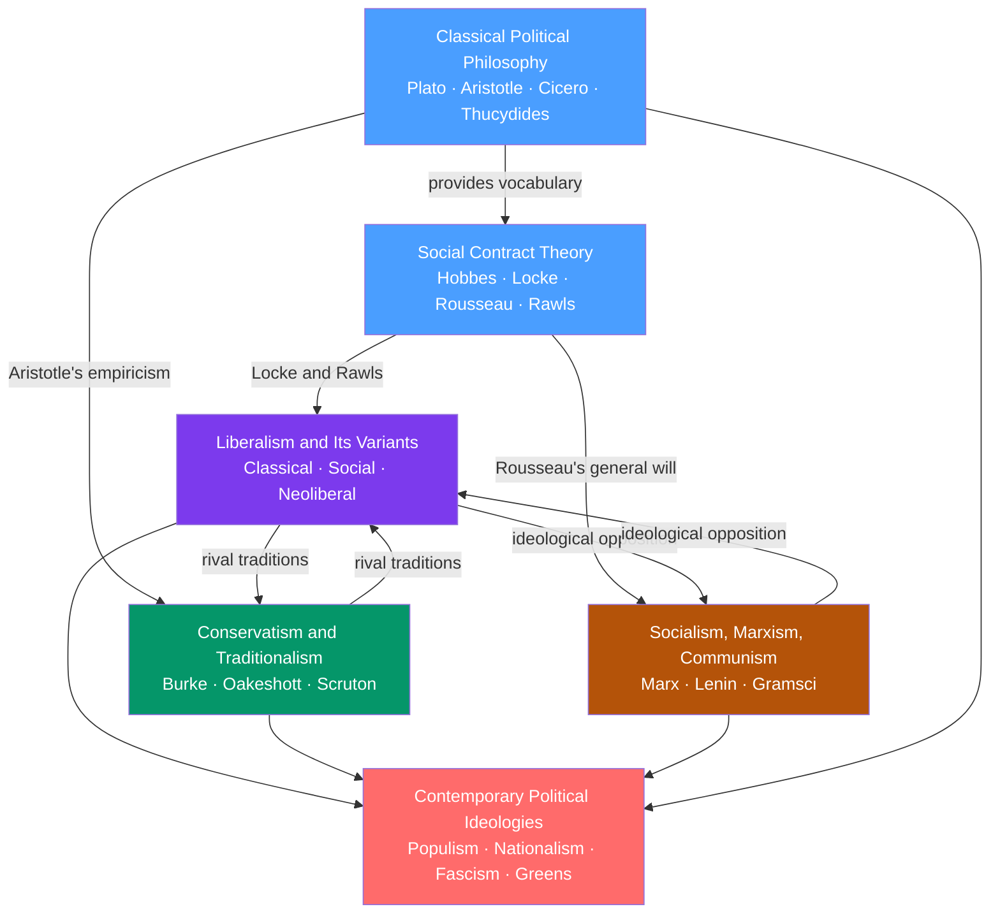

# Political Theory and Ideologies — Section Map of Content

> [!info] How to use this map
> Start with **Fundamentals**, follow the arrows, and use the Learning Path below as your guide.
> Each node links to a full note. Come back to this map when you feel lost.

> [!abstract] Section Overview
> This section maps the intellectual lineage from ancient Greek and Roman political philosophy through the Enlightenment social contract tradition to the great modern ideological families — liberalism, conservatism, and socialism — and finally to the 21st-century landscape of populism, nationalism, and beyond. Together the six notes answer political science's most fundamental question: on what basis should power be organized and justified? The section spans the full left-right ideological spectrum and provides the conceptual vocabulary that every other Political Science section draws upon.

---

## Section Concept Map

*(Blue = fundamental entry points, Purple/Green/Orange = intermediate ideological traditions, Red = advanced synthesis node; arrows show intellectual lineage and ideological rivalry)*

---

## Notes in This Section

| Note | Core Thinkers | Key Concept | Level |
|------|--------------|-------------|-------|
| [[Classical_Political_Philosophy]] | Plato, Aristotle, Cicero, Thucydides | State forms, justice, anacyclosis, natural law | Beginner |
| [[Social_Contract_Theory]] | Hobbes, Locke, Rousseau, Rawls | Legitimate authority via consent; state of nature | Beginner–Intermediate |
| [[Liberalism_and_Its_Variants]] | Locke, Mill, Keynes, Hayek, Rawls, Nozick | Negative vs. positive liberty; limited government | Intermediate |
| [[Conservatism_and_Traditionalism]] | Burke, Oakeshott, Hayek, Scruton | Institutional wisdom; Chesterton's Fence | Intermediate |
| [[Socialism_Marxism_and_Communism]] | Marx, Engels, Lenin, Gramsci, Frankfurt School | Historical materialism; class struggle; surplus value | Intermediate–Advanced |
| [[Contemporary_Political_Ideologies]] | Gellner, Anderson, Mudde, Paxton, Mouffe | 2D political compass; populism; nationalism; fascism | Advanced |

---

## Learning Paths

### Path 1 — Chronological / Historical

Follow the intellectual lineage from ancient Athens to the 21st-century ideological landscape.

1. [[Classical_Political_Philosophy]] — Start here; Plato, Aristotle, Cicero, and Thucydides supply the foundational vocabulary (justice, constitutions, natural law, power) that every later thinker argues with or against
2. [[Social_Contract_Theory]] — Enlightenment thinkers translate classical problems into the modern idiom; Hobbes draws on Thucydidean realism, Locke on Ciceronian natural law, Rousseau on Aristotelian civic participation, Rawls updates all four
3. [[Liberalism_and_Its_Variants]] — The dominant tradition of modernity; traces from Locke through Mill to Keynes, Hayek, and Rawls, mapping the negative/positive liberty fault line across three centuries
4. [[Conservatism_and_Traditionalism]] — The 19th-century reaction to liberal revolution; Burke, Oakeshott, and Scruton argue that inherited institutions encode knowledge that rationalist reform destroys
5. [[Socialism_Marxism_and_Communism]] — The radical critique; Marx inverts liberal political economy and generates the 20th century's most consequential ideological tradition
6. [[Contemporary_Political_Ideologies]] — The 21st-century synthesis; places all prior traditions on a 2D compass and adds nationalism, populism, fascism, Green politics, and techno-futurism

### Path 2 — Left-Right Ideological Spectrum

Trace from the shared democratic baseline outward to each ideological pole, then to the full compass.

1. [[Social_Contract_Theory]] — The shared baseline: all modern ideological families answer differently the question of what makes authority legitimate; understand this before reading any of the traditions
2. [[Socialism_Marxism_and_Communism]] — The LEFT anchor: collective ownership, class struggle, historical materialism; the full spectrum from reformist social democracy to Leninist communism to Gramscian post-Marxism
3. [[Liberalism_and_Its_Variants]] — The liberal CENTER: from social liberalism (Rawlsian welfare state, Keynesian economics) through classical liberalism to neoliberalism; the dominant post-war ideological framework
4. [[Conservatism_and_Traditionalism]] — RIGHT of center: organic society, Chesterton's Fence, Burkean prescription; the epistemological case for institutional caution over rationalist reform
5. [[Classical_Political_Philosophy]] — The ancient roots that the entire spectrum claims as ancestry: realists invoke Thucydides, liberals invoke Locke-via-Cicero, conservatives invoke Aristotle, socialists invoke Rousseau-via-Aristotle
6. [[Contemporary_Political_Ideologies]] — The full 2D compass: locates every tradition relative to every other; adds the far extremes (fascism, anarcho-capitalism) and post-liberal formations (populism, Green politics, techno-futurism)

---

## Cross-Section Connections

- **Links to S02 (Comparative Politics):** The ideologies here directly generate the constitutional forms and regime types analyzed comparatively in S02; liberal democracy, socialist states, and authoritarian regimes are institutional expressions of the ideological commitments studied here; the anacyclosis model in Classical Political Philosophy maps directly to regime-change analysis
- **Links to S05 (Political Behavior):** Haidt's moral foundations theory (covered in Conservatism) explains partisan sorting and ideological polarization; the authoritarian personality and SDO research in Contemporary Political Ideologies directly informs voter psychology and mass mobilization; Gramsci's hegemony framework explains political socialization and ideological reproduction

---

## Cross-Vault Links

- **Psychology vault** — [[Moral_Development]] (Kohlberg's stages map onto social contract reasoning and liberal moral philosophy); [[Cognitive_Biases]] (status quo bias and loss aversion underpin conservative psychology); [[Group_Dynamics]] (class consciousness, factional politics, group polarization); [[Social_Influence_and_Conformity]] (Gramsci's hegemony; Plato's Allegory of the Cave); [[Prejudice_and_Discrimination]] (social identity theory as the psychological engine of nationalism); [[Attitudes_and_Persuasion]] (ideological recruitment, framing effects, elite cuing)
- **Game Theory vault** — [[Nash_Equilibrium]] (Melian Dialogue as a game with no cooperative equilibrium; Hobbesian state of nature as a defection trap); [[Repeated_Games_and_Folk_Theorems]] (Burkean institutions as sustained cooperation equilibria; Lockean social contract without Leviathan); [[Public_Goods]] (free-rider problem as the microeconomic foundation of political authority); [[Bargaining_Theory]] (Rawls' original position as a symmetric bargaining game)
- **Macroeconomics vault** — [[Government_Spending_Multiplier]] (the Keynesian economic foundation of social liberalism and the welfare state); [[Tax_Policy]] (supply-side economics as the fiscal expression of neoliberalism)
- **Microeconomics vault** — [[Market_Failures]] (the social liberal case for state intervention; Marxist critique that market failures are structural features, not exceptions); [[Development_Economics]] (Washington Consensus as applied neoliberalism; dependency theory as applied Leninism)

---

## Key Questions This Topic Answers

- What makes political authority legitimate — consent, expertise, tradition, or force?
- What is the difference between negative liberty (freedom from coercion) and positive liberty (freedom to act), and why does this distinction divide modern politics?
- Why did Marx predict capitalism would collapse, and why hasn't it?
- What is Chesterton's Fence, and why do conservatives insist on it before reforming any institution?
- How does the 2D political compass expose the analytical failure of the left-right spectrum?
- What distinguishes populism from fascism, and why does the confusion matter for democratic theory?

---

[[_MOC_Political_Science_Master]]

#MOC #PoliticalScience #PoliticalTheory #SectionMOC
