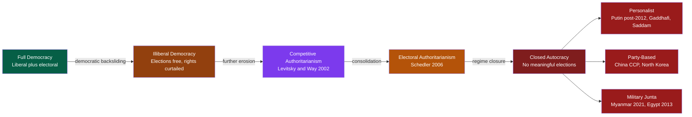

> [!abstract] TL;DR
> Authoritarianism covers the vast middle ground between full liberal democracy and totalitarian mass terror: regimes with limited pluralism, no mobilizing ideology, and deliberately depoliticized populations. Competitive and electoral authoritarianism use the formal machinery of democracy — elections, courts, legislatures — while systematically tilting the playing field. Selectorate theory explains *why* leaders choose small winning coalitions: private goods are cheaper than public ones. Modern democratic backsliding happens not through coups but through legal, incremental executive aggrandizement.

---

## Intuition

**Analogy:** Imagine a professional sports league where one team secretly owns the referees, controls the broadcast rights, and can change the rules mid-season — but the games are still played, the scores still matter, and other teams occasionally win. You cannot call it "not a real league," but you also cannot call it a fair one.

This is competitive authoritarianism. The incumbent controls enough of the infrastructure of competition — courts, electoral commissions, tax authorities, state-owned media — that they almost always win. But they cannot simply cancel the game, because the appearance of legitimacy is itself a tool of governance. Opposition parties exist, journalists investigate, some elections are close. The regime needs the *form* of democracy to project legitimacy domestically and internationally, even as the *substance* is hollowed out.

The deeper point: authoritarian rule covers a wide spectrum. At one pole is **full liberal democracy** (free, fair, competitive elections plus civil liberties). At the other is **totalitarianism** (total penetration of society, mobilizing ideology, mass terror — Nazi Germany, Stalinist USSR). In between lies a vast and stable zone of regimes that are neither — the subject of this note.

---

## How It Works



---

## Key Concepts

### Secondary Level

**What is authoritarianism?**
A regime is authoritarian when political power is concentrated in the hands of a leader or small group who is not meaningfully accountable to the population through free, fair, and competitive elections. Citizens have reduced civil liberties — free speech, assembly, press — but are not necessarily subject to mass terror or a compulsory ideology. Most people in authoritarian states go about their daily lives largely unmolested, as long as they do not challenge the regime directly.

**The basic spectrum:**

| Regime Type | Elections? | Civil Liberties? | Ideology? | Mobilization? |
|---|---|---|---|---|
| Liberal Democracy | Free and fair | Protected | Pluralist | Optional |
| Illiberal Democracy | Free but degraded | Partially curtailed | Populist | Low |
| Competitive Authoritarianism | Held but unfair | Significantly curtailed | Weak | Low |
| Electoral Authoritarianism | Heavily manipulated | Repressed | Nationalist | Managed |
| Closed Autocracy | None or pure theater | Absent | Optional | Suppressed or staged |
| Totalitarianism | None | Absent | Compulsory | Intensive, mandatory |

**Why do people accept authoritarian rule?**
Acceptance is rarely purely a product of fear. Authoritarian regimes typically combine:
1. **Performance legitimacy** — economic growth, public order, national prestige (China, Singapore)
2. **Nationalist appeal** — framing the leader as defender of the nation against foreign enemies or internal minorities
3. **Selective cooptation** — providing material benefits (jobs, subsidies, contracts) to key constituencies
4. **Information control** — propaganda limits the citizen's ability to evaluate alternatives
5. **Manufactured fear** — regime exaggerates threats from opponents, minorities, or foreign powers

---

### Undergraduate Level

**Linz's Three-Feature Definition (1964, 1975)**

Juan Linz's foundational definition identifies three features that distinguish authoritarianism from both democracy and totalitarianism:

1. **Limited pluralism** — Some independent organizations exist (churches, businesses, professional associations, regional governments), but they cannot challenge the regime. Civil society is tolerated at sub-political levels. This is the key difference from totalitarianism, which seeks to eliminate all independent organizations.

2. **No elaborate guiding ideology** — Authoritarian regimes rely on vague "mentalities" (nationalism, anti-communism, traditional values) rather than a systematic, utopian ideology that explains the world and demands mass transformation. Franco's Spain was Catholic but not Fascist in the ideological sense; the regime justified itself on "order" and tradition, not a totalizing vision.

3. **Depoliticized masses** — The ruler wants passive acceptance, not enthusiastic participation. An actively mobilized population is unpredictable and dangerous. Authoritarian leaders demobilize: they suppress independent political organizing without demanding that citizens attend rallies or join the party.

**Totalitarianism vs. Authoritarianism (Linz + Arendt)**

| Dimension | Authoritarianism | Totalitarianism |
|---|---|---|
| Pluralism | Limited but present | Absent; eliminated |
| Ideology | Vague mentality | Systematic, compulsory, utopian |
| Mass mobilization | Suppressed / demobilized | Intensive, mandatory |
| Repression | Targeted (opponents) | Random, to create terror |
| Goal | Regime survival | Transform human nature / society |
| Classic examples | Franco, Pinochet, Mubarak | Stalin, Hitler, Mao (Great Leap forward) |

Hannah Arendt (*The Origins of Totalitarianism*, 1951) stressed that totalitarian terror is not merely extreme repression — it is a qualitatively different instrument designed to atomize society and make collective resistance impossible. Random terror, not targeted terror, serves this purpose. Authoritarian regimes repress specifically to protect themselves; totalitarian terror creates pervasive fear even among the loyal.

**Regime Subtypes (Geddes 1999)**

Authoritarian regimes differ sharply in their internal organization, which predicts their survival and breakdown:

| Subtype | Power Basis | Succession | Vulnerability |
|---|---|---|---|
| **Personalist** | Single leader; personal loyalty networks | Severe crisis at death | Palace coups, poor policy choices |
| **Party-based** | Party apparatus controls state, military, economy | Institutionalized (Politburo) | Internal party splits |
| **Military** | Armed forces as corporate actor; leader accountable to officer corps | Managed within military | Economic failure; mass protest |
| **Hybrid** | Combinations of above | Variable | Complex; case-specific |

*Personalist regimes* (Mobutu, Saddam, Gaddhafi) are most corrupt, most repressive, and hardest to reform from within — all resources flow through the leader. *Party-based regimes* (China, North Korea, PRI-era Mexico) are most durable because succession is routinized and collective decision-making allows policy learning. *Military regimes* are the most unstable; officers often see themselves as caretakers who intend to hand power back (but frequently do not).

**Competitive Authoritarianism (Levitsky and Way, 2002, 2010)**

Steven Levitsky and Lucan Way define competitive authoritarianism as: regimes in which "formal democratic institutions are widely viewed as the primary means of obtaining and exercising political authority, but in which incumbents' abuse of the state places them at a significant advantage vis-a-vis their opponents."

Four arenas of competition are systematically tilted:
1. **Electoral arena** — voter intimidation, ballot stuffing, gerrymandering, disqualifying candidates, restricting opposition campaigning
2. **Legislative arena** — packing the legislature with loyalists, stripping legislative powers, ruling by decree
3. **Judicial arena** — appointing loyal judges, prosecuting opposition leaders, ignoring court rulings
4. **Media arena** — harassing independent outlets, withdrawing advertising, prosecuting journalists, buying or seizing major broadcasters

The key distinction: in competitive authoritarianism, the incumbent *can lose* and sometimes *does lose* (Slovakia 1998, Croatia 2000, Serbia 2000). The playing field is uneven but not infinite — real competition exists and real uncertainty about outcomes exists, unlike in closed autocracies.

**Electoral Authoritarianism (Schedler, 2006)**

Andreas Schedler's concept overlaps with but is narrower than Levitsky and Way's. Electoral authoritarianism describes regimes where multiparty elections are held but the result is predetermined or so heavily controlled that it amounts to a facade. The key instrument is the "menu of manipulation": outright fraud, rules manipulation, candidate disqualification, and vote-buying are deployed systematically. Egypt under Mubarak: opposition parties existed, elections were held, opposition candidates could run, but the outcome was never seriously in doubt.

**Democratic Backsliding (Bermeo, 2016)**

Nancy Bermeo distinguishes six forms of democratic backsliding:

1. **Open-ended military coups** — military overthrows civilian government with no stated democratizing intent. Increasingly rare since the Cold War.
2. **Executive coups** — democratically elected executives use emergency powers to seize permanent control (Fujimori in Peru, 1992).
3. **Election day vote fraud** — large-scale fraud on election day. Now rare in previously stable democracies.
4. **Promissory coups** — military claims it is overthrowing an authoritarian to restore democracy (Egypt 2013).
5. **Executive aggrandizement** — *the most common contemporary form*: elected executives weaken checks and balances through a series of individually legal steps. Erdogan in Turkey, Orban in Hungary, Chavez in Venezuela. Each step looks "normal" or "legal"; the cumulative effect is regime transformation.
6. **Strategic manipulation and harassment** — sub-constitutional manipulation: taxing opposition-friendly businesses, selectively enforcing laws against critics, controlling party finance rules.

The shift from coup-based backsliding to executive aggrandizement is the defining feature of the "third wave reversal" era (post-1990). Modern democratic erosion is usually legal, incremental, and difficult to identify at any single moment.

---

### Graduate Level

**Selectorate Theory (Bueno de Mesquita, Smith, Siverson, Morrow, 2003)**

*The Logic of Political Survival* presents a unified formal theory of regime type based on two variables:

- **S (Selectorate)**: the full set of people with a formal role in choosing the leadership (in democracies: all voters; in monarchies: the royal family; in military regimes: officer corps)
- **W (Winning Coalition)**: the minimum subset of S whose support the leader actually needs to hold power

The key insight is the **W/S ratio**:

- **Small W, large S** (autocracy): Each coalition member receives a large private good (R/W is high). Excluded members of S are unlikely to be included in any challenger's coalition (probability = W/S is low — the "loyalty norm"). Result: cheap, stable loyalty through patronage and rents; little incentive to provide public goods.

- **Large W, near-universal S** (democracy): Private goods per member are diluted (R/W is low). Excluded members are plentiful. Challengers can easily credibly promise the same goods as the incumbent. Result: leaders must compete by providing public goods (education, healthcare, rule of law) that benefit the large coalition broadly.

**The Iron Law of oligarchy in formal terms**: Leaders always prefer to *reduce* W, because smaller W means cheaper loyalty. The impulse toward oligarchy is structurally embedded in the political survival problem. Leaders face constraints (the military, the economy, international pressure) that prevent arbitrarily shrinking W, but the incentive always points toward smaller coalitions.

**Survival probability formalism** (see Python demo below):

```
Survival_i ∝ (R / W) × (1 - W/S)
```

- `R/W` = private good per coalition member; maximized when W is small
- `(1 - W/S)` = probability excluded members do NOT end up in challenger's coalition; maximized when W << S

**Authoritarian Resilience: The Three-Pillar Model (Gerschewski, 2013)**

Johannes Gerschewski identifies three mutually reinforcing mechanisms that sustain authoritarian regimes:

1. **Legitimation** — Generating popular acceptance or active support. Subtypes: electoral (controlled elections as legitimacy ritual), performance (economic delivery), nationalist (regime as defender of nation), ideological (comprehensive worldview). China's CCP relies heavily on performance legitimacy; Russia under Putin on nationalist legitimacy. Legitimation reduces the need for overt repression.

2. **Cooptation** — Incorporating potential opponents into the regime structure by offering material benefits, status, or power-sharing. Key targets: business elites, military, regional bosses, intellectual class. Cooptation buys complicity rather than mere compliance. The Chinese party-state's capacity to absorb and reward business elites, technocrats, and regional officials is a central feature of its resilience.

3. **Repression** — Deterring and punishing challengers through surveillance, imprisonment, violence, and legal harassment. Repression is costly (alienates potential allies, risks international sanction, requires a loyal security apparatus) and can be counterproductive (producing martyrs, galvanizing opposition). Effective regimes use targeted, "smart" repression against high-value targets while keeping generalized repression low.

The three pillars interact: high legitimacy reduces repression costs; heavy repression undermines legitimacy; extensive cooptation reduces the pool available to repress. Regime stability is maximized when all three are active simultaneously.

**Authoritarian Learning and Diffusion (Heydemann and Leenders, 2011)**

Authoritarian regimes do not survive in isolation. They observe each other's failures and successes, adapting tactics through a process of "authoritarian learning." The Arab Spring (2011) demonstrated that information about successful uprisings spreads across borders — but also that authoritarian responses (preemptive cooptation, targeted repression, social media manipulation) spread similarly. The diffusion of "best practices" of authoritarian control (China's Great Firewall model, Russia's "sovereign democracy" rhetoric, Hungary's judicial capture playbook) constitutes an international authoritarian learning network.

**Stealth Authoritarianism (Varol, 2015)**

Aziz Huseyin Varol's concept describes regimes that use legal instruments designed for democratic governance to achieve authoritarian ends:
- Packing courts through legal appointment processes (Hungary, Poland)
- Amending constitutions through supermajority procedures to extend term limits (Russia 2020)
- Using anti-corruption or counter-terrorism laws to target opposition
- Restructuring electoral laws within constitutional bounds to guarantee outcomes

The key feature: every individual act is formally legal, even technically democratic. The authoritarian transformation is visible only in the cumulative pattern, not any single decision. This makes both domestic and international resistance harder to mount.

**Neopatrimonialism and Sultanistic Regimes**

In neopatrimonial regimes, a formally modern bureaucratic state is overlaid with personal, patron-client relations. The ruler treats state resources as personal property; offices are personal appointments rather than institutional roles. Max Weber's concept of "sultanism" (extreme personalism, arbitrary rule, personal dependence of officials on the ruler) was applied to modern regimes by Linz and Stepan. Sultanistic regimes (Batista's Cuba, Duvalier's Haiti, Marcos's Philippines) are extreme personalist autocracies notable for their corruption, instability, and tendency to collapse rapidly once the ruler dies or flees.

---

## Python Demo

```python
# Selectorate Theory — Bueno de Mesquita, Smith, Siverson & Morrow (2003)
# Simulate a dictator's survival probability as a function of winning coalition
# size W drawn from a total selectorate S.
# Principal (leader) distributes total resources R to retain coalition loyalty.

import numpy as np
import matplotlib.pyplot as plt

# ----- Model Parameters -----
S = 1000            # Total selectorate (all who nominally choose the leader)
R = 100.0           # Total divisible resources controlled by the leader
W_vals = np.arange(5, S, 5)    # range of winning coalition sizes to evaluate
w_ratio = W_vals / S            # W/S — the key ratio in selectorate theory

# ----- Private good per loyalist: R / W -----
# Each coalition member receives R/W. Smaller W means more per member.
# This is the patronage dividend; it rationalises loyalty even without ideology.
private_good = R / W_vals

# ----- Exclusion risk (loyalty norm) -----
# If a coalition member defects to a challenger who also needs W members
# from S, the probability that the defector ends up in the challenger's
# new coalition is W/S. When W << S, defection is a high-risk gamble.
prob_in_challenger_coalition = W_vals / S
loyalty_norm = 1.0 - prob_in_challenger_coalition   # high when W << S

# ----- Composite survival index -----
# Leader survival is jointly determined by (a) private good magnitude
# and (b) how strongly the loyalty norm discourages defection.
pg_norm  = private_good / private_good.max()        # normalise to [0, 1]
survival = pg_norm * loyalty_norm
survival /= survival.max()                           # rescale to [0, 1]

# ----- Optimal W: coalition size that maximises survival index -----
opt_idx  = np.argmax(survival)
opt_W    = W_vals[opt_idx]
opt_wr   = w_ratio[opt_idx]

# ----- Plot -----
fig, axes = plt.subplots(1, 2, figsize=(12, 5))

# Panel 1: Survival index vs coalition fraction (W/S)
axes[0].plot(w_ratio, survival, color="darkred", lw=2)
axes[0].axvline(opt_wr, color="gold", lw=1.5, ls="--",
                label=f"Optimal W/S = {opt_wr:.3f}")
axes[0].axvspan(0.00, 0.10, alpha=0.12, color="red",   label="Autocratic zone")
axes[0].axvspan(0.50, 1.00, alpha=0.12, color="green", label="Democratic zone")
axes[0].set_xlabel("Coalition fraction of selectorate  (W / S)")
axes[0].set_ylabel("Normalised leader survival index")
axes[0].set_title("Selectorate Theory: Leader Survival Curve")
axes[0].legend(fontsize=9)
axes[0].grid(alpha=0.3)

# Panel 2: Private good vs public good cost
public_good_cost = R * w_ratio  # total resources needed to satisfy coalition via public good
axes[1].plot(W_vals, private_good,    color="steelblue", lw=2,
             label="Private good per loyalist  (R / W)")
axes[1].plot(W_vals, public_good_cost, color="seagreen", lw=2, ls="--",
             label="Public good total cost  (R x W/S)")
axes[1].axvline(opt_W, color="gold", lw=1.5, ls="--",
                label=f"Optimal W = {opt_W}")
axes[1].set_xlabel("Winning Coalition Size  (W)")
axes[1].set_ylabel("Resources")
axes[1].set_title("Private vs. Public Good Trade-off")
axes[1].legend(fontsize=9)
axes[1].grid(alpha=0.3)
axes[1].set_xlim(0, S)

plt.tight_layout()
plt.savefig("selectorate_theory.png", dpi=150)

print(f"Optimal coalition: W = {opt_W}  (W/S = {opt_wr:.3f})")
print(f"Private good per member at optimal W: {private_good[opt_idx]:.2f}")
print(f"Loyalty norm at optimal W: {loyalty_norm[opt_idx]:.3f}")
print("Chart saved to selectorate_theory.png")
```

The model predicts that the survival-maximising coalition is *small but not tiny* — a dictator with W=5 has enormous private goods per member but such a small coalition that a single defection is catastrophic. The sweet spot (W/S around 0.05–0.15) represents the typical authoritarian "small coalition" zone. Democratic regimes (W/S > 0.5) survive through the public goods channel, not the private goods channel.

---

## Real-World Applications

**Russia (Putin, 1999–present): From competitive authoritarianism to near-closed autocracy**

Putin's Russia is the canonical case of regime trajectory across the spectrum. Phase 1 (1999–2007): genuine (if skewed) electoral competition, opposition parties in parliament, independent regional elites, a partially free press. Phase 2 (2008–2011): Medvedev interlude; managed democracy; opposition exists but is systematically harassed. Phase 3 (2012–present): Navalny poisoned and jailed, Novaya Gazeta shuttered, opposition parties deregistered, constitutional amendment resetting term limits (2020), full-scale invasion of Ukraine prompting near-total media shutdown (2022). The winning coalition has visibly contracted to a small circle of siloviki (security service veterans) with enormous private rents.

**China (CCP, 1978–present): Party-based authoritarianism with performance legitimacy**

The Chinese Communist Party is the archetype of durable party-based authoritarianism. The CCP survives through: (1) a massive cooptation apparatus (business elites, technocrats, regional officials are absorbed into or allied with the party); (2) performance legitimacy through three decades of ~8% annual GDP growth; (3) sophisticated information control (Great Firewall, content moderation, social credit monitoring); (4) targeted repression against Uyghurs, Tibetans, and political challengers. Xi Jinping's consolidation since 2012 has shifted the regime toward personalism — removing term limits (2018), purging rivals under anti-corruption campaigns, building a personality cult — stressing the party-based equilibrium.

**Hungary (Orban/Fidesz, 2010–present): Democratic backsliding inside the EU**

Hungary under Viktor Orban is the most-studied case of executive aggrandizement within a formally democratic, EU-member state. After winning a supermajority in 2010, Fidesz: replaced the Constitutional Court with loyalists; rewrote electoral laws to favour rural (Fidesz-friendly) constituencies; captured 90% of media through allied oligarchs; packed universities; removed the Central Election Commission's independence. Orban explicitly used the term "illiberal democracy" to describe his project. The EU's leverage proved limited because Orban's changes were formally legal. Freedom House now classifies Hungary as "partly free" — the first EU member to fall below "free."

**Turkey (Erdogan/AKP, 2002–present): From moderate CA to personalist consolidation**

Turkey's trajectory shows two distinct phases. 2002–2013: genuine competitive authoritarianism with real opposition, independent judiciary, a free press with significant reach. 2013–present (post-Gezi, post-coup 2016): massive purges (150,000 officials dismissed), presidential system replacing parliamentary (2017), main opposition newspapers closed, Kurdish parties' elected officials removed. The 2016 coup attempt paradoxically accelerated Erdogan's consolidation: it provided legitimacy for purges far beyond any actual coup plotters, hollowing out the military, judiciary, police, and academia simultaneously.

**Mexico (PRI, 1929–2000): Hegemonic party authoritarianism**

The Partido Revolucionario Institucional governed Mexico for 71 years without losing a presidential election. The PRI system was a model of electoral authoritarianism: elections were held, opposition parties existed, votes were counted — but the PRI controlled electoral rules, owned state media, used government resources for campaigns, and engaged in selective fraud when needed. The system was also sophisticated in cooptation: labor unions, business associations, and peasant organizations were all formally incorporated into the PRI structure ("corporatism"). Democratic transition came incrementally through electoral reforms, opposition wins at lower levels, and eventually the 2000 presidential election won by Vicente Fox.

---

## Common Pitfalls

- **Conflating totalitarianism with authoritarianism** — Calling Putin's Russia or Orban's Hungary "totalitarian" is analytically wrong. Totalitarianism requires compulsory ideology, intensive mass mobilization, and the destruction of all independent social organizations. Most contemporary authoritarian regimes are personalist or competitive-authoritarian, not totalitarian. The distinction matters because the dynamics, survival strategies, and paths to liberalization differ radically.

- **Assuming elections imply democracy** — Holding multiparty elections is neither necessary nor sufficient for democracy. Electoral authoritarianism specifically uses elections as a legitimation device and popularity-testing mechanism, not as a genuine accountability mechanism. Schedler's "menu of manipulation" shows the many ways elections can be instrumentalized. Always ask: Are the elections *consequential* (could the incumbent lose) and *procedurally fair*?

- **Treating hybrid regimes as transitional** — The "democratization wave" literature of the 1990s assumed hybrid regimes were unstable in-between states transitioning toward full democracy. Empirically, many competitive and electoral authoritarian regimes are highly stable equilibria — they can last decades (Russia, Zimbabwe). The "transition paradigm" (Carothers, 2002) was wrong to assume all states on the spectrum were moving toward democracy.

- **Ignoring the international dimension** — Authoritarian regimes are not isolated domestic phenomena. Levitsky and Way's work shows that "linkage" (economic, social, and communicative ties to the West) and "leverage" (Western political conditionality) are critical determinants of whether competitive authoritarianism consolidates or transitions. Russia actively supports authoritarian incumbents elsewhere (Belarus, Venezuela, Syria). China exports the Great Firewall model. The international political economy of authoritarianism is not epiphenomenal.

- **Misapplying selectorate theory** — The W/S model is a simplified abstraction. The selectorate and winning coalition are not directly measurable in most regimes; they are theoretical constructs. The model should inform qualitative analysis (who does the leader need? what are they being paid?) rather than be treated as a precise predictive instrument.

---

## Related Concepts

- [[_MOC_Comparative_Politics|↑ Comparative Politics MOC]]
- [[Social_Influence_and_Conformity]] — Milgram's agentic state and obedience to authority are the psychological micro-foundations of why individuals comply with authoritarian commands; the escalation mechanism explains how ordinary people participate in oppression
- [[Group_Dynamics]] — Groupthink in elite inner circles explains poor authoritarian policy decisions; deindividuation explains crowd behavior in staged mobilization events
- [[Prejudice_and_Discrimination]] — In-group/out-group dynamics and scapegoating are core tools of authoritarian legitimation; persecution of minorities provides the regime a focal enemy
- [[Attitudes_and_Persuasion]] — State propaganda uses peripheral-route persuasion, mere exposure effects, and authority cues to build manufactured consent; Cialdini's social proof and authority principles are deployed systematically
- [[Cognitive_Biases]] — Information control and propaganda exploit availability bias, in-group favoritism, and motivated reasoning to insulate regime narratives from evidence
- [[Coalitional_Games_and_Shapley_Value]] — The winning coalition in selectorate theory is a cooperative game problem; Shapley values formalize the marginal contribution of coalition members to regime survival
- [[Power_Indices]] — Shapley-Shubik and Banzhaf indices apply directly to weighted voting in authoritarian councils (Politburo, military junta) where nominal votes diverge from actual power
- [[Nash_Equilibrium]] — Authoritarian stability can be modeled as a coordination game; citizens may prefer democracy but coordinate on compliance because unilateral defection is fatal
- [[Repeated_Games_and_Folk_Theorems]] — The loyalty norm in selectorate theory is a repeated-game equilibrium: coalition members stay loyal because the long-run private goods stream dominates the one-shot defection gain
- [[Moral_Hazard]] — The principal-agent problem between a dictator and their security apparatus is acute: agents have private information and may use repression for personal benefit rather than regime stability

---

## Review Questions

### Secondary
1. What are Juan Linz's three defining features of authoritarianism, and how does each one differ from both democracy and totalitarianism? Give a concrete historical example for each feature.
2. Why might citizens in an authoritarian state not actively resist or even support the regime? Identify three distinct mechanisms and explain how each operates.

### Undergraduate
3. Levitsky and Way describe four "arenas" in which competitive authoritarianism operates. Choose one arena and explain how an incumbent regime could systematically tilt it without committing an act that is formally illegal.
4. Bermeo identifies six types of democratic backsliding. Why has executive aggrandizement become the most common contemporary form, replacing open military coups? What structural and international changes explain this shift?
5. Compare personalist and party-based authoritarian regimes on at least three dimensions (cooptation strategy, succession, resilience). Which subtype is more durable and why?

### Graduate
6. In selectorate theory, a leader who faces a credible coup threat from the military has an incentive to restructure the winning coalition. Using the formal W/S model, explain the trade-offs the leader faces: what happens to survival probability if they shrink W to exclude military officers, and what risks does this create?
7. Gerschewski's three-pillar model (legitimation, cooptation, repression) claims the pillars are complementary but also substitutable. Design a research strategy to empirically test whether high performance legitimacy (economic growth) reduces the optimal level of repression, holding cooptation constant. What data would you need, and what identification challenges arise?
8. Varol's "stealth authoritarianism" argues that legal mechanisms can achieve authoritarian ends without a single identifiable anti-democratic act. What implications does this have for international democracy-promotion organizations (such as the EU or Freedom House)? How should they adapt their monitoring and enforcement frameworks?

---

## Sources

- Juan Linz, *Totalitarian and Authoritarian Regimes* (Lynne Rienner, 1975; revised 2000)
- Hannah Arendt, *The Origins of Totalitarianism* (Harcourt, 1951)
- Steven Levitsky and Lucan A. Way, "The Rise of Competitive Authoritarianism," *Journal of Democracy* 13(2), 2002
- Steven Levitsky and Lucan A. Way, *Competitive Authoritarianism: Hybrid Regimes After the Cold War* (Cambridge UP, 2010)
- Andreas Schedler (ed.), *Electoral Authoritarianism: The Dynamics of Unfree Competition* (Lynne Rienner, 2006)
- Bruce Bueno de Mesquita, Alastair Smith, Randolph Siverson, and James Morrow, *The Logic of Political Survival* (MIT Press, 2003)
- Nancy Bermeo, "On Democratic Backsliding," *Journal of Democracy* 27(1), 2016
- Johannes Gerschewski, "The Three Pillars of Stability: Legitimation, Repression, and Co-optation in Autocratic Regimes," *Democratization* 20(1), 2013
- Barbara Geddes, "What Do We Know About Democratization After Twenty Years?" *Annual Review of Political Science* 2, 1999
- Aziz Huseyin Varol, "Stealth Authoritarianism," *Iowa Law Review* 100, 2015
- Steven Heydemann and Reinoud Leenders, "Authoritarian Learning and Authoritarian Resilience," *Globalizations* 8(5), 2011
- Thomas Carothers, "The End of the Transition Paradigm," *Journal of Democracy* 13(1), 2002

---

#PoliticalScience #ComparativePolitics #Authoritarianism
