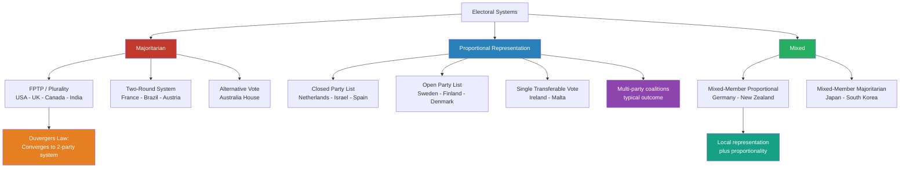

# 🗳️ Democracy Types and Electoral Systems

> [!abstract] TL;DR
> Democracy is not a single institution but a family of institutional arrangements. The two most consequential design choices are **form of executive power** (presidential, parliamentary, semi-presidential) and **electoral formula** (majoritarian vs. proportional). Duverger's Law predicts that plurality voting converges to two-party competition through strategic voting, while proportional systems enable multi-party coalitions. Lijphart's majoritarian/consensus typology shows how these choices cascade into broader patterns of governance — and consensus democracies systematically outperform majoritarian ones on citizen satisfaction and welfare outcomes.

---

## Intuition

**Analogy:** Imagine ten people voting on pizza toppings. Under **FPTP pizza**: whichever topping gets the most first-choice votes wins — 4 votes for pepperoni beats 3 for mushroom, 2 for olive, 1 for anchovy, so everyone gets pepperoni even though 6 of 10 people preferred something else. Under **PR pizza**: the pizza is sliced proportionally — 40% pepperoni, 30% mushroom, 20% olive, 10% anchovy — every preference is reflected. Under **IRV pizza**: voters rank all toppings; the least-popular (anchovy) is eliminated and those ballots transfer to their second choices; the process repeats until one topping has a majority.

The same 10 voters, the same preferences, three radically different outcomes. Scaled to national elections, these differences determine whether a country has two dominant parties or seven, whether a single party governs or coalitions form, and whether minority preferences have any legislative voice at all. Electoral systems are the rules of the game — and as in game theory, changing the rules changes rational strategy, which changes outcomes.

---

## How It Works

### Core Mechanics

Electoral systems perform a single fundamental task: converting votes into seats (or, for single-winner elections, into one winner). Three families exist:

1. **Majoritarian systems** allocate each seat to whoever wins the most votes in a given constituency. They produce clear majorities but systematically distort the vote-to-seat ratio.
2. **Proportional representation (PR) systems** allocate seats in proportion to vote share across larger multi-member constituencies. They reflect voter preferences accurately but often produce fragmented parliaments requiring coalition negotiations.
3. **Mixed systems** combine both: some seats by single-member plurality, others by party-list PR to compensate for disproportionality (MMP) or simply add on top (MMM).

### Flow / Architecture



---

## Key Concepts

### Secondary Level

#### Types of Democracy

| Type | Description | Example |
|------|-------------|---------|
| **Direct** | Citizens vote on laws directly; no elected intermediaries | Swiss referenda, Athenian ecclesia |
| **Representative** | Citizens elect representatives who make decisions | Most modern states |
| **Deliberative** | Emphasis on reasoned public discourse before decisions | Irish citizens' assemblies |
| **Liberal** | Majority rule constrained by individual rights and rule of law | USA, UK, France |
| **Illiberal** | Competitive elections exist but civil liberties are curtailed | Hungary post-2010, Turkey |

#### Presidential vs. Parliamentary Systems

| Feature | Presidential | Parliamentary | Semi-Presidential |
|---------|-------------|---------------|-------------------|
| Executive source | Directly elected | Elected by legislature | President elected; PM from parliament |
| Separation of powers | Strict | Fused | Partial |
| Government survival | Fixed term | Depends on legislative confidence | Hybrid |
| Examples | USA, Brazil, Mexico | UK, Germany, Sweden | France, Finland, Russia |

**Presidential systems** feature a directly elected executive with a fixed term, independent of the legislature. This produces gridlock when different parties control the presidency and Congress, but also stability and clear accountability.

**Parliamentary systems** fuse executive and legislative power: the government (cabinet) is formed from the parliamentary majority and falls if it loses a confidence vote. Governments are more responsive but can be unstable — Italy has had over 69 governments since 1945.

**Semi-presidential** (a term coined by Duverger himself) divides executive power: a directly elected president handles foreign policy and security, while a prime minister drawn from parliament handles domestic affairs. France's Fifth Republic is the canonical model.

#### FPTP vs. Proportional Representation — The Basics

**First-Past-The-Post (FPTP):**
- Each constituency elects one member
- Candidate with most votes wins, regardless of whether they have an absolute majority
- Simple, tends to produce single-party majorities, but wastes all votes cast for losing candidates
- UK 2015: Conservatives won 51% of seats with 37% of votes; UKIP won 13% of votes but only 1 seat

**Proportional Representation (PR):**
- Voters choose parties (or rank candidates)
- Seats allocated in proportion to vote share across a larger multi-member region
- Netherlands uses nationwide PR: a party with 1.5% of votes gets roughly 2–3 seats in a 150-seat parliament
- A minimum threshold (e.g., Germany's 5%) prevents extreme fragmentation

#### Gerrymandering

Drawing constituency boundaries to systematically favor one party. In FPTP systems, two tactics are used:
- **Packing**: Concentrating opposition voters into a few districts where they win by huge margins, wasting their votes.
- **Cracking**: Distributing opposition voters thinly across many districts where they fall just short of winning.

Together, packing and cracking can translate a minority of votes into a majority of seats. Named after Massachusetts Governor Elbridge Gerry (1812), whose redistricting created a salamander-shaped district. It does not occur under PR because constituencies are large or national, removing the incentive to draw boundaries strategically.

---

### Undergraduate Level

#### Dahl's Polyarchy

Robert Dahl (1971) replaced the idealized term "democracy" with **polyarchy** (rule of the many) — the real-world approximation. Eight institutional guarantees are required:

1. Freedom to form and join organizations
2. Freedom of expression
3. Right to vote
4. Eligibility for public office
5. Right of political leaders to compete for support and votes
6. Alternative (non-government-controlled) sources of information
7. Free and fair elections
8. Institutions making government policies depend on votes and other expressions of preference

Polyarchy is a continuum, not a binary. Dahl measures states on two axes: **contestation** (how openly can groups compete for power?) and **inclusion** (how many people have full political rights?). Many states have high contestation but low inclusion (South Africa pre-1994 had competitive white elections) or vice versa (post-war Eastern Bloc had near-universal suffrage but no contestation).

#### Lijphart's Majoritarian vs. Consensus Democracy

Arend Lijphart (*Patterns of Democracy*, 1999, 36 countries, 1945–1996) identified two pure models structured along two dimensions:

**Dimension 1 — Parties-Executives:**
- *Majoritarian*: executive dominance, two-party competition, adversarial winner-takes-all politics (UK Westminster model)
- *Consensus*: multi-party power-sharing, oversized coalitions, bargained policy outcomes (Switzerland, Netherlands, Belgium)

**Dimension 2 — Federal-Unitary:**
- *Majoritarian*: unitary central government, unicameral legislature, flexible constitution, no strong judicial review
- *Consensus*: federalism, strong bicameralism, rigid constitution, judicial review of legislation

**Key empirical finding:** Consensus democracies systematically outperform majoritarian ones on voter turnout, subjective satisfaction with democracy, and welfare state generosity — without sacrificing macroeconomic performance or governability.

#### Duverger's Law

Maurice Duverger (1954) stated that **plurality electoral systems** (FPTP) tend to produce **two-party systems**, while **proportional representation systems** tend to produce multi-party systems. The mechanism operates through two distinct forces:

1. **Mechanical effect:** FPTP wastes votes cast for candidates who do not win in a given constituency. Third parties consistently receive far fewer seats than their vote share warrants, as their support is geographically dispersed.
2. **Psychological effect:** Rational voters *anticipate* the mechanical effect and **vote strategically** for one of the top two contenders rather than "waste" their ballot on a likely loser. Over successive elections, this starves third parties of votes, reinforcing their decline.

**Duverger's Hypothesis (weaker form):** Two-round systems (TRS) tend toward multi-party systems, because voters feel safe expressing sincere first preferences in round 1 and switching only in the runoff.

**Empirical evidence:**
- UK (FPTP): Conservatives and Labour dominate; the Liberal Democrats reached 23% of votes in 2010 but only 9% of seats
- India (FPTP): apparent exception — but the Law operates at the *constituency* level; each district tends toward a local two-party race, and different regions have different pairs, producing national multi-partism
- Netherlands (nationwide PR, 0.67% threshold): 17 parties in the 2021 parliament
- Germany (MMP, 5% threshold): typically 5–7 parties

#### Proportional Representation — The Mechanics

**D'Hondt Method (Closed Party List):**
1. Compute each party's initial quotient: votes / 1
2. Allocate the next seat to the party with the highest current quotient
3. Update that party's quotient: votes / (seats_won + 1)
4. Repeat until all seats are filled

This method is mathematically equivalent to rounding seat shares using rounding fractions. It slightly favors larger parties. Used in: Netherlands, Spain, Portugal, EU Parliament.

**Sainte-Laguë Method:**
Uses divisors 1, 3, 5, 7, ... (vs. D'Hondt's 1, 2, 3, 4, ...). This produces more proportional outcomes and is slightly less favorable to larger parties. Used in: Norway, Sweden, New Zealand's list seats.

**Single Transferable Vote (STV):**
- Multi-member constituencies (3–7 seats are typical)
- Voters rank candidates by preference (1, 2, 3, ...)
- Winning threshold (Droop quota): floor(votes / (seats + 1)) + 1
- Candidates exceeding the quota are immediately elected; surplus votes transfer to next preferences at a reduced transfer value
- Weakest candidates are eliminated iteratively; their votes transfer in full
- Ireland, Malta: produces proportional outcomes while maintaining direct candidate accountability

**Mixed-Member Proportional (MMP):**
Germany's system: half the seats (299 of 598 nominal) are elected by FPTP in single-member constituencies (*Erststimme*); the other half are filled from party lists (*Zweitstimme*). The list seats are **compensatory** — a party over-represented in FPTP seats receives fewer list seats, so the final distribution matches the list vote share. Germany's 5% threshold (or 3 direct constituency wins) prevents fragmentation while allowing diverse representation.

#### Electoral Thresholds

Minimum vote share required to receive *any* parliamentary seats in PR systems. They prevent extreme fragmentation at the cost of disenfranchising small-party voters:

| Country | Threshold | Effect |
|---------|-----------|--------|
| Germany | 5% (or 3 constituencies) | Blocked several parties in 2021 |
| Turkey | 10% | Historically blocked Kurdish parties |
| Netherlands | ~0.67% | 17 parties in 2021 parliament |
| Israel | 3.25% | Reduced from 1% after repeated instability |
| Sweden | 4% national or 12% in one constituency | |

Higher thresholds reduce fragmentation but waste more votes at the aggregate level.

#### Electoral Integrity

The degree to which elections meet international standards across the full electoral cycle (Norris et al., Electoral Integrity Project). Key dimensions:
- Legal framework and boundary delimitation
- Campaign finance regulation
- Voter registration accuracy and accessibility
- Media access and balance
- Voting procedures and count transparency
- Independence of election administration

**Electoral backsliding** — the gradual erosion of electoral integrity in formally democratic states — is a key mechanism of democratic erosion. Hungary (ODIHR missions flagged gerrymandering, media access), Turkey (journalists detained), and Georgia exemplify this pattern.

---

### Graduate Level

#### Arrow's Impossibility Theorem

Kenneth Arrow (1951, *Social Choice and Individual Values*) proved that **no ranked-choice social welfare function** can simultaneously satisfy all four of these axioms:

1. **Unanimity (Pareto efficiency):** If every voter prefers A to B, then society prefers A to B.
2. **Independence of Irrelevant Alternatives (IIA):** Society's ranking of A vs. B depends only on individuals' rankings of A vs. B, not on a third option C.
3. **Non-dictatorship:** No single voter's preferences mechanically determine society's ranking.
4. **Unrestricted domain:** The function works for *any* conceivable voter preference profile.

**Implication:** Every voting system violates at least one axiom. FPTP violates IIA (the **spoiler effect**: Ralph Nader in 2000 changed the Gore-Bush outcome by attracting votes from Gore supporters). IRV violates IIA and **monotonicity** (more first-place votes can cause a candidate to *lose*). D'Hondt PR violates IIA in government formation (small parties' coalition leverage depends on which other parties are present). There is no perfect aggregation mechanism — electoral design is always about choosing which failure mode to accept.

#### Condorcet Paradox and Cycling Majorities

A **Condorcet winner** is a candidate that beats every other candidate in pairwise majority contests. The paradox: even with fully rational individual preferences, no Condorcet winner need exist. With three voters (A prefers X>Y>Z, B prefers Y>Z>X, C prefers Z>X>Y):
- X beats Y in a head-to-head: 2–1
- Y beats Z in a head-to-head: 2–1
- Z beats X in a head-to-head: 2–1

**Majority preference cycles** — no stable collective preference. This is not a corner case: McKelvey (1976) proved that in multi-dimensional policy space, majority rule cycles can reach *any* point in the space given the right sequence of votes (**chaos theorem**). This gives enormous power to whoever controls the **agenda** — which alternatives are voted on, and in what order. Legislative committee chairs, parliamentary speakers, and constitutional framers all exercise this power, often invisibly.

#### Median Voter Theorem

Anthony Downs (*An Economic Theory of Democracy*, 1957) formalized Black's (1948) result: in a **single-dimensional policy space** with **single-peaked preferences**, the **median voter's position** is the Condorcet winner, and rational office-seeking parties converge toward it.

**Assumptions required:** Single-dimensional contest, sincere voting, exactly two parties, complete information.

**Implications:** Two-party FPTP systems push parties toward the center. PR systems allow niche parties to survive at the policy extremes, maintaining ideological diversity and genuine voter choice.

**Where it breaks down:**
- Preferences are multidimensional (economic policy intersects cultural policy) — McKelvey chaos applies
- Parties have ideological commitments beyond vote maximization
- Information is asymmetric or voter rationality is bounded
- Strategic voting or abstention is present (the "paradox of voting")

#### Tsebelis' Veto Players Framework

George Tsebelis (*Veto Players*, 2002): **Policy stability** and the **ease of policy change** are determined by the number, ideological distances, and internal cohesion of **veto players** — actors whose agreement is constitutionally required to alter the status quo.

**Two types:**
- *Institutional veto players*: constitutionally defined (US: President, Senate, House; Germany: Bundestag, Bundesrat, Federal Constitutional Court)
- *Partisan veto players*: political parties in a governing coalition (more coalition partners = more partisan veto players)

**Key predictions:**
- More veto players → greater policy stability (the status quo is "stickier")
- Presidential systems (strict separation of powers) have more institutional veto players than parliamentary
- Majoritarian single-party governments have fewer partisan veto players than consensus coalitions
- EU decision-making multiplies veto players (Commission, Council, Parliament, member states), explaining legislative gridlock

**Application:** The ACA (2010) passed the US Senate only because Democrats briefly held exactly 60 seats — circumventing the filibuster veto player. MMP coalition governments (Germany) produce policy stability relative to majoritarian single-party governments (UK) because no single party can unilaterally reverse legislation.

---

## Python Demo

```python
import numpy as np
from collections import Counter

np.random.seed(42)

# -------------------------------------------------------
# Election scenario: 5 parties, 10000 voters, 10 seats
# Demonstrates how the same votes produce different outcomes
# under FPTP, D'Hondt PR, and IRV — and Duverger's Law
# -------------------------------------------------------

parties      = ["Conservative", "Labour", "Liberal", "Green", "Nationalist"]
true_support = np.array([0.35, 0.30, 0.20, 0.10, 0.05])
total_voters = 10_000
n_seats      = 10
votes        = np.round(true_support * total_voters).astype(int)

print("Votes cast (national share):")
for p, v, s in zip(parties, votes, true_support):
    print(f"  {p:<16} {v:6d}  ({s*100:.0f}%)")

# ================================================================
# SYSTEM 1: FIRST-PAST-THE-POST (10 single-member constituencies)
# ================================================================
print("\n" + "=" * 56)
print("SYSTEM 1: First-Past-The-Post (FPTP)")
print("=" * 56)

rng        = np.random.default_rng(42)
fptp_seats = Counter()

for constituency in range(n_seats):
    noise      = rng.uniform(-0.08, 0.08, size=len(parties))
    local_vote = np.clip(true_support + noise, 0.01, None)
    local_vote = local_vote / local_vote.sum()   # renormalize to 100%
    winner     = int(np.argmax(local_vote))
    fptp_seats[winner] += 1

print(f"  {'Party':<16} {'Seats':>5}  {'% Seats':>8}  {'% Votes':>8}")
print(f"  {'-'*46}")
for i, p in enumerate(parties):
    s = fptp_seats.get(i, 0)
    print(f"  {p:<16} {s:>5}    {s/n_seats*100:>5.0f}%     {true_support[i]*100:>4.0f}%")

# ================================================================
# SYSTEM 2: PROPORTIONAL REPRESENTATION (D'Hondt method)
# ================================================================
print("\n" + "=" * 56)
print("SYSTEM 2: Proportional Representation (D'Hondt)")
print("=" * 56)

quotients = votes.astype(float).copy()
pr_seats  = np.zeros(len(parties), dtype=int)

for _ in range(n_seats):
    winner             = int(np.argmax(quotients))
    pr_seats[winner]  += 1
    quotients[winner]  = votes[winner] / (pr_seats[winner] + 1)

print(f"  {'Party':<16} {'Seats':>5}  {'% Seats':>8}  {'% Votes':>8}")
print(f"  {'-'*46}")
for i, p in enumerate(parties):
    print(f"  {p:<16} {pr_seats[i]:>5}    {pr_seats[i]/n_seats*100:>5.0f}%     {true_support[i]*100:>4.0f}%")

# ================================================================
# SYSTEM 3: INSTANT RUNOFF VOTING (single national winner)
# ================================================================
print("\n" + "=" * 56)
print("SYSTEM 3: Instant Runoff Voting (IRV)")
print("=" * 56)

remaining = list(range(len(parties)))
round_vts = votes.astype(float).copy()

for rnd in range(1, len(parties) + 1):
    print(f"  Round {rnd}: ", end="")
    for i in remaining:
        print(f"{parties[i]}={round_vts[i]:.0f}", end="  ")
    print()
    if len(remaining) == 1:
        break
    # Eliminate the last-place candidate
    last       = min(remaining, key=lambda i: round_vts[i])
    elim_votes = round_vts[last]
    remaining.remove(last)
    print(f"    -> Eliminated: {parties[last]}")
    # Redistribute votes proportionally to remaining (simplified ranked ballot)
    remain_total = round_vts[remaining].sum()
    for i in remaining:
        round_vts[i] += elim_votes * (round_vts[i] / remain_total)

print(f"\n  IRV Winner: {parties[remaining[0]]}")

# ================================================================
# DUVERGER'S LAW: Strategic voting under FPTP
# ================================================================
print("\n" + "=" * 56)
print("DUVERGER'S LAW: Strategic voting compresses to 2 parties")
print("=" * 56)
print("Scenario: Liberal voters know Liberal cannot win under FPTP.")
print("Rational Liberal voters defect to Labour to stop Conservative.")

liberal_idx    = 2        # Liberal
labour_idx     = 1        # Labour
defection_rate = 0.60     # 60% of Liberal voters vote strategically

strategic_votes = votes.astype(float).copy()
defectors                        = int(strategic_votes[liberal_idx] * defection_rate)
strategic_votes[liberal_idx]    -= defectors
strategic_votes[labour_idx]     += defectors

print(f"\n  Before strategic voting:")
print(f"    Liberal:  {votes[liberal_idx]:5d} votes  ({votes[liberal_idx]/total_voters*100:.1f}%)")
print(f"    Labour:   {votes[labour_idx]:5d} votes  ({votes[labour_idx]/total_voters*100:.1f}%)")
print(f"\n  After 60% of Liberal voters defect to Labour:")
print(f"    Liberal:  {strategic_votes[liberal_idx]:5.0f} votes  "
      f"({strategic_votes[liberal_idx]/total_voters*100:.1f}%)")
print(f"    Labour:   {strategic_votes[labour_idx]:5.0f} votes  "
      f"({strategic_votes[labour_idx]/total_voters*100:.1f}%)")

top2_share = (strategic_votes[[0, 1]].sum() / total_voters) * 100
print(f"\n  Top-2 parties now hold {top2_share:.1f}% of all votes.")
print("  Over repeated elections, Liberal support collapses to near zero.")
print("  Result: 2-party equilibrium — exactly Duverger's prediction.")
print("\n  NOTE: Under PR, voting Liberal is never 'wasted'. No defection.")
print("  This is why PR systems sustain multi-party competition.")
```

---

## Real-World Applications

> **UK 2015 — FPTP and the Wasted Vote.** UKIP received 12.6% of the national vote and won 1 seat; the SNP received 4.7% and won 56 seats. UKIP's support was geographically diffuse; the SNP's was concentrated in Scotland. FPTP rewards geographic concentration and punishes nationally-distributed third parties — the mechanical effect of Duverger's Law operating in real time.

> **Germany 2021 — Overhang and Leveling Seats.** Germany's MMP produces near-perfect proportionality via compensatory "leveling seats" (*Ausgleichsmandate*). When a party wins more FPTP seats than its list-vote proportion entitles it to (an "overhang"), additional seats are added for other parties to restore proportionality. The 2021 Bundestag had 736 members against a nominal 598, due to 34 overhang seats and 104 leveling seats — demonstrating both the strength and the unwieldy scale of MMP's proportionality guarantee.

> **Ireland — STV and Intra-Party Competition.** Ireland's STV with 3–5 member constituencies forces parties to run multiple candidates competing *against each other* for transfers. This produces highly candidate-centered politics; TDs (MPs) invest heavily in constituency casework because party affiliation alone does not guarantee re-election. It also makes party discipline structurally harder to enforce.

> **Israel — Low-Threshold PR and Coalition Fragility.** With nationwide PR and a 3.25% threshold, the 2021 Knesset contained 13 parties spanning the ideological spectrum from ultra-orthodox religious parties to Arab nationalist parties. Government formation required months of negotiation and produced an ideologically incoherent coalition. This illustrates the fragmentation risk of low-threshold PR without compensating institutional safeguards.

> **US Presidential System — Veto Players and Gridlock.** The US multiplies veto players: House, Senate (filibuster requires 60 votes), President (veto), Supreme Court (judicial review), plus bicameral committee gatekeeping. The ACA (2010) passed the Senate with zero Republican votes solely because Democrats held exactly 60 seats briefly — eliminating the filibuster veto player. The Dodd-Frank Act (2010) similarly required 60 votes. Most of the time, divided government leaves the status quo intact — a direct prediction of Tsebelis' framework.

> **EU — Supranational Veto Architecture.** EU legislation typically requires agreement from the Commission (agenda-setter), a qualified majority of the Council (member state governments), and the European Parliament. For constitutional change, unanimity in the Council is required. This multilayered veto architecture explains why EU integration is slow and path-dependent: the number of institutional veto players is among the highest of any political system on earth.

---

## Common Pitfalls

- **Conflating electoral formula with regime type** — FPTP can produce fully democratic outcomes (Canada, UK, India) while PR can coexist with hybrid regimes. Electoral formula does not determine democratic quality; rule of law, civil society, and judicial independence are equally essential.
- **Applying Duverger's Law nationally without disaggregating** — The Law operates at the *constituency* level. India has FPTP but 8+ major parties nationally, because different two-party races dominate different regions. Always test the Law at the district level before drawing national conclusions.
- **Assuming PR always produces proportional outcomes** — A high threshold (Turkey's 10%) can produce near-majoritarian results even under PR. Proportionality depends on threshold, constituency size, and the specific seat-allocation formula chosen.
- **Misreading Arrow's Theorem as proving democracy is impossible** — Arrow proved that no *ranked* aggregation rule satisfies all four axioms simultaneously. It says nothing about the value or workability of democracy; it identifies trade-offs among desirable properties. All existing systems make principled sacrifices.
- **Treating the Median Voter Theorem as a universal description of party behavior** — The theorem requires single-dimensional policy space and two parties. In a multidimensional policy space (combine economic left-right with cultural liberal-conservative), no median voter exists; McKelvey's chaos theorem applies. Party convergence to the center is an artifact of the single-dimension assumption.
- **Ignoring that electoral reform is itself a political act** — Parties propose electoral reforms that benefit them. The UK 2011 AV referendum failed partly because AV was associated with the Lib Dems (politically damaged by their coalition with the Conservatives). Electoral systems do not reform neutrally; understanding reform politics requires understanding who wins and loses under alternative rules.

---

## Related Concepts

- [[_MOC_Comparative_Politics|↑ Comparative Politics MOC]]
- [[Power_Indices]] — Shapley-Shubik and Banzhaf indices measure a party's *actual* power in parliamentary coalition formation after seats are allocated; a party with 15% of seats can be pivotal to all governing coalitions and wield disproportionate influence.
- [[Nash_Equilibrium]] — Strategic voting under FPTP is a coordination game: the Nash equilibrium involves voters abandoning third parties and consolidating around the two strongest contenders — the formal game-theoretic mechanism behind Duverger's psychological effect.
- [[Coalitional_Games_and_Shapley_Value]] — Parliamentary coalition formation is a transferable utility game; the Shapley value predicts each party's expected share of government portfolios based on how often it is "pivotal" to forming a winning majority.
- [[Public_Goods]] — Effective democratic institutions are a public good: non-excludable (all citizens benefit from rule of law and stable governance regardless of political participation) and non-rival. Free-riding on civic engagement is a structural vulnerability of democratic systems.
- [[Market_Failures]] — All electoral systems introduce distortions analogous to market failures in preference aggregation: FPTP creates coordination failures, PR creates hold-up problems in coalition formation, all systems are vulnerable to Arrow's impossibility.
- [[Development_Economics]] — The democracy-development nexus: Lipset (1959) argued economic development causes democratization (modernization theory); the causal direction and threshold effects remain empirically contested, but the correlation between income per capita and democratic stability is robust.

---

## Review Questions

### Secondary

1. A country uses FPTP. Party A wins 40% of the vote, Party B 35%, Party C 25%. Party A wins 70% of seats. Explain why this distortion occurs and name the concept that describes the tendency it produces over time.
2. What is the key structural difference between a presidential and a parliamentary system? Explain one scenario where each produces better democratic outcomes.
3. What is gerrymandering? Why is it possible in FPTP systems but structurally impossible under proportional representation?

### Undergraduate

1. Explain Duverger's Law using *both* the mechanical and psychological effects. Why does India — a FPTP democracy — appear to violate it at the national level but not at the constituency level?
2. Compare Lijphart's majoritarian and consensus democracy models on both dimensions he identifies. Which produces better voter turnout, and what is his proposed explanation?
3. A new parliament of 200 seats uses the D'Hondt method. Party votes: A=40,000, B=30,000, C=20,000, D=10,000. Allocate the first 8 seats step by step, showing the quotient each party holds before each allocation.
4. Germany's MMP system creates "leveling seats" (*Ausgleichsmandate*). Explain the mechanism that makes them necessary and why their number varies unpredictably across elections.

### Graduate

1. Arrow's Impossibility Theorem applies to all voting systems. For FPTP, IRV, and D'Hondt PR, identify *which specific axiom* each system violates and describe the concrete political failure mode that results.
2. Using Tsebelis' Veto Players framework, compare policy stability in (a) a US presidential system with divided government versus (b) a German three-party MMP coalition. Under which conditions does each produce beneficial stability vs. harmful gridlock?
3. The Condorcet paradox implies that legislative agenda control is a hidden form of political power. Explain the mechanism using the three-voter, three-candidate cycling example, then construct a realistic legislative scenario in which a committee chair exploits cycling to achieve a preferred outcome that could not win an open vote.

---

## Sources

- [Lijphart, A. (1999) *Patterns of Democracy* — Yale University Press](https://yalebooks.yale.edu/book/9780300172027/patterns-of-democracy/)
- [Dahl, R. (1971) *Polyarchy: Participation and Opposition* — Yale University Press](https://yalebooks.yale.edu/book/9780300015652/polyarchy/)
- [Duverger, M. (1954) *Political Parties* — Methuen](https://archive.org/details/politicalparties0000duve)
- [Arrow, K. (1951) *Social Choice and Individual Values* — Wiley](https://archive.org/details/socialchoiceindi00arro)
- [Tsebelis, G. (2002) *Veto Players: How Political Institutions Work* — Princeton UP](https://press.princeton.edu/books/paperback/9780691099897/veto-players)
- [Downs, A. (1957) *An Economic Theory of Democracy* — Harper](https://archive.org/details/economictheoryof00down)
- [ACE Electoral Knowledge Network](https://aceproject.org)
- [Electoral Integrity Project — Norris et al.](https://www.electoralintegrityproject.com)

---

#PoliticalScience #ComparativePolitics #Democracy #ElectoralSystems
