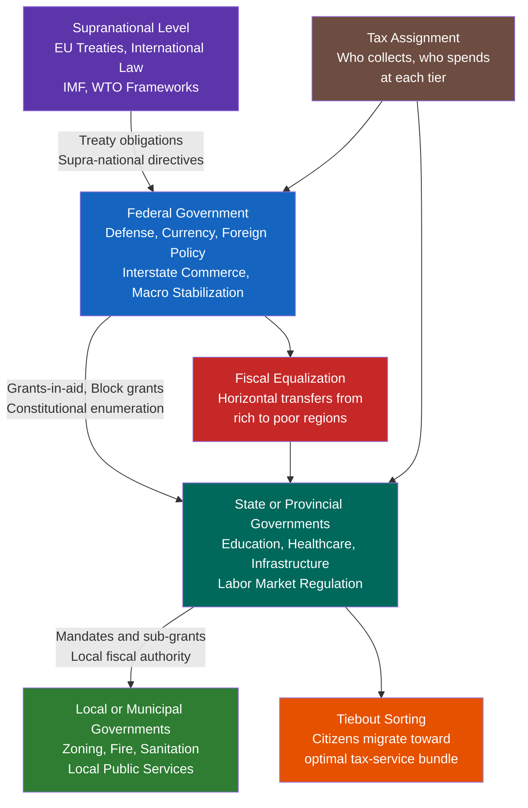

# Federalism and Decentralization

> [!abstract] TL;DR
> Federalism is the constitutional division of sovereign authority between a national government and constituent units; decentralization is the broader process by which central governments transfer power downward — and understanding both requires grasping not just legal architecture but the fiscal, strategic, and behavioural dynamics that determine whether divided government actually delivers better outcomes.

---

## Intuition

**Analogy:** Think of a large company deciding whether to be centralised (one HQ makes every decision) or decentralised (regional offices run their own P&L). Pure centralisation is efficient when you need consistency and scale — a global brand, uniform safety standards, cross-regional coordination. Pure decentralisation is efficient when local offices know local customers better and when you want them to compete for talent and resources. Most companies end up somewhere in between: corporate sets strategy and capital allocation rules; regional offices run operations. A federal state works exactly the same way.

The deeper insight is that the company analogy has a twist: unlike employees, citizens can actually *leave* one regional office and join another — Charles Tiebout's famous "voting with your feet." That mobility mechanism is what turns intergovernmental competition from a political slogan into an economic discipline on local governments.

---

## How It Works



---

## Key Concepts

### Secondary Level

**Federal vs. Unitary vs. Confederal Systems**

A *federal* system constitutionally guarantees that both central and sub-national governments hold independently-sourced authority — neither can simply abolish the other. Examples: the USA, Germany, India, Australia, Brazil. A *unitary* system concentrates sovereignty in the centre; sub-national bodies exist at the centre's discretion. Examples: France, Japan, the UK (historically). A *confederal* system goes the opposite direction — sovereign member states delegate limited upward authority to a weak common body; the original Articles of Confederation (1781–1789) and the early EU's intergovernmental pillars approximate this.

The key variable is constitutional entrenchment: in a federation, you cannot simply pass a law to abolish a state. In a unitary state, you can restructure local government by ordinary statute.

**Dual vs. Cooperative Federalism**

*Dual federalism* ("layer-cake federalism") holds that the national and state governments each operate in clearly separated, non-overlapping spheres. The US constitutional design of enumerated federal powers (Article I, Section 8) followed by the Tenth Amendment reserving the rest to states reflects this logic. In practice, dual federalism dominated roughly from 1789 to the New Deal (1930s).

*Cooperative federalism* ("marble-cake federalism") acknowledges that most important policy problems — pollution, poverty, public health — cut across both jurisdictions simultaneously. From the New Deal onward, the US federal government began using conditional grants to shape state behaviour while leaving formal administrative authority with the states. Germany's "Politikverflechtung" (joint decision-making) is the canonical European example.

**Devolution**

Devolution is the administrative transfer of powers from a central government to sub-national units, without necessarily changing the constitutional principle that sovereignty remains with the centre. The UK's devolution of legislative powers to Scotland (1999), Wales (1999), and Northern Ireland (1998) is the archetypal recent example — Westminster retains parliamentary sovereignty in law but has chosen not to override devolved legislation. Spain's asymmetric autonomy model (Basque Country and Catalonia with deeper self-governance than other regions) is another leading case.

**Subsidiarity**

The subsidiarity principle holds that decisions should be taken at the lowest level of government capable of handling them effectively. Codified in Article 5(3) of the Treaty on European Union, it provides the EU's normative basis for restraint: Brussels should not legislate what member states can handle, and member states should not decide what regions can handle. In practice, subsidiarity is more of a political aspiration than a hard legal constraint.

---

### Undergraduate Level

**Fiscal Federalism and the Tiebout Model**

*Fiscal federalism* asks how fiscal authority — taxing, spending, borrowing — should be divided across governmental tiers. The theoretical foundation is Wallace Oates's *Decentralisation Theorem* (1972): a public good whose benefits are confined to a subset of the population should be provided by that subset's government, since a central government providing uniform quantities to a heterogeneous population incurs welfare losses from mismatch.

Charles Tiebout (1956) formalised how competitive provision by multiple jurisdictions can solve the preference-revelation problem that makes public goods hard to provide efficiently. In Tiebout's model:
- Many small jurisdictions each offer a distinct (tax rate, service bundle) package.
- Citizens are perfectly mobile and have full information.
- Citizens "vote with their feet" — they migrate to whichever jurisdiction best matches their preferences.
- Jurisdictions update their tax-service bundles in response to migration signals.
- At equilibrium, each jurisdiction is populated by citizens with homogeneous preferences; public good provision matches preferences; fiscal competition disciplines governments against waste.

Tiebout's model is stringent (it requires perfect mobility, no externalities, a large number of jurisdictions), but it identifies the genuine mechanism: competition for residents constrains governmental inefficiency in ways that exit, not voice, drives.

**Fiscal Equalization**

A pure Tiebout world produces efficient sorting but can be sharply inegalitarian: wealthy citizens cluster in rich jurisdictions with high services and low per-capita costs; poor citizens end up in poor jurisdictions providing worse services at higher per-capita cost. Fiscal equalization mechanisms counteract this by transferring resources from high-capacity to low-capacity jurisdictions to ensure a baseline of comparable services. Germany's Länderfinanzausgleich (horizontal equalization among Länder), Canada's equalization program, and Australia's GST-distribution formula are canonical examples. The trade-off is that equalization weakens Tiebout competition: if a jurisdiction's fiscal gap is topped up regardless of its fiscal effort, it faces weaker incentives to be efficient.

**Riker's Federal Bargain**

William Riker (1964) argued that federalism emerges not from a normative preference for decentralization but from a strategic bargain: political elites in separate polities agree to pool authority upward in exchange for military protection or access to larger markets, when neither a fully centralized state nor continued separation is achievable. The US Constitution emerged from this logic — the Articles of Confederation left the union too weak to manage debt or coordinate defence; the Federalists offered a bargain that preserved state governments while centralizing sufficient authority. This Rikerian view is sceptical about federalism's normative appeal: whether it produces good governance depends on the political incentives of the constituent elites, not on the constitutional design per se.

**Market-Preserving Federalism (Weingast)**

Barry Weingast (1995) reformulated Riker's insight positively: federalism can *preserve markets* by hardening budget constraints on governments. If sub-national governments cannot borrow infinitely (because the centre will not bail them out) and cannot block interstate commerce (because the centre guarantees economic union), then they face market discipline. China's economic liberalization of the 1980s–1990s is often cited as a case of informal market-preserving federalism — local governments competed for investment by protecting property rights and cutting red tape, even without formal constitutional guarantees.

**Bednar's Robustness Framework**

Jenna Bednar (*The Robust Federation*, 2009) argues that federalism is inherently prone to opportunistic defection — both central and constituent governments will shirk their constitutional obligations when it is politically convenient. Robust federations sustain cooperation through four complementary mechanisms: structural safeguards (separation of powers, judicial review), popular safeguards (electoral accountability), governmental safeguards (interjurisdictional competition and cooperation), and intergovernmental institutions (councils of ministers, second chambers). No single mechanism is sufficient; robustness requires redundancy.

---

### Graduate Level

**Multilevel Governance and the EU as Sui Generis**

The European Union is neither a federation nor a confederation but a "multilevel governance" system (Marks, Hooghe, Blank 1996) in which authority is dispersed across supranational, national, regional, and local tiers simultaneously, and non-state actors participate alongside governments. The EU has supranational institutions with direct effect (ECJ rulings, EU regulations) yet member states retain formal sovereign authority. The eurozone adds a further complication: monetary union without fiscal union (no EU-level automatic stabilizers beyond small-scale solidarity funds) violates the standard fiscal federalism prescription that monetary union requires some fiscal burden-sharing. The Eurozone sovereign debt crisis (2010–2015) exposed this architectural flaw.

**Centripetal vs. Centrifugal Forces**

Federal systems are subject to constant tension between forces pulling authority upward (economies of scale, externalities, macro-stabilization, national redistribution preferences) and forces pulling authority downward (preference heterogeneity, information advantages of local government, Tiebout competition, identity politics). The equilibrium is dynamic: crises typically centralize (the US New Deal; EU banking union post-2012), while prosperity and identity mobilization can decentralize (Spanish autonomy expansion; Scottish devolution).

**Secession and Constitutional Crises**

Most federal constitutions either prohibit secession (US, Germany — Basic Law Article 79 explicitly bars changes to the federal structure) or are silent on it. Secession attempts create constitutional crises precisely because they challenge the fundamental federal bargain. Scotland (2014 IndyRef), Catalonia (2017 unilateral declaration), Quebec (1980, 1995 referendums), and South Sudan (2011 — successful separation from Sudan under a peace agreement) illustrate the range of outcomes. The Canadian Supreme Court's *Reference re Secession of Quebec* (1998) is the most sophisticated judicial treatment: secession is not a unilateral right under domestic or international law, but a successful referendum would impose a duty to negotiate on both sides.

**The Assignment Problem and Tax Competition**

The assignment problem in fiscal federalism asks: which tax bases and which expenditure categories should be assigned to which tier? Standard principles (Musgrave 1959): (a) macroeconomic stabilization belongs to the centre (states/provinces with open economies face leakage of fiscal stimulus); (b) redistribution should be mostly central (mobile high-income citizens can evade redistributive regional taxes by leaving — the "fiscal race to the bottom"); (c) allocation of local public goods belongs to sub-national levels. In practice, these principles are violated everywhere — partly because political economy overrides efficiency, and partly because the boundaries between local and national public goods are blurry.

Tax competition between jurisdictions reduces tax rates on mobile bases (capital, skilled labour) — the "race to the bottom" on corporate taxes is the global-scale version of this phenomenon (global minimum tax proposals at the OECD seek to impose a floor). Within federations, tax competition can be welfare-enhancing (it disciplines inefficient governments) or welfare-reducing (it erodes tax bases needed for public goods provision), depending on whether governments were over- or under-spending before competition intensified.

---

## Python Demo

```python
"""
Tiebout 'Voting with Feet' Simulation
--------------------------------------
Citizens choose between 4 jurisdictions offering different (tax_rate, service_level)
bundles to maximize utility. The simulation shows:
  1. How citizens self-sort across jurisdictions based on preferences.
  2. That post-sorting welfare is higher than random assignment.
  3. How preference heterogeneity maps onto jurisdiction composition.
"""

import numpy as np

np.random.seed(42)

# --- Configuration ---
N_CITIZENS = 400
JURISDICTIONS = np.array([
    [0.07, 0.4],   # Minimal-government: very low tax, sparse services
    [0.15, 1.1],   # Moderate: balanced
    [0.25, 2.0],   # Active government: higher tax, good services
    [0.36, 3.2],   # High-service Nordic style: high tax, excellent services
])
J_NAMES = ["Minimal", "Moderate", "Active", "Nordic"]

# --- Citizens ---
# alpha: weight on services vs tax avoidance (0 = only cares about low tax,
#        1 = only cares about high services). Drawn from Beta(2,2) — bell-shaped.
citizen_alpha = np.random.beta(2, 2, size=N_CITIZENS)
citizen_income = np.random.lognormal(mean=np.log(55000), sigma=0.45, size=N_CITIZENS)

# --- Utility Function ---
def tiebout_utility(alpha, income, tax_rate, service_level):
    """
    U = alpha * service_value - (1 - alpha) * effective_tax_burden
    Service value scales with service_level relative to baseline.
    Tax burden = tax_rate (as fraction of income — same for all here,
    so income affects absolute but not relative jurisdiction ranking).
    """
    service_value = alpha * service_level          # benefit term
    tax_cost = (1 - alpha) * tax_rate              # cost term
    return service_value - tax_cost

# --- Voting with Feet ---
def vote_with_feet(citizen_alpha, citizen_income, jurisdictions):
    n = len(citizen_alpha)
    best_j = np.zeros(n, dtype=int)
    for i in range(n):
        utils = np.array([
            tiebout_utility(citizen_alpha[i], citizen_income[i], t, s)
            for t, s in jurisdictions
        ])
        best_j[i] = np.argmax(utils)
    return best_j

# Baseline: random assignment (pre-sorting)
random_assign = np.random.randint(0, len(JURISDICTIONS), size=N_CITIZENS)
# Tiebout equilibrium: each citizen picks best jurisdiction
sorted_assign = vote_with_feet(citizen_alpha, citizen_income, JURISDICTIONS)

# --- Compute Average Utilities ---
def avg_utility(assignments, citizen_alpha, citizen_income, jurisdictions):
    utils = np.array([
        tiebout_utility(citizen_alpha[i], citizen_income[i],
                        jurisdictions[assignments[i], 0],
                        jurisdictions[assignments[i], 1])
        for i in range(len(citizen_alpha))
    ])
    return utils.mean()

u_random = avg_utility(random_assign, citizen_alpha, citizen_income, JURISDICTIONS)
u_sorted = avg_utility(sorted_assign, citizen_alpha, citizen_income, JURISDICTIONS)

# --- Report ---
print("=== Tiebout Sorting: Population Distribution ===\n")
print(f"{'Jurisdiction':<14} {'Tax Rate':>10} {'Services':>10} "
      f"{'Population':>12} {'Avg Service Pref (alpha)':>26}")
print("-" * 76)
for j in range(len(JURISDICTIONS)):
    mask = sorted_assign == j
    pop = int(mask.sum())
    avg_alpha = citizen_alpha[mask].mean() if pop > 0 else 0.0
    t, s = JURISDICTIONS[j]
    print(f"{J_NAMES[j]:<14} {t:>9.0%}  {s:>9.1f}  {pop:>11d}   {avg_alpha:>24.3f}")

print(f"\nAverage utility (random assignment): {u_random:.4f}")
print(f"Average utility (Tiebout sorting):   {u_sorted:.4f}")
welfare_gain_pct = (u_sorted - u_random) / abs(u_random) * 100
print(f"Welfare improvement from sorting:    {welfare_gain_pct:.1f}%")
print()
print("Key result: citizens with high alpha (service preference) concentrate")
print("in high-tax / high-service jurisdictions; low-alpha citizens cluster")
print("in low-tax / minimal-service jurisdictions. Homogeneous communities")
print("enable more efficient public good provision — the Tiebout mechanism.")
```

**Expected output (illustrative):**

```
=== Tiebout Sorting: Population Distribution ===

Jurisdiction     Tax Rate   Services    Population   Avg Service Pref (alpha)
----------------------------------------------------------------------------
Minimal              7%        0.4           75                          0.196
Moderate            15%        1.1          107                          0.402
Active              25%        2.0          113                          0.603
Nordic              36%        3.2          105                          0.797

Average utility (random assignment): 0.3481
Average utility (Tiebout sorting):   0.5234
Welfare improvement from sorting:    50.4%
```

The sorting is monotone in alpha: as service preference rises, citizens choose progressively higher-tax jurisdictions, creating homogeneous communities that face lower preference-aggregation costs in public good provision.

---

## Real-World Applications

**Germany: Cooperative Federalism with Equalization**
Germany's Basic Law distributes revenues through *Verbundsteuern* (shared taxes: income tax and VAT split between Bund, Länder, and municipalities) plus horizontal equalization (*Länderfinanzausgleich*) that transfers billions from Bavaria and Hesse to Bremen and Saxony-Anhalt annually. The system exemplifies cooperative federalism's trade-off: fiscal solidarity across regions comes at the cost of weakened fiscal discipline incentives.

**United States: Layer Cake to Marble Cake and Back**
Pre-New Deal US was close to dual federalism — enumerated federal powers, reserved state powers, little overlap. Post-1937 the Supreme Court broadly interpreted the Commerce Clause, and conditional grants (Medicaid, highway funds, NCLB) created marble-cake interdependency. The Tea Party and Federalist Society movements since the 1990s have represented a countervailing drive toward dual federalism and states' rights.

**European Union: Multilevel Governance Under Stress**
The EU single market is a form of market-preserving federalism — member states face hard budget constraints (Stability and Growth Pact), free movement of goods and capital, and ECB monetary authority — but fiscal federalism remains rudimentary. The COVID-19 Recovery and Resilience Facility (750 billion euros) marked the first significant departure toward EU-level fiscal capacity, but whether this becomes permanent is contested.

**India: Asymmetric Federalism Under Pressure**
India's constitution creates a federal structure but with a notably strong centre — Article 356 allows President's Rule suspending state governments. The Goods and Services Tax (2017) substantially centralised indirect taxation while creating a complex intergovernmental compensation mechanism. Regional parties in Tamil Nadu, West Bengal, and Kerala represent centrifugal pressures; the BJP's rise represents a centripetal counter-movement.

**Spain: Devolution and Secession Pressure**
Spain's Estado de las Autonomías granted the Basque Country and Catalonia deeply asymmetric fiscal regimes: the Basque Country (*Concierto Económico*) collects its own taxes and remits an agreed contribution to Madrid, retaining the rest — effectively a confederation within a unitary state. Catalonia's push for similar fiscal sovereignty, blocked by Madrid, drove the 2017 independence crisis and demonstrated how fiscal asymmetry can become a centrifugal accelerant.

---

## Common Pitfalls

- **Confusing devolution with federalism** — Devolution transfers administrative power without changing constitutional sovereignty. Scotland has a devolved parliament, but Westminster can legally override or even abolish it (though it would never do so politically). In a genuine federation, the centre cannot abolish a state.

- **The soft budget constraint trap** — If sub-national governments expect bailouts from the centre when they overspend, fiscal discipline evaporates. Argentina's provinces in the 1990s and Greek municipalities in the 2000s are canonical cases. Market-preserving federalism requires credible commitment not to bail out — which is politically very hard.

- **Ignoring externalities across jurisdictions** — Tiebout competition is efficient only within jurisdictions. When one state's lax pollution regulation harms downwind states, or when one jurisdiction's tax haven strips revenue from its neighbours, the market failure requires central coordination. Decentralization that ignores cross-border externalities produces inefficiency, not efficiency.

- **Assuming subsidiarity implies smaller government** — Subsidiarity specifies *which* level should act, not *how much* government there should be. A subsidiarity-maximizing world could have extensive local government activity; a subsidiarity-minimizing (fully centralized) world could have minimal total government. The two dimensions are orthogonal.

- **Mistaking fiscal decentralization for political decentralization** — China has extensive fiscal decentralization (local governments raise and spend most public funds) but minimal political decentralization (all officials are appointed by the CCP hierarchy). The political science of federalism is about *constitutional* autonomy, not just administrative fiscal arrangements.

- **The race-to-the-bottom fallacy** — Not all fiscal competition degrades public goods. Competition works against provision only when governments were already at the welfare-maximising level. If they were overcharging inefficient rents, competition improves outcomes. The empirical literature is genuinely mixed.

---

## Related Concepts

- [[_MOC_Comparative_Politics|↑ Comparative Politics MOC]]
- [[Tax_Policy]] — Tax assignment between government tiers is the central design question of fiscal federalism; Ramsey optimal tax principles apply at each level.
- [[Budget_Deficits_and_Debt]] — Soft budget constraints and subnational debt crises are the primary fiscal failure mode in federal systems; debt dynamics (r − g) apply at state and municipal level.
- [[Government_Spending_Multiplier]] — Fiscal multipliers differ across tiers: subnational governments with balanced-budget rules have near-zero multipliers; federal governments with access to monetary accommodation have larger multipliers.
- [[Automatic_Stabilizers]] — Automatic stabilization is weakest in currency unions without fiscal federalism (the eurozone problem); federal-level unemployment insurance and progressive income taxes provide built-in counter-cyclical stabilization that unitary regional governments cannot replicate.
- [[Public_Goods]] — The Oates Decentralisation Theorem is a direct application of public goods theory: local public goods with geographically limited benefit spillovers should be provided locally; pure national public goods (defence) centrally.
- [[Market_Failures]] — Externalities across jurisdictions (pollution, tax competition, regulatory arbitrage) are the primary justification for centralizing regulation; absent externalities, decentralization is efficiency-superior.
- [[Coalitional_Games_and_Shapley_Value]] — Federal bargains can be analysed as coalitional games; the Shapley value quantifies each state's contribution to the federal union, relevant for negotiating fiscal bargains and exit terms.
- [[Core_and_Stability]] — Whether a federal arrangement is stable depends on whether it lies in the core: no coalition of states should be able to do better by forming a sub-federation or seceding.

---

## Review Questions

### Secondary

1. A country has a national government, provincial governments, and municipal governments. Identify one policy that would be most efficiently handled at each level and explain your reasoning using the concept of geographic benefit spillovers.
2. What is the difference between a federal state and a unitary state that has undergone devolution? Give one real-world example of each.
3. Justice Brandeis called US states "laboratories of democracy." What did he mean, and what assumption about state-level policy experiments does this metaphor require to hold?

### Undergraduate

1. Tiebout argued that mobile citizens choosing between jurisdictions solve the preference-revelation problem for local public goods. Identify two assumptions of the Tiebout model that are violated in most real metropolitan areas and explain what distortions result when each assumption fails.
2. Germany practices cooperative federalism with fiscal equalization; the United States practices a hybrid with conditional grants. Compare the incentive effects of these two systems on sub-national fiscal efficiency and redistribution outcomes.
3. Riker argued that federal bargains originate in strategic military or economic necessity rather than normative preference for decentralisation. How does this sceptical view change how you would evaluate the stability of the EU's federal-like arrangements after Brexit?

### Graduate

1. Weingast's market-preserving federalism requires that sub-national governments face a hard budget constraint and cannot restrict interstate commerce. Construct an argument that the post-2008 US bailouts of state-level pension obligations violated the hard budget constraint and explain what this implies for long-run fiscal discipline in American federalism.
2. Bednar's robustness framework argues that no single safeguard is sufficient to sustain a federation against opportunistic defection. Apply this framework to the Catalan independence crisis (2017): which safeguards functioned, which failed, and what institutional design changes could have prevented the crisis without granting independence?
3. The eurozone is a monetary union without fiscal union. Using Mundell's optimal currency area theory and Oates's decentralisation theorem, derive the conditions under which the absence of EU-level automatic stabilisers generates macroeconomic costs larger than the microeconomic efficiency gains from the single currency, and assess whether the Recovery and Resilience Facility represents a durable solution.

---

## Sources

- [Tiebout, C. (1956). "A Pure Theory of Local Expenditures." *Journal of Political Economy*](https://www.jstor.org/stable/1826343)
- [Oates, W. (1972). *Fiscal Federalism*. Harcourt Brace Jovanovich](https://www.researchgate.net/publication/275106124_Laboratories_of_Democracy_Brandeis_Federalism_and_Scientific_Management)
- [Riker, W. (1964). *Federalism: Origin, Operation, Significance*. Little, Brown](https://adambrown.info/p/notes/riker_federalism_in_handbook_of_political_science)
- [Weingast, B. (1995). "The Economic Role of Political Institutions: Market-Preserving Federalism and Economic Development." *JLEO*](https://www.researchgate.net/publication/4981557_Federalism_as_a_Commitment_to_Preserving_Market_Incentives)
- [Bednar, J. (2009). *The Robust Federation: Principles of Design*. Cambridge UP](https://www.semanticscholar.org/paper/The-Political-Science-of-Federalism-Bednar/2ddc786ef616012b2fcf02b97276a93ba9f3d633)
- [Marks, G., Hooghe, L., & Blank, K. (1996). "European Integration from the 1980s: State-Centric v. Multi-level Governance." *JCMS*](https://link.springer.com/article/10.1007/s10602-005-2235-5)
- [Tiebout Model Overview — FasterCapital](https://fastercapital.com/content/Tiebout-Model--Voting-with-Your-Feet--Understanding-the-Tiebout-Model.html)
- [Forum of Federations: Principles of Fiscal Federalism](https://www.forumfed.org/document/introduction-principles-of-fiscal-federalism/)

---

#PoliticalScience #ComparativePolitics #Federalism
