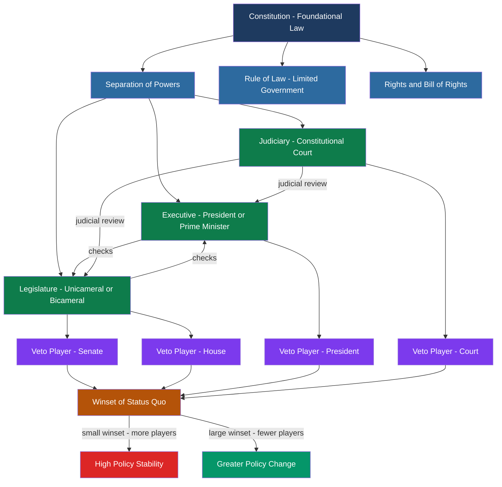

# Political Institutions and Constitutions

> [!abstract] TL;DR
> Political institutions are the durable rules, norms, and organizations that structure how collective decisions are made — and constitutions are their founding charters, defining who holds power, how it may be exercised, and what no temporary majority may do to any minority. The design of these institutions determines policy stability, economic development, and whether democracy survives.

---

## Intuition

**Analogy:** Imagine a multi-story building. The constitution is the bedrock foundation and load-bearing walls — it does not tell you which floors to build or what furniture to install, but it specifies which structural supports can never be removed, the maximum height, and the fire-exit requirements every floor must respect forever. Ordinary legislation is choosing furniture; constitutional amendment means touching the load-bearing walls and requires extraordinary effort. Without the foundation, every new owner can redesign everything from scratch — which means no one can trust that their investment in the building is safe.

This captures the central insight of constitutionalism: rulers who can promise "I will never confiscate your property" but face no structural constraints cannot be trusted. Rulers operating within an entrenched constitutional framework can be trusted because violating the promise would require tearing down the entire building — and every other actor in the system has an interest in stopping them.

---

## How It Works



---

## Key Concepts

### Secondary Level

**What is a Constitution?**
A constitution is the supreme law of a political system — a set of rules that governs how the government itself is organized and constrained. It answers three fundamental questions: *Who* has authority to make binding decisions? *How* are those decisions made? *What* decisions are permanently off-limits, even to supermajorities?

Constitutions vary along two independent axes:

| | **Written** | **Unwritten** |
|---|---|---|
| **Rigid** | USA, Germany, France | — |
| **Flexible** | India (frequently amended in practice) | UK (Parliament is sovereign) |

A **rigid** constitution requires a supermajority or special ratification process to amend — insulating fundamental rights from temporary majorities. A **flexible** constitution can be changed by ordinary legislative acts. Crucially, being written does not automatically make a constitution rigid; the amendment procedure determines rigidity, not codification.

**Separation of Powers — Montesquieu**
In *The Spirit of the Laws* (1748), Montesquieu argued that tyranny arises whenever the same person or body makes the law, executes it, and judges under it. His solution: distribute authority across three structurally independent branches — the legislative (makes law), the executive (enforces law), and the judicial (interprets law). Each branch acts as an ongoing check on the others.

**Checks and Balances**
Checks and balances operationalize separation of powers through concrete mechanisms:
- The US President can **veto** legislation; Congress can **override** the veto with two-thirds of both chambers.
- The Senate must **confirm** executive appointments and ratify treaties.
- The Supreme Court can **strike down** laws as unconstitutional.
- Congress can **impeach** the President and federal judges.
- The President **nominates** justices, shaping the court's future composition.

Each mechanism ensures that no single actor can accumulate unchecked power even temporarily.

**Rule of Law vs. Rule by Law**
- *Rule of law*: the law applies equally to governors and governed; no official is above it; courts are independent. The Magna Carta (1215) is the founding document of this tradition — even the king is bound by the law of the land.
- *Rule by law*: rulers use law as an instrument of power rather than as a constraint on themselves. Most authoritarian systems have written constitutions; what they lack is genuine rule of law.

**Constituent Power vs. Constituted Power**
*Constituent power* (*pouvoir constituant*) is the authority to create or fundamentally transform a constitution — historically located in "the people" through revolution, founding convention, or referendum. *Constituted power* (*pouvoir constitue*) is the authority created by the constitution — parliament, president, courts — operating within its limits. The distinction matters when constituted actors try to illegitimately claim constituent authority (e.g., a parliament abolishing judicial independence by ordinary statute).

### Undergraduate Level

**Constitutional Design Choices**

*Presidentialism vs. Parliamentarism*
In a **presidential system** (USA, Brazil, Mexico), the executive is separately elected with a fixed term and does not depend on legislative confidence. This creates the possibility of deadlock — a president and legislature from opposing parties with no constitutional mechanism to resolve disputes. Juan Linz (1990) argued presidentialism is more fragile: fixed terms prevent removing a failed president short of impeachment; dual democratic legitimacy (both claim mandates) creates legitimation crises.

In a **parliamentary system** (UK, Germany, Sweden), the executive derives legitimacy from and is accountable to the legislature. The prime minister can be removed by a vote of no confidence. This fusion of powers enables decisive government but risks majoritarian excess.

*Unicameralism vs. Bicameralism*
A **bicameral** legislature (US Senate + House; German Bundestag + Bundesrat; UK Lords + Commons) introduces a second chamber as an additional veto player. This slows legislation, protects minority interests, and in federal systems gives sub-national units a voice in national lawmaking. A **unicameral** legislature (New Zealand, Sweden, Denmark) is simpler and faster but concentrates power.

*Judicial Review*
Judicial review is the power of courts to invalidate legislation that conflicts with the constitution. The US Supreme Court asserted this power in *Marbury v. Madison* (1803) — Marshall famously reasoning that the Constitution is the supreme law and courts, not Congress, are its ultimate interpreter. Germany's Federal Constitutional Court (*Bundesverfassungsgericht*, 1951) has explicit constitutional authority for abstract review and is widely regarded as the most institutionally powerful constitutional court in the world.

**North–Weingast: Constitutions as Credible Commitment Devices**
Douglass North and Barry Weingast (1989) studied England's Glorious Revolution of 1688. Before 1688, the Stuart kings could — and repeatedly did — seize private property, default on debts, and alter property rights by royal decree. Investors rationally demanded high interest rates because the sovereign faced no credible constraint against expropriation.

After 1688, Parliament gained the power of the purse: the Crown could not raise taxes or maintain a standing army without parliamentary approval. This *credibly committed* the Crown to property rights. Evidence: English government bond yields fell from approximately 10% in the 1680s to approximately 3% in the 1720s after the constitutional settlement. The central insight: **institutions are credible commitment devices that solve the sovereign's time-inconsistency problem** — they make threats and promises believable by removing the ability to renege.

### Graduate Level

**Tsebelis's Veto Player Theory**

George Tsebelis (2002) provides a unified spatial theory of political institutions. A **veto player** is any individual or collective actor whose agreement is required for any change from the status quo. Veto players are either:
- *Institutional*: created by the constitution (president, Senate, Bundesrat)
- *Partisan*: created by the electoral outcome (parties in a coalition government)

**Core theorem**: The **winset** of the status quo — the set of policy outcomes that a majority of *each* veto player prefers to the current policy — shrinks as (1) the **number** of veto players increases, (2) the **ideological distance** between veto players increases, or (3) the **internal cohesion** of each veto player increases. A smaller winset means greater policy stability.

**Spatial intuition (1D example)**: Three players with ideal points at positions 2, 5, and 9 on a left-right axis. Status quo at position 6. Player 1 prefers anything below 4; Player 2 prefers anything between 2 and 8; Player 3 prefers anything above 3. The winset — outcomes *all three* prefer to 6 — is the interval between 3 and 4. Only a tiny policy shift is feasible. Remove Player 3, and the winset expands dramatically.

This framework subsumes traditional institutional dichotomies. "Presidentialism vs. parliamentarism" is just a specific veto-player configuration. "Bicameralism" adds one veto player. The theory generates comparative predictions that are empirically testable.

**Path Dependence and Historical Institutionalism**
Institutional choice exhibits **path dependence**: early design decisions constrain all subsequent options through increasing returns (Pierson 2000). As actors adapt strategies to existing institutions, switching costs rise; positive feedback loops entrench the existing configuration. The US Electoral College was designed for an 18th-century republic without mass parties or a popular vote expectation — it persists not because it is optimal today but because any coalition able to eliminate it would lose power in the transition. Path dependence explains persistence without implying permanence.

**Mahoney and Thelen (2010): Four Modes of Gradual Institutional Change**
Institutions rarely collapse and are immediately rebuilt. Instead they change gradually through four distinct mechanisms, each resulting from a different combination of veto possibilities and rule-enforcement discretion:

| Mode | Mechanism | Characteristic | Example |
|------|-----------|---------------|---------|
| **Displacement** | Existing rules removed and replaced | Abrupt, often crisis-driven | Weimar Republic replaced by Nazi constitutional order |
| **Layering** | New rules grafted onto unchanged existing rules | Accumulative, ambiguous interface | US civil rights amendments layered onto 1787 Constitution |
| **Conversion** | Existing rules redirected to serve new purposes | Same rules, new function | UK Crown prerogative exercised by PM rather than Monarch |
| **Drift** | Rules unchanged; environment shifts, altering effect | Passive neglect or strategic inaction | US Senate filibuster: rule unchanged but usage exploded post-1970 |

The mode of change depends on two contextual variables: whether strong veto possibilities prevent rule replacement, and whether actors have significant discretion in interpreting and enforcing existing rules. High veto + high discretion favors conversion; high veto + low discretion favors layering; low veto + either tends toward displacement.

---

## Python Demo

```python
"""
Tsebelis Veto Player Theory — Spatial Model in 2D Issue Space
Demonstrates how adding veto players shrinks the winset of the status quo,
leading to greater policy stability (fewer feasible policy changes).

Requires: numpy, matplotlib
Run:  python veto_players.py
"""
import numpy as np
import matplotlib.pyplot as plt
from matplotlib.patches import Circle


def euclidean(p1, p2):
    return np.sqrt((p1[0] - p2[0]) ** 2 + (p1[1] - p2[1]) ** 2)


def compute_winset(sq, ideal_points, grid_n=300):
    """
    Each player's indifference curve through sq is a circle centered at their
    ideal point with radius = distance to sq.  The winset is the intersection
    of all players' preferred-to-sq sets (interior of those circles).
    """
    x = np.linspace(0, 10, grid_n)
    y = np.linspace(0, 10, grid_n)
    XX, YY = np.meshgrid(x, y)
    pts = np.stack([XX, YY], axis=-1)  # shape (grid_n, grid_n, 2)

    in_ws = np.ones((grid_n, grid_n), dtype=bool)
    for ideal in ideal_points:
        r = euclidean(ideal, sq)
        dist = np.sqrt((pts[..., 0] - ideal[0]) ** 2 +
                       (pts[..., 1] - ideal[1]) ** 2)
        in_ws &= (dist < r)
    return XX, YY, in_ws


# ------------------------------------------------------------------
# Veto player ideal points in a 2D policy space
# Dimension 1 (x): fiscal spending (0 = low, 10 = high)
# Dimension 2 (y): regulation  (0 = low, 10 = high)
# ------------------------------------------------------------------
sq = np.array([5.5, 5.5])   # Status Quo: current policy

players = {
    "President": np.array([3.0, 7.0]),
    "Senate":    np.array([7.5, 6.5]),
    "House":     np.array([5.0, 3.0]),
    "Court":     np.array([2.5, 2.5]),
}
player_colors = {
    "President": "#e74c3c",
    "Senate":    "#2980b9",
    "House":     "#27ae60",
    "Court":     "#8e44ad",
}

scenarios = [
    ("1 Veto Player\n(President only)", ["President"]),
    ("2 Veto Players\n(President + Senate)", ["President", "Senate"]),
    ("4 Veto Players\n(All Branches)", list(players.keys())),
]

fig, axes = plt.subplots(1, 3, figsize=(18, 6))
fig.suptitle(
    "Tsebelis Veto Player Theory: More Veto Players → Smaller Winset → Greater Policy Stability",
    fontsize=13, fontweight="bold",
)

for ax, (title, active_names) in zip(axes, scenarios):
    active_ideals = [players[n] for n in active_names]
    XX, YY, ws = compute_winset(sq, active_ideals)

    # Shade the winset
    ax.contourf(XX, YY, ws.astype(float), levels=[0.5, 1.5],
                colors=["#f39c12"], alpha=0.45)
    ax.contour(XX, YY, ws.astype(float), levels=[0.5],
               colors=["#e67e22"], linewidths=1.8)

    # Draw each active player's indifference circle and ideal point
    for name in active_names:
        ideal = players[name]
        r = euclidean(ideal, sq)
        circ = Circle(ideal, r, fill=False,
                      edgecolor=player_colors[name], linestyle="--", linewidth=1.3)
        ax.add_patch(circ)
        ax.plot(*ideal, "o", color=player_colors[name], markersize=10, zorder=5)
        ax.annotate(name, ideal, xytext=(5, 5), textcoords="offset points",
                    fontsize=9, color=player_colors[name], fontweight="bold")

    # Draw inactive players as faded markers
    for name in players:
        if name not in active_names:
            ax.plot(*players[name], "s", color="gray", markersize=8,
                    alpha=0.25, zorder=3)
            ax.annotate(name, players[name], xytext=(5, 5),
                        textcoords="offset points", fontsize=8,
                        color="gray", alpha=0.4)

    # Mark the status quo
    ax.plot(*sq, "*", color="black", markersize=14, zorder=6)
    ax.annotate("SQ", sq, xytext=(5, -14), textcoords="offset points",
                fontsize=10, fontweight="bold")

    # Winset size as fraction of policy space
    ws_frac = ws.sum() / ws.size
    ax.set_title(f"{title}\nWinset size: {ws_frac:.3f} of policy space",
                 fontsize=10)
    ax.set_xlim(0, 10)
    ax.set_ylim(0, 10)
    ax.set_xlabel("Fiscal Spending", fontsize=9)
    ax.set_ylabel("Regulation Level", fontsize=9)
    ax.grid(True, alpha=0.25)
    ax.set_aspect("equal")

plt.tight_layout()
plt.savefig("veto_players_winset.png", dpi=120, bbox_inches="tight")
plt.show()

# Print numeric summary
print("\nVeto Player Theory — Winset Summary")
print("-" * 45)
for title, active_names in scenarios:
    active_ideals = [players[n] for n in active_names]
    _, _, ws = compute_winset(sq, active_ideals)
    frac = ws.sum() / ws.size
    label = title.replace("\n", " ")
    print(f"{label:<40}  winset = {frac:.4f}")
```

Expected output (approximate):
```
Veto Player Theory — Winset Summary
---------------------------------------------
1 Veto Player (President only)              winset = 0.1963
2 Veto Players (President + Senate)         winset = 0.0541
4 Veto Players (All Branches)               winset = 0.0088
```

Each additional veto player dramatically reduces feasible policy change — the 4-player winset is roughly 22 times smaller than the 1-player winset.

---

## Real-World Applications

**United States: The High-Veto Architecture**
The US Constitution creates at minimum four veto players for major legislation: the House, the Senate, the President, and the Supreme Court. The Senate adds a de facto fifth veto through the 60-vote filibuster threshold. Tsebelis's theory predicts — and empirical evidence confirms — that the US has among the lowest rates of significant legislative change among OECD democracies. The Affordable Care Act (2010) was the first major social insurance expansion in 45 years, and it required reconciliation procedures specifically designed to circumvent one veto player.

**United Kingdom: Flexible Constitution, Concentrated Power**
Parliament is sovereign. Any statute can be repealed by a simple majority of the Commons. The House of Lords can delay but not permanently block legislation. Courts cannot strike down Acts of Parliament. The UK therefore has far fewer veto players — enabling transformative policy change at speed. The entire National Health Service was legislated and operational within a single Parliament (1945–1948). The same institutional design that enabled the welfare state also enabled the rapid reversal of many of those policies in the 1980s.

**Germany: Engineering Stability Against Democratic Backsliding**
The *Grundgesetz* (Basic Law, 1949) was deliberately engineered to prevent the institutional collapse that destroyed the Weimar Republic. Key design features:
- The **Bundesrat** gives the 16 Lander (states) a veto over federal legislation affecting their jurisdiction — a federal veto player embedded in the constitution.
- The **constructive vote of no confidence** (Article 67): parliament can remove the Chancellor only by simultaneously electing a replacement, preventing the negative coalitions that repeatedly destabilized Weimar governments.
- The **Federal Constitutional Court** actively strikes down legislation — it invalidated NSA-style mass surveillance programs in 2016 and has enforced fiscal rules against the federal government.
- **Eternity clauses** (*Ewigkeitsklausel*, Article 79.3): the federal structure and the guarantee of basic human dignity cannot be amended even by a unanimous supermajority of parliament. Some parts of the constitution are genuinely unamendable.

**France: Semi-Presidentialism and Cohabitation**
De Gaulle's Fifth Republic constitution (1958) was designed to end the government instability of the Fourth Republic, where 22 governments fell in 12 years. The solution was a strong directly elected president alongside a prime minister accountable to the National Assembly. When both come from the same party, the president dominates. During *cohabitation* (1986-88 under Mitterrand and Chirac; 1993-95; 1997-2002), the president and prime minister are from opposing parties, creating two simultaneous institutional veto players in the executive alone. The *Conseil Constitutionnel* performs ex-ante review — it checks bills before they become law rather than waiting for litigation, which is the US and German post-promulgation model.

**North–Weingast: The Glorious Revolution as a Natural Experiment**
Post-1688 England provides the cleanest historical test of institutions-as-credible-commitment. English sovereign bond yields fell from roughly 10% in the 1680s to approximately 3% in the 1720s after Parliament gained the power of the purse. Before 1688, the Crown had regularly defaulted (Charles II's Stop of the Exchequer, 1672). After 1688, no English or British government defaulted on sovereign debt for over 300 years. The constitutional settlement that made property rights credible enabled the Financial Revolution, which financed Britain's 18th-century wars and ultimately its industrialization.

---

## Common Pitfalls

- **Confusing written with rigid** — The UK constitution is unwritten but treated as highly stable; India's constitution is written but has been amended over 100 times. Rigidity depends on amendment procedures, not on whether the document is codified in a single text.

- **Treating constitutions as self-enforcing** — A constitution is only as strong as the actors willing to enforce it. The Weimar Republic had an excellent constitution on paper. When key military and judicial elites stopped defending it in 1933, it collapsed within months. North and Weingast's deeper insight: constitutions must be *self-enforcing equilibria* — every powerful actor must prefer to comply with them rather than defect, or the whole structure is fragile.

- **Treating veto players as inherently obstructive** — More veto players increase policy stability, which is neither good nor bad intrinsically. It can prevent a good reform (US healthcare access) or a bad one (democratic backsliding in Hungary). The normative evaluation depends entirely on whether the status quo is worth protecting.

- **Assuming formal institutions equal actual power** — In many polities, formal constitutional rules diverge dramatically from actual power distribution. Russia's constitution formally creates strong federalism, an independent judiciary, and parliamentary oversight; in practice all three are captured by the executive. Studying formal institutions without asking whether they are actually enforced produces systematically misleading comparative analysis.

- **Path dependence fatalism** — Path dependence explains why institutions persist; it does not imply they are permanent. Critical junctures — wars, economic crises, external shocks, elite coordination failures — can dislodge even deeply entrenched institutions. The Weimar Republic, the Soviet Constitution, and the Apartheid constitution all seemed permanent until suddenly they were not.

- **Conflating presidentialism with stability** — Early comparative scholars assumed parliamentary systems were unstable. Linz (1990) reversed this: presidentialism is more fragile because fixed terms prevent removing a failed leader without impeachment; winner-take-all presidential elections create acute losers; dual democratic legitimacy (both president and parliament claim electoral mandates) generates deadlock. Latin American evidence: most democratic breakdowns between 1945 and 1990 occurred in presidential systems.

---

## Related Concepts

- [[_MOC_Comparative_Politics|↑ Comparative Politics MOC]]
- [[Power_Indices]] — Shapley-Shubik and Banzhaf indices formally measure voting power of institutional actors; directly operationalizes veto player theory in weighted voting settings, showing how institutional veto weight translates into actual decisional power
- [[Development_Economics]] — Acemoglu and Robinson's "inclusive vs. extractive institutions" framework is the macroeconomic application of the same constitutionalism argument: property rights protection and rule of law explain cross-country income differences, with the Glorious Revolution as a founding case
- [[Nash_Equilibrium]] — Political institutions can be modeled as Nash equilibria of repeated games among powerful actors; a constitution is stable when it constitutes a self-enforcing equilibrium where no actor prefers to defect unilaterally
- [[Public_Goods]] — Rule of law, constitutional order, and democratic norms are non-excludable, non-rival public goods; the free-rider problem explains why constitutional maintenance is chronically under-supplied and why democracies require active civic defense
- [[Backward_Induction]] — The credible commitment logic underlying North-Weingast is backward induction: constitutional constraints eliminate ex-post opportunistic strategies (property expropriation, sovereign default) by making them structurally infeasible, solving the time-inconsistency problem

---

## Review Questions

### Secondary
1. A new democracy is writing a constitution. The founders can choose between a strong president elected separately from parliament, or a prime minister who must command a parliamentary majority. What are the main advantages and risks of each choice for democratic stability?
2. Why do most constitutions require supermajorities or multiple stages for amendment rather than simple majority rule? What problem are they trying to solve, and what problem might they create?

### Undergraduate
1. Explain North and Weingast's credible commitment argument. Why did English government borrowing costs fall dramatically after 1688, and what does this tell us about the relationship between constitutional constraints and economic development?
2. Using Tsebelis's veto player theory, compare policy-making capacity in the United States versus the United Kingdom. What does the theory predict about each system's policy stability? Name one policy area where the US institutional architecture has produced a decades-long status quo that the UK equivalent did not.
3. Distinguish between formal and informal constitutional change. Assign each of Mahoney and Thelen's four modes — displacement, layering, conversion, drift — to a real constitutional example and explain why each case fits that category rather than the others.

### Graduate
1. Tsebelis claims that veto player theory subsumes traditional institutional dichotomies — presidential versus parliamentary, unicameral versus bicameral. Evaluate this claim. What features of political institutions does veto player theory capture precisely, and what features does it miss (agenda-setting power, constitutional courts as strategic actors, the role of norms versus rules)?
2. A constitution is self-enforcing when all powerful actors prefer compliance to defection. Model this as a repeated game with discounting. Under what conditions — levels of discount factors, numbers of players, information structures — is the constitutional equilibrium stable? What shocks (economic crisis, foreign intervention, elite coordination failure) shift the game toward a defection equilibrium? Draw on Weingast (1997) and your knowledge of recent democratic backsliding cases.
3. Compare two cases of gradual institutional change: the expansion of the US Senate filibuster from rare to routine usage after 1970 (drift), and the evolution of UK Crown prerogative from monarchical to prime ministerial exercise over two centuries (conversion). How does each case fit Mahoney and Thelen's framework, and what does the comparison reveal about the conditions under which informal practice can effectively rewrite formal constitutional arrangements?

---

## Sources

- [North, D. and Weingast, B. (1989) — "Constitutions and Commitment," *Journal of Economic History*, Vol. 49, No. 4](https://ideas.repec.org/a/cup/jechis/v49y1989i04p803-832_00.html)
- [Tsebelis, G. (2002) — *Veto Players: How Political Institutions Work*, Princeton University Press](https://www.jstor.org/stable/j.ctt7rvv7)
- [Tsebelis, G. (2011) — "Veto Player Theory and Policy Change: An Introduction"](https://sites.lsa.umich.edu/tsebelis/wp-content/uploads/sites/246/2020/12/Tsebelis2011_Chapter_VetoPlayerTheoryAndPolicyChang.pdf)
- [Mahoney, J. and Thelen, K. (2010) — *Explaining Institutional Change: Ambiguity, Agency, and Power*, Cambridge University Press](https://www.researchgate.net/publication/50368549_Explaining_Institutional_Change_Ambiguity_Agency_and_Power)
- [Linz, J. (1990) — "The Perils of Presidentialism," *Journal of Democracy*, Vol. 1, No. 1](https://muse.jhu.edu/article/225694)
- [Pierson, P. (2000) — "Increasing Returns, Path Dependence, and the Study of Politics," *American Political Science Review*, Vol. 94, No. 2](https://www.cambridge.org/core/journals/american-political-science-review/article/abs/increasing-returns-path-dependence-and-the-study-of-politics/3CF58D9C29FAF33736ECC5DDB5AC7F66)
- [Montesquieu (1748) — *The Spirit of the Laws* (De l'esprit des lois)](https://en.wikipedia.org/wiki/The_Spirit_of_the_Laws)
- [Comparative Analysis of Constitutional Systems — Fiveable](https://fiveable.me/introduction-comparative-politics/unit-4/comparative-analysis-constitutional-systems/study-guide/XyQrhGkfa8u98LDb)
- [Veto Players — Wikipedia](https://en.wikipedia.org/wiki/Veto_Players)

---

#PoliticalScience #ComparativePolitics #Constitutionalism
