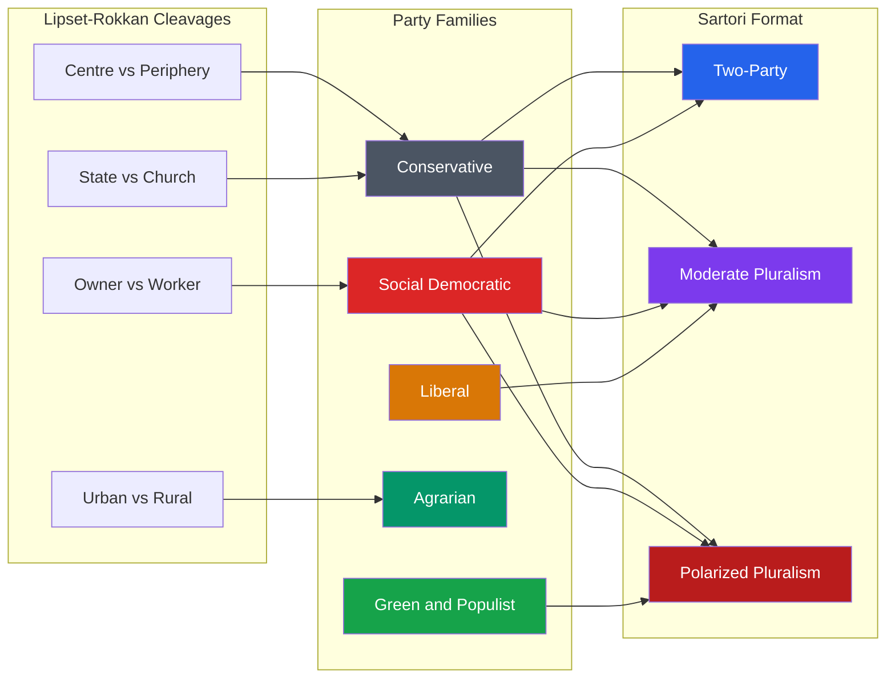

> [!abstract] TL;DR
> Political parties are organized groups that contest elections to capture state power; party systems are the structured patterns of competition among them. Understanding them requires three lenses: **cleavage theory** (Lipset-Rokkan — why parties form where society fractures), **party type evolution** (Katz-Mair — how organizations transform from cadre to cartel), and **system format** (Sartori — how the number and ideological distance of parties shapes democratic stability).

---

## Intuition

**Analogy:** Think of a city's restaurant market.

When a neighbourhood is settled by a single ethnic community, a handful of family-run restaurants dominate. As the city diversifies, new cuisines compete. Eventually, a few large chains crowd out independents by securing preferential lease deals with city hall — using their access to municipal contracts to disadvantage new entrants.

Political parties work the same way. They emerge from the *fracture lines* in society (class, religion, ethnicity). They evolve from lean ideological operations into professional mass organizations. And in mature democracies, the established parties — like the restaurant chains — often collude with the state to make it costly for new competitors to enter the market. That collusion is what Katz and Mair called the **cartel party**.

---

## How It Works



---

## Key Concepts

### Secondary Level

#### What Is a Political Party?

A **political party** is an organization that nominates candidates for public office, seeks to win elections, and organizes government when successful. It differs from:
- **Interest groups**: parties seek state power directly; interest groups seek to influence those who hold power
- **Social movements**: parties institutionalize, formalize, and electorally channel collective grievances

Edmund Burke's 1770 definition remains influential: "a body of men united, for promoting by their joint endeavours the national interest, upon some particular principle in which they are all agreed." Modern parties are more pragmatic and less principled than Burke imagined.

#### Party Functions

| Function | Description |
|----------|-------------|
| **Aggregation** | Bundle diverse interests into a coherent platform |
| **Articulation** | Give voice to social groups in the political arena |
| **Recruitment** | Select and train political elites and candidates |
| **Mobilization** | Turn passive citizens into active voters and activists |
| **Accountability** | Give voters a collective target to reward or punish |
| **Government formation** | Organize legislative majorities and executive coalitions |

#### The Iron Law of Oligarchy

Robert Michels (1911, *Political Parties*) studied the German Social Democratic Party — the most democratic mass party of its era — and found that it had become dominated by a professional leadership clique.

His **Iron Law of Oligarchy**: "Who says organization, says oligarchy." The argument in three steps:
1. Modern organization requires specialized leadership and bureaucracy
2. Leaders develop interests distinct from members (career advancement, prestige)
3. Leaders control party resources, information, and candidate selection; rank-and-file members lack the time and expertise to challenge them

**Implication**: even parties founded on democratic principles develop oligarchic tendencies. The Iron Law is contested — parties vary enormously in internal democracy — but it identifies a genuine principal-agent problem within any large organization.

---

### Undergraduate Level

#### Cleavage Theory: Lipset and Rokkan (1967)

Seymour Lipset and Stein Rokkan's *Party Systems and Voter Alignments* argued that European party systems crystallized around four structural conflicts generated by two revolutions:

**The National Revolution (state-building):**
1. **Centre vs. Periphery** — centralizing state vs. regional/linguistic minorities → Regionalist parties, federal movements
2. **State vs. Church** — secular state apparatus vs. Church control of education and morality → Christian Democratic, Clerical Conservative parties

**The Industrial Revolution (economic modernization):**
3. **Urban vs. Rural** — industrial capital vs. landed interests and peasant farmers → Agrarian, Centre parties
4. **Owner vs. Worker** — capitalist employers vs. industrial working class → Social Democratic, Labour parties

**The Freezing Hypothesis**: Lipset and Rokkan argued that by the 1920s these cleavages had produced stable party systems that "froze" — the party systems of the 1960s resembled those of 40 years earlier. This was controversial: recent quantitative work finds the freezing pattern inconclusive and that contemporary new cleavages (globalization winners vs. losers, cultural liberalism vs. authoritarianism) are reshaping Western party systems.

#### Party Type Evolution (Kirchheimer and Katz-Mair)

Scholars have identified a historical sequence of dominant party organizational models:

| Type | Era | Characteristics | Example |
|------|-----|----------------|---------|
| **Cadre Party** (Duverger) | 19th century | Elite-run, minimal mass membership, parliamentary focus | British Whigs, US Republicans pre-1900 |
| **Mass Party** (Duverger) | 1880-1960 | Large dues-paying membership, strong ideology, extra-parliamentary organization | German SPD, British Labour |
| **Catch-All Party** (Kirchheimer 1966) | 1960s onwards | Ideological de-emphasis, appeal across class lines, voter maximization | US Democrats, CDU |
| **Electoral-Professional Party** (Panebianco 1988) | 1970s onwards | Technocratic campaign organization, media-centric, weak ties to civil society | Italian parties post-1980 |
| **Cartel Party** (Katz-Mair 1995) | 1990s onwards | State-funded, collude to restrict entry, parties become agents of the state | Mainstream European parties |

**Kirchheimer's Catch-All transformation**: postwar prosperity eroded class identity; workers acquired middle-class aspirations; parties responded by shedding class-based appeals and reaching across social boundaries. The catch-all people's party prioritizes winning over representing.

**Katz-Mair's Cartel Thesis**: as membership fees, party volunteers, and class-based loyalty all declined, parties became dependent on state funding (public campaign finance, parliamentary salaries, public broadcasting access). Established parties used their legislative power to entrench themselves — regulating ballot access, allocating media time, and controlling state patronage. This created a cartel: competition continues but entry barriers exclude outsiders. The thesis explains why mainstream parties converged on similar neoliberal platforms from the 1990s onward, and why anti-establishment parties (UKIP, M5S, Podemos) achieved success partly as a backlash against cartelization.

#### Sartori's Party System Typology (1976)

Giovanni Sartori's *Parties and Party Systems* proposed that party systems should be classified by two dimensions:
- **Format**: the number of *relevant* parties (those able to form coalitions or exert blackmail)
- **Mechanics**: the direction of competition (centripetal vs. centrifugal)

| Format | # Parties | Competition | Examples |
|--------|-----------|------------|---------|
| **One-party system** | 1 | No competition | Soviet USSR, China |
| **Hegemonic party system** | 1 dominant + satellites | Nominal competition | Mexico PRI 1929-2000, Singapore |
| **Predominant party system** | Multiple, 1 consistently wins | Legitimate but ineffective opposition | Japan LDP 1955-1993, India Congress 1947-1977 |
| **Two-party system** | 2 alternating | Centripetal, moderate | UK, USA |
| **Moderate pluralism** | 3-5 | Centripetal, coalition-forming | Germany, Netherlands |
| **Polarized pluralism** | 5+ with anti-system parties | Centrifugal, ideologically extreme poles | Weimar Germany, Italy 1948-1994 |
| **Atomized** | Many small, no structure | Incoherent | Fragile democracies in transition |

**Key insight — mechanics matter more than format**: a three-party system where parties compete at the centre (like Germany with CDU/CSU, SPD, FDP) is more stable than a five-party system with anti-system parties at both poles pulling politics toward the extremes. Polarized pluralism is particularly dangerous: parties compete by outbidding each other in radicalism, the center is hollowed out, and government coalitions are unstable.

**The concept of "relevant parties"**: Sartori distinguished relevant parties from irrelevant ones by two criteria:
1. **Coalition potential**: the party has been used in, or is likely to be used in, government coalitions
2. **Blackmail potential**: the party affects the tactics of other parties (e.g., a large communist party forces moderate parties to avoid alliances that might give it influence)

---

### Graduate Level

#### Spatial Models of Party Competition

Anthony Downs (*An Economic Theory of Democracy*, 1957) applied Harold Hotelling's spatial model of market competition to party politics.

**Setup**: voters have ideal points on a left-right policy dimension [0, 1]. They vote for the party whose platform is closest to their ideal point. Parties maximize votes.

**The Median Voter Theorem** (Black 1948; Downs 1957): in a two-party system with a single dimension, both parties converge to the position of the **median voter** — the voter whose ideal point divides the electorate exactly in half.

**Intuition**: suppose Party L is at 0.3 and Party R is at 0.7. The median is at 0.5. If Party L moves to 0.4, it gains all voters between 0.3 and 0.4 without losing its voters to the right of 0.4 (who still prefer L to R). Convergence is the dominant strategy for both parties.

**Violations and extensions**:
- **Abstention**: if parties converge, committed partisans may not vote. Proximity to one's base matters as well as proximity to the median
- **Multi-dimensional policy**: Arrow's impossibility theorem implies there is no median voter in multiple dimensions; equilibrium is generally fragile
- **Multi-party systems**: with 3+ parties, convergence does not occur. Equilibrium involves parties differentiating to claim distinct voter blocs (Duverger's Law: plurality electoral rules → two parties; proportional representation → multi-party systems)
- **Valence politics**: parties compete not only on position but on **competence, character, and leadership quality** — valence attributes that all voters prefer more of. A highly trusted centrist party can dominate even if rivals match it on policy position

#### Issue Ownership Theory

Petrocik (1996): parties "own" issues on which voters trust them more regardless of their specific platform position. Republicans own national security and crime; Democrats own healthcare and education (US context). Parties win elections partly by making owned issues salient (priming) rather than purely by moving to the median on contested issues.

**Party decline and dealignment**: post-1970s, party identification weakened in most advanced democracies as:
- Education rose, making voters more capable of independent evaluation
- Television individualized political communication (less reliance on party cues)
- Post-materialist values (Inglehart) created cross-cutting preferences that existing parties mismatched

#### New Party Families (Post-1970)

| Family | Core cleavage | Ideology | Examples |
|--------|--------------|---------|---------|
| **Green / Ecology** | Industrial growth vs. environment | Post-materialist, New Left | German Greens, Verts |
| **Right-Wing Populist** | Cultural globalization vs. nativism | Anti-establishment, nationalist | Front National, AfD, UKIP |
| **Pirate Parties** | Information freedom vs. corporate IP | Digital rights, direct democracy | German Pirates, Swedish Piratpartiet |
| **Radical Left** | Austerity vs. social solidarity | Anti-austerity, democratic socialism | Syriza, Podemos, La France Insoumise |

The Green-Right Populist axis reflects a **new cleavage**: winners vs. losers of globalization and cultural liberalization. Highly educated urban cosmopolitans cluster in Green/progressive parties; low-education, non-urban voters who feel left behind by deindustrialization and immigration cluster in right-wing populist parties. This cleavage partially replaces, partially cross-cuts the old class cleavage.

---

## Python Demo

```python
import numpy as np
import matplotlib.pyplot as plt

# Simulate Hotelling-Downs spatial voting model
np.random.seed(42)

n_voters = 2000
# Voter ideal points: normal distribution centered at 0.5 (moderate electorate)
voter_positions = np.clip(np.random.normal(loc=0.5, scale=0.18, size=n_voters), 0, 1)
median_pos = np.median(voter_positions)

def vote_share(party_a, party_b, voters):
    """Each voter votes for the closer party; ties go to party_a."""
    dist_a = np.abs(voters - party_a)
    dist_b = np.abs(voters - party_b)
    votes_a = np.sum(dist_a <= dist_b)
    return votes_a / len(voters), 1 - votes_a / len(voters)

fig, axes = plt.subplots(1, 2, figsize=(13, 5))

# --- Panel 1: Two-party convergence ---
ax1 = axes[0]
steps = 12
left_track = np.linspace(0.15, median_pos, steps)
right_track = np.linspace(0.85, median_pos, steps)

ax1.hist(voter_positions, bins=40, density=True, color='#d1d5db', alpha=0.7, label='Voter distribution')
ax1.axvline(median_pos, color='black', linestyle='--', lw=1.5, label=f'Median = {median_pos:.2f}')

for i in range(steps):
    alpha = 0.15 + 0.85 * (i / (steps - 1))
    ax1.axvline(left_track[i], color='#2563eb', alpha=alpha, lw=1.5)
    ax1.axvline(right_track[i], color='#dc2626', alpha=alpha, lw=1.5)

share_a_init, share_b_init = vote_share(0.15, 0.85, voter_positions)
share_a_final, share_b_final = vote_share(median_pos, median_pos, voter_positions)

ax1.axvline(0.15, color='#2563eb', lw=1.5, alpha=0.15, label='Left party')
ax1.axvline(0.85, color='#dc2626', lw=1.5, alpha=0.15, label='Right party')
ax1.annotate('Both parties converge\nto median voter', xy=(median_pos, 2.0),
             xytext=(0.62, 2.3), fontsize=9,
             arrowprops=dict(arrowstyle='->', color='black'))

ax1.set_title('Two-Party Convergence (Hotelling-Downs)', fontsize=11)
ax1.set_xlabel('Policy Position  (0 = Far Left, 1 = Far Right)')
ax1.set_ylabel('Voter Density')
ax1.legend(fontsize=8, loc='upper left')

# --- Panel 2: Three-party equilibrium ---
ax2 = axes[1]

# Three parties find equilibrium at terciles of distribution
tercile_1 = np.percentile(voter_positions, 33)
tercile_2 = np.percentile(voter_positions, 67)
parties_3 = [tercile_1, 0.5, tercile_2]

ax2.hist(voter_positions, bins=40, density=True, color='#d1d5db', alpha=0.7, label='Voter distribution')
ax2.axvline(median_pos, color='black', linestyle='--', lw=1.5, label=f'Median = {median_pos:.2f}')

colors_3 = ['#2563eb', '#7c3aed', '#dc2626']
labels_3 = ['Left Party', 'Centre Party', 'Right Party']

# Compute vote shares (each voter goes to nearest of three parties)
def vote_share_3(p1, p2, p3, voters):
    d1 = np.abs(voters - p1)
    d2 = np.abs(voters - p2)
    d3 = np.abs(voters - p3)
    dists = np.column_stack([d1, d2, d3])
    winners = np.argmin(dists, axis=1)
    total = len(voters)
    return [np.sum(winners == i) / total for i in range(3)]

shares = vote_share_3(parties_3[0], parties_3[1], parties_3[2], voter_positions)

for pos, color, label, share in zip(parties_3, colors_3, labels_3, shares):
    ax2.axvline(pos, color=color, lw=2.5, label=f'{label}: {share*100:.0f}%')
    ax2.text(pos, 2.4, f'{share*100:.0f}%', ha='center', color=color,
             fontweight='bold', fontsize=10)

ax2.set_title('Three-Party System: Stable Differentiation', fontsize=11)
ax2.set_xlabel('Policy Position  (0 = Far Left, 1 = Far Right)')
ax2.set_ylabel('Voter Density')
ax2.legend(fontsize=8, loc='upper left')

plt.tight_layout()
plt.savefig('spatial_voting_model.png', dpi=100, bbox_inches='tight')
plt.show()

print(f"Two-party: initial shares L={share_a_init*100:.1f}% / R={share_b_init*100:.1f}%")
print(f"Two-party: after convergence, each party at median = {median_pos:.3f}")
print(f"Three-party equilibrium shares: L={shares[0]*100:.1f}% / C={shares[1]*100:.1f}% / R={shares[2]*100:.1f}%")
```

**What this shows**: two parties rationally converge to the median voter, producing ideological similarity. With three parties, convergence breaks down — each party stakes out a distinct portion of the distribution, producing durable ideological differentiation. This is why proportional-representation multi-party systems (Scandinavia, Netherlands) maintain clearer left-right differences than plurality two-party systems (USA, UK).

---

## Real-World Applications

> **Germany (CDU/CSU vs SPD, post-1945):** Germany exemplifies moderate pluralism at its best. The post-war settlement produced two large catch-all parties (CDU/CSU, SPD) flanked by smaller coalition partners (FDP, Greens). Sartori's centripetal mechanics operated for decades: both major parties competed for the median voter in a narrow ideological band, and government formation required negotiated coalitions that forced moderation. The rise of the AfD from 2013 introduced an anti-system party and pushed competition toward Sartori's polarized pluralism — centrifugal dynamics, bilateral opposition, and coalition-building difficulty.

> **India (Congress Party, 1947-1977):** The Indian National Congress functioned as a **predominant party system**: multiple parties existed and competed, but Congress won every national election for three decades. Lipset-Rokkan cleavages (religious, linguistic, caste) were present but cut across rather than reinforced each other — Congress exploited this cross-cutting structure through elaborate coalition-building inside the party tent. When it fractured (Emergency period), the cleavages instantly produced multi-party fragmentation.

> **UK (Labour vs. Conservative):** A textbook two-party system under first-past-the-post. Both parties were mass parties in the mid-20th century (Labour with trade union affiliations; Conservatives with constituency associations), and both transitioned toward cartel-like properties — state-funded via Short Money and Cranborne Money, dependent on leadership television performance. The 2015-2024 period showed the limits of the two-party model: UKIP/Brexit Party exploited dealignment, and the SNP disrupted the UK-wide format in Scotland.

---

## Common Pitfalls

- **Conflating party format with party system format** — Katz-Mair describe how a *single party* is organized internally (cadre, mass, cartel). Sartori describes how *multiple parties* interact in a *system*. A cartel party system is not the same as a cartel party.
- **Treating the median voter theorem as universal** — it applies strictly only to (a) two-party competition, (b) a single policy dimension, and (c) voters who always vote rather than abstain. The US and UK party polarization since 2010 shows that parties often move *away* from the median when energizing base voters is more electorally valuable than appealing to centrists.
- **Assuming Duverger's Law is iron** — Duverger (1951) argued plurality voting produces two-party systems. Third parties in the UK (Lib Dems, SNP) persist. Institutional factors, regional concentrations, and strategic voting all qualify the law.
- **Ignoring the state-party relationship** — cartel theory predicts that mainstream parties will use state resources to entrench themselves, but this is less visible in US politics (weak state funding of parties) than in European politics. The theory travels unevenly.
- **Over-relying on left-right positioning** — issue ownership and valence attributes (perceived competence, trustworthiness, crisis management) can be as electorally decisive as spatial distance. In 1997, Labour won by improving its valence reputation on economic competence, not by moving right of the Conservatives.

---

## Related Concepts

- [[_MOC_Comparative_Politics|↑ Comparative Politics MOC]]
- [[Group_Dynamics]] — Michels' Iron Law of Oligarchy is a special case of group dynamics: large organizations develop self-serving leadership. Group polarization also explains why party activists push platforms toward extremes even when median-voter logic should pull them to the centre.
- [[Prejudice_and_Discrimination]] — Social Identity Theory (Tajfel-Turner) underpins partisan identity: voters classify themselves as Labour/Conservative or Democrat/Republican and derive self-esteem from their in-group's electoral success, making party identification partly independent of policy preferences.
- [[Social_Influence_and_Conformity]] — Party cues function as informational shortcuts. In low-information elections, voters conform to in-party signals rather than independently evaluating policies — the party label is a heuristic that reduces cognitive cost.
- [[Nash_Equilibrium]] — Spatial voting models are pure strategy Nash equilibria: given the other party's position, each party's best response is to move toward the median. The convergence result *is* a Nash equilibrium of the electoral game.
- [[Power_Indices]] — Shapley-Shubik and Banzhaf power indices measure the formal voting power of parties in coalition governments. A party with 15% of seats may have disproportionate power if it is the pivot that makes or breaks a majority coalition (pivotal parties in multiparty parliaments).
- [[Public_Goods]] — The free-rider problem applies to party membership: collective political action produces public goods (policy change, regime stability) that non-members benefit from whether or not they contributed. This explains why party membership declines as societies become more prosperous and anonymous.

---

## Review Questions

### Secondary

1. What is the difference between a political party and an interest group? Give one example of each and explain why the distinction matters.
2. Explain Michels' Iron Law of Oligarchy using an example from a party you know. Do you think it is truly an "iron law"? Why or why not?
3. Name two of Lipset and Rokkan's four cleavages and identify one party in any country that emerged from each.

### Undergraduate

1. A new democracy is drafting its electoral system. Using Duverger's Law, Sartori's typology, and the median voter theorem, advise whether it should adopt proportional representation or first-past-the-post. What are the trade-offs for democratic stability versus representativeness?
2. Apply Katz and Mair's cartel party thesis to explain the rise of anti-establishment parties (such as Syriza, M5S, or Podemos) in Europe after 2008. What does their success suggest about the limits of cartelization?
3. How does the concept of "issue ownership" challenge the spatial voting model? Give a concrete example where issue ownership explains electoral outcomes better than median-voter convergence.

### Graduate

1. The "freezing hypothesis" predicts that European party systems reflect the cleavage structures of the 1920s. Recent scholarship finds mixed evidence for this claim. Using the new Green-Populist Right cleavage, construct an argument for why the hypothesis is partially valid and partially false — and what conditions determine which parts survive.
2. Design a formal model extension to Downs' spatial theory that incorporates both positional and valence competition. Show that under this model, a party with high valence can win from a non-median position, and derive the conditions under which valence differences dominate positional proximity.
3. Compare Sartori's polarized pluralism to the contemporary concept of "affective polarization" (where hostility to the opposing party grows even as policy distances remain modest). Are they the same phenomenon, or does one cause the other? What evidence from the US and Europe would help you distinguish between the two explanations?

---

## Sources

- [Lipset & Rokkan (1967) — Cleavage Structures, Party Systems, and Voter Alignments (janda.org)](https://janda.org/c24/Readings/Lipset&Rokkan/Lipset&Rokkan.htm)
- [Katz & Mair (1995) — Changing Models of Party Organization and Party Democracy (Party Politics)](https://journals.sagepub.com/doi/10.1177/13540688261430700)
- [Sartori (1976) — Parties and Party Systems: A Framework for Analysis (Cambridge)](https://www.cambridge.org/core/journals/italian-political-science-review-rivista-italiana-di-scienza-politica/article/giovanni-sartoris-party-system-theory/2F50AFA0CA06877A513773D82D368B01)
- [Downs (1957) — An Economic Theory of Democracy](https://grokipedia.com/page/Median_voter_theorem)
- [Kirchheimer (1966) — The Transformation of Western European Party Systems (ResearchGate)](https://www.researchgate.net/publication/240519927_Otto_Kirchheimer_and_the_Catch-All_Party)
- [Michels (1911) — Political Parties: A Sociological Study of the Oligarchical Tendencies of Modern Democracy](https://adambrown.info/p/notes/lipset_and_rokkan_party_systems_and_voter_alignments)

---

#PoliticalScience #ComparativePolitics #PoliticalParties
