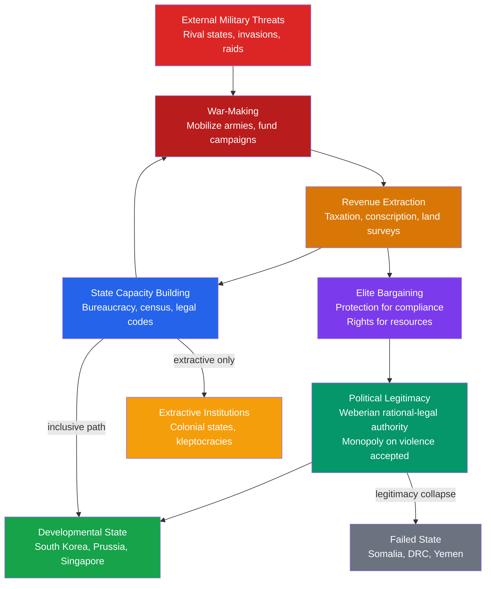

# 🏛️ State Formation and Political Development

> [!abstract] TL;DR
> A state is an organization that successfully claims the monopoly on the legitimate use of physical force within a territory (Weber). Charles Tilly showed that European states were built by war: rulers who needed armies built extraction machines, those extraction machines became permanent bureaucracies, and bargaining with taxpayers over compliance produced rights and institutions. Whether those institutions became extractive or inclusive (Acemoglu and Robinson) determines whether a state produces prosperity or stagnation. Fukuyama synthesizes the challenge as achieving three simultaneous achievements — a strong capable state, rule of law that constrains even the state, and democratic accountability — in the right sequence, since getting the order wrong produces either tyranny or disorder.

---

## Intuition — analogy FIRST

Think of the state as the world's most successful protection racket. A gang that controls a neighborhood demands money from merchants and residents in exchange for keeping rivals out. If that gang stays in power long enough, builds reliable enforcement, adjudicates disputes consistently, and the residents stop questioning its right to collect payment — it has become a government. The fee becomes a tax; the muscle becomes a police force; the boss's word becomes law.

Tilly himself used this analogy deliberately. The difference between the Sicilian Mafia and the Italian Republic is not the violence — both use it — but that the Italian state has survived long enough and built enough administrative infrastructure that citizens accept its monopoly on violence as *legitimate*. Legitimacy is just durability plus bureaucratic routinization.

This analogy reveals the engine: competition between proto-states forces the most effective ones to out-extract and out-administer their rivals. States that faced constant military competition — Prussia, France, England — built the most capable administrations. States that faced no competition, or whose rulers simply extracted for personal consumption rather than military reinvestment, built nothing lasting.

---

## How It Works



---

## Key Concepts / Details

### Secondary Level

**Weber's Definition of the State**

Max Weber (1919) gave the foundational modern definition: the state is the human community that successfully claims the *monopoly on the legitimate use of physical force* within a given territory. Three elements are critical:

| Element | Meaning | Example |
|---------|---------|---------|
| Monopoly | No other actor can legitimately use violence | Police can arrest; citizens cannot take justice into their own hands |
| Legitimacy | Citizens accept the claim as right, not just inevitable | A tax collector is obeyed; a highway robber is not — even if both take your money |
| Territory | The claim is bounded geographically | The French state cannot legitimately coerce someone in Germany |

Weber identified three **ideal types of legitimate authority**:
1. **Traditional authority** — accepted because "it has always been this way" (monarchies, tribal chieftains)
2. **Charismatic authority** — accepted because of the personal qualities of a leader (prophets, revolutionary leaders)
3. **Rational-legal authority** — accepted because of impersonal rules and procedures (modern bureaucratic states, constitutions)

The trajectory of state development is largely a movement from traditional and charismatic toward rational-legal authority. When rational-legal authority is stable, impersonal, and self-reinforcing, you have a modern state.

**The Three Core Functions States Perform**

1. **Security**: protecting the population from internal and external violence — the foundational public good
2. **Rule of law**: enforcing contracts, property rights, and dispute resolution impersonally
3. **Accountability**: mechanisms by which citizens can sanction rulers (elections, courts, civil society)

Fukuyama argues that most political crises arise from a state that is strong in one dimension but weak in another: strong and unaccountable (authoritarian), accountable but too weak to deliver services (fragile democracies), or law-bound but not strong enough to enforce it.

---

### Undergraduate Level

**Tilly's War-Making/State-Making Thesis**

Charles Tilly's *Coercion, Capital, and European States* (1990) is the foundational text. His argument: European states did not emerge by social contract or design — they were the accidental by-product of rulers trying to survive military competition.

The causal chain operates in a self-reinforcing loop:

1. **War-making**: rulers need to defeat enemies
2. **State-making**: rulers need to suppress internal rivals who could undermine war efforts
3. **Protection**: rulers offer protection from external and internal threats
4. **Extraction**: to pay for armies and bureaucracies, rulers tax, conscript, and survey

The key feedback: extraction requires a permanent bureaucracy (you need officials to assess, collect, and enforce taxes). That bureaucracy is the state. But taxation generates resistance; rulers must bargain with those they tax, offering rights and representation in exchange for compliance. English Parliament, French Estates-General, the Cortes — all emerged from this bargain.

**Why not all states developed equally**: Tilly identifies three pathways determined by the balance of *coercion* (armed force) and *capital* (urban commercial wealth) in a region:

| Pathway | Coercion/Capital Balance | Examples | Outcome |
|---------|--------------------------|----------|---------|
| Coercion-intensive | High coercion, low capital | Prussia, Russia | Large armies, heavy extraction, slow commercial development |
| Capital-intensive | Low coercion, high capital | Venice, Dutch Republic | City-states, trading republics, limited territorial reach |
| Capitalized coercion | Balance of both | Britain, France | Modern national state with standing army AND commercial economy |

**State Capacity: Three Dimensions**

Modern political scientists decompose state capacity into three analytically distinct dimensions:

1. **Coercive capacity**: the ability to maintain a monopoly on violence, suppress internal challengers, and defend borders
2. **Administrative capacity**: the ability to implement policy, collect information (censuses, property registries), deliver services, and enforce laws throughout the territory
3. **Fiscal capacity**: the ability to extract revenue from society — tax compliance, breadth of tax base, efficiency of collection

These three dimensions are correlated but not identical. A state may have high coercive capacity but low administrative capacity (e.g., many post-colonial African states could maintain armies but could not deliver health services). Fiscal capacity is typically the binding constraint: without revenue, neither armies nor bureaucracies can be sustained.

**Extractive vs. Inclusive Institutions (Acemoglu and Robinson)**

Daron Acemoglu and James Robinson's *Why Nations Fail* (2012) extends Tilly's framework to explain why some states produce prosperity and others do not.

- **Extractive political institutions**: power concentrated in the hands of a narrow elite who use the state to extract resources from the rest of society. These produce extractive economic institutions (insecure property rights, barriers to entry, forced labor) and stagnate long-run growth.
- **Inclusive political institutions**: power broadly distributed, with constraints on elites. These produce inclusive economic institutions (secure property rights, competitive markets, access to credit) and generate sustained growth.

The critical insight is **path dependence**: the institutions that form during a state's critical juncture tend to persist because those who benefit from them have the political power to reproduce them. Colonial states built extractive institutions precisely because the goal was extraction, not development; those institutions persisted after independence.

Acemoglu, Johnson, and Robinson's empirical strategy: colonial *settler mortality* as an instrument for institutions. Where European settlers could survive (North America, Australia), they built inclusive institutions for themselves. Where they could not (tropical Africa, the Caribbean), they built extractive ones. Settler mortality is correlated with modern-day GDP per capita only through its historical effect on institutions — a powerful natural experiment.

**Colonial Legacies and Path Dependence**

The borders of most post-colonial states in Africa and Asia were drawn by European powers for administrative convenience, not by indigenous political geography. This created three structural problems:

1. **Mismatched ethnicity and territory**: many states contain multiple ethnic, linguistic, and religious communities with no shared history of governance under a common authority — making the legitimation of any central government difficult
2. **Inherited extractive institutions**: the colonial bureaucracy was designed to extract, not to provide public goods or build accountability relationships with citizens
3. **Missing fiscal-military feedback**: colonial states were protected externally by the metropole, so they did not face the Tilly-style competitive pressure that forced European state-building. African states never had to tax their populations to fund armies — so they never built the administrative infrastructure that taxation requires

Jeffrey Herbst (*States and Power in Africa*, 2000) argues this is the central explanation for Africa's governance challenges: without existential military competition, rulers had no incentive to extend administrative power across low-density territories.

---

### Graduate Level

**Fukuyama's Political Order Trilemma**

Francis Fukuyama's *Political Order and Political Decay* (2014) synthesizes the literature into three dimensions that must all be achieved for a modern liberal state:

1. **State strength**: the capacity to extract revenue, maintain security, implement policy, and deliver public goods
2. **Rule of law**: a system of legal rules that bind even the most powerful actors, including the rulers themselves — independent courts, constitutional constraints
3. **Democratic accountability**: mechanisms by which rulers can be sanctioned and replaced by those they govern

The **sequencing problem**: getting these three in the wrong order is fatal.
- Rule of law before a strong state → laws exist but cannot be enforced (weak state, predatory elites)
- State before rule of law → the strong state is above the law (authoritarianism)
- Accountability before rule of law → elections produce majoritarian tyranny or democratic backsliding

Fukuyama argues China achieved strength first, is still working on rule of law, and has deferred accountability. The United States achieved all three but in historical sequence: strong state → rule of law → democracy. Most post-colonial states have been pushed to attempt democratic accountability first, before either state capacity or rule of law is consolidated.

**Developmental States**

The developmental state literature (Chalmers Johnson on Japan, Peter Evans on Brazil and Korea, Robert Wade on East Asian NICs) identifies a specific state form that drove late industrialization:

- **Embedded autonomy** (Evans): the state bureaucracy is insulated from narrow private interests (autonomy) but maintains close ties with the private sector to gather information and coordinate investment (embeddedness). The worst outcome is "capture" — where business interests colonize the state. The best outcome is a Weberian bureaucracy that cooperates with capitalists without being owned by them.
- **Pilot agency** (Johnson): an elite economic ministry (MITI in Japan, EPB in South Korea) with broad authority to direct industrial policy, protected from electoral pressure, staffed by meritocratic elite
- **Selective industrial policy**: protecting and subsidizing targeted industries during their infant phase, then withdrawing support as they become competitive — export discipline as a check on infant industry protection

South Korea is the canonical case: Park Chung-hee's authoritarian state (1961-1979) directed credit to chaebol, required export performance as a condition for ongoing support, forced high saving rates through financial repression, and invested heavily in universal secondary education. From $600 GDP per capita in 1960 to $30,000+ in 2020.

The key condition that distinguishes developmental states from merely extractive ones: **performance discipline**. Korean chaebols received preferential credit only so long as they hit export targets. When they failed, support was withdrawn. This is absent from most rent-distributing states, where political connections substitute for economic performance.

**Modernization Theory vs. Dependency Theory**

| Dimension | Modernization Theory (Lipset, Rostow) | Dependency Theory (Frank, Cardoso) |
|-----------|---------------------------------------|------------------------------------|
| Core claim | Development follows a universal linear sequence from traditional to modern; integration into the global economy accelerates it | Underdevelopment is structurally produced by the relationship between core and periphery; integration deepens dependence |
| Policy implication | Open up to trade, FDI, and western institutions | Protect infant industries, break dependency through autonomous development |
| Evidence | East Asian NICs followed modernization path (roughly) | Latin American economies stagnated under export-led growth 1870-1930 |
| Fatal weakness | Ignores power and history; conflates correlation of wealth and democracy with causation | Structural determinism; underestimates agency and variation within the periphery |

Neither framework survives contact with the data unscathed. The synthesis — **new institutional economics** — argues the key variable is institutions: states that build inclusive institutions can converge regardless of their starting colonial position, but the political economy of institutional change is path-dependent and often requires a shock (revolution, war, decolonization) to break out of an extractive equilibrium.

**Critical Junctures and Institutional Lock-In**

Acemoglu, Robinson, and others emphasize **critical junctures** — moments of historical contingency (the Black Death, the Atlantic slave trade, the arrival of European colonizers) where small differences in initial conditions produce large long-run divergences because early institutional choices become self-reinforcing.

The mechanism: extractive institutions concentrate power and resources in a narrow elite. That elite has both the incentive and the resources to reproduce the institutions that benefit it, and to block institutional change (creative destruction threatens their position). The solution (replacing extractive with inclusive institutions) requires political mobilization that can overcome elite resistance — typically only possible during critical junctures when elite power is temporarily disrupted.

---

## Python Demo

```python
import numpy as np
from scipy.integrate import odeint
import matplotlib.pyplot as plt

def state_capacity_ode(C, t, alpha, W, delta):
    """
    Tilly's war-making/state-making model as a first-order ODE.

    dC/dt = alpha * W * (1 - C) - delta * C

    C     : state capacity (0 = no state, 1 = full administrative coverage)
    alpha : efficiency at which war pressure converts into administrative capacity
    W     : war frequency / external threat intensity (0 to 1)
    delta : institutional decay rate -- scales with territory size and
            absence of performance incentives

    Analytical equilibrium (dC/dt = 0):
        C* = (alpha * W) / (alpha * W + delta)

    Key implications of the equilibrium formula:
      - Higher W (more external threat) -> higher steady-state capacity
      - Higher delta (larger territory, weaker fiscal base) -> lower capacity
      - Without war pressure (W = 0), capacity decays to zero
    """
    dCdt = alpha * W * (1.0 - C) - delta * C
    return dCdt


# ------------------------------------------------------------------ #
# Parameters
# ------------------------------------------------------------------ #
t = np.linspace(0, 300, 1500)   # 300 years of state development
C0 = 0.05                        # initial low state capacity
alpha = 0.06                     # conversion efficiency (held constant)

# Four archetypes drawn from Tilly's comparative history
scenarios = [
    {
        "label": "Prussia -- high threat, compact territory",
        "W": 0.80, "delta": 0.010, "color": "#2563eb",
    },
    {
        "label": "Ottoman Empire -- high threat, vast territory",
        "W": 0.75, "delta": 0.045, "color": "#dc2626",
    },
    {
        "label": "Switzerland post-1648 -- low threat, compact",
        "W": 0.20, "delta": 0.010, "color": "#16a34a",
    },
    {
        "label": "Congo basin -- low threat, vast territory",
        "W": 0.10, "delta": 0.060, "color": "#d97706",
    },
]

# ------------------------------------------------------------------ #
# Plot 1: Capacity trajectories over time
# ------------------------------------------------------------------ #
fig, axes = plt.subplots(1, 2, figsize=(13, 5))

for s in scenarios:
    C_eq = alpha * s["W"] / (alpha * s["W"] + s["delta"])
    sol = odeint(state_capacity_ode, C0, t,
                 args=(alpha, s["W"], s["delta"]))
    axes[0].plot(
        t, sol.flatten(), color=s["color"], linewidth=2,
        label=f'{s["label"]}\n  C* = {C_eq:.2f}'
    )

axes[0].set_xlabel("Time (years)")
axes[0].set_ylabel("State Capacity C(t)")
axes[0].set_title("Tilly's Model: Capacity Trajectories by Archetype")
axes[0].set_ylim(0, 1.0)
axes[0].legend(fontsize=6.5, loc="lower right")
axes[0].axhline(y=0.5, color="gray", linestyle="--", alpha=0.4)
axes[0].text(280, 0.52, "C = 0.5 threshold", fontsize=7, color="gray")

# ------------------------------------------------------------------ #
# Plot 2: Phase diagram -- equilibrium capacity vs war frequency
# ------------------------------------------------------------------ #
W_range = np.linspace(0.0, 1.0, 300)

territory_cases = [
    ("Compact territory (delta = 0.01)", 0.010, "#2563eb"),
    ("Medium territory  (delta = 0.03)", 0.030, "#7c3aed"),
    ("Vast territory    (delta = 0.06)", 0.060, "#dc2626"),
]

for label, delta, color in territory_cases:
    C_eq_curve = alpha * W_range / (alpha * W_range + delta)
    axes[1].plot(W_range, C_eq_curve, color=color, linewidth=2, label=label)

axes[1].axvspan(0, 0.3, alpha=0.06, color="#16a34a")
axes[1].axvspan(0.3, 0.7, alpha=0.06, color="#d97706")
axes[1].axvspan(0.7, 1.0, alpha=0.06, color="#dc2626")
axes[1].text(0.05, 0.93, "low threat", fontsize=7, color="#16a34a")
axes[1].text(0.38, 0.93, "moderate", fontsize=7, color="#d97706")
axes[1].text(0.74, 0.93, "high threat", fontsize=7, color="#dc2626")

axes[1].set_xlabel("War Frequency W")
axes[1].set_ylabel("Equilibrium State Capacity C*")
axes[1].set_title("Phase Diagram: C* = f(W, territory)")
axes[1].legend(fontsize=8)
axes[1].set_ylim(0, 1.0)

plt.tight_layout()
plt.savefig("tilly_state_capacity.png", dpi=150)

# ------------------------------------------------------------------ #
# Print equilibrium table
# ------------------------------------------------------------------ #
print("Tilly Model -- Equilibrium State Capacities\n" + "-" * 55)
for s in scenarios:
    C_eq = alpha * s["W"] / (alpha * s["W"] + s["delta"])
    half_life = np.log(2) / (alpha * s["W"] + s["delta"])
    print(f'  {s["label"][:45]:<45}  C* = {C_eq:.3f}  half-life = {half_life:.0f} yrs')
```

**What the model shows:**
- Prussia-type state (high W, low delta): C* = 0.83 — the Tilly prediction that war-pressure in compact, high-threat environments produces the most capable states
- Ottoman-type state (high W, large territory): C* = 0.50 — threat generates capacity but administrative load of vast territory caps it, explaining why the Ottoman state had powerful armies but fragile provincial administration
- Congo-basin (low W, large territory): C* = 0.09 — without competitive pressure and with vast, low-density territory, capacity barely emerges above the initial condition

---

## Real-World Applications

**Prussia and the Fiscal-Military State**

Prussia in the 17th–18th centuries is Tilly's prototype. Surrounded by the Habsburg Empire, Sweden, Russia, and France, Brandenburg-Prussia faced near-constant existential threat. The Hohenzollern rulers built an exceptionally capable tax-collection machine specifically to fund the Junker army. The Prussian General Directory (1723) centralized fiscal administration in a way unprecedented in Europe. By 1740, Prussia spent 80% of state revenue on the military — and built the administrative infrastructure that eventually became the German bureaucratic tradition. Weber drew his ideal type of rational-legal bureaucracy directly from the Prussian civil service.

**South Korea and Singapore: Developmental State Archetypes**

South Korea under Park Chung-hee (1961-1979) exemplifies embedded autonomy. The Economic Planning Board coordinated industrial policy; the state channeled credit through state-controlled banks to chaebols; export performance was the condition for continued support (with violators cut off). The state was strong enough to discipline capital rather than being captured by it. Singapore under Lee Kuan Yew built a meritocratic civil service (among the best-paid in the world, to prevent corruption) and used the state to attract FDI rather than build national champions — but the same logic applied: a capable, insulated bureaucracy with clear developmental goals.

**Somalia and the DRC: Failed State Pathology**

Somalia after 1991 and the DRC after Mobutu illustrate what happens when the state collapses to below the threshold of legitimacy. In Somalia, clan militias provide local protection but cannot achieve the territorial monopoly required to be a state. The result is a war of all against all at the macro level — multiple protection rackets in competition, none strong enough to eliminate the others and provide the public good of security at national scale. The irony: Somali markets (livestock, remittances, mobile money) are surprisingly functional at the micro level — people find private substitutes for the public goods the state cannot provide. But without a state, large-scale investment, property rights, and industrial development are impossible.

**Post-Colonial Africa: The Herbst Problem**

Herbst's central observation: African colonial borders were accepted at independence (the OAU norm of *uti possidetis*) to prevent fragmentation, but those borders enclosed vast, low-density territories that the colonial powers never fully administered. Post-colonial rulers had no military competition from neighboring states (borders were frozen), so they had no Tilly-style incentive to build extraction infrastructure reaching into the rural periphery. The result: nominal sovereignty over territory combined with actual administrative presence only in capital cities — what Robert Jackson called "quasi-states" with juridical statehood but empirical absence.

---

## Common Pitfalls

- **Equating state strength with authoritarianism** — A strong state (high capacity) and an unaccountable state are independent dimensions. Sweden has extremely high state capacity and robust democracy. The error is assuming that building state capacity requires sacrificing accountability, when in fact the most capable states tend to be the most rule-bound (the Weberian bureaucracy is constrained by impersonal rules).

- **Treating failed states as natural or permanent** — Failed states are not the natural condition of societies that "weren't ready" for statehood. They are the result of specific historical processes: colonial extraction without institution-building, Cold War proxy wars that destroyed administrative capacity, and structural adjustment programs that hollowed out public sectors. Reversibility is possible — Liberia, Mozambique, and Rwanda have all made substantial recovery from state collapse.

- **Assuming institutional transplant works** — Post-Cold War liberal peacebuilding assumed that importing Western institutions (multiparty elections, constitutions, independent courts) would produce functioning states. It largely failed because institutions are not the same as the political equilibria that sustain them. An election held before a state has administrative capacity to enforce results produces disputed outcomes. A constitution adopted before rule-of-law norms are internalized becomes a decorative document.

- **Modernization teleology** — Assuming all states are on a linear progression toward liberal democracy conflates a correlation (wealthy countries tend to be democratic) with a causal sequence. Many wealthy authoritarian states (Gulf monarchies, Singapore) have not democratized; many poor democracies remain poor. The sequencing and the mechanisms matter more than the endpoint.

- **Ignoring the fiscal-administrative nexus** — Policy debates about governance often focus on transparency, elections, or anti-corruption without noticing that the binding constraint is simply administrative capacity: states cannot deliver services they cannot organize, fund, or staff. Tax reform and cadastral surveys (property registration) are unglamorous but more foundational than institutional design.

- **Conflating de jure and de facto sovereignty** — International law grants juridical sovereignty to any recognized state regardless of its ability to control its territory. This creates a category of "quasi-states" that exist on paper but not in administrative reality, and misleads analysis when de jure status is treated as evidence of actual state capacity.

---

## Related Concepts

- [[_MOC_Comparative_Politics|↑ Comparative Politics MOC]]
- [[Development_Economics]] — Acemoglu and Robinson's institutions hypothesis is the microfoundation of the state capacity → prosperity link; colonial settler mortality as instrument for institutions
- [[Solow_Growth_Model]] — The Solow residual (TFP) captures the institutional environment; state capacity is a major determinant of TFP across countries
- [[Human_Capital_and_Education]] — Developmental states invested heavily in universal education; state capacity is required to build and maintain school systems at scale
- [[Budget_Deficits_and_Debt]] — Fiscal capacity (the ability to tax) is the foundation of state capacity; states unable to tax run chronic deficits and cannot fund public goods
- [[Tax_Policy]] — Tax systems are both the product of state capacity and the mechanism by which it is sustained; Tilly's extraction-administration feedback runs through the fiscal system
- [[Nash_Equilibrium]] — War and state-building can be modeled as a game: the Tilly mechanism is a repeated interaction where both rulers and taxpayers have equilibrium strategies; the state emerges from a Nash equilibrium of the protection bargain
- [[Bargaining_Theory]] — Tilly's war-making/state-making process is fundamentally a bargaining relationship between rulers and those they extract from; the terms of that bargain determine institutional form
- [[Public_Goods]] — Security is the archetypal public good (non-excludable, non-rival) that justifies the state's existence; state capacity is what makes provision of public goods possible

---

## Review Questions

### Secondary

1. Weber defines the state as the organization that claims a monopoly on the legitimate use of physical force in a territory. Why does *legitimacy* matter — why is a well-organized criminal gang not a state, even if it controls a neighborhood?
2. What are the three functions a modern state is expected to perform? Give one real-world example where a state performs one well but fails at another.
3. Tilly argued that war made states in Europe. Give one piece of evidence that supports this claim and explain the mechanism: how does fighting wars lead to building bureaucracies?

### Undergraduate

1. Tilly identifies three pathways to state formation (coercion-intensive, capital-intensive, capitalized coercion) determined by the regional balance of armed force and commercial wealth. Apply this typology: why did Prussia and Venice produce such different state forms despite both being successful European polities?
2. Acemoglu and Robinson use colonial settler mortality as an instrument for institutions. Explain what an instrument variable does, why settler mortality qualifies as one, and what the finding implies for the relative importance of geography vs. institutions in explaining cross-country income differences.
3. Jeffrey Herbst argues that post-colonial African states face a structural disadvantage because they lack the competitive military pressure that drove European state-building. Evaluate this argument: what does it explain, and what does it fail to explain (consider Rwanda, Eritrea, or other cases where conflict did not produce capacity)?

### Graduate

1. Fukuyama argues that the sequence in which the three pillars of political order (strong state, rule of law, democratic accountability) are achieved matters more than whether they are achieved. Construct a comparative argument: why did England's path (strong state → rule of law → democracy) produce a stable liberal order while post-colonial states following the reverse sequence (democracy first) often face instability?
2. Peter Evans' concept of "embedded autonomy" is offered as the explanation for developmental state success. What is the theoretical tension between autonomy and embeddedness, and under what conditions does this tension produce superior development outcomes rather than either capture (too much embeddedness) or ineffective paternalism (too much autonomy)?
3. The Acemoglu-Robinson framework predicts institutional persistence through elite resistance to creative destruction. Yet some countries have made the transition from extractive to inclusive institutions — England's Glorious Revolution (1688) is the canonical case. Using the theory's own logic, identify the necessary conditions for such a transition and evaluate whether they can be deliberately engineered by international actors (e.g., through conditionality, international courts, or external constitutional assistance).

---

## Sources

- Max Weber, *Politik als Beruf* ("Politics as a Vocation"), 1919
- Charles Tilly, *Coercion, Capital, and European States, AD 990–1992*, Blackwell, 1990
- Daron Acemoglu & James A. Robinson, *Why Nations Fail: The Origins of Power, Prosperity, and Poverty*, Crown, 2012
- Daron Acemoglu, Simon Johnson & James A. Robinson, "The Colonial Origins of Comparative Development: An Empirical Investigation," *American Economic Review* 91(5), 2001
- Francis Fukuyama, *Political Order and Political Decay: From the Industrial Revolution to the Globalization of Democracy*, Farrar, Straus and Giroux, 2014
- Francis Fukuyama, *The Origins of Political Order: From Prehuman Times to the French Revolution*, Farrar, Straus and Giroux, 2011
- Peter Evans, *Embedded Autonomy: States and Industrial Transformation*, Princeton University Press, 1995
- Jeffrey Herbst, *States and Power in Africa: Comparative Lessons in Authority and Control*, Princeton University Press, 2000
- Robert H. Jackson, *Quasi-States: Sovereignty, International Relations and the Third World*, Cambridge University Press, 1990
- Chalmers Johnson, *MITI and the Japanese Miracle: The Growth of Industrial Policy 1925–1975*, Stanford University Press, 1982

---

#PoliticalScience #ComparativePolitics #StateFormation #PoliticalDevelopment #StateCapacity #Tilly #Weber #Institutions
