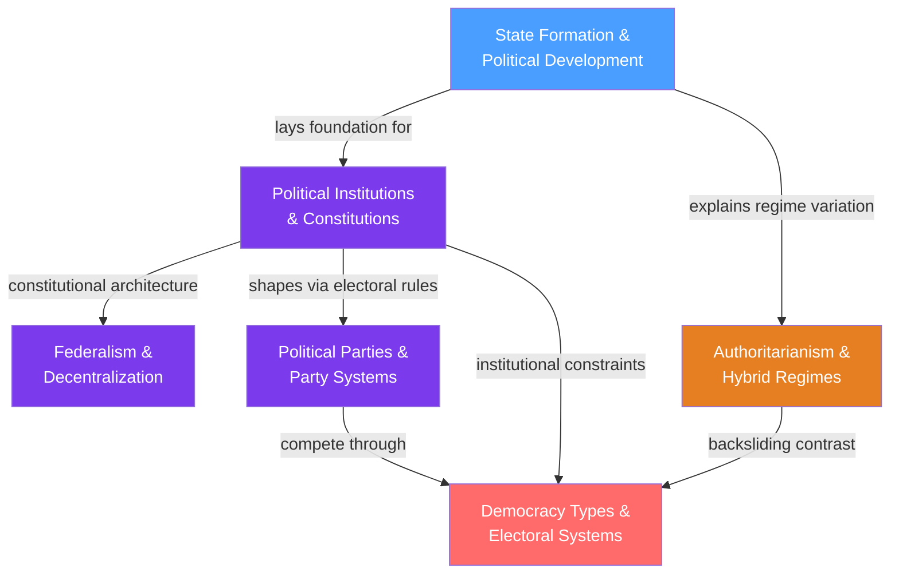

# Comparative Politics — Section Map of Content

> [!abstract] Section Overview
> Comparative Politics examines how political systems are built, organized, and sustained — or how they break down. The section begins with the most foundational question (what is a state and how does it form?) and works outward through institutional design, the distribution of authority, the dynamics of regime types, the organizations that compete for power, and ultimately the electoral mechanisms that determine who governs. Together, the six notes provide the analytical tools to compare any two political systems across regime type, institutional structure, and party competition.

---

## Section Concept Map

*(Blue = foundational entry point, Purple = intermediate structural notes, Orange = regime contrast, Red = advanced culminating note; arrows = "leads to" or "requires")*

---

## Notes in This Section

| Note | Core Framework | Key Thinkers | Level |
|------|---------------|-------------|-------|
| [[State_Formation_and_Political_Development]] | Weber's monopoly on violence; Tilly's war-makes-states thesis; inclusive vs. extractive institutions; Fukuyama's political order trilemma | Weber, Tilly, Acemoglu & Robinson, Fukuyama, Evans | Foundational |
| [[Political_Institutions_and_Constitutions]] | Constitutions as credible commitment devices; separation of powers; veto player theory; gradual institutional change | Montesquieu, North & Weingast, Tsebelis, Mahoney & Thelen, Linz | Intermediate |
| [[Federalism_and_Decentralization]] | Constitutional division of authority across tiers; fiscal federalism; Tiebout sorting; market-preserving federalism; multilevel governance | Tiebout, Oates, Riker, Weingast, Bednar | Intermediate |
| [[Authoritarianism_and_Hybrid_Regimes]] | Regime spectrum from democracy to totalitarianism; competitive authoritarianism; selectorate theory; democratic backsliding | Linz, Levitsky & Way, Bueno de Mesquita, Bermeo, Gerschewski | Intermediate |
| [[Political_Parties_and_Party_Systems]] | Cleavage theory; party organizational evolution from cadre to cartel; Sartori's system typology; spatial voting models | Lipset & Rokkan, Sartori, Katz & Mair, Michels, Downs | Intermediate |
| [[Democracy_Types_and_Electoral_Systems]] | Electoral system families; Duverger's Law; Lijphart's consensus vs. majoritarian democracy; Arrow's impossibility; veto players | Dahl, Lijphart, Duverger, Arrow, Tsebelis, Downs | Advanced |

---

## Learning Paths

### Path 1 — Regime Types Track
*Recommended for students asking: "Why do some states become democratic and others authoritarian?"*

1. [[State_Formation_and_Political_Development]] — establishes what a state is, how it acquires capacity, and why some inherit extractive institutions; Weber and Tilly provide the baseline
2. [[Authoritarianism_and_Hybrid_Regimes]] — examines the vast middle ground between democracy and totalitarianism; selectorate theory explains the rational logic of autocratic survival
3. [[Political_Parties_and_Party_Systems]] — parties are the key intermediaries; understand how cleavage structures produce party families and how hegemonic party systems shade into authoritarianism
4. [[Democracy_Types_and_Electoral_Systems]] — the culminating note: having understood how regimes form and what threatens them, explore the institutional mechanics that distinguish democratic quality

### Path 2 — Institutional Design Track
*Recommended for students asking: "How should political authority be structured to produce stable, effective, and accountable government?"*

1. [[State_Formation_and_Political_Development]] — grounds the analysis in the conditions under which institutions first emerge and why some settings produce capable states while others do not
2. [[Political_Institutions_and_Constitutions]] — the architecture of authority: constitutions, separation of powers, veto players, and the credible commitment problem that all institutional design must solve
3. [[Federalism_and_Decentralization]] — extends constitutionalism vertically: how to distribute authority across national, regional, and local tiers; fiscal federalism and Tiebout competition
4. [[Democracy_Types_and_Electoral_Systems]] — applies institutional analysis to the specific design of democratic competition: executive form, electoral formula, and their consequences for governance quality

---

## Cross-Section Connections

- **Links to S01 (Political Theory):** State Formation connects directly to social contract theory — Hobbes's Leviathan and Locke's consent of the governed are theoretical precursors to Tilly and Weber. Political Institutions and Constitutions is applied Montesquieu (separation of powers) and Locke (limited government). Democracy Types draws on Rousseau's general will and Mill's arguments for representative government over direct democracy.

- **Links to S04 (Public Policy):** Federalism and Decentralization is the structural foundation for intergovernmental policy implementation — which tier delivers which services, how conditional grants shape state behavior, and why fiscal federalism design determines whether redistributive policy reaches its targets. The veto player framework from Political Institutions explains policy gridlock directly relevant to the policy process.

---

## Cross-Vault Links

- **Game Theory vault** — Nash Equilibrium, Power Indices, Coalitional Games, Repeated Games, and Bargaining Theory all appear across multiple notes. Electoral strategic voting is a Nash coordination game (Democracy Types). Authoritarian survival is a repeated game equilibrium (Authoritarianism). Federal bargains are coalitional games (Federalism). Tilly's protection-extraction bargain is a bargaining game (State Formation).

- **Macroeconomics vault** — Development Economics and Acemoglu-Robinson's institutional hypothesis appear in State Formation and Political Institutions. Fiscal federalism (Federalism note) draws on Tax Policy, Budget Deficits, Government Spending Multiplier, and Automatic Stabilizers. The Solow residual as a proxy for institutional quality links State Formation to growth theory.

- **Microeconomics vault** — Public Goods theory underpins all six notes: security is the archetypal public good (State Formation), rule of law and constitutional order are public goods (Political Institutions), local public goods allocation is the engine of the Tiebout model (Federalism), and democratic institutions are public goods subject to free-riding (Democracy Types). Market Failures logic drives the case for central coordination over decentralized provision in Federalism.

- **Psychology vault** — Authoritarianism draws heavily on Social Influence and Conformity (Milgram's obedience, manufactured consent), Group Dynamics (groupthink in inner circles), Prejudice and Discrimination (scapegoating as a legitimation tool), and Cognitive Biases (information control exploiting availability bias). Political Parties connects to Social Identity Theory for partisan identity and Social Influence for party-cue heuristics.

---

[[_MOC_Political_Science_Master]]

#MOC #PoliticalScience #ComparativePolitics #SectionMOC
